# TryHackMe: Year of the Rabbit Writeup
This box is rated easy difficulty on THM. It involves us brute forcing an FTP login after finding a password list from hidden image data, decoding an obscure programming language, and exploiting Sudo permissions to grab a root shell.
Time to enter the warren…


## Scanning & Enumeration
I start with an Nmap scan on the given IP to find all running services.


There's just three ports open:
- FTP on port 21
- SSH on port 22
- An Apache web server on port 80

Anonymous login is not enabled for FTP and this OpenSSH version is only prone to username enumeration, so I head over to the webpage.

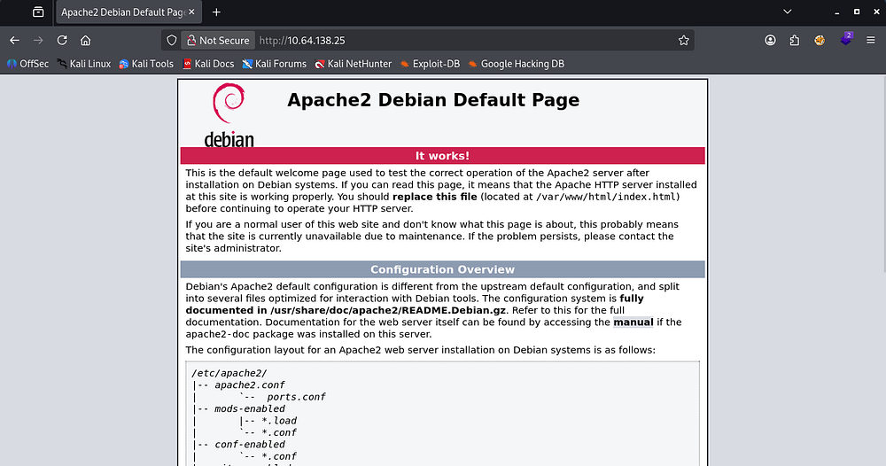

This is the default boilerplate Apache landing page, which won't give us anything. Nothing on robots.txt either so I start a dirsearch to find hidden directories.

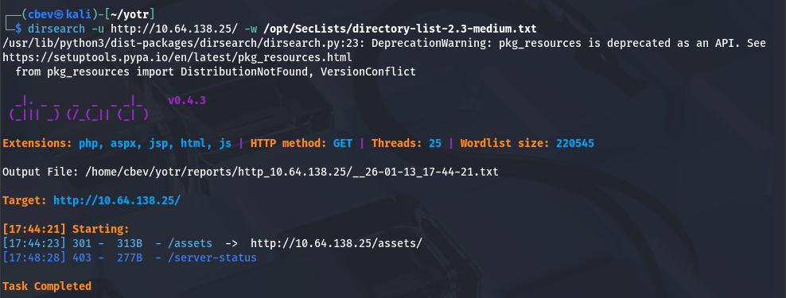

I discover an /assets folder which contains a rickroll.mp4 and a style.css file. Looking in the css file discloses an endpoint for a flag.

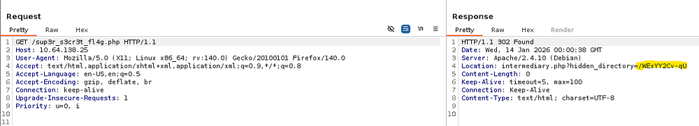

Navigating to it tells us to turn our javascript off. We can do this by typing about:config in the URL (for firefox) and searching for javascript.enabled. 
After switching that to false and reloading the flag page, I find that there is a clue hidden in the video. Pretty sure that was a rabbit hole, so I ended up capturing the request to the flag page and see that there's an intermediary location at a hidden directory.


Heading over there, I find only one file. I download it using wget and start looking for hidden image data.

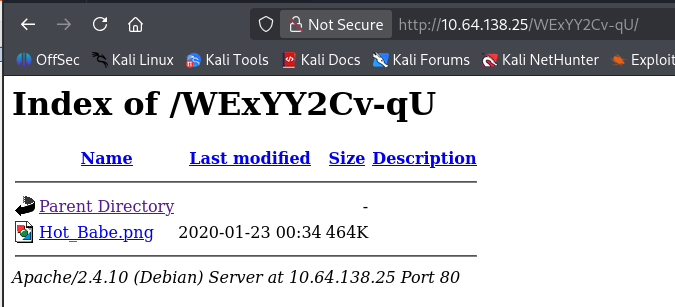


## Hidden Data
That's definitely a hot babe. While using exiftool, it returns a warning that there is trailer data after the PNG ends.

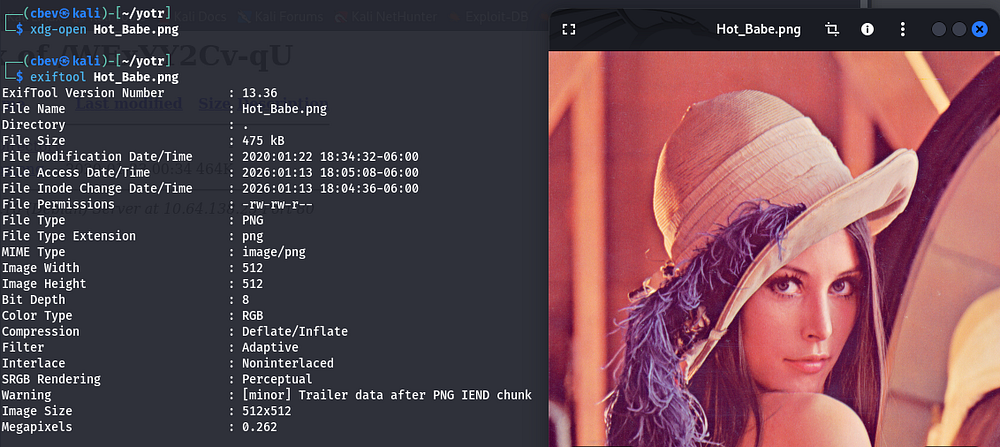

Listing all data with the Strings utility gives us a password list we can use to brute force FTP with.

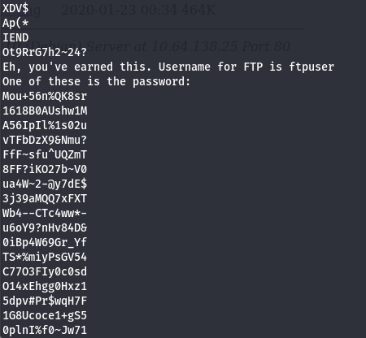

I dump these into a wordlist and use hydra to brute force the FTP login as ftpuser.

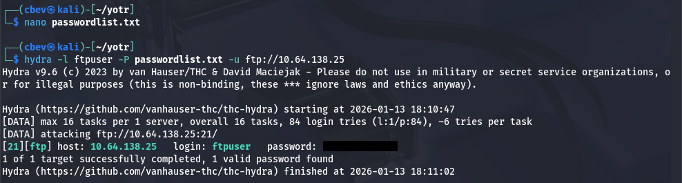

I login to find one file named Eli's_Creds.txt and download it.

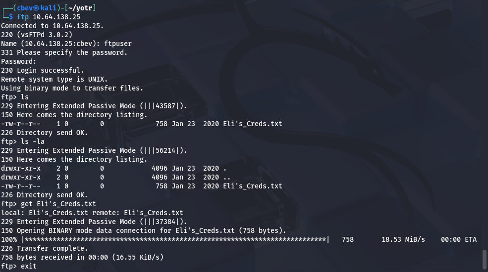

Opening it gives us some obscure encoded lines.

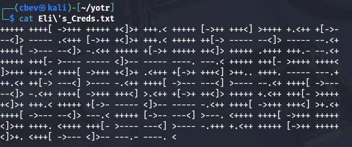

This reminds me of an old programming language specifically made to f*ck your brain when using it, conveniently called brainfuck. I find an online tool to decode this and get Eli's credentials for SSH.

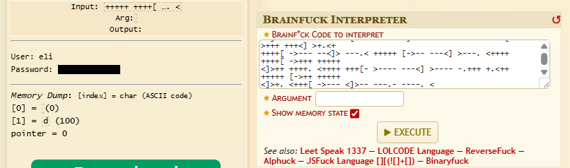


## Privilege Escalation
Logging in shows a message left by Root to a user named Gwendoline speaking of a secret hiding place for other messages.

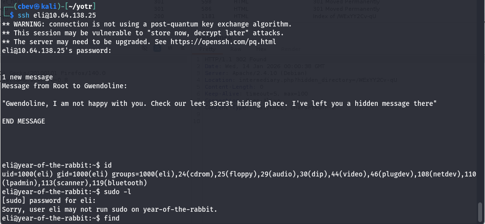

ssh loginI use find with that special spelling of secret and find a directory named s3cr3t under /usr/games.

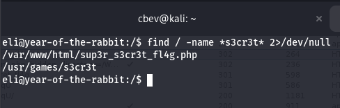

hidden directoryThis contains Gwendoline's password along with a message telling her it's way too weak.

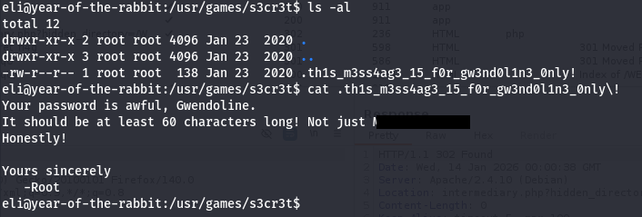

gwen's passwordFrom here we can switch users to Gwen and grab the user flag under her home directory. Next, I go about the typical routes for root privesc.

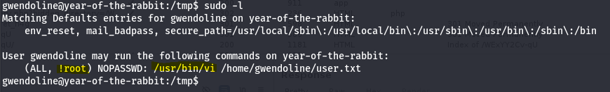

Gwen's sudo permissionsThe only thing of note was that we're allowed to run a Sudo command on the vi binary, but only on the /home/gwendoline/user.txt file and not as root. I spend some time researching into bypasses for this and discover CVE-2019–14287.
There is a proof of concept which allows us to spawn a bash shell as root while bypassing these security controls. 

We just need to specify the user as #-1 which tricks Sudo into running our command as root.

```bash
sudo -u#-1 /usr/bin/vi /home/gwendoline/user.txt
```

Using that command let's us run vi as root. Once we're in the editing terminal hit escape and type !/bin/bash in the bottom to spawn a shell. All that's left is to grab our well earned root flag.

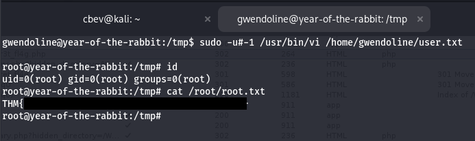

This box is an introductory challenge to the 'Year of the ____' boxes, so if you're up for it, check out the harder ones made by MuirlandOracle as well. I hope this was helpful to anyone stuck or following along and happy hacking!
