This box is ranked medium difficulty on THM, it involves us uploading a reverse shell using FTP anonymous login and then abusing a SUID bit set on an important binary to grab a root shell.

_Not the hacking group_

## Scanning & Enumeration
Starting with an Nmap scan to find all running services for the given host IP:

```
$ sudo nmap -p21,22,139,445 -sCV 10.64.154.38 -oN fullscan.tcp

Starting Nmap 7.95 ( https://nmap.org ) at 2025-12-30 17:23 CST
Nmap scan report for 10.64.154.38
Host is up (0.044s latency).

PORT    STATE SERVICE     VERSION
21/tcp  open  ftp         vsftpd 2.0.8 or later
| ftp-anon: Anonymous FTP login allowed (FTP code 230)
|_drwxrwxrwx    2 111      113          4096 Jun 04  2020 scripts [NSE: writeable]
| ftp-syst: 
|   STAT: 
| FTP server status:
|      Connected to ::ffff:192.168.144.86
|      Logged in as ftp
|      TYPE: ASCII
|      No session bandwidth limit
|      Session timeout in seconds is 300
|      Control connection is plain text
|      Data connections will be plain text
|      At session startup, client count was 1
|      vsFTPd 3.0.3 - secure, fast, stable
|_End of status
22/tcp  open  ssh         OpenSSH 7.6p1 Ubuntu 4ubuntu0.3 (Ubuntu Linux; protocol 2.0)
| ssh-hostkey: 
|   2048 8b:ca:21:62:1c:2b:23:fa:6b:c6:1f:a8:13:fe:1c:68 (RSA)
|   256 95:89:a4:12:e2:e6:ab:90:5d:45:19:ff:41:5f:74:ce (ECDSA)
|_  256 e1:2a:96:a4:ea:8f:68:8f:cc:74:b8:f0:28:72:70:cd (ED25519)
139/tcp open  netbios-ssn Samba smbd 3.X - 4.X (workgroup: WORKGROUP)
445/tcp open  netbios-ssn Samba smbd 4.7.6-Ubuntu (workgroup: WORKGROUP)
Service Info: Host: ANONYMOUS; OS: Linux; CPE: cpe:/o:linux:linux_kernel

Host script results:
| smb2-time: 
|   date: 2025-12-30T23:23:38
|_  start_date: N/A
| smb-security-mode: 
|   account_used: guest
|   authentication_level: user
|   challenge_response: supported
|_  message_signing: disabled (dangerous, but default)
| smb-os-discovery: 
|   OS: Windows 6.1 (Samba 4.7.6-Ubuntu)
|   Computer name: anonymous
|   NetBIOS computer name: ANONYMOUS\x00
|   Domain name: \x00
|   FQDN: anonymous
|_  System time: 2025-12-30T23:23:39+00:00
| smb2-security-mode: 
|   3:1:1: 
|_    Message signing enabled but not required
|_nbstat: NetBIOS name: ANONYMOUS, NetBIOS user: <unknown>, NetBIOS MAC: <unknown> (unknown)

Service detection performed. Please report any incorrect results at https://nmap.org/submit/ .
Nmap done: 1 IP address (1 host up) scanned in 13.57 seconds
```

We have four ports open:
- FTP on port 21
- SSH on port 22
- SMB on ports 139 and 445

I’m going to start by enumerating FTP as anonymous login is allowed and then move onto SMB shares as SSH is the only definitely secure option here.

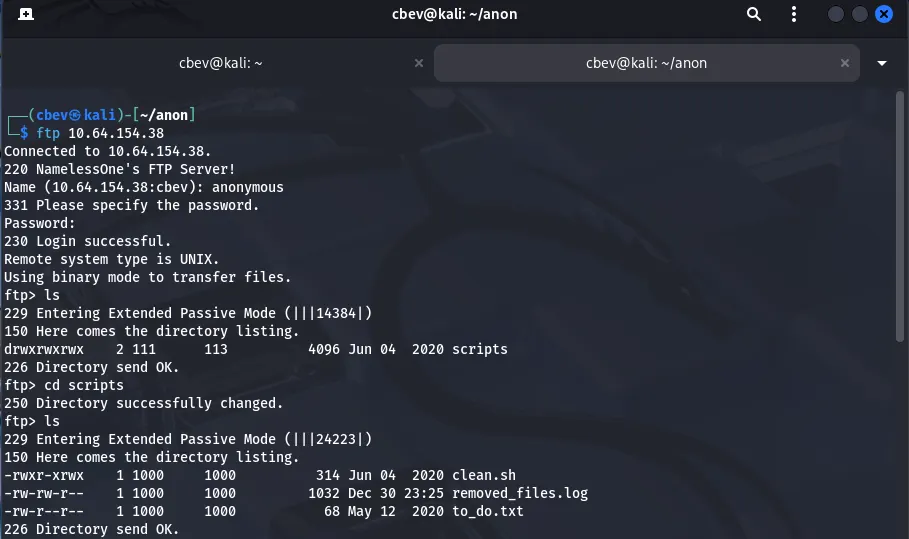

We have three files in the scripts directory, first is a .sh script used to remove temporary files off of the system and log them into removed_files.log.

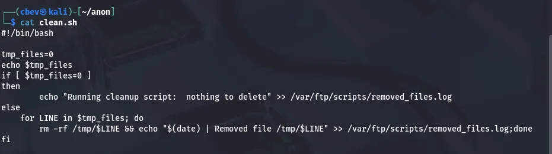

Then we have removed_files.log which gives some insight into what’s happening with the script.

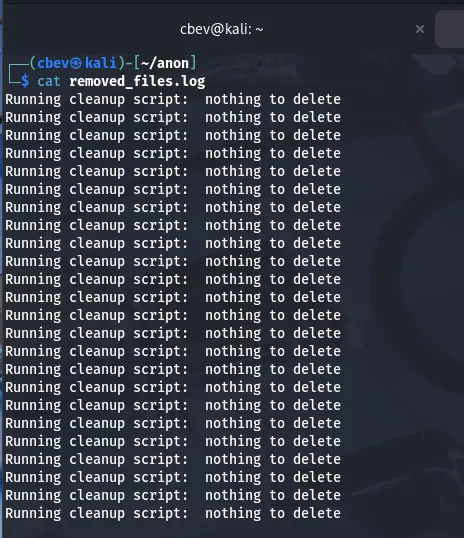

Last, there’s a todo list saying that they need to disable anonymous login as it isn’t secure. That sure is right.

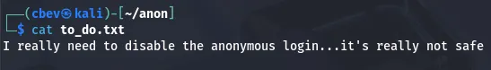

FTP gave us some info on a potential script we can use later on, but let’s enumerate SMB with netexec now.

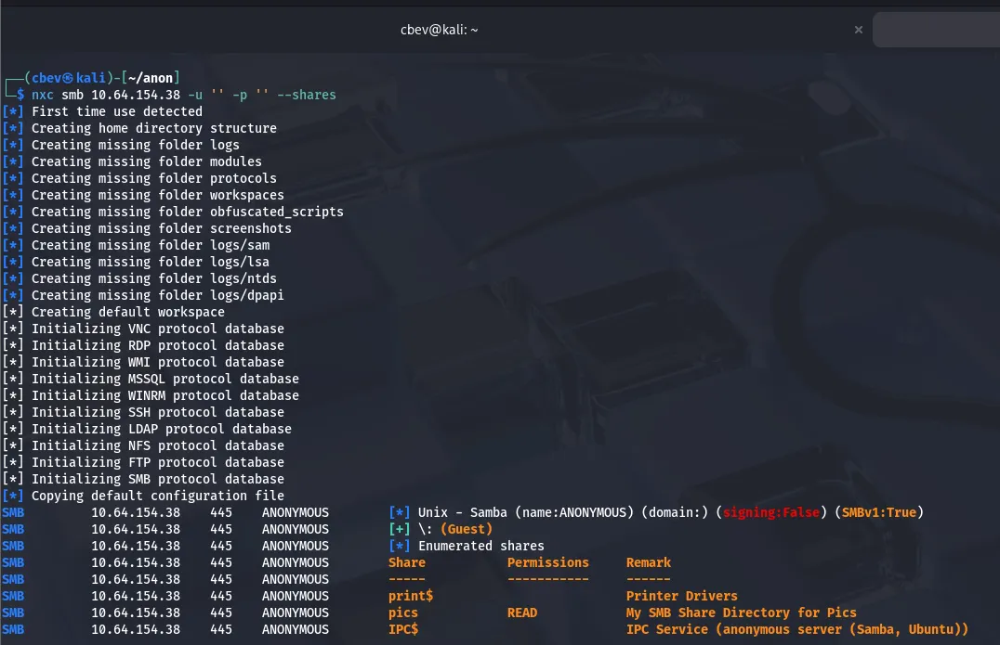

Guest sign on is allowed and we are able to read a share named pics . Inside, we find two jpg files of some doggies.

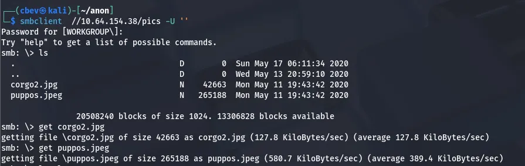

They don’t look like much on their own, so I’ll use the typical image analysis methods to see if there’s hidden data inside them.

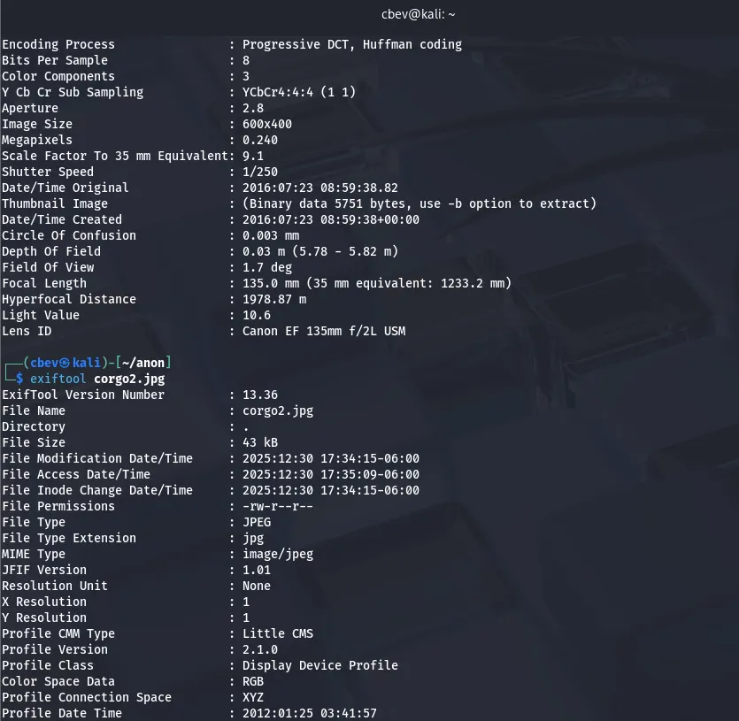

## Initial Foothold
The jpeg files seem pretty normal so back to FTP. We can confirm that the clean.sh script runs as the log file contains the stdout for it, so if we upload a reverse shell with the same name maybe the system will execute it and we get access.

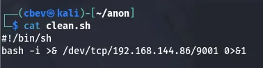

I use the put command to replace the original clean.sh with our bash reverse shell and setup a netcat listener.

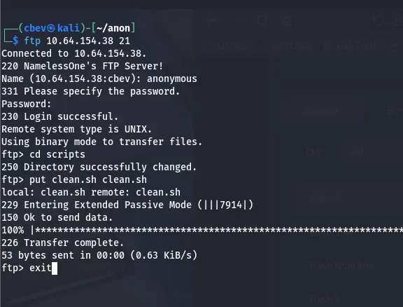

After waiting a few minutes, we get a successful shell. This is because a cronjob executes the clean.sh script to get rid of temporary files on the system (set to every 5 mins).

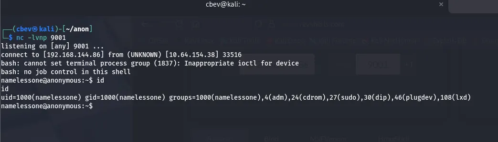

## Privilege Escalation
Here we can grab our user.txt flag under their home directory and start looking for root privilege escalation. I started by searching for binaries with a SUID bit set using `find / -perm /4000 2>/dev/null` , which showed that /usr/bin/env had special permissions.

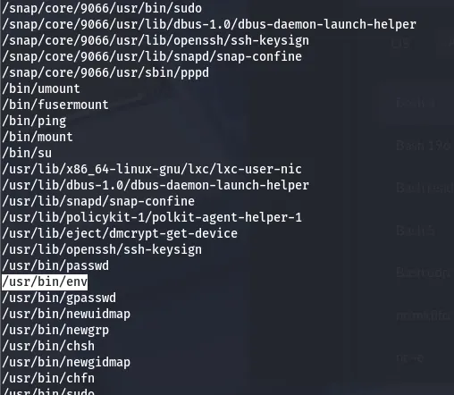

Since we can execute this binary as root, we simply set our environment to be `/bin/bash -p` which gives us a root bash shell.

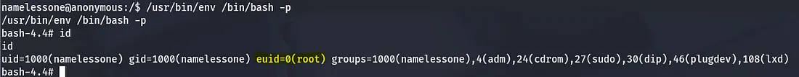

That’s all folks. This box was pretty simple but goes to show how a couple misconfigurations can lead to a full system compromise. I hope this was entertaining or helpful to anyone following along and happy hacking!
