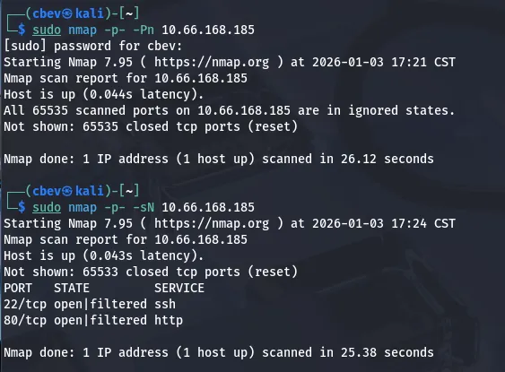
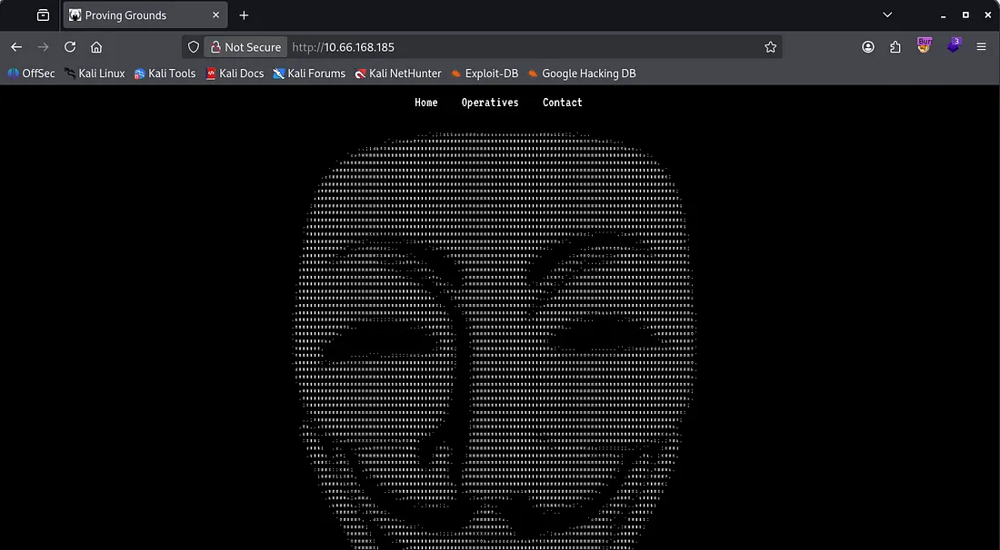
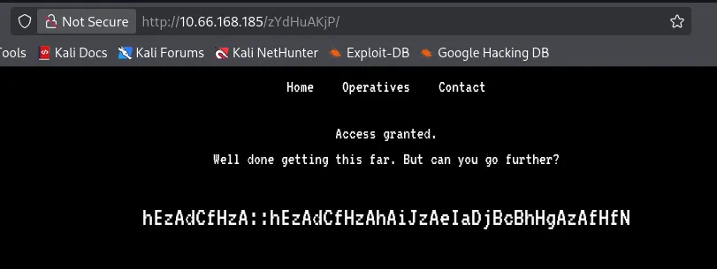
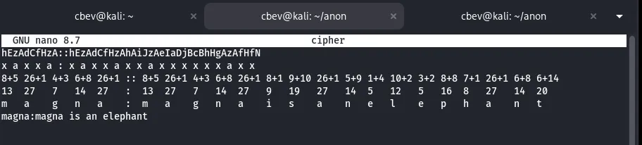
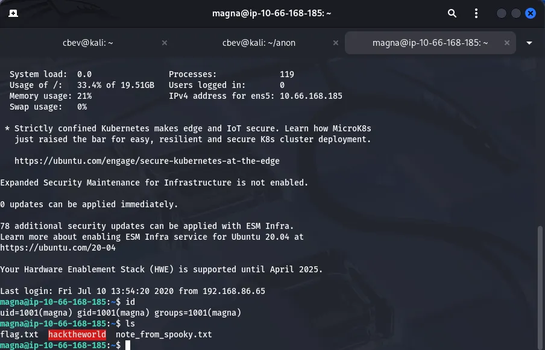
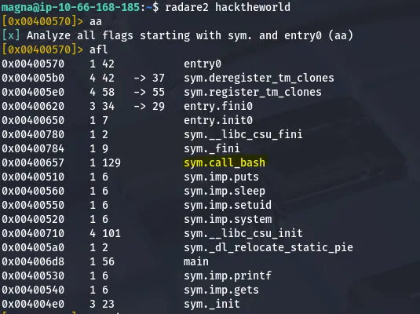
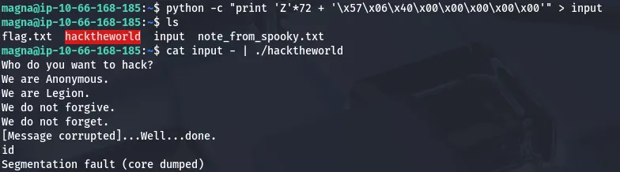
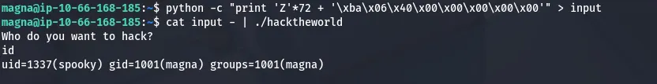
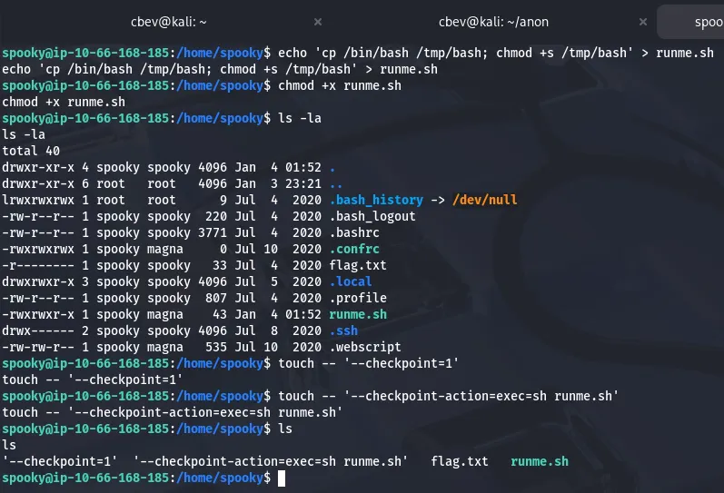
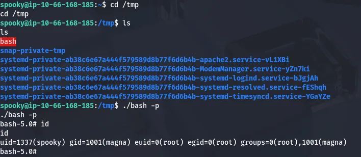

This box is ranked hard difficulty on THM, it involves us decrypting a special string which grants us SSH creds to the system. Then, we exploit a custom binary using buffer overflow to get a shell as another user. Finally, we abuse a cronjob to escalate privileges to root.

_Want to become part of Anonymous? They have a challenge for you. Can you get the flags and become an operative?_

## Scanning & Enumeration
I start with an Nmap scan on the given IP to find running services:



Looks like there’s a WAF in place so I switch to sending Null TCP packets to find the ports being filtered. It only returns SSH on port 22 and a web server on port 80.

I attempt a UDP scan as well but found nothing, if TCP doesn’t pan out I’ll revisit that. Landing on the page shows a homepage for the ‘Anonymous’ group.



We have a few tabs to go through but I start a Gobuster dir search in the background to save on time. Clicking on the operatives tab discloses the site is running on PHP, it also gives us some prolific names we can put into a wordlist for potential users.


The source code contains a comment with an endpoint at /upcoming.php for any upcoming mission, but we get a 404 not found error (it could be in a different directory).

Checking robots.txt shows a disallowed entry at /zYdHuAKjP . However, navigating to it shows we are denied access.


Capturing this request in Burp Suite shows we just need to change our cookie to granted instead of denied and we are given a string of cyphertext.




## Decryption
There’s an obvious structure to this encrypted string. The double colon delimiter could mean a key and then ciphertext or a name then function. Either way it alternates every letter between lowercase and capitals which makes me think that we should use the letter before the capital to decode the capital or vice versa.

I tried all the usuals in CyberChef and got nothing in return which means this is probably a custom encryption algorithm.

The first part of the string is repeated after the double colon so if I’m thinking it’s a pair of credentials and the name is also part of the password. I took the hint for flag 1 after struggling to make sense of it. We see that ‘zA’ resolves to ‘a’.


Analyzing this pattern shows that the first word is five letters and contains two letter A’s. I look at the operatives list and see a potential username of ‘magna’ that could fit here.

Using this possibility, I find that if you convert the letters of the alphabet into their numerical values, add the numbers for the capital & lowercases together, and finally convert them back to alphabetical values, we get the password for magna’s account.



I also had ChatGPT create a python script to double check and in case we need it in the future:

```
def decode_cipher(text):
    out = []
    i = 0
    while i < len(text):
        if i+1 < len(text) and text[i].islower() and text[i+1].isupper():
            lower = text[i]
            upper = text[i+1]
            offset = ord(upper) - ord('A') + 1
            decoded = chr(((ord(lower) - ord('a') + offset) % 26) + ord('a'))
            out.append(decoded)
            i += 2
        else:
            out.append(text[i])
            i += 1
    return ''.join(out)

cipher = "INPUT_CIPHERTEXT"
print(decode_cipher(cipher))
```

Signing on via SSH with Magna’s credentials gives us the first flag, an ELF owned by root, and a note from another user.



## Privilege Escalation
Judging from the info given before starting the box, we’re going to need to find a way onto spooky’s account before getting root privs as they’re the only other user on the box.

From the looks of the note left by spooky, we need to debug/RE the binary made by them.


They note that radare2 and gdb are installed to help so I fire them up.



This hacktheworld binary has a system call to bash, let’s dive a little deeper and see if we can exploit this.


I use pdf@sym.call_bash to see all functions and find that it calls /bin/sh . This function seems to calls bash with another user’s UID. We have the function’s address so next I test for buffer overflow.


The sweet spot was at 72, now let’s add a call to the /bin/bash function’s address.


The text printed proves that the function works but we don’t keep the shell alive as the core gets dumped almost immediately. A bit of research shows that this is because the shell maintains stdin and stdout from the piping. By the time the shell executes, all the input from the pipe has been emptied and it reads EOF.

The apparent fix for this issue was to cat the file into our binary and have it run that way, however this did not work for me.



I spent some more time debugging it and ended up moving the pointer more towards the end of the function (more specifically right when the UID gets set to 1337). This works well and we have a shell with a UID for spooky.



Here we can grab the second flag in Spooky’s home directory and start looking at ways for root privesc. First I check the typical routes like SUID/SGID bits set on binaries, known kernel exploits, and set capabilities on certain files.

The only thing of note was a cronjob which made a backup of Spooky’s home directory and output it to /var/backups/spooky.tgz .


We don’t have permissions to unzip that tar/gun zip archive but we can leverage this to cronjob to make root set an SUID bit on a copy of /bin/bash by creating two malicious files.



First we make a .sh script that contains a command for copying /bin/bash to /tmp and giving it an SUID bit.

Next, we make two malicious files using: touch -- '--checkpoint=1' &touch -- '--checkpoint-action=exec=sh runme.sh' .

This forces the system to interpret these files as flags and execute our malicious script. Now all we have to do is wait (1 minute) for the cronjob to run and check /tmp for our special bash binary.



Running ./bash -p grants us a root shell and we can get the final flag to finish out the box.

Overall, this was one of the most fun & challenging boxes I’ve done so big thanks to Nameless0ne for making it. I hope this was helpful to anyone stuck or following along and happy hacking!
