This box is ranked easy difficulty on THM, it involves us getting a hash via steganography on a jpg, grabbing a shell with RCE on a webpage, using sudo to escalate privileges to root, and a bit of cryptography to read the final flag.

_A Charlie And The Chocolate Factory themed room, revisit Willy Wonka’s chocolate factory!_

## Scanning & Enumeration
Starting with an Nmap scan on the given IP to find services on the host gives us a lot to work with.

```
$ sudo nmap -p- -Pn 10.67.131.156
[sudo] password for cbev: 
Starting Nmap 7.95 ( https://nmap.org ) at 2025-12-26 23:05 CST
Nmap scan report for 10.67.131.156
Host is up (0.041s latency).
Not shown: 65506 closed tcp ports (reset)
PORT    STATE SERVICE
21/tcp  open  ftp
22/tcp  open  ssh
80/tcp  open  http
100/tcp open  newacct
101/tcp open  hostname
102/tcp open  iso-tsap
103/tcp open  gppitnp
104/tcp open  acr-nema
105/tcp open  csnet-ns
106/tcp open  pop3pw
107/tcp open  rtelnet
108/tcp open  snagas
109/tcp open  pop2
110/tcp open  pop3
111/tcp open  rpcbind
112/tcp open  mcidas
113/tcp open  ident
114/tcp open  audionews
115/tcp open  sftp
116/tcp open  ansanotify
117/tcp open  uucp-path
118/tcp open  sqlserv
119/tcp open  nntp
120/tcp open  cfdptkt
121/tcp open  erpc
122/tcp open  smakynet
123/tcp open  ntp
124/tcp open  ansatrader
125/tcp open  locus-map
```

Nmap done: 1 IP address (1 host up) scanned in 22.81 seconds
Although 29 ports are open, most of these are generally useless for our goal so I’ll focus on the main services like FTP, SSH, HTTP.

We can find a jpg when logging into FTP as anonymous:

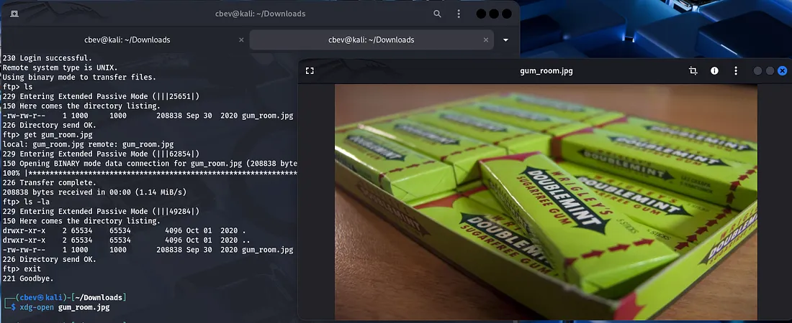

Checking the typical routes for image data (strings, exiftool, steganography) shows that there is hidden text within the image.

```
steghide extract -sf gum_room.jpg
```

This gives us a text file but it’s base64 encoded so let’s send it over to CyberChef.

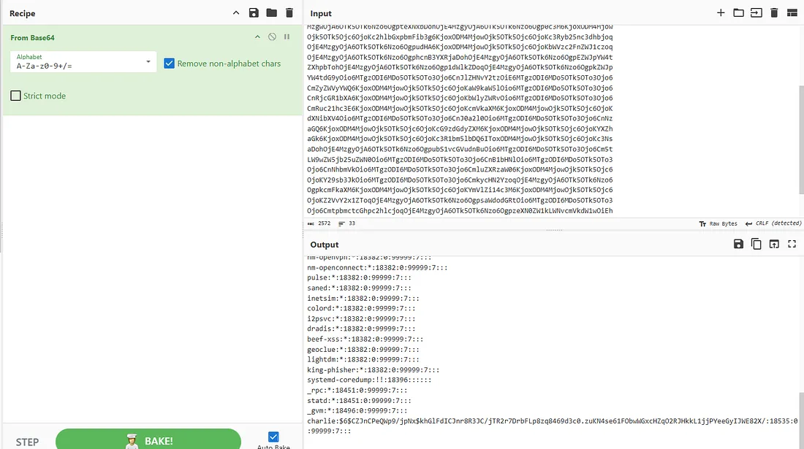

We get a copy of /etc/shadow , the only user with a hash is charlie so let’s crack it with JohnTheRipper.

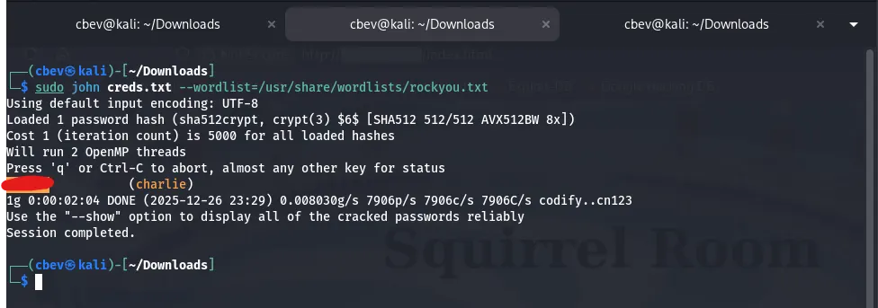

While that ran I checked the webpage and found a login panel to squirrel room.

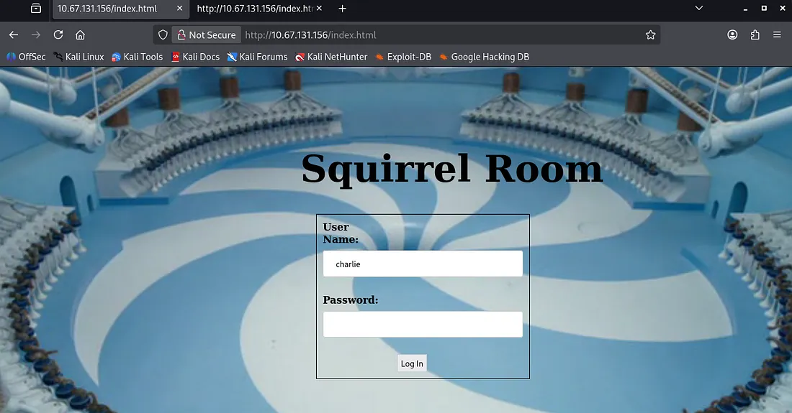

## Exploitation
I tried using the password gained from john to SSH onto the system but that failed. Then I tried the same for our login panel and got a successful request.

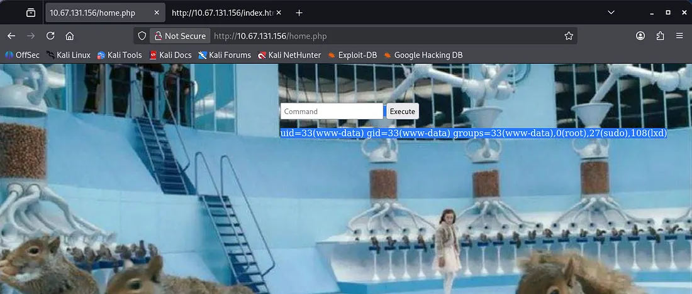

It contains a box used to execute commands on the system and doesn’t look like there’s a filter either. This oughta be secure huh?

I send the HTTP request to the repeater tab on Burp Suite as the response on the page is tough to see. I use this RCE to catch a shell as www-data with a python reverse shell from [here](https://www.revshells.com/).

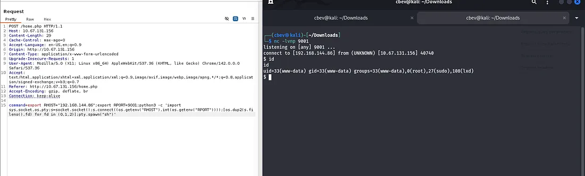

I upgrade the shell with the typical python method:

```
python3 -c 'import pty;pty.spawn("/bin/bash")'

export TERM=xterm

stty raw -echo;fg
```

## Privilege Escalation
There’s an SSH private key in Charlie’s home directory that we can use to get a nicer shell on the box as well as grab the user.txt flag. Be sure to chmod 700 the key file.

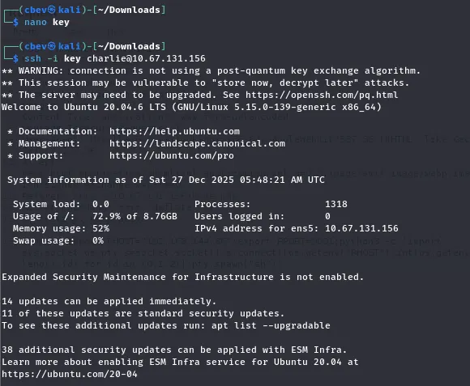

Finally we see from listing sudo commands that charlie can use the vi binary. [GTFOBins](https://gtfobins.github.io/gtfobins/vi/#sudo) has a great method for a root shell by using this.

_Note: Change the /bin/sh part to /bin/bash for better functionality in our shell_

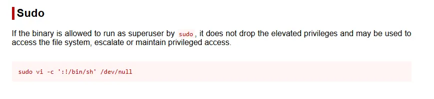

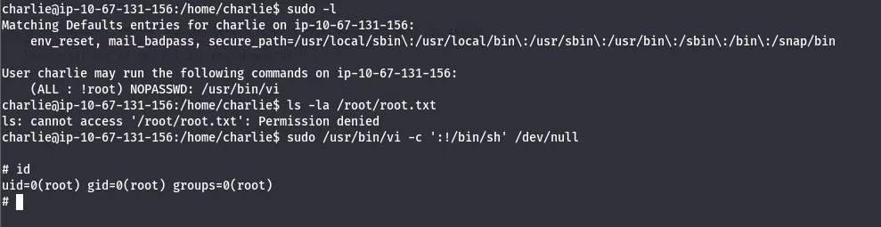

Executing this let’s us list /root directory and find that there is a python script instead of the usual text file as the last flag.

```
mv root.py /home/charlie
```

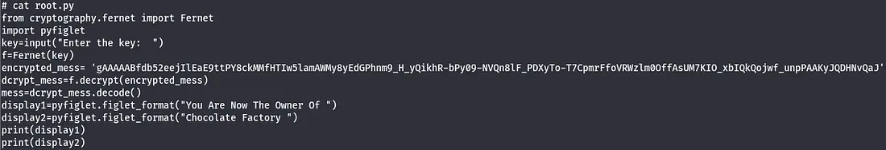

The root.py is also owned by charlie so we can execute it either way, but I chose to move it to charlie’s home directory.

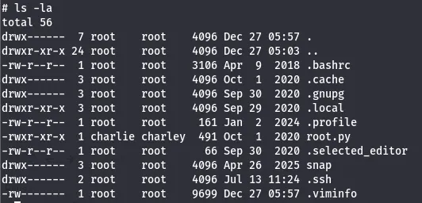

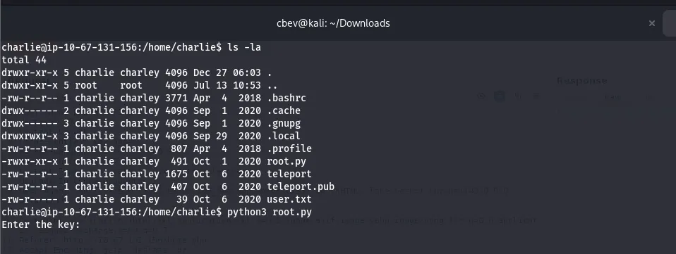

Executing it shows we need a key for the Fernet function to decrypt the message. I saw a key when we first landed on the box in /var/www/html/key_rev_key.

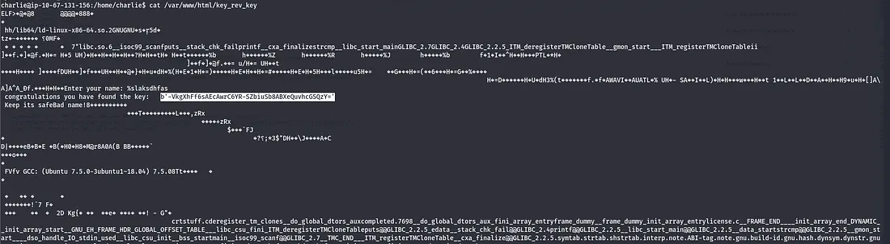

Executing it requires a name and charlie won’t work so I end up displaying the ELF‘s contents and find the key inside of it (strings works too). I think the intended way was to use the script to decrypt the message, but I had the message in CyberChef already so I typed the key in and got the final flag.

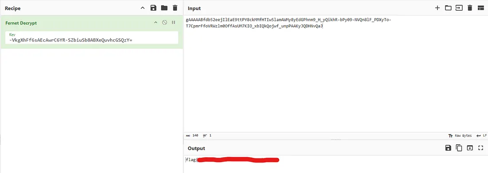

This was a fun and simple box with a cool theme. I hope this was helpful or entertaining to anyone following along and happy hacking!
