This box is ranked medium difficulty on THM, it involves us reversing a cryptographic API to generate a valid invite code so we can login to a webpage. Then, we look for RCE on the system by means of a very interesting method with OpenSSL padding.

_Use your exploitation skills to uncover encrypted keys and get RCE._

## Scanning & Enumeration
As always, a quick Nmap scan shows the services up and running on our target IP.

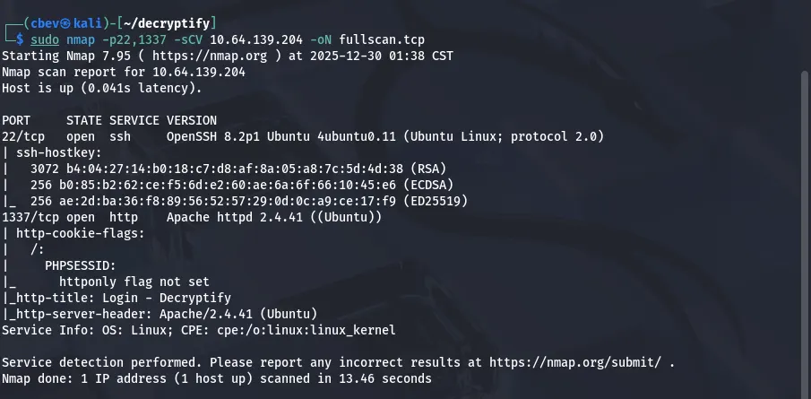

Just two ports open:
- SSH on port 22
- An Apache web server on port 1337 (built on PHP)

Before taking a look at the webpage I’m going to leave a gobuster dir search in the background.

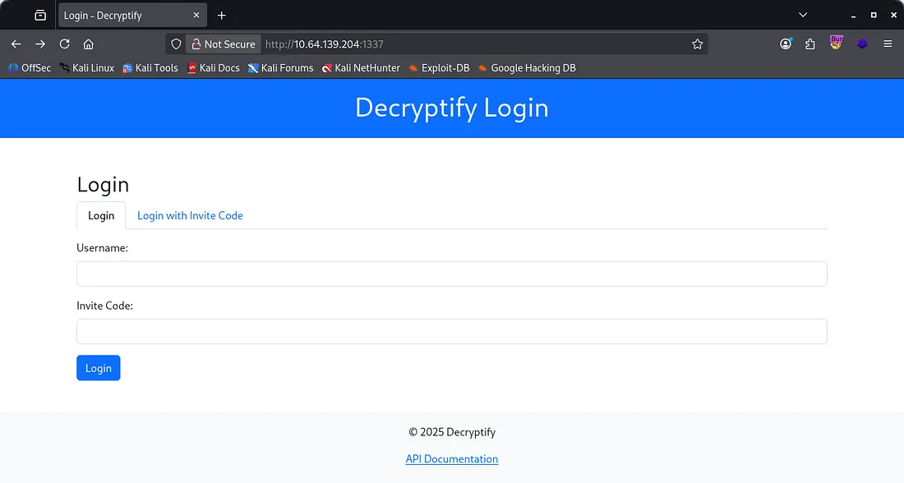

The landing page shows that we can sign in with a username/email and an invite code instead of a typical password. Checking out the API documentation requires a passcode as well.

```
$ gobuster dir -u http://10.64.139.204:1337/ -w /opt/SecLists/Discovery/Web-Content/raft-small-words.txt -x php
===============================================================
Gobuster v3.8
by OJ Reeves (@TheColonial) & Christian Mehlmauer (@firefart)
===============================================================
[+] Url:                     http://10.64.139.204:1337/
[+] Method:                  GET
[+] Threads:                 10
[+] Wordlist:                /opt/SecLists/Discovery/Web-Content/raft-small-words.txt
[+] Negative Status codes:   404
[+] User Agent:              gobuster/3.8
[+] Extensions:              php
[+] Timeout:                 10s
===============================================================
Starting gobuster in directory enumeration mode
===============================================================
/.php                 (Status: 403) [Size: 280]
/.html.php            (Status: 403) [Size: 280]
/.html                (Status: 403) [Size: 280]
/js                   (Status: 301) [Size: 318] [--> http://10.64.139.204:1337/js/]
/index.php            (Status: 200) [Size: 3220]
/css                  (Status: 301) [Size: 319] [--> http://10.64.139.204:1337/css/]
/.htm                 (Status: 403) [Size: 280]
/.htm.php             (Status: 403) [Size: 280]
/logs                 (Status: 301) [Size: 320] [--> http://10.64.139.204:1337/logs/]
/api.php              (Status: 200) [Size: 1043]
/javascript           (Status: 301) [Size: 326] [--> http://10.64.139.204:1337/javascript/]
/header.php           (Status: 200) [Size: 370]
/footer.php           (Status: 200) [Size: 245]
/.                    (Status: 200) [Size: 3220]
/phpmyadmin           (Status: 301) [Size: 326] [--> http://10.64.139.204:1337/phpmyadmin/]
/.htaccess            (Status: 403) [Size: 280]
/.htaccess.php        (Status: 403) [Size: 280]
/dashboard.php        (Status: 302) [Size: 0] [--> logout.php]
```

We get some places to check out from the scan, most notably phpmyadmin and logs . phpmyadmin is the standard admin panel that uses MySQL to query for usernames and passwords (this version is secure), however the logs endpoint is exposed and contains some good info.

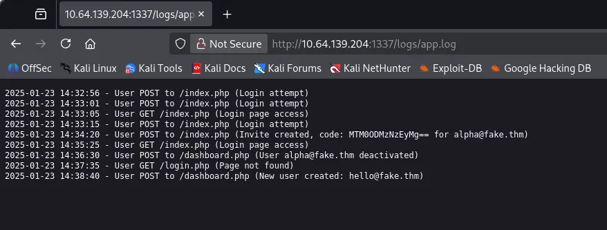

Here we get an invite code for `alpha@fake.thm`, but looking through the logs show that that account was deactivated shortly after. Then a new account under hello@fake.thm was created in its place. The invite code decrypts to a big number which I assume is randomly created so we can’t attack from that angle.

Looking back at our gobuster scan shows an exposed folder for javascript, this contains a file called api.js . If we make sense of this code, the API checks for a hardcoded string in the API (presumably the password) and allows for access. Deobfuscating the code resolves our password to ‘H7gY2tJ9wQzD4rS1’.

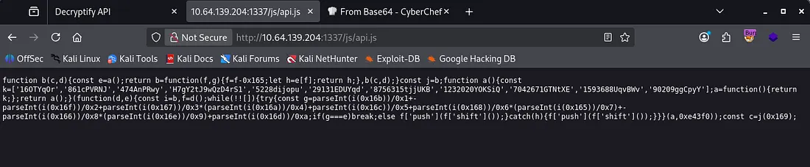

Let’s use this to read the API docs.

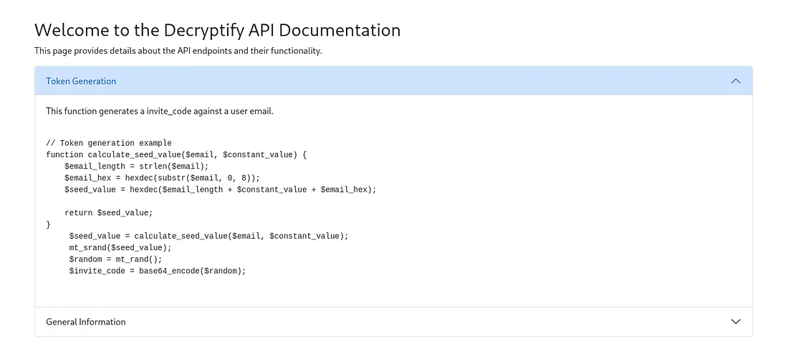

Now we can make more sense of the invite code. The API first calculates the string length of our email. Then it extracts the first 8 characters from it and converts them to hexadecimal format.

It adds the email length, a constant value (unknown), and the hex value to create a seed value. This is then used as a seed for a PHP function called Mersenne Twister (mt_rand() ). It uses mt_rand to create a sort of random number and produces a base64 invite code.

Since this invite code is fully deterministic, we can generate one for the other valid email on the box (`hello@fake.thm`). However, we still need to calculate the constant value to be able to fully reverse this process.

To do so, first we decode the base64 code from logs to get the `mt_rand` value. Then, we’ll try to compute the seed value based off of the guessed constant value (iterating numbers 0–100,000 or more if needed) and checking if they match. I had ChatGPT throw a PHP script together so we can brute force the const value.

```
<?php
function calculate_seed_value($email, $constant_value) {
    $email_length = strlen($email);
    $email_hex = hexdec(substr($email, 0, 8));
    $seed_value = hexdec($email_length + $constant_value + $email_hex);
    return $seed_value;
}

function reverse_constant_value($email, $invite_code) {
    $random_value = intval(base64_decode($invite_code));

    $email_length = strlen($email);
    $email_hex = hexdec(substr($email, 0, 8));

 
    for ($constant_value = 0; $constant_value <= 1000000; $constant_value++) {
        $seed_value = hexdec($email_length + $constant_value + $email_hex);

        mt_srand($seed_value);
        if (mt_rand() === $random_value) {
            return $constant_value;
        }
    }
    return "Constant value not found in range.";
}

$email = "alpha@fake.thm";
$invite_code = "MTM0ODMzNzEyMg==";

$constant_value = reverse_constant_value($email, $invite_code);

echo "Reversed Const: " . $constant_value . PHP_EOL;
```
This returns a correct constant value of 99999; I upped the number limit to double check it wasn’t an error and it still worked. Let’s generate a valid invite code for `hello@fake.thm` with:

```
<?php

function calculate_seed_value($email, $constant_value) {
    $email_length = strlen($email);
    $email_hex = hexdec(substr($email, 0, 8));
    $seed_value = hexdec($email_length + $constant_value + $email_hex);

    return $seed_value;
}

function generate_token($email, $constant_value) {
     $seed_value = calculate_seed_value($email, $constant_value);
     mt_srand($seed_value);
     $random = mt_rand();
     $invite_code = base64_encode($random);

    return $invite_code;
}

$email = "hello@fake.thm";
$token = generate_token($email, 99999);
print $token

?>
```

Cool, this grants us a successful login for the user hello as well as the first flag on the box. There’s not much functionality within the site as we have it so, I try generating a valid code for admin@fake.thm but that doesn’t work.

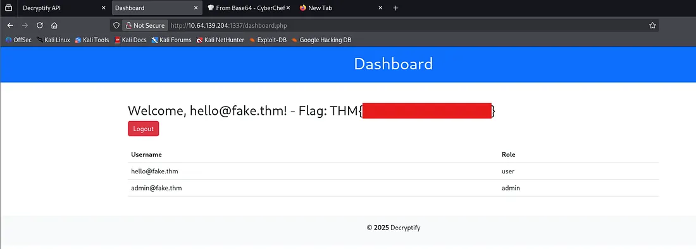

Looking through the source code on the page shows that there’s a hidden field named date with a base64 encoded value.

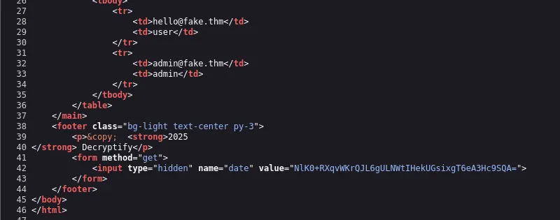

Including that parameter in the URL without the value attached to it shows a padding error.

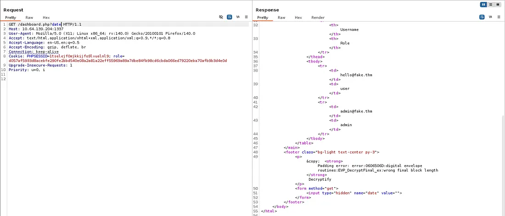

After some research, there’s an attack method aptly named Padding Oracle, which allows for RCE on the box. I’ll be using an automated tool named padre for this part.

You can get it from this [GitHub repo](https://github.com/glebarez/padre/releases/tag/v2.1.0).

We need to specify the full URL with a $ where the padding attack will go, the cookies needed for the requests, and the string used in the initial page.

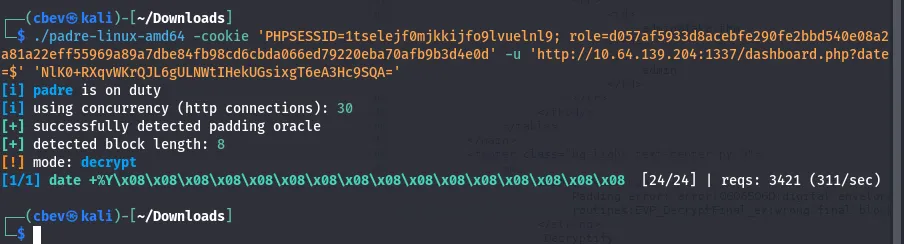

We see that the system is issuing date `+%Y` here. Now we can use our own string to pass in commands via the URL to get command execution on the system.

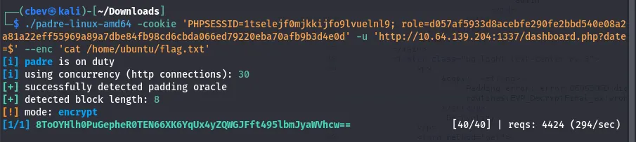

Using this padding grants us the final flag for the box.

This vulnerability exists due to the site disclosing whether encrypted data is valid or not. We were able to test for invalid padding and therefore able to abuse this field to execute commands in place of the real date call.

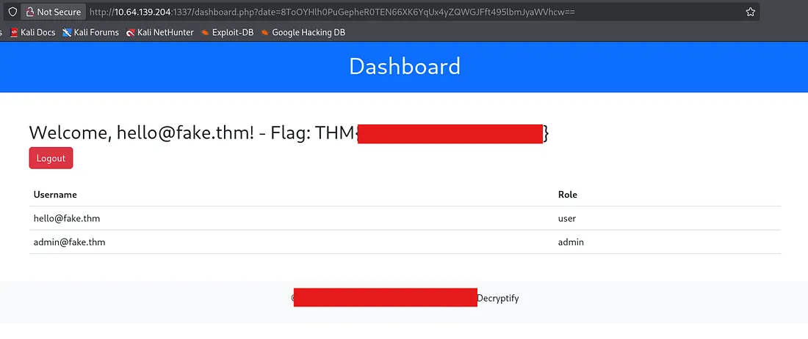

Not wanting to stop there, I attempted to get a shell via netcat, python, and bash but only got another padding error instead. That’s where the fun ends.

This was a very interesting box in my opinion. I have never seen Padding Oracle attacks before so this was a great intro to how they function and reversing the cryptography was well done too.

I hope this was helpful to anyone following along or stuck like I was and happy hacking!
