This box is ranked medium difficulty on THM and is a sort of capstone challenge to the Injection Attacks module, so all methods will be of that nature.

It involves us using SQL injection to bypass a primary login panel. Then we update a field to drop a ‘users’ table which grants us access to an admin panel alongside leaked credentials. Finally we exploit a SSTI to read a flag in an enumerated directory.

_Use your injection skills to take control of a web app._

## Scanning & Enumeration
Beginning with an Nmap scan to find all running services on for the given IP.

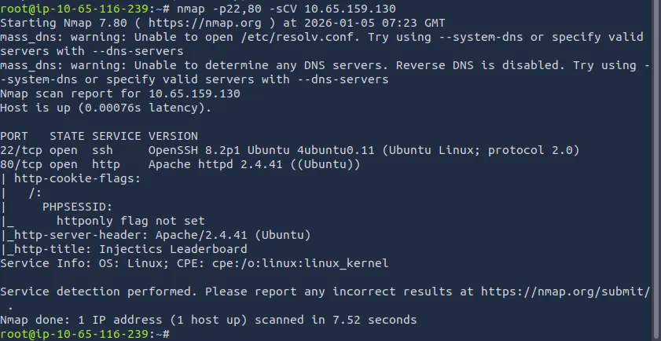

There is SSH on port 22 and a web server on port 80 running on PHP. Checking the web server, I find a webpage dedicated to tracking different country’s sports performances.

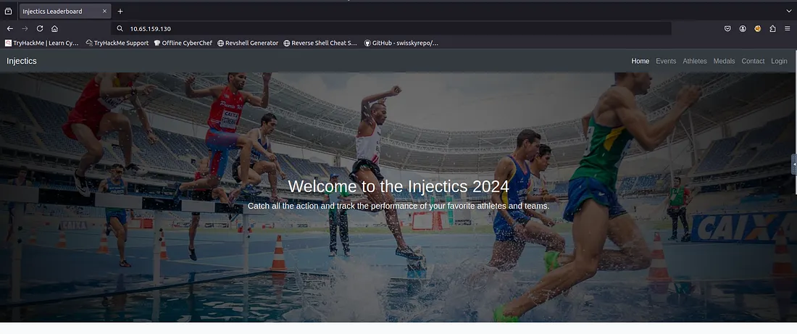

The page is mostly static and doesn’t have much on it besides a login panel on the tab bar. I’ll run a directory bust scan to find other endpoints on the site before trying to exploit the login.

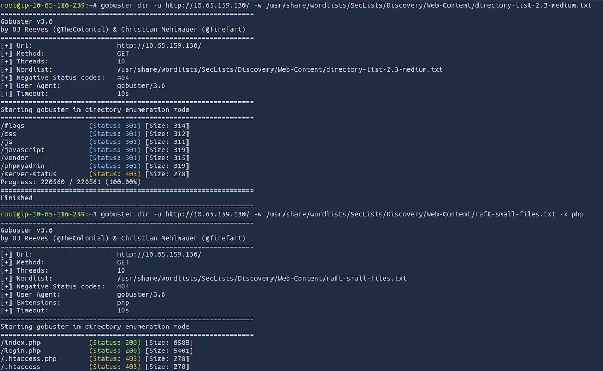

There is a directory where the flags are held as well as an admin login panel at phpmyadmin .

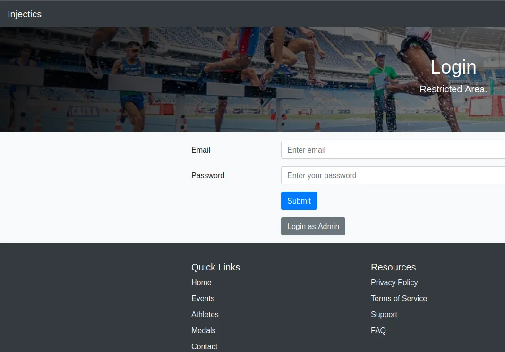

Looking at the login panel for normal users shows a button to login as Admin here as well. This points toward a page at /adminLogin007.php , either way we need an email for the first field as Admin doesn’t work.

A quick look at source code on the landing page discloses an email for the developer of the website.


Another comment under it says that all Mails are stored in mail.log . Checking this file location gives us passwords for both dev@injectics.thm and a superadmin account however these passwords only get added as a default to the users table in case of the database being corrupted/deleted.

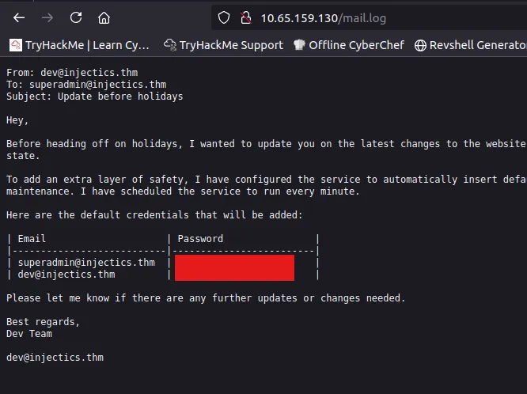

That’s a big clue as we may not be able to use UNION or other operators, and may be able to drop the table, and in turn replacing the original creds with these.

My endpoints scans are now done and I find a script.js file which discloses the logic behind our login request. It sets the following characters/words as invalid input: ‘, “, union, select, or, and.

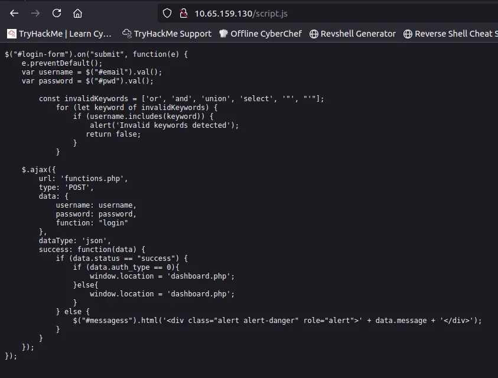

I also found a composer.json file exposing a templating engine for the site as twig. This could be useful later on.

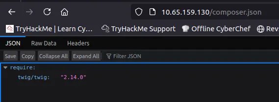

## Exploitation
I end up capturing a POST request at the normal login form and saving it. Then, I send it to SQLMap to try and find valid payloads that don’t use the blocked keywords.

```
sqlmap -r login.req --level=4
```

One particular payload seemed to work, so I used that with the superadmin account to login.

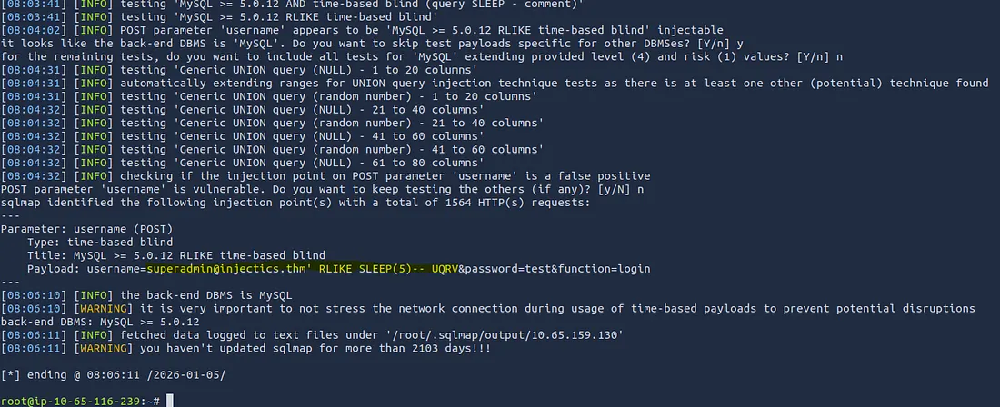

I should note that we need to change the username in Burp Suite to our payload instead of entering it through the site directly as this bypasses the script that blocks keywords. This logs us in as dev instead of admin (probably because it’s the normal login but we found a bypass).

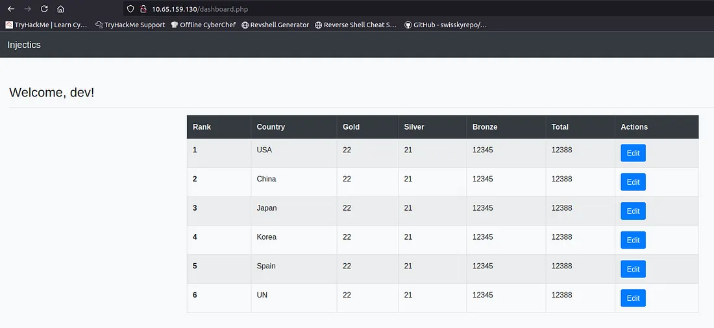

There’s only one real action on this part of the site and that’s to change the table’s values. Maybe we can drop the users table from here and reset the database to those other creds we found.

I try a few things to test for SQLi here from Burp Suite and kept getting a 302 found which didn’t return any info. Here I attempted a few commands using different syntax to try and drop the table. Checking the admin login form by signing in as superadmin .


There’s our first flag under the admin panel. Now let’s look for ways to read what’s inside the /flags directory.

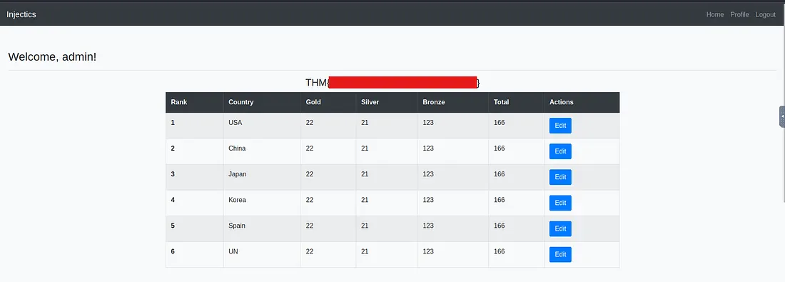

The only real difference between the admin and normal user dashboard is a profile update tab. This gets used when we login as seen by the “Welcome, admin!” message which is different from the dev account one.

I found that file earlier disclosing that our templating engine was Twig, so I test common payloads for SSTI (this engine’s syntax originates from Jinja and Django).

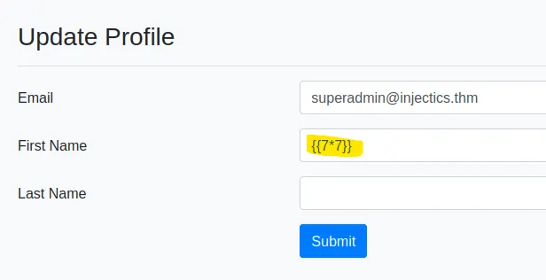

This one reflects that server side template injection is indeed possible via the First Name field.

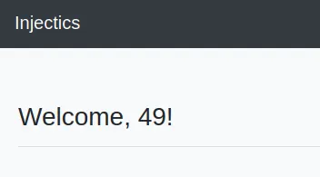

Now we need to find valid payloads in order to read files on the system. I came across a CVE for Twig which allowed for abritrary PHP code to be ran via the sort filter. While using the system function to allow for commands didn’t work directly for RCE, it still output “Array” which meant I was on the right path.

Checking some other functions we can use instead of system, I find that replacing system with passthru() works to display the flag filename.

The passthru() function in PHP is for executing a system command and passing its raw output directly to the browser or standard output stream.

My final payload was:


```
{{['cat flags/5d8af1dc14503c7e4bdc8e51a3469f48.txt',""]|sort('passthru')}}
```


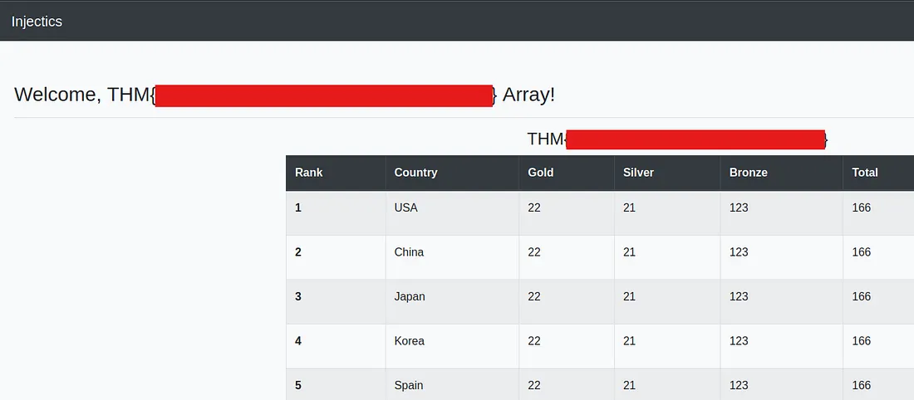

This box was pretty fun yet tedious as if you don’t know what to look for it can be a pain. I hope this was helpful to anyone following along or stuck and happy hacking!
