This box is rated hard difficulty on THM. It involves us brute forcing a WordPress website with XML-RPC enabled, updating our profile to allow for admin permissions, and a cool Python module privilege escalation to grab a root shell.

_Compromise a web server running Wordpress, obtain a low privileged user and escalate your privileges to root using a Python module._

## Scanning & Enumeration
After adding jack.thm to my /etc/hosts file, I start with an Nmap scan on the given IP to find running services.

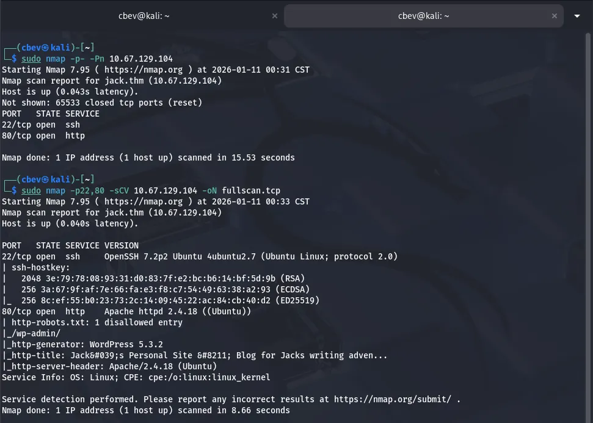

We get some great info right off the bat. There is only two ports open:
- SSH on port 22
- An Apache web server on port 80

The web server is running word press and has a disallowed entry for the admin login panel. Checking the landing page, there’s not much for us here except a username of Jack and his blog post.

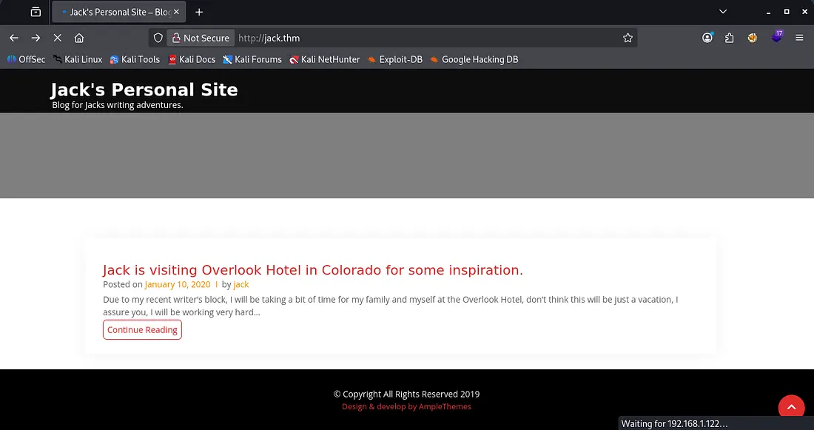

I test for SQLi and other basic injections on the admin login page but nothing really panned out. However, there are verbose errors on it which shows that Jack is a valid username and there is no Admin.

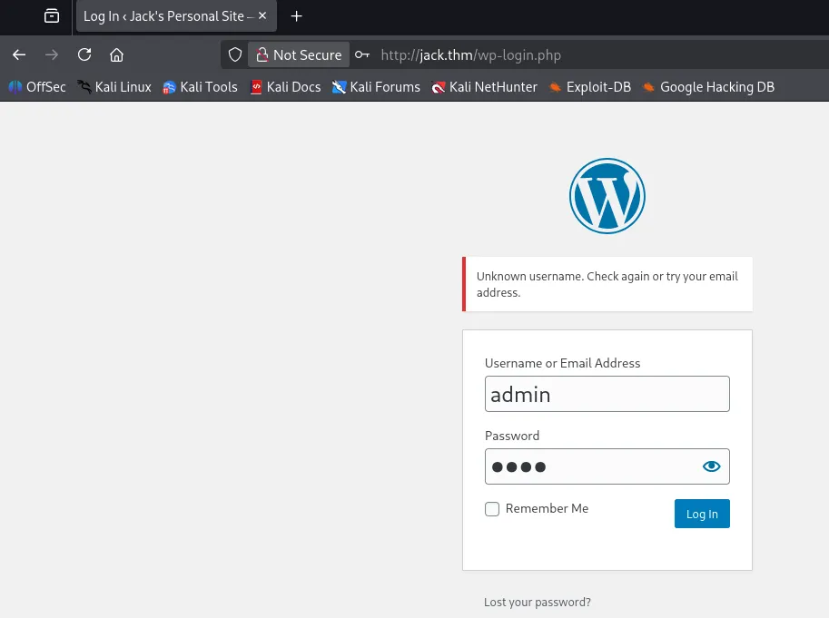

I throw quick wordlist of first names from The Shining (box’s inspiration) and test for valid usernames via verbose errors on the login panel. I discover that Danny, Jack, and Wendy all have accounts on the site.

Rather than reinvent the wheel, since it’s WordPress I swap over to WPScan to find any vulnerable plugins/themes, enumerate users, etc.

```
$ wpscan --url jack.thm -e vp,vt,u 
_______________________________________________________________
         __          _______   _____
         \ \        / /  __ \ / ____|
          \ \  /\  / /| |__) | (___   ___  __ _ _ __ ®
           \ \/  \/ / |  ___/ \___ \ / __|/ _` | '_ \
            \  /\  /  | |     ____) | (__| (_| | | | |
             \/  \/   |_|    |_____/ \___|\__,_|_| |_|

         WordPress Security Scanner by the WPScan Team
                         Version 3.8.28
       Sponsored by Automattic - https://automattic.com/
       @_WPScan_, @ethicalhack3r, @erwan_lr, @firefart
_______________________________________________________________

[+] URL: http://jack.thm/ [10.67.129.104]
[+] Started: Sun Jan 11 01:15:06 2026

Interesting Finding(s):

[+] Headers
 | Interesting Entry: Server: Apache/2.4.18 (Ubuntu)
 | Found By: Headers (Passive Detection)
 | Confidence: 100%

[+] robots.txt found: http://jack.thm/robots.txt
 | Interesting Entries:
 |  - /wp-admin/
 |  - /wp-admin/admin-ajax.php
 | Found By: Robots Txt (Aggressive Detection)
 | Confidence: 100%

[+] XML-RPC seems to be enabled: http://jack.thm/xmlrpc.php
 | Found By: Direct Access (Aggressive Detection)
 | Confidence: 100%
 | References:
 |  - http://codex.wordpress.org/XML-RPC_Pingback_API
 |  - https://www.rapid7.com/db/modules/auxiliary/scanner/http/wordpress_ghost_scanner/
 |  - https://www.rapid7.com/db/modules/auxiliary/dos/http/wordpress_xmlrpc_dos/
 |  - https://www.rapid7.com/db/modules/auxiliary/scanner/http/wordpress_xmlrpc_login/
 |  - https://www.rapid7.com/db/modules/auxiliary/scanner/http/wordpress_pingback_access/

[+] WordPress readme found: http://jack.thm/readme.html
 | Found By: Direct Access (Aggressive Detection)
 | Confidence: 100%

[+] Upload directory has listing enabled: http://jack.thm/wp-content/uploads/
 | Found By: Direct Access (Aggressive Detection)
 | Confidence: 100%

[+] The external WP-Cron seems to be enabled: http://jack.thm/wp-cron.php
 | Found By: Direct Access (Aggressive Detection)
 | Confidence: 60%
 | References:
 |  - https://www.iplocation.net/defend-wordpress-from-ddos
 |  - https://github.com/wpscanteam/wpscan/issues/1299

[+] WordPress version 5.3.2 identified (Insecure, released on 2019-12-18).
 | Found By: Rss Generator (Passive Detection)
 |  - http://jack.thm/index.php/feed/, <generator>https://wordpress.org/?v=5.3.2</generator>
 |  - http://jack.thm/index.php/comments/feed/, <generator>https://wordpress.org/?v=5.3.2</generator>

[+] WordPress theme in use: online-portfolio
 | Location: http://jack.thm/wp-content/themes/online-portfolio/
 | Last Updated: 2024-02-05T00:00:00.000Z
 | Readme: http://jack.thm/wp-content/themes/online-portfolio/readme.txt
 | [!] The version is out of date, the latest version is 0.1.1
 | Style URL: http://jack.thm/wp-content/themes/online-portfolio/style.css?ver=5.3.2
 | Style Name: Online Portfolio
 | Style URI: https://www.amplethemes.com/downloads/online-protfolio/
 | Description: Online Portfolio WordPress portfolio theme for building personal website. You can take full advantag...
 | Author: Ample Themes
 | Author URI: https://amplethemes.com/
 |
 | Found By: Css Style In Homepage (Passive Detection)
 | Confirmed By: Css Style In 404 Page (Passive Detection)
 |
 | Version: 0.0.7 (80% confidence)
 | Found By: Style (Passive Detection)
 |  - http://jack.thm/wp-content/themes/online-portfolio/style.css?ver=5.3.2, Match: 'Version: 0.0.7'

[+] Enumerating Vulnerable Plugins (via Passive Methods)

[i] No plugins Found.

[+] Enumerating Vulnerable Themes (via Passive and Aggressive Methods)
 Checking Known Locations - Time: 00:00:09 <=======================================> (652 / 652) 100.00% Time: 00:00:09
[+] Checking Theme Versions (via Passive and Aggressive Methods)

[i] No themes Found.

[+] Enumerating Users (via Passive and Aggressive Methods)
 Brute Forcing Author IDs - Time: 00:00:00 <=========================================> (10 / 10) 100.00% Time: 00:00:00

[i] User(s) Identified:

[+] jack
 | Found By: Rss Generator (Passive Detection)
 | Confirmed By:
 |  Wp Json Api (Aggressive Detection)
 |   - http://jack.thm/index.php/wp-json/wp/v2/users/?per_page=100&page=1
 |  Author Id Brute Forcing - Author Pattern (Aggressive Detection)
 |  Login Error Messages (Aggressive Detection)

[+] wendy
 | Found By: Author Id Brute Forcing - Author Pattern (Aggressive Detection)
 | Confirmed By: Login Error Messages (Aggressive Detection)

[+] danny
 | Found By: Author Id Brute Forcing - Author Pattern (Aggressive Detection)
 | Confirmed By: Login Error Messages (Aggressive Detection)

[!] No WPScan API Token given, as a result vulnerability data has not been output.
[!] You can get a free API token with 25 daily requests by registering at https://wpscan.com/register

[+] Finished: Sun Jan 11 01:15:19 2026
[+] Requests Done: 669
[+] Cached Requests: 54
[+] Data Sent: 167.957 KB
[+] Data Received: 295.717 KB
[+] Memory used: 269.867 MB
[+] Elapsed time: 00:00:12
```

From this scan I find that the version is 5.3.2 and the valid names again. Alongside the fasttrack.txt wordlist, I brute force a login for Wendy via XML-RPC.

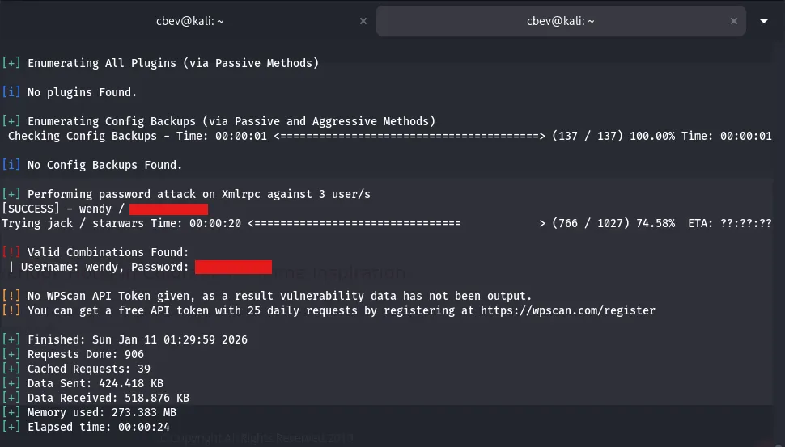

I attempt to login at the wp-admin panel using these creds and it’s a success. Looking around the dashboard we don’t have much functionality at all for now.

I spend some time researching vulnerabilities and I find an interesting one. We can escalate our account privileges by capturing a POST request while updating our profile and appending &ure_other_roles=administrator to the body.

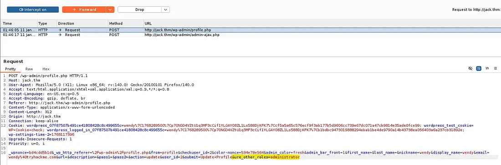

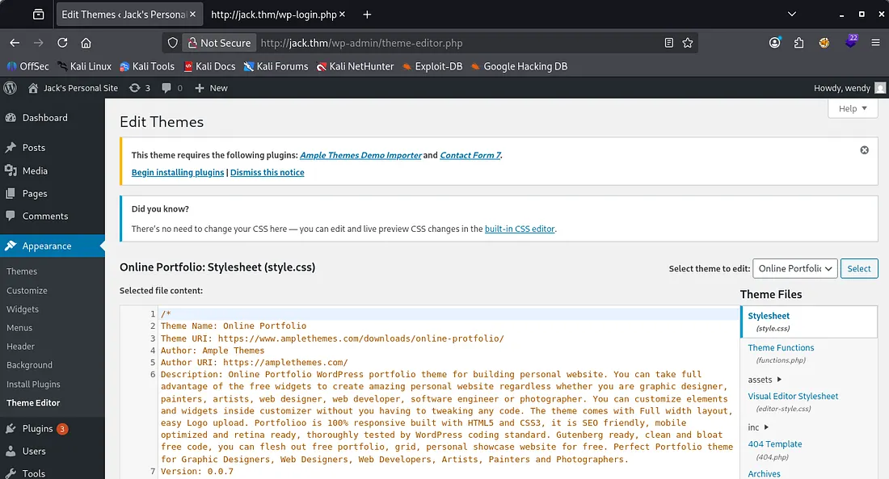

Now we have admin level privs on the site, I try the typical method of changing a theme’s 404 page script to a reverse shell pointed towards my machine.

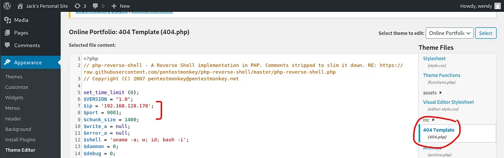

This doesn’t end up working because the site is unable to communicate to check for fatal errors, so our changes were reverted as a safety measure.

Then I check the plugins available and find that ‘Hello Dolly’ is installed. We are able to alter this plugins PHP code to our reverse shell with the same method. [Here](https://medium.com/@althubianymalek/uploading-a-shell-in-wordpress-via-sqli-entry-point-1caf441b3d9a) is a good article on how this works.

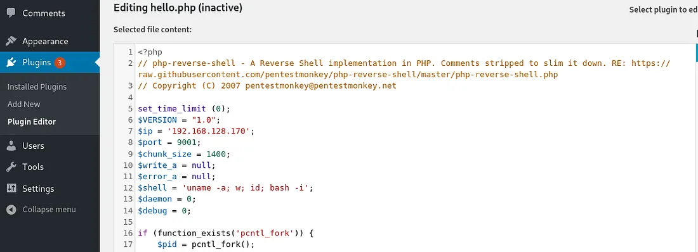

After setting up a listener of our choosing, we can navigate to `http://jack.thm/wp-content/plugins/hello.php` to force the site to run it.

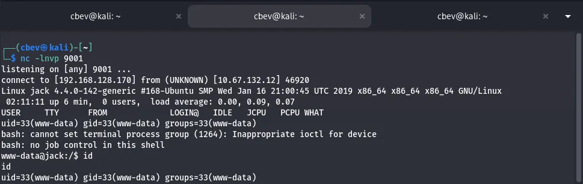

Now we have a low level shell as www-data on the system. I upgrade it with the standard python import pty method and start looking for creds in potential spots.

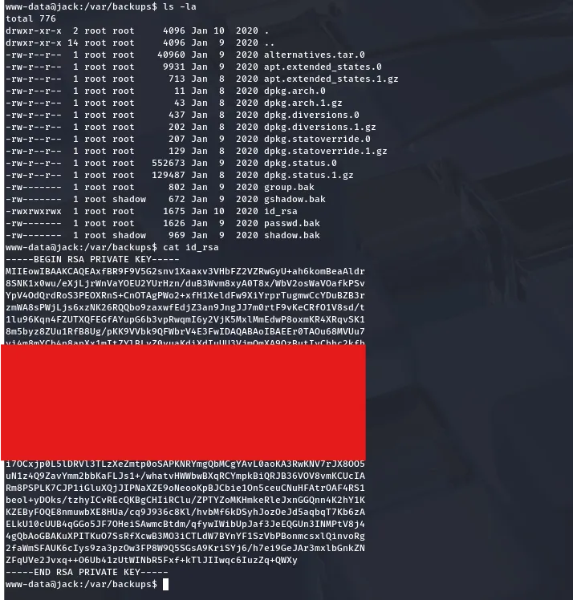

I find an id_rsa key hidden in the /var/backups directory. Now we can SSH onto the box and have a proper shell. I try different usernames until getting a successful attempt with as Jack.

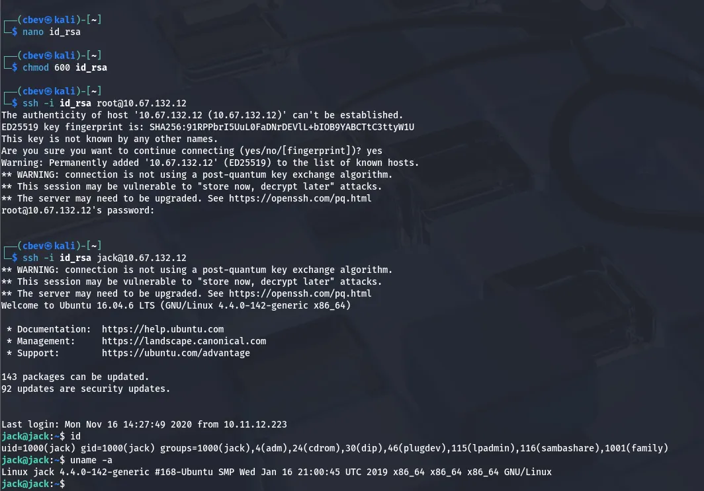

Here we can grab the user.txt flag in Jack’s home directory. I also find a text file left by root reminding someone that their backups were the reason they almost got hacked. So much for that message.

At this point I go about the usual routes for root privesc by checking for SUID/SGID bits set, sudo privileges, and don’t find much. Swapping back to the lower level shell to read what’s in /var/www , I read the wp-config.php file and find the MySQL username and password.

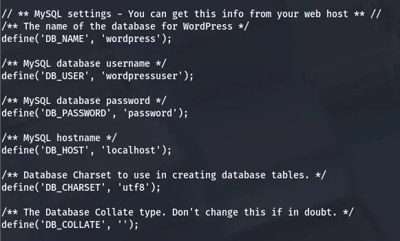

I use this to dump the database on Jack’s SSH shell and find hashes for all three users. Only Jack is a user on the box so I crack his.

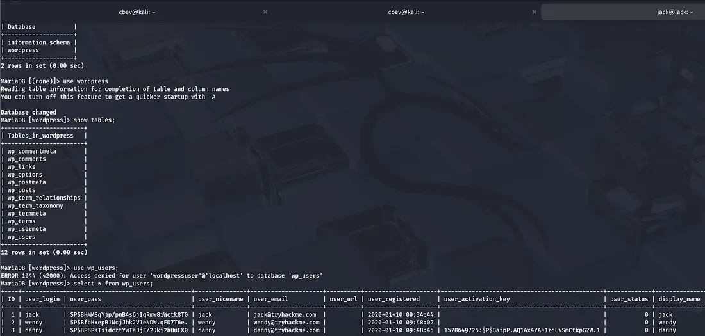

I let that run a while and get nothing in return so I upload LinPEAS and pspy to find a few more attack paths.

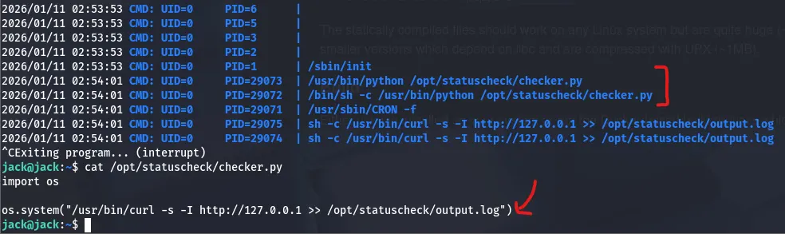

It looks like Jack is apart of the family group which has the ability to write to the os module for python version 2.7 . This means we can add a line containing our reverse shell at the end and wait for the cronjob to execute it.

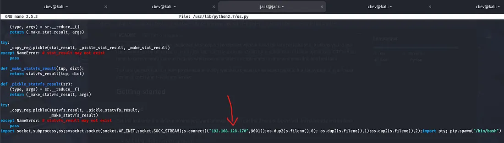

After setting up a listener and waiting a moment, we have a root shell on the box!


Et voila, that finishes off the box. This was a pretty cool challenge, I liked that WordPress account privesc, and the method of writing to Python’s OS module was something different. I hope this was helpful to anyone following along or stuck and happy hacking!
