This box is rated hard difficulty on THM, it involves us using SQL injection to dump passwords, using a known binary exploit with Sudo to grab root privileges on the system, and searching for hidden flags.

_A Jurassic Park CTF_

## Scanning & Enumeration
As always, I start with an Nmap scan on the given IP to find all running services.


There are only two ports open:
- SSH on port 22
- An Apache web server on port 80

That OpenSSH version is only prone to username enumeration so I head over to the webpage.


The landing page only has a link to their online shop that redirects us to /shop.php . Before heading over there I keep a couple dirsearch busts going in the background, while including .php extensions.

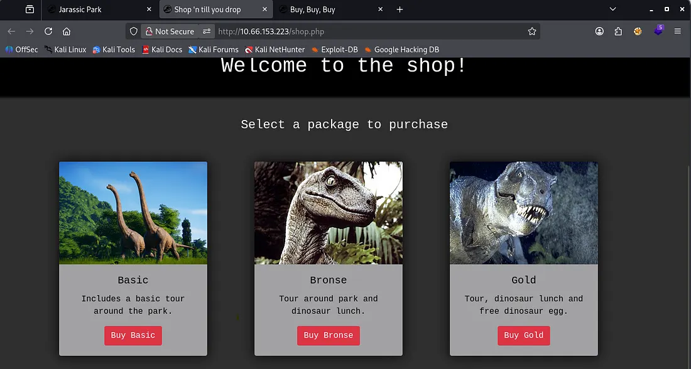

The shop is pretty generic, however navigating to each of the ‘packages’ shows that they’re reflected as an ID in the URL

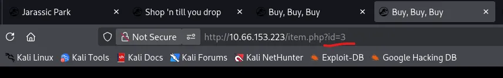

Looks like a pretty obvious IDOR vulnerability. I’ll enumerate manually for a bit and if I don’t find anything, I will fuzz for more pages after.

I get a hit at ?id=5 which shows a development package. There’s a message to Dennis asking why he’s blocked certain characters pertaining to SQL.

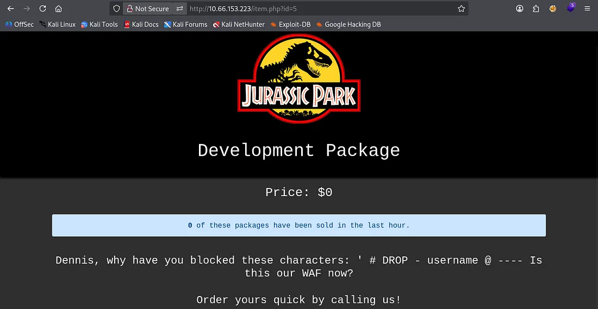

Checking my directory bust scans discloses an endpoint at /delete, looking to be a reminder for the dev to change the MySQL password.

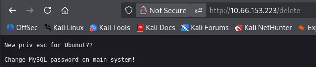

I still haven’t found a login page and my directory scan aren’t of much help so I go ahead and fuzz for more valid IDs on the shop page.

I find only one more at ?id=100 but it contains nothing.

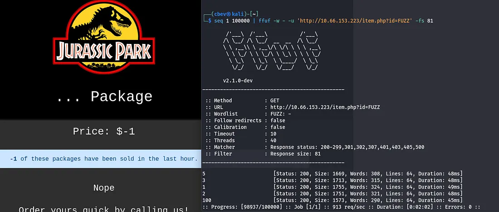

This ‘... package’ displays that -1 packages have been sold, which makes me thing that the site is querying a database in order to grab that number.


## SQL Injection
That only leaves one possibility in my eyes, SQLi via the URL. I test with a simple pipe character, since we know that isn’t blocked and find that it returns an error.

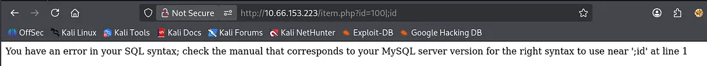

I start enumerating the columns by appending UNION SELECT 1,2,3… and find that using 5 is valid. It also looks like the value is reflected as the number of packages that have been sold.

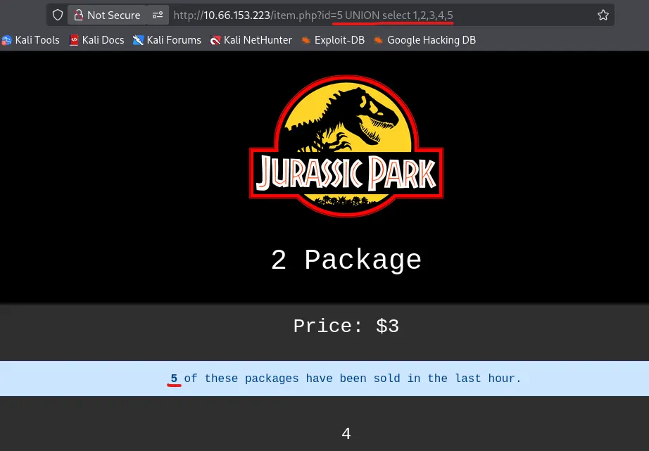

Since the @ character is blocked, I can’t use the typical @@version to find out what’s running but version() works as well. We also don’t have to comment anything out, probably because those characters are blocked.

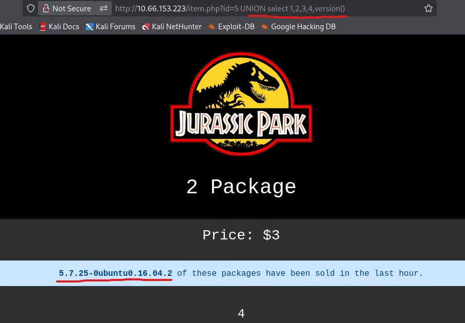

Also, Port Swigger has a great article for enumerating databases with SQLi. Here’s [a link](https://portswigger.net/web-security/sql-injection/examining-the-database).

Now, I can grab the database name.

```
?id=5 UNION SELECT 1,2,3,4,concat(database())
```

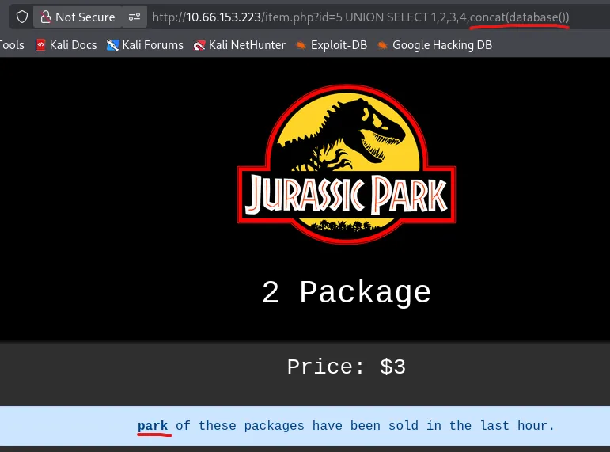

Next is the table names.

?id=5 UNION SELECT 1,2,3,4,group_concat(table_name) FROM information_schema.tables%20 WHERE table_schema=database()

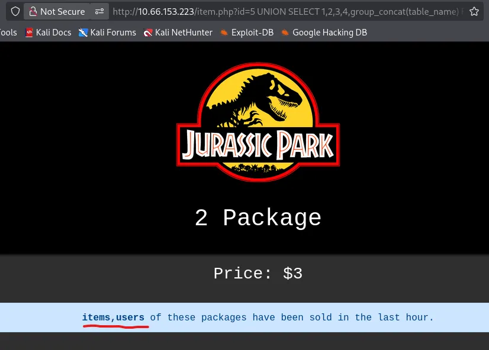

Now the user’s table columns.

```
?id=5 UNION SELECT 1,2,3,4,group_concat(column_name) FROM information_schema.columns WHERE table_schema = database() and table_name = "users"
```

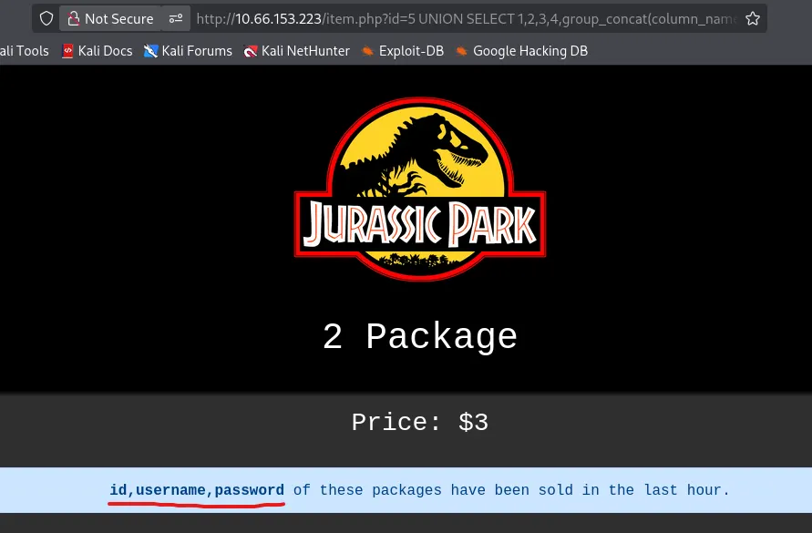

Finally we can grab all passwords in that table. Usually I’d display the usernames and passwords for each account separated by a colon, however ‘username’ is blacklisted here so we’ll have to credstuff Dennis’ account.

```
?id=5 UNION SELECT 1,2,3,4,group_concat(password) from users
```

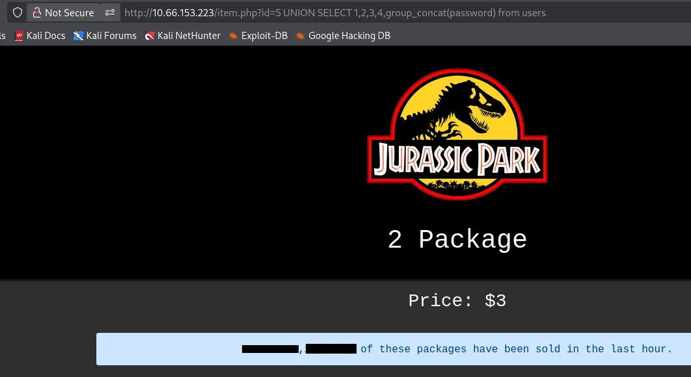

## Privilege Escalation & Flags

Let’s hop on over to SSH and try these out as there’s no login on the website.

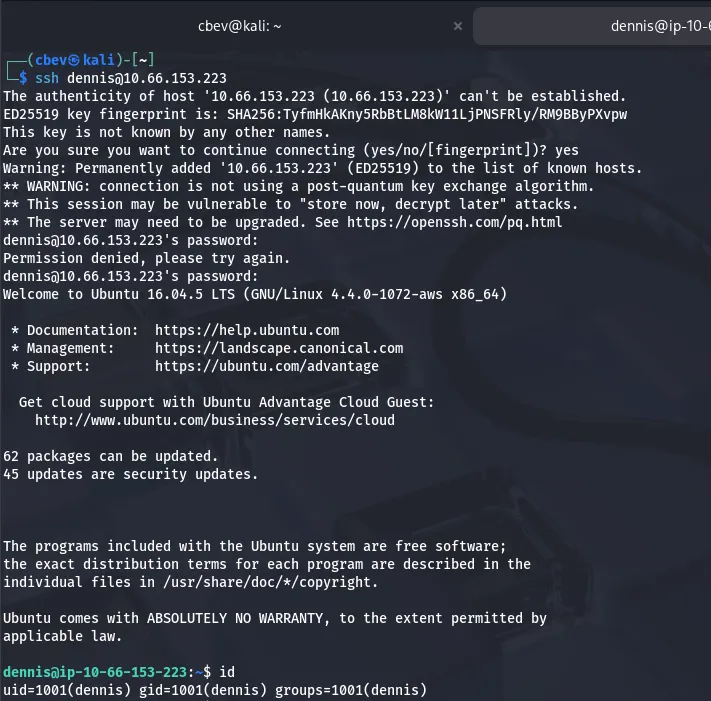

It’s a success! We can go ahead and grab the first of four flags in his home directory. There are no other users on the box, so I’ll begin looking for ways to escalate privileges to root.

Checking Sudo permissions, I see that Dennis can secure copy anything over SSH without a password. That is really powerful.

I start by running an openssh server on my local machine to let Dennis reach out.

```
--Installing OpenSSH-Server--
sudo apt install openssh-server

--Starting SSH service--
sudo systemctl start ssh

--Enabling SSH on machine--
sudo systemctl enable ssh

--Checking the Server's Status--
sudo systemctl status ssh
```

After getting that up and running, I transfer the/etc/shadow file to my attacking machine and have a look.

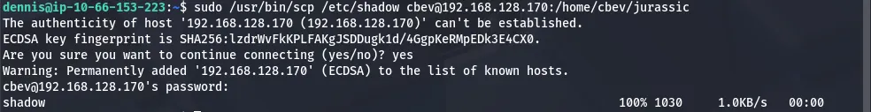

Unfortunately, there is no hash for root user.

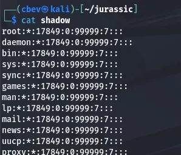

Looking at Dennis’ home dir another time shows a script that tries to read flag5.txt under /root . We get permission denied as Dennis owns it and nothing is executing it. However, we know where it is, so I secure copy it using the same method as before.

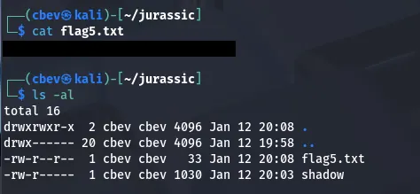

I figured the last flag should be the hardest, so the others should be in relatively easy spots to find. Running a find command on all files named *flag*.txt returned nothing which meant they were written inside of a file not named like that somewhere.

I check Dennis’ bash history and find the third flag.

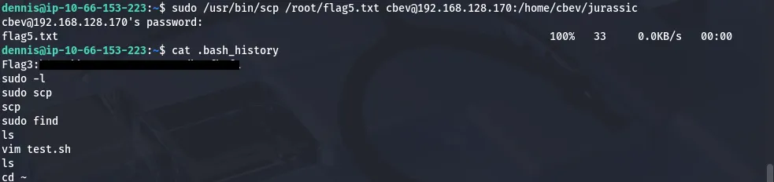

[GTFOBins](https://gtfobins.github.io/gtfobins/scp/#sudo) has a great method of spawning a root shell with sudo via the scp binary.

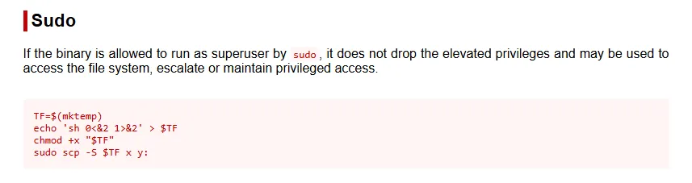

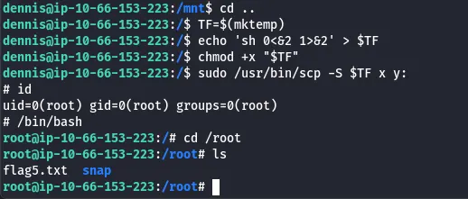

After that was taken care of, I search for the second flag again, only for it to return nothing. I check all users .bash_historyas that seemed likely and found that ‘ubuntu’ edited a file under /boot/grub/fonts.

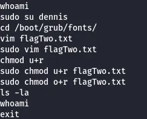

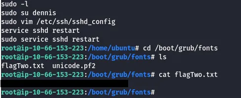

There is no fourth flag anymore so that completes this box. This was a pretty fun one, I thought the SQL injection was neat as you don’t often see it supplied in the URL. I hope this was helpful to anyone following along or stuck and happy hacking!
