This box is the first of five side quest challenges in THM’s Advent of Cyber ’25. It’s ranked hard difficulty and is easily the most time consuming of all. It involves us gathering OSINT to brute force a password, a ton of network enumeration to find auth tokens/endpoints, and a Docker privilege escalation to find a gate code.

_Can you help Hopper escape his wrongful imprisonment in HopSec asylum?_

This box kicked a lot of people’s a** including mine (took me the better part of a week), but keeping at it paid off in the end so if you’re stuck take a step back and revisit other routes.

## Getting Key
This box requires a key from the AOC‘s’ day 1 room; I’ll show how to get all three parts to unlock the .png containing our passcode to the side quest box.

Reading the read-me-please.txt file gives a few hints as to where the keys may be:


There’s also credentials to eddi_knapp ‘s account. His home directory has all parts of the key in it.

The first key fragment is inside of Eddi's.bashrc file.

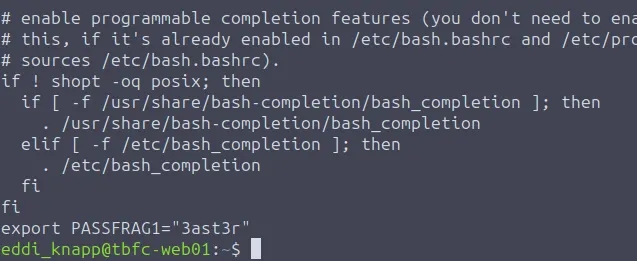

The second is a bit harder and we need some knowledge about GitHub commands. It’s located under the .secret_git directory inside one of the log commits.

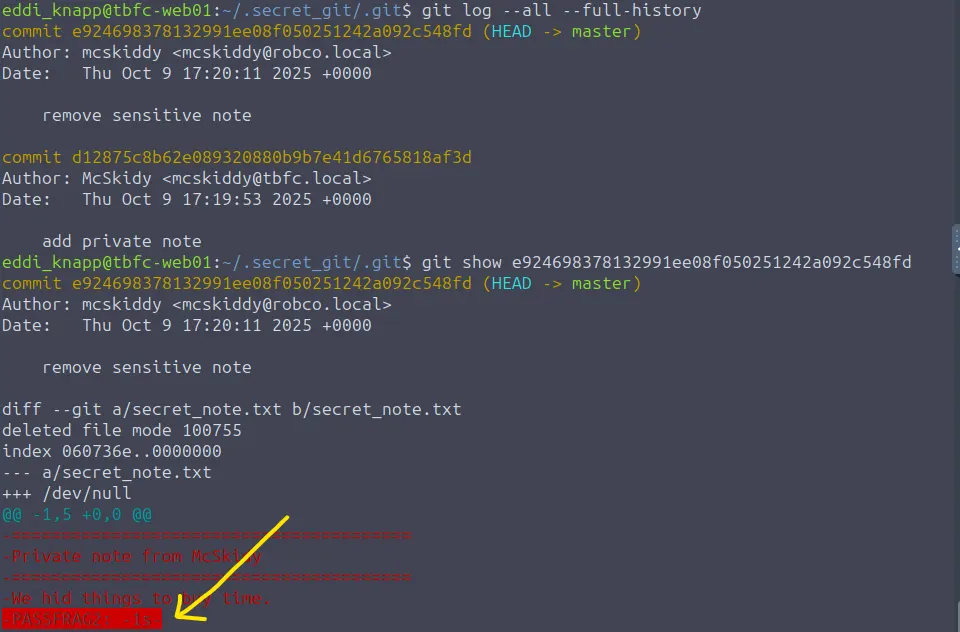

The third fragment is a string at the end of .easter_egg in the Pictures directory.


Putting these together gets the whole password of 3ast3r-1s-c0M1nG . Now let’s use this to decrypt a PGP file in the Documents dir.

Use this command if having trouble:

```
gpg --batch --passphrase "3ast3r-1s-c0M1nG" -d mcskidy_note.txt.gpg
```

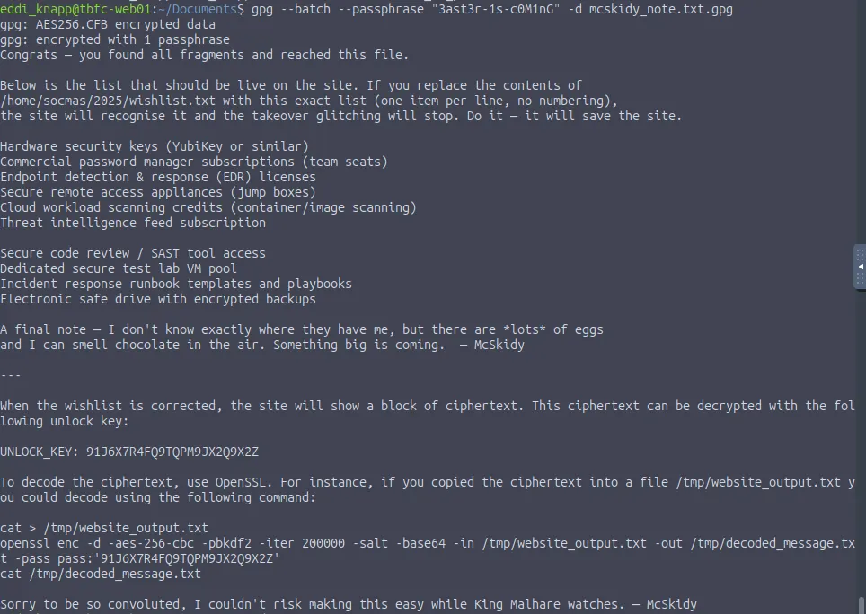

This note gives instructions on how to fix the website as well as an unlock key for deciphering the website’s ciphertext.

Let’s start by correcting the wishlist text file under /home/socmas/2025/ .

```
cat > wishlist.txt << 'EOF'
Hardware security keys (YubiKey or similar)
Commercial password manager subscriptions (team seats)
Endpoint detection & response (EDR) licenses
Secure remote access appliances (jump boxes)
Cloud workload scanning credits (container/image scanning)
Threat intelligence feed subscription
Secure code review / SAST tool access
Dedicated secure test lab VM pool
Incident response runbook templates and playbooks
Electronic safe drive with encrypted backups
EOF
```

After that’s done, the website should stop glitching and we are given ciphertext to decrypt. The note gave us a command to decipher it so let’s echo the string and pipe the output into that.

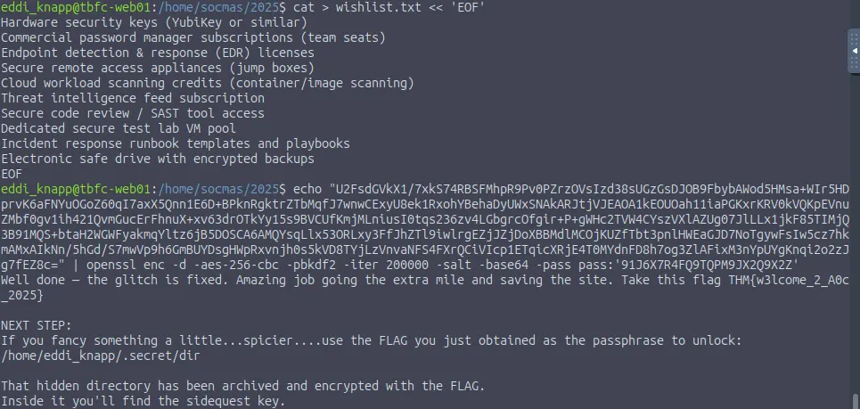

Next step is to use the flag we just got to unlock a directory under /home/eddi_knapp/.secret/dir . We can use a command similar to the first gpg decryption to output the gunzip file:

```
gpg --batch --passphrase "THM{w3lcome_2_A0c_2025}" -d dir.tar.gz.gpg > dir.tar.gz
```

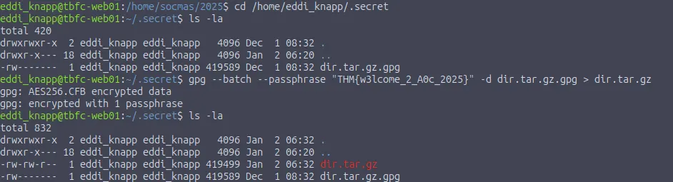

Last step is to unzip the tar archive which rewards us with the png file containing the passcode for Side Quest 1.

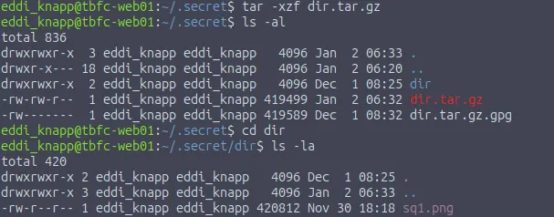

The code is in the picture itself, not hidden in the data like steganography. Either way we need to transfer the file to a web server as I couldn’t open it directly from the terminal. Copy the file to /home/socmas/2025/ as we have browser access to that location.

Note: I had to switch to root user in another terminal because we don’t have access to create files in there as eddi_knapp.

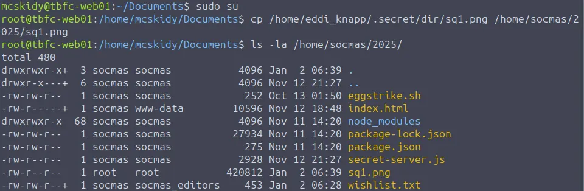

Now we can open it in our browser to grab the code.

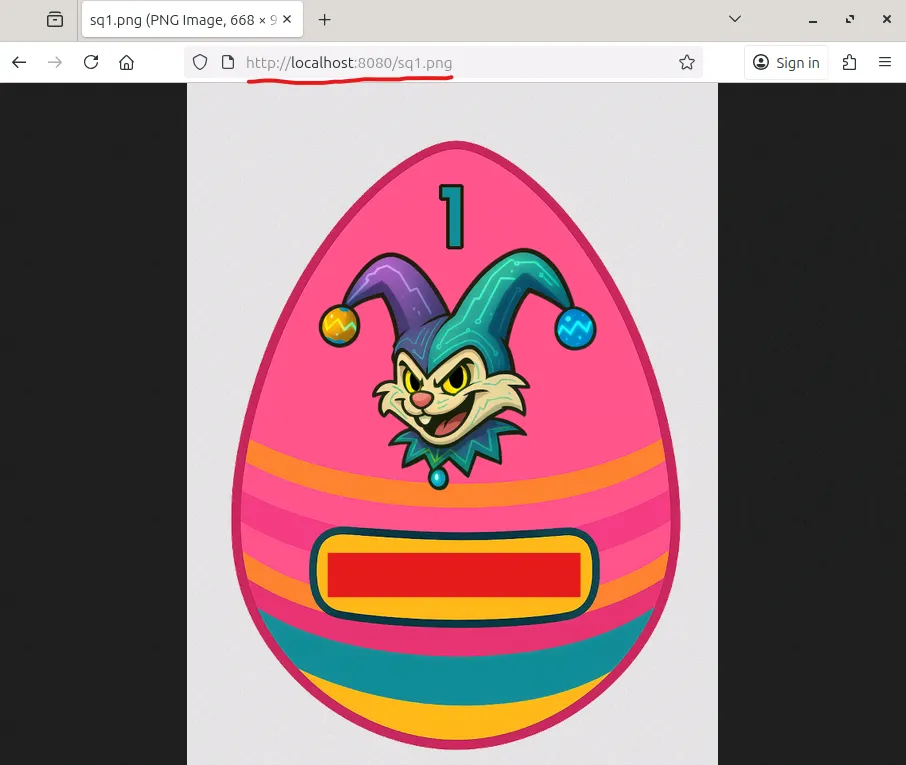

Now onto the actual challenge :)

## Scanning & Enumeration
First we need to unlock the box by typing the passcode at http://MACHINE_IP:21337. After giving that a moment to properly boot, I start with an Nmap scan to find running services on the given IP.

```
$ sudo nmap -p22,80,8000,8080,9001,13400-13404,21337 -sCV 10.66.189.218 -oN fullscan.tcp

Starting Nmap 7.95 ( https://nmap.org ) at 2026-01-01 17:50 CST
Nmap scan report for 10.66.189.218
Host is up (0.046s latency).

PORT      STATE SERVICE         VERSION
22/tcp    open  ssh             OpenSSH 9.6p1 Ubuntu 3ubuntu13.11 (Ubuntu Linux; protocol 2.0)
| ssh-hostkey: 
|   256 1e:12:c2:06:36:d7:28:2d:3e:74:fc:37:70:55:ed:d7 (ECDSA)
|_  256 33:55:8b:d5:d4:7b:6b:bc:79:86:19:9a:99:b5:08:f1 (ED25519)
80/tcp    open  http            nginx 1.24.0 (Ubuntu)
|_http-server-header: nginx/1.24.0 (Ubuntu)
|_http-title: HopSec Asylum - Security Console
8000/tcp  open  http-alt
| http-title: Fakebook - Sign In
|_Requested resource was /accounts/login/?next=/posts/
| fingerprint-strings: 
|   FourOhFourRequest: 
|     HTTP/1.0 404 Not Found
|     Content-Type: text/html
|     X-Frame-Options: DENY
|     Content-Length: 179
|     Vary: Accept-Language
|     Content-Language: en
|     X-Content-Type-Options: nosniff
|     <!doctype html>
|     <html lang="en">
|     <head>
|     <title>Not Found</title>
|     </head>
|     <body>
|     <h1>Not Found</h1><p>The requested resource was not found on this server.</p>
|     </body>
|     </html>
|   GenericLines, Help, RTSPRequest, SIPOptions, Socks5, TerminalServerCookie: 
|     HTTP/1.1 400 Bad Request
|   GetRequest, HTTPOptions: 
|     HTTP/1.0 302 Found
|     Content-Type: text/html; charset=utf-8
|     Location: /posts/
|     X-Frame-Options: DENY
|     Content-Length: 0
|     Vary: Accept-Language
|     Content-Language: en
|_    X-Content-Type-Options: nosniff
8080/tcp  open  http            SimpleHTTPServer 0.6 (Python 3.12.3)
|_http-server-header: SimpleHTTP/0.6 Python/3.12.3
|_http-title: HopSec Asylum - Security Console
9001/tcp  open  tor-orport?
| fingerprint-strings: 
|   NULL: 
|     ASYLUM GATE CONTROL SYSTEM - SCADA TERMINAL v2.1 
|     [AUTHORIZED PERSONNEL ONLY] 
|     WARNING: This system controls critical infrastructure
|     access attempts are logged and monitored
|     Unauthorized access will result in immediate termination
|     Authentication required to access SCADA terminal
|     Provide authorization token from Part 1 to proceed
|_    [AUTH] Enter authorization token:
13400/tcp open  hadoop-datanode Apache Hadoop 1.24.0 (Ubuntu)
| hadoop-tasktracker-info: 
|_  Logs: loginBtn
| hadoop-datanode-info: 
|_  Logs: loginBtn
|_http-title: HopSec Asylum \xE2\x80\x93 Facility Video Portal
13401/tcp open  http            Werkzeug httpd 3.1.3 (Python 3.12.3)
|_http-server-header: Werkzeug/3.1.3 Python/3.12.3
|_http-title: 404 Not Found
13402/tcp open  http            nginx 1.24.0 (Ubuntu)
|_http-cors: HEAD GET OPTIONS
|_http-title: Welcome to nginx!
|_http-server-header: nginx/1.24.0 (Ubuntu)
13403/tcp open  unknown
| fingerprint-strings: 
|   DNSStatusRequestTCP, DNSVersionBindReqTCP, Help, Kerberos, LANDesk-RC, LDAPBindReq, LDAPSearchReq, LPDString, NCP, RPCCheck, SIPOptions, SMBProgNeg, SSLSessionReq, TLSSessionReq, TerminalServer, TerminalServerCookie, X11Probe: 
|     HTTP/1.1 400 Bad Request
|     Connection: close
|   FourOhFourRequest: 
|     HTTP/1.1 404 Not Found
|     Date: Thu, 01 Jan 2026 23:51:08 GMT
|     Connection: close
|   GetRequest, HTTPOptions, RTSPRequest: 
|     HTTP/1.1 404 Not Found
|     Date: Thu, 01 Jan 2026 23:51:07 GMT
|_    Connection: close
13404/tcp open  unknown
| fingerprint-strings: 
|   FourOhFourRequest, GenericLines, GetRequest, HTTPOptions, Help, Kerberos, LDAPSearchReq, LPDString, RTSPRequest, SIPOptions, SSLSessionReq, TLSSessionReq, TerminalServerCookie: 
|_    unauthorized
21337/tcp open  http            Werkzeug httpd 3.0.1 (Python 3.12.3)
|_http-server-header: Werkzeug/3.0.1 Python/3.12.3
|_http-title: Unlock Hopper's Memories
4 services unrecognized despite returning data. If you know the service/version, please submit the following fingerprints at https://nmap.org/cgi-bin/submit.cgi?new-service :
```

We get a lot of info back:
- SSH on port 22
- Web servers on port 80, 8000, and 8080
- A Scada-like terminal on port 9001
- A video portal login on port 13400
- Ports 13401–13404 are likely backend servers to assist with HTTP
- A Python web server on port 21337 (Only used for key to open box)

Plenty of places to begin enumerating so I work my way up starting at port 80.

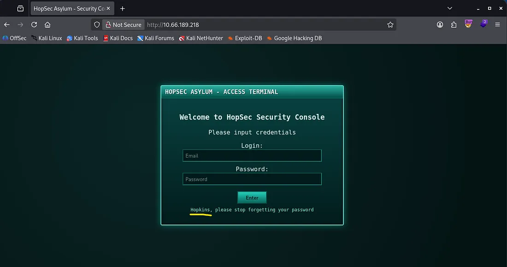

This is an access terminal for HopSec’s security console. We’re going to need to sign in to be able to progress as the task information discloses we must use the console to input all three flags to escape. There’s also a username (Hopkins) we can try to brute force or find credentials for.

Hopping (get it?) over to port 8000 we find a Facebook clone. It isn’t prone to injections but we are able to create our own account and have a look around.

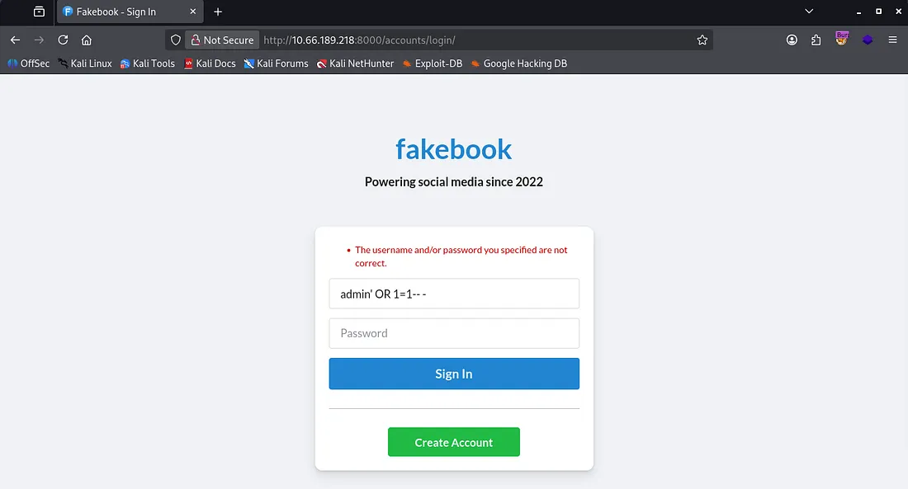

After signing in with a new account, we see plenty of posts made by the story characters. I try some other basic tests for XXS and injection attacks for the input fields, but couldn’t return anything.

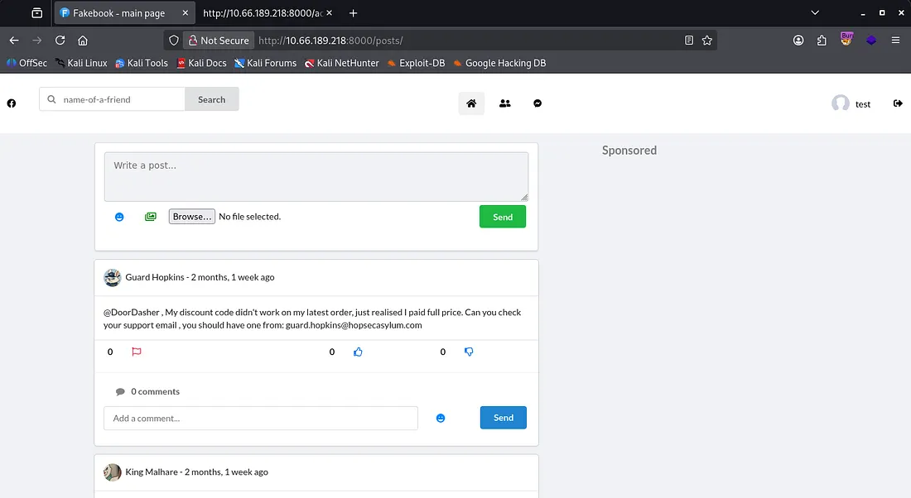

Taking some time to read all the posts and comments under them shows that Guard Hopkins is likely whos account we’re after. If we can sign in as him we’ll have access to the security console and get further.

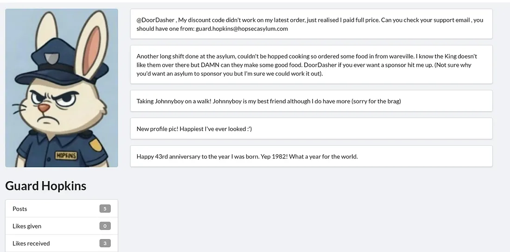

He posts his email as well as some personal info like a birth year and pet name. Checking a comment under a post made by Sir Carrotbane shows how Hopkins structures his password. The password written in the comment is invalid so he must’ve changed it.


Thinking back to the posts he’s made, we have a dog name and year which looks similar to the older password. Sir Carrotbane hints at us using the combinator.bin script under hashcat’s utilites to create a custom wordlist to brute force Hopkins’ password.

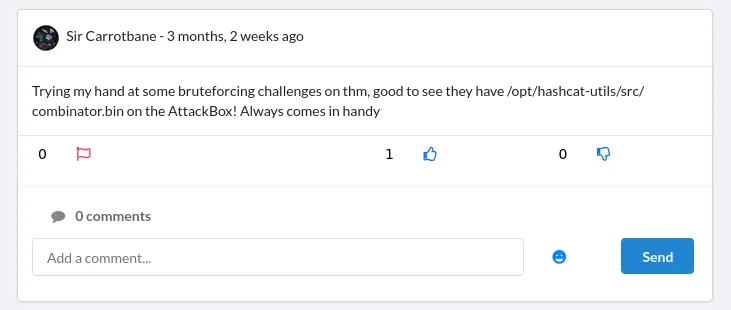

I end up just guessing his new password quickly (Johnnyboy1982!), however it’s only valid for both the security portal login and the faculty video portal.

Checking port 8080 before using those creds was a good idea because this page seemed to be a functioning version of the one on port 80.

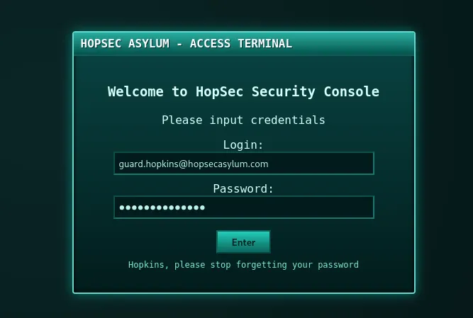

As it’s not static use this to sign in and we can grab our first flag by unlocking the cells/storage door without a passcode.

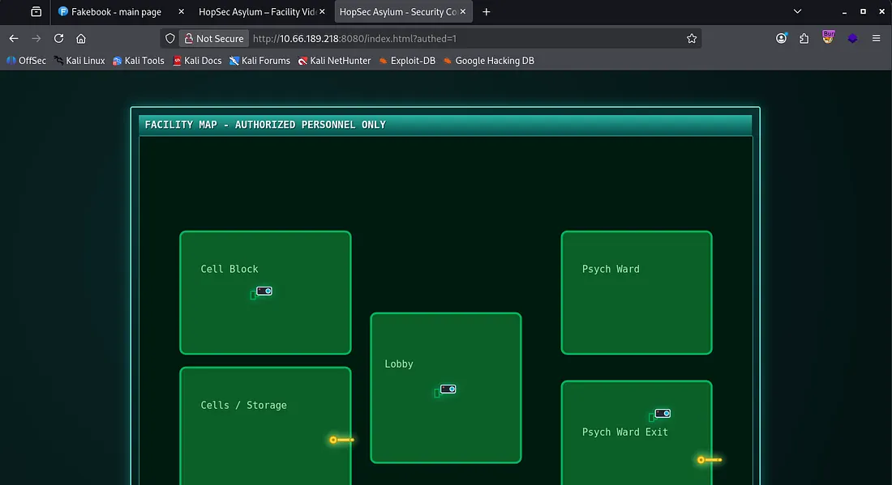

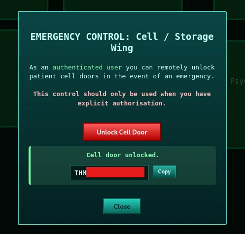

From here, it’s possible to alter a cookie held in our browser’s local storage to ‘unlock’ all doors but it doesn’t grant us any flags and we still need to enter all three flags to get past a door at the end.

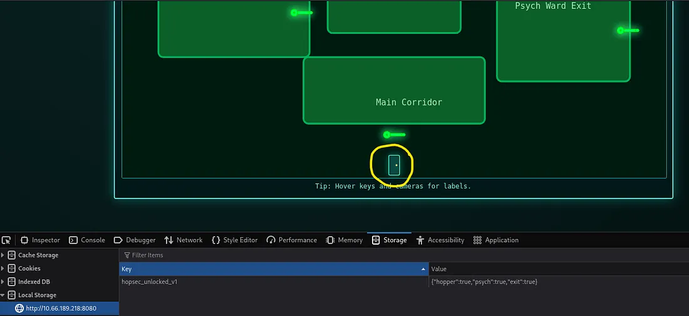

I run a few gobuster directory scans using directory-list-2.3-medium.txt in the background for ports 8080, 8000, and 13400. While those are going I login to the faculty video portal on 13400 only to find I’ve been jestered.

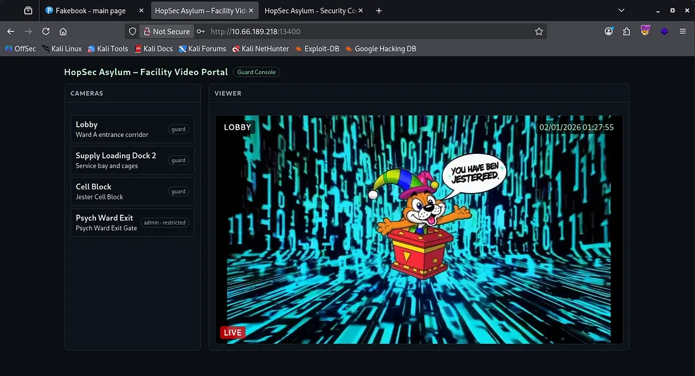

There are a few tokens stored in our local storage but changing our role to admin gets us the same video feed as the others, so this wont work. The hopsec_token is something akin to a JWT without the header portion and I spent a while trying to use it to bypass the admin auth, however this turned out to be a rabbit hole or I failed at it.

While snooping around the network tab, I find an API for the camera feed which checks our effective_tier and gives us a ticket for which videos we have access to.

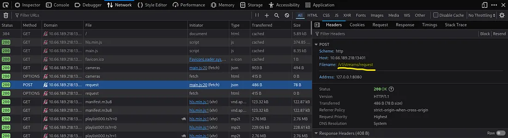

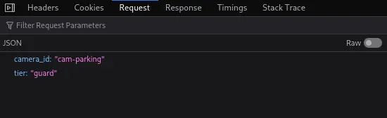

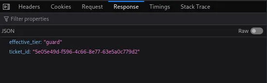

I also found an endpoint for the jester video under /v1/streams/ which seems to contain the video id granted from that API on port 13401.

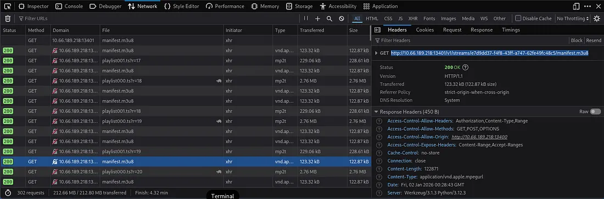

So putting it all together, we know that whenever requesting a video feed, first a POST request is made to /v1/cameras/request on port 13401 using the camera_id and tier fields. The API checks our effective_tier and determines if we have access to the guard or admin video feeds based off of it. Finally, we make a GET request to the /v1/streams/ endpoint using the id given by the API.

## Exploitation
I start by capturing a POST request to the /v1/cameras/request API in Burp Suite and sending it to repeater. Attempting to change the JSON fields to its admin equivalents still returns our effective_tier as guard and the non-admin video id.

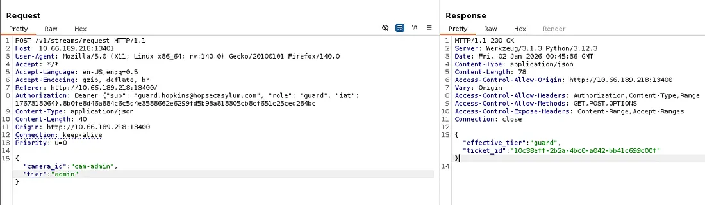

This had me stumped for a while until coming parameter pollution vulnerabilities while researching auth bypasses. If we add `?tier=admin` to our URL, it actually changes our effective_tier to be so as well.

Honestly this didn’t make too much sense to me as we are already providing JSON fields and a Bearer token to authenticate, so it seems a little random but I digress.

That response contains a different ticket_id than the guard one so let’s intercept a normal request to the video endpoint and change it to that one. I use Kali’s Celluloid tool here but you can use any video streaming application/tool that allows for a URL I believe.

Our admin video feed is located at `http://MACHINE_IP:13401/v1/streams/TICKET_ID/manifest.m3u8`

_Note: If your feed gets a “playback was terminated abnormally”, just grab a new ticket_id from the repeater tab same as before and try again_

Watching the video feed shows a man typing in the passcode for the second door on the security console.

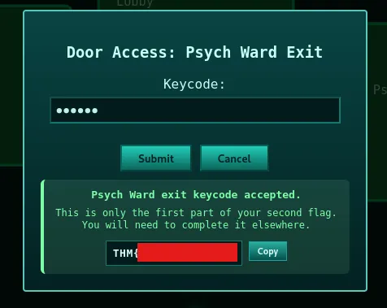

Using it to unlock the Psych Ward Exit gives us some sad news. We’re only allowed half of the second flag and the other part is somewhere else.

Looking back through the whole admin video feed process, I captured a request to the keypad video in Burp Suite and discovered two new endpoints to play around with at /v1/ingest/diagnostics and /v1/ingest/jobs .

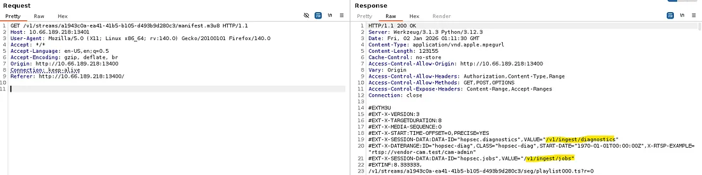

The diagnostics endpoint only allows for POST requests and sending one returns an “error: unathorized” message. A bit of debugging and adding headers and we get a valid response from it.

We’ll need three things for this POST request:
- The Authorization header from a valid request captured earlier
- Another header to specify that we’re supplying JSON data
- A valid rtsp_url (we can find this in the request captured to the admin’s video feed)

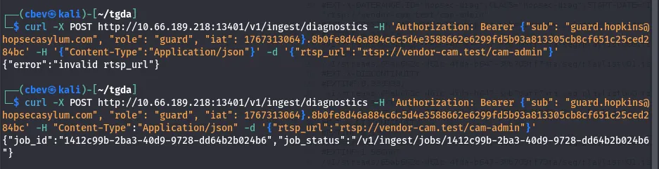

Another curl to the new endpoint at `/v1/ingest/jobs/JOB_ID` gives us a token for something.

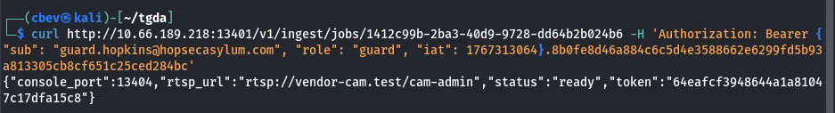

If we use netcat to connect on port 13404 and enter the newly found token, we’re granted a shell as svc_vidops.


I find a pair of credentials for admin in /api/app.py (this ends up being useless but we can login as admin now).

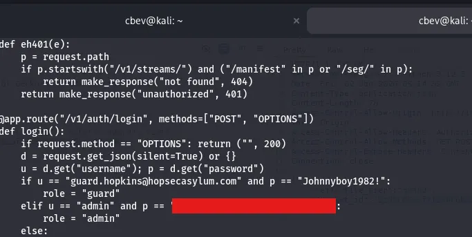

A bit more searching yields the second part of flag 2 under /home/svc_vidops .

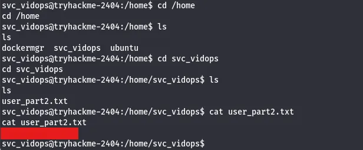

## Privilege Escalation
Now I start with the usual routes of privilege escalation. We don’t have a password for anyone yet so sudo commands are off the table. No crontabs are running and file capabilities are normal as well. I check for binaries with a SUID bit set and find a strange one.

This `diag_shell` is owned by the docker manager account and running it grants us a shell under their account.


Judging by our new account’s name, we are inside a docker container. Since we have access to docker.sock, we’re able to run commands.

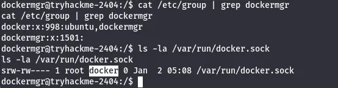

If you didn’t know, docker.sock file is a Unix domain socket that serves as the primary communication channel between the Docker client (docker command we’re using) and the Docker daemon

It’s necessary to switch to the docker group as we have access to it and aren’t by default. So prepending `sg docker -c` to our command and placing it in quotes works well.

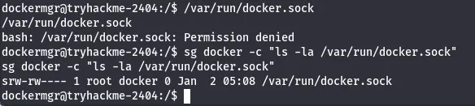

Now that we have access to that, GTFOBins has a method for popping a root shell through docker so I use that in conjunction to switching our group.

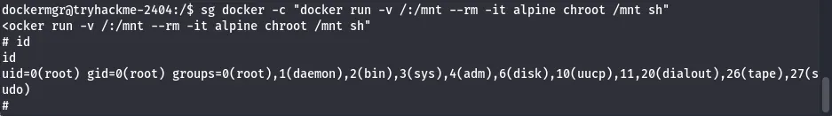

We have root privileges on the system but not our third flag yet. Using netcat to connect on port 9001 shows a Scada terminal and a token used to authenticate to it. This token is the second flag we got (both parts combined).

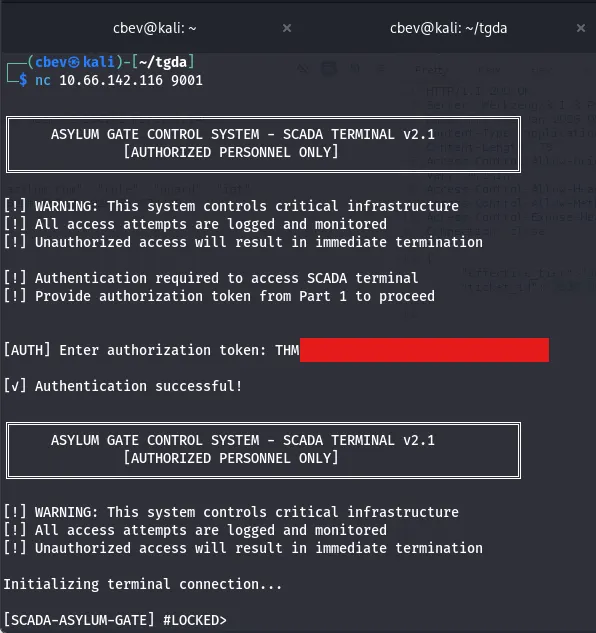

It looks like we need a code in order to open the last gate, luckily we have a root shell. I actually got root shell outside of the container, so I needed to repeat the steps and use a similar privesc command to become root inside of the docker container in order to have access to the proper files.

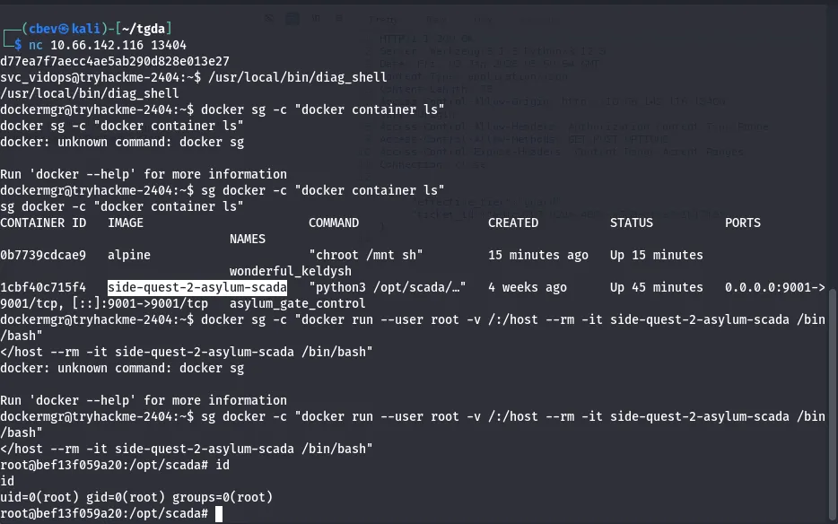

Displaying the python script (scada_terminal.py) behind the terminal under/opt/scada gives us our passcode and we’re clear to unlock the gate.

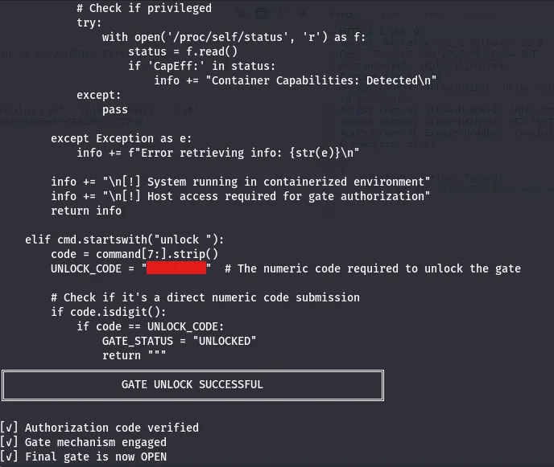

Typing in the same code for the last door in the security console gives the third and final flag.

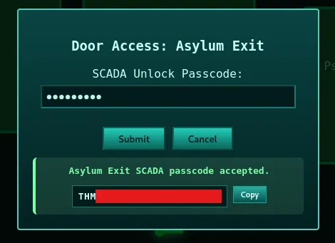

All that’s left is to enter all three flags in the door at the end which gives us an invite code to Hopper’s Origin (a prequel side quest box).

And there we have it. This challenge was a bit finicky at some parts and definitely took me longer than it should’ve. I hope this was helpful to anyone stuck like I was or following along and happy hacking!
