This box is ranked medium difficulty on THM and is centered around the Resident Evil game. The overarching challenge of this box is cryptography and enumeration to find valid keys.

_A CTF room based on the old-time survival horror game, Resident Evil. Can you survive until the end?_

## Scanning & Enumeration
As always, I run an Nmap scan on with the given IP to find running services.

Looking at the results shows we have three ports open:
- FTP on port 21
- SSH on port 22
- An Apache web server on port 80

I scanned for UDP as well and found nothing. Usually doesn’t pan out and is tricky because we can miss ports but is good practice.

The FTP server isn’t vulnerable and does not allow anonymous login so I head to the website and start enumerating. I also leave a gobuster dir search in the background to save on time.

Off the bat, we’re given a story which include potentials names to keep track of so I save them in a wordlist. There are more directories for the mansion and an attic endpoint I found with gobuster.

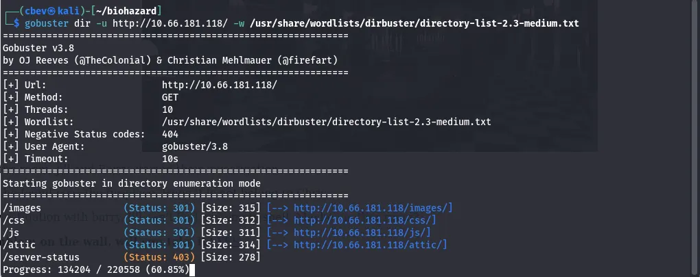

## Grabbing Keys
We need a key to unlock the attic door so I go back to enumerating. Searching the /mansionmain section shows another place for us at /diningRoom/ .

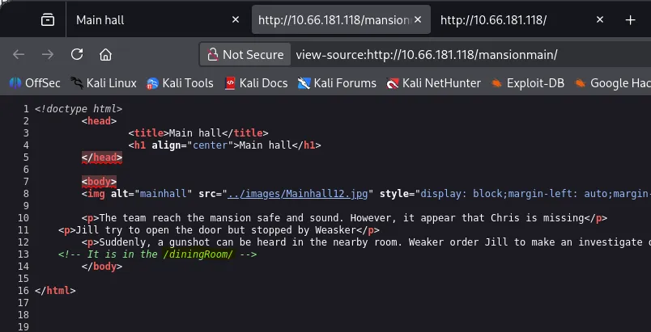

Heading to the dining room gives us the first of many flags, being the emblem. Clicking yes to getting the emblem flag shows that the site is ran on PHP and using the emblem after refreshing the page says that nothing happens. We must have the wrong key right now.

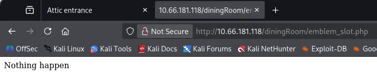

I looked at the page source again and found a base64 encoded string commented inside of it.

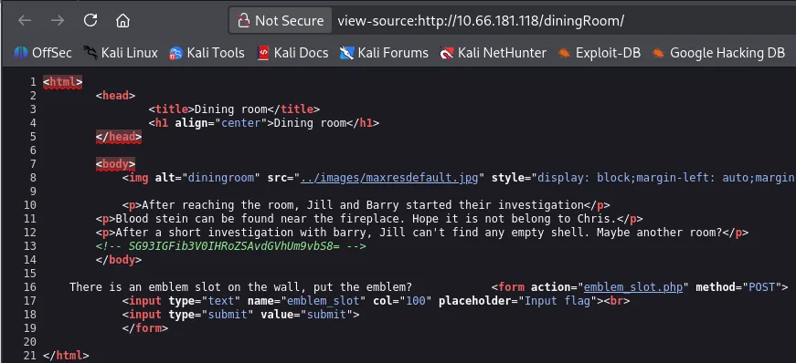

Decoding that gives us another directory at /teaRoom/ . Here we grab another flag labeled lockpick and get another room to look at.

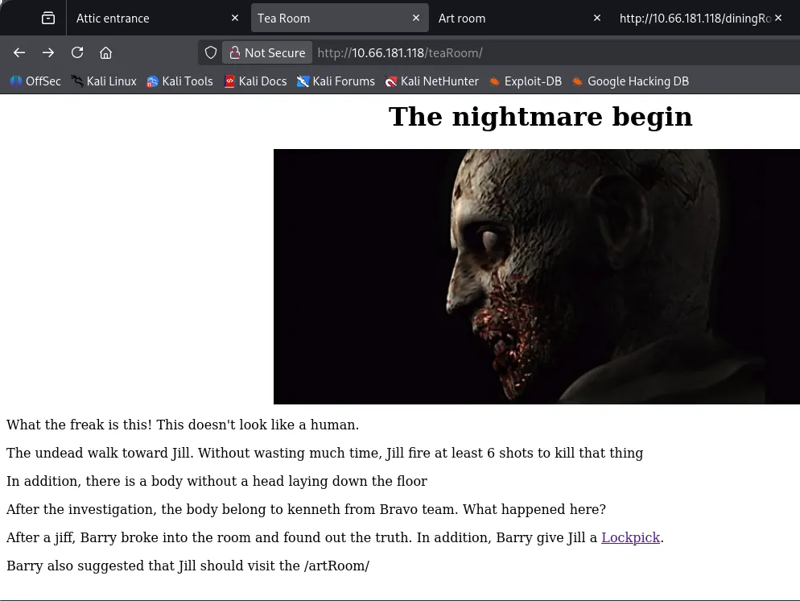

Heading over to the /artRoom/ grants us a map of the mansion including almost all rooms for it. This makes enumerating much easier.

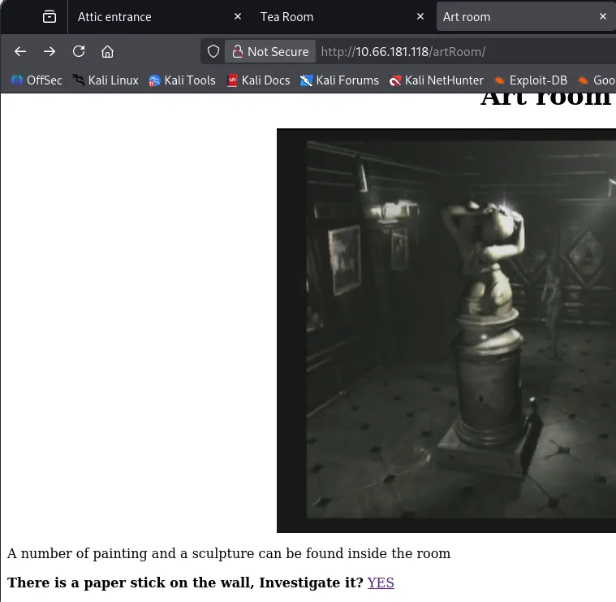

I start visiting all places one by one and find that /barRoom/ has a place to use the lockpick we found earlier. Using it gives us access to a piano to play stuff and a note labeled ‘moonlight somata’. Decoding this string from base32 gives us the music_sheet flag we can use to play at the piano.

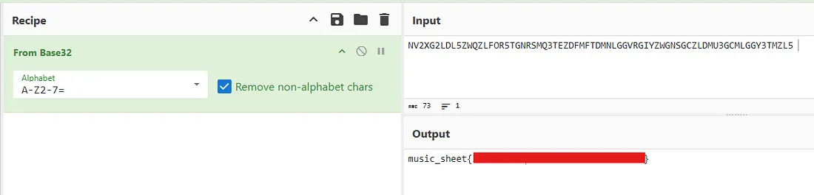

Playing the piano unlocks a secret bar room which grants us a gold emblem flag. However, refreshing the previous page and inputting the emblem says nothing happens.

I revisit the /diningRoom/ from before and entered the gold emblem as our key didn’t work the first time. This grants us an encrypted line.

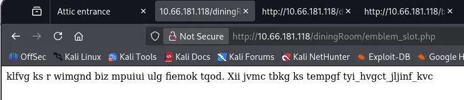

I try the first emblem we got at the secret bar room place and got a name. This is used to decrypt the line using Vigenère Decode in CyberChef.

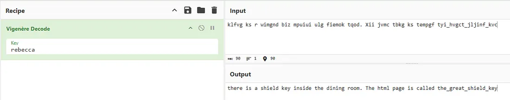

Deciphering that gives us the location of the shield key under the dining room again. This key unlocks the attic door and gives us crest #4 in a note left.

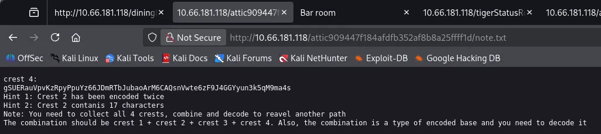

I visit the /diningRoom2f/ next and find a commented line encrypted with ROT13. This gives us the location of the blue gem flag.

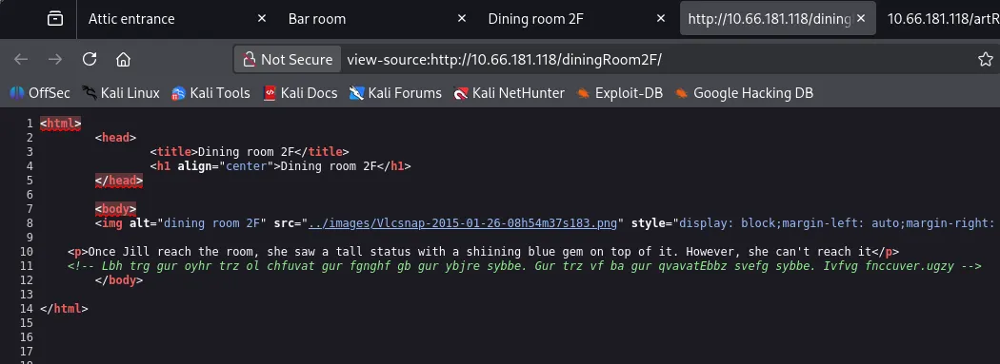

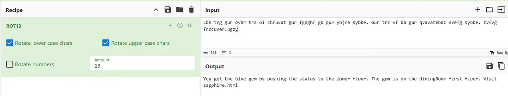

Visiting the /tigerStatusRoom/ shows a slot to put the blue gem flag in. Doing so grants us the first of four encoded crests which are used to reveal another path.

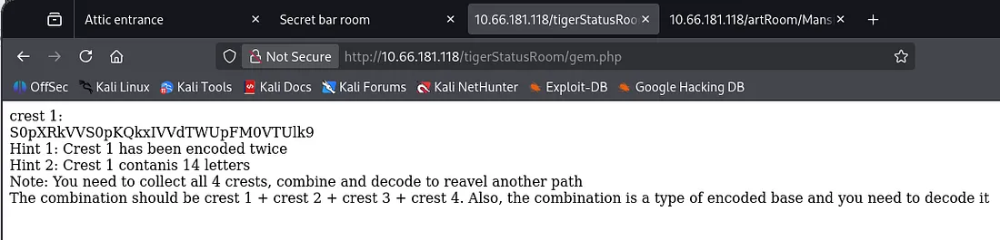

Visiting the gallery room gives the second crest inside a note left for us.

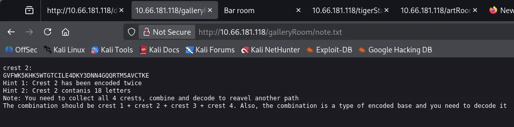

The shield flag also unlocks the armor room which gives us the last of our crests needed to find the secret path.

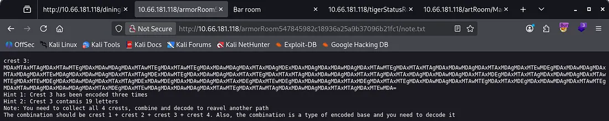

To decipher all crests in CyberChef do the following:

Crest 1 — From Base64 -> From Base32

Crest 2 — From Base32 -> From Base58

Crest 3 — From Base64 -> From Binary -> From Hex

Crest 4 — From Base58 -> From Hex

After decoding all parts, concatenate them into one long string and base64 decode it. This gives us FTP credentials for Hunter.

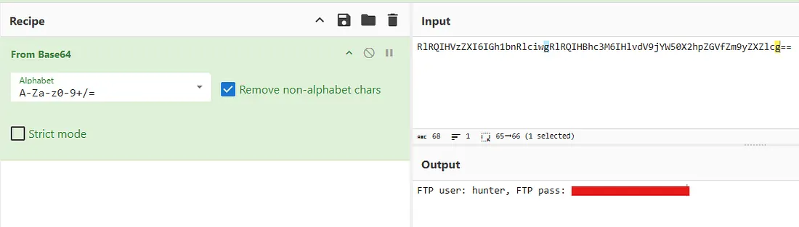

Signing into FTP on port 21 shows there are 5 files on the server. Three of which are .jpg keys, one is a PGP encrypted file for the helmet key, and the last is a note disclosing another locked door at /hidden_closet/ .

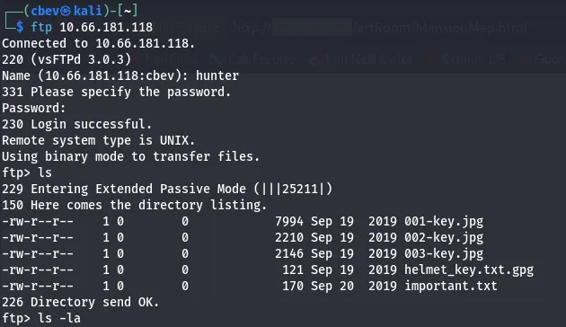

The jpg images are just regular pictures of keys, however each contains hidden data within them.

001-key.jpg has a a text file hidden using steganography. We can extract it using a steghide for the first part of the PGP key.

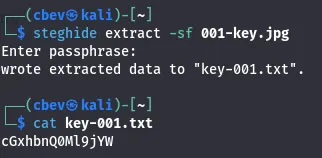

002-key.jpg has a comment inside of it, we can use exiftool to grab this line.

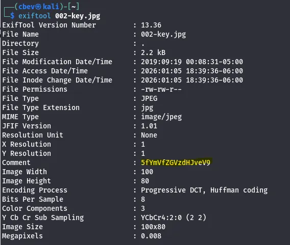

003-key.jpg also has a hidden text file but we need to use binwalk to extract it.

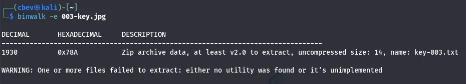

Combining all strings will give us the base64 encoded passphrase used to decrypt the PGP file.

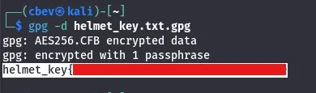

We can use this to unlock the hidden closet door which has an MO disk file containing another encrypted line and an SSH password. I still don’t have the username for SSH so I visit the /studyRoom/and enter the helmet password there.

## Privilege Escalation
This gives us a download link to a tar.gz archive. Unzipping this gives us the SSH username and we can login there.

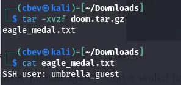

There is a hidden directory under our home dir where we can find chris. He gives us the second MO disk, we can use this to decrypt the first part using Vigenère decode again.

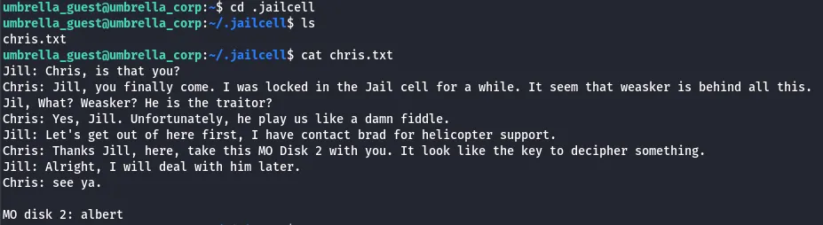

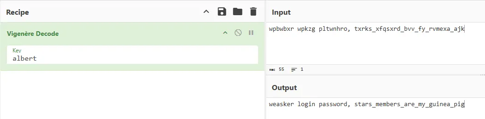

This gives us creds to login as weasker. Here we can find a conversation in his home directory of him and Jill talking about creating an ultimate lifeform.

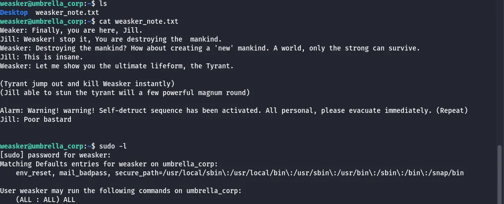

Checking Sudo privs shows that he can run any command without a password, so I use sudo /bin/bashto catch a root shell. Displaying the root.txt gives us some more story on what happens to the tyrant as well as our final flag.

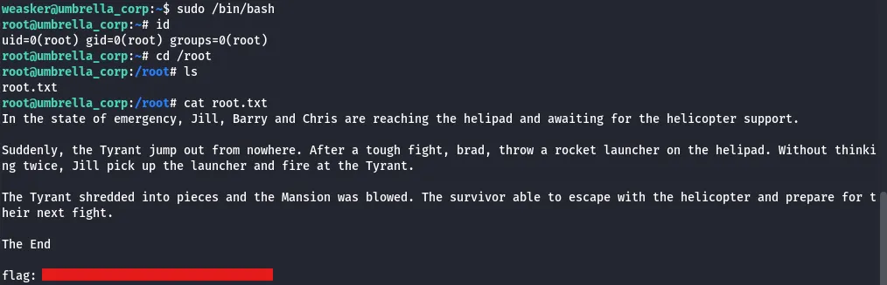

This box was pretty fun, I liked the different ways we had to unlock the doors found. I hope this was helpful to anyone following along and happy hacking!
