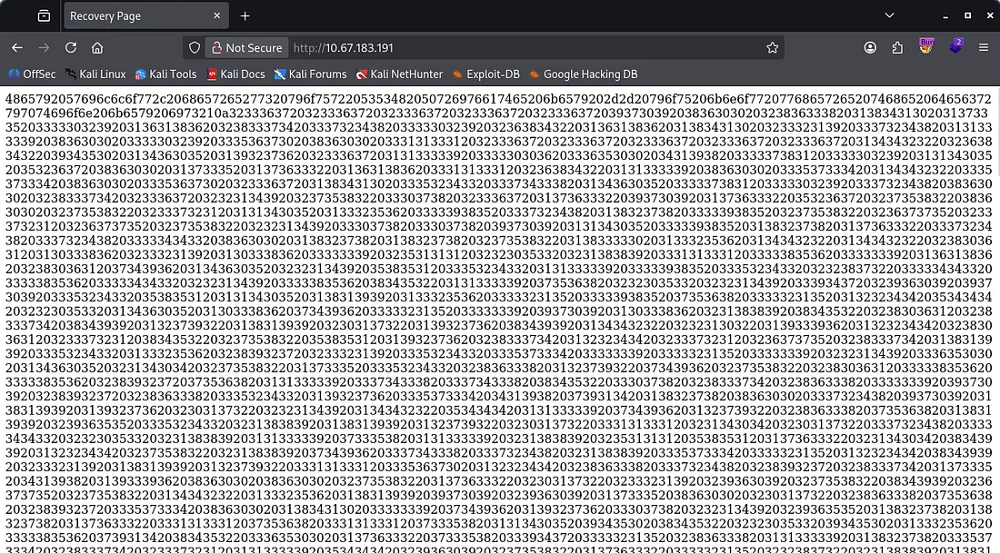
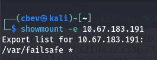
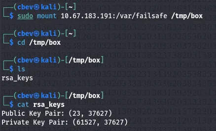
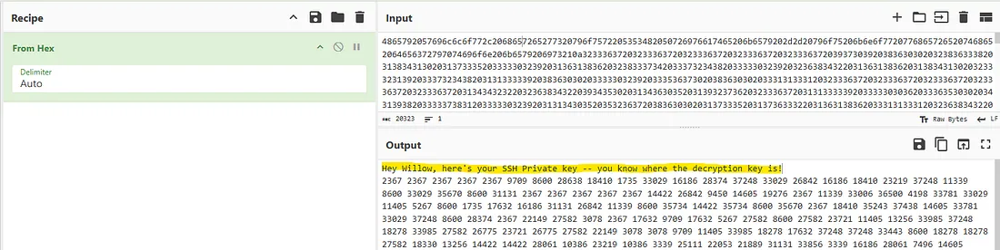
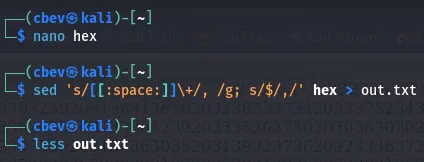
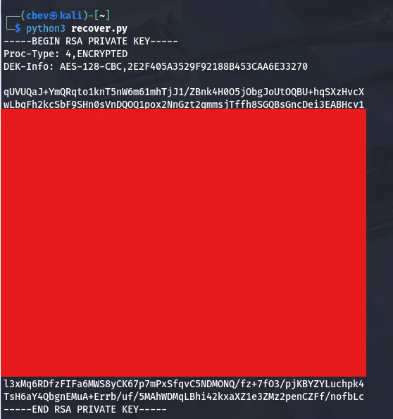
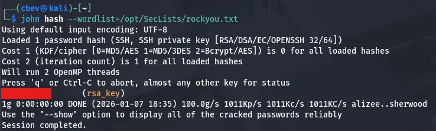
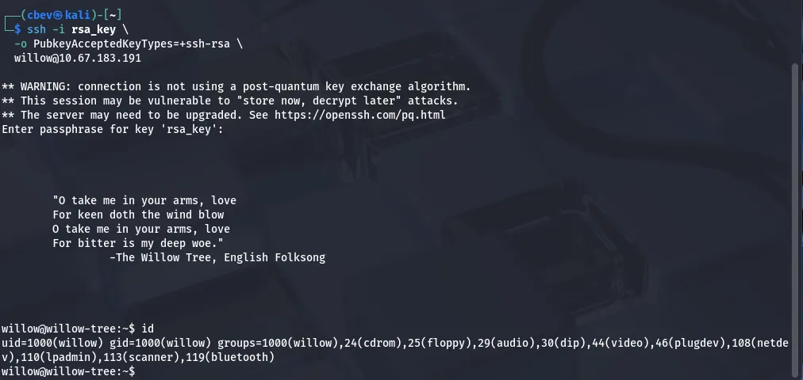
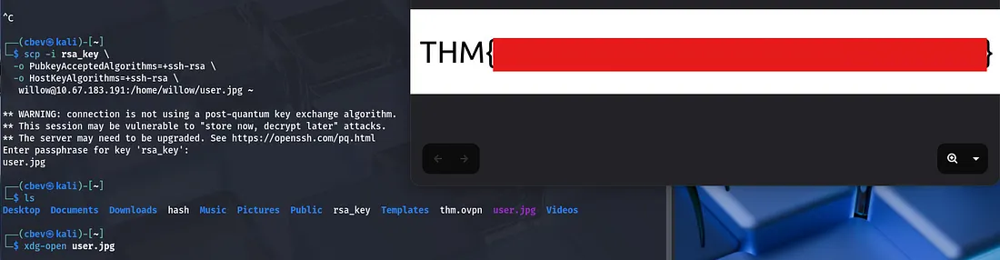
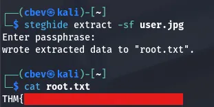

This box is ranked medium on THM, it involves us mounting a file share to get access to RSA key pair integers, which we can use to recover an SSH private key. After cracking that we abuse sudo privileges to mount a hidden backup somewhere else and grab the root password.

_What lies under the Willow Tree?_

## Scanning & Enumeration
As always, I start with an Nmap scan to find running services on the given IP:

```
$ sudo nmap -p22,80,111,2049 -sCV 10.67.183.191 -oN fullscan.tcp                 

Starting Nmap 7.95 ( https://nmap.org ) at 2026-01-07 18:07 CST
Nmap scan report for 10.67.183.191
Host is up (0.044s latency).

PORT     STATE SERVICE VERSION
22/tcp   open  ssh     OpenSSH 6.7p1 Debian 5 (protocol 2.0)
| ssh-hostkey: 
|   1024 43:b0:87:cd:e5:54:09:b1:c1:1e:78:65:d9:78:5e:1e (DSA)
|   2048 c2:65:91:c8:38:c9:cc:c7:f9:09:20:61:e5:54:bd:cf (RSA)
|   256 bf:3e:4b:3d:78:b6:79:41:f4:7d:90:63:5e:fb:2a:40 (ECDSA)
|_  256 2c:c8:87:4a:d8:f6:4c:c3:03:8d:4c:09:22:83:66:64 (ED25519)
80/tcp   open  http    Apache httpd 2.4.10 ((Debian))
|_http-server-header: Apache/2.4.10 (Debian)
|_http-title: Recovery Page
111/tcp  open  rpcbind 2-4 (RPC #100000)
| rpcinfo: 
|   program version    port/proto  service
|   100000  2,3,4        111/tcp   rpcbind
|   100000  2,3,4        111/udp   rpcbind
|   100000  3,4          111/tcp6  rpcbind
|   100000  3,4          111/udp6  rpcbind
|   100003  2,3,4       2049/tcp   nfs
|   100003  2,3,4       2049/tcp6  nfs
|   100003  2,3,4       2049/udp   nfs
|   100003  2,3,4       2049/udp6  nfs
|   100005  1,2,3      37114/udp6  mountd
|   100005  1,2,3      37771/udp   mountd
|   100005  1,2,3      53048/tcp   mountd
|   100005  1,2,3      56858/tcp6  mountd
|   100021  1,3,4      33712/udp6  nlockmgr
|   100021  1,3,4      34935/tcp   nlockmgr
|   100021  1,3,4      45911/udp   nlockmgr
|   100021  1,3,4      49274/tcp6  nlockmgr
|   100024  1          40608/udp   status
|   100024  1          52752/tcp6  status
|   100024  1          52780/udp6  status
|   100024  1          58780/tcp   status
|   100227  2,3         2049/tcp   nfs_acl
|   100227  2,3         2049/tcp6  nfs_acl
|   100227  2,3         2049/udp   nfs_acl
|_  100227  2,3         2049/udp6  nfs_acl
2049/tcp open  nfs     2-4 (RPC #100003)
Service Info: OS: Linux; CPE: cpe:/o:linux:linux_kernel

Service detection performed. Please report any incorrect results at https://nmap.org/submit/ .
Nmap done: 1 IP address (1 host up) scanned in 8.48 seconds
```

There are four ports open:
- SSH on port 22
- A web server on port 80
- rpcbind on port
- NFS on port 2049

Looking at the webpage it just seems like this is for recovering something. It contains a very long string and there are no other directories so I check out NFS/rpcbind.



We are able to mount a directory to our system because of rpcbind. Checking what’s in it leaks the info about how the SSH key pairs were generated.





It’s obvious we need to recover an RSA key (maybe pair) from what we found. The first part of the long string from the website decodes to a message saying that this is our private key.



As we have both the private key’s bytes and the integers used to create it, it’s possible to recover the private key with a bit of work. I’ll be using a simple python script.

## Exploitation
First I grab the decoded bytes from CyberChef (just use From Hex on the long string and cut the first line out) and added a comma after each byte to use it in my script.



Now I run the script and we get the rsa private key.



We still need to crack this so I send it to JohnTheRipper using rockyou.txt.



Using the recovered password to sign in on SSH gives us our initial foothold and we can start looking for root privesc.



Note: I had some trouble signing in with this key, so make sure to specify that the pubkey type is ssh-rsa with this command:

```
ssh -i rsa_key_file -o PubkeyAcceptedKeyTypes=+ssh-rsa willow@MACHINE_IP
```

## Privilege Escalation
I secure copy the user flag with scp and opening it with xdg-open to display it.



Displaying sudo privs shows that we have access to the /bin/mount on the /dev/ directory. Looking inside it shows a hidden backup folder we can copy to /var/failsafe .

Displaying the creds.txt we get from that file gives us the passwords for both root and willow’s accounts. However displaying the usual file at /root/root.txt doesn’t grant us the final flag.

It gives us a hint though. Since the user flag was in a jpg I thought about using steghide but we didn’t have a password. Using it now grants us the root flag to finish out the box.



This box was fun, I liked the cryptographic focus and the twist at the end. I hope this was helpful to anyone stuck or following along and happy hacking!
