This box is ranked hard difficulty on THM, it involves us using SQLi to get a webshell on the system, a good bit of internal enumeration, and an interesting Git privilege escalation to catch a root shell.

_Always so polite…_

## Scanning & Enumeration
Kicking this challenge off with an Nmap scan to find running services on the live host.

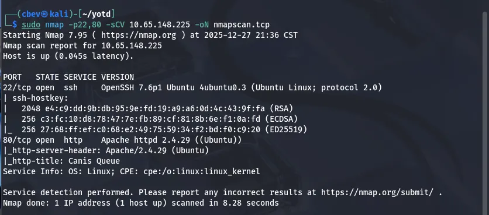

This shows only two ports open:
- SSH on port 22
- Apache web server on port 80

I also run a UDP scan with both Nmap and unicornscan but don’t find anything; If TCP doesn’t resolve to anything we’ll revisit UDP. My thoughts are that this is web heavy and we’ll find credentials or grab a shell via the HTTP server.

Enough talk, let’s check out the website.

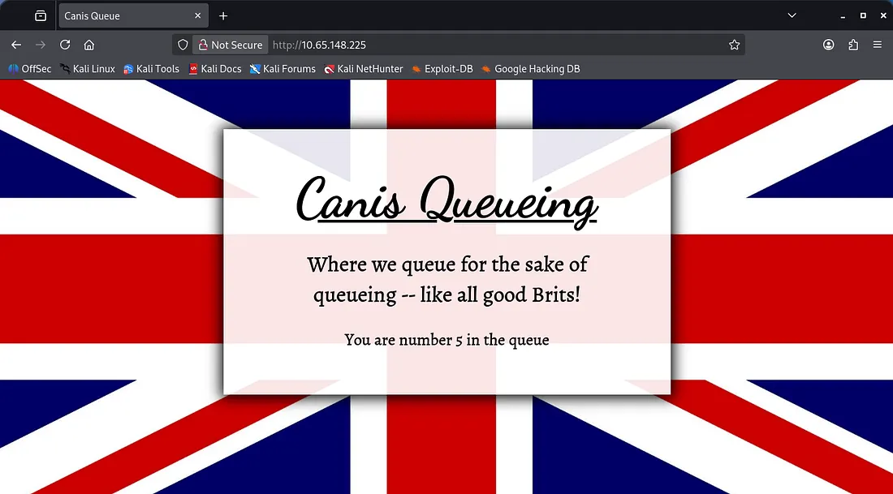

We get thrown into a queue in order to access the website. The British use slightly different spelling than in the USA (in case we get errors later on).

Anyways, let’s send this over to Burp Suite and see about hopping this queue line. I’ll also leave a Gobuster directory scan running in the background.

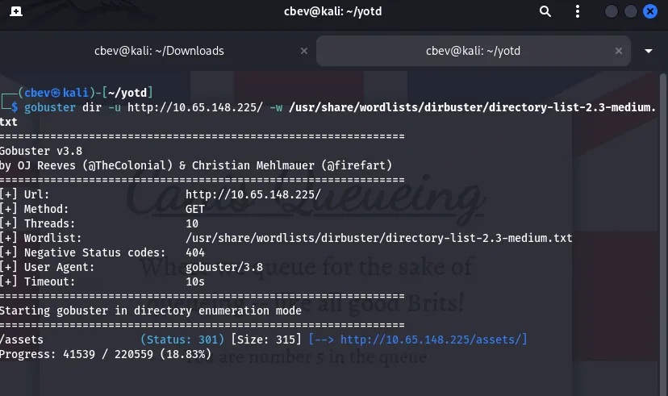

I didn’t have foxyproxy setup so I ended up using the built in Chrome browser within Burp Suite, however I noticed that our queue number jumped by 5. Looking at the request and response, the site sets a cookie with a string and we use that to keep track of our place in the queue.

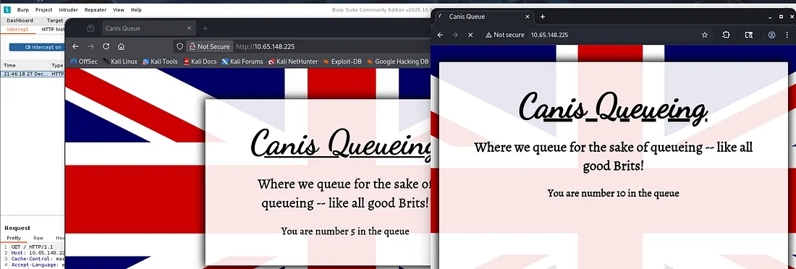

Using curl confirms this as we don’t have keep track of cookies by default.

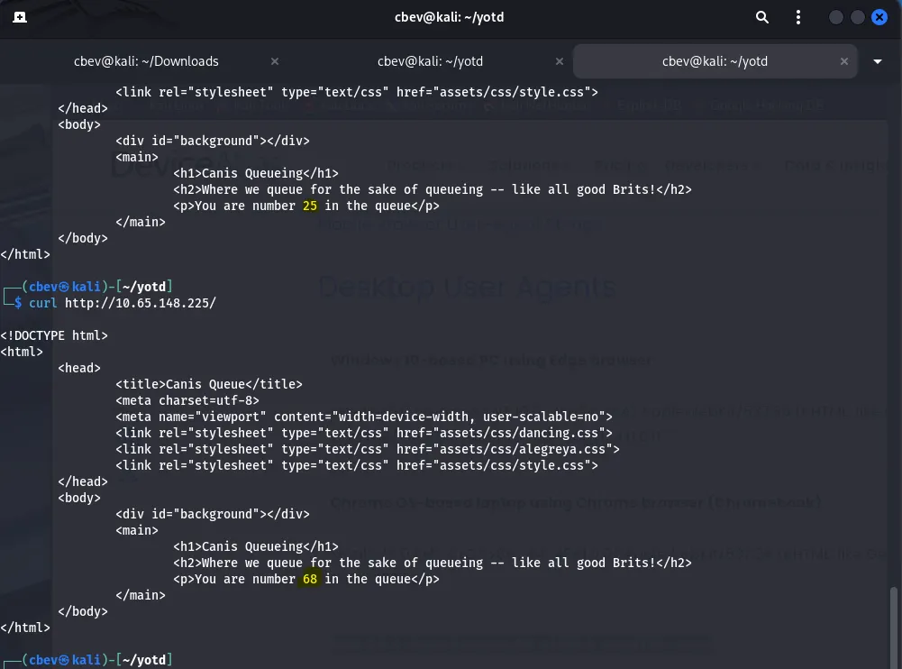

## Exploitation
Saving the cookie and reusing it with subsequent requests gives the same queue number so let’s try to bypass this feature. I tried testing for low numbers which just returned an error where the queue # should be. While using special characters I stumbled upon a mySQL error.

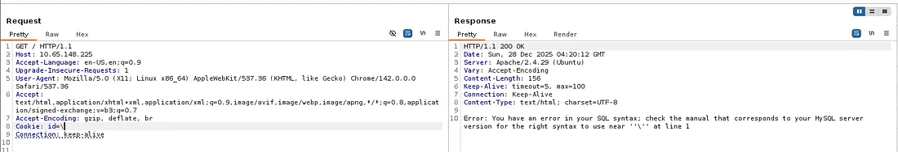

This site is prone to SQLi via cookie tampering. Let’s test out some common payloads and see if there’s any chance of enumerating a database. Using a few from [PayloadsOfAllTheThings](https://github.com/swisskyrepo/PayloadsAllTheThings/blob/master/SQL%20Injection/MySQL%20Injection.md) all showed that the server is detecting potential RCE attempts and blocking them.

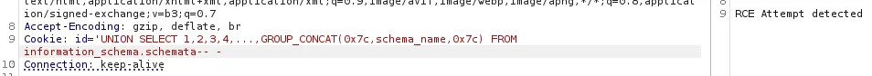

Although, a simple payload like this confirms that it’s possible to inject our own query.

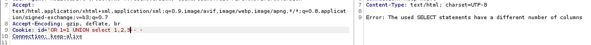

The correct amount of columns is two so now we’re able to enumerate the database.

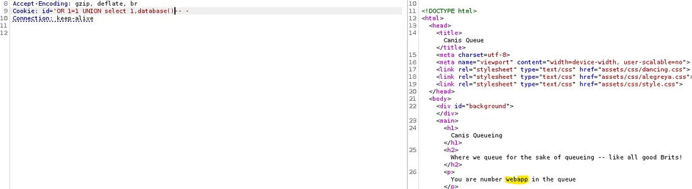

Looks like we are in the webapp database, next up is tables.

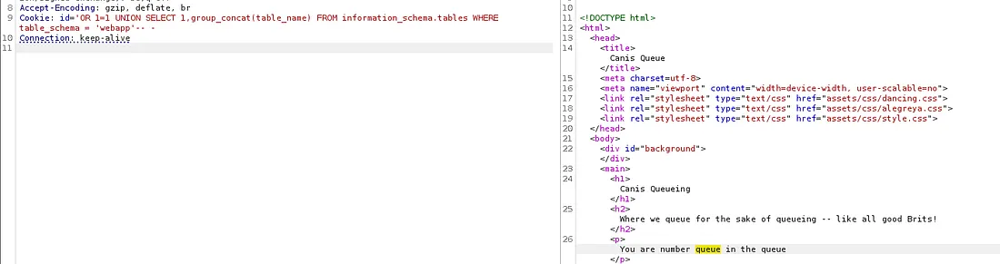

We are in the queue table, now let’s list all columns to see if we’re able to bypass this at all.

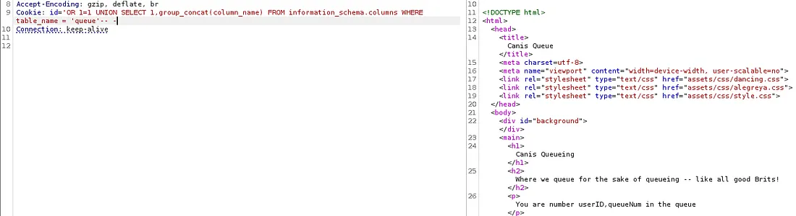

There is userID and queueNum. Finally, we need to list both of these fields. A lot of manual testing later shows that the site filters SEPARATOR and any other operators that the database doesn’t absolutely need to use.

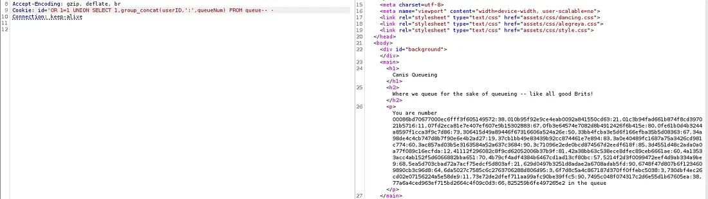

I use sed to make this more readable, and we get an ID with no queue value attached to it.

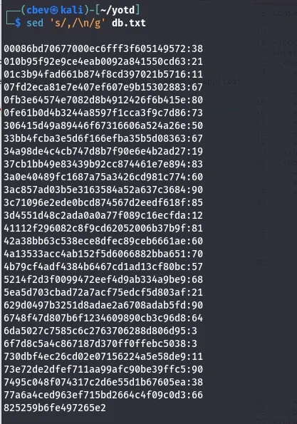

Displaying only the userID in another request shows that the response is cut off for some reason (the list keeps going but it’s too much info). I kept at this for a while to no avail, so I decided to turn to other methods. After some research I attempted to write to a file using the INTO OUTFILE method to upload a shell.

[This](https://stackoverflow.com/questions/58160504/how-do-i-write-files-using-sql-injection) is the article I used to find this exploit.


```
{valid id #}'INTO OUTFILE '/var/www/html/shell.php' LINES TERMINATED BY 0x3C3F706870206563686F20223C7072653E22202E207368656C6C5F6578656328245F4745545B22636D64225D29202E20223C2F7072653E223B3F3E-- -
```


_Note: Change the {valid id #} to one we captured so it will be able to execute the command. If we don’t prepend the string, the site will not execute the php script at the end._

The user _ebadfd_ goes into more detail on it but basically, we send a hex encoded payload which functions as a basic PHP webshell and write it to a file named shell.php under /var/www/html so we can access it.

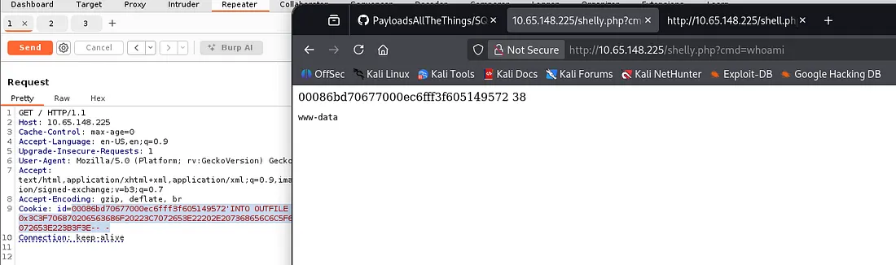

Now that we have RCE on the system, a proper shell would be nice as webshells are clunky. I use the PHP shell_exec function to execute this and the typical python method to upgrade/stabilize it. [Link](https://www.revshells.com/)

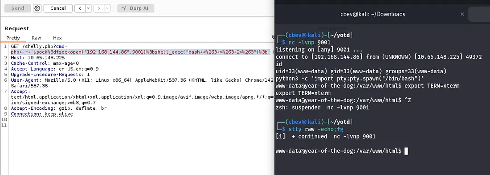

## Privilege Escalation
There’s a password for web, in a config file under /var/www/html as well.

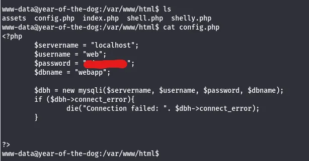

There is also a file named work_analysis under dylan’s home directory which looks to be logs for a failed attempt of brute forcing SSH as root user (may be a clone of auth.log).

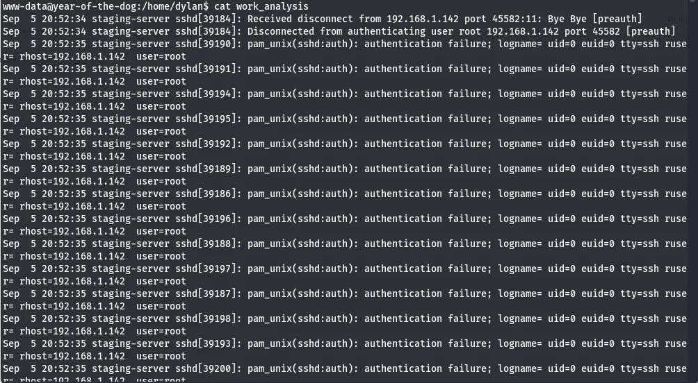

I grep this for the only other user on the box (Dylan) in hopes that he may have logged in while this was being captured.

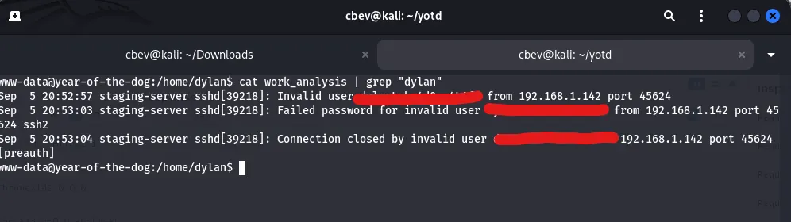

Dylan tried to login using his password as the username on accident and the auth.log clone caught this for us. Now we can SSH onto the box as Dylan and look for root privesc.

_Note: Dylan is prepended to the password so cut out his username._

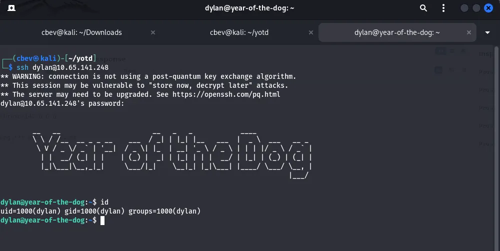

The typical routes of crontab, sudo privs, SUID/SGID bits led nowhere so I turned to services running internally. There’s something on port 3000 which is common for webapp servers. Now we just need to a way to get on it.

I’ll be uploading the [Socat binary](https://github.com/andrew-d/static-binaries/blob/master/binaries/linux/x86_64/socat) to port forward this so we have access externally.

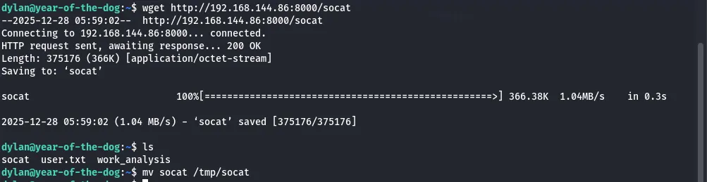

I use the following command to forward traffic from port 20000 to the service on port 3000.

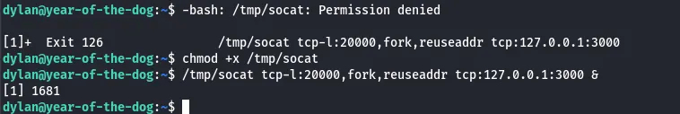

We can confirm this with a quick nmap scan.

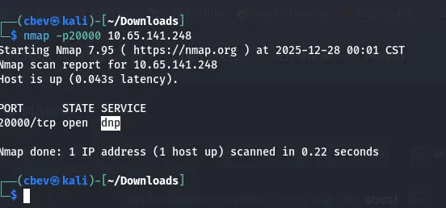

Seems like Gitea is running on the mystery port. This is a light-weight self hosted Git service used for managing code repositories on your local machine.

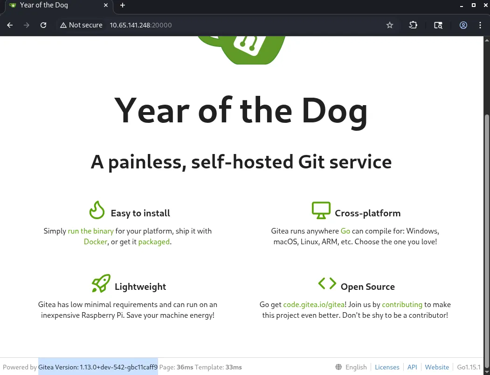

We can try signing in using Dylan’s credentials but we get prompted with a one time passcode.

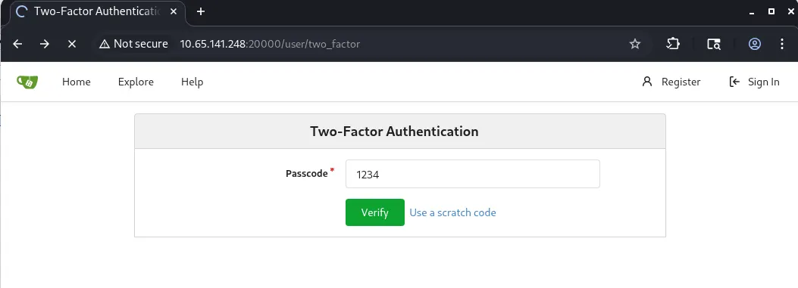

This wasn’t a totally useless venture as now we know that /Gitea is a probable place to look on the system and may hold some good info.

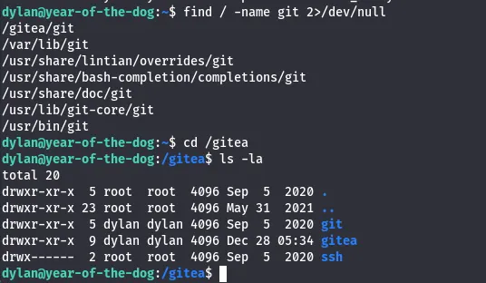

Listing /gitea it shows that dylan owns both git and gitea. There is a gitea.db file in the conf folder but we don’t have a tool installed locally to view it.

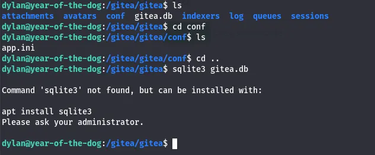

I end up transfering it to my attacking machine to have a better look. Using sqlite3 to dump the contents of user gives us some nice information on Dylan’s account.

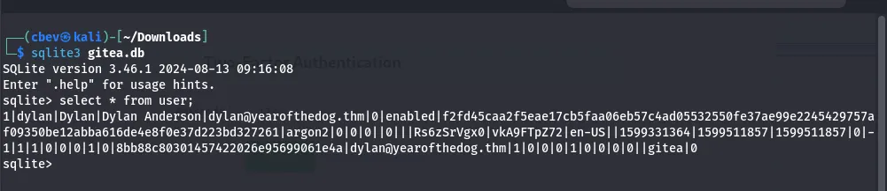

I poke around a bit more, checking the schema for the user table and find an `is_admin` integer. Displaying name and the `is_admin` int shows that Dylan has admin privileges on Gitea.

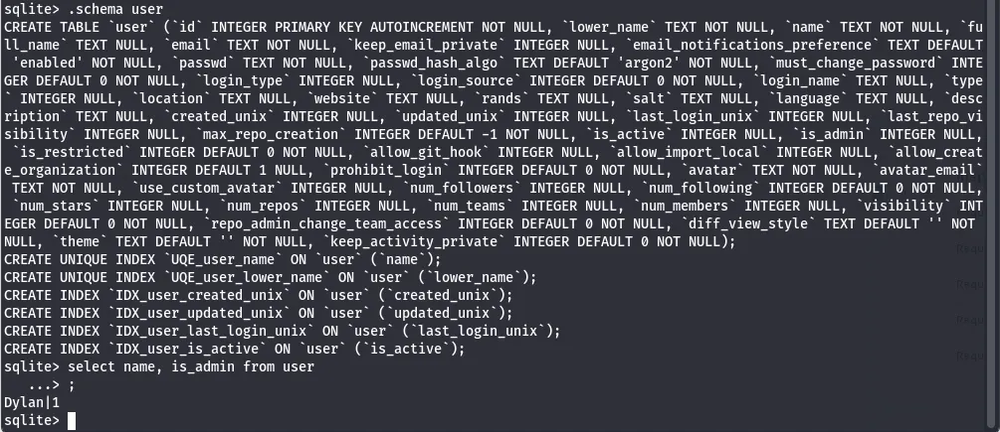

Now that we know this is used to check who has admin access on the site, we can use this to create a new account, update our `is_admin` integer to be 1 and have admin privileges without having to brute force dylan’s account.

First, I create a new account.

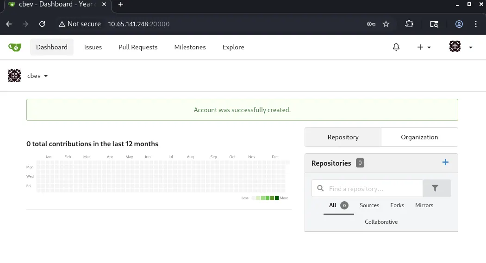

Then, I redownload the gitea.db file and update the `is_admin` integer using:

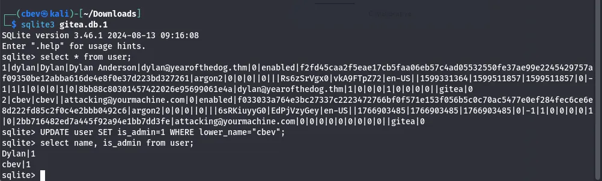

Now all that’s left is to upload the file and replace the original gitea.db with our altered one. I use the secure copy function via SSH as we already have access to it.

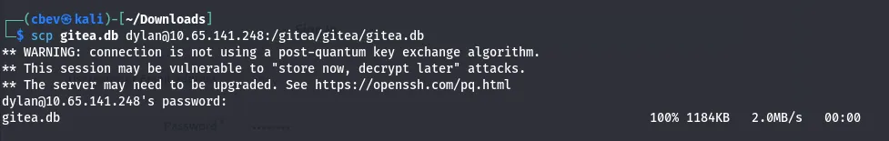

This overwrites the previous file which in turn grants us our administrator privileges. Now let’s log into Gitea with our account.

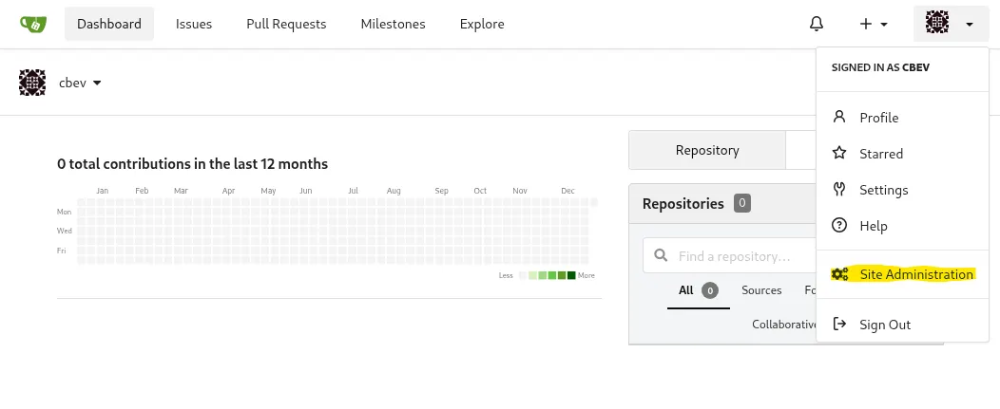

We have a new button on our panel. This leads us to site administration and also let’s us change Dylan’s password but we still can’t deactivate 2fa so this is pretty useless to us.

_Edit: You actually can change his password and delete the 2fa table in gitea.db which would get rid of the one time pass requirement altogether._

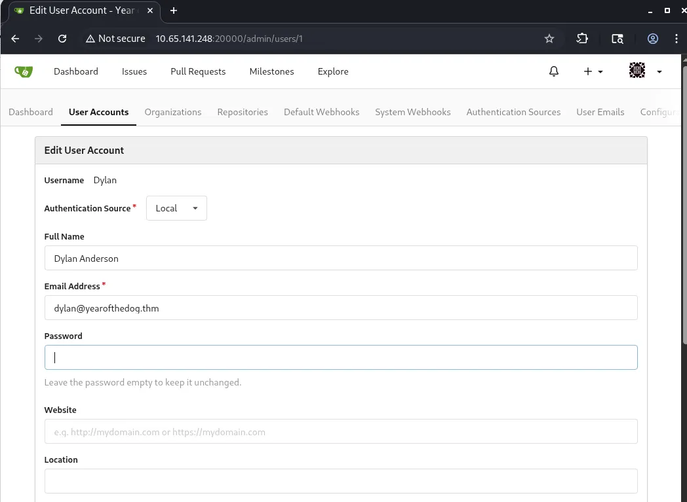

I made a test repository to see if I would be able to have the system execute my commit. Using these Git Hooks allows us to grab a reverse shell as root on the box as root is the one executing the commit.


I alter the pre-recieve hook on my test repository and add in a netcat reverse shell pointed towards my attacking machine. Now we can update the hook, clone and commit the repo as dylan and push it.

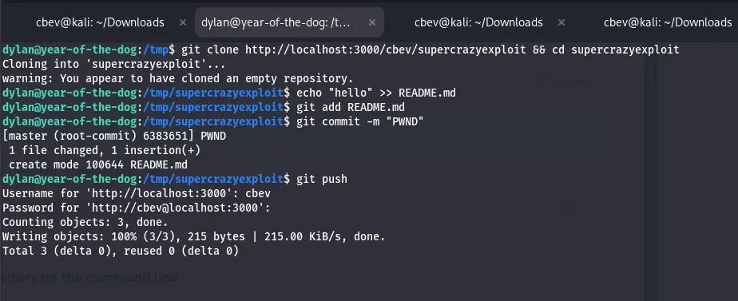

I added the “hello” string to just to make sure that the repository has something changed before pushing it out.

_Note: The repository is empty but our hook still executes so don’t worry about that warning._

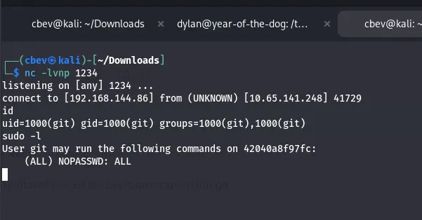

I spawn a bash shell with `sudo /bin/bash`. We’re still in the git container so we’ll need a bit more enumeration. Seems like /data on the container is a direct copy of /gitea on the host machine.

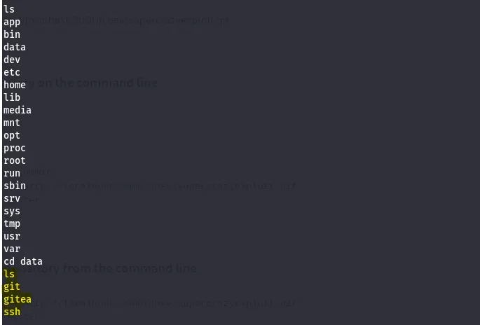

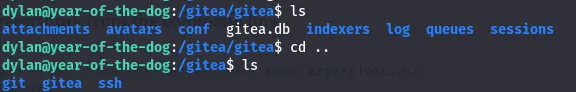

If we can upload a binary like bash, change the SUID bit on it, then anyone could execute it as root.

First, I setup a python http server in /bin on the host machine. Then, use wget to download the bash binary to the container and output it to /data/bash (use real IPs here). Finally, we chmod the bash binary to have an SUID bit set.

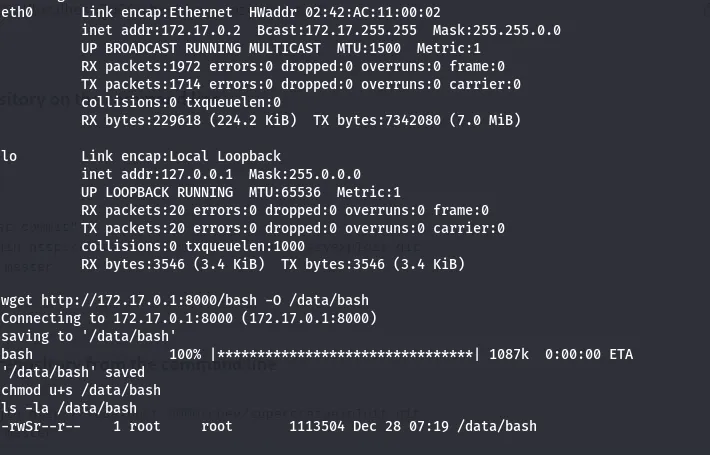

After all that work, we can cd into /gitea on the host machine which holds our powerful bash binary and execute it to grab a root shell on the box and read the root flag.

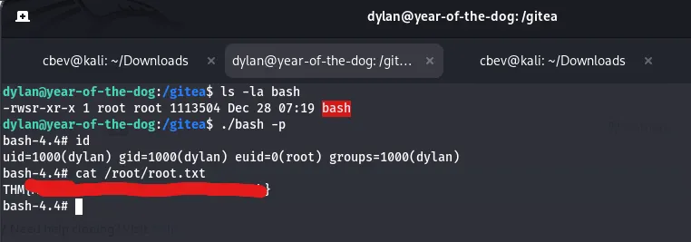

There we have it! This was a very fun challenge for me as SQLi and the Git privesc method was all new to me.

Thanks to MuirlandOracle for another crazy THM box and I hope this was helpful to anyone who got stuck for a bit like me. Happy hacking!
