This box is ranked hard difficulty on THM, it involves us brute forcing the login page with a custom wordlist, enumerating a sqlite database for user credentials, and abusing the sudoedit binary to change /etc/sudoers.

_Some pigs do fly…_

## Scanning & Enumeration
As always I start with an Nmap scan with the given IP to find running services on the live host.

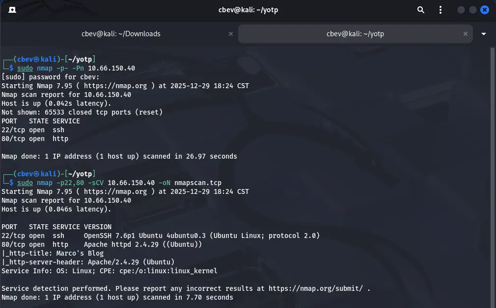

There’s only two ports open:
- SSH on port 22
- An Apache web server on port 80

I’m thinking we’ll have to find a way to get LFI, reverse shell, credentials, etc from the web server and then SSH for privesc. That being said let’s take a look at the site and also run a gobuster directory search in the background to save time.


We have a static html page dedicated towards Marco’s love for planes. There’s a bit of info here we could cram into a wordlist if needed, seeing as he mentions tons of plane names and some friends too.

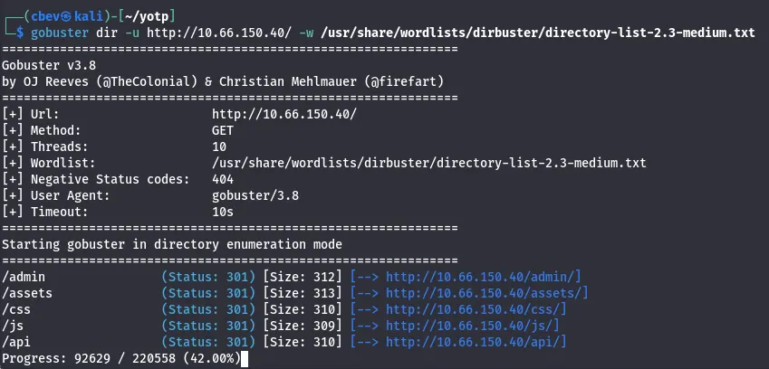

Gobuster found some interesting endpoints for us to work with. There’s an API page that accepts POST requests, but more importantly the verbose option is enabled. This means there may be a chance to validate to it and grab more info.

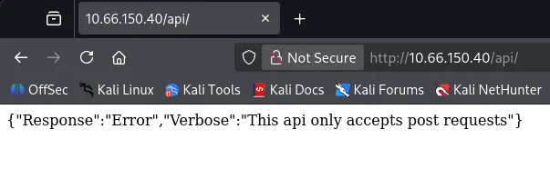

We also find a login panel for admins; I tried some basic SQLi but nothing came of it. When attempting to login we are given a very interesting error, which leaks the password structure for the site. It is also running on PHP judging from the url.

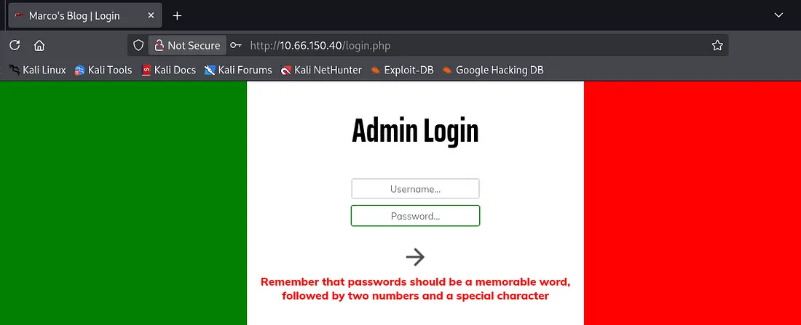

I send POST requests using gobuster to enumerate /api/ endpoints and find some very nice functions to mess around with. However, we cannot add a user or reset passwords without being authenticated first.

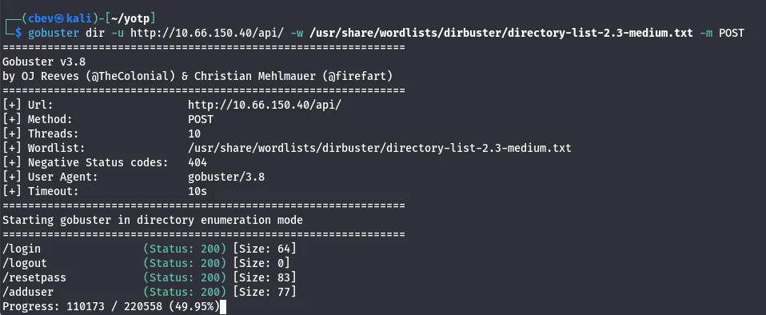


Capturing a request to the admin login panel shows that it’s attempting a POST request to /api/login, however our password get’s hashed to MD5 before being sent.

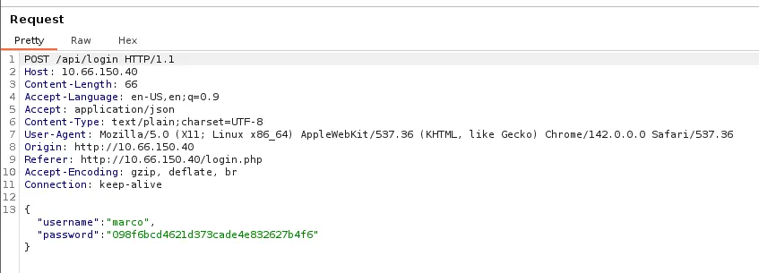

We do know that the site is running on PHP so let’s keep the enumeration going with another directory bust using .php extensions (not much else for us here but it’s good practice).

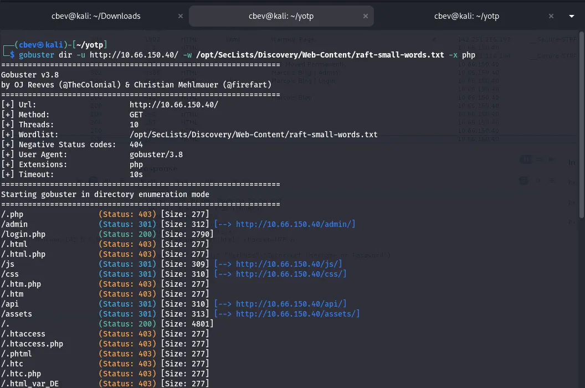

## Exploitation
My next thought is to brute force the admin login page with Marco as our username and a hashed wordlist for the password. Rockyou.txt won’t work here as it needs an md5 hash to get a succesful login so I’ll be making my own.

I actually guess the password relatively quick as it literally gives us the structure but I’ll give a guide for a typical OSINT-based brute force on a login panel using wfuzz:

First I use [ceWL](https://www.kali.org/tools/cewl/) to scrape words from the webpage, then I use a python script to copy each word from the list and make it upper and lowercase to cover all grounds.

Uppercase python script:

```
#!/usr/bin/env python3

import sys

def expand_wordlist(input_file, output_file):
    with open(input_file, "r", encoding="utf-8") as f:
        words = [line.rstrip("\n") for line in f]

    expanded = words.copy()

    for word in words:
        if word:
            expanded.append(word[0].upper() + word[1:])

    with open(output_file, "w", encoding="utf-8") as f:
        for word in expanded:
            f.write(word + "\n")

if __name__ == "__main__":
    if len(sys.argv) != 3:
        print(f"Usage: {sys.argv[0]} <input_wordlist> <output_wordlist>")
        sys.exit(1)

    expand_wordlist(sys.argv[1], sys.argv[2])
```
_Note: Change `expanded.append(word[0].upper() + word[1:])` to `.lower` for a lowercase version._

Next, I used another python script to append two numbers and a special character to the end of all words to match the password requirement.

```
#!/usr/bin/env python3

import sys
import string

SPECIAL_CHARS = "!@#$%^&*?"

def mutate_wordlist(input_file, output_file):
    with open(input_file, "r", encoding="utf-8") as f:
        words = [line.strip() for line in f if line.strip()]

    with open(output_file, "w", encoding="utf-8") as f:
        for word in words:
            for i in range(100):  # 00–99
                num = f"{i:02d}"
                for char in SPECIAL_CHARS:
                    f.write(f"{word}{num}{char}\n")

if __name__ == "__main__":
    if len(sys.argv) != 3:
        print(f"Usage: {sys.argv[0]} <input_wordlist> <output_wordlist>")
        sys.exit(1)

    mutate_wordlist(sys.argv[1], sys.argv[2])
```

I ended up with a list of over 600,000 potential passes in it. Might have been overkill but I like to cover all bases and make absolutely sure I did everything I could if this route doesn’t pan out. `sort -u wordlist.txt -o output.txt` will get rid of all duplicate lines, in turn shortening it to shave off time.

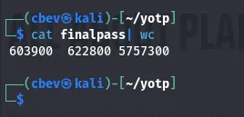

Final step is to convert them into md5sum hashes as the site needs it for the login. Another python script takes care of this for us and now we’re ready to start brute forcing the login page.

```
#!/usr/bin/python3
from hashlib import md5
from sys import argv, exit
from os import path

if len(argv) < 2:
    print("No wordlist specified")
    exit()

try:
    with open(argv[1], "r") as data:
        words = [i.strip("\n") for i in data.readlines()]
except:
    print("Invalid wordlist")
    exit()

if len(argv) > 2:
    filename=argv[2]
else:
    filename="output.wordlist"

with open(filename, "w") as output:
    for i in words:
        output.write(f"{md5(i.encode()).hexdigest()}\n")
```

I tried using Hydra at first because I’m most familiar with it, however it kept giving a bunch of false positives. I think it’s because the API is blocking my user agent Mozilla 5.0 (Hydra).

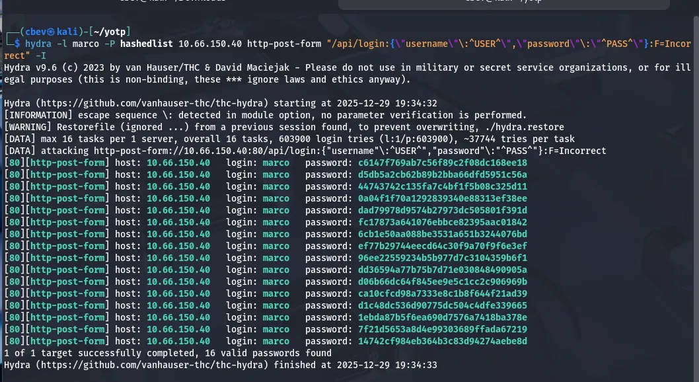

Altering user agents in hydra is a big pain and I know wfuzz has an option for that as well as the benefit of being extremely fast so I switch tools and try again.

```
wfuzz -w final -H "User-Agent: PWND" -X POST -d '{"username":"marco","password":"FUZZ"}' -u http://10.66.150.40/api/login --hh 63
```

This command uses our custom password list as input for the password on the admin login panel. We specify that it’s a POST request and add a custom user agent with `-H` . I had to add `--hh 63` to hide responses that are 63 characters long to filter bad requests too.

_Note: I end up shortening it even more to save on time and have it only contain passwords with Savoia, as he mentions that’s his favorite plane in the blog. I use `sed -n ‘/savoia/p’ password_list > savoia_list` to make that new wordlist._

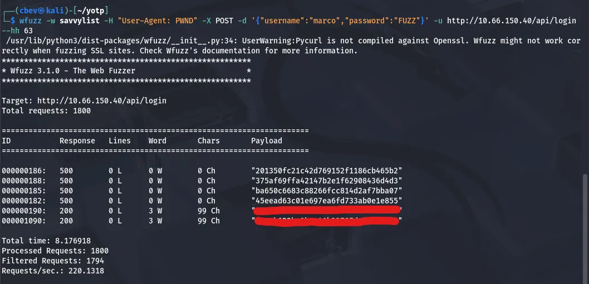

Now we have a valid hash for the site, let’s unhash it with [crackstation.net](https://crackstation.net/) or [hashes.com](https://hashes.com/en/decrypt/hash) and log into Marcos account.

Logging in, there’s tabs for each API endpoint we found earlier as well as a command panel. It returns invalid command for things like ls and cat meaning we’ll need to bypass the filter in order to get a shell.

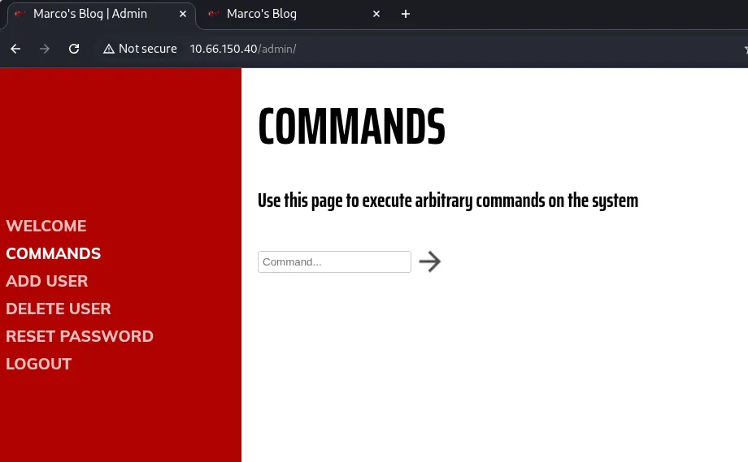

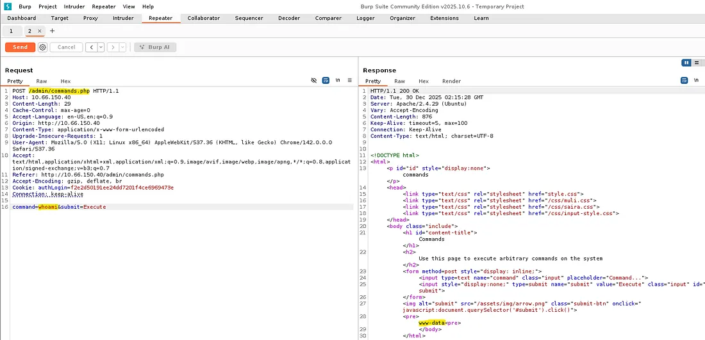

Capturing it in Burp Suite discloses another php page, so let’s fuzz for places under /admin/ with .php extensions for any more things to use.

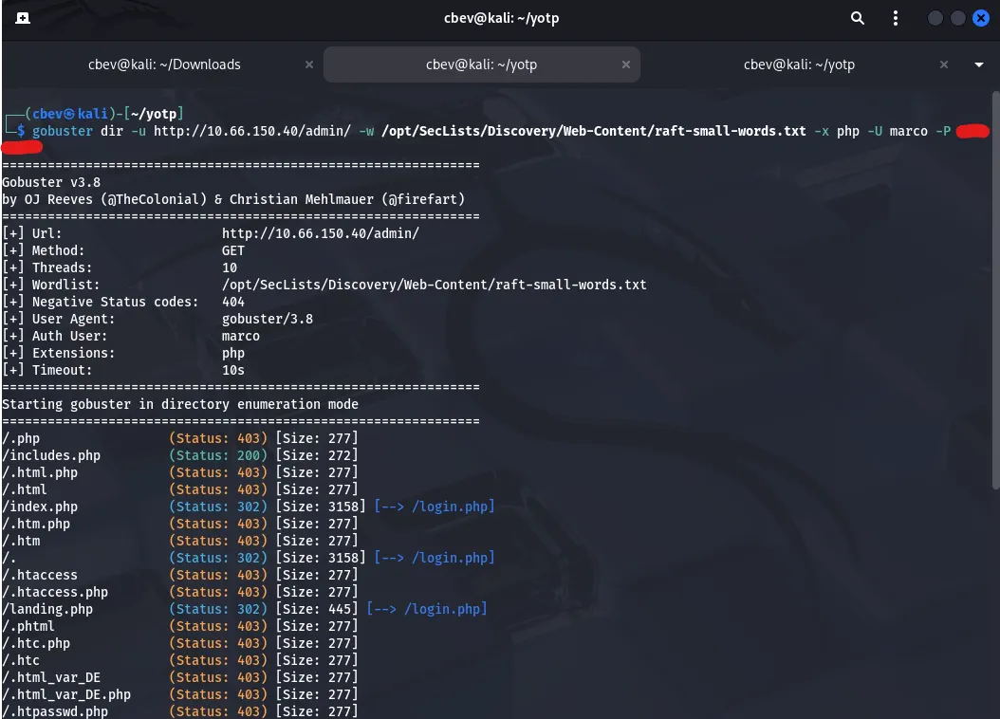

## Initial Foothold
Before spending more time on the webpage, I decide to credstuff SSH with marco’s user and pass. This actually works, which probably means that anything else on the site was a big waste of time.

It’s always good to take a step back every once in a while

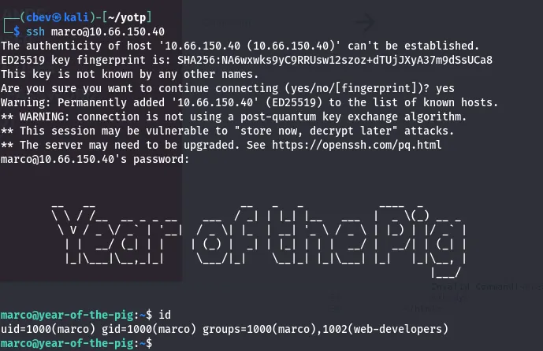

Here we can grab the first flag in Marco’s home directory. There’s another user on the system named curtis but we don’t have permissions to read flag2 under their home dir.

## Privilege Escalation
While checking the usual privesc routes, I find an admin.db file owned by www-data. We don’t have access to it as of now so uploading a shell in /var/www/html/ will let us.

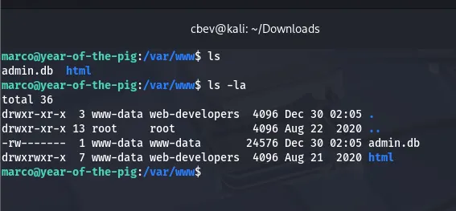

Upload a php reverse shell and navigate to it in a browser. Be sure to setup a netcat listener so we can catch it.

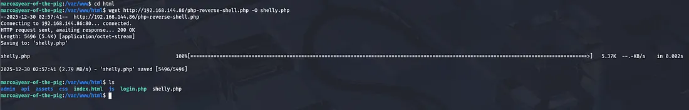

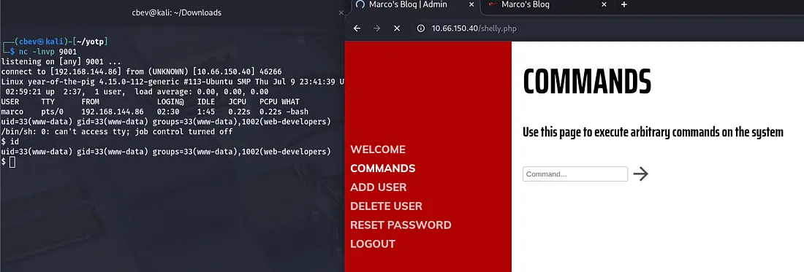

Now we can change the permissions on admin.db and take a better look at it in our SSH session.

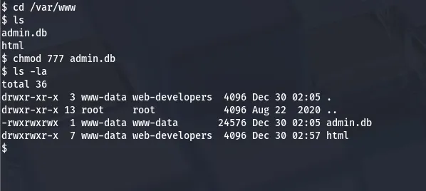

This system has sqlite3 installed so I use that to enumerate the database. I end up finding a hash for curtis in here. Unhashing it gives us the plaintext password and we can switch users to move on to root access.

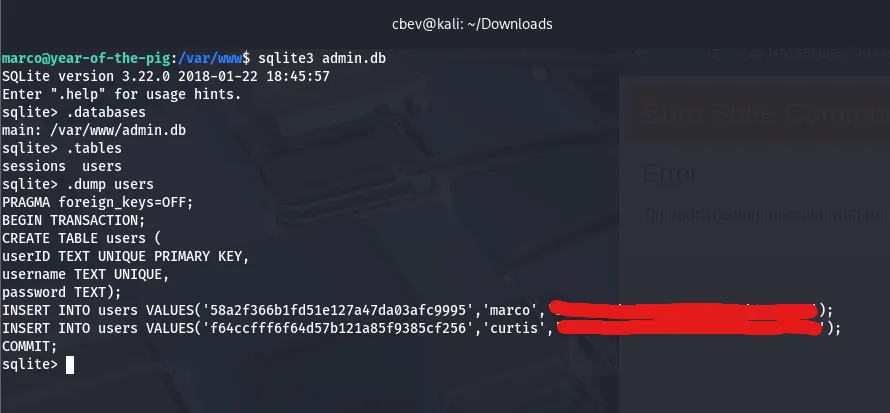

Here we can grab the second flag in curtis’ home directory. Listing sudo commands shows that we’re able to use sudoedit on the file `/var/www/html/*/*/config.php`.

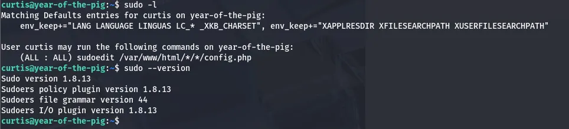

A bit of research later discloses that our version is vulnerable via the sudoedit command mishandling extra arguments passed in the user-provided env variables. [Here](https://github.com/n3m1sys/CVE-2023-22809-sudoedit-privesc) is a link to a PoC for the exploit.

Uploading that script to the machine allows us change the contents of /etc/sudoers. Finally, we can add ourselves (curtis) to a new line with all sudo privs and execute sudo /bin/bashto get a root shell.

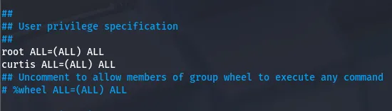

The exploit I used automatically pops a shell but changing this file ensures we maintain access to sudo perms even after getting logged out. Next, we can finally grab our root flag to finish out the box.

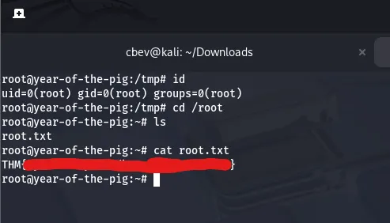

This was another very fun challenge in the Year of the ____ series so big thanks to MuirlandOracle for making them. I hope this was helpful to anyone stuck or following along and happy hacking!
