This is a medium-ranked difficulty box, it involves us dodging plenty of rabbit holes, exploiting command injection on an obscure endpoint, and escalating privileges to gain root access to the system.

_Intermediate level CTF_

## Scanning & Enumeration
Per usual, let’s kick it off with an Nmap scan to find all running services on the provided IP:

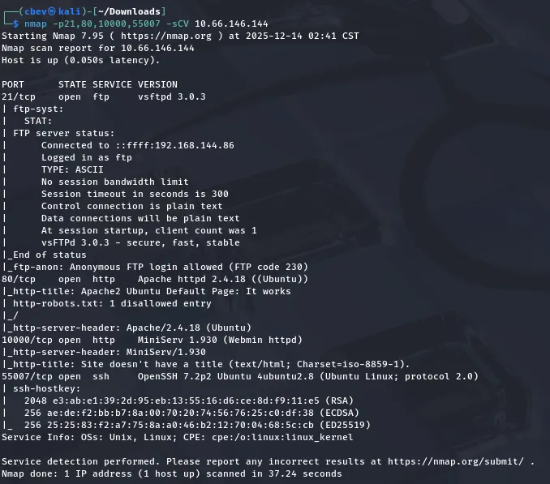

I find the following running:
- FTP on port 21
- Apache web server on port 80
- MiniServ (lightweight perl-based) web server on port 10000
- SSH on port 55007

Anonymous login is allowed for FTP so let’s have a look around there first.

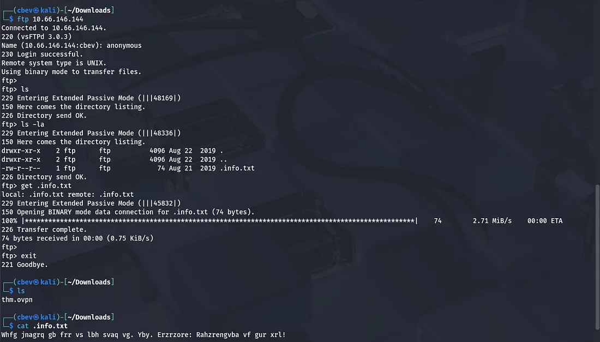

There is only one hidden file on the ftp server which contains cyphertext we’ll have to decrypt. Sending that over to CyberChef shows us that it’s a dead end!

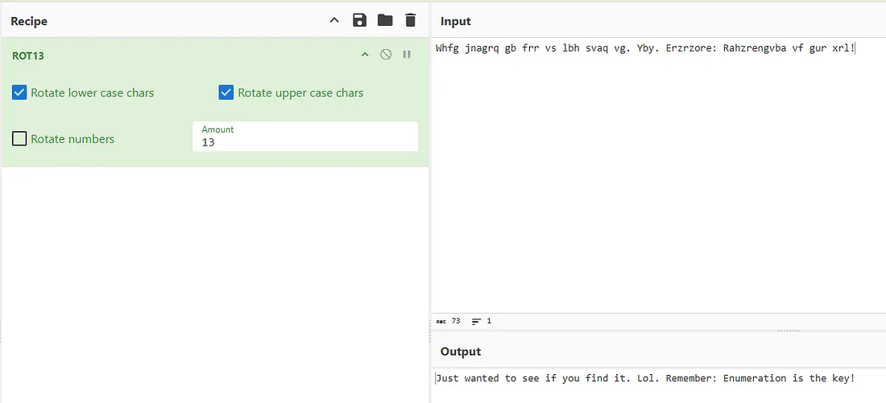

Considering FTP and SSH are generally useless without credentials we’ll have to enumerate the web servers now. While port 80 has a boilerplate Apache landing page, our MiniServ application on port 10000 is using SSL and prompts a login to access it.

Fuzzing subdirectories yields a few results on port 80. Firstly there is a /manual page exposed which tells us the Apache version. Next is a /joomla login page as well as an admin one.

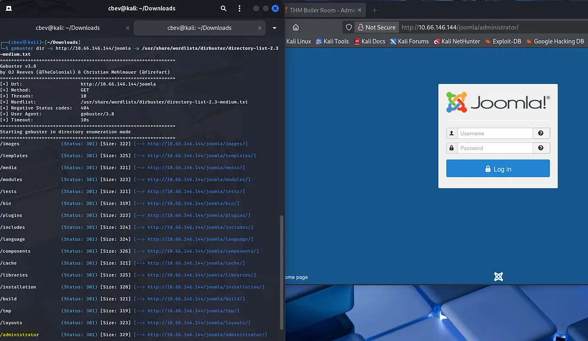

After letting the directory search run for a few minutes, I find an endpoint named _files which contains a strange string.

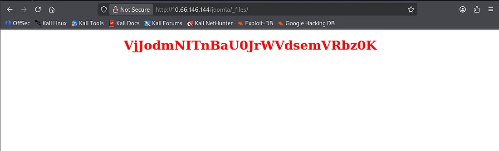

It looked like a hash so I used hashes.com to unhash it and found an encoded string inside of it. Having a bad feeling about another base64 encoded string, I send it to CyberChef only to find another red herring.

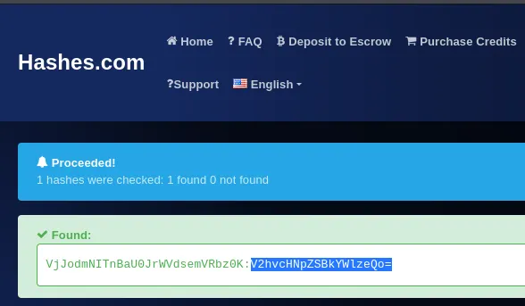

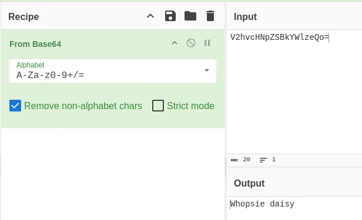

Back to square one, I spend more time enumerating the web servers in hopes that the Joomla CMS will have something exploitable.

## Exploitation
Switching to dirsearch helped me find a _test page and a lot of messing around showed that we can list files via the URL.

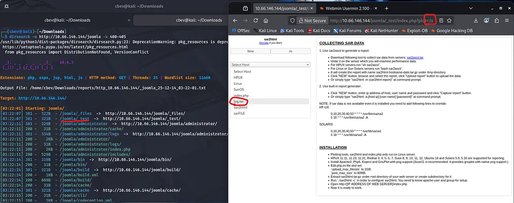

Using the same method to cat log.txt gives us a password accepted for basterd which we can use to SSH in on port 55007

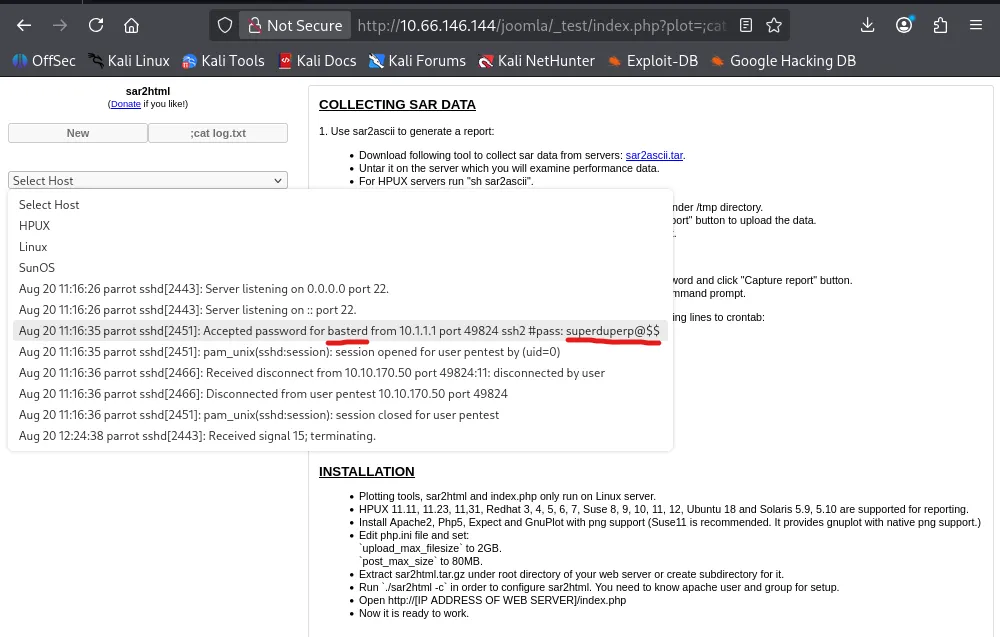

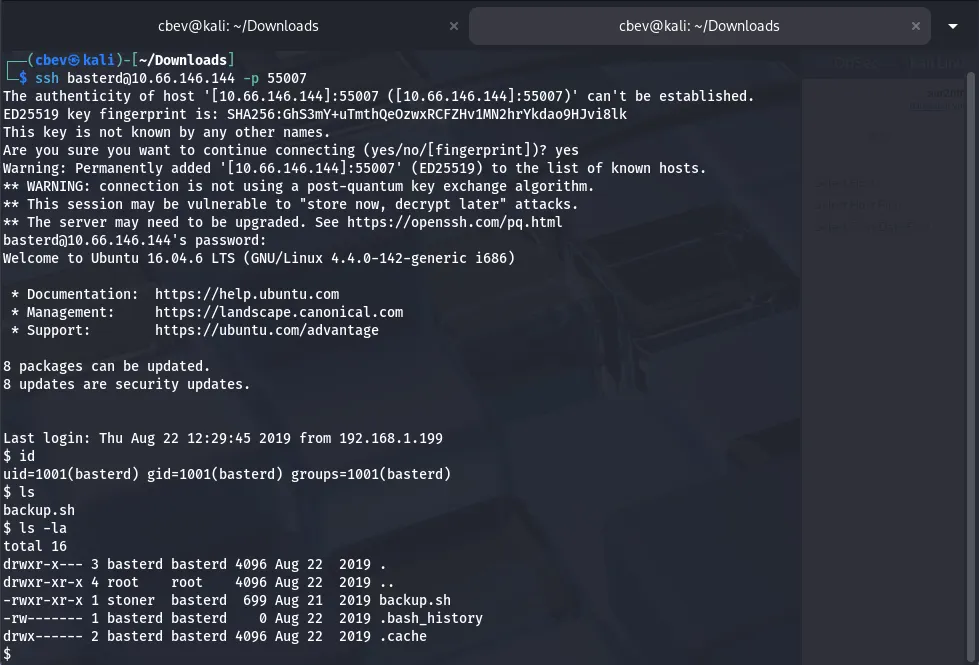

## Privilege Escalation
Having a look at the backup.sh script discloses a password for a user named stoner in a commented line. I use this to switch to that account and now we can go about usual ways of privilege escalation.

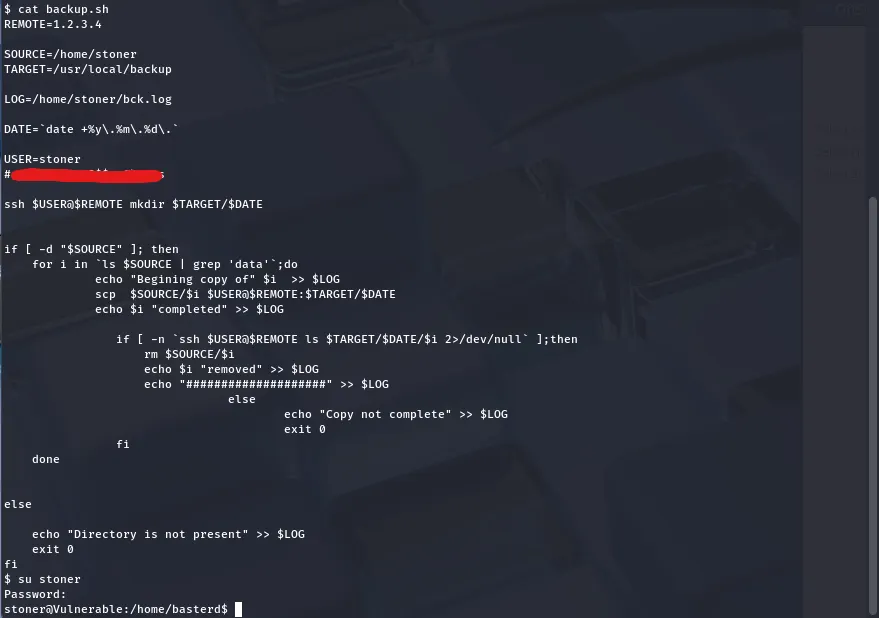

Here we can also find our user.txt flag in .secret under stoner’s home directory.

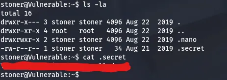

A quick check shows that the find binary has a SUID bit set, meaning we can use it to get unrestricted access to a root shell on the system.

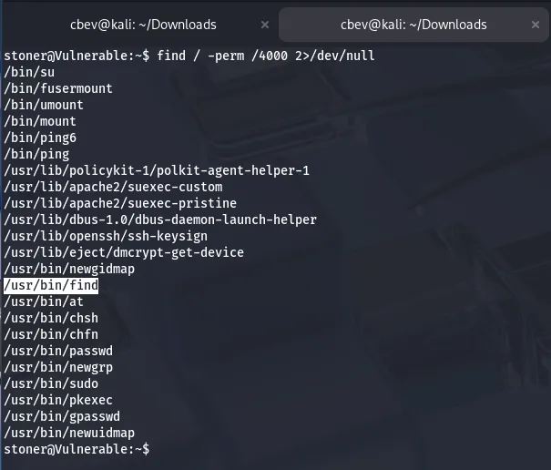

GTFOBins has a great method for escalating privileges to root via this binary. After that, we just need to find the root flag and challenge done.

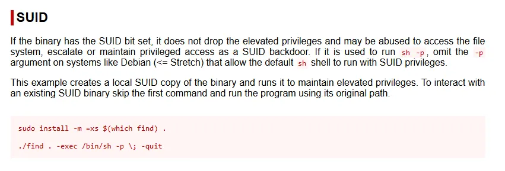

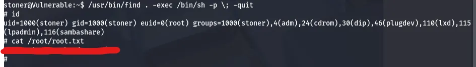

There we have it, this box was a good challenge as the enumeration is usually an overlooked part on CTFs. Despite all the dead ends I still had fun so props to MrSeth6797 for making it and happy hacking!
