This box is ranked easy-difficulty and involves enumeration, bypassing a login form, uploading a reverse shell, and escalating privileges to grab both flags.

_Try to exploit our image gallery system_

## Scanning & Enumeration
Kicking off with an Nmap scan on the given IP:

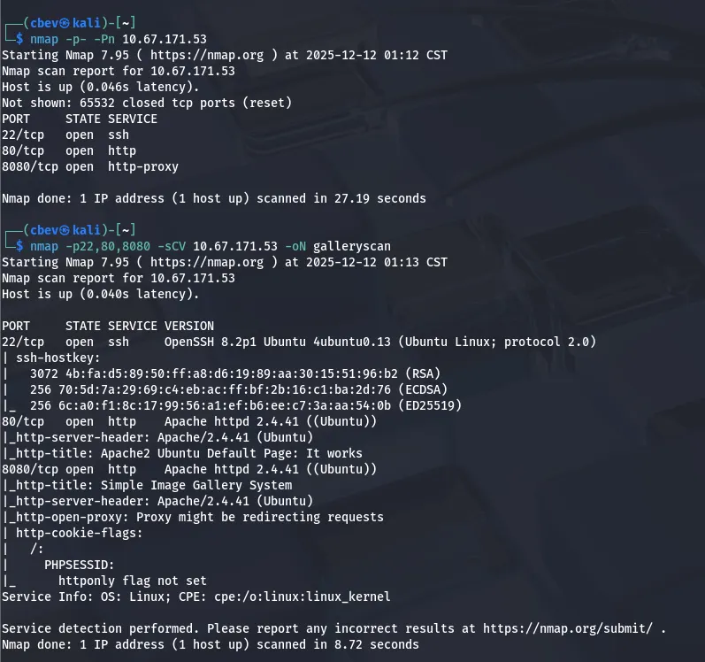

We find SSH on port 22 and two Apache web servers on ports 80 & 8080. Lets check out both webpages and see about finding places to exploit.

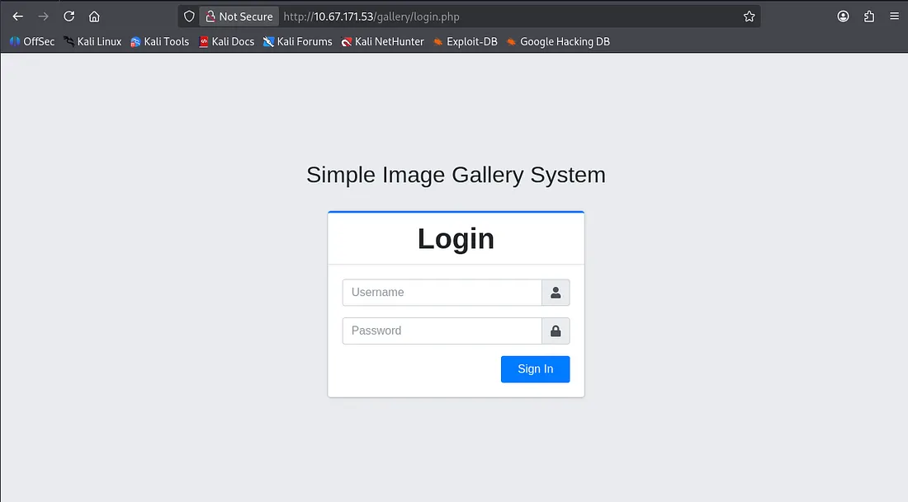

The server on port 8080 is a proxy that redirects us to a gallery login page back on port 80. I’ll run a gobuster dir search to find any interesting endpoints or subdirectories on the system and then have a peak at some characteristics on the login page.

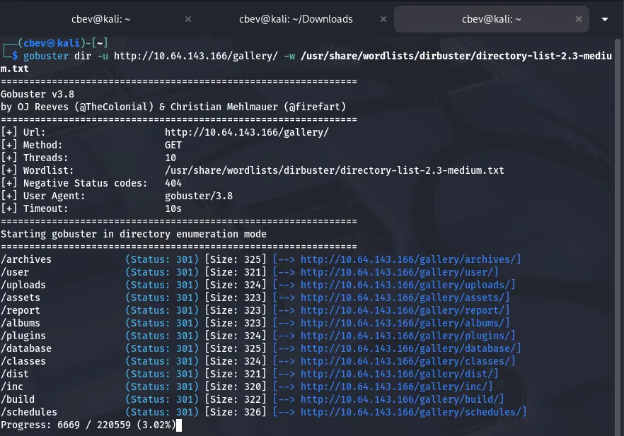

Plenty of hits, but none to help with our login attempt or bypass. There is an uploads folder which we can use to find a reverse shell we may use later on. Other than that it’s nothing too crazy, so let’s dive a little deeper.

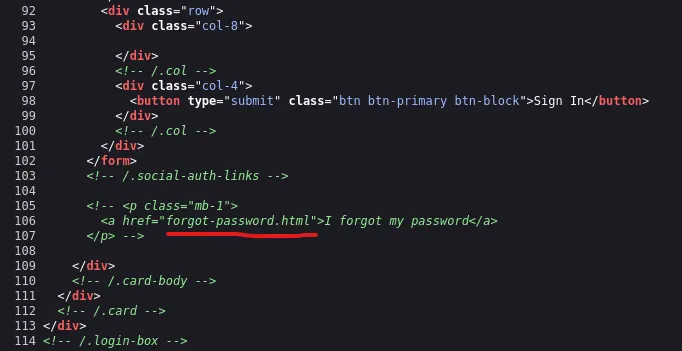

## Exploitation
I couldn’t reach it from any angle so I tried some basic SQL injection expecting a verbose error if lucky, but we actually log in!

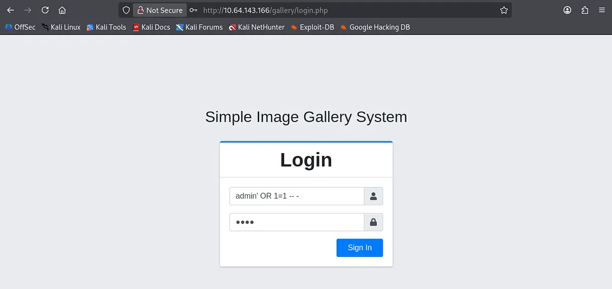

Once logged in, there isn’t much to the site other than it displaying information about the total albums and images. I know that we can reach an uploads folder from our earlier gobuster scan so let’s find somewhere to upload a reverse shell.

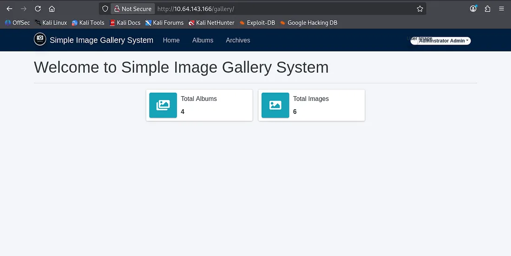

Under the my account tab we have the ability to upload a file to change our profile picture/avatar. Fortunately, it allows any file type so I prepare a PHP reverse shell from [pentestmonkey](https://github.com/pentestmonkey/php-reverse-shell/blob/master/php-reverse-shell.php) and send it off.

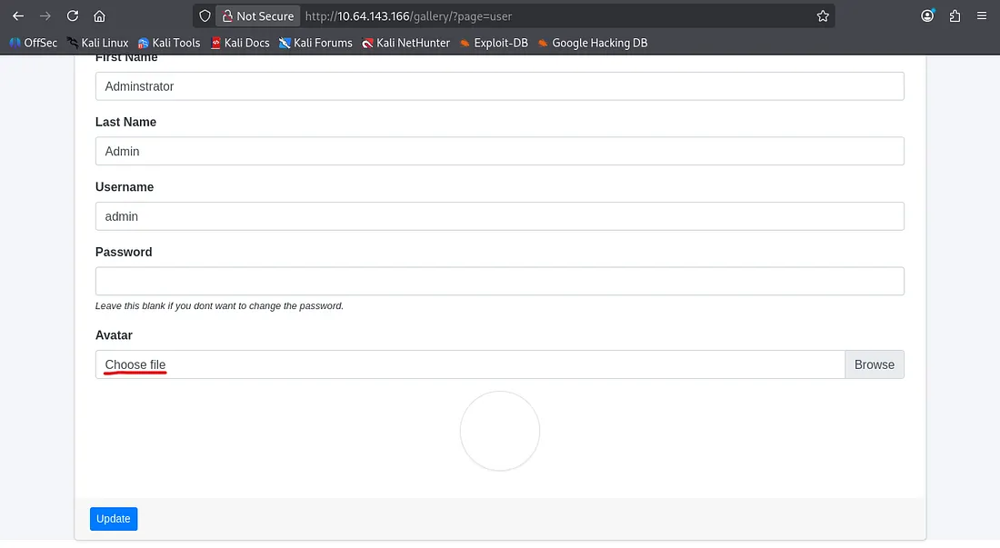

Looks like it does indeed get sent to the uploads folder, now we can set up a netcat listener to catch the reverse shell and poke around the system internally.

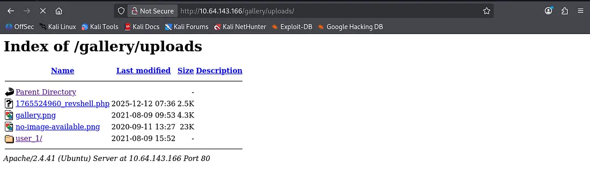

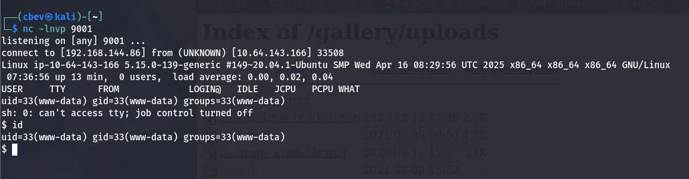

## Privilege Escalation
First let’s find some credentials to SSH so we don’t have a cruddy shell anymore.

I didn’t have good luck checking the usual spots in /var/www so I went on over to /var/backups only to find a backups for a user named mike’s home directory. Displaying his bash history gives us a password we can use to SSH in via his account or su.

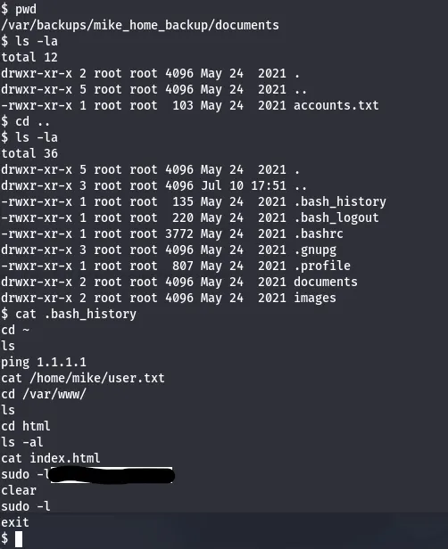

Verifying more paths for privilege escalation shows that we can run sudo as root on rootkit.sh . Let’s see if we can alter it or leverage that to catch a root shell.

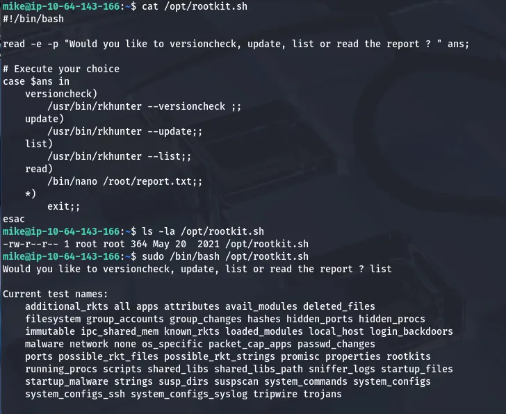

We can’t write to the file so altering it’s out of the question, however it seems to use nano to open files as root. [GTFOBins](https://gtfobins.github.io/gtfobins/nano/#sudo) guides me as I use the following:

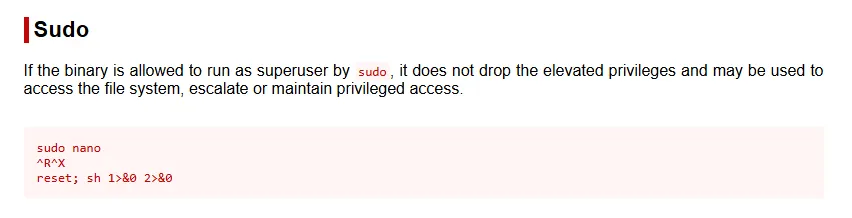

Since the read option when we use the rootkit.sh script opens nano as root user, we can use:
- CTRL+R to first ‘insert’ a file (this really just allows us to execute the next step without exiting the tool)
- CTRL+X to execute a command
- Type the command `reset; sh 1>&0 2>&0`

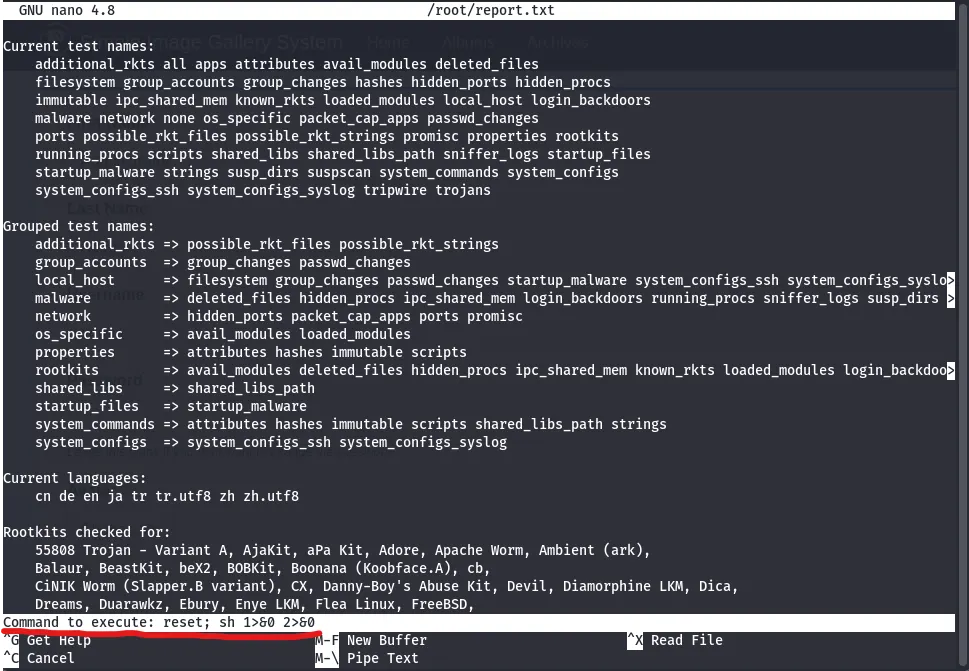

After executing that command, the terminal goes haywire so press enter a few times and a CLI will slowly appear. At that point we can capture the root flag and complete the box.

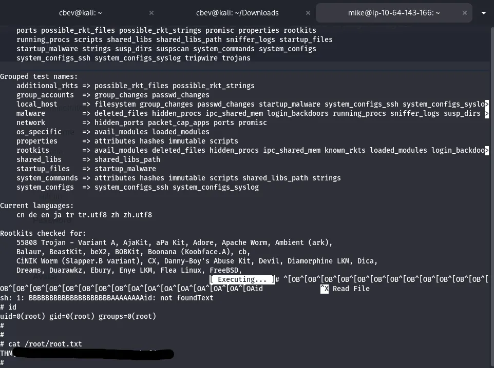

I should note that I didn’t find the hash for admin in the intended way, which is required for getting full points on the box. To do so we can use mysql to `select * from users` in the `gallery_db` database and find it there.

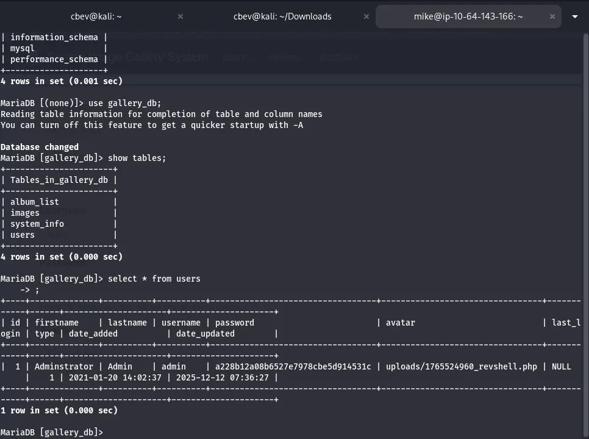

Overall, this was a fairly easy box as the authentication was a joke but it makes sense as this is geared towards beginners. I still had fun and I hope this was helpful to all following along, happy hacking!
