This box is ranked as medium-difficulty and requires us to use our exploitation skills to bypass authentication mechanisms on a website and get Remote Code Execution. It’s also a kind of capstone to the Authentication module, so completing all prior rooms helped greatly with this challenge.

_Use your exploitation skills to bypass authentication mechanisms on a website and get RCE._

## Scanning & Enumeration
First things first, I use an Nmap scan to find services running on the host:

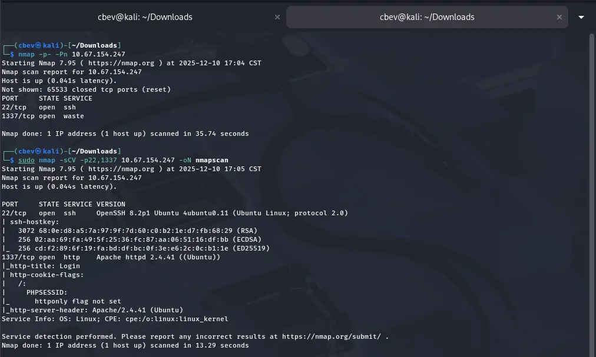

There are only two services up:
- SSH on port 22
- An Apache web server on port 1337

Landing on the webpage shows a typical login panel as well as a cookie stored in our browser named PHPSESSID. We’ll most likely have to grab an admin session token to escalate privileges later on.


The source code for the login page discloses a naming convention for subdirectories. We can use this to fuzz for endpoints and find out more about this site.

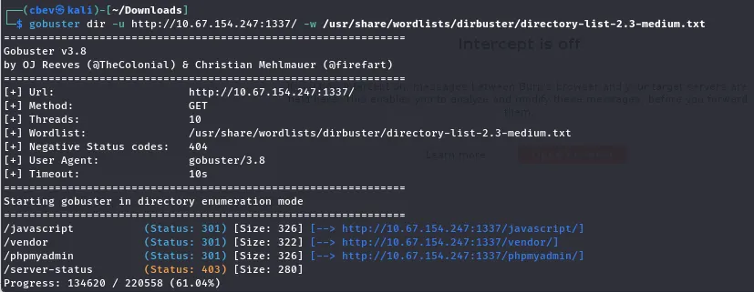

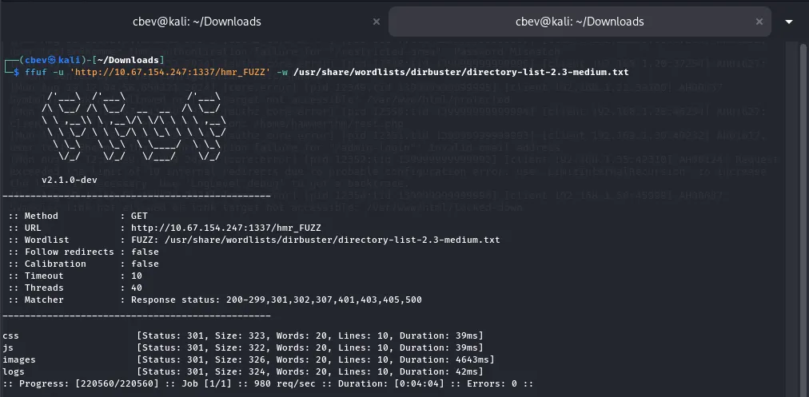

Running a search with and without the hmr_ string gives us a few endpoints, namely a phpmyadmin login page and an error.logs file under hmr_logs.

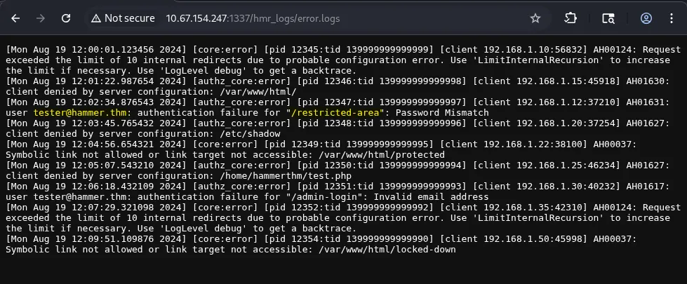

_Note: There is another endpoint here at /admin-login, however the email used provided an error saying “Invalid email address” instead of the “password mismatch at /restricted_area._

I could not located the ‘/restricted-area’, so perhaps it was hidden under another directory or just not available to us at the moment. However, I was correct in assuming the email found would work for the landing page panel.

Since we didn’t have a password to match our new email, I tested the “forgot your password” page with it, we can see that it requires us to enter a OTP to reset the password.

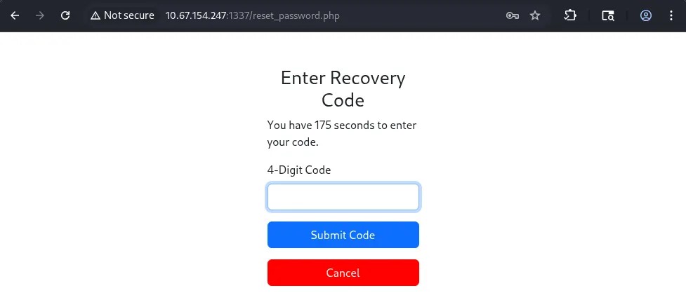

I captured a request using 1234 as the OTP, and there are a few things happening here.

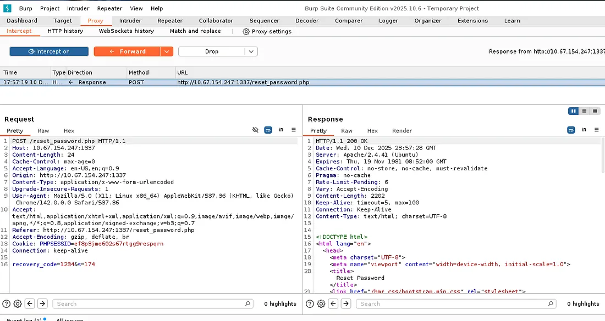

First, we have a PHPSESSID cookie to validate our session with the server. Secondly, our recovery_code is provided in the request which makes perfect sense. Finally, there is an “s” parameter which tells the host how many seconds are left on the countdown before the window closes (Bad idea to have this client-side).

## Exploitation
The page rate limits our requests as to block brute force attempts. I think this is usually done by blocking IPs that send a large amount of requests in a short span of time.

This stumped me for a bit, but after some research, I found that we can use the X-forwarded-for header to alter our request into tricking the server that it’s coming from itself.

Next is preparing our brute force attack on the OTP page. It says to enter a 4-digit code which means we’ll use the values 0000–9999 for the recovery_code.

I used the following command to print a wordlist for the step above:

```
printf "%04d\n" {0..9999} > poss_values.txt
```

This prints a series of numbers ranging from 0–9999 on separate lines and outputs it to a file. I also made a list of fake private IPs to use for the X-Forwarded-for header.

I didn’t want to make a bespoke script just for this page so I went with an automated tool. I tried Burp Suite at first but the community edition rate limits pretty badly, so I decided to go with Ffuf instead.

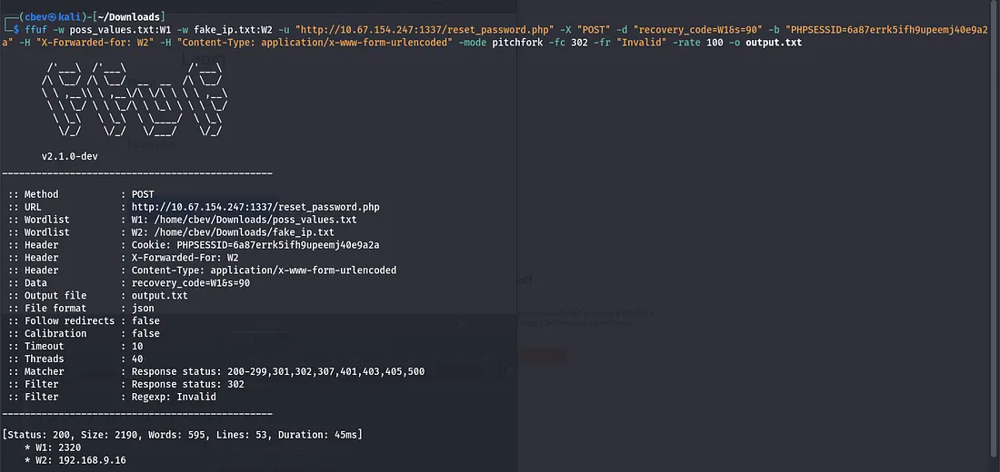

This command is quite long so let me break it down:
`ffuf` — The tool we are using to send HTTP requests

`-w` — Specifies the wordlist(s) we want to use in the request. I put the recovery_code list in as W1 and use it later to choose where to put the code.

`-u` — The URL for our target.

`-X` — The type of HTTP request we want, in our case it’s POST.

`-d` — This assings text to the body of the HTTP message, we use it for the recovery_code and seconds parameters.

`-b` — Adds a cookie, in our case the PHPSESSID value from our browser.

`-H` — Sets headers, we’ll use this for the IPs at ‘X-Forwarded-for’ and ‘Content-Type’ so the server knows how to handle the request properly.

`-fr` — Filters results based on a value, I set this to “Invalid” as we only want positive results for the code.

`-mode` pitchfork — We have to set this as it isn’t the default mode for Ffuf. It allows us to use two wordlists in our attack, and since the IP really doesn’t matter, it’ll test the codes correctly.

`-fw 1` — This just helps filter out errors in the responses, block responses with only one word.

`-rate` — Sets the rate (attacks per second) for ffuf, I only used this as our OTP was on a timer and it could help speed things up.

`-o` — Outputs the results to a file.

Once we have the code and input it, the site redirects us to a password reset for tester@hammer.thm. Now we can log in as him/her and grab the first flag!

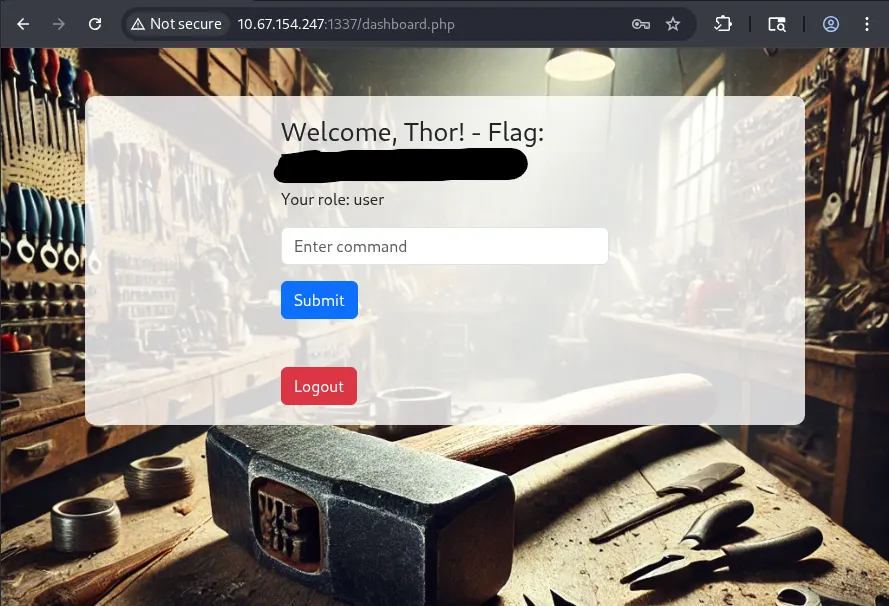

Looks like we have a command panel but our role is still user. We’ll have to find a way to escalate to admin or developer.

The page automatically logs you out after 20 seconds, regardless of whether you input a command or not. We also don’t have access to many commands other than a few of the basics.

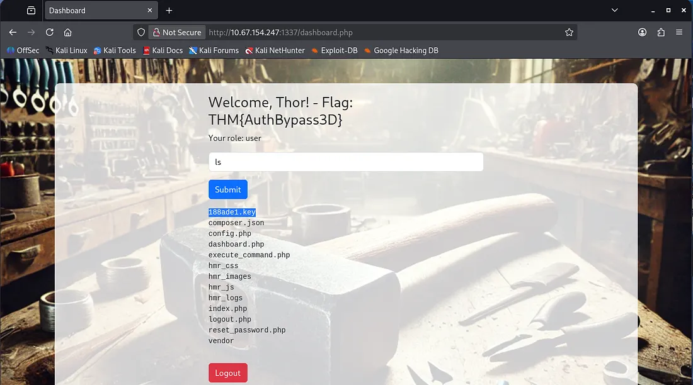

Listing the files gives us a few endpoints to check out. I found that navigating to the .php files returned an unauthorized error.

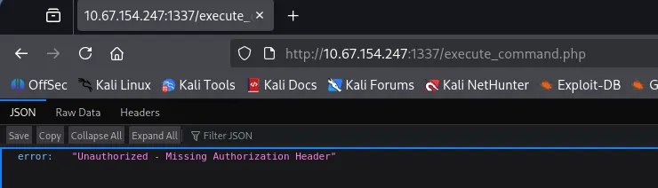

This hints at a JWT being used in the request. Let’s check out the other files and see if we can forge a header to allow us access.

I downloaded the 188ade1.key file which gave us a string to work with:

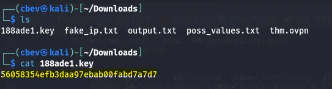

Then I had a look at the source code in hopes for a way to escalate to admin. It uses a hardcoded JWT to submit a POST request to execute_command.php.

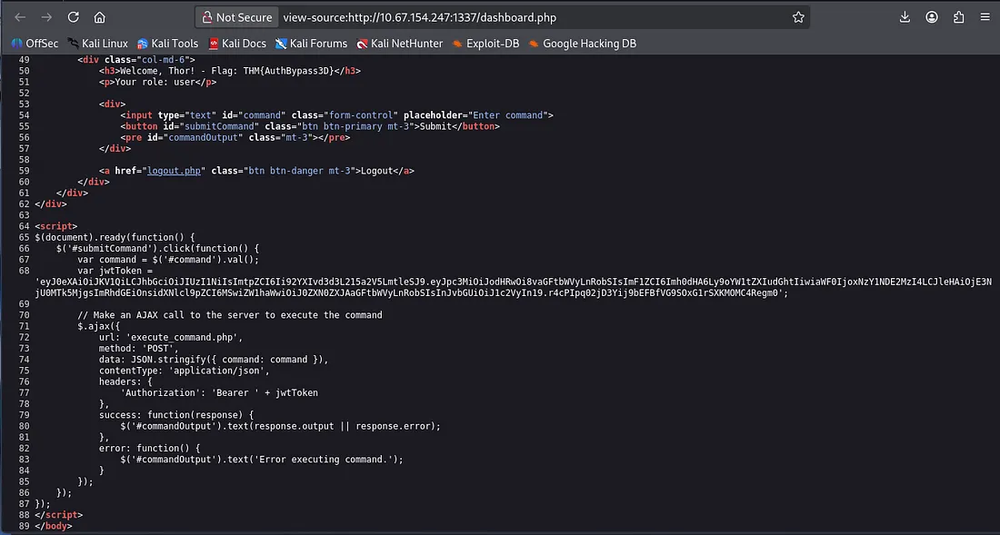

We can decode this JWT with this tool using the key downloaded earlier. We can change the role in the token to be admin, but first that kid value in the header checks /var/www/mykey.key to validate the signature of the JWT. We can change this path to the one for out 188ade1.key that we used to decode the token.

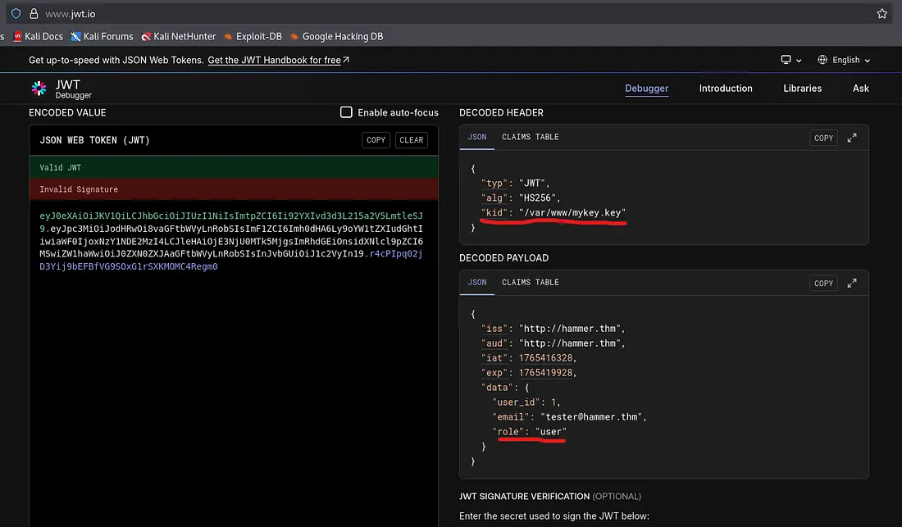

After some trial and error, I found the right path for the key at /var/www/html/188ade1.key . Let’s encode the changed headers and payload back to JWT format and submit it via a POST request in Burp Suite.

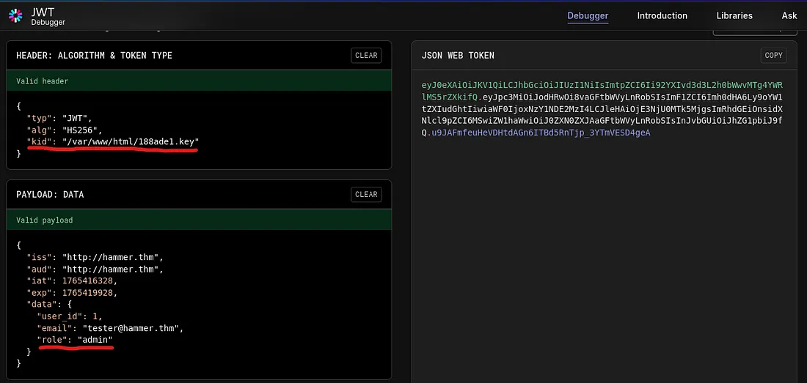

We can capture a POST request to the execute_command.php endpoint by using the command panel after logging in and running ls . Now let’s change the Authorization: Bearer value to our altered JWT to escalate to admin.

Now we have RCE on the system via a POST request, and in turn our final flag once we look around the box!

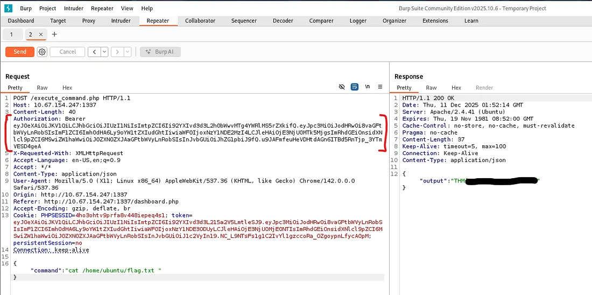

Overall, this was a slightly challenging box that taught me a heap of things regarding web authentication and enumeration. I hope this writeup was helpful to anyone following along and happy hacking!
