This box is ranked easy-difficulty on TryHackMe and is one of the most popular challenges as it puts our fundamentals to the test. The goal is to exploit a password manager made by some CompSci students.

_What happens when some broke CompSci students make a password manager?_

## Scanning & Enumeration
Per usual, let’s run an nmap scan on the given IP to see what we’re working with.

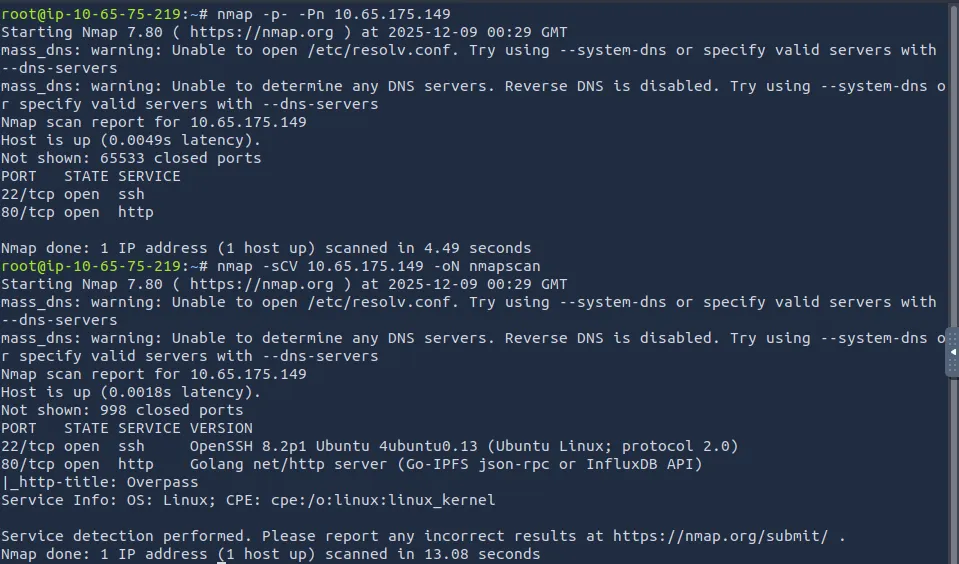

Looks like it’s running SSH and an HTTP server written in Go. Landing on the page gives us some basic info about what the password manager does and some endpoints to check out.

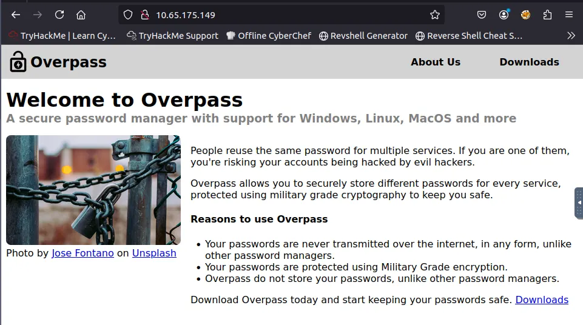

There are two tabs we can navigate to that disclose a ton of information. First we can download a copy of the source code and peek around for anything to exploit. There is also a build script that helps with installing the binary.

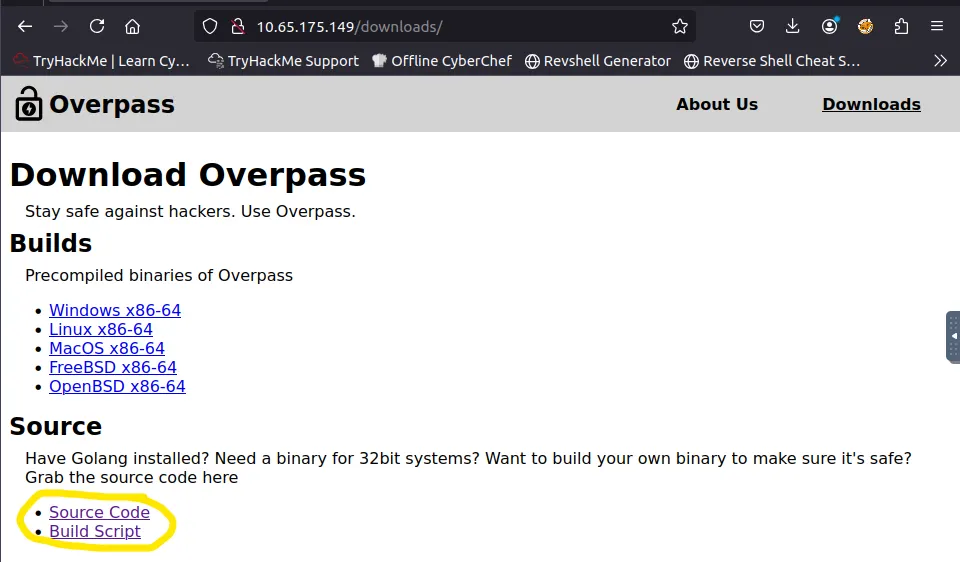

On the About Us page, there’s a list of names that we may use for privesc, cred stuffing, etc. later on. It also says that the passwords are stored in an encrypted file on the PC (hinting we’ll have to find a way to break or bypass that encryption).

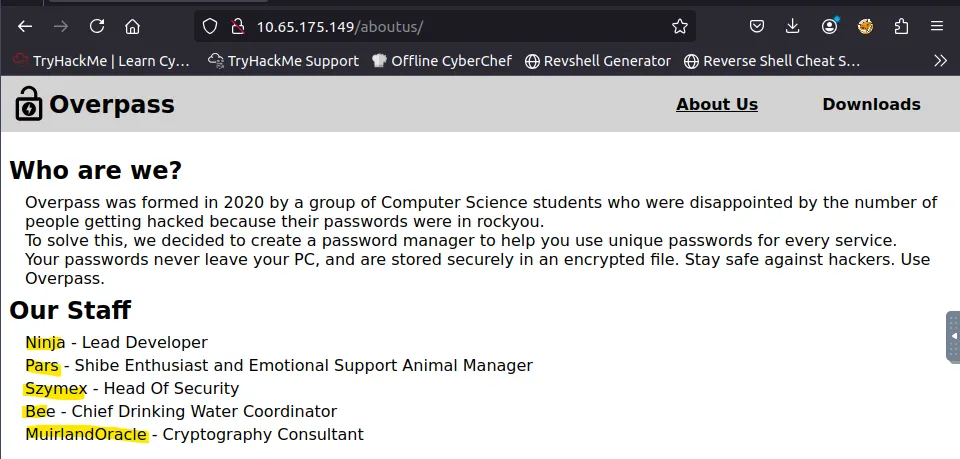

After storing those names in a text file, I take a look at the source code we downloaded. Without much hassle, we find the encryption algorithm used for the passwords (rot47) along with another name (Steve) listed in one of the commented lines.

I run a Gobuster dir search to find more places to look around at:

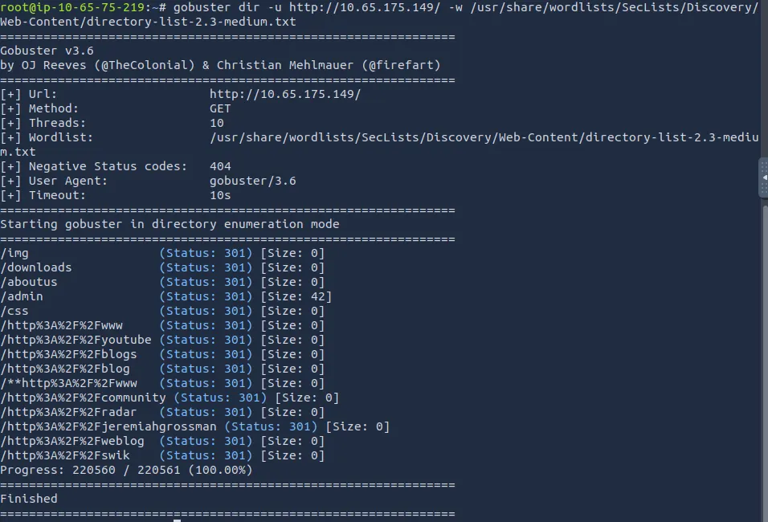

The source code on the landing page hints at the Caeser Cypher used for encryption as well.

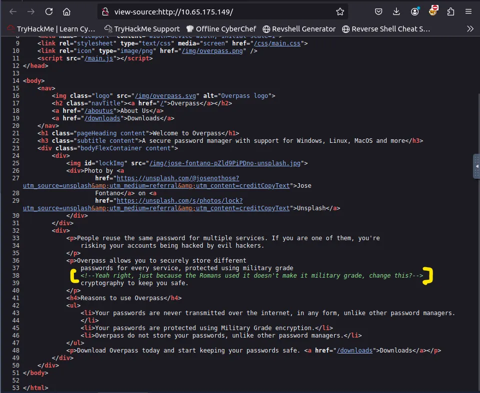

The admin page has the usual login panel and unfortunately didn’t have verbose errors to help with enumeration. However, the source code for login.js (which is used for this page) works via a POST request to /api/login and that response is stores in a cookie called ‘SessionToken’.

I use the console feature in Firefox’s developer tools to set our own SessionToken cookie to a made up value. This brings us straight to the admin panel containing an encrypted SSH private key.

_This vulnerability falls under Broken Access Control and is listed at the #1 spot on OWASP’s Top 10 list for 2021. It is very dangerous due to how prevalent and dangerous it is._

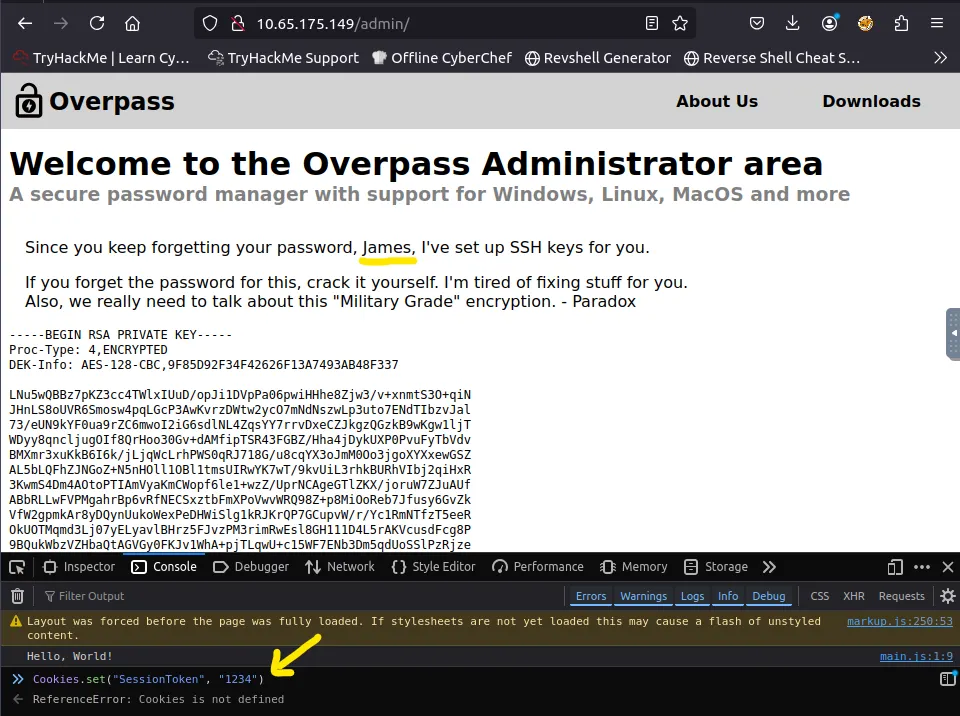

We can convert this RSA encrypted file into a format readable by JohnTheRipper and use a wordlist to crack the passphrase.

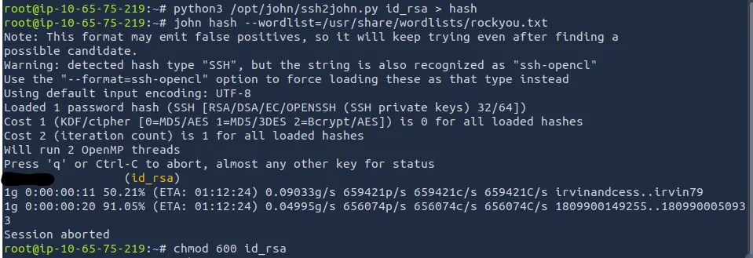

Now let’s log into James’ account and grab the first flag, as well as find a way to escalate privileges.

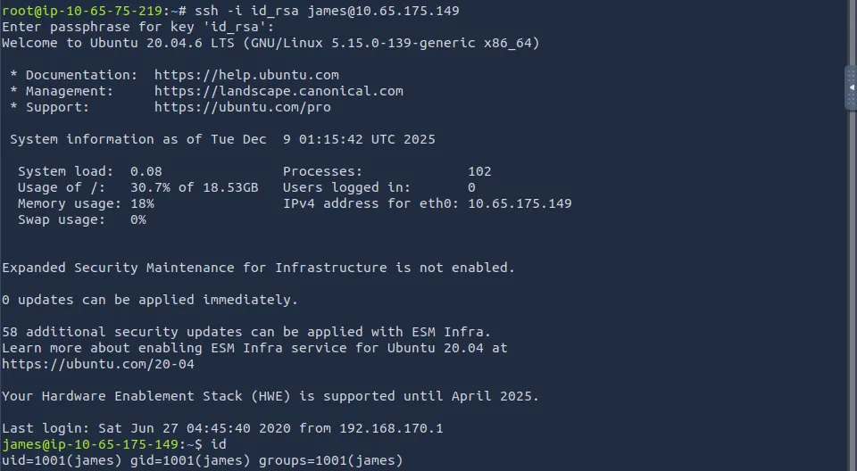

## Privilege Escalation
I walked the system and didn’t find any SUID bits set, Sudo commands available, or any creds for other users. However, the $PATH variable had /usr/local/go inside it, so I had a look at the crontabs. Turns out, the machine grabs the latest builds for the password manager at ‘overpass.thm’.

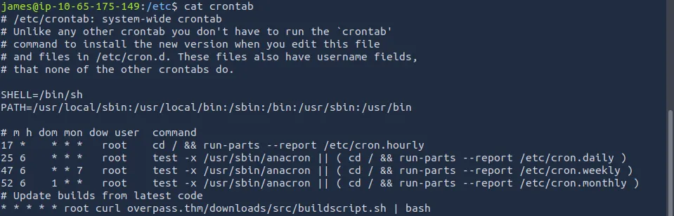

Since it’s running as root, we can find a way to change this script and grab a root shell via Cron Jobs.

After reading the todo.txt file in our home directory, it points towards a password being used in overpass. I find a hidden file containing encrypted string in it, CyberChef decrypts it into user and pass values stored in JSON.

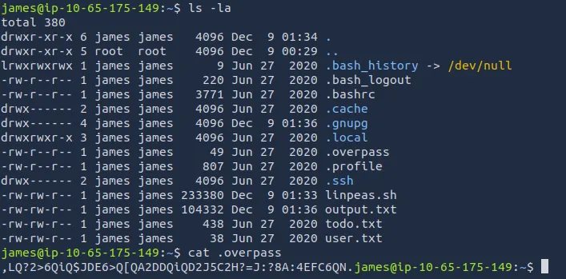

Now, we have the password for James’ account which may help with privesc.

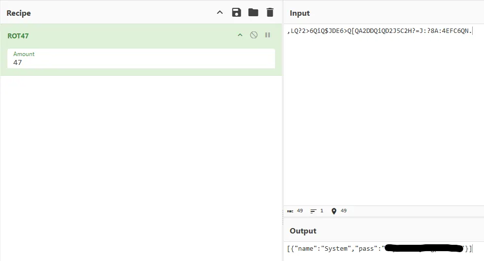

This didn’t lead to much as we can’t run any Sudo commands with a passwd but it’s still nice to have. I end up running LinPEAS and discovered that the /etc/hosts file was world writeable.

This means that we can assign our attacking IP to overpass.thm and have the system curl a malicious buildscript.sh to get reverse shell.

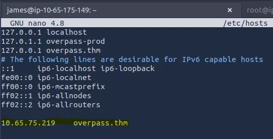

The crontab downloads at /downloads/src/buildscript.sh, so we must make a path matching that and create a file containing our command.

_I had to switch to my Kali VM because port 80 was in use_

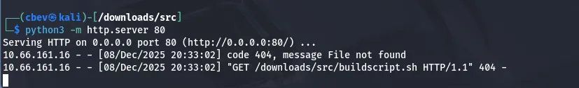

After setting up our python http server on port 80 the machine curls our malicious script and executes as root. Now /bin/bash has a SUID bit and we can run `/bin/bash -p` to get a root shell.

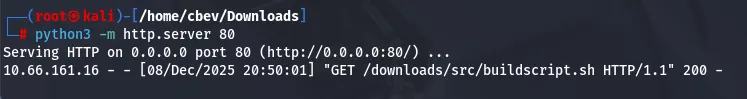

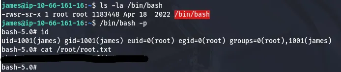

This was fairly simple but still fun, hope this was helpful and happy hacking!
