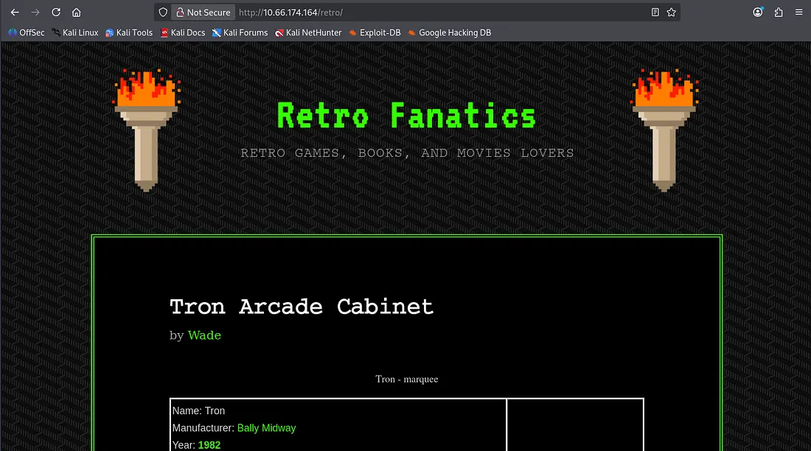
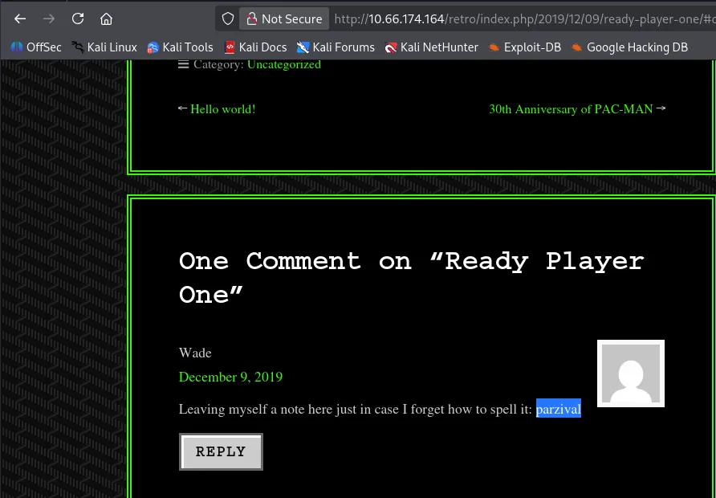
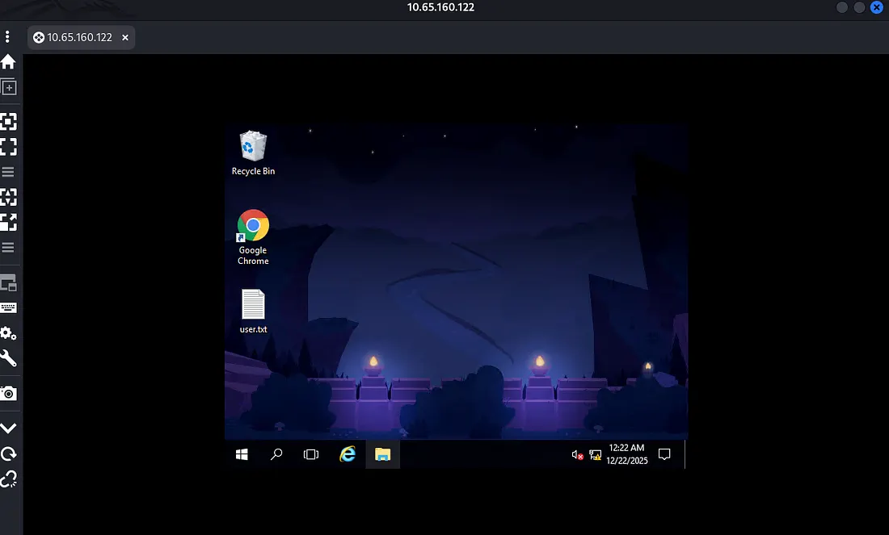
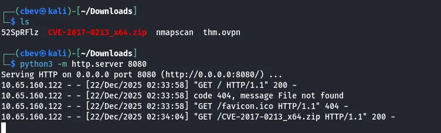
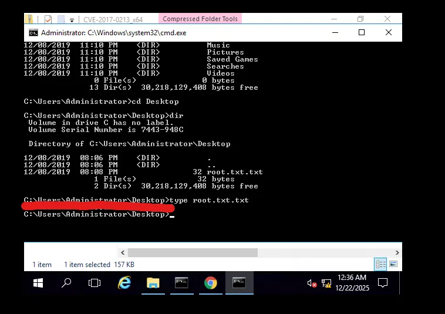

This box is ranked hard difficulty on THM, it involves us enumerating a webpage, leading to leaked RDP credentials, and finally escalating privileges to Administrator with a Windows Kernel CVE.

_New high score!_

## Scanning & Enumeration
Per usual let’s start with an Nmap scan on the given IP, we need to add `-Pn` as the box blocks ICMP as well.

Looks like the Windows system is running an HTTP server on port 80 and a Terminal Service on port 3389. `ms-wbt-server` signifies that we can RDP onto the system via this service.

The webpage is of an older Windows Server with a link to Windows IIS. The site was static and the only hover link redirected to the Windows IIS page.

A gobuster scan reveals a retro game blog page at /retro . The owner’s name is wade and he writes about older arcade style games on here.

This blog post indicates that his name is of similar spelling to Wade and that he goes by it because he loves the book Ready Player One.

Some more snooping shows that he left a comment under that post reminding himself how to spell parzival , this could of use later. I also found a login page when looking under Wade’s profile which tells me the site’s ran on Wordpress.

Another gobuster scan confirms this and attempting to go to wp-admin redirects me to localhost. This means we probably can’t login unless we are already on the system.

## Exploitation
Some manual enumeration helps me find that Wade is a valid username for the login page through verbose errors. I tried using the word we found on that comment from earlier as the password and not only did it work, we get redirected to a wp-admin panel!

At this point I go for a typical reverse shell by changing the 404.php script under Appearence -> Themes. [Here](https://medium.com/@akshadjoshi/from-wordpress-to-reverse-shell-3857ee1f4896) is a good article of you’re unfamiliar with reverse shells on WordPress. I used Ivan Sincek’s PHP reverse shell as others I’ve tried failed to daemonize or work entirely.

For whatever reason, I tried to RDP with Remmina via Wade’s credentials again and it worked. I’m not sure if I typed it wrong before but now that we have access, our first flag is just sitting there.

Since this version of Windows is pretty outdated, we can find kernel level exploits relatively easy. The one I’m using is CVE-2017–0213, which allows us to escalate privileges to Administrator through use of the Windows COM Aggregate Marshaler.

_Windows Server 2016 allows an elevation privilege vulnerability when an attacker runs a specially crafted application, aka “Windows COM Elevation of Privilege Vulnerability”. [-Rapid7](https://www.rapid7.com/db/vulnerabilities/msft-cve-2017-0213/)_

After downloading the _x64 bit version, I host it on my attacking machine and grab it with a browser.

After downloading on our compromised machine, we execute it from CLI or the file system and the exploit spawns a shell running as Administrator.

There’s our second and final flag for the box. This box was a good challenge but I’m not sure that I’d label it as hard difficulty, maybe medium.

Either way I had fun with it so thanks to DarkStar7471 for another great box. I hope this was helpful to anyone stuck or following along and happy hacking!
