This box is ranked easy-difficulty on TryHackMe, it involves enumerating SMB shares and escalating privileges in order to foil a tech scammer’s plans to defraud more people.

_Hack into the scammer's under-development website to foil their plans._

## Scanning & Enumeration
As always let’s run an nmap scan on the given IP to see what services are running on the system.

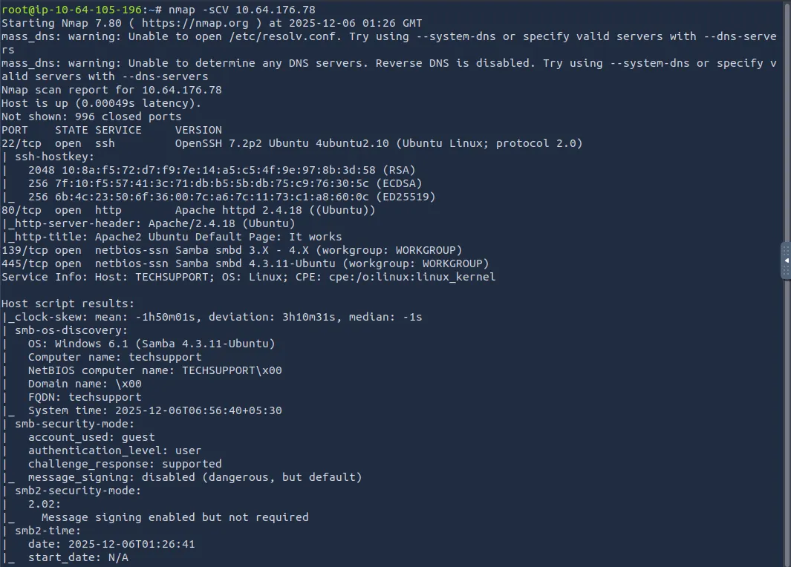

Right away, we find SSH and an Apache web server on their normal ports, however it is also running Samba. This tells me that we should try for readable shares on those and check out the website for any users as well.

The webpage is just a boilerplate Apache landing page, so while a subdirectory scan runs, let’s enumerate Samba shares.

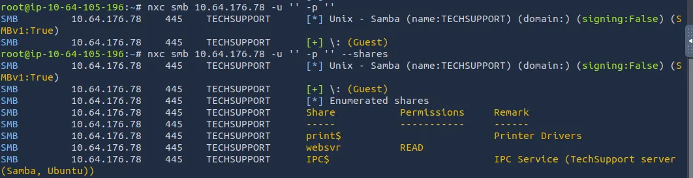

There is a readable share named ‘websvr’ and guest login is allowed.

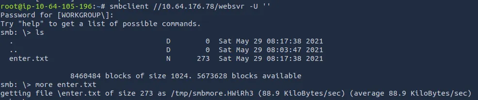

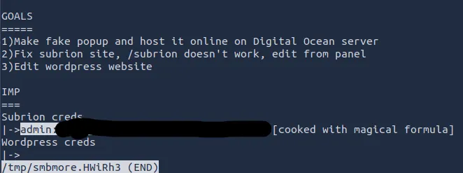

Looking at the txt file, we gather a few things. The /subrion endpoint doesn’t work, admin credentials for it, and the site is running wordpress.

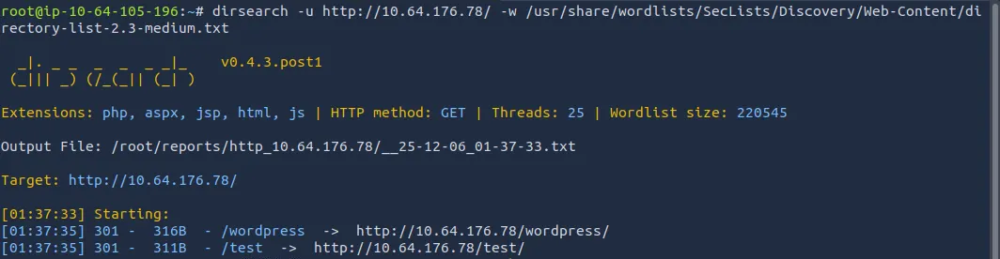

Dirsearch returned two hits, one for the wordpress page and a test page for a scam popup (video stream).

The creds hint that it’s been altered with a magical formula. CyberChef has a formula that automatically analyzes the input and suggests the most likely operations done to it. Here we get this plaintext password from it:

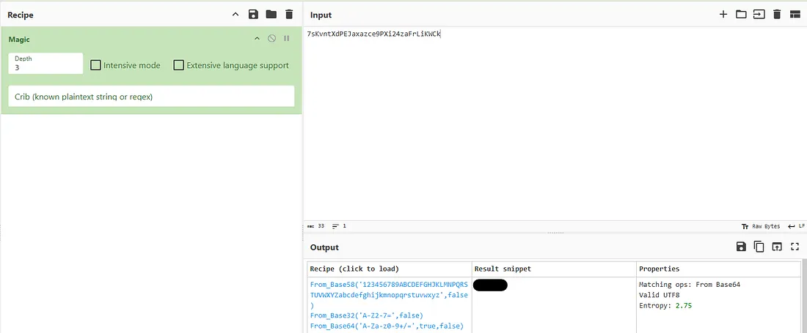

The /subrion endpoint is not reachable and judging from the note earlier, we’ll have to find a panel to get on to it.

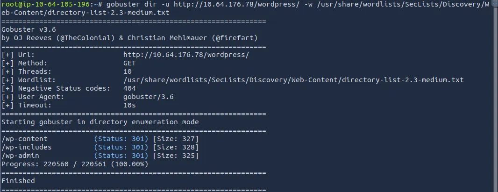

Wordpress has the usual places too, ‘wp-admin’, ‘wp-includes’, and ‘wp-content’.

I tried to credstuff the wp-admin panel in hopes that the passwords were the same but there was no admin username of any kind. Time to run WPScan and see what we can find.

_Note: I found that wpscan has trouble working on the THM Attack Boxes out of the gate, if this happens run:_

```
sudo apt upgrade wpscan && sudo apt update wpscan

wpscan --update
```

_This covers all bases and ensures everything in WPScan works as it should._

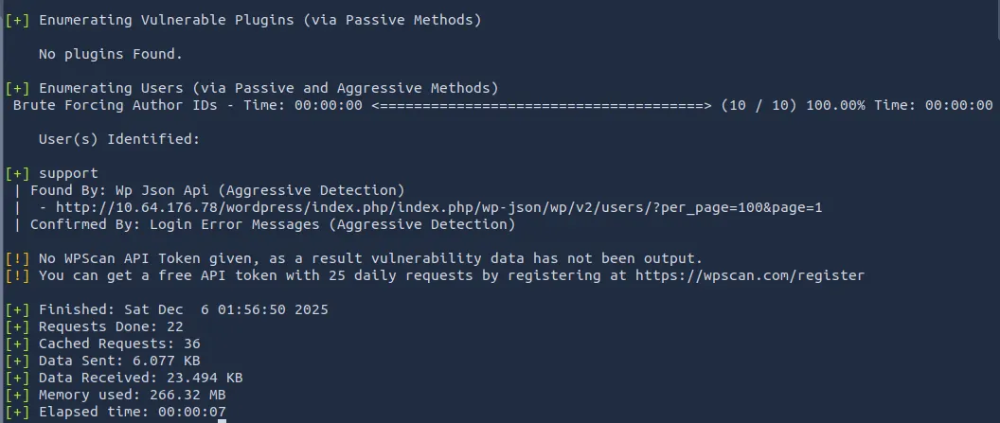

We only find a user named ‘support’ which can be used to sign into wp-admin. The creds for /subrion didn’t work for this account either. Let’s use Hydra to try brute-forcing the login page.

While that ran, I captured a request to /subrion in burp suite to figure out why it was unreachable. It would keep redirecting me away (infinite /subrion/subrion …)

I tried going to robots.txt in an attempt to see if only valid endpoints were reachable and got a hit.

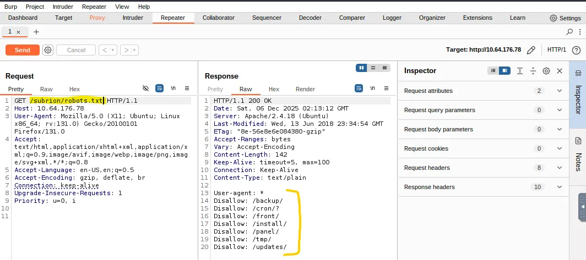

We finally find the panel where those admin creds work, lets peep around!

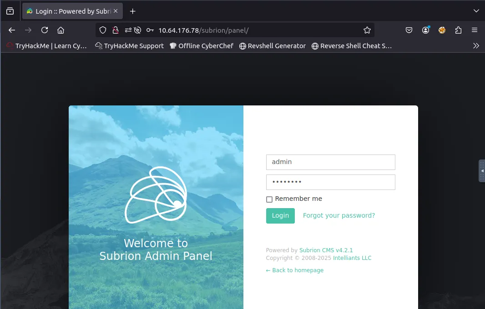

## Exploitation
Once logged in as admin, I find a database tab that allows us to make queries to a MariaDB SQL database. I use this to find the version of Subrion it’s running and look for exploits against it.

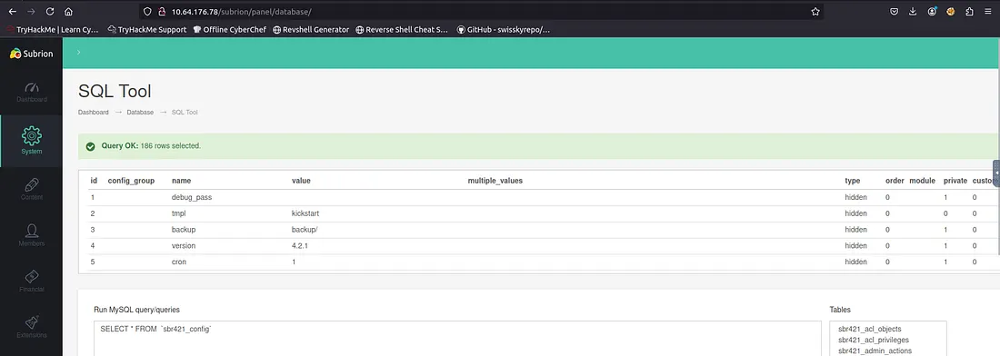

A quick Google search shows there is a CVE for remote code execution on this version of Subrion CMS (4.2.1).

Exploit PoC found [here](https://github.com/hev0x/CVE-2018-19422-SubrionCMS-RCE/blob/main/SubrionRCE.py)

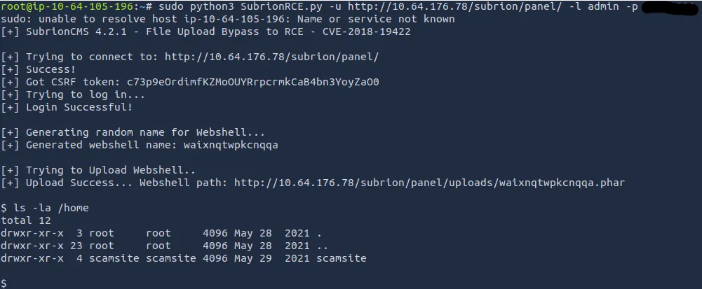

## Privilege Escalation
That script uploads a reverse shell and now we can execute commands on the system as www-data. Lets’ look around for credentials as this shell is not very nice to use.

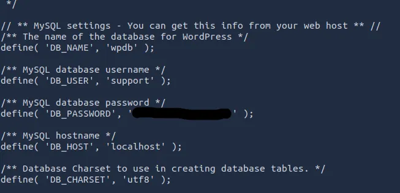

I found credentials for the ‘support’ account in wp-config.php and tried using the password for the only other user on the system (being scamsite) and it actually worked!

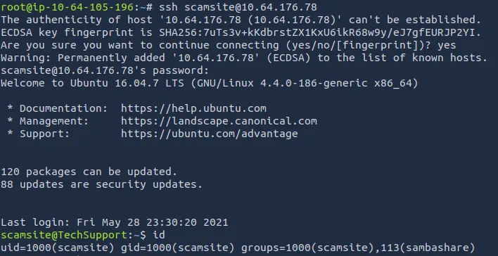

Checking sudo commands shows we can run /usr/bin/iconv with no password. Let’s use this to escalate privileges to root.

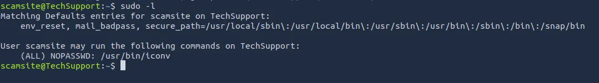

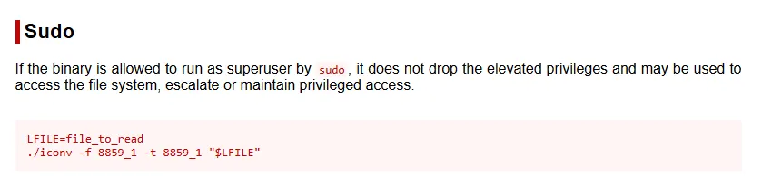

[GTFOBins](https://gtfobins.github.io/gtfobins/iconv/#sudo) provides a way to read files using this binary, so we cat the root.txt flag and that’s the box done.

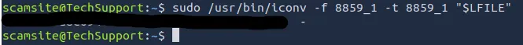

It felt kind of cheap being able to read files but not have root privileges, so I used the iconv binary to read /etc/shadow & /etc/passwd to crack the root password with john.

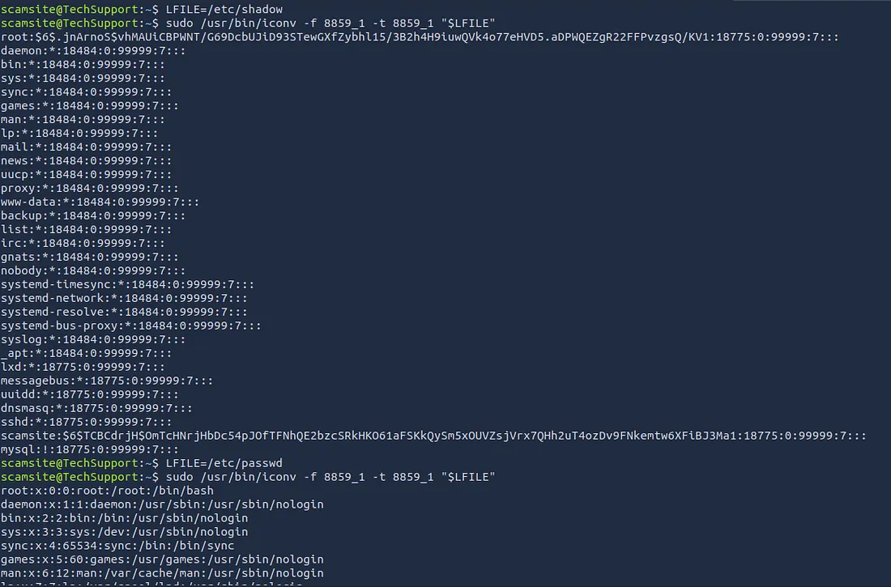

I let it run for about an hour while studying and got no results, so I went back to using the iconv binary to read files, only this time I was looking for an SSH key in /root.

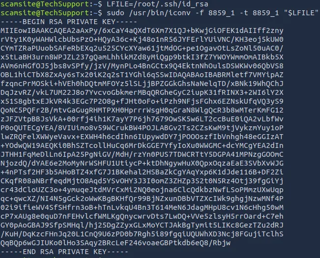

This didn’t work either, even with having permissions set correctly it prompted for a password every time. So I ended up generating an ssh key on my attacking machine and writing it into /root/.ssh/authorized_keys using the iconv binary again.

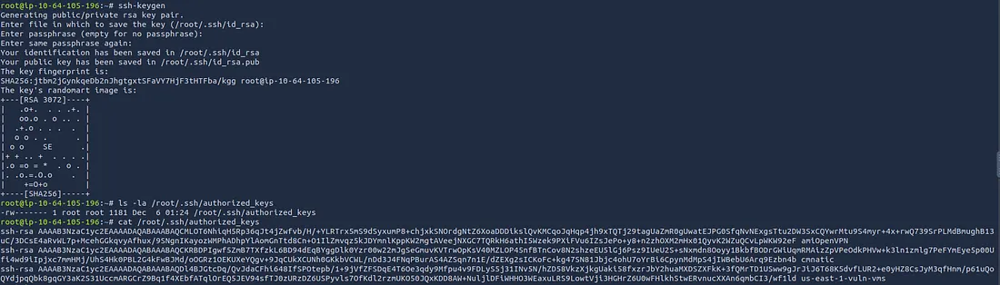


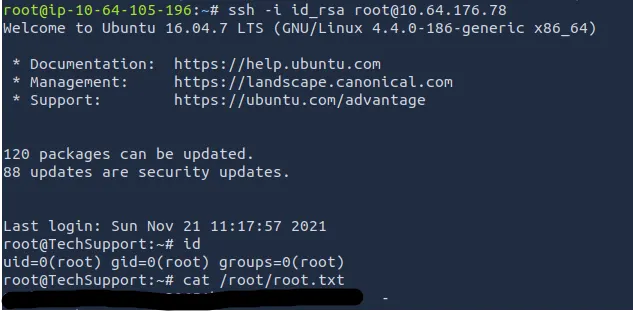

There we have it, boot2almostroot on the system. This was a fun challenge and hopefully it was helpful to anyone following along. Happy hacking!
