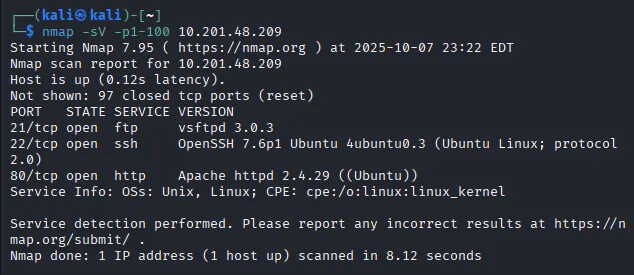
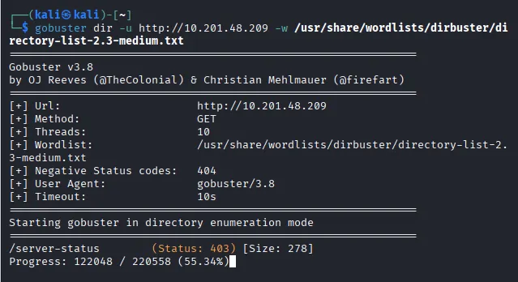
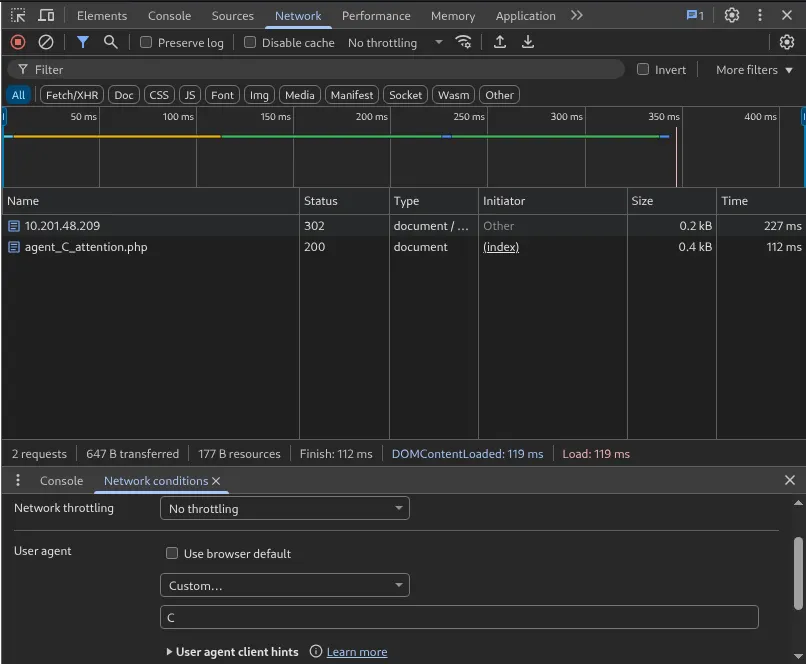
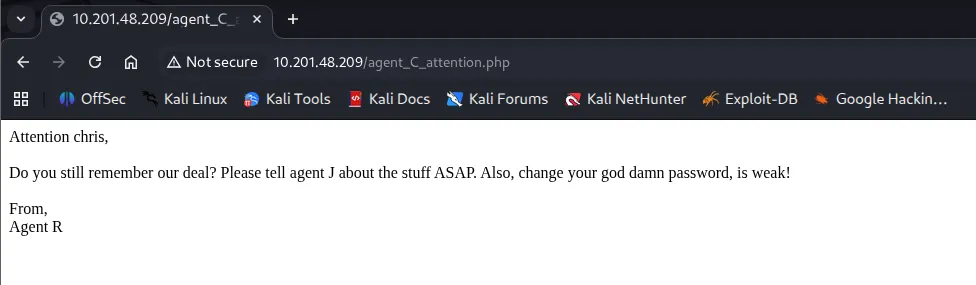
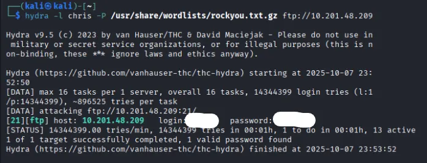
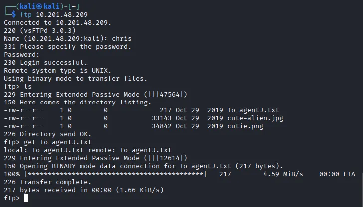
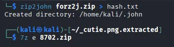
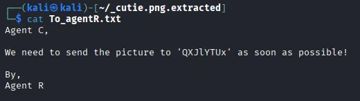
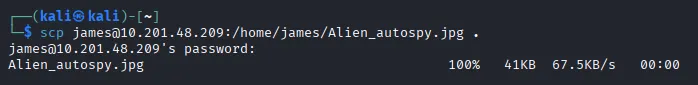
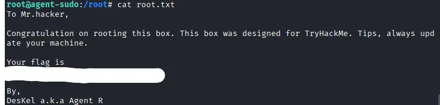

This Men In Black-esque CTF is catered towards beginners and puts a good range of skills to the test. Overall, it was a fun challenge.

## Discovery
After spinning up a Kali image and connecting via OpenVPN, I ran an nmap scan against the IP address given and see that three ports are open running the following:

There are three ports open:
- FTP on port 21 (vsftpd 3.0.3)
- SSH on port 22 (OpenSSH 7.6p1 Ubuntu)
- HTTP web server on port 80 (Apache httpd 2.4.29)

## Webpage Enumeration
I figured I could maybe use the ftp service later and ssh wouldn’t do us any good without a username (assuming default credentials are not in use). Next step was to check out the web page. Before I have a look at the webpage, I run a gobuster directory enumeration in case we get a hit to use down the road (spoiler — nothing came of it).

Arriving at the webpage, we see a simple message inclining us to alter our user-agent to match our codename in order to access the site. Using the developer tools in Chrome we can change our UA to a custom string. The message on the website was left by an Agent R, and having nothing else to go on I start brute forcing the alphabet until we got a hit!

A page redirect takes us to a message for Chris, It seems he has a bad habit for weak passwords. A good start for the ftp service we saw earlier.

## Brute-Forcing Credentials
Using Hydra along with the infamous rockyou.txt wordlist to brute force Chris’ login info, we get his password ‘crystal’.

There is an interesting file on the FTP server in regards to our supposed colleague Agent J. Taking a look at the message gives us a clue to a possible SSH login hidden in one of the ‘fake’ alien photos.

## Extracting Embedded Info & Steganography
Using binwalk lets us extract a hidden zip file in the cutie.png. As I suspected, the strange little guy was hiding something.

Zip2john lets us crack the password protected zip file with ease. Using the complex password we can extract a message to Agent R from the zip file.

Decoding the string of text from base64 we get the steganography password. After a quick google, I find a tool called steghide to extract info from the other photo we pulled from the ftp server. Turns out Chris sent james (Agent J) a message telling him his password.

Now we can login as james via SSH. Poking around we find a picture to download and our first flag to submit as user.

## Privilege Escalation
Taking a look at CVE-2019–14287, we can run the command `sudo -u#-1 /bin/bash` for an easy privesc because of the outdated sudo version.

Finally we find out Agent R’s name is DesKel and claim our root.txt flag to finish the challenge. Hopefully this was helpful to anyone stuck or following along.

_P.S. the Alien_autopsy.jpg file has a typo_
