This box is ranked hard-difficulty on TryHackMe, it involves us using SQLi to compromise a Joomla CMS account, cracking hashes, and a unique privilege escalation method via yum.

_Compromise a Joomla CMS account via SQLi, practise cracking hashes and escalate your privileges by taking advantage of yum._

## Scanning & Enumeration
As always, a quick Nmap scan shows us what we’re dealing with:

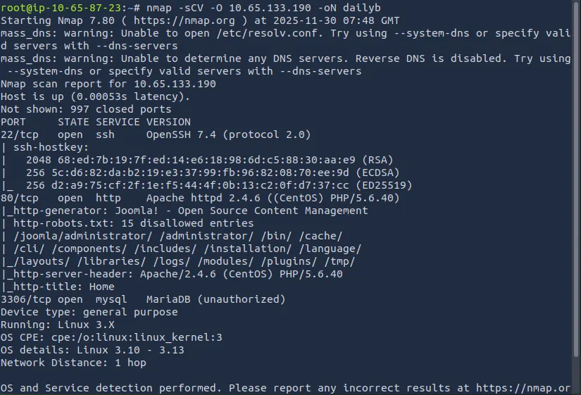

Off bat I see an Apache web server is running on port 80 alongside SSH on its normal port and a MariaDB SQL server on port 3306.

From the default scripts that Nmap ran, we can see plenty of disallowed entries from robots.txt. It’d be worth checking these out before running SQLMap.

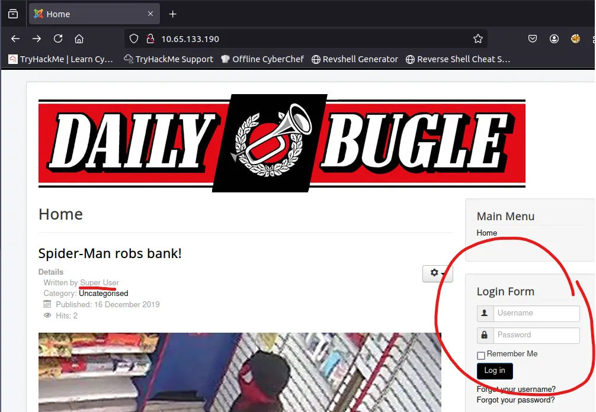

Looking at the home page, we gather an account with the name ‘super user’ and a login form.

The only interesting page from robots.txt was an admin login page. I tried SQLi and thought about enumerating users from it but there were no verbose errors and injections didn’t seem to work.

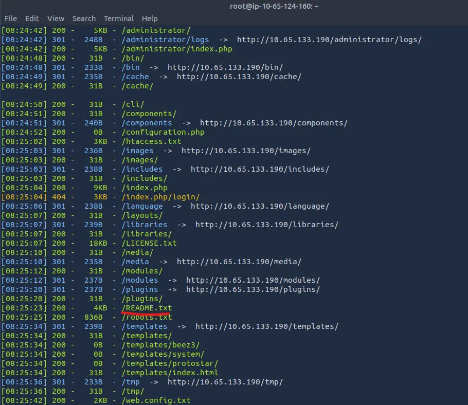

At this point I ran a dirsearch to see if I could potentially gather any more info about the webpage. I get a hit on a README.txt file which shows the server is running Joomla v3.7.0

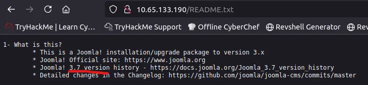

Searchsploit yielded a couple Proofs of concepts for a SQLi, so I went searching for a script on GitHub.

## Exploitation
After running the script, I find three usernames, an email, and a hash to send over to JTR.

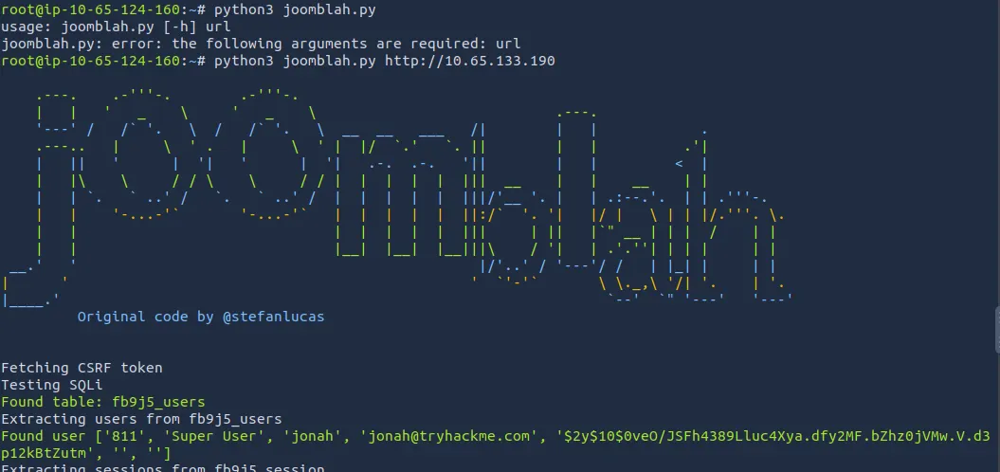

## Hash Cracking
Using jonah’s cracked password to log into the webpage, I immediately think to upload a reverse shell for our initial foothold.

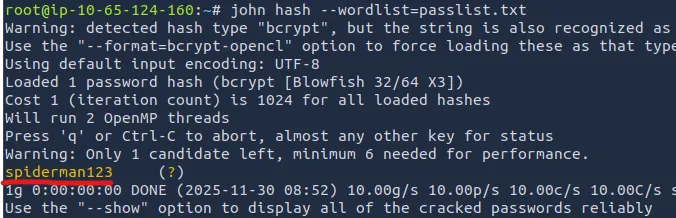

I locate the templates page on the control panel which houses the php code for the site. By changing the index.php for the protostar template to our own PentestMonkey’s reverse shell, we grab a shell on the box.

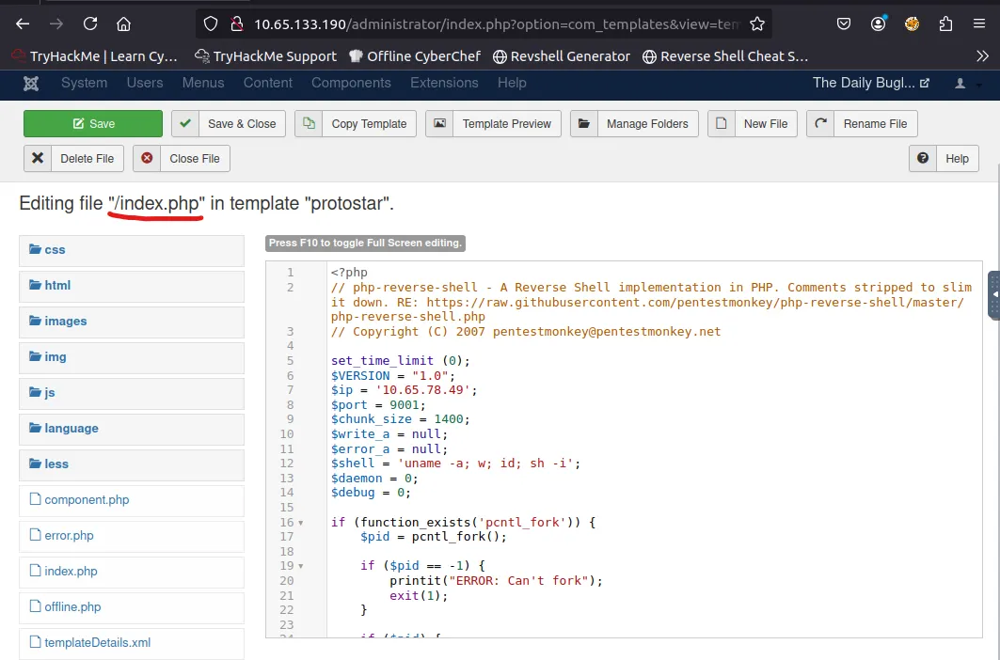

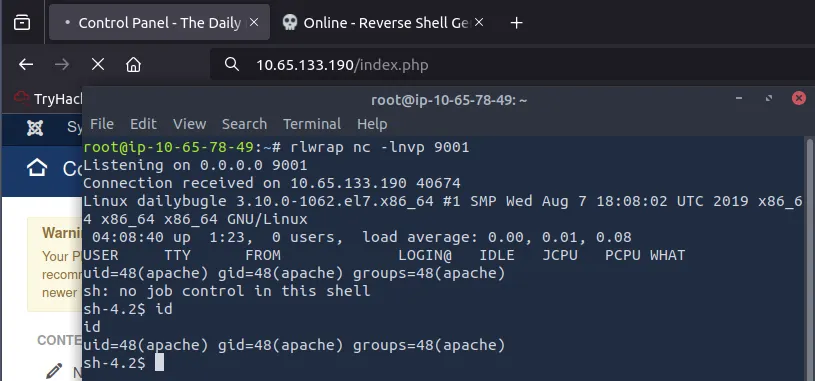

There were two other users on the system: root and jjameson. I was denied access to both so I did some snooping around /var/www and found a password in a configuration file.

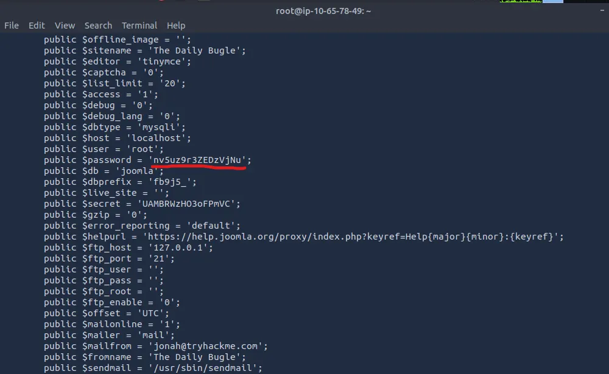

I use this to login to jjameson via SSH and it actually works!

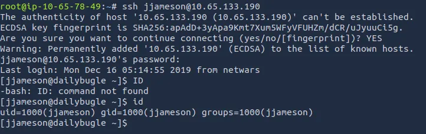

## Privilege Escalation
Running `sudo -l` to list all commands available, we see there’s no password required for the yum binary

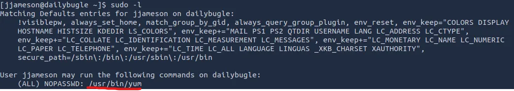

I like to check [GTFOBins](https://gtfobins.github.io/gtfobins/yum/#command) any time I see sudo privs on a binary.

It turns out we have a way to spawn an interactive root shell by loading a custom plugin in yum.

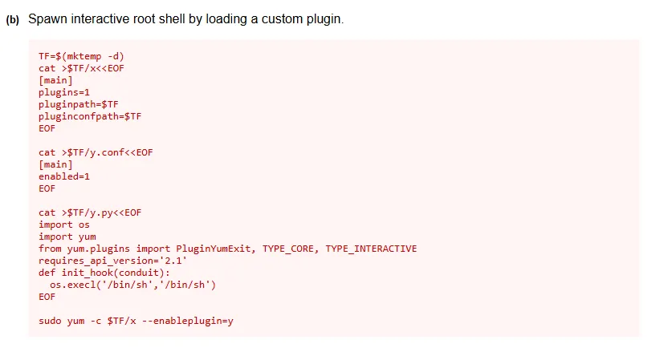

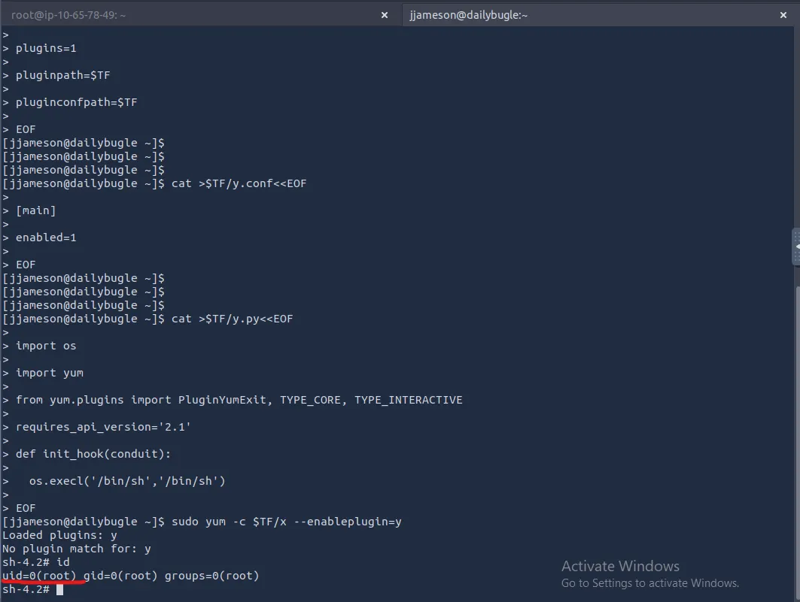

Finally we have our root.txt flag to finish off the box.

This was a very fun Spider-Man themed challenge; it goes to show how dangerous SQLi vulnerabilities are and how even one outdated service could lead to a full system compromise.

Hope this was helpful or at least entertaining, Happy Hacking!
