This box is ranked medium difficulty on THM, it consists of enumerating hidden endpoints on a web server, exploiting code to bypass authentication, and a cool way to escalate privileges to root.

_Real pentest findings combined_

## Scanning & Enumeration
Let’s start with an Nmap scan to show all running services on the given IP:

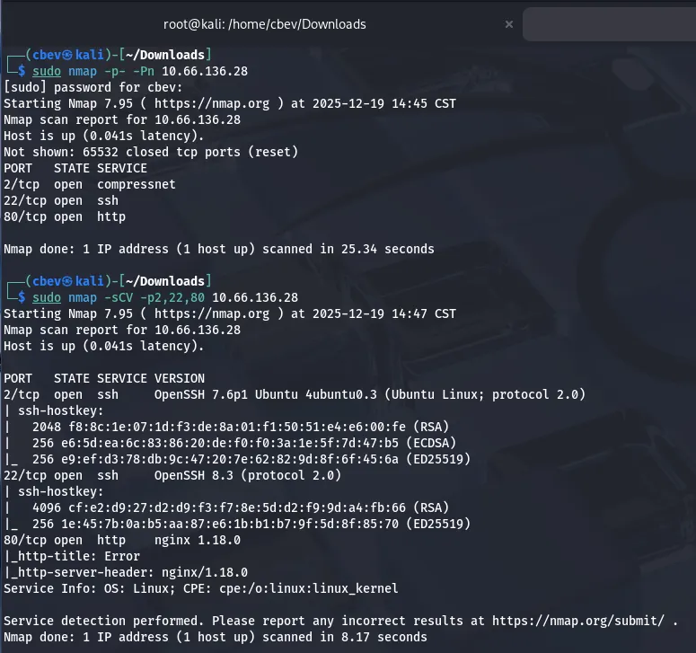

Looks like we have two ports running SSH and an nginx web server on the usual port. The only thing that sticks out to me is that SSH on port 22 doesn’t have an OS banner, however I have seen this on RedHat or CentOS applications before.

There are only a few username enumeration exploits for the first SSH version so I head on over to the webpage.

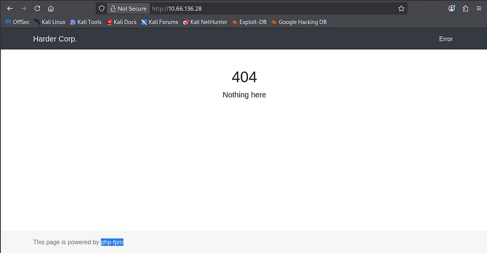

We get a standard 404 page, meaning a gobuster or ffuf scan is the next step. I also see that it is powered by php-fpm which is handy knowing the backend language. Nothing interesting in the source code or robots.txt either.

I ran a gobuster search but couldn’t find anything; because the 404 errors get redirected here, we end up with a 200 code as it’s technically where we want to go. I capture a an HTTP response in Burp Suite and found that it sets a cookie with a path to pwd.harder.local .

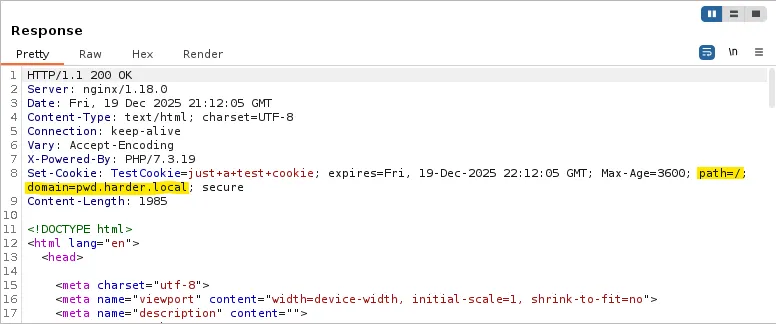

Let’s add that domain to our /etc/hosts file and check it out.

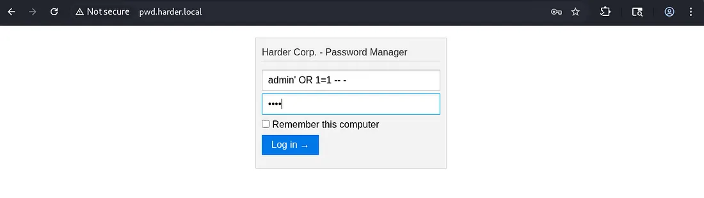

There is a password manager login panel at this domain, good news as when we crack it we’ll get access to more accounts. I run a gobuster search to find any .php endpoints other than index.

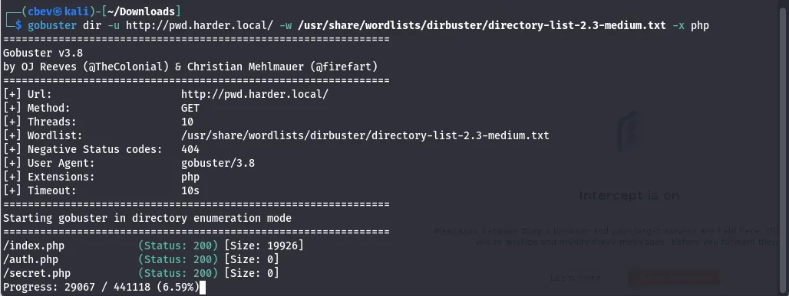

These both returned Status: 200 but since the size was 0, nothing useful was on them. At this point I was stuck for a bit, however I remembered that one of the tags for the box was git and we haven’t seen that yet. I check for a .git endpoint and it returns a 403 forbidden.

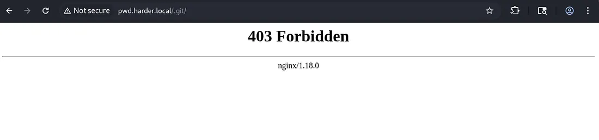

This is good news as a request to other places grants a 404 error meaning that it definitely has this endpoint. As we can’t reach it I use a tool called [git-dumper](https://github.com/arthaud/git-dumper) to download the files.

_Use pipx to install this on Kali_

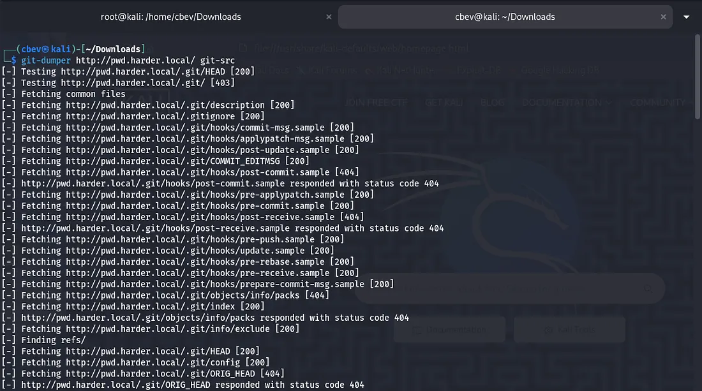

Looking at index.php shows that a login requires hmac.php and credentials.php which we don’t have yet.

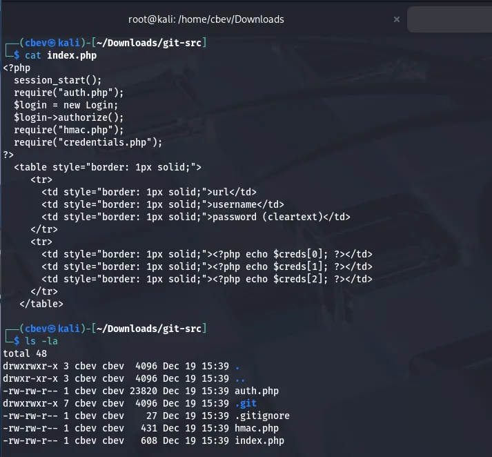

auth.php shows that whenever a request made by the user that doesn’t have the username and password set to ‘admin’ dies. If they are set, we get a page saying “extra security in place…”

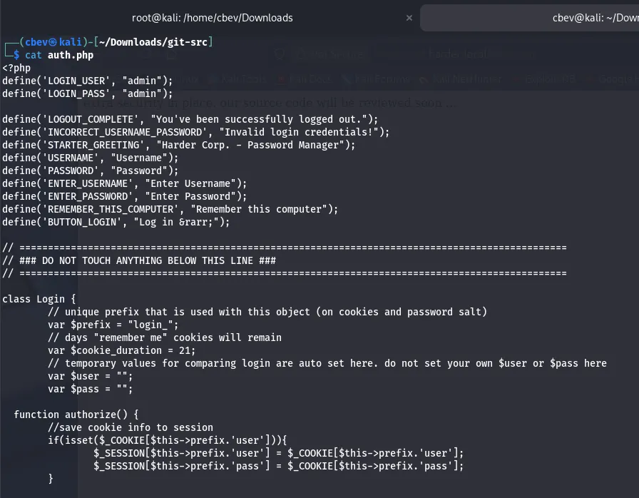

hmac.php checks if the host is empty and if it is, the request dies. It also looks for secret.php and if `$_GET[‘n’]` isn’t empty, it stores a SHA256 hash of it in a variable named secret. Finally, it checks if the secret matches to the host provided and dies if not so.

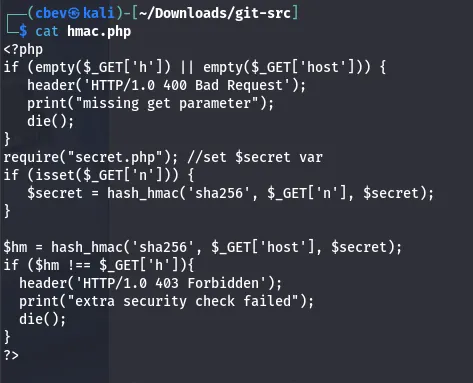

I used AI and did some research on vulnerabilities similar to this one which led to me finding [this article](https://www.securify.nl/blog/spot-the-bug-challenge-2018-warm-up/) explaining how to bypass the condition. Basically, if we pass an array for `$_GET[’n’]` it returns the value of the secret variable as false. Then we can generate a valid hmac value for any request.

```
php> $secret = hash_hmac('sha256', Array(), "SecretKey");
php> echo $secret == false
1
```
So our final payload will look like this:

```
/?n[]=&host=securify.nl&h=c8ef9458af67da9c9086078ad3acc8ae71713af4e27d35fd8d02d0078f7ca3f5
```

Just to reiterate, providing any hmac value will work as we are effectively setting the secret to false and reversing the hmac check function.

Using the payload gives a password for evs on another domain named shell.harder.local .

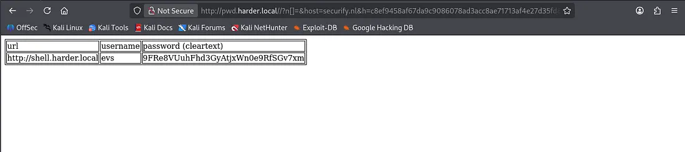

After adding the new domain to our /etc/hosts file, I try to sign in as evs , but this string is returned.

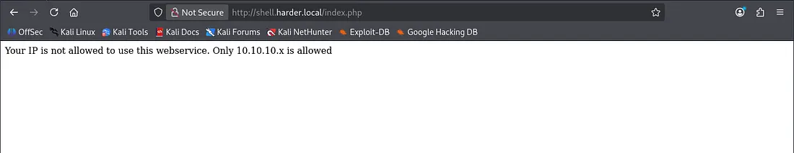

We can easily bypass this by adding an `X-Forwarded-for` header to our POST request in Burp Suite and setting it to be 10.10.10.10.

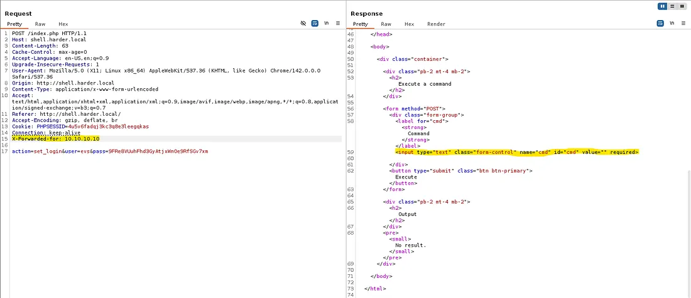

Looking at the response, we can add a cmd parameter to our request to get command execution on the system. We can grab the user.txt flag this way and then look around for credentials or try for a reverse shell.

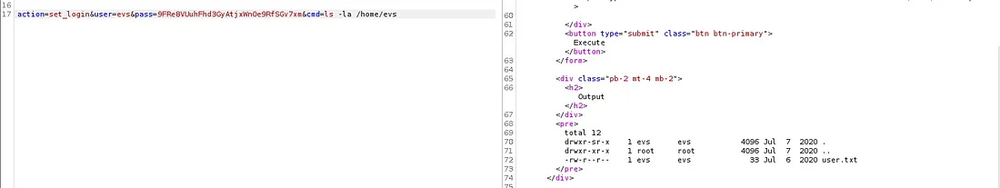

The find command wasn’t working and any shell I could muster wouldn’t either. There’s only python3 and netcat on the box but those just didn’t seem to work, so I went about enumerating directories manually.

After way too long, I stumble upon a directory called /periodic under /etc and find a backup script containing evs’ SSH password.

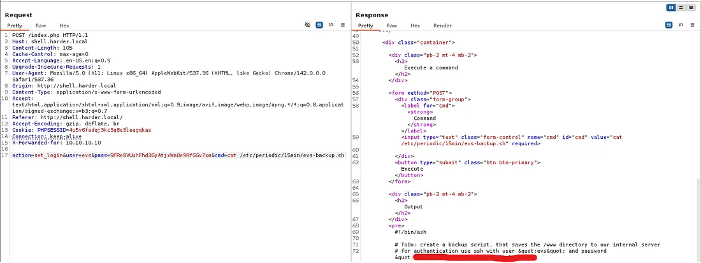

Let’s use this to SSH in and look for privesc.

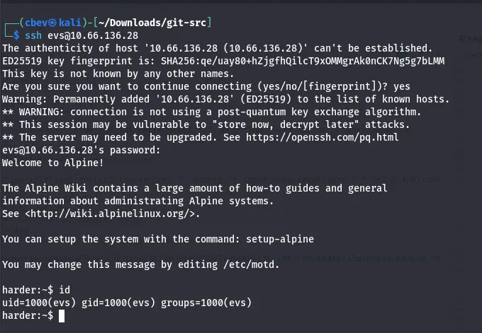

While looking for files with a SUID bit, I find a binary that executes .gpg encrypted files and executes them as root. Let’s use this to catch a root shell on the box.

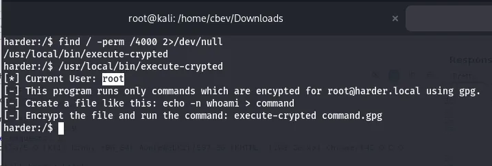

I checked /var/backup earlier for potential creds but found a gpg public key for root user. I import the key and then list them.

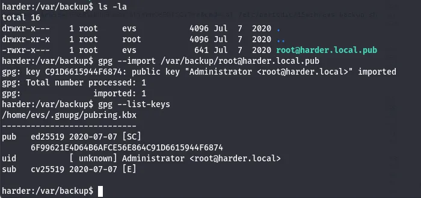

Now let’s generate SSH keys on our remote machine to be able to echo our creds into/root/.ssh with that binary.

This is what I put in my command file:

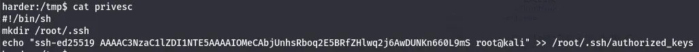

Now let’s encrypt this with gpg and have that binary execute it.

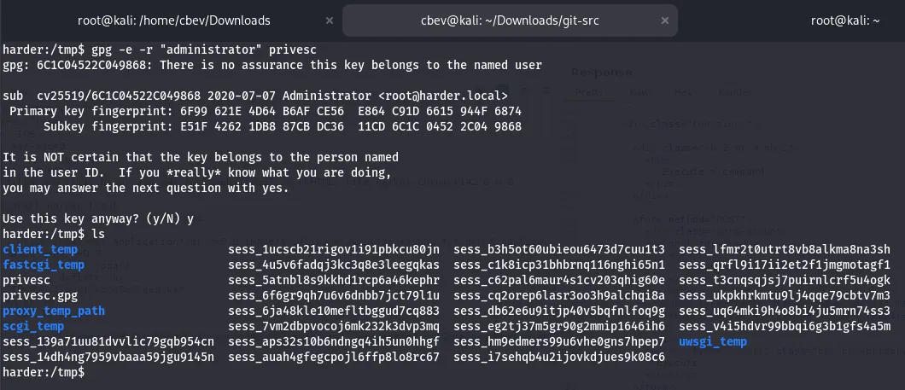

Finally we SSH in as root, grabbing the final flag and completing the box.

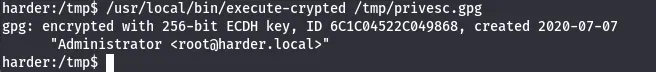

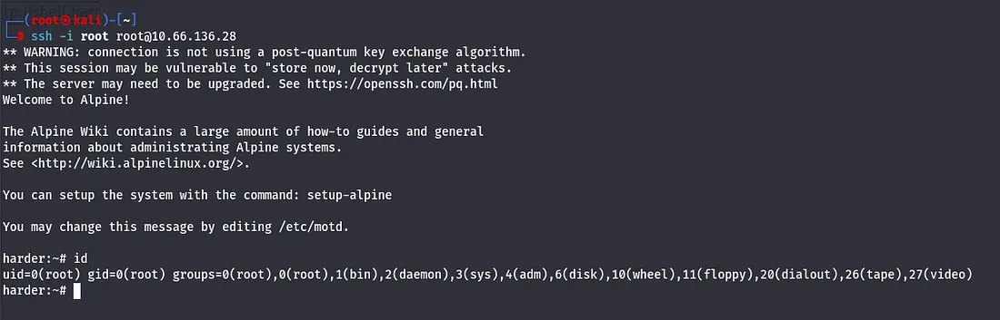

There we have it. This box was a hard yet surprisingly fun challenge, albeit there was plenty of researching vulnerabilities, I learned a ton. I hope this was helpful to anyone stuck or following along and happy hacking!
