This box is ranked medium-difficulty on THM, it involves us escalating privileges on a web application, SSRF on an internal API to read admin credentials, and leveraging an LFI vulnerability to read files on the system.

_Use your server exploitation skills to take control of a web app._

## Scanning & Enumeration
As always let’s start with an Nmap scan to find services running for the given host IP.

```
$ sudo nmap -p22,25,110,143,993,995,4000,50000 -sCV 10.67.173.208

Starting Nmap 7.95 ( https://nmap.org ) at 2025-12-14 19:32 CST
Nmap scan report for 10.67.173.208
Host is up (0.043s latency).

PORT      STATE SERVICE  VERSION
22/tcp    open  ssh      OpenSSH 8.2p1 Ubuntu 4ubuntu0.11 (Ubuntu Linux; protocol 2.0)
| ssh-hostkey: 
|   3072 be:95:41:b1:31:6f:2d:ea:e3:b4:39:dc:df:96:22:10 (RSA)
|   256 25:60:d1:96:61:17:24:79:68:22:07:67:23:ae:ea:f9 (ECDSA)
|_  256 d5:05:51:6e:72:fa:02:63:9a:88:d2:17:c4:f7:8a:bb (ED25519)
25/tcp    open  smtp     Postfix smtpd
| ssl-cert: Subject: commonName=ip-10-10-31-82.eu-west-1.compute.internal
| Subject Alternative Name: DNS:ip-10-10-31-82.eu-west-1.compute.internal
| Not valid before: 2021-11-10T16:53:34
|_Not valid after:  2031-11-08T16:53:34
|_ssl-date: TLS randomness does not represent time
|_smtp-commands: mail.filepath.lab, PIPELINING, SIZE 10240000, VRFY, ETRN, STARTTLS, ENHANCEDSTATUSCODES, 8BITMIME, DSN, SMTPUTF8, CHUNKING
110/tcp   open  pop3     Dovecot pop3d
|_pop3-capabilities: RESP-CODES UIDL STLS CAPA AUTH-RESP-CODE TOP PIPELINING SASL
|_ssl-date: TLS randomness does not represent time
| ssl-cert: Subject: commonName=ip-10-10-31-82.eu-west-1.compute.internal
| Subject Alternative Name: DNS:ip-10-10-31-82.eu-west-1.compute.internal
| Not valid before: 2021-11-10T16:53:34
|_Not valid after:  2031-11-08T16:53:34
143/tcp   open  imap     Dovecot imapd (Ubuntu)
|_ssl-date: TLS randomness does not represent time
|_imap-capabilities: STARTTLS post-login LOGINDISABLEDA0001 listed ID LITERAL+ capabilities SASL-IR IMAP4rev1 more OK Pre-login have LOGIN-REFERRALS IDLE ENABLE
| ssl-cert: Subject: commonName=ip-10-10-31-82.eu-west-1.compute.internal
| Subject Alternative Name: DNS:ip-10-10-31-82.eu-west-1.compute.internal
| Not valid before: 2021-11-10T16:53:34
|_Not valid after:  2031-11-08T16:53:34
993/tcp   open  ssl/imap Dovecot imapd (Ubuntu)
| ssl-cert: Subject: commonName=ip-10-10-31-82.eu-west-1.compute.internal
| Subject Alternative Name: DNS:ip-10-10-31-82.eu-west-1.compute.internal
| Not valid before: 2021-11-10T16:53:34
|_Not valid after:  2031-11-08T16:53:34
|_imap-capabilities: IDLE AUTH=LOGINA0001 Pre-login listed AUTH=PLAIN LITERAL+ capabilities SASL-IR IMAP4rev1 more OK post-login have LOGIN-REFERRALS ID ENABLE
|_ssl-date: TLS randomness does not represent time
995/tcp   open  ssl/pop3 Dovecot pop3d
| ssl-cert: Subject: commonName=ip-10-10-31-82.eu-west-1.compute.internal
| Subject Alternative Name: DNS:ip-10-10-31-82.eu-west-1.compute.internal
| Not valid before: 2021-11-10T16:53:34
|_Not valid after:  2031-11-08T16:53:34
|_pop3-capabilities: RESP-CODES UIDL CAPA USER AUTH-RESP-CODE TOP PIPELINING SASL(PLAIN LOGIN)
|_ssl-date: TLS randomness does not represent time
4000/tcp  open  http     Node.js (Express middleware)
|_http-title: Sign In
50000/tcp open  http     Apache httpd 2.4.41 ((Ubuntu))
|_http-server-header: Apache/2.4.41 (Ubuntu)
| http-cookie-flags: 
|   /: 
|     PHPSESSID: 
|_      httponly flag not set
|_http-title: System Monitoring Portal
Service Info: Host:  mail.filepath.lab; OS: Linux; CPE: cpe:/o:linux:linux_kernel

Service detection performed. Please report any incorrect results at https://nmap.org/submit/ .
Nmap done: 1 IP address (1 host up) scanned in 35.67 seconds
```
We can gather a few things here:
- SSH on port 22
- SMTP on port 25
- IMAP on port 110
- POP3 on port 143
- SSL/IMAP on port 993
- SSL/POP3 on port 995
- A node.js server on port 4000
- A System Monitoring Portal on port 50000 (Apache)

There are lots of protocols pertaining to mailing which gives us a good idea as to what we’re working with. The SysMon portal on port 50000 says the typical “Unauthorized access will be addressed”, but I’m more interested in the login panel.

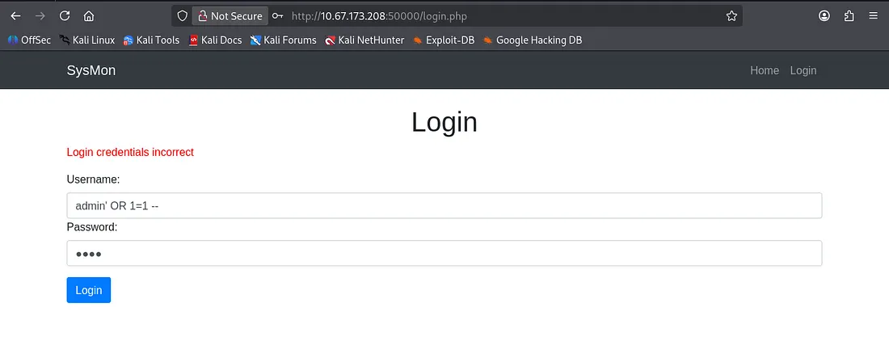

Seeing as there are no verbose errors, exposed info in the source code, and isn’t prone to injection, let’s head on over to the main login page on port 4000.

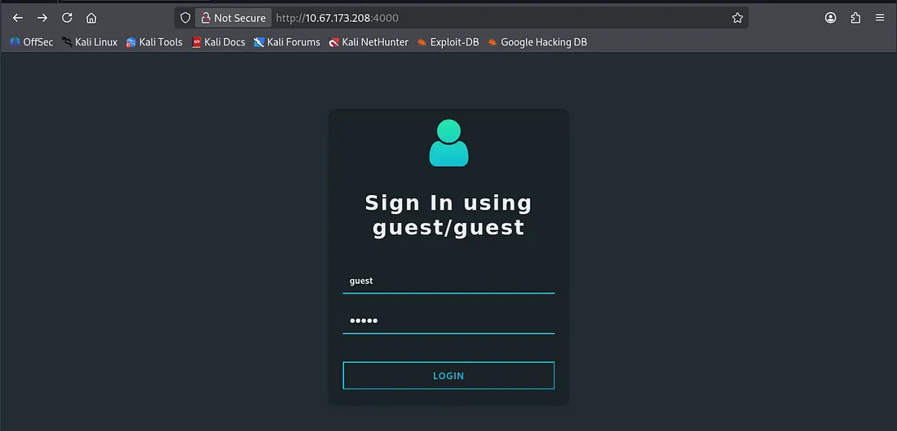

## Exploitation
We are allowed to sign in as a guest which is nice. After adding the two other users as friends and checking all profiles, I find that under Friend Details looks like JSON formatting. However, we also have a function that displays a recommendation to the details.


At first I went about abusing the obvious IDOR vulnerability and trying to find something like an admin page, but that yielded no results.

Judging from these values and information, the page takes these JSON and passes them as input for the webpage. Note the `isAdmin` value under the details section, this will be our key to escalating privileges as guest.

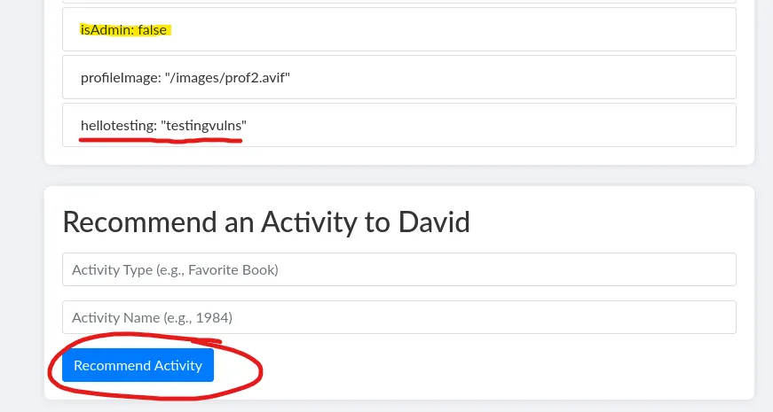

A quick test shows that the Activity type is our first value and Activity name is the second. Let’s override the `isAdmin` value to true and see if we get more functionality on the webpage.

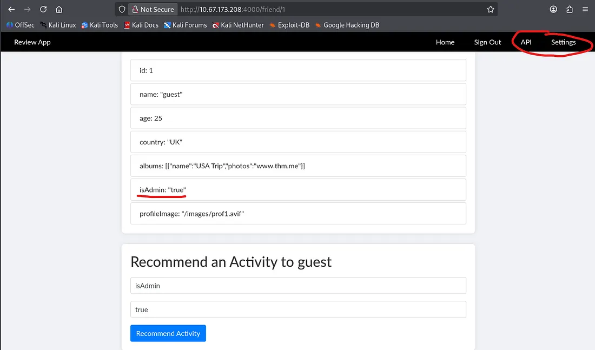

The API page exposes a couple internal APIs for both a secretKey which may be used for signing and another one that lists credentials for admin on the current page as well as the SysMon portal on port 50000.

This is great info, but without a way to execute it internally, we can’t really exploit it to grab those creds.

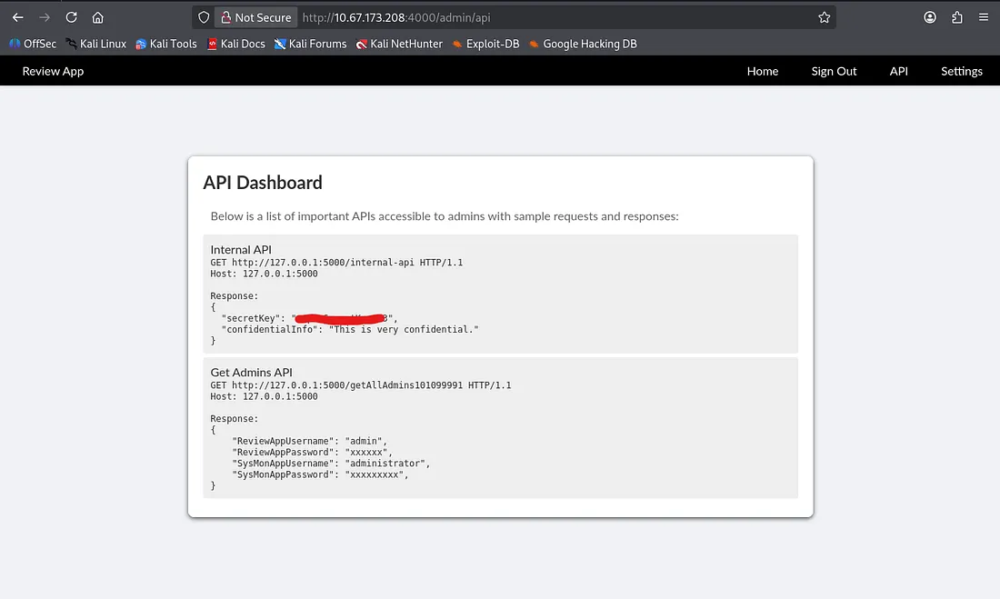

## Server Side Request Forgery
As luck has it, the settings page contains a URL update function which we can use to change the banner of the page. Smells like an SSRF vulnerability, let’s change the picture currently set to an internal API and read the admin credentials.

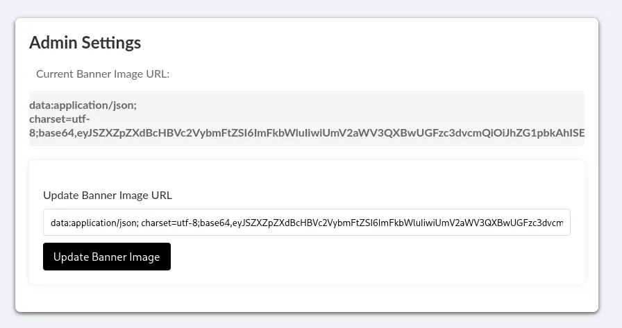

This returns a base64 encoded string; sending that over to CyberChef containing credentials in JSON format. With our newfound access, let’s login to the SysMon portal and see what we can do there.

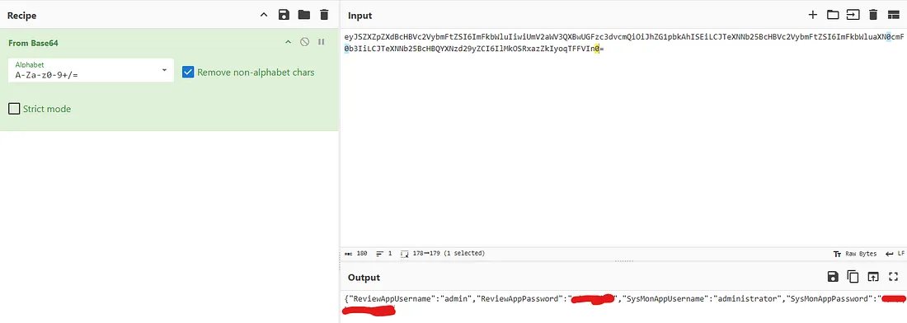

Here we find our first flag for the box as well as some standard system monitoring statistics.

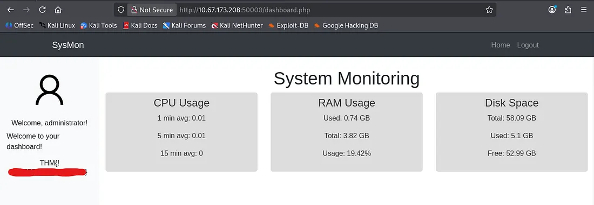

At this point I was a bit clueless as to going about grabbing a shell or arbitrary file reading. I messed around with the mailing protocols until realizing that was a dead end.

## Local File Inclusion
Then I checked the source code for the SysMon page and found that the img source for the profile picture contained an LFI vulnerability.

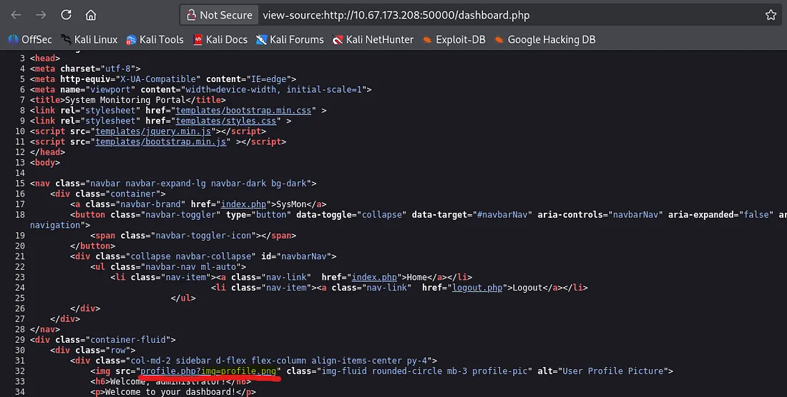

_Note: We must double up when executing directory traversal (towards / directory) as the site searches and replaces `../` with `""` . This technique allows us to bypass the page’s filter._


## Initial Foothold
I tried some other spots that could potentially be useful but found nothing. I ended up using Hydra to brute force SSH login for the two users found in /etc/passwd.

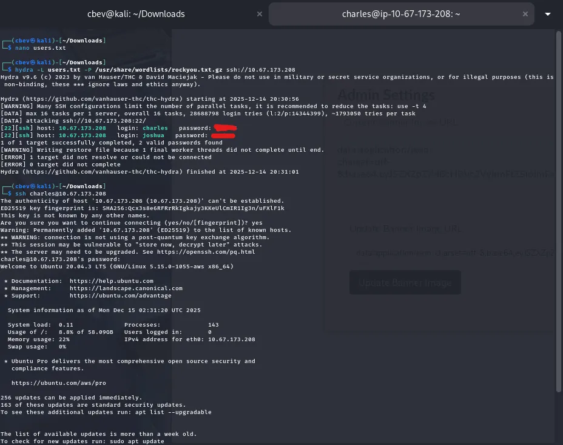

From here we can cd to /var/ww/html and find our second/final flag for the box in `505eb0fb8a9f32853b4d955e1f9123ea.txt` .

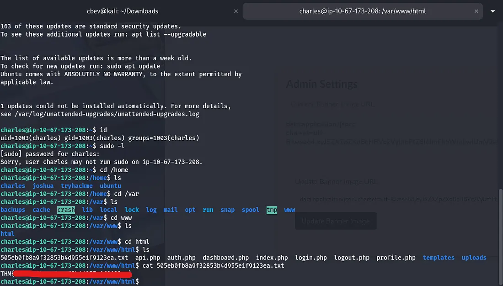

Another way to read this file instead of brute forcing SSH, would be include uploading a basic php webshell via SMTP. I think this gets stored somewhere in /var/log, and then our LFI vulnerability turns into command execution.

I also tried privilege escalation routes to root for fun but couldn’t find anything of use, so that’s where it ends. This box was a good challenge for me as web app pentesting isn’t my strong suit. I hope this was helpful to all following along and happy hacking!
