This box is rated hard difficulty on THM, it involves us exploiting WordPress to grab a low level shell on the system, port forwarding an internal Jenkins application, and leveraging RCE to leak root credentials.

_Penetration Testing Challenge_

## Scanning & Enumeration
This challenge is a simulation of a real black box penetration test. We are provided with only an IP and the client provided us with a scope list that allows the following:
- Ensure that you modify your hosts file to reflect internal.thm
- Any tools or techniques are permitted in this engagement
- Locate and note all vulnerabilities found
- Submit the flags discovered to the dashboard
- Only the IP address assigned to your machine is in scope
- 
Starting with an Nmap scan to find all services on our live host:

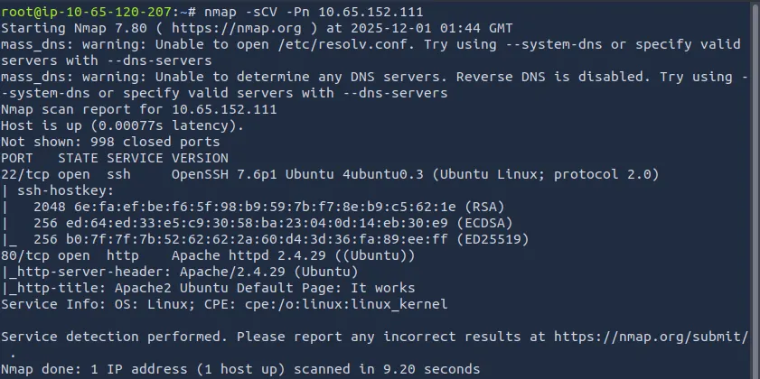

Looks like the only thing running is SSH on port 22 and a web server on port 80. Let’s take a look at the webpage first.

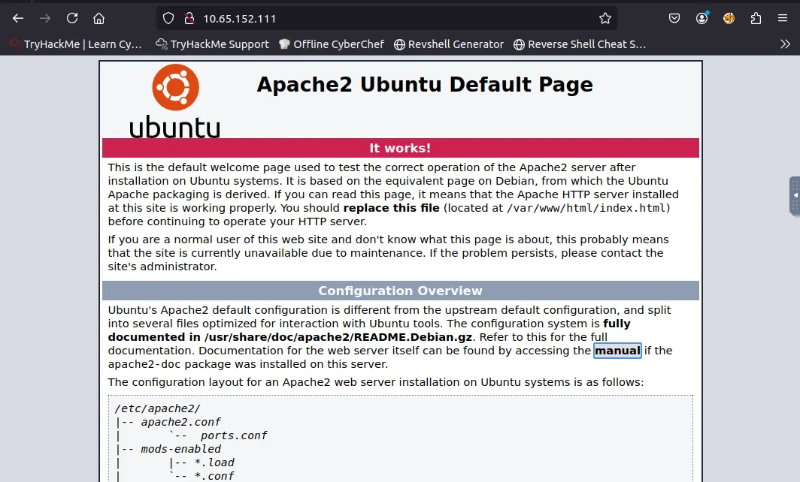

This is just the boilerplate page for an Apache web server, I’ll run a dirsearch to find any endpoints on the IP.

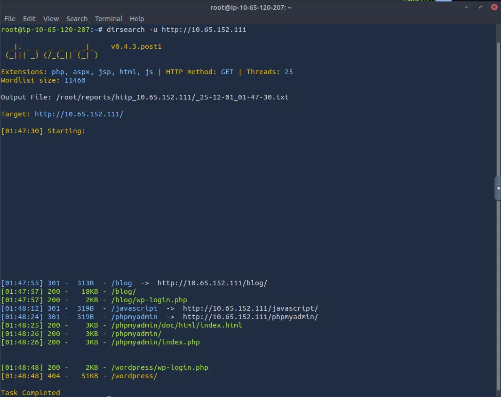

We get a few hits which tell us the web server is running wordpress, we can use wpscan to enumerate users and gather more information but I want to see the blog and phpmyadmin pages first.

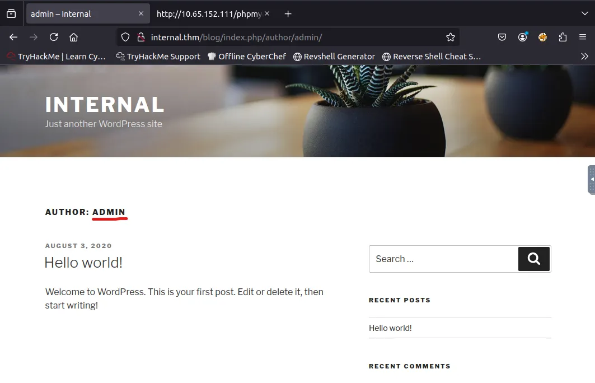

I find a user named ‘admin’ that posted on the blog page but nothing else of interest.

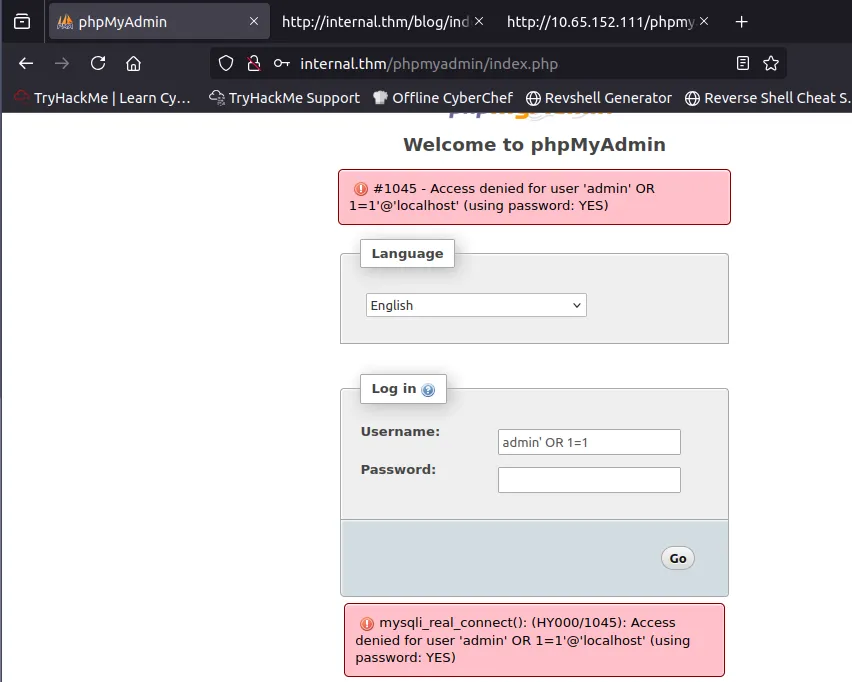

After finding the admin login page for the wordpress site, I tried out a few SQLi with the admin username but nothing seemed to work. I also tried using Hydra to brute force the phpmyadmin login panel, but didn’t have any luck.

## Brute Forcing
I ran wpscan to enumerate users and only found the Admin from earlier on the blog post. Let’s try a wpscan brute force on the /blog/wp-login.php endpoint.

```
wpscan --url http://TARGET_IP/blog -U admin -P /usr/share/wordlists/rockyou.txt
```

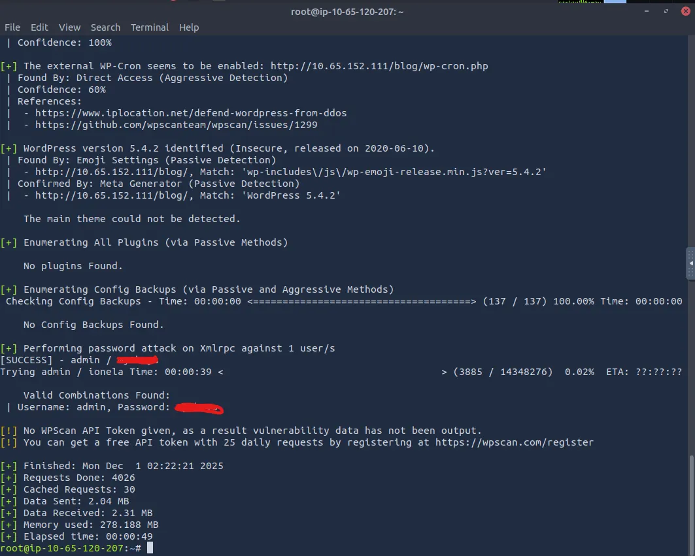

We successfully found the password for admin, now let’s login and try to upload a reverse shell through a common method.

## Initial Foothold
In case you didn’t know, once you’re logged into wp-admin, we can leverage the theme editor to update certain files. By replacing a template such as the 404 page (at 404.php) with a reverse shell, we grab a foothold on the system via www-data.

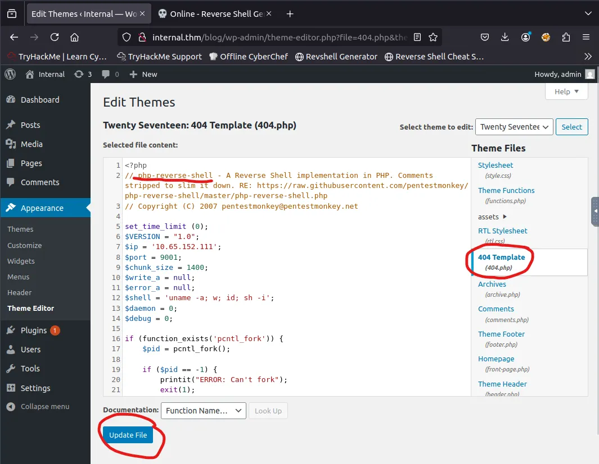

Make sure to update the file and setup a listener of your choice before navigating to a page that doesn’t exist to provoke a 404 error.

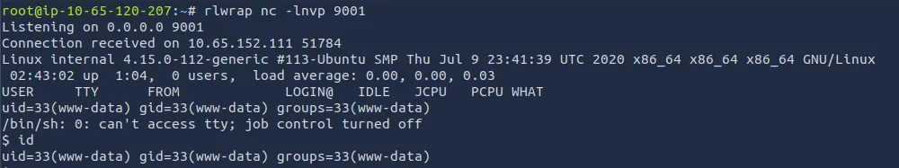

Whenever I catch a shell through a webpage, I have a look around the config files to see if I can find a password for something. We end up finding one for ‘wordpress’


Let’s also stabilize our shell:

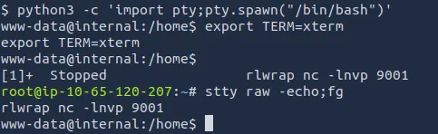

## Privilege Escalation
We can now login to mysql using the creds we found and look for other users info.

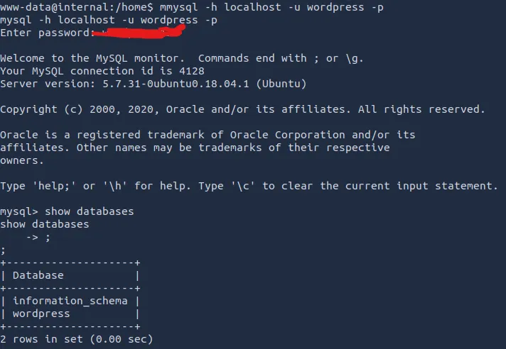

After some digging, we only find the hash for admin which we already used to login to the webpage earlier.

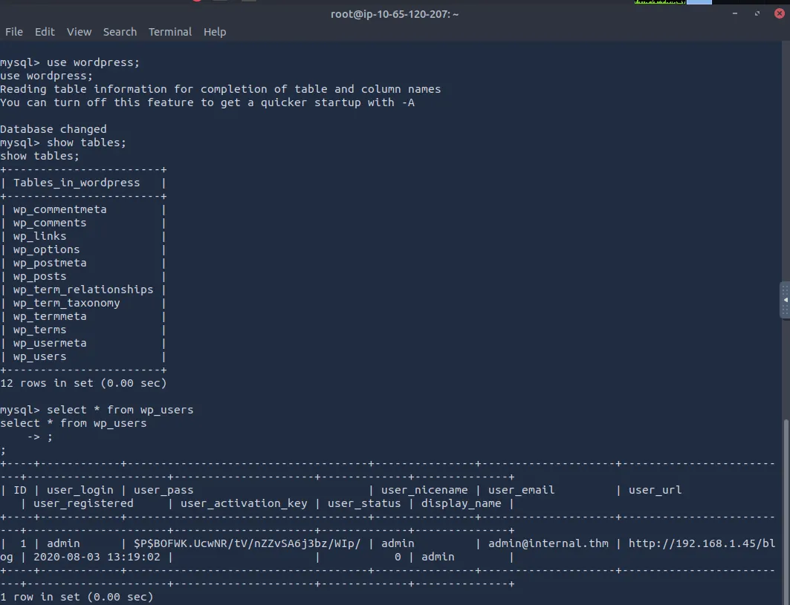

I bumbled around for a bit until ultimately deciding to transfer LinPEAS over from my terminal with an HTTP server.

I wouldn’t recommend getting used to this as it’s very noisy but the scope declared all tools were allowed and this will save us some time :)

*Make sure to add execute permissions and slap it in the /tmp directory.*

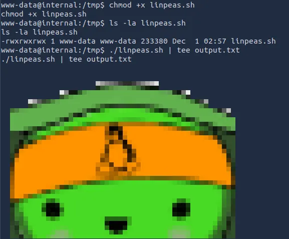

After running it, we find a strange file in the /opt directory which is usually empty. Here we find credentials for a user named aubreanna.

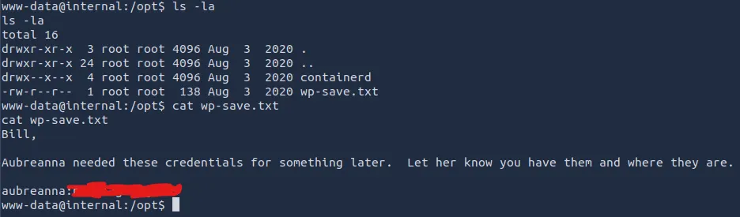

I’m not Bill but I’m happy this message received me well. Let’s SSH in using our new password and look for privilege escalation.

We also get our first flag on the box under her home directory!

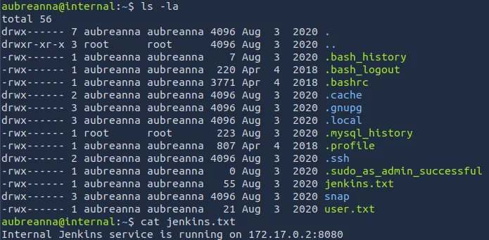

There’s a note left saying that a Internal Jenkins service is running on 172.17.0.2 on port 8080. Let’s check if we can reach this with our current machine.

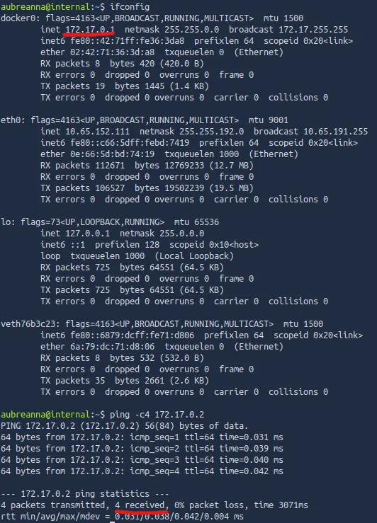

Looks like we can reach it from the compromised system. I also check from my attacking machine but that didn’t work. We’ll have to use the compromised machine to pivot through the network in order to reach the Internal Jenkins service.

_And then my attack box crashes…_

Taking good notes helps with disaster recovery like this. Anyways, I craft a reverse_tcp ELF to transfer to aubreanna’s account using msfvenom.

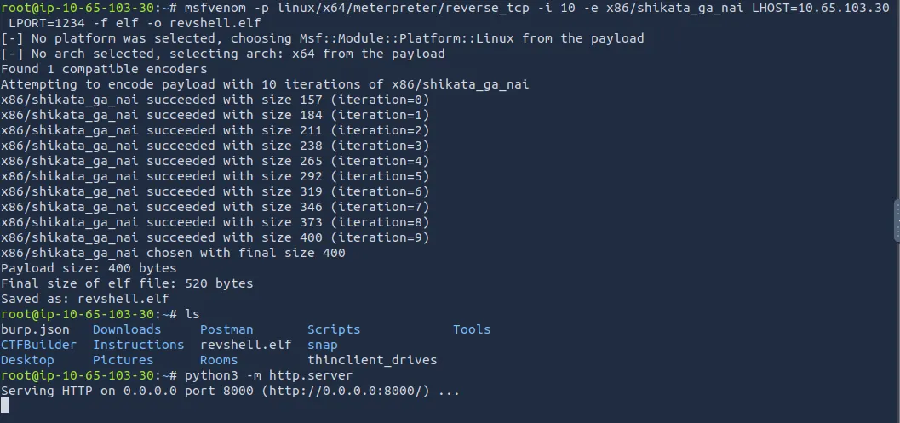

Once that’s where it needs to be, I setup a metasploit handler to catch the shell from aubreanna’s machine to the attacking machine.

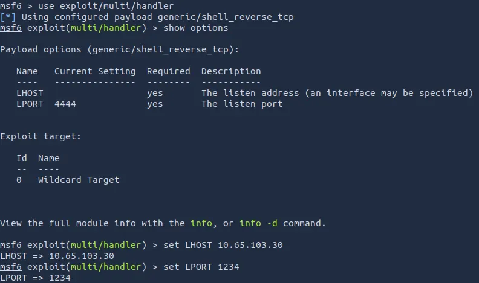

Also set the payload to linux/x64/meterpreter/reverse_tcp (this isn’t pictured above but is needed for a successful session).

Now that the shell is set up, we need to add a route to the Internal Jenkins service from aubreanna and run it.

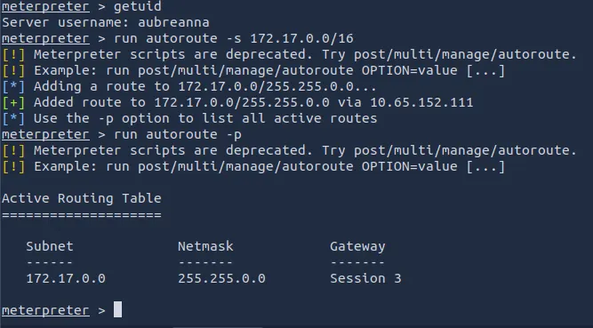

Finally, we port forward the Internal Jenkins service to our machine.

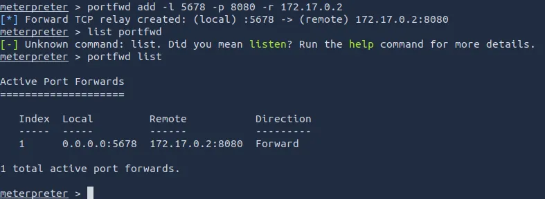

Et Viola, we can access it through a web browser by going to `http://localhost:5678`

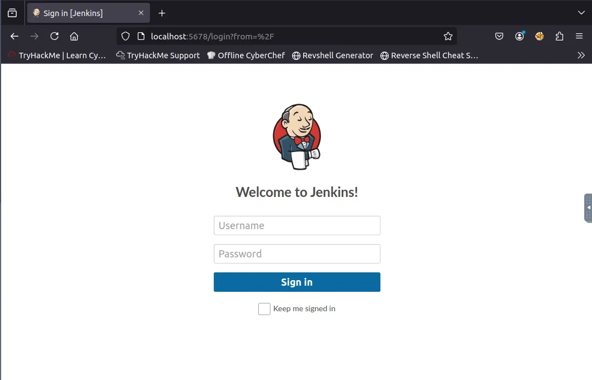

Let’s treat this like a new machine or box and enumerate any attack paths.

I run an Nmap scan and find ‘/’ is disallowed as well as fuzzing an endpoint named ‘/oops’ which only tells us an API version. I’ll have to brute force the page using Hydra.

_*Default credentials didn’t work here too*_

After my attack box crashing a second time and downloading an opnvpn conf file, I switch to Kali in hopes I can finish this box before anything else happens.

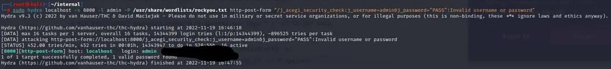

I was originally going to try to grab a root shell after logging into Jenkins, but seeing as I didn’t have any prior experience with it, I went searching around.

Again under the ‘/opt’ directory there was a note containing credentials, only this time it was for root.

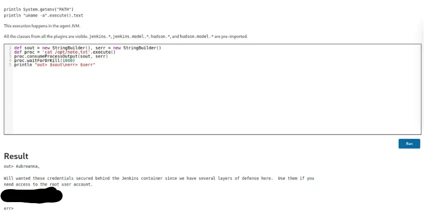

All that’s left is to SSH in using root creds and read the root.txt flag to complete the box.

Overall, this was a bit challenging as I wasn’t too confident port forwarding and my attack box kept crashing. Either way this box was very realistic and a great learning experience.

Hope this was helpful, Happy Hacking!
