This is an easy ranked box on THM, it involves enumerating Samba shares, exploiting a vulnerable version of ProFtpd, and privilege escalation through Path Variable manipulation.

_This is a walkthrough box so I will only be sharing the general steps I took to grab all flags and explain my methodology against this system._

## Scanning & Enumeration
Starting with an nmap scan against the given IP:

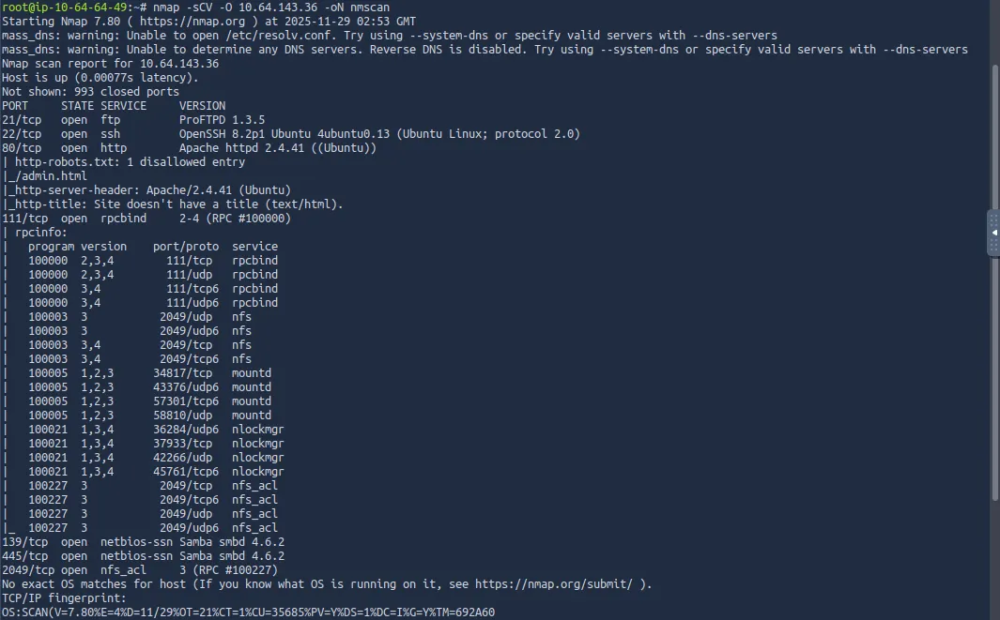

We see some services running on common ports
- FTP on port 21
- SSH on port 22
- Web server on port 80
- Samba on ports 139 & 445

Because I used the default scripts with my nmap scan, we can see that ftp doesn’t allow anonymous login, and there is a disallowed entry on the web server.

Before we checking out Samba shares, I had a look at the web page and fuzzed it for endpoints. Only thing I found was a gif saying it was a trap (rabbit hole).

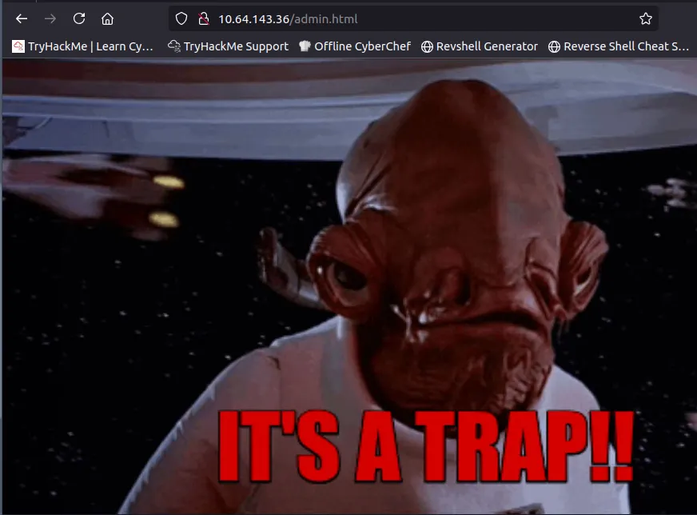

## Samba Shares
The room showcases how to use an Nmap script to enumerate users and shares on port 445, however I prefer NetExec as I'm already familiar with it.

Either way we find that there is a share named ‘anonymous’ that we can read.

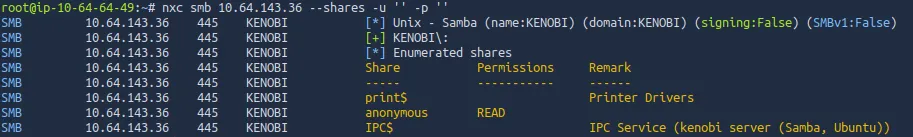

After logging in with no username and password, there is just one file. `log.txt` pretty much says that a user named Kenobi created an SSH key and some general info on the FTP server.

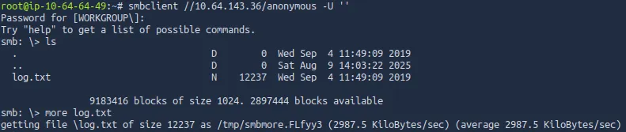

I use a showmount command to look for any mounts, this is because rpcbind is access to a NFS.

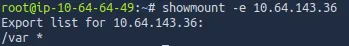

Connecting on port 21 with netcat shows that it’s running ProFTPD on version 1.3.5, let’s search for any known exploits on this.

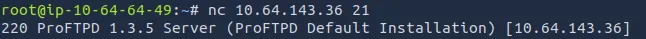

## Exploitation
Searchsploit tells us that we can use Metasploit to get Command Execution via the outdated versions’ SITE CPFR/CPTO `mod_copy` commands.

We can use this exploit to move Kenobi’s SSH key to the /var directory which is exposed to us.

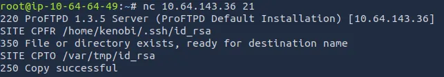

After moving the id_rsa key, I mount /var to a directory I named kenobi

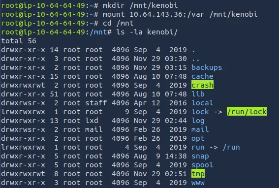

I move the key to make logging on easier and use it to grab our first flag under Kenobi’s home directory.

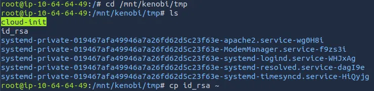

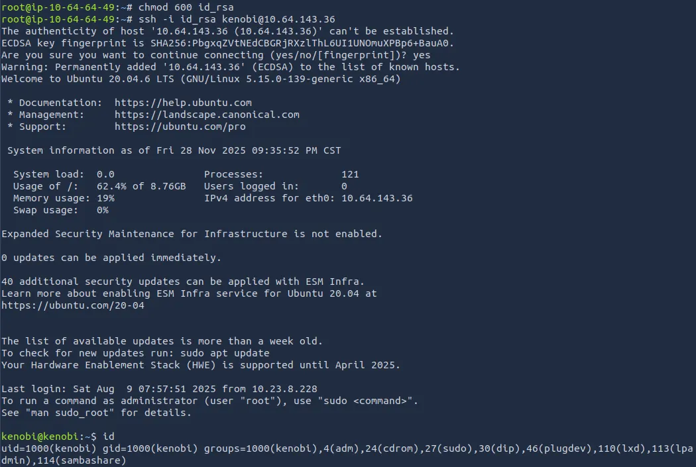

## Initial Foothold
Using common privilege escalation methods, I find a SUID bit set on a strange binary named ‘menu’.

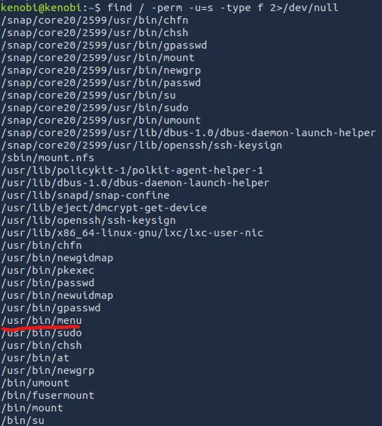

Using it prompts us with a choice between running a status check, grabbing the kernel version, and an ifconfig command.

## Privilege Escalation
With the strings utility, I find that the status check just runs a curl command on localhost.

This means that if we manipulate the PATH variable and make our own curl command, we’ll grab a root shell!

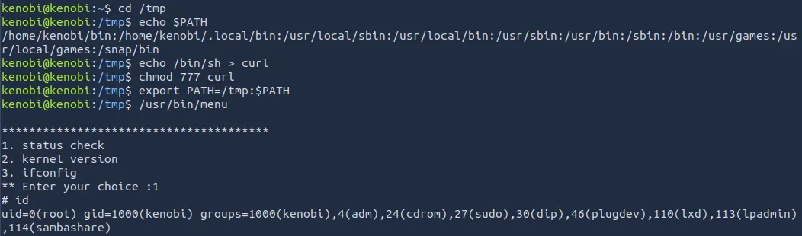

This privesc method works by setting the first option for our `$PATH` variable to be ‘/tmp’.

Since the SUID bit was set on that ‘menu’ binary, when we fabricate a fake curl command (which really just pops a shell), it runs as root and we elevate our privileges.

This was a relatively easy box, but it demonstrated how outdated services and available SMB shares can lead to disastrous events.

Hope this was helpful, Happy Hacking!
