One Piece is a medium difficulty room on TryHackMe that tests our enumeration, cryptography, and privilege escalation skills.

_A CTF room based on the wonderful manga One Piece. Can you become the Pirate King?_

## Scanning & Enumeration
First things first, let’s run an Nmap scan on the given IP:

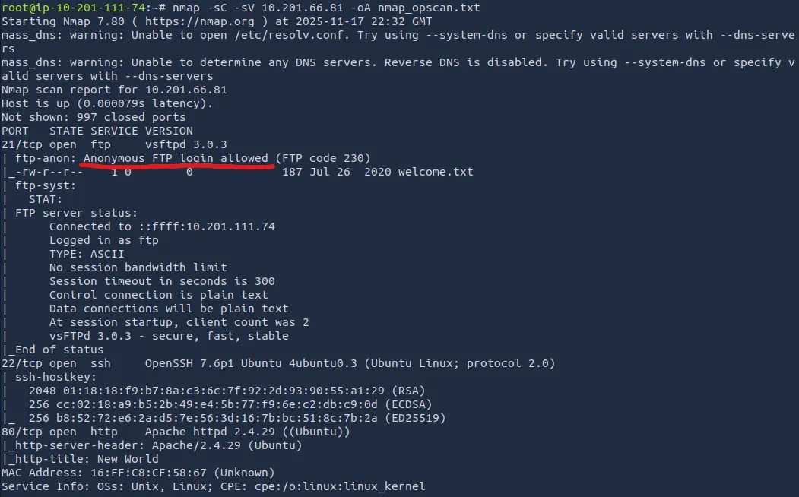

Right away, we see that anonymous login is allowed on FTP. I download the welcome.txt and also see that there is a hidden directory called ‘.the_whale_tree’.

Inside there are a couple hidden files called ‘.road_poneglyph.jpeg’ and ‘.secret_room.txt’

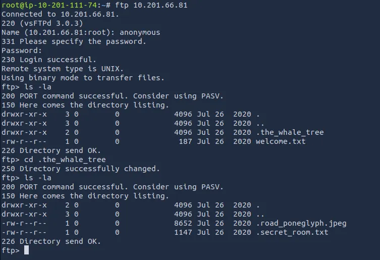

The welcome.txt file gives us some One Piece lore, but doesn’t help otherwise.

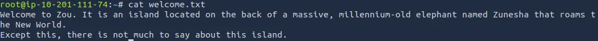

The .secret_room.txt file hints that we will collect four poneglyphs which we will combine to find the ‘one piece’ (probably root flag).

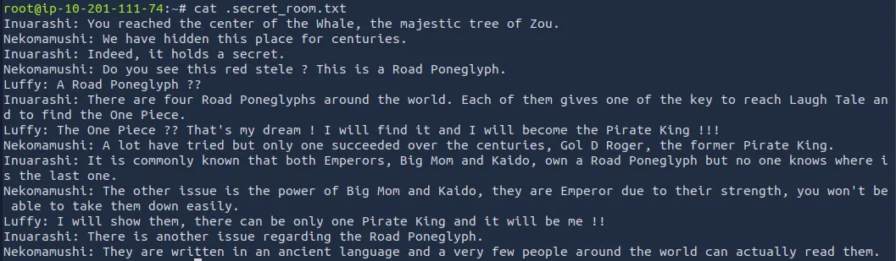

## Steganography & Decoding
I use a tool called steghide to extract data from the jpeg we downloaded and get a long encoded string. We’ll save this for later as it needs to be combined with the remaining three to be of any use.

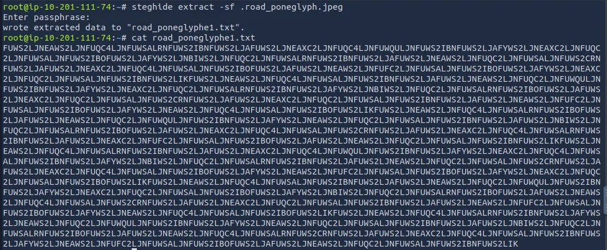

There’s nothing else for us on the FTP server and a low chance we get access to SSH without any credentials so let’s look at the web server now.

I run a gobuster directory search to find any hidden subdirectories that will steer us in the right direction:

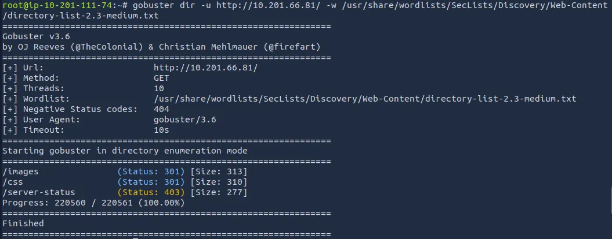

While that runs I view the website’s source code and find a commented base64 encoded string. Using CyberChef, it gives us a hint that Nami says there are 3472 possible places where she could have lost the log pose(directions to the next island).

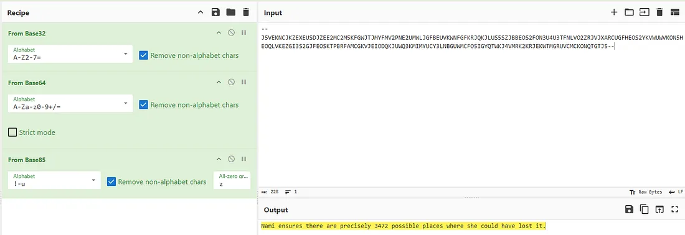

Not too sure what this means for us, could’ve just been a rabbit hole or a hint at subdirectory enum.

Diving into /css and /images, I find only one thing that sticks out. A path to /king_kong_gun.jpg under dressrosa_style.css.

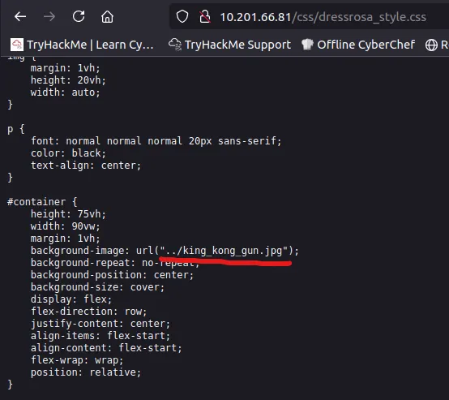

I download the file and use exiftool and steghide to try to grabbing data from it but to no avail. However, using the Strings binary utility gives us a another path to /ko.jpg.

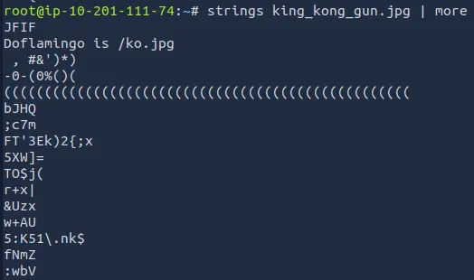

Repeating the same steps for this .jpg gives us the log pose for the next island.

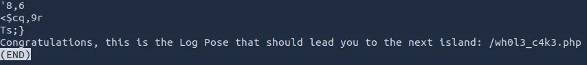

We are given a prompt to type something in order to appease Big Mom. There was a hint in the page source that Big Mom likes cakes, so I tried ‘Cakes’, ‘Wedding Cake’, and others but nothing worked.

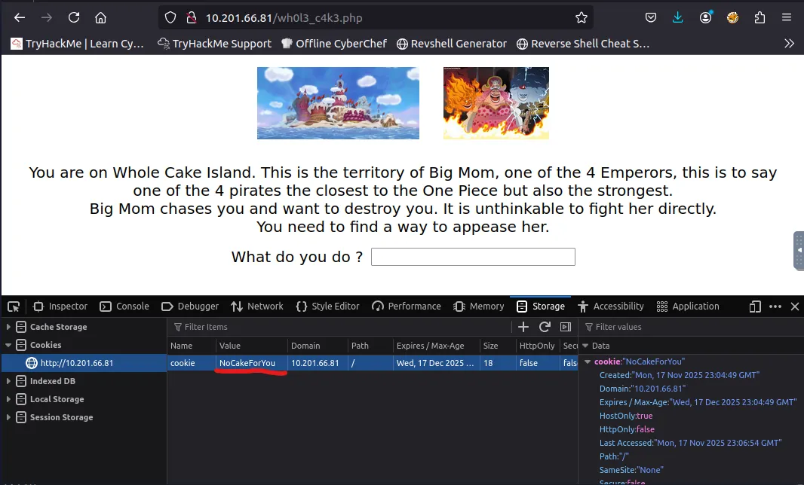

Turns out we just needed to change the cookie value to CakeForYou and refresh the page, this gives us the next island and our second poneglyph.

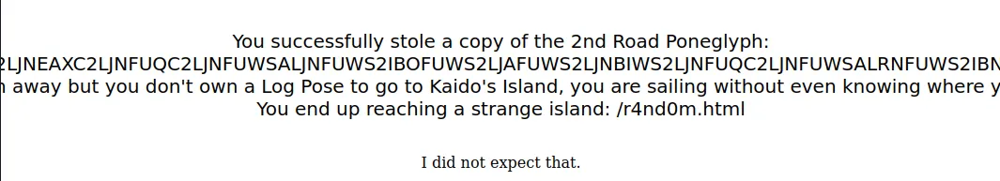

I save the string to a file called road_poneglyph2.txt and move onto the next island.

Here we are presented with two games: Brick Breaker or Brain Teaser.

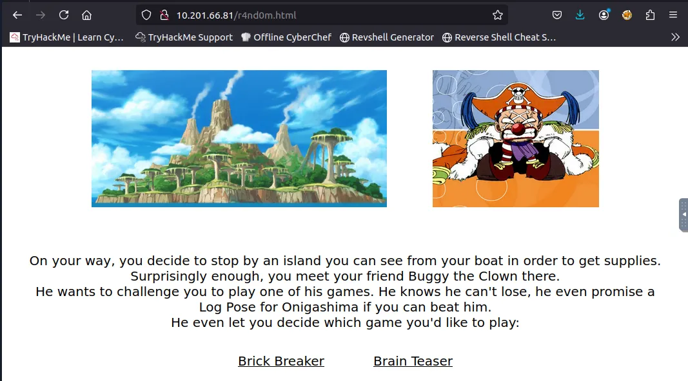

But I just looked through the page source for both and found a path to the next island without having to do all that. Sorry Buggy!

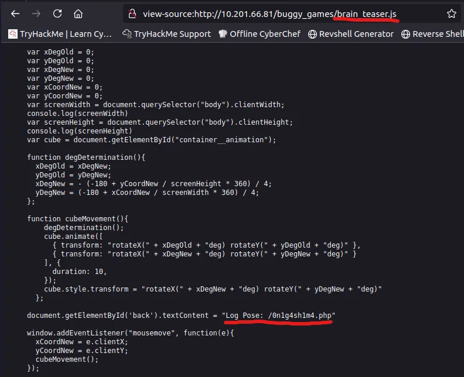

On this page we have a login form and a file upload section. Taking the line about brute force at face value, I decided not to use Hydra to crack the login form. Instead I downloaded the images from the page and tried to extract data that way.

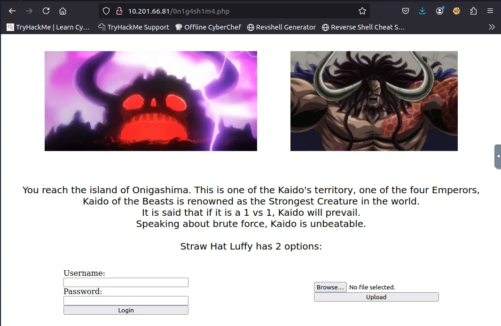

Truthfully I was stuck here for a while until I googled about a tool called stegseek (successor to stegcracker).

You can find it [here](https://github.com/RickdeJager/stegseek)

Using this tool to crack the Kaido.jpeg file, we get a username for the login form.

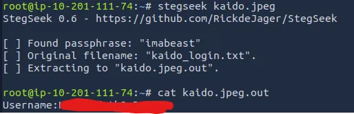

Now we can use Hydra to brute force the password:

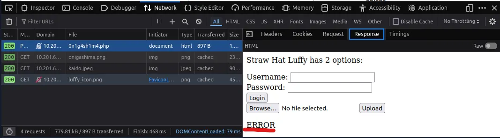

I successfully get a password for the login form and we’re onto the next island.

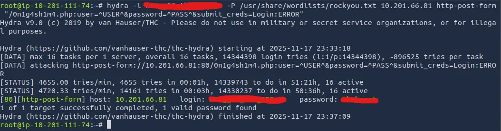

A successful login grants us the third poneglyph, but says that the next island is ‘unspecified’.

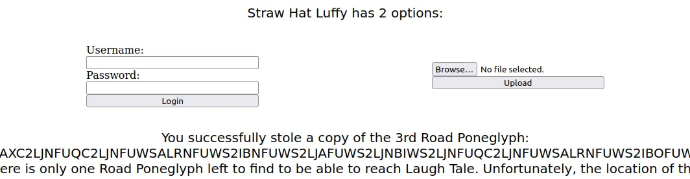

I try ‘/unspecified’ and find the next page with the contents of the final poneglyph:


After saving all of these poneglyph strings to files accordingly and then appending them in order, I take to CyberChef to decode it.

The correct recipe is: From Base32 -> Morse Code -> From Binary -> From Hex -> From Base58 -> From Base64

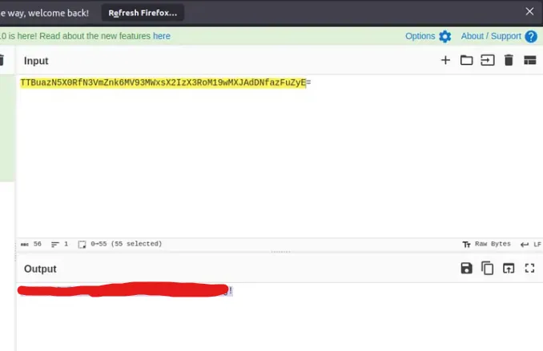

We get a pair SSH login credentials and after signing in, I see a file called laugh_tale.txt

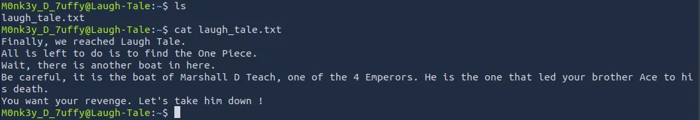

There is another user on the box named ‘Teach’, we’ll need to escalate privileges in order to read the file called ‘luffy_vs_teach.txt’ under his home directory.

To do so I start by seeing if Luffy has sudo permissions with the ‘sudo -l’ cmd but he isn’t allowed. Then I go about finding the files with SUID bit set to enabled, allowing us to access/execute the file with our current permissions.

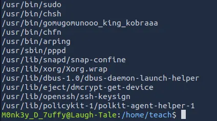

I see a strange binary called gomugomunooo_king_kobraaa, which is just Python renamed.

We can spawn a shell as 7uffy_vs_T3@ch using python:

```
/usr/bin/gomugomunooo_king_kobraaaa -c 'import os; os.execl("/bin/sh:, "sh", "-p")'
```

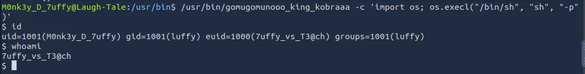

Now we can see what is in Teach’s home directory and try to gain root access.

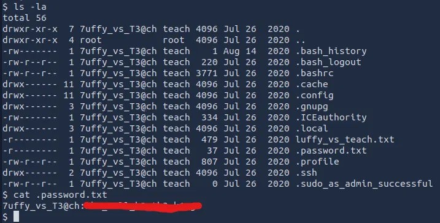

There is a hidden file with the password for ‘7uffy_vs_T3@ch’, so I SSH for a better shell and more capabilities. After signing in, we see that using sudo let’s us execute the less cmd.

I thought that one last command would reveal the root flag, but we get a disappointing response.

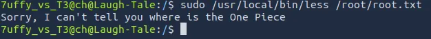

Using this command to list all files ending with .txt, I finally locate it under the /mysterious directory.

```
find / -type f -name *.txt 2>/dev/null
```

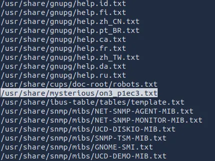

I tried using ‘sudo /usr/local/bin/less’ to view the contents but it just spat out the same thing as before. We need to get a root shell to bypass it.

Inspecting the ‘less’ file, I find that it isn’t readable, but we can write to it and execute it as root to get a shell.

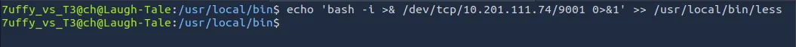

Now I setup a listener in another terminal and catch a root shell letting me view the one piece.

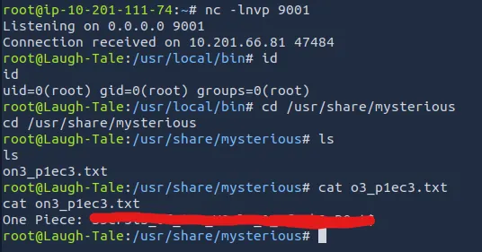

Overall, this was a very fun challenge. I highly recommend watching the show if you haven’t. Thanks to 1Frey for making this and happy hacking!
