This TryHackMe box is ranked as an easy-difficulty box that aims to test our Active Directory enumeration skills. We must compromise a domain controller by exploiting Kerberos authentication, looking through SMB shares, password spraying, and utilizing Pass-The-Hash techniques.

_Test your enumeration skills on this boot-to-root machine._

## Scanning & Enumeration
As always, we start with an Nmap scan on the target IP:

```
nmap -A 10.65.132.224 -oN nmapScan.txt
```

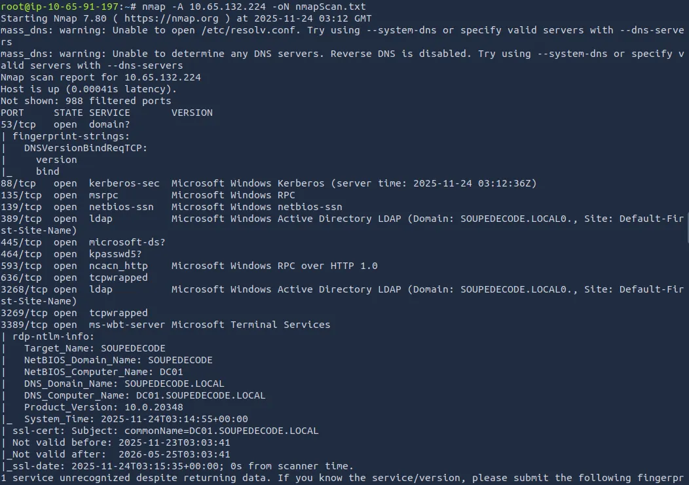

Right away we see there is no web application running, it’s a Domain Controller, and that the fully qualified domain name is `DC01.SOUPEDECODE.LOCAL`

This tells me that we probably need to try for a Guest account as we can’t go enumerating users from elsewhere.

First we need to update our /etc/hosts file:

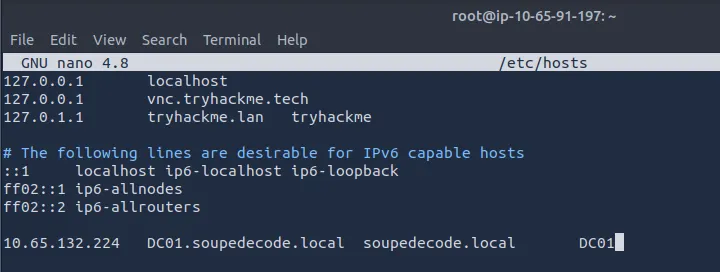

Then I use a lookupsid.py script to get usernames and used chatGPT to make a python script to cut down the sid strings to just usernames and output that to a new wordlist.

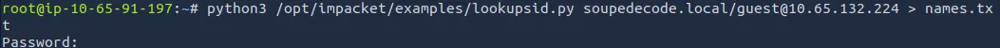

The python script to cut down the username is below:

```
#!/usr/bin/env python3

import re

INPUT_FILE = "names.txt"
OUTPUT_FILE = "fullUsernames.txt"

def extract_username(line):
    # Regex: capture the part after the last backslash until space or parenthesis
    match = re.search(r'\\([^ \)]+)', line)
    if match:
        return match.group(1)
    return None

def main():
    with open(INPUT_FILE, "r", encoding="utf-8") as f:
        lines = f.readlines()

    usernames = []

    for line in lines:
        user = extract_username(line)
        if user:
            usernames.append(user)

    with open(OUTPUT_FILE, "w", encoding="utf-8") as f:
        for user in usernames:
            f.write(user + "\n")

    print(f"[✔] Extracted {len(usernames)} usernames → {OUTPUT_FILE}")

if __name__ == "__main__":
    main()
```
If you use this, make sure to modify the input file to whatever you have it saved under. Also, the output file has two lines we need to delete at the top (not too bad for AI).

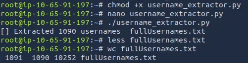

I’ll admit I tried using Kerbrute with rockyou.txt to see if I get a lucky hit, but that just wasn’t working.

I thought of how some default credentials like admin or root also have the username as their password, so I followed through with that:

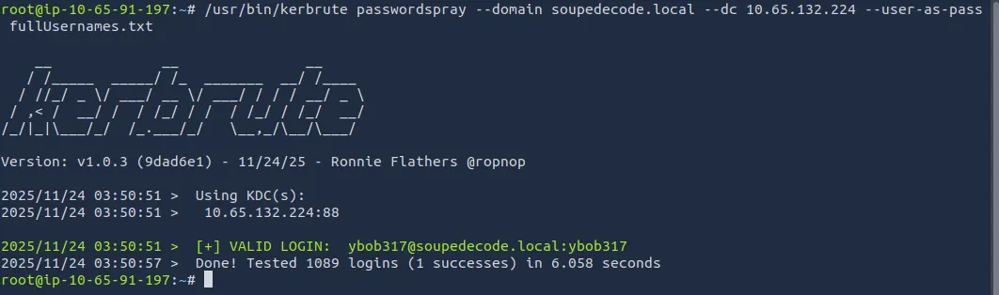

We get a successful login with the user and pass of `ybob317`

I ran enum4linux with our new credentials and find a ‘backup’ and ‘Users’ share. Logging in with Smbclient will tell us more.

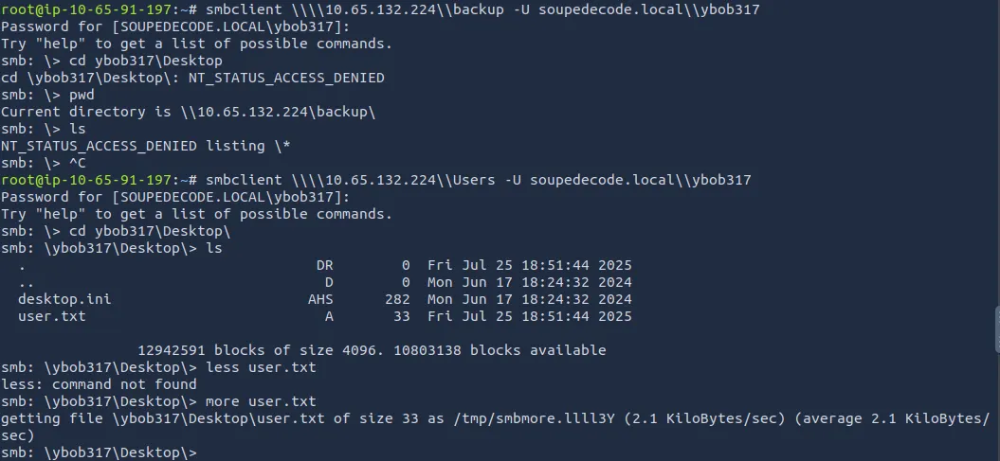

I found nothing on the backup share as I was getting denied, but the Users share had our first flag on ybob317’s desktop. I looked around for a bit more before deciding that was a sinkhole.

Next, I went Kerberoasting:

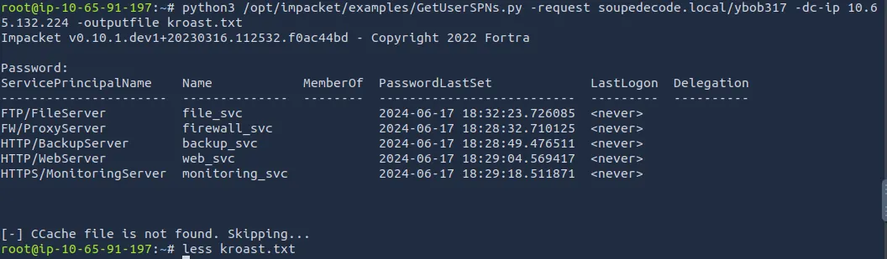

Using JTR to try cracking the hashes (since I'm on a VM), we grabbed a password but john didn’t show which account it was for.

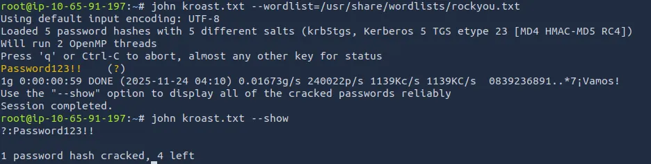

I just put all the svc names in a wordlist and sprayed with crackmapexec to find which one it was for.

We get a successful login with the file_svc account.

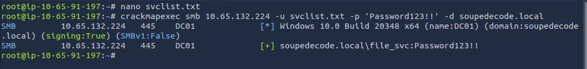

Back to enumerating SMB shares, I find a backup_extract.txt under file_svc which contains hashes for 10 servers.

After isolating the hashes and adding the extra server names to my svclist.txt file, I run CME again with the hashes and get a hit on ‘FileServer’.

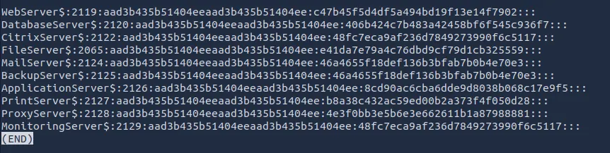

Here is the python script I used to chop the NTLM hashes down:

```
#!/usr/bin/env python3

INPUT_FILE = "hashList.txt"
OUTPUT_FILE = "cutHashes.txt"

def extract_hash(line):
    parts = line.strip().split(":")
    if len(parts) >= 4:
        return parts[3]  # NTLM hash
    return None

def main():
    hashes = []

    with open(INPUT_FILE, "r", encoding="utf-8") as f:
        for line in f:
            h = extract_hash(line)
            if h:
                hashes.append(h)

    with open(OUTPUT_FILE, "w", encoding="utf-8") as f:
        for h in hashes:
            f.write(h + "\n")

    print(f"[✔] Extracted {len(hashes)} hashes → {OUTPUT_FILE}")

if __name__ == "__main__":
    main()
```

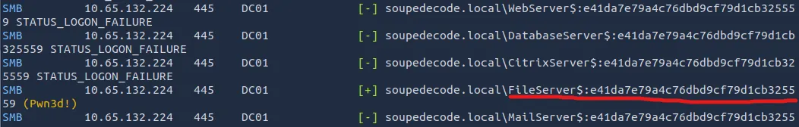

I had a peek around the shares drives as FileServer$ and found that this account had read access on the DC’s C: drive.

This meant I could just navigate to the Admin’s Desktop and read our final flag:

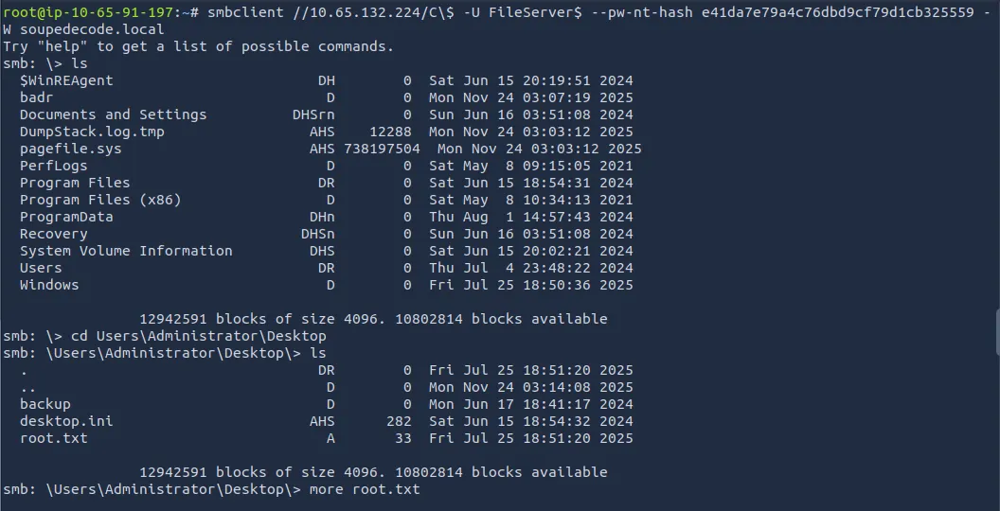

This was a fun yet challenging box for me as I don’t have much experience in AD environments. The end kind of felt like cheating as we could just read whatever, without having fully pwnd the box.

I looked at some other writeups and found you could dump the Administrator hash with secretsdump.py, use it to connect with wmiexec, and add yourself to the administrators localgroup and RDP from there.

Hopefully this was helpful or a good read, happy hacking!
