This is an easy-difficulty ranked box, it involves us uploading a reverse shell via FTP anonymous login and escalating privileges by snooping around files and processes.

_Abuse traditional vulnerabilities via untraditional means_

## Scanning & Enumeration
As always, we start with an Nmap scan to find all running services on the given IP:

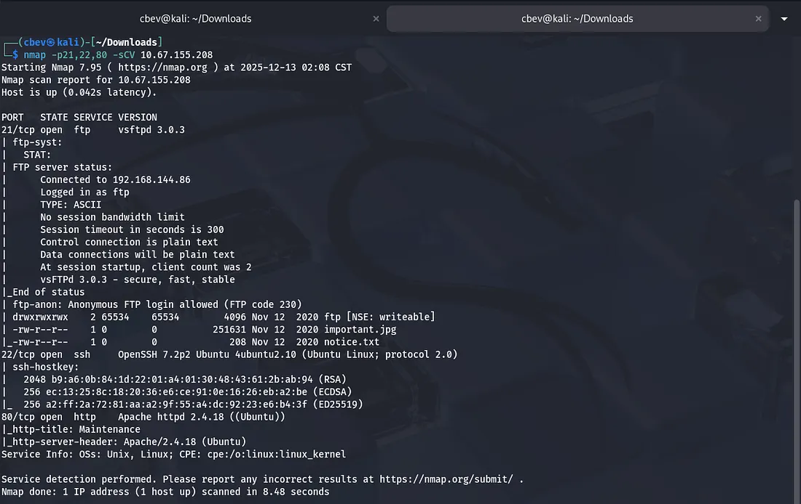

We find a few key things:
- FTP on port 21
- SSH on port 22
- Apache web server on port 80

Running default scripts on nmap shows that FTP anonymous login is allowed and a few files are available, let’s check ‘em out.

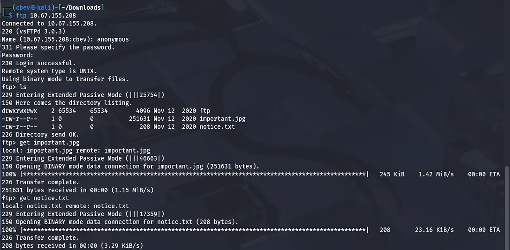

The notice.txt just exclaims that someone isn’t happy about among us memes being left in the FTP share, but also calls out a user named Maya for a potential suspect (she could be a target later).

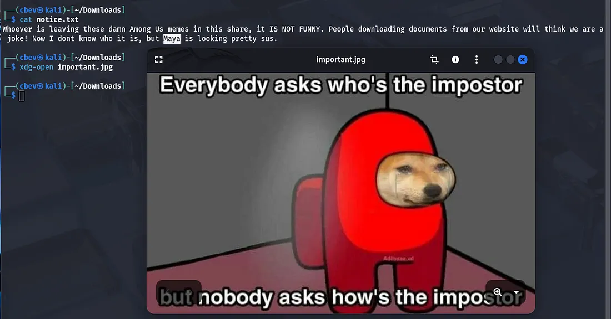

I tried the usual ways of inspecting images (I.e. Strings, exiftool, steghide) but found nothing crazy. The only thing of note was that the image was classified as a .png but was saved under .jpg.

I then had a look at the web server as SSH is almost always secure and we don’t have creds yet.

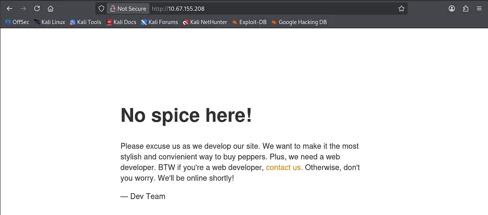

## Exploitation
I ran a gobuster dir search and then things started to click. The files endpoint is exposed on the web server, meaning that we are allowed to upload files to the server and have them execute on it via our browser.

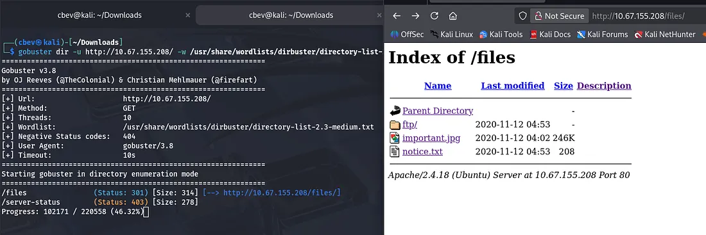

Let’s use FTP to put a reverse shell into the ftp/ folder and catch it! I use a tool called ftp-upload which you can get by running:

```
sudo apt-get install ftp-upload
```

We use the anonymous login to upload our file to the ftp directory on the server and confirm that it’s there.

_Note: I use [pentestmonkey’s](https://github.com/pentestmonkey/php-reverse-shell/blob/master/php-reverse-shell.php) PHP reverse shell in this case._

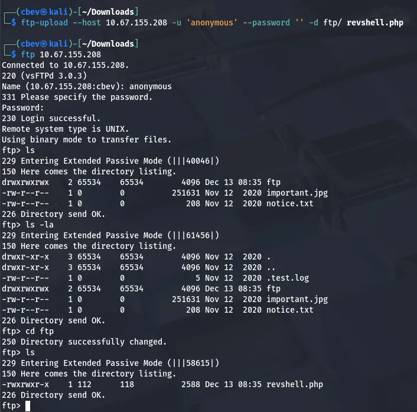

And there is our initial foothold on the system. Now let’s look around for some credentials so we can grab a more complete shell.

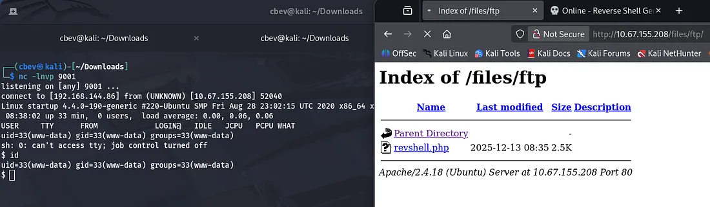

The secret to Spice Hut’s super spicy soup recipe lies in the / directory.

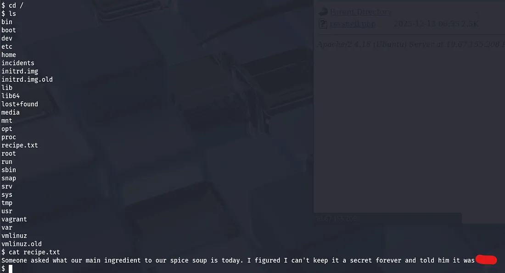

Looking under a directory named incidents shows a packet capture file showing a familiar scenario. Someone executes a reverse shell and has a look around, however they try to use sudo with a password that doesn’t work as www-data.

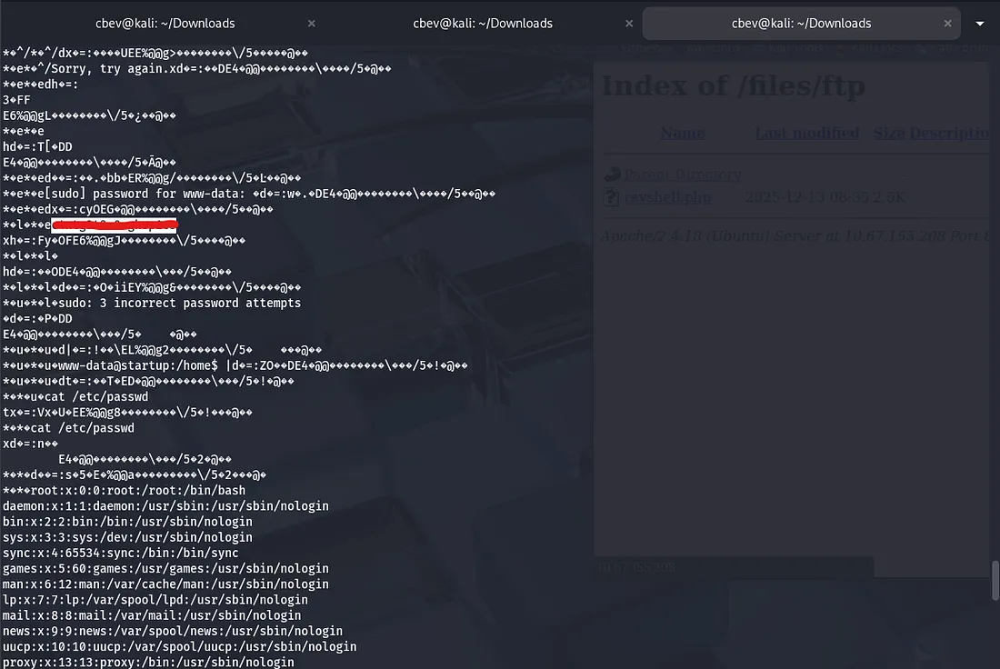

Curious as to why, I try to log in as the other user on the system lennie , and it’s a success.

## Privilege Escalation
I SSH in via lennie’s credentials and grab our user.txt flag in his home directory. It also seems that a file owned by root echoes a $list variable into a startup_list.txt file and prints it.

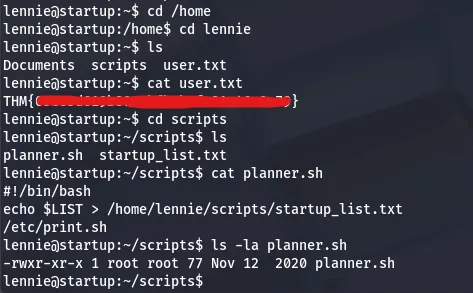

I checked all usual routes of root privesc and got stumped for a bit, so I used copied a tool named [pspy64](https://github.com/DominicBreuker/pspy) with SSH which snoops on processes running on the system.

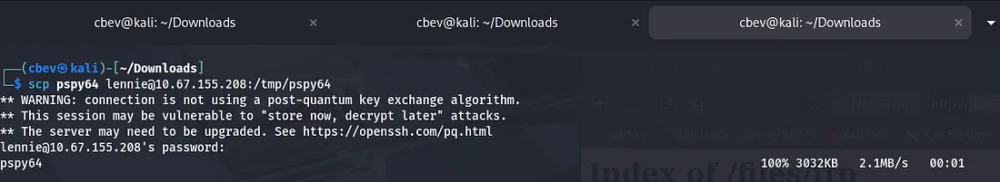

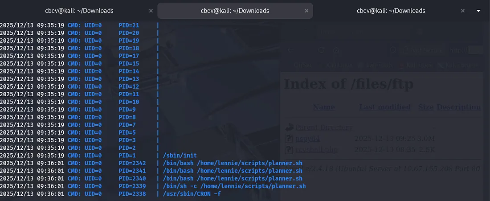

This ended up showing that the planner.sh script was being executed by root every minute. Since planner.sh executes is owned by root and executes a script that we can change (/etc/print.sh), we can catch a reverse shell via the auto-execute.

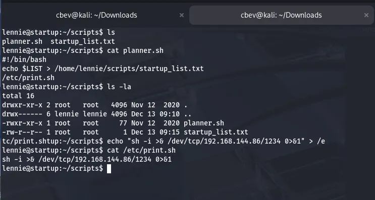

After setting up a listener in another terminal and waiting a moment, we grab a root shell on the system and can capture the root flag.


Overall, this was a fun and relatively easy challenge. I especially liked the privilege escalation portion as I rarely use tools like pspy. I hope this was helpful to all following along and happy hacking!
