Wonderland is a medium-difficulty ranked box on TryHackMe, it involves enumerating a webpage and good knowledge of linux privilege escalation to grab root access.

_Fall down the rabbit hole and enter wonderland._

## Scanning & Enumeration
Let’s kick it off with an Nmap scan on the given IP:

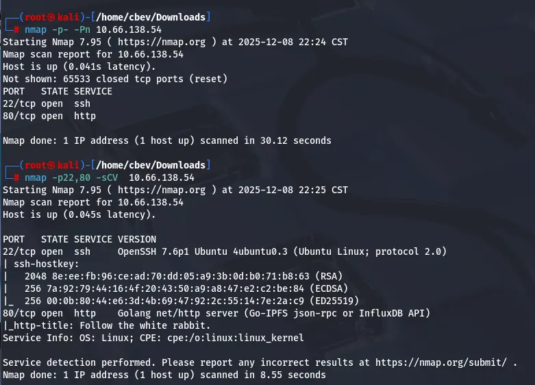

There’s only two services up and running on the system
- SSH on port 22
- A web server on port 80 written in Go

There aren’t any crazy exploits for OpenSSH 7.6p1 so let’s take a look around the webpage to find anything of use.

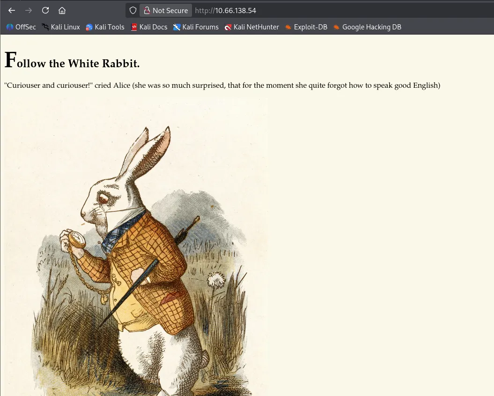

Not much here except a quote telling us to follow the rabbit. I run a directory search and find a few things of note. Of which is, an ‘/img’ directory with some standard photos for the site, a ‘/poem’ endpoint (pictured below), and something at ‘/r’.

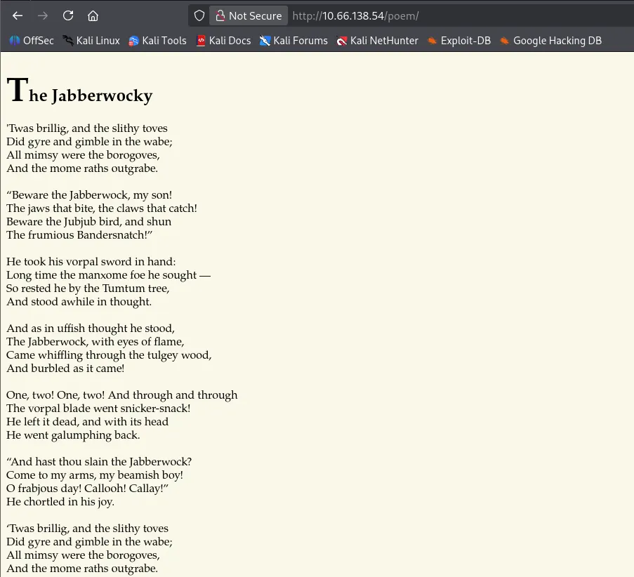

I’m not sure if this is a red herring or may be of use later, but we’ll keep a note of it. The ‘/r’ directory leads to a ‘/a’, which tells me it’s spelling out something letter by letter. I throw together a quick script to find endpoints that contain one letter after it and get to ‘/r/a/b/b/i/t’.

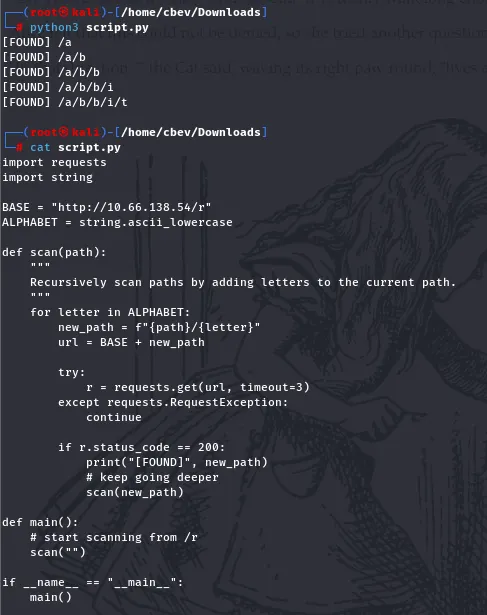

It seems like it’s just more lines to the story on the page, until we look at the page source. There’s a hidden line containing SSH credentials for ‘alice’.

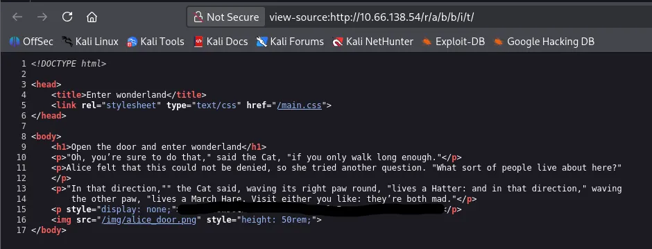

## Privilege Escalation
Safe to say we weren’t guessing that password! Now we can login and peek around the system, examining for ways to escalate privileges.

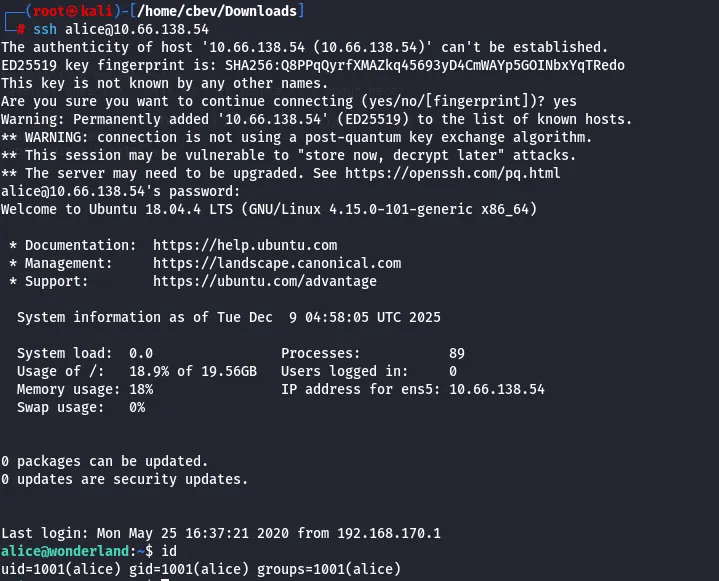

We only have access to alice’s home directory but are allowed to run sudo on ‘`walrus_and_the_carpenter.py`’. This script takes ten lines from the poem at random and outputs them to the terminal.

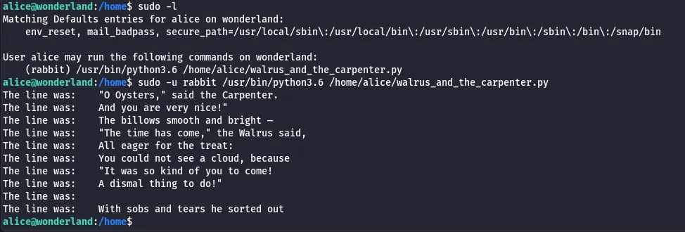

The file is unwritable so we can’t replace it with something malicious or create another script in its place.

_Note: “Everything is upside down here” is the hint, which is why the root.txt is in alice’s home directory and vice versa._

I run through the usual routes of PrivEsc, and I only find two capabilities set on Perl:

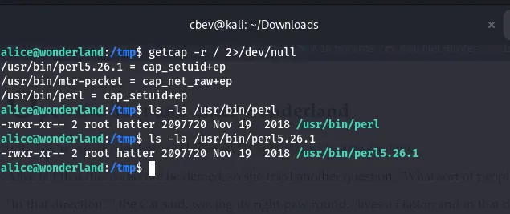

I’m neither root nor hatter so this is useless as of right now, we’ll revisit this later as [GTFOBins](https://gtfobins.github.io/) has a method for grabbing root shell via Perl.

When first trying to escalate to hatter’s account, I tried to leverage $PATH to create a new walrus_and_the_carpenter.py in /tmp and have that execute a reverse shell. However, this was overcomplicated and didn’t seem to work as I reread the original script and saw that the ‘random’ module was being imported.

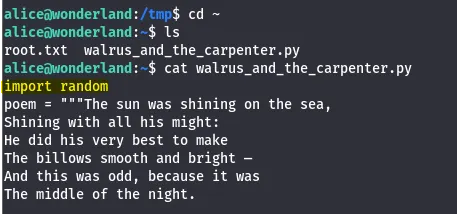

We could simply create a script called random.py in our working directory and have that execute a command as rabbit.

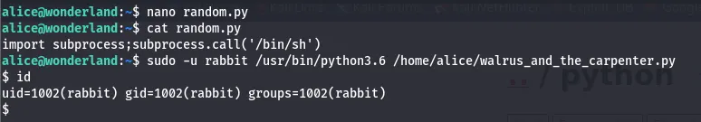

I went with spawning a simple shell. Looking in the rabbit’s home directory, I find an ELF that outputs this:

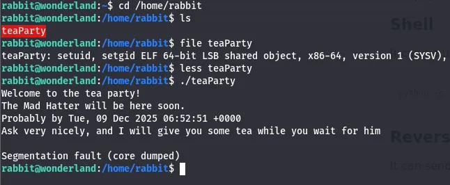

It looks like there’s a date command being ran judging by the format. Let’s use this to make a lateral movement to hatter. First, I set /tmp as the first part of `$PATH` and make a file in /tmp that spawns a shell.

When we run the teaParty ELF, it will spawn a shell as hatter.

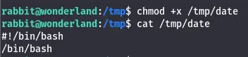

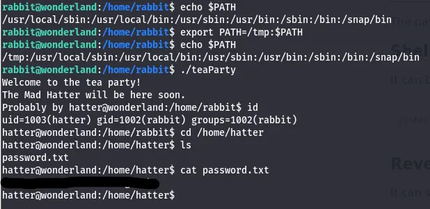

I find a password in hatter’s home directory and SSH with it for a better CLI. Now we can run the Perl script from earlier to escalate privileges to root and grab both flags.

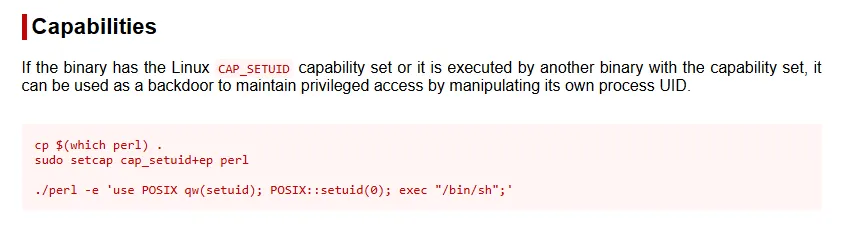

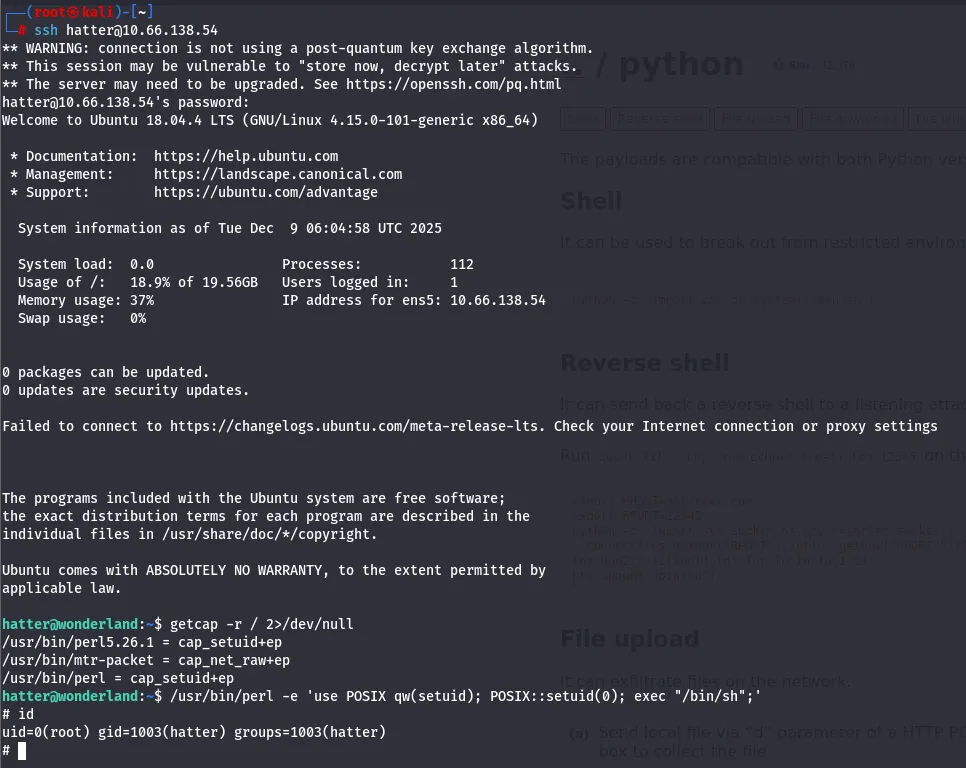

This was a very fun box, I enjoyed the heavy focus on privilege escalation and the theme was great. Hope this was helpful if you’re following along with me and happy hacking!
