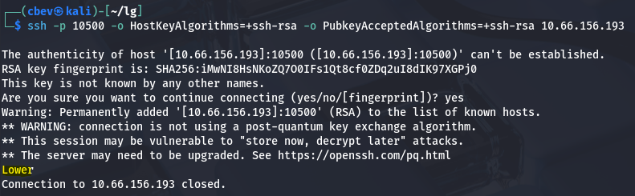
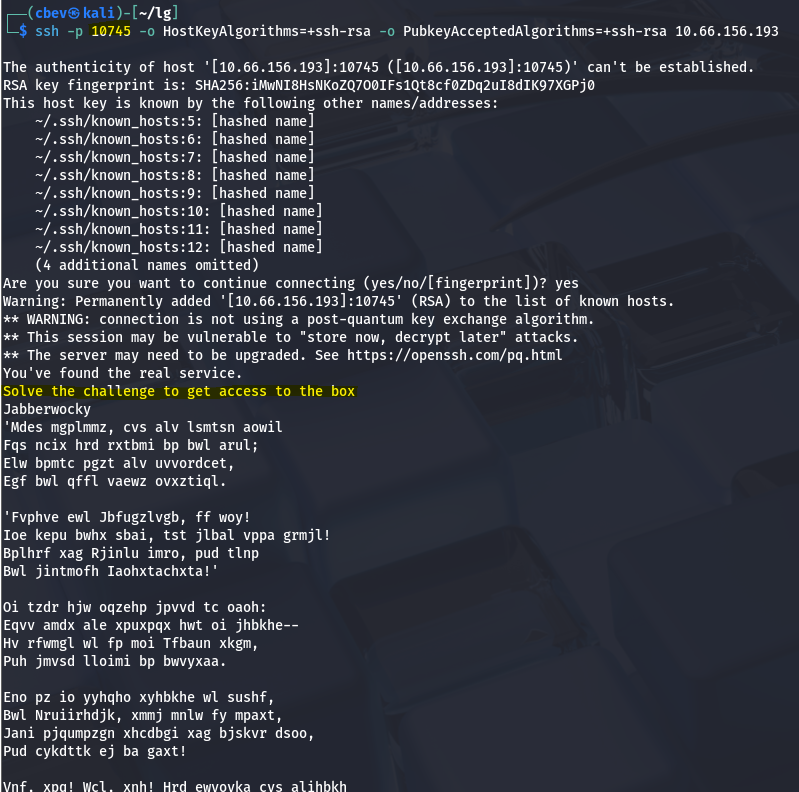
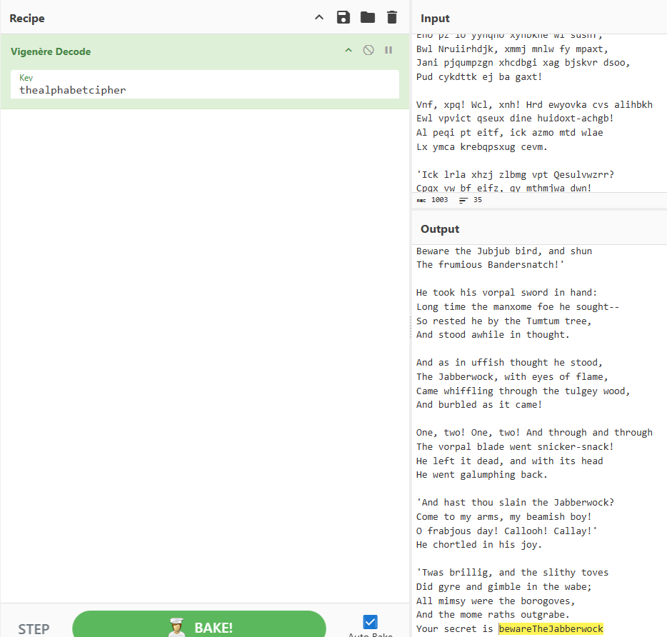
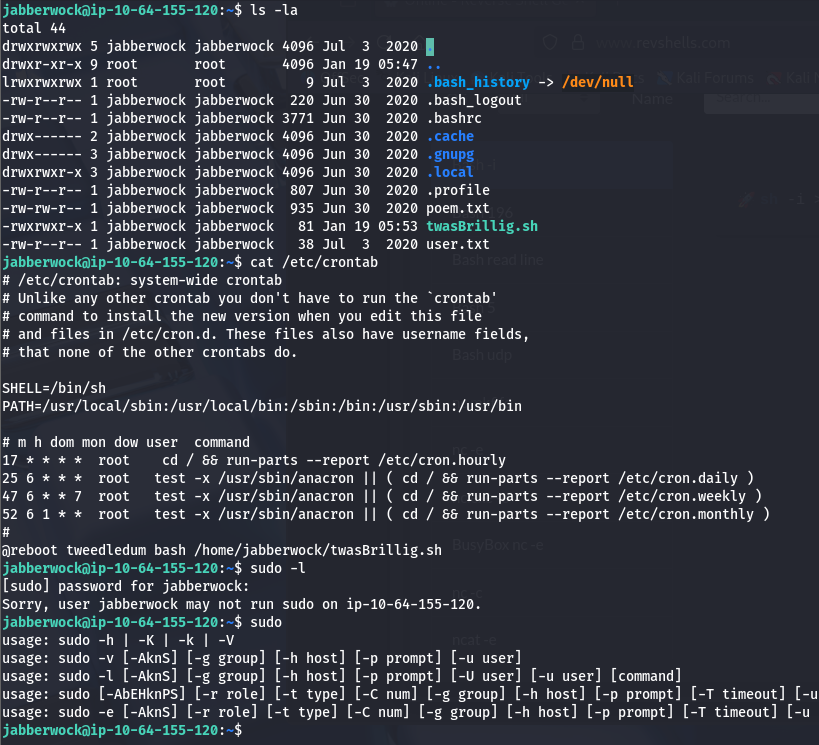
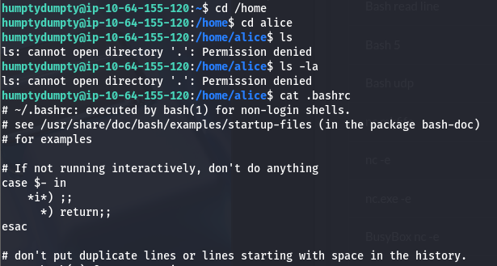

This box is rated medium difficulty on THM. It involves us finding the correct SSH port with a binary search, solving a Vigenère cipher to get credentials for a low priv user, and utilizing a slew of privilege escalation techniques to pivot between users.

_Step through the looking glass. A sequel to the Wonderland challenge room._

## Scanning & Enumeration
First things first, I start with an Nmap scan on the given IP to find any running services.

```
$ sudo nmap -p- -Pn 10.66.158.132
                                                             
Starting Nmap 7.95 ( https://nmap.org ) at 2026-01-18 22:12 CST
Nmap scan report for 10.66.158.132
Host is up (0.077s latency).
Not shown: 60534 closed tcp ports (reset)
PORT      STATE SERVICE
22/tcp    open  ssh
9000/tcp  open  cslistener
9001/tcp  open  tor-orport
9002/tcp  open  dynamid
9003/tcp  open  unknown
9004/tcp  open  unknown
9005/tcp  open  golem
9006/tcp  open  unknown
9007/tcp  open  ogs-client
9008/tcp  open  ogs-server
9009/tcp  open  pichat
9010/tcp  open  sdr
9011/tcp  open  d-star
9012/tcp  open  unknown
9013/tcp  open  unknown
9014/tcp  open  unknown
9015/tcp  open  unknown
9016/tcp  open  unknown
9017/tcp  open  unknown
9018/tcp  open  unknown
9019/tcp  open  unknown
9020/tcp  open  tambora
9021/tcp  open  panagolin-ident
9022/tcp  open  paragent
9023/tcp  open  swa-1
9024/tcp  open  swa-2
9025/tcp  open  swa-3
9026/tcp  open  swa-4
9027/tcp  open  unknown
9028/tcp  open  unknown
9029/tcp  open  unknown
```

Yikes, there are almost 5000 ports open, the only 'real' one was SSH on port 22. I proceed with another scan using a handful of the unknown services and find that ports 9000–13999 are all running Dropbear sshd. 

```
$ sudo nmap -p22,9000-9030 -sC -sV 10.66.158.132
             
Starting Nmap 7.95 ( https://nmap.org ) at 2026-01-18 22:20 CST
Nmap scan report for 10.66.158.132
Host is up (0.045s latency).

PORT     STATE SERVICE VERSION
22/tcp   open  ssh     OpenSSH 8.2p1 Ubuntu 4ubuntu0.13 (Ubuntu Linux; protocol 2.0)
| ssh-hostkey: 
|   3072 15:d3:8f:34:3a:c3:ae:64:8e:6b:a9:85:f9:5c:a2:ef (RSA)
|   256 f5:86:ad:c9:23:cc:d4:a6:3e:4b:1d:cc:42:c9:2c:7e (ECDSA)
|_  256 ad:ac:df:f1:a7:2f:3a:7a:9c:39:ed:07:25:b3:a7:ba (ED25519)
9000/tcp open  ssh     Dropbear sshd (protocol 2.0)
| ssh-hostkey: 
|_  2048 ff:f4:db:79:a9:bc:b8:8a:d4:3f:56:c2:cf:cb:7d:11 (RSA)
9001/tcp open  ssh     Dropbear sshd (protocol 2.0)
| ssh-hostkey: 
|_  2048 ff:f4:db:79:a9:bc:b8:8a:d4:3f:56:c2:cf:cb:7d:11 (RSA)
9002/tcp open  ssh     Dropbear sshd (protocol 2.0)
| ssh-hostkey: 
|_  2048 ff:f4:db:79:a9:bc:b8:8a:d4:3f:56:c2:cf:cb:7d:11 (RSA)
9003/tcp open  ssh     Dropbear sshd (protocol 2.0)
| ssh-hostkey: 
|_  2048 ff:f4:db:79:a9:bc:b8:8a:d4:3f:56:c2:cf:cb:7d:11 (RSA)
9004/tcp open  ssh     Dropbear sshd (protocol 2.0)
| ssh-hostkey: 
|_  2048 ff:f4:db:79:a9:bc:b8:8a:d4:3f:56:c2:cf:cb:7d:11 (RSA)
9005/tcp open  ssh     Dropbear sshd (protocol 2.0)
| ssh-hostkey: 
|_  2048 ff:f4:db:79:a9:bc:b8:8a:d4:3f:56:c2:cf:cb:7d:11 (RSA)
9006/tcp open  ssh     Dropbear sshd (protocol 2.0)
| ssh-hostkey: 
|_  2048 ff:f4:db:79:a9:bc:b8:8a:d4:3f:56:c2:cf:cb:7d:11 (RSA)
9007/tcp open  ssh     Dropbear sshd (protocol 2.0)
| ssh-hostkey: 
|_  2048 ff:f4:db:79:a9:bc:b8:8a:d4:3f:56:c2:cf:cb:7d:11 (RSA)
9008/tcp open  ssh     Dropbear sshd (protocol 2.0)
| ssh-hostkey: 
|_  2048 ff:f4:db:79:a9:bc:b8:8a:d4:3f:56:c2:cf:cb:7d:11 (RSA)
9009/tcp open  ssh     Dropbear sshd (protocol 2.0)
| ssh-hostkey: 
|_  2048 ff:f4:db:79:a9:bc:b8:8a:d4:3f:56:c2:cf:cb:7d:11 (RSA)
9010/tcp open  ssh     Dropbear sshd (protocol 2.0)
| ssh-hostkey: 
|_  2048 ff:f4:db:79:a9:bc:b8:8a:d4:3f:56:c2:cf:cb:7d:11 (RSA)
9011/tcp open  ssh     Dropbear sshd (protocol 2.0)
| ssh-hostkey: 
|_  2048 ff:f4:db:79:a9:bc:b8:8a:d4:3f:56:c2:cf:cb:7d:11 (RSA)
9012/tcp open  ssh     Dropbear sshd (protocol 2.0)
| ssh-hostkey: 
|_  2048 ff:f4:db:79:a9:bc:b8:8a:d4:3f:56:c2:cf:cb:7d:11 (RSA)
9013/tcp open  ssh     Dropbear sshd (protocol 2.0)
| ssh-hostkey: 
|_  2048 ff:f4:db:79:a9:bc:b8:8a:d4:3f:56:c2:cf:cb:7d:11 (RSA)
9014/tcp open  ssh     Dropbear sshd (protocol 2.0)
| ssh-hostkey: 
|_  2048 ff:f4:db:79:a9:bc:b8:8a:d4:3f:56:c2:cf:cb:7d:11 (RSA)

Service detection performed. Please report any incorrect results at https://nmap.org/submit/ .
Nmap done: 1 IP address (1 host up) scanned in 65.22 seconds
```

Connecting to each port displays a message hinting where the correct service is at. The quickest way to go about finding the right one would be a binary search from 9000–13999.

_Note: I also had to add `-o HostKeyAlgorithms=+ssh-rsa -o PubkeyAcceptedAlgorithms=+ssh-rsa` to my SSH commands in order for my machine to recognize the matching host key type._

If you didn't know, a binary search repeatedly halves the dataset while getting rid of the half that's incorrect. This is commonly used to sort data, be it by size, date, etc.

_Note: Nmap just takes a guess at what is running on the ports that have a default service on them, they aren't really running what it says._

I'm sure you could write a script to automate this based on what is returned by the connection but there aren't that many here, so I do it manually. This port also changes every time the box restarts, meaning it won't be the same for yours.



## Initial Foothold
Since we are in 'Wonderland', everything is upside down/backwards meaning that lower actually means higher. Eventually,  I find the correct port and am granted a logon.



Seems like we need to solve a challenge to presumably gain access on port 22. This ciphertext is an encoded form of the famous poem "Jabberwocky", I thought it was a Rot algorithm at first but since each letter is altered individually, it had to be a Vigenère cipher.

I tried doing this manually for fun and found the key was 'thealphabetcipher', and reading the end of the decoded text displays the secret string. There are automated tools out there such as [boxentriq](https://www.boxentriq.com/code-breaking/vigenere-cipher) or some AI applications that can help.



Entering this at the prompt gives us SSH creds for a user named Jabberwock. After signing in, we can grab our first flag under their home directory (making sure to reverse it).

## Privilege Escalation
I start looking for ways to pivot through other accounts before root. I find an active cronjob where tweedledum executes a script owned by us on reboot. We can echo a reverse shell into the twasBrillig.sh script and setup a listener before rebooting the system.

_Bug Found: I spent a while trying to find ways to reboot the box and bypass permission checks for this part until reading other writeups which shows that Jabberwock should have access to run 'sudo /sbin/reboot' on the box. However, I couldn't get this to work whatsoever even after restarting the machine twice._



I've reported this to the box creator, so if this happens to you as well skip this part for now and use humptydumpty's password to switch users:

The intended way is to grab a shell as tweedledum and then crack hashes in a text file called humptydumpty.txt. One of the lines is actually hex encoded and converting that to ASCII gives us the password for that account.

After switching users, we need to pivot one last time to Alice's account before gaining root access. Looking at general permissions shows that we only have executable rights over her home directory which is odd.

I was a bit stuck at this point until trying to her .bashrc file to check if we actually didn't have perms over it. For some reason, it blocks us from listing them but reading them directly works.



Using the find command to search for all readable files by us doesn't work either. That's pretty strange! I use this to grab the id_rsa from her .ssh dir and login via SSH using it.


Logging into alice's account doesn't give us a whole lot to go off of, so I upload LinPEAS to the machine and find a few vulnerabilities with PoCs that didn't pan out.

Once again the intended way was to check the /etc/suoders.d/ directory and see that Alice actually has permissions to run /bin/bash on the box by specifying a hostname of ssalg-gnikool which grants a root shell.

I'm not sure if this is specific to my machine or if the box itself is broken but that's a bummer. I hope this was still helpful to anyone stuck like I was or gave you clarity if this bug happened to you as well and happy hacking!
