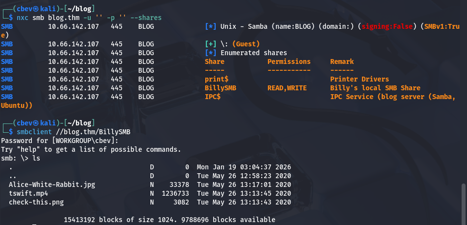
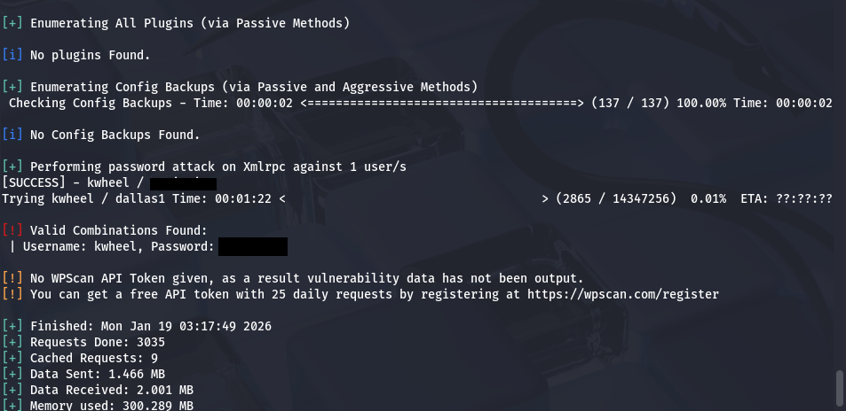
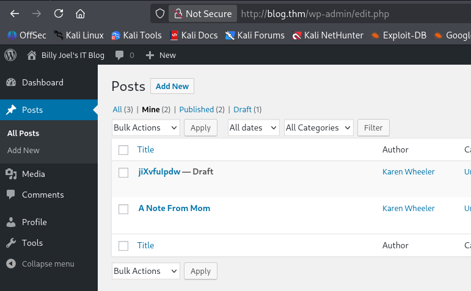
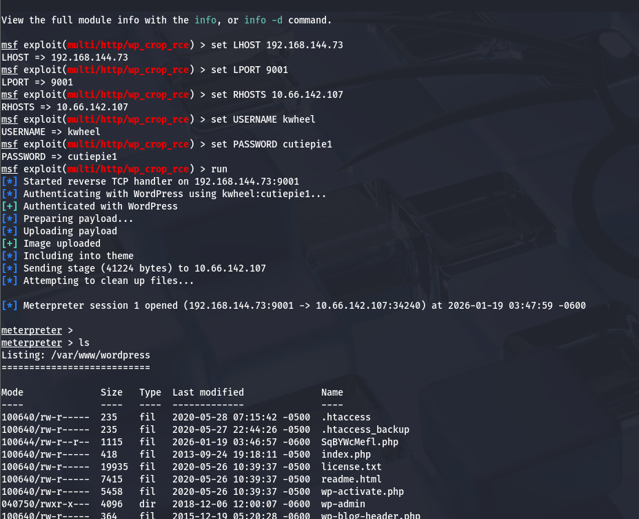
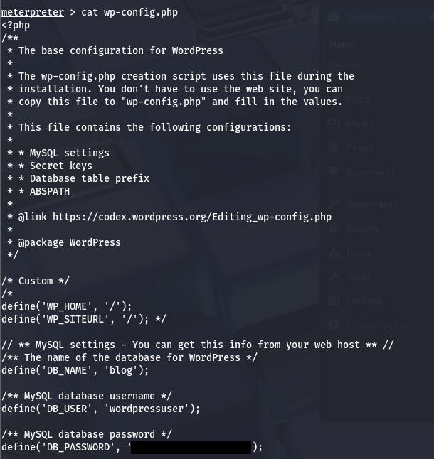
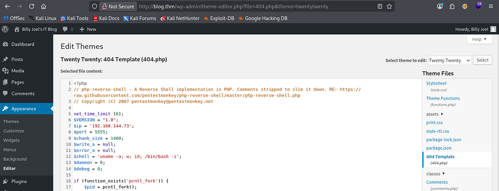
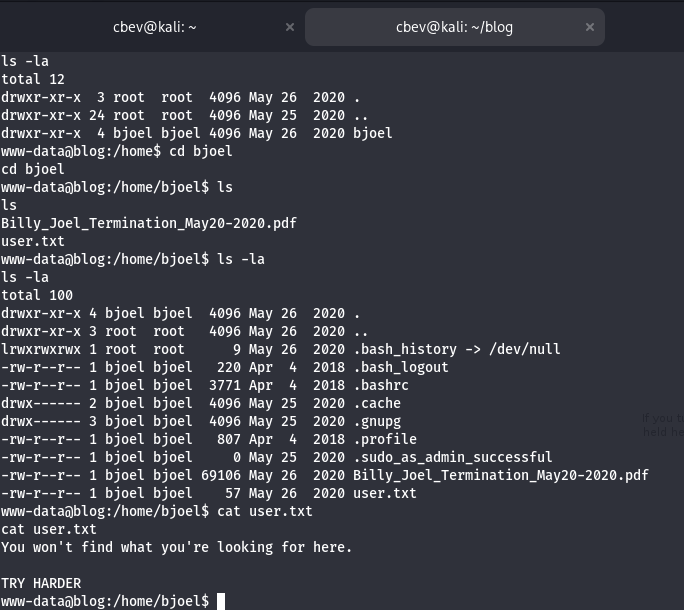
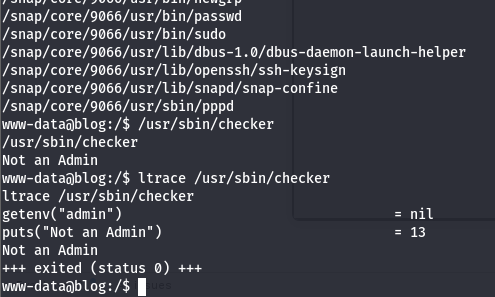
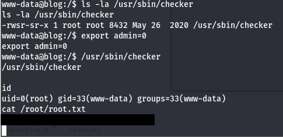
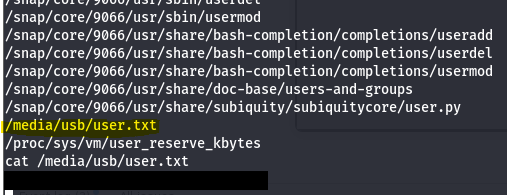

This box is rated medium difficulty on THM. It involves us brute forcing a Wordpress login, grabbing a low level shell via a known upload vulnerability, and a cool privilege escalation method to root by exploiting variables on a special binary.

_Billy Joel made a Wordpress blog!_

## Scanning & Enumeration
I kick things off with an Nmap scan on the provided IP to find running services. I also add blog.thm to my `/etc/hosts` file

```
$ sudo nmap -p22,80,139,445 -sCV 10.66.142.107 -oN fullscan-tcp

Starting Nmap 7.95 ( https://nmap.org ) at 2026-01-19 02:48 CST
Nmap scan report for blog.thm (10.66.142.107)
Host is up (0.041s latency).

PORT    STATE SERVICE     VERSION
22/tcp  open  ssh         OpenSSH 7.6p1 Ubuntu 4ubuntu0.3 (Ubuntu Linux; protocol 2.0)
| ssh-hostkey: 
|   2048 57:8a:da:90:ba:ed:3a:47:0c:05:a3:f7:a8:0a:8d:78 (RSA)
|   256 c2:64:ef:ab:b1:9a:1c:87:58:7c:4b:d5:0f:20:46:26 (ECDSA)
|_  256 5a:f2:62:92:11:8e:ad:8a:9b:23:82:2d:ad:53:bc:16 (ED25519)
80/tcp  open  http        Apache httpd 2.4.29 ((Ubuntu))
|_http-server-header: Apache/2.4.29 (Ubuntu)
|_http-title: Billy Joel&#039;s IT Blog &#8211; The IT blog
| http-robots.txt: 1 disallowed entry 
|_/wp-admin/
|_http-generator: WordPress 5.0
139/tcp open  netbios-ssn Samba smbd 3.X - 4.X (workgroup: WORKGROUP)
445/tcp open  netbios-ssn Samba smbd 4.7.6-Ubuntu (workgroup: WORKGROUP)
Service Info: Host: BLOG; OS: Linux; CPE: cpe:/o:linux:linux_kernel

Host script results:
| smb2-time: 
|   date: 2026-01-19T08:48:23
|_  start_date: N/A
|_nbstat: NetBIOS name: BLOG, NetBIOS user: <unknown>, NetBIOS MAC: <unknown> (unknown)
| smb-os-discovery: 
|   OS: Windows 6.1 (Samba 4.7.6-Ubuntu)
|   Computer name: blog
|   NetBIOS computer name: BLOG\x00
|   Domain name: \x00
|   FQDN: blog
|_  System time: 2026-01-19T08:48:23+00:00
| smb-security-mode: 
|   account_used: guest
|   authentication_level: user
|   challenge_response: supported
|_  message_signing: disabled (dangerous, but default)
| smb2-security-mode: 
|   3:1:1: 
|_    Message signing enabled but not required

Service detection performed. Please report any incorrect results at https://nmap.org/submit/ .
Nmap done: 1 IP address (1 host up) scanned in 16.30 seconds
```

There are four ports open:
- SSH on port 22
- An Apache web server on port 80
- Samba SMB on ports 139 and 445

Looks like wp-admin is a disallowed entry on robots.txt, so we know the site is running Wordpress. Before checking the webpage out, I check for guest authentication on SMB.



We have read and write permissions for a shared named BillySMB. There are three files on the share that are pretty useless for us (a QR code to a Billy Joel song, a Taylor Swift song on mp4 and an Alice in wonderland picture).

The Alice in wonderland photo has a txt file hidden with steganography in it saying we ran down a rabbit hole.

Either way, write access to this is a good find in case we're able to upload a shell later. Now let's head over to the website and run WPScan to find any vulnerabilities.

```
$ wpscan --url http://blog.thm -e u,vp,vt
_______________________________________________________________
         __          _______   _____
         \ \        / /  __ \ / ____|
          \ \  /\  / /| |__) | (___   ___  __ _ _ __ ®
           \ \/  \/ / |  ___/ \___ \ / __|/ _` | '_ \
            \  /\  /  | |     ____) | (__| (_| | | | |
             \/  \/   |_|    |_____/ \___|\__,_|_| |_|

         WordPress Security Scanner by the WPScan Team
                         Version 3.8.28
                               
       @_WPScan_, @ethicalhack3r, @erwan_lr, @firefart
_______________________________________________________________

[i] Updating the Database ...
[i] Update completed.

[+] URL: http://blog.thm/ [10.66.142.107]
[+] Started: Mon Jan 19 03:03:20 2026

Interesting Finding(s):

[+] Headers
 | Interesting Entry: Server: Apache/2.4.29 (Ubuntu)
 | Found By: Headers (Passive Detection)
 | Confidence: 100%

[+] robots.txt found: http://blog.thm/robots.txt
 | Interesting Entries:
 |  - /wp-admin/
 |  - /wp-admin/admin-ajax.php
 | Found By: Robots Txt (Aggressive Detection)
 | Confidence: 100%

[+] XML-RPC seems to be enabled: http://blog.thm/xmlrpc.php
 | Found By: Direct Access (Aggressive Detection)
 | Confidence: 100%
 | References:
 |  - http://codex.wordpress.org/XML-RPC_Pingback_API
 |  - https://www.rapid7.com/db/modules/auxiliary/scanner/http/wordpress_ghost_scanner/
 |  - https://www.rapid7.com/db/modules/auxiliary/dos/http/wordpress_xmlrpc_dos/
 |  - https://www.rapid7.com/db/modules/auxiliary/scanner/http/wordpress_xmlrpc_login/
 |  - https://www.rapid7.com/db/modules/auxiliary/scanner/http/wordpress_pingback_access/

[+] WordPress readme found: http://blog.thm/readme.html
 | Found By: Direct Access (Aggressive Detection)
 | Confidence: 100%

[+] Upload directory has listing enabled: http://blog.thm/wp-content/uploads/
 | Found By: Direct Access (Aggressive Detection)
 | Confidence: 100%

[+] The external WP-Cron seems to be enabled: http://blog.thm/wp-cron.php
 | Found By: Direct Access (Aggressive Detection)
 | Confidence: 60%
 | References:
 |  - https://www.iplocation.net/defend-wordpress-from-ddos
 |  - https://github.com/wpscanteam/wpscan/issues/1299

[+] WordPress version 5.0 identified (Insecure, released on 2018-12-06).
 | Found By: Rss Generator (Passive Detection)
 |  - http://blog.thm/feed/, <generator>https://wordpress.org/?v=5.0</generator>
 |  - http://blog.thm/comments/feed/, <generator>https://wordpress.org/?v=5.0</generator>

[+] WordPress theme in use: twentytwenty
 | Location: http://blog.thm/wp-content/themes/twentytwenty/
 | Last Updated: 2025-12-03T00:00:00.000Z
 | Readme: http://blog.thm/wp-content/themes/twentytwenty/readme.txt
 | [!] The version is out of date, the latest version is 3.0
 | Style URL: http://blog.thm/wp-content/themes/twentytwenty/style.css?ver=1.3
 | Style Name: Twenty Twenty
 | Style URI: https://wordpress.org/themes/twentytwenty/
 | Description: Our default theme for 2020 is designed to take full advantage of the flexibility of the block editor...
 | Author: the WordPress team
 | Author URI: https://wordpress.org/
 |
 | Found By: Css Style In Homepage (Passive Detection)
 | Confirmed By: Css Style In 404 Page (Passive Detection)
 |
 | Version: 1.3 (80% confidence)
 | Found By: Style (Passive Detection)
 |  - http://blog.thm/wp-content/themes/twentytwenty/style.css?ver=1.3, Match: 'Version: 1.3'

[+] Enumerating Vulnerable Plugins (via Passive Methods)

[i] No plugins Found.

[+] Enumerating Vulnerable Themes (via Passive and Aggressive Methods)
 Checking Known Locations - Time: 00:00:09 <=====================================> (652 / 652) 100.00% Time: 00:00:09
[+] Checking Theme Versions (via Passive and Aggressive Methods)

[i] No themes Found.

[+] Enumerating Users (via Passive and Aggressive Methods)
 Brute Forcing Author IDs - Time: 00:00:00 <=======================================> (10 / 10) 100.00% Time: 00:00:00

[i] User(s) Identified:

[+] kwheel
 | Found By: Author Posts - Author Pattern (Passive Detection)
 | Confirmed By:
 |  Wp Json Api (Aggressive Detection)
 |   - http://blog.thm/wp-json/wp/v2/users/?per_page=100&page=1
 |  Author Id Brute Forcing - Author Pattern (Aggressive Detection)
 |  Login Error Messages (Aggressive Detection)

[+] bjoel
 | Found By: Author Posts - Author Pattern (Passive Detection)
 | Confirmed By:
 |  Wp Json Api (Aggressive Detection)
 |   - http://blog.thm/wp-json/wp/v2/users/?per_page=100&page=1
 |  Author Id Brute Forcing - Author Pattern (Aggressive Detection)
 |  Login Error Messages (Aggressive Detection)

[+] Karen Wheeler
 | Found By: Rss Generator (Passive Detection)
 | Confirmed By: Rss Generator (Aggressive Detection)

[+] Billy Joel
 | Found By: Rss Generator (Passive Detection)
 | Confirmed By: Rss Generator (Aggressive Detection)

[!] No WPScan API Token given, as a result vulnerability data has not been output.
[!] You can get a free API token with 25 daily requests by registering at https://wpscan.com/register

[+] Finished: Mon Jan 19 03:03:35 2026
[+] Requests Done: 723
[+] Cached Requests: 10
[+] Data Sent: 180.426 KB
[+] Data Received: 23.44 MB
[+] Memory used: 287.527 MB
[+] Elapsed time: 00:00:14
```

I discover two valid usernames of `bjoel` and `kwheel`. Xmlrpc is also enabled on this site which makes it very vulnerable to brute force attacks. Doing so grants us a successful login as `kwheel`.



We can login to the site as Karen but there's not much to do as she's not an admin. There is a draft post with the title of a (maybe) random string though.



## Initial Foothold
I check Exploit-DB for any vulnerabilities in Wordpress v5.0 and find that there is a PoC for getting remote code execution via an image upload. I tried using a python script at first but that kept failing due to an "index out of range" error, so I moved to Metasploit instead.

I use the `exploit/multi/http/wp_crop_rce` module and set the local host/port, remote host, username, and password before running it to grab a shell.



I use this to dump the contents of wp-config.php, which gives me a wordpress user's password.



This password also works to sign in as bjoel at wp-admin. I don't really like the meterpreter shell so I'm going to update the site's template 404 page source code to a PHP reverse shell and continue from there. 



Now with an actual bash shell, I can use commands like find/locate to get around easier. Displaying user.txt under bjoel's home directory shows that we need to find the actual file someplace else.



## Privilege Escalation
Next, I check the usual routes for privesc and find a special binary with the SUID bit set on it. `/usr/bin/checker` displays whether we are an admin or not by getting an environment variable and outputting the current user's status.

```
find / -perm /4000 2>/dev/null
```



We can set this admin env variable to be whatever we want and execute the binary as root. I set exported the var to be 0 as a test run and it simply threw me into a bash shell as root user, that was easy!



It seems like this binary had a check like:

```
if !=admin
    print("Not an Admin")
else
    /bin/sh
```

Not sure what real use this could serve but it's definitely a cool way to pop a root shell. To find the user flag I end up running:

```
find / -type f -name user* 2>/dev/null
```

This shows it was hiding inside of /media/usb, which is a very fitting place for this box's theme. That finishes out the box!



Thanks to Nameless0ne for making another great challenge, I really enjoyed this one. I hope this was helpful to anyone stuck or following along and happy hacking!
