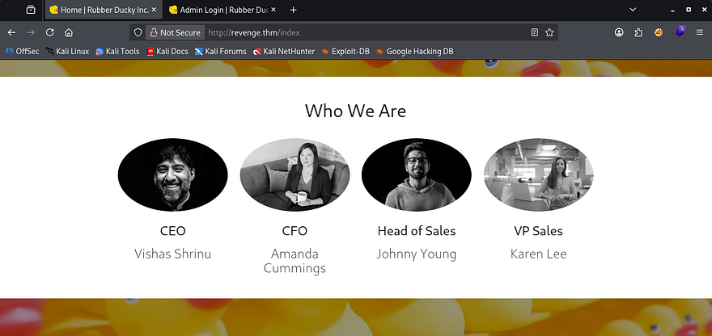
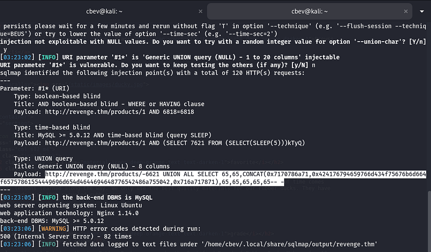
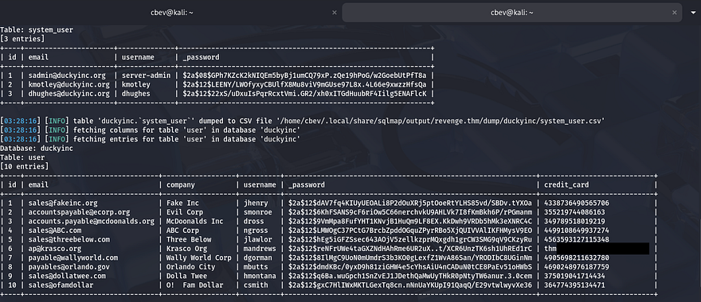
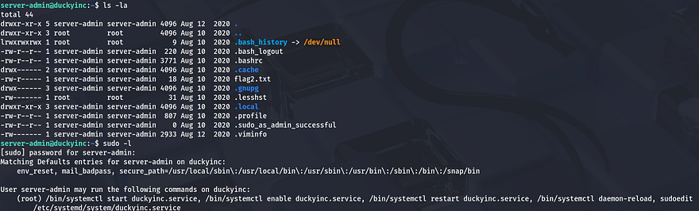
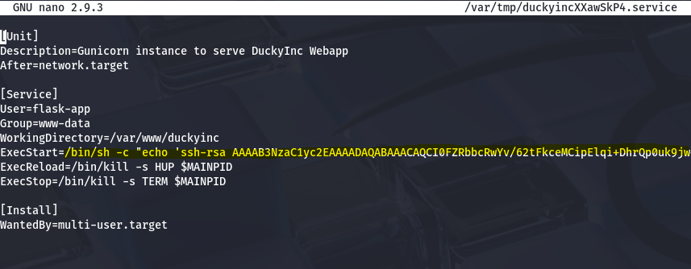
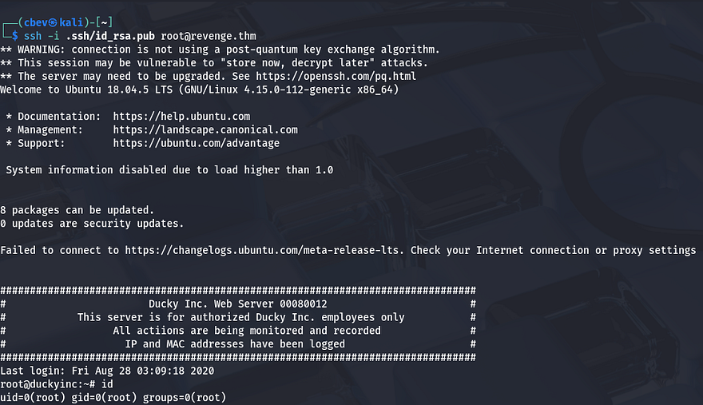
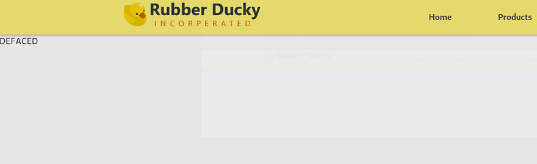

This box is rated medium difficulty on THM and is the sequel to Blog. It has a pretty funny storyline as after we hacked his blog page, Billy Joel makes a shady contract with us to deface the website of the company that just fired him.

It involves us exploiting a SQLi vulnerability on the main webpage to dump user credentials and abusing Sudo privileges on systemctl with the web server to grab a root shell. 

_You've been hired by Billy Joel to get revenge on Ducky Inc…the company that fired him. Can you break into the server and complete your mission?_

## Scanning & Enumeration
Let's kick things off with an Nmap scan against the given IP to find running services on the live host.

```
$ sudo nmap -p22,80 -sCV 10.65.167.50 -oN fullscan-tcp

Starting Nmap 7.95 ( https://nmap.org ) at 2026-01-21 02:55 CST
Nmap scan report for 10.65.167.50
Host is up (0.039s latency).

PORT   STATE SERVICE VERSION
22/tcp open  ssh     OpenSSH 7.6p1 Ubuntu 4ubuntu0.3 (Ubuntu Linux; protocol 2.0)
| ssh-hostkey: 
|   2048 72:53:b7:7a:eb:ab:22:70:1c:f7:3c:7a:c7:76:d9:89 (RSA)
|   256 43:77:00:fb:da:42:02:58:52:12:7d:cd:4e:52:4f:c3 (ECDSA)
|_  256 2b:57:13:7c:c8:4f:1d:c2:68:67:28:3f:8e:39:30:ab (ED25519)
80/tcp open  http    nginx 1.14.0 (Ubuntu)
|_http-title: Home | Rubber Ducky Inc.
|_http-server-header: nginx/1.14.0 (Ubuntu)
Service Info: OS: Linux; CPE: cpe:/o:linux:linux_kernel

Service detection performed. Please report any incorrect results at https://nmap.org/submit/ .
Nmap done: 1 IP address (1 host up) scanned in 8.38 seconds
```

There are just two ports open:
- SSH on port 22
- An nginx web server on port 80

That OpenSSH version is only prone to username enumeration so let's head on over to the webpage. I fire up subdirectory/subdomain searches in the background to save on time.

Checking the landing page gives us a few names of organization members. The page also seems like it's static as the login panel doesn't respond whatsoever.



Gobuster finds an admin login panel and a /static/ directory that returns a 403 Forbidden code.

Checking all parts of the website shows something interesting on the products tab. I originally though of an IDOR vulnerability through URL fuzzing but that returned nothing. However, with all good products on a website, there was an stock notifier. This meant the site was querying a database in order to check how much was left.

## Initial Foothold
I test for special characters and get a 500 internal server error in return, hinting that it may be prone to SQLi. Sending that to SQLMap confirms my suspicions and we can enumerate the DB using a UNION query.



Dumping the database gives us password hashes for three users in the system_user table as well as our first flag in the user table.



Sending those over to JohnTheRipper or Hashcat will give us the plaintext password for the server-admin user and we can login on SSH.

## Privilege Escalation
We can grab the second flag in their home dir and start looking for ways to grab root and deface the webpage. Listing Sudo commands show that we have full Sudo permissions on the systemctl binary for duckyinc.service.



Since we can sudoedit the duckyinc.service file, we're able to use it to echo our SSH public key into /root/.ssh/authorized_keys . [GTFOBins](https://gtfobins.org/gtfobins/systemctl/#shell) has a good method for this. Change the ExecStart line to the following:

```
/bin/sh -c "echo '<SSH_PUB_KEY>' >> /root/.ssh/authorized_keys"
```



Now we can reload the daemons and restart the duckyinc.service, letting us SSH into the box again as root.

```
$ sudo /bin/systemctl daemon-reload
$ sudo /bin/systemctl restart duckyinc.service
```



Now we can change the `/var/www/duckyinc/templates/index.html` file to be whatever we want and grab the root flag in our home dir.



This was a pretty fun box, I'd like to see more in this Billy Joel saga. I hope this was helpful to anyone following along or stuck and happy hacking!
